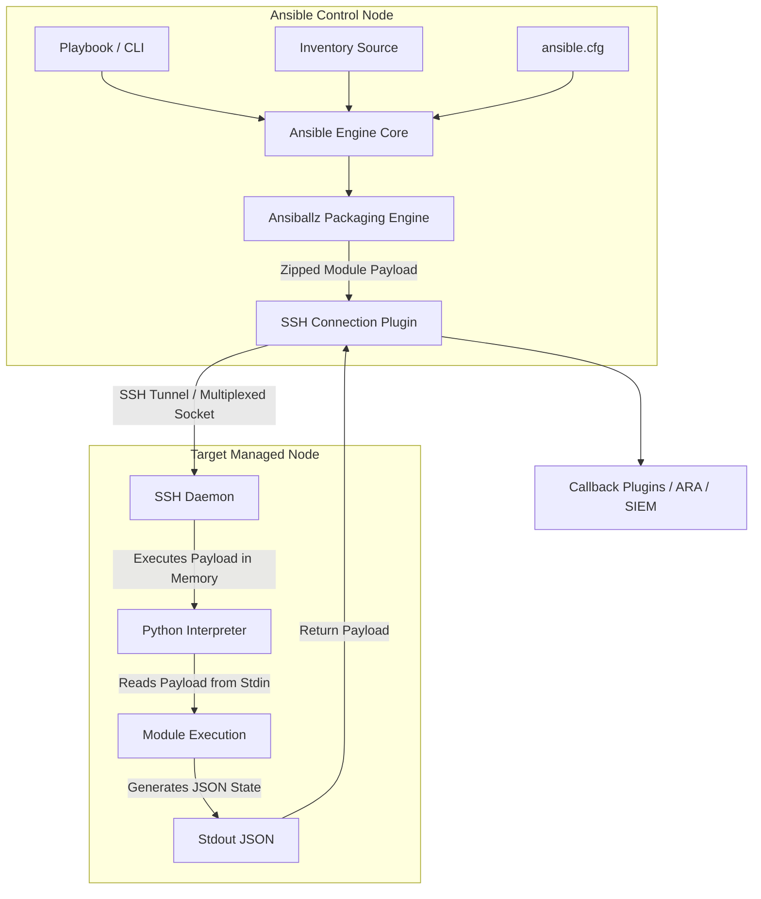

# Ansible - Part 1 - Technical Study Guide & Notes

# Enterprise DevOps & Cloud Study Guide
## Ansible Core Foundations, Topologies, & Hardening (Part 1/3)

---

## 1. Part Introduction and Scope

This study guide is designed for senior engineers, SREs, and cloud architects aiming for expert-level mastery of Ansible. 

Part 1 focuses on **Core Foundations, Topologies, Configurations, and Core Command Mechanics**. It covers the fundamental architecture of the Ansible engine, the mechanics of agentless execution, control node design, inventory architectures, and security-hardened configurations.

### Scope of Part 1

```
+---------------------------------------------------------------------------------+
|                                 ANSIBLE PART 1                                  |
+---------------------------------------------------------------------------------+
|  - Engine Internals & Execution Mechanics (Ansiballz, Pipelining)              |
|  - Control Node Bootstrapping & Target Node Prerequisites                       |
|  - Enterprise Inventory Architectures (Static, Nested, Dynamic)                 |
|  - Hardened Configuration (ansible.cfg, SSH multiplexing, ControlPersist)       |
|  - CLI Deep Dive & Diagnostic Flags                                             |
|  - Enterprise Security, Privilege Escalation, & Cryptographic Hardening         |
|  - Observability, Fact Caching, & Performance Tuning (Forks, Redis Cache)       |
|  - Execution Environments (EEs) & Tool Integrations                             |
+---------------------------------------------------------------------------------+
```

---

## 2. Why Core Foundations are Critical for High-Availability Systems

In high-availability (HA) and large-scale enterprise environments, configuration management is not just about writing playbooks; it is about **predictability, performance, and security at scale**. 

### Deterministic Execution & Preventing Configuration Drift
In an HA cluster (e.g., active-active database clusters, Kubernetes control planes), configuration drift across nodes can lead to split-brain scenarios, routing failures, or state mismatch. Ansible’s foundational execution model relies on **idempotency**. Understanding how the engine parses states and checks differences (`--check` and `--diff`) ensures that systems are brought to their desired state deterministically without causing service disruptions.

### Control Node Resource Management & Starvation
When orchestrating configurations across thousands of target nodes simultaneously, an improperly configured control node can experience resource exhaustion (CPU, memory, or file descriptor limits). Understanding the mechanics of **forks**, **SSH multiplexing (ControlPersist)**, and **pipelining** is critical to preventing the control node from running out of file descriptors or memory during critical deployments.

### Blast Radius Mitigation
An insecure or poorly designed Ansible infrastructure can become a single point of failure and a primary vector for lateral movement during a security breach. If the control node is compromised, or if privilege escalation (`become`) is misconfigured, an attacker can gain root access to the entire infrastructure. Hardening the core transport layer (SSH/WinRM), implementing strict privilege boundaries, and securing credential storage are essential requirements for any high-availability system.

---

## 3. Real-World Enterprise Use Cases

### Use Case 1: Zero-Trust OS Hardening & Compliance Auditing
* **Scale**: 5,000+ Hybrid Cloud Virtual Machines (AWS EC2, Azure VMs, and On-Premises VMware vSphere).
* **Objective**: Apply CIS (Center for Internet Security) Level 1 benchmarks daily, audit drift, and remediate non-compliant configurations without manual intervention.
* **Architecture Detail**: The control node runs in a secured Management VPC. It utilizes an **AWS EC2 Dynamic Inventory** plugin to fetch instances based on tags (`Env: Production`, `OS: RHEL9`). It connects via hardened SSH using ED25519 keys stored in a Hardware Security Module (HSM) or HashiCorp Vault. Execution telemetry is piped to a centralized SIEM via callback plugins.

```
                  +------------------------+
                  |  Management VPC        |
                  |  Ansible Control Node  |
                  +-----------+------------+
                              |
         +--------------------+--------------------+
         | (Secure SSH Tunnel / ED25519 Keys)      |
         v                                         v
+------------------------+               +------------------------+
| AWS EC2 Instances      |               | On-Premises VMware VMs |
| (Dynamic Inventory)    |               | (Static/Dynamic IP)    |
| - CIS Hardened RHEL9   |               | - CIS Hardened RHEL9   |
+------------------------+               +------------------------+
```

### Use Case 2: Multi-Region Bootstrap of Bare-Metal Hypervisors
* **Scale**: 200+ Bare-Metal Servers across 4 global edge data centers.
* **Objective**: Bootstrap newly provisioned physical servers (via PXE) with initial hypervisor OS, network bonding configurations, local storage pools, and security certificates.
* **Architecture Detail**: Ansible works in tandem with an Out-of-Band (OOB) management platform. Ansible uses local connection plugins to talk to IPMI/Redfish APIs, boots the server, waits for SSH availability, and then switches to the standard SSH connection plugin to configure network interfaces, LVM partitions, and systemd services.

---

## 4. Comprehensive Architecture Explanation

Ansible operates on an **agentless, push-based model**. Unlike agent-based tools (such as Chef or Puppet) that require a daemon to run continuously on target nodes, Ansible connects to target systems, pushes ephemeral execution units, runs them, and cleans up afterward.

### Detailed Execution Flow (The "Ansiballz" Engine)
When you execute an Ansible playbook or ad-hoc command, the following sequence occurs under the hood:

1. **Inception & Parsing**: The Ansible engine on the Control Node parses the playbook, resolves variable precedence, evaluates templates (Jinja2), and filters the inventory to build the execution graph.
2. **Module Packaging (Ansiballz)**: Ansible packages the target module (e.g., the `apt` or `template` module written in Python) along with its arguments and dependent utility libraries into a single, zipped, self-executing Python file. This system is known as **Ansiballz**.
3. **Transport**: The connection plugin (typically `ssh`) opens a connection to the target host.
4. **Without Pipelining**:
   * The zipped module is transferred to a temporary directory on the target disk (typically `~/.ansible/tmp/`).
   * Ansible issues another SSH command to mark the file executable and run it using the target's Python interpreter.
5. **With Pipelining Enabled**:
   * The zipped module is piped directly into the stdin of the remote Python interpreter process over the SSH connection. No temporary file is written to the target disk, which reduces disk I/O and cuts down the number of SSH operations from four to one.
6. **Execution & Return**: The module executes on the target node, captures system state changes, and formats the result as a JSON string. This JSON payload is written to stdout.
7. **Cleanup**: If pipelining was not used, Ansible deletes the temporary files from the target disk. The connection is closed (or returned to the ControlPersist socket pool).
8. **Parsing on Control Node**: The Control Node reads the JSON payload from stdout, updates its execution state (e.g., `ok`, `changed`, `failed`), and triggers configured callback plugins (e.g., logging, metrics).

### Architecture Diagram



---

## 5. Types, Classifications, and Components

To design a scalable Ansible infrastructure, you must understand the classifications of its core components.

### 1. Inventory Types
* **Static Inventories**: Written in INI or YAML format. These are best suited for small, immutable infrastructures where IP addresses and hostnames rarely change.
* **Dynamic Inventories**: Driven by inventory plugins (not legacy scripts). These query external sources of truth (AWS, Azure, GCP, NetBox, VMware, OpenStack) in real-time. They dynamically group hosts based on metadata tags, power states, and network interfaces.

### 2. Connection Plugins
* **`ssh` (Default)**: OpenSSH-based transport. It supports advanced SSH features like multiplexing (`ControlMaster`), custom SSH configuration files, and jump hosts.
* **`paramiko`**: A Python implementation of SSHv2. It is slower than native OpenSSH and lacks support for multiplexing, but it is useful on legacy control nodes where OpenSSH is unavailable.
* **`winrm`**: Windows Remote Management. It is used to execute PowerShell and CMD commands on Windows targets, typically over HTTPS (port 5986) with Kerberos or NTLM authentication.
* **`local`**: Executes modules directly on the control node. This is useful for orchestrating cloud APIs, managing local files, or triggering external API calls.
* **`network_cli` / `netconf`**: Optimized connections for network appliances (Cisco, Juniper, Arista) where a standard interactive shell or Python interpreter is unavailable.

### 3. Privilege Escalation (`become`) Methods
* **`sudo`**: The standard for Linux/Unix systems.
* **`su`**: Switches user accounts directly (requires the target user's password).
* **`pbrun`**: PowerBroker privilege manager, commonly used in highly locked-down enterprise financial environments.
* **`doas`**: A modern, lightweight alternative to `sudo` found in BSD and some minimal Linux distributions.

---

## 6. Step-by-Step Production Implementation Guide

This guide details how to build a production-ready Ansible control node on **Enterprise Linux 9 (RHEL/Rocky Linux)** and configure it to manage target hosts securely.

### Step 1: Install Control Node Prerequisites and Dependencies
Run the following commands on the control node to install Python 3.11, OpenSSH clients, and the Ansible core engine.

```bash
# Update system repositories and install core tools
sudo dnf update -y
sudo dnf install -y python3.11 python3-pip openssh-clients git sshpass

# Create a dedicated system group and user for Ansible execution
sudo groupadd --system ansible
sudo useradd --system -g ansible -m -s /bin/bash -c "Ansible Service Account" ansiblesvc

# Switch to the service account
sudo -u ansiblesvc -i

# Set up a Python Virtual Environment to isolate Ansible dependencies
python3.11 -m venv ~/ansible-env
source ~/ansible-env/bin/activate

# Upgrade pip and install Ansible-Core and required Python libraries
pip install --upgrade pip
pip install ansible-core==2.16.5 cryptography pexpect
```

### Step 2: Configure the Dedicated Ansible Service Account on Target Nodes
Execute these commands on **each target node** to provision a matching service account and configure secure privilege escalation.

```bash
# Create the service account on the target
sudo groupadd --system ansiblesvc
sudo useradd --system -g ansiblesvc -m -s /bin/bash ansiblesvc

# Configure hardened sudo access (allow only specific Ansible operations, or restrict to promptless sudo with secure logs)
# Using 'visudo' is recommended to prevent syntax errors
echo "ansiblesvc ALL=(ALL) NOPASSWD: ALL" | sudo tee /etc/sudoers.d/99-ansiblesvc
sudo chmod 0440 /etc/sudoers.d/99-ansiblesvc
```

### Step 3: Set Up Hardened SSH Key Infrastructure
Generate a secure SSH key pair on the control node and distribute it to the target nodes.

```bash
# On the Control Node (as ansiblesvc inside the virtualenv)
# Generate a high-entropy Ed25519 key pair with a comment
ssh-keygen -t ed25519 -a 100 -C "ansible-control-prod-01" -f ~/.ssh/id_ed25519 -N ""

# Secure the local SSH directory permissions
chmod 700 ~/.ssh
chmod 600 ~/.ssh/id_ed25519
chmod 644 ~/.ssh/id_ed25519.pub

# Distribute the public key to target nodes (replace target_ip with your target node's IP)
# In production, this is typically handled during VM provisioning via Cloud-Init or PXE kickstart
ssh-copy-id -i ~/.ssh/id_ed25519.pub ansiblesvc@target_ip
```

### Step 4: Construct a Production-Ready Multi-Environment Inventory Layout
Organize your inventory to support multiple environments (e.g., staging and production) with clear variable boundaries.

```bash
# Create directory structure
mkdir -p ~/ansible-infra/{inventories/production/group_vars,playbooks,roles}
cd ~/ansible-infra

# Create the production hosts inventory file
cat << 'EOF' > inventories/production/hosts.yaml
all:
  children:
    webservers:
      hosts:
        web-node-01.prod.internal:
          ansible_host: 10.100.10.11
        web-node-02.prod.internal:
          ansible_host: 10.100.10.12
    dbservers:
      hosts:
        db-node-01.prod.internal:
          ansible_host: 10.100.20.11
        db-node-02.prod.internal:
          ansible_host: 10.100.20.12
  vars:
    ansible_user: ansiblesvc
    ansible_ssh_private_key_file: ~/.ssh/id_ed25519
EOF

# Create group variables for webservers
cat << 'EOF' > inventories/production/group_vars/webservers.yaml
---
http_port: 443
enable_tls: true
nginx_worker_connections: 1024
EOF

# Create group variables for dbservers
cat << 'EOF' > inventories/production/group_vars/dbservers.yaml
---
db_port: 5432
postgresql_shared_buffers: "4GB"
EOF
```

### Step 5: Execute Diagnostics and Verification
Verify connectivity and check the execution state of your target nodes.

```bash
# Verify the inventory structure
ansible-inventory -i inventories/production/hosts.yaml --graph

# Execute the ping module to test connection and Python availability
ansible all -i inventories/production/hosts.yaml -m ping

# Gather system information (facts) from a specific target group
ansible webservers -i inventories/production/hosts.yaml -m setup -a "filter=ansible_distribution*"
```

---

## 7. Standard CLI Commands with Deep Technical Explanations

### 1. `ansible`
This command is used to run ad-hoc tasks. It executes a single module on a defined set of target hosts.

```bash
ansible webservers \
  -i inventories/production/hosts.yaml \
  -m apt \
  -a "name=nginx state=present update_cache=yes" \
  -u ansiblesvc \
  --become \
  --become-user root \
  -f 50 \
  -vvvv
```

* **`-i inventories/production/hosts.yaml`**: Specifies the path to the inventory file or dynamic inventory plugin configuration.
* **`-m apt`**: Specifies the module to run on target nodes.
* **`-a "..."`**: Passes arguments directly to the specified module.
* **`-u ansiblesvc`**: Defines the remote SSH user to connect as.
* **`--become`**: Tells Ansible to use privilege escalation (defaults to `sudo`).
* **`--become-user root`**: Specifies the target user for privilege escalation (defaults to `root`).
* **`-f 50`**: Sets the number of concurrent worker processes (**forks**) to use. This overrides the default value of `5` defined in `ansible.cfg`.
* **`-vvvv`**: Enables maximum verbosity level 4. This prints all SSH connection negotiations, temporary script paths, stdout/stderr streams, and execution timings.

### 2. `ansible-playbook`
This command executes structured playbooks containing multiple tasks and roles.

```bash
ansible-playbook playbooks/deploy-app.yaml \
  -i inventories/production/hosts.yaml \
  --check \
  --diff \
  --limit "web-node-01.prod.internal" \
  --tags "nginx,ssl" \
  --skip-tags "debug" \
  -e "app_version=1.4.2 database_host=10.100.20.11"
```

* **`--check`**: Runs the playbook in dry-run mode. Modules will predict changes without making modifications on the target hosts.
* **`--diff`**: Displays the exact changes made to templates, configuration files, and line replacements. This is often combined with `--check` for pre-deployment audits.
* **`--limit "..."`**: Restricts playbook execution to a subset of hosts defined in the inventory (e.g., a single host, a IP range, or a group wildcard).
* **`--tags "nginx,ssl"`**: Executes only the tasks or roles tagged with `nginx` or `ssl`.
* **`--skip-tags "debug"`**: Skips tasks tagged with `debug`.
* **`-e "..."`**: Defines extra variables with the highest precedence, overriding any variables defined in playbooks, roles, or inventory files.

### 3. `ansible-inventory`
This command is used to query, view, and troubleshoot inventory structures.

```bash
ansible-inventory -i inventories/production/hosts.yaml --list --yaml
```

* **`--list`**: Outputs all hosts, groups, and associated variables in JSON format.
* **`--yaml`**: Formats the output as YAML instead of JSON, making it easier for operators to read.

### 4. `ansible-config`
This command helps inspect, verify, and troubleshoot active configuration settings.

```bash
ansible-config dump | grep -i pipelining
```

* **`view`**: Displays the active `ansible.cfg` file.
* **`dump`**: Outputs the current configuration state, showing where each setting was defined (e.g., environment variables, `ansible.cfg`, or system defaults).
* **`list`**: Lists all available configuration settings along with their default values, descriptions, and environment variable overrides.

---

## 8. Production Configuration Examples

### Security-Hardened `ansible.cfg`
Place this file in the root of your Ansible project directory. Ansible will automatically load it, overriding global configurations in `/etc/ansible/ansible.cfg`.

```ini
[defaults]
# --- General Execution Settings ---
# Default to our custom inventory path
inventory = ./inventories/production/hosts.yaml

# Set the concurrency limit (forks) based on control node resources
forks = 50

# Prevent interactive prompts during automated runs
ask_pass = False

# Ensure roles are loaded from predictable paths
roles_path = ./roles

# Enable explicit gathering of system facts (use smart to cache them)
gathering = smart
fact_caching = redis
fact_caching_connection = localhost:6379:0
fact_caching_timeout = 86400

# --- Security & Hardening ---
# Enable host key checking to prevent Man-in-the-Middle (MitM) attacks
host_key_checking = True

# Disable the generation of retry files (.retry) which clutter the filesystem
retry_files_enabled = False

# Restrict the use of world-writable directories for temporary storage
remote_tmp = ~/.ansible/tmp
local_tmp  = ~/.ansible/tmp

# Configure secure callback plugins for execution profiling
callbacks_enabled = ansible.posix.profile_tasks, ansible.posix.timer

# --- Logging & Auditing ---
# Log all execution outputs to a dedicated file for auditing
log_path = /var/log/ansible/ansible-execution.log

[privilege_escalation]
# --- Privilege Escalation Hardening ---
become = True
become_method = sudo
become_user = root
become_ask_pass = False

[ssh_connection]
# --- High-Performance & Hardened SSH Transport ---
# Enable pipelining to execute modules in memory (reduces SSH overhead)
pipelining = True

# Configure SSH connection multiplexing (ControlMaster)
# This keeps the SSH connection open for subsequent tasks, reducing handshake latency
ssh_args = -C -o ControlMaster=auto -o ControlPersist=1800s -o StrictHostKeyChecking=yes -o KexAlgorithms=curve25519-sha256@libssh.org -o Ciphers=chacha20-poly1305@openssh.com,aes256-gcm@openssh.com

# Define the control path for multiplexed sockets
# Keep the path short to prevent hitting the 108-character UNIX socket limit
control_path = %(directory)s/ansible-ssh-%%h-%%p-%%r

# Set the connection timeout
timeout = 30
```

### Production Dynamic Inventory Configuration (`aws_ec2.yaml`)
This configuration uses the `amazon.aws.aws_ec2` plugin to dynamically query EC2 instances. It groups them by environment and application tags while ignoring stopped instances.

```yaml
---
plugin: amazon.aws.aws_ec2
regions:
  - us-east-1
  - us-west-2

# Define which authentication mechanism to use (IAM Role is preferred in production)
auth_kind: env

# Filter instances to reduce inventory parsing overhead
filters:
  instance-state-name:
    - running
  tag:Owner: "DevOps-Core"

# Construct hostnames based on private DNS names
hostnames:
  - private-dns-name

# Group hosts dynamically based on AWS Tags
keyed_groups:
  - key: tags.Environment
    prefix: env
  - key: tags.Application
    prefix: app
  - key: placement.region
    prefix: region

# Set global variables for all discovered hosts
compose:
  ansible_user: cast_system_user
  ansible_ssh_common_args: "'-o ProxyCommand=\"ssh -W %h:%p -q bastion.prod.internal\"'"
```

---

## 9. Security Considerations & Hardening Best Practices

### 1. SSH Transport Hardening
* **Disable Password Authentication**: Force the use of SSH keys. Ensure `/etc/ssh/sshd_config` on all target nodes contains `PasswordAuthentication no`.
* **Use Modern Cryptographic Ciphers**: Enforce strong key-exchange algorithms and ciphers on both the control node and target nodes:
  * **KexAlgorithms**: `curve25519-sha256@libssh.org`, `diffie-hellman-group16-sha512`
  * **Ciphers**: `chacha20-poly1305@openssh.com`, `aes256-gcm@openssh.com`
* **Utilize SSH Jump Hosts (Bastions)**: Avoid exposing target nodes to the public internet. Access them through a bastion host configured in your SSH arguments:
  ```ini
  ssh_args = -o ProxyCommand="ssh -W %h:%p -q bastion.domain.com"
  ```

### 2. Privilege Escalation Hardening
* **Restrict Sudo Policies**: Avoid using `ALL=(ALL) NOPASSWD: ALL` for your Ansible service account. Instead, limit access to the specific commands and binary paths required for your playbooks, or use central policy engines like IPA/Active Directory SSSD.
* **Protect the `become` Password**: If you must use a sudo password, do not store it in plain text. Pass it at runtime using `--ask-become-pass` or fetch it from a secure credential store.

### 3. Securing Credentials with Ansible Vault
Ansible Vault encrypts sensitive variables, files, or entire playbooks using AES-256 encryption.

```bash
# Create a new encrypted file containing database credentials
ansible-vault create inventories/production/group_vars/db_secrets.yaml

# Inside the editor, define your sensitive variables:
# db_root_password: "SuperSecretSecurePassword2024!"

# Edit an existing encrypted file
ansible-vault edit inventories/production/group_vars/db_secrets.yaml

# Run a playbook that requires vault decryption
ansible-playbook playbooks/deploy-app.yaml \
  -i inventories/production/hosts.yaml \
  --vault-id @prompt
```

In automated CI/CD pipelines, avoid interactive prompts. Instead, read the vault password from a secure file or environment variable:

```bash
# Run using a vault password file (ensure the file has 'chmod 400' permissions)
ansible-playbook playbooks/deploy-app.yaml --vault-password-file /run/secrets/vault_pass.txt
```

---

## 10. Observability & Monitoring Considerations

Monitoring your configuration management runs is essential for tracking deployment duration, detecting failed tasks, and auditing changes.

### 1. Execution Profiling Callback Plugins
Enable the `profile_tasks` and `timer` plugins in your `ansible.cfg` to identify slow tasks and bottlenecks:

```ini
[defaults]
callbacks_enabled = ansible.posix.profile_tasks, ansible.posix.timer
```

When you run a playbook, Ansible will output a breakdown of execution times for each task:

```
Tuesday 15 October 2024  14:22:10 +0000 (0:00:02.105)       0:00:10.450 *******
===============================================================================
apt: Install Nginx ------------------------------------------------------ 5.21s
template: Configure Nginx VirtualHost ----------------------------------- 1.12s
service: Start Nginx ---------------------------------------------------- 0.85s
```

### 2. Centralized Log Aggregation
Configure Ansible to send execution logs to your SIEM or centralized log management platform (e.g., Splunk, Datadog, ELK):

* Set `log_path = /var/log/ansible/ansible.log` in `ansible.cfg`.
* Use a log shipper (like Filebeat, FluentBit, or Logstash) to monitor this file.
* Parse the JSON payloads generated by Ansible runs to extract fields like `changed`, `failed`, `unreachable`, and task runtimes.

### 3. Monitoring Metrics to Watch
If you use tools like **ARA (Ansible Records Architecture)** or export metrics to Prometheus, monitor these key performance indicators (KPIs):

| Metric Name | Target SLA | Description |
| :--- | :--- | :--- |
| `ansible_run_duration_seconds` | < 600s (10 min) | Total execution time of a playbook run. |
| `ansible_task_failure_rate` | 0% | Number of failed tasks relative to total tasks. |
| `ansible_unreachable_hosts` | 0 | Number of target nodes that could not be reached via SSH/WinRM. |
| `ansible_connection_init_latency` | < 500ms | Time spent establishing the initial SSH handshake. |

---

## 11. Common Troubleshooting Scenarios with RCA (Root Cause Analysis) Steps

### Scenario A: SSH Connection Handshake Timeout / ControlPersist Failures
* **Symptom**: Ansible executions hang indefinitely at the beginning of a run, or fail with the error: `unix_listener: "/home/ansiblesvc/.ansible/cp/ansible-ssh-..." failed: Path too long`.
* **Root Cause Analysis (RCA)**: 
  * The UNIX socket path length limit is **108 characters** on most Linux systems.
  * If your directory structure or username is long, the auto-generated ControlPath socket path will exceed this limit, causing the SSH multiplexing handshake to fail.
* **Resolution Steps**:
  1. Open your `ansible.cfg` file.
  2. Locate the `[ssh_connection]` block.
  3. Shorten the `control_path` definition:
     ```ini
     control_path = %(directory)s/a-%%h-%%p-%%r
     ```
  4. Alternatively, point the socket directory to `/tmp`:
     ```ini
     control_path_dir = /tmp/ansible-cp
     ```

### Scenario B: Privilege Escalation Failures ("sudo: a password is required")
* **Symptom**: The playbook fails with: `Missing sudo password` or `sudo: a password is required`.
* **Root Cause Analysis (RCA)**:
  * The Ansible user on the target node does not have passwordless sudo configured in `/etc/sudoers` or `/etc/sudoers.d/`, but `become = True` is enabled in `ansible.cfg` or the playbook.
* **Resolution Steps**:
  1. SSH directly into the target node as the Ansible service account.
  2. Run `sudo -l` to check the active sudo permissions.
  3. If you see `(ALL) ALL`, passwordless sudo is not active. Edit the sudoers configuration:
     ```bash
     sudo visudo -f /etc/sudoers.d/99-ansiblesvc
     # Ensure the file contains:
     ansiblesvc ALL=(ALL) NOPASSWD: ALL
     ```
  4. Ensure the file has correct permissions (`0440`).

### Scenario C: Unreachable Hosts due to Host Key Verification Failures
* **Symptom**: Execution fails with: `Host key verification failed`.
* **Root Cause Analysis (RCA)**:
  * The target node's SSH host key does not match the entry in the control node's `~/.ssh/known_hosts` file. This often happens when target VMs are rebuilt with the same IP address.
* **Resolution Steps**:
  1. If host key verification is required (recommended for production), update the host key in your known hosts file:
     ```bash
     ssh-keygen -f "~/.ssh/known_hosts" -R "10.100.10.11"
     ssh-keyscan -H 10.100.10.11 >> ~/.ssh/known_hosts
     ```
  2. If you are in a secure, dynamic autoscaling environment where host key checking is handled out-of-band, you can temporarily disable host key checking in `ansible.cfg` (use with caution):
     ```ini
     host_key_checking = False
     ```

---

## 12. Common Mistakes and How to Avoid Them in Production

### 1. Leaving the Default Forks Count at `5`
* **The Mistake**: Running Ansible with the default `forks = 5` setting on an inventory of 500 servers. This forces Ansible to process hosts in small batches of 5, dramatically increasing deployment times.
* **How to Avoid**: Set the `forks` parameter in `ansible.cfg` to a value appropriate for your control node's resources (typically `50` to `100` for production control nodes with at least 4 vCPUs and 8GB RAM).

### 2. Not Enabling SSH Pipelining
* **The Mistake**: Leaving `pipelining = False` (the default setting). This causes Ansible to copy module files to the target disk for every single task, leading to high disk write overhead and slower runtimes.
* **How to Avoid**: Set `pipelining = True` in the `[ssh_connection]` section of your `ansible.cfg`. Ensure that `requiretty` is disabled in `/etc/sudoers` on your target nodes, as pipelining is incompatible with forced TTY allocation.

### 3. Storing Plaintext Secrets in Git Repositories
* **The Mistake**: Committing plain text API keys, passwords, or private keys to Git repositories.
* **How to Avoid**: Use Ansible Vault to encrypt all sensitive variables, or use a lookup plugin to retrieve secrets dynamically from a secure external vault (like HashiCorp Vault or AWS Secrets Manager) at runtime.

---

## 13. Enterprise-Level Recommendations

### Performance Tuning: Connection Pooling and SSH Multiplexing
In large-scale environments, establishing a new SSH connection for every task introduces significant latency. To optimize performance:

* **Enable SSH Multiplexing**: This allows subsequent tasks to reuse an existing SSH connection socket, bypassing the SSH handshake process.
* **Configure ControlPersist**: Set `ControlPersist=1800s` (30 minutes) to keep connection sockets open in the background. This ensures that subsequent playbook runs can reuse active connections immediately.

### Implement Fact Caching
Gathering host facts (via the `setup` module) is an expensive operation that runs at the start of every playbook. You can cache these facts to improve execution speeds:

* **Configure Redis Fact Caching**: Set up a local Redis instance on your control node and configure Ansible to cache facts there. This allows Ansible to retrieve system facts instantly rather than querying target nodes during every run.

```ini
[defaults]
gathering = smart
fact_caching = redis
fact_caching_connection = localhost:6379:0
fact_caching_timeout = 86400  # Cache facts for 24 hours
```

---

## 14. Advanced Concepts

### Ansible Execution Environments (EEs)
As your Ansible automation scales, managing dependencies (like Python libraries, system packages, and Ansible collections) across multiple control nodes and CI/CD runners can become challenging. **Execution Environments (EEs)** solve this by packaging everything into a standardized container image.

An Execution Environment is a container image that includes:
* **Ansible-Core**: The core execution engine.
* **Ansible Collections**: Specific integrations (e.g., `amazon.aws`, `kubernetes.core`).
* **Python Dependencies**: Libraries required by those collections (e.g., `boto3`, `openshift`).
* **System Libraries**: Binary dependencies (e.g., `openssh`, `rsync`).

```
+-------------------------------------------------------------+
|               ANSIBLE EXECUTION ENVIRONMENT                 |
|                      (OCI Container)                        |
+-------------------------------------------------------------+
|  - Base OS (e.g., Red Hat Universal Base Image - UBI 9)      |
|  - Python Runtime (3.11)                                    |
|  - Ansible-Core Engine                                      |
|  - Collections (amazon.aws, community.general, etc.)        |
|  - Python Libraries (boto3, pyyaml)                         |
|  - System Binaries (ssh, rsync, tar)                        |
+-------------------------------------------------------------+
```

You build EEs using **Ansible Builder** and a definition file (`execution-environment.yml`):

```yaml
---
version: 3

images:
  base_image:
    name: registry.redhat.io/ansible-automation-platform-24/ee-minimal-rhel9:latest

dependencies:
  galaxy:
    collections:
      - amazon.aws
      - kubernetes.core
  python:
    - boto3
    - kubernetes
  system:
    - rsync
    - openssh-clients

additional_build_steps:
  prepend_base:
    - RUN dnf upgrade -y
```

Run the build command to generate your container image:

```bash
ansible-builder build -t enterprise-ansible-ee:1.0.0
```

You can run your playbooks inside this container using **Ansible Runner**:

```bash
ansible-runner run . -p playbooks/deploy.yaml --container-image enterprise-ansible-ee:1.0.0
```

This containerized model ensures consistent execution environments across local developer machines, staging environments, and production CI/CD pipelines.

---

## 15. Integration with Other DevOps Tools

```
                     +-----------------------+
                     |   Terraform Provision |
                     +-----------+-----------+
                                 |
                                 v  (Writes State / Tags)
                     +-----------------------+
                     |  AWS EC2 / Cloud Host |
                     +-----------+-----------+
                                 |
                                 v  (Dynamic Discovery)
                     +-----------------------+
                     |  Ansible Control Node | <---+ (Fetches Secrets)
                     +-----------+-----------+     |
                                 |                 |
                                 +-----------------+
                                 |  HashiCorp Vault
                                 v
                     +-----------------------+
                     | Target Infrastructure |
                     +-----------------------+
```

### 1. Terraform Integration
The industry-standard pattern for combining Terraform and Ansible is to use them sequentially:
* **Terraform** provisions the physical infrastructure (VMs, VPCs, Security Groups, Load Balancers).
* **Ansible** configures the operating systems and deploys applications on those resources.

Avoid using Terraform's `local-exec` provisioner to run Ansible immediately after resource creation. This couples the two tools too tightly, making updates and state management difficult.

Instead, have Terraform tag resources with metadata (e.g., `Role: WebServer`, `Env: Production`). Once provisioned, use an Ansible **Dynamic Inventory Plugin** to discover those resources and configure them based on their tags.

### 2. HashiCorp Vault Integration
Instead of storing encrypted credentials inside your repository with Ansible Vault, you can retrieve secrets dynamically from HashiCorp Vault at runtime using the `hashivault` lookup plugin.

```yaml
- name: Retrieve Database Password from HashiCorp Vault
  set_fact:
    db_password: "{{ lookup('community.hashi_vault.hashi_vault', 'secret=secret/data/production/database:password') }}"
```

This keeps secrets out of your playbooks and ensures they are retrieved securely in memory during execution.

---

## 16. Comparison Tables with Competing Tools

| Feature / Metric | Ansible | SaltStack | Puppet | Chef | Terraform |
| :--- | :--- | :--- | :--- | :--- | :--- |
| **Architecture** | Agentless (Push) | Agent-based/Agentless | Agent-based (Pull) | Agent-based (Pull) | Agentless (Push) |
| **Primary Language**| YAML & Python | YAML & Python | Puppet DSL & Ruby | Ruby | HCL (HashiCorp Config) |
| **Target Audience** | SysAdmins, SREs, Devs | Enterprise SREs | System Engineers | Infrastructure Devs | Cloud Architects |
| **Execution Latency**| Low to Moderate | Extremely Low | Moderate | Moderate | Low |
| **State Management**| Procedural (Idempotent)| Declarative/Procedural| Declarative | Procedural | Declarative (Statefile)|
| **Best Use Case** | App deployment, OS config | Fast, large-scale orchestration | Legacy VM configuration | Immutable OS builds | Cloud infrastructure provisioning |

---

## 17. Visual Cheat Sheet

### Essential CLI Operations

```
+--------------------------------------------------------------------------------------------------+
|                                    ANSIBLE ENGINE CHEAT SHEET                                    |
+--------------------------------------------------------------------------------------------------+
|  COMMAND / SYNTAX                                  |  DESCRIPTION                                |
+----------------------------------------------------+---------------------------------------------+
|  ansible -m ping all                               |  Verifies SSH transport & Python on targets |
|  ansible-playbook site.yml --check --diff          |  Performs a dry-run and displays diffs      |
|  ansible-inventory --graph                         |  Visualizes active inventory hierarchy      |
|  ansible-config dump | grep -i <param>             |  Inspects active configuration settings     |
|  ansible-vault encrypt <file>                      |  Encrypts sensitive variable files          |
+----------------------------------------------------+---------------------------------------------+
|  KEY ENVIRONMENT VARIABLES                                                                       |
+----------------------------------------------------+---------------------------------------------+
|  export ANSIBLE_CONFIG=/path/to/ansible.cfg        |  Overrides default configuration path       |
|  export ANSIBLE_KEEP_REMOTE_FILES=1                |  Preserves remote temporary files for debug |
|  export ANSIBLE_STDOUT_CALLBACK=yaml               |  Sets clean, human-readable stdout format   |
+--------------------------------------------------------------------------------------------------+
```

---

## 18. Comprehensive Final Learning Summary

In Part 1 of this guide, we covered the core foundations of Ansible:

1. **The Agentless Architecture**: Understand how the **Ansiballz** engine packages modules into self-executing zip files and transfers them over SSH.
2. **Performance Tuning**: Implement **SSH Multiplexing (ControlPersist)**, set an appropriate number of **forks**, and enable **pipelining** to optimize execution speeds.
3. **Inventory Management**: Use dynamic inventory plugins to discover resources in real-time, and group hosts logically using structured variables.
4. **Security Hardening**: Secure your control node, use strong SSH ciphers, configure explicit sudo policies, and encrypt sensitive data with Ansible Vault.
5. **Execution Environments (EEs)**: Package your automation dependencies into standardized container images using Ansible Builder to ensure consistent runs.

In **Part 2**, we will build on these foundations to explore advanced playbook design, role development, variable precedence, error handling, and complex execution patterns.

### Q1. Ansible's Agentless Architecture vs. Agent-Based Systems (SaltStack, Puppet): How does Ansible bootstrap and execute code over SSH/WinRM?

**Detailed Answer**:
Unlike agent-based configuration management tools like Puppet or SaltStack—which require a running daemon (`puppet-agent` or `salt-minion`) on the target node to pull or receive instructions—Ansible utilizes an **agentless** architecture. It relies on standard, pre-existing remote administration protocols: **SSH** (Secure Shell) for POSIX-compliant systems and **WinRM** (Windows Remote Management) or **PSRP** (PowerShell Remoting Protocol) for Windows targets.

The bootstrapping and execution process of an Ansible module over SSH (using the default `ssh` connection plugin) follows a precise sequence:

1. **Connection Establishment**: Ansible opens an SSH connection to the target host. It uses connection multiplexing (`ControlMaster`/`ControlPersist` in OpenSSH) to keep the socket open across multiple tasks, minimizing handshake overhead.
2. **Payload Generation (Ansiballz)**: Ansible packages the target module (e.g., `copy`, `yum`) along with its arguments and helper classes into a single, self-contained, zipped Python script. This execution framework is known as **Ansiballz**.
3. **Payload Transfer**: The zipped payload is transferred to the remote host. By default, Ansible attempts to use **SFTP**. If SFTP is unavailable, it falls back to **SCP** or **pipelining** (if enabled in `ansible.cfg`). The file is written to a temporary directory on the remote system (typically `~/.ansible/tmp/ansible-tmp-...`).
4. **Execution**: Ansible executes the remote Python interpreter (e.g., `/usr/bin/python3`), pointing it to the transferred zip file. The zip file is unpacked in memory, the module's execution entry point is called with the passed arguments (formatted as JSON), and the module runs.
5. **Result Capture & Cleanup**: The module outputs its execution results as a JSON string to standard output (`stdout`). Ansible reads this JSON payload over the SSH channel, parses it on the control node, and then deletes the temporary directory and files on the remote target.

This design shifts the maintenance burden from the managed nodes to the control node. However, it requires that the target nodes have a compatible Python interpreter installed (Python 3.5+) and that the control node has SSH access with appropriate credentials or SSH keys.

**Production Scenario / Practical Example**:
An SRE wants to inspect the exact Python execution payload sent to a remote host to debug a custom module. By setting the environment variable `ANSIBLE_KEEP_REMOTE_FILES=1` and executing a playbook with high verbosity (`-vvv`), we can capture the remote path and analyze the executed code.

```bash
# Run the playbook while preserving remote temp files
ANSIBLE_KEEP_REMOTE_FILES=1 ansible-playbook -i inventory.ini deploy.yml -vvv
```

In the verbose output, locate the remote execution path:
```text
EXEC /bin/sh -c 'chmod u+x /home/deployer/.ansible/tmp/ansible-tmp-171000000.0-12345/Ansiballz_setup.py ...'
```

SSH into the managed node and inspect the directory:
```bash
ssh deployer@10.0.0.15
cd /home/deployer/.ansible/tmp/ansible-tmp-171000000.0-12345/
python3 Ansiballz_setup.py explode
# This unpacks the module code into a debuggable structure under ./debug_dir
```

---

### Q2. Deep Dive into `ansible.cfg`: What is the lookup order, and how do `forks`, `pipelining`, `host_key_checking`, and `control_path` impact performance and security?

**Detailed Answer**:
Ansible determines its configuration settings by searching for an `ansible.cfg` file in a strict, sequential lookup order. The first file found is loaded, and all subsequent locations are ignored (there is no merging of configuration files):

1. **`ANSIBLE_CONFIG`**: An environment variable pointing directly to the file path.
2. **`./ansible.cfg`**: Located in the current working directory from which the command is executed.
3. **`~/.ansible.cfg`**: Located in the user's home directory.
4. **`/etc/ansible/ansible.cfg`**: The global system default configuration file.

Understanding and tuning specific parameters within `ansible.cfg` is critical for scaling Ansible in enterprise networks:

* **`forks`** (Default: `5`): Controls the maximum number of parallel processes Ansible spawns to communicate with remote hosts. Increasing this value (e.g., to `50` or `100`) allows parallel execution across a larger fleet, but consumes significantly more CPU and memory on the control node.
* **`pipelining`** (Default: `False`): When set to `True`, Ansible pipes the module payload directly into the remote Python interpreter's stdin over SSH, rather than copying the file to a temporary location on disk first. This reduces the number of SSH operations required to execute a module from roughly 3 or 4 down to 1, delivering massive execution speedups. *Caveat: It requires that `requiretty` is disabled in `/etc/sudoers` on the target hosts.*
* **`host_key_checking`** (Default: `True`): Determines whether Ansible verifies the SSH host keys of remote nodes against the `known_hosts` file. Setting this to `False` prevents playbooks from hanging on interactive prompts when connecting to new instances (common in auto-scaled environments), but exposes the control node to potential Man-in-the-Middle (MitM) attacks.
* **`control_path`** (Default: `%(directory)s/ansible-ssh-%%h-%%p-%%r`): Configures the path where OpenSSH stores Unix domain sockets for connection multiplexing (`ControlMaster`). If paths are too long (exceeding the operating system's 108-character limit for Unix sockets), SSH connections will fail. Customizing this to a shorter path (e.g., `/tmp/ans-%%h`) prevents socket path overflow errors.

**Production Scenario / Practical Example**:
Below is an enterprise-grade `ansible.cfg` optimized for managing a fleet of 500+ AWS EC2 instances securely and rapidly:

```ini
[defaults]
inventory = ./inventories/production/
forks = 50
host_key_checking = True
roles_path = ./roles
interpreter_python = auto_silent

[ssh_connection]
pipelining = True
ssh_args = -o ControlMaster=auto -o ControlPersist=1800s -o PreferredAuthentications=publickey
control_path = %(directory)s/as-%%h-%%p-%%r
control_path_dir = /tmp/.ansible/cp
```

---

### Q3. Ansible Inventory Management: How do you construct a multi-source dynamic inventory, and how does Ansible resolve variable merging between `group_vars` and `host_vars`?

**Detailed Answer**:
In large-scale cloud environments, hardcoded static inventories are an anti-pattern. Ansible supports **multi-source inventories** by passing a directory to the `-i` parameter instead of a single file. This directory can contain a mix of static files (YAML/INI) and dynamic inventory plugins (e.g., `aws_ec2`, `azure_rm`, `gcp_compute`).

Ansible parses all files in the inventory directory. Dynamic inventory plugins query cloud APIs and return JSON payloads representing the current state of infrastructure, grouping instances by attributes like tags, VPC IDs, or regions.

When variables are defined across multiple sources, Ansible resolves them using a deterministic hierarchical merging model. For inventory-defined variables, the resolution hierarchy (from lowest precedence to highest precedence) is:

1. **`all` group variables**: Defined in `group_vars/all.yml` or within the inventory file under the `all` group.
2. **Parent group variables**: Variables defined for groups that contain other subgroups.
3. **Child group variables**: Variables defined for subgroups. If a host belongs to multiple groups at the same depth, Ansible resolves ties alphabetically by group name.
4. **Host-specific variables**: Variables defined in `host_vars/<hostname>.yml` or directly inline within the inventory file for a specific host. Host-level variables *always* override group-level variables.

**Production Scenario / Practical Example**:
We configure a multi-source inventory directory containing an AWS EC2 dynamic inventory plugin and a static inventory file for on-premises fallback hosts.

**Directory Structure**:
```text
inventory/
├── 01-aws_ec2.yml       # Dynamic EC2 plugin
├── 02-onprem_hosts.ini  # Static fallback hosts
├── group_vars/
│   ├── all.yml          # Global settings
│   ├── aws.yml          # AWS-specific group vars
│   └── webservers.yml   # App-specific group vars
└── host_vars/
    └── prod-web-01.yml  # Override for a specific high-capacity node
```

**`inventory/01-aws_ec2.yml`**:
```yaml
plugin: aws_ec2
regions:
  - us-east-1
filters:
  tag:Environment: production
hostnames:
  - dns-name
keyed_groups:
  - key: tags.Role
    prefix: role
  - key: placement.region
    prefix: region
```

**`inventory/group_vars/webservers.yml`**:
```yaml
---
nginx_worker_processes: auto
nginx_keepalive_timeout: 65
```

**`inventory/host_vars/prod-web-01.yml`**:
```yaml
---
# Override worker processes for a massive 64-core bare-metal or bare-instance node
nginx_worker_processes: 64
```

When running a playbook, Ansible merges these sources:
```bash
ansible-playbook -i inventory/ site.yml --list-hosts
```
`prod-web-01` will receive `nginx_worker_processes: 64` due to host-variable precedence, while other hosts in the `webservers` group receive `auto`.

---

### Q4. The Ansible Execution Lifecycle: Provide a step-by-step breakdown of how Ansible parses, compiles, and executes a playbook.

**Detailed Answer**:
When you run `ansible-playbook site.yml`, Ansible initiates a multi-phase compilation and execution lifecycle. Understanding this lifecycle is critical for debugging scoping, variable evaluation, and execution failures.

```
[Playbook CLI Invocation]
         │
         ▼
[1. Parsing & Syntax Validation] ──(Fails on YAML/Schema errors)
         │
         ▼
[2. Inventory Resolution] ────────(Loads plugins & parses group_vars/host_vars)
         │
         ▼
[3. Play Compilation] ────────────(Compiles roles, blocks, and tasks into memory)
         │
         ▼
[4. Connection Pooling] ──────────(Establishes ControlMaster SSH sockets)
         │
         ▼
[5. Fact Gathering (Setup)] ──────(Executes setup module on target hosts)
         │
         ▼
[6. Task Execution Loop] ◄────────(Iterates over tasks sequentially)
   ├── A. Variable Resolution
   ├── B. Strategy Plugin (linear/free)
   ├── C. Ansiballz Payload Generation
   └── D. Remote Execution & JSON Return
         │
         ▼
[7. Handler Execution] ───────────(Flushes notified handlers at play end)
         │
         ▼
[8. Cleanup & Stats Report] ──────(Closes SSH connections, prints summary)
```

1. **Parsing and Syntax Validation**: Ansible parses the command-line arguments and loads the root playbook YAML file. It validates the syntax against its internal schema. If YAML parsing fails, execution halts immediately.
2. **Inventory Resolution**: Ansible initializes the inventory manager, evaluates dynamic inventory plugins and static files, and builds an in-memory map of hosts and groups. It then loads associated `group_vars` and `host_vars`.
3. **Play Compilation**: Ansible compiles the playbooks. It recursively expands imports (`import_playbook`, `import_role`, `import_tasks`) and processes static inclusions. It constructs an ordered list of tasks for each play. Note that dynamic inclusions (`include_tasks`, `include_role`) are *not* evaluated at this stage; they are compiled dynamically during the execution phase.
4. **Connection Pooling**: Ansible initializes the connection plugins for the targeted hosts and establishes the initial control connections (such as SSH ControlMaster sockets).
5. **Fact Gathering (The `setup` task)**: Unless `gather_facts: false` is declared in the play, Ansible implicitly prepends an execution of the `setup` module to the task list. It runs this on all targeted hosts to gather system facts (OS distribution, IP addresses, memory, disk layouts) and registers them in the `ansible_facts` namespace.
6. **Task Execution Loop (Orchestrated by the Strategy Plugin)**:
   * **Strategy Selection**: Based on the play's `strategy` (default is `linear`), Ansible decides how to step through tasks. In `linear`, it runs Task 1 on all hosts, waits for all to complete, then proceeds to Task 2. In `free`, hosts execute the entire playbook as fast as they can, independent of other hosts.
   * **Variable Resolution**: Right before a task runs, Ansible evaluates Jinja2 templates in the task's parameters. This is a "lazy evaluation"—variables are evaluated at the last possible moment.
   * **Payload Generation & Execution**: The Task Queue Manager (`TQM`) handshakes with the connection plugin, transfers the Ansiballz payload, executes it, and waits for the JSON response.
7. **Handler Execution**: If any tasks notified a handler and completed with a status of `changed`, Ansible executes the notified handlers at the end of the play (or when a `flush_handlers` meta-task is encountered).
8. **Cleanup and Statistics**: Temporary files on remote targets are destroyed. Connections are closed or left persistent based on `ControlPersist` configurations. Ansible prints the final recap screen (`ok`, `changed`, `unreachable`, `failed`, `skipped`, `rescued`, `ignored`).

**Production Scenario / Practical Example**:
We can observe this lifecycle in action by running a playbook with the `profile_tasks` callback plugin enabled. This measures the exact compile and execution time of each phase.

**`ansible.cfg`**:
```ini
[defaults]
callbacks_enabled = ansible.posix.profile_tasks, ansible.posix.timer
```

**`site.yml`**:
```yaml
---
- name: Webserver Provisioning Play
  hosts: webservers
  gather_facts: true
  tasks:
    - name: Install Nginx
      ansible.builtin.package:
        name: nginx
        state: present
```

Running this playbook outputs precise timestamps for the fact-gathering phase and individual task execution phases, allowing SREs to pinpoint bottlenecks in the compilation or execution loop.

---

### Q5. Idempotency in Ansible: How do modules achieve idempotency, and how do you design custom script tasks to guarantee idempotency?

**Detailed Answer**:
**Idempotency** is the mathematical property where an operation can be applied multiple times without changing the result beyond the initial application. In Ansible, a playbook is considered idempotent if running it once configures the system, and running it a second time produces zero changes (`changed=0`), indicating the system is already in the desired target state.

Ansible modules achieve idempotency internally by executing a three-step logic flow:
1. **State Inspection**: Query the current state of the resource on the managed node (e.g., check if package `nginx` is installed, or read the permissions of `/etc/shadow`).
2. **Difference Detection**: Compare the current state against the desired target state specified by the playbook arguments (e.g., target state is `present`, current state is `absent`).
3. **Conditional Execution**: If a difference exists, apply the change to bring the system into alignment and return `changed: true`. If no difference exists, do nothing and return `changed: false`.

When using generic execution modules like `ansible.builtin.shell`, `ansible.builtin.command`, or `ansible.builtin.script`, Ansible cannot inspect the internal state of the script. By default, these modules *always* report `changed: true`, breaking idempotency. SREs must manually design these tasks to be idempotent using the following strategies:

* **`creates`**: A parameter specifying a filename. If the file already exists on the remote system, the command is **skipped**, and it returns `changed: false`.
* **`removes`**: A parameter specifying a filename. If the file does **not** exist, the command is skipped.
* **`changed_when`**: A conditional statement that evaluates the command's stdout, stderr, or return code to determine if an actual change occurred.

**Production Scenario / Practical Example**:
An SRE needs to download and install a binary tarball, extract it, and run a database migration script. If executed naively, this task runs every time. Here is the idempotent implementation:

```yaml
---
- name: Idempotent Binary Installation and Migration
  hosts: db_servers
  vars:
    app_version: "2.4.1"
  tasks:
    - name: Download application tarball
      ansible.builtin.get_url:
        url: "https://internal.repo/app-{{ app_version }}.tar.gz"
        dest: "/tmp/app-{{ app_version }}.tar.gz"
        checksum: "sha256:e3b0c44298fc1c149afbf4c8996fb92427ae41e4649b934ca495991b7852b855"
      # get_url is natively idempotent; it checks the destination file and its checksum.

    - name: Extract application binary
      ansible.builtin.unarchive:
        src: "/tmp/app-{{ app_version }}.tar.gz"
        dest: "/usr/local/bin/"
        remote_src: true
        creates: "/usr/local/bin/app-engine" # Skip if binary already exists

    - name: Run Database Migrations
      ansible.builtin.command:
        cmd: "/usr/local/bin/app-engine --migrate"
      register: migration_output
      # The migration script outputs "No migrations to apply" if already up-to-date.
      # We parse this output to determine the true 'changed' state.
      changed_when: "'Database schema updated' in migration_output.stdout"
      failed_when: "migration_output.rc != 0"
```

---

### Q6. Variable Precedence in Ansible: Detail the hierarchy of variable resolution and explain how to debug conflicting variables.

**Detailed Answer**:
Ansible has a strict, 22-level variable precedence hierarchy. When the same variable name is defined in multiple locations, the value from the highest precedence level wins. Understanding this hierarchy prevents configuration drift and unexpected overrides.

The simplified, key levels of variable precedence (from lowest to highest) are:

```
[LOWEST PRECEDENCE]
  1. Role defaults (defined in defaults/main.yml of a role)
  2. Inventory file or script group vars
  3. Inventory group_vars/all
  4. Playbook group_vars/all
  5. Inventory group_vars/* (specific groups)
  6. Playbook group_vars/* (specific groups)
  7. Inventory file or script host vars
  8. Inventory host_vars/* (specific hosts)
  9. Playbook host_vars/* (specific hosts)
 10. Host facts / Cached facts
 11. Play vars
 12. Play vars_prompt
 13. Play vars_files
 14. Role vars (defined in vars/main.yml of a role)
 15. Block vars (only for tasks within the block)
 16. Task vars (only for the specific task)
 17. Include vars (loaded via include_vars)
 18. Registered variables (save output of tasks)
 19. Role parameters (passed when invoking a role)
 20. Block/Task parent-level variables
 21. Extra vars (passed via CLI `-e` or `--extra-vars`)
[HIGHEST PRECEDENCE]
```

To debug and trace where a variable is resolving its value, SREs use the `ansible.builtin.debug` module combined with the `ansible.builtin.assert` module, or run playbooks with the `ansible-inventory --host` tool to inspect the raw resolved variable dictionary for a specific target node.

**Production Scenario / Practical Example**:
An operator is trying to figure out why the variable `http_port` is resolving to `8080` instead of `80` on a production host `prod-web-01`.

1. **Query the inventory's view of the host**:
   ```bash
   ansible-inventory -i inventory/ --host prod-web-01
   ```
   This returns a JSON representation of all variables merged by the inventory engine. If `http_port` is `8080` here, the conflict lies in `group_vars` or `host_vars`.

2. **Inject a debug assertion task inside the playbook**:
   To find out if a task-level or role-level variable is overriding it during runtime, add an assertion and debug dump:

   ```yaml
   - name: Debug Variable Precedence Conflict
     hosts: webservers
     tasks:
       - name: Dump resolved port variable
         ansible.builtin.debug:
           msg: "The active port is: {{ http_port }}"

       - name: Assert port is correct
         ansible.builtin.assert:
           that:
             - http_port == 80
           fail_msg: "CRITICAL: http_port has been overridden. Current value is {{ http_port }}"
   ```

3. **Force a specific override via CLI**:
   If you need to guarantee a value wins regardless of any inventory or role settings, pass it as an extra variable:
   ```bash
   ansible-book -i inventory/ site.yml -e "http_port=80"
   ```

---

### Q7. Ansible Ad-Hoc Commands vs. Playbooks: When should SREs use ad-hoc commands for fleet triage, and how do you execute them safely?

**Detailed Answer**:
**Ad-hoc commands** are quick, single-task operations executed directly from the command line using the `/usr/bin/ansible` binary. They do not require writing a structured playbook. SREs use ad-hoc commands for rapid, fleet-wide triage, real-time diagnostics, or emergency patch deployments.

When executing ad-hoc commands, selecting the correct execution module is critical for safety and system stability:

* **`ansible.builtin.command`** (Default module): Executes commands directly without passing them through a shell on the target node. This is the **safest** option because it does not evaluate shell environment variables, wildcards (`*`), pipes (`|`), or redirects (`>`), preventing accidental shell injection vulnerabilities.
* **`ansible.builtin.shell`**: Executes commands through the remote shell (typically `/bin/sh`). It supports pipelines, redirection, and environment variables. This should only be used when shell features are explicitly required.
* **`ansible.builtin.raw`**: Bypasses the Ansible module subsystem entirely and pipes the raw command string directly over SSH. This is used to bootstrap systems that do not have Python installed (e.g., bare-metal OS installations or network switches).

**Safety Best Practices for Fleet Triage**:
1. **Limit Scope**: Always use pattern matching to limit the target hosts (e.g., `webservers:&production` or `dbservers[0:2]`).
2. **Dry Run**: Use the `--check` flag where possible to preview changes.
3. **Control Concurrency**: Use the `-B` (background) and `-P` (poll) flags for long-running operations, and `-f` (forks) to throttle execution.

**Production Scenario / Practical Example**:
An SRE detects a memory leak across a fleet of 200 web servers. They need to check memory fragmentation, restart a service if memory usage is critical, and gather diagnostics, all within minutes.

1. **Check memory usage across all production web servers safely**:
   ```bash
   ansible webservers:&production -i inventory/ -m ansible.builtin.command -a "free -m"
   ```

2. **Trigger a rolling restart of the service, limited to 10 hosts at a time**:
   ```bash
   ansible webservers:&production -i inventory/ -m ansible.builtin.systemd_service -a "name=nginx state=restarted" -f 10
   ```

3. **Deploy an emergency security patch to update `openssl`**:
   ```bash
   ansible all -i inventory/ -m ansible.builtin.package -a "name=openssl state=latest" --become
   ```

---

### Q8. Understanding Privilege Escalation (`become`): How does Ansible securely transition privileges at the OS level, and what are the risks of `allow_world_readable_tmpfiles`?

**Detailed Answer**:
Ansible uses the **`become`** framework to perform privilege escalation on managed nodes. This abstracts away the underlying OS-specific escalation mechanisms, allowing playbooks to use a unified interface whether the target uses `sudo`, `su`, `doas`, `pbrun`, or Windows `runas`.

When a task is marked with `become: true`, the execution flow proceeds as follows:
1. Ansible connects to the remote host as the unprivileged login user (e.g., `deployer`).
2. It generates the Ansiballz module payload.
3. It constructs an escalation wrapper command. For `sudo`, this is typically:
   ```bash
   sudo -p "[sudo password prompt]" -u root /bin/sh -c "python3 /path/to/ansible_payload.py"
   ```
4. The unprivileged user executes this wrapper. The OS validates the escalation policy (e.g., `/etc/sudoers`). If valid, the python interpreter runs the module payload with elevated privileges (`root`).

**The Security Risk of Unprivileged Sudo and Temp Files**:
By default, Ansible transfers the module payload to a temporary directory under the login user's home directory (e.g., `/home/deployer/.ansible/tmp/`).
If the target system is configured with a restrictive `umask` (e.g., `0077`), the temporary directory is only readable by the login user (`deployer`).

However, if the task escalates privileges to a **different, non-root user** (e.g., `become_user: postgres`), the `postgres` user cannot read the payload inside `/home/deployer/.ansible/tmp/` due to POSIX permission boundaries.

To resolve this, Ansible can fall back to making the temporary files world-readable (`allow_world_readable_tmpfiles = True` in `ansible.cfg`). This is a **severe security risk** on multi-tenant systems. Any local user on the managed node could read the temporary directory during the split second of execution, potentially stealing sensitive variables, private keys, or passwords passed as module arguments.

**Secure Alternatives**:
1. **Use POSIX ACLs (Access Control Lists)**: Ensure `setfacl` is installed on the target system. Ansible will automatically detect it and grant read permissions on the temp directory *only* to the `become_user`, without making it world-readable.
2. **Pipeline Execution**: Enable `pipelining = True` in `ansible.cfg`. Because the payload is piped directly into the Python interpreter's stdin over SSH, no physical temporary files are written to disk, eliminating the risk entirely.

**Production Scenario / Practical Example**:
Configuring a secure, multi-user database host where privilege escalation to the `postgres` system user is required.

**`ansible.cfg`**:
```ini
[defaults]
# Explicitly disable insecure world-readable fallback
allow_world_readable_tmpfiles = False

[ssh_connection]
# Enable pipelining to execute modules in-memory
pipelining = True
```

**`playbook.yml`**:
```yaml
---
- name: Secure Database Maintenance
  hosts: db_servers
  gather_facts: false
  tasks:
    - name: Run vacuum on production database
      community.postgresql.postgresql_db:
        name: prod_db
        state: maintain
        maintenance_op: VACUUM
      become: true
      become_user: postgres  # Safe execution via pipelining + ACLs
```

---

### Q9. Ansible Playbook Structure: What are the design practices for organizing a production-grade play with `hosts`, `gather_facts`, `pre_tasks`, `roles`, `tasks`, `post_tasks`, and `handlers`?

**Detailed Answer**:
A production-grade Ansible playbook must be organized logically to ensure predictable execution, proper error recovery, and maintainability. Ansible processes the components of a play in a strict, predefined order. Knowing this order is essential for structuring deployments:

```
[Playbook Execution Order]
       │
       ▼
1. pre_tasks (Runs before anything else)
       │
       ▼
2. Fact Gathering (If gather_facts: true)
       │
       ▼
3. Roles (Executed sequentially as defined)
       │
       ▼
4. Tasks (Standard play tasks)
       │
       ▼
5. Handlers (Flushed automatically here)
       │
       ▼
6. post_tasks (Runs after tasks and handlers)
       │
       ▼
7. Post Handlers (Flushed again if post_tasks triggered changes)
```

**Component Design Best Practices**:
* **`hosts`**: Always restrict the scope using group names rather than individual hostnames. Use logical patterns (e.g., `app_servers:&production`).
* **`gather_facts`**: Disable (`false`) if the playbook does not require system facts (e.g., only running cloud API calls or generic Docker restarts) to reduce execution time.
* **`pre_tasks`**: Used to perform actions before roles are evaluated. Common use cases include removing a node from a load balancer pool or verifying that dependencies (like a specific mount point) exist.
* **`roles`**: Encapsulated, reusable components. They should be written to perform single-responsibility infrastructure tasks (e.g., `geerlingguy.nginx`).
* **`tasks`**: Play-specific actions that glue roles together or perform host-specific configurations.
* **`post_tasks`**: Used to perform actions after all tasks and roles have run. A common use case is re-registering the node back into the load balancer pool.
* **`handlers`**: Event-driven tasks triggered by `notify`. They should only be used for service restarts, config reloads, or cache flushes.

**Production Scenario / Practical Example**:
Here is a production-grade zero-downtime application deployment play showing the correct structure:

```yaml
---
- name: Zero-Downtime Application Deployment
  hosts: webservers
  serial: 1  # Process hosts one-by-one to maintain service availability
  gather_facts: true

  pre_tasks:
    - name: Remove node from AWS Target Group (Load Balancer)
      amazon.aws.elb_target_group:
        name: prod-web-tg
        target_status: draining
        targets:
          - Id: "{{ ansible_facts['ec2_instance_id'] }}"
            Port: 80
      delegate_to: localhost
      become: false

  roles:
    - role: internal.app_deployer
      vars:
        app_version: "v2.1.0"

  tasks:
    - name: Verify application health locally
      ansible.builtin.uri:
        url: "http://localhost/health"
        status_code: 200
      register: health_check
      until: health_check.status == 200
      retries: 5
      delay: 5

  post_tasks:
    - name: Re-register node back into AWS Target Group
      amazon.aws.elb_target_group:
        name: prod-web-tg
        target_status: healthy
        targets:
          - Id: "{{ ansible_facts['ec2_instance_id'] }}"
            Port: 80
      delegate_to: localhost
      become: false
```

---

### Q10. Fact Gathering (`setup` module): How does Ansible gather system facts, and how do you optimize speed using fact caching or local facts?

**Detailed Answer**:
When a play executes with `gather_facts: true`, Ansible runs the **`setup`** module on the target hosts. This module queries the operating system kernel, system files (`/proc`, `/sys`), package managers, and network interfaces to compile a comprehensive JSON dictionary of the system's state, known as **Facts** (accessible via the `ansible_facts` variable).

While facts are invaluable for writing dynamic configurations, gathering them on every playbook run introduces significant latency, especially across large fleets (adding 2–5 seconds per host, per run). SREs use two primary optimization techniques to mitigate this:

#### 1. Fact Caching
Instead of querying the remote node on every run, Ansible can store gathered facts in a high-performance backend cache (e.g., Redis, Memcached, or local JSON files) with a configured Time-To-Live (TTL). Subsequent playbook runs retrieve the facts from the cache instantly.

#### 2. Local Facts (`.fact` files)
You can inject custom static or dynamic facts into the gathering process. Ansible scans the `/etc/ansible/facts.d/` directory on the managed node for files ending in `.fact`.
* If a file is static JSON or INI, Ansible reads it.
* If a file is executable (e.g., a bash or python script), Ansible runs it and parses the JSON output, merging it into `ansible_facts.ansible_local`.

**Production Scenario / Practical Example**:
We configure an enterprise Ansible control node to use **Redis-based fact caching** and write a local fact script to identify the server's primary database owner.

**`ansible.cfg` on the Control Node**:
```ini
[defaults]
gathering = smart
fact_caching = redis
fact_caching_timeout = 86400  # Cache facts for 24 hours
fact_caching_connection = localhost:6379:0
```

**Playbook to deploy a custom local fact script on managed nodes**:
```yaml
---
- name: Configure Local Facts
  hosts: all
  become: true
  tasks:
    - name: Create local facts directory
      ansible.builtin.file:
        path: /etc/ansible/facts.d
        state: directory
        mode: '0755'

    - name: Deploy custom dynamic fact script
      ansible.builtin.copy:
        dest: /etc/ansible/facts.d/app_meta.fact
        mode: '0755'  # Must be executable to run as dynamic script
        content: |
          #!/bin/bash
          # Dynamic script to determine active environment
          ENV_TYPE="production"
          if [[ $(hostname) == *"dev"* ]]; then
            ENV_TYPE="development"
          fi
          echo "{\"environment\": \"${ENV_TYPE}\"}"

    - name: Force fact re-gather to capture new local facts
      ansible.builtin.setup:
```

Now, the custom fact is instantly accessible in subsequent plays without executing the script again:
```yaml
- name: Use Local Fact
  hosts: all
  tasks:
    - name: Print environment
      ansible.builtin.debug:
        msg: "The target environment is {{ ansible_facts['ansible_local']['app_meta']['environment'] }}"
```

---

### Q11. Handlers Deep Dive: How do handlers differ from standard tasks, and how do you manage complex flows using `listen` and `meta: flush_handlers`?

**Detailed Answer**:
**Handlers** are specialized tasks that run only when notified by another task that has reported a state change (`changed: true`). They are defined in a separate `handlers:` section of a play or role. 

Handlers differ from standard tasks in several key ways:
1. **Conditional Execution**: They only execute if they receive a notification.
2. **Deduplication**: If multiple tasks notify the exact same handler, it runs **only once** at the very end of the play.
3. **Execution Order**: They run in the order they are defined in the `handlers:` section, *not* in the order they are notified.

#### Advanced Handler Control:
* **`listen`**: Instead of notifying a handler by its exact name, handlers can listen to a shared topic. When a task notifies that topic, all handlers listening to it are triggered. This decoupling makes roles highly modular.
* **`meta: flush_handlers`**: By default, handlers run at the very end of the play. If a task later in the playbook fails, the play terminates, and the notified handlers are never executed, which can leave services in an inconsistent state. Using `ansible.builtin.meta: flush_handlers` forces Ansible to execute all currently pending handlers immediately at that exact point in the playbook.

**Production Scenario / Practical Example**:
An SRE is managing an Nginx web server. When the SSL certificates or the main Nginx configuration changes, they need to validate the syntax of the configuration before reloading the service. If the validation fails, the playbook should halt before the reload occurs.

```yaml
---
- name: Manage Nginx Web Server Configuration
  hosts: webservers
  become: true
  tasks:
    - name: Deploy main Nginx configuration
      ansible.builtin.template:
        src: nginx.conf.j2
        dest: /etc/nginx/nginx.conf
      notify: "validate and reload nginx"

    - name: Deploy SSL certificates
      ansible.builtin.copy:
        src: ssl/prod_cert.pem
        dest: /etc/ssl/certs/prod_cert.pem
      notify: "validate and reload nginx"

    # Force the handlers to run now so we can verify the configuration
    # before proceeding to task-level application deployments.
    - name: Flush handlers to apply config changes immediately
      ansible.builtin.meta: flush_handlers

    - name: Deploy application code
      ansible.builtin.git:
        repo: 'git@github.com:org/app.git'
        dest: /var/www/html/

  handlers:
    # We use a multi-step handler chain using 'listen'
    - name: Verify Nginx configuration syntax
      ansible.builtin.command:
        cmd: nginx -t
      listen: "validate and reload nginx"
      register: config_check
      failed_when: config_check.rc != 0

    - name: Reload Nginx Service
      ansible.builtin.systemd_service:
        name: nginx
        state: reloaded
      listen: "validate and reload nginx"
```

---

### Q12. Ansible Collections: What are they, why were they introduced, and how do you manage dependencies using `requirements.yml`?

**Detailed Answer**:
Prior to Ansible 2.9, all modules, plugins, and documentation were packaged directly inside the monolithic Ansible core repository. This "batteries-included" model became unsustainable as the cloud ecosystem grew rapidly; a bug fix in a cloud provider's module required waiting for a full Ansible core release.

**Ansible Collections** were introduced in Ansible 2.10 to split the monolithic engine. A collection is a standardized distribution format that packages:
* **Modules** (e.g., `amazon.aws.ec2_instance`)
* **Plugins** (Connection, Lookup, Filter, Callback)
* **Roles**
* **Playbooks**

The Ansible core engine is now lightweight, containing only the runtime engine and a few basic modules. All other modules are maintained in separate collections (e.g., `community.general`, `kubernetes.core`) and versioned independently.

Collections are referenced using their **Fully Qualified Collection Name (FQCN)** (e.g., `ansible.builtin.copy` instead of just `copy`, or `amazon.aws.ec2_vpc_net` instead of `ec2_vpc_net`). Using FQCNs is an enterprise best practice because it prevents namespace collisions between different collections that might implement modules with the same name.

**Managing Dependencies with `requirements.yml`**:
In production CI/CD pipelines, you should not commit external collections directly to your Git repository. Instead, define them in a `collections/requirements.yml` file and install them during the pipeline run.

**Production Scenario / Practical Example**:
An SRE team manages Kubernetes clusters and AWS infrastructure. They define their dependencies in a `requirements.yml` and install them using a Git-based workflow.

**`collections/requirements.yml`**:
```yaml
---
collections:
  # Install from Ansible Galaxy with strict version pinning
  - name: amazon.aws
    version: "6.1.0"

  - name: kubernetes.core
    version: "2.4.0"

  # Install directly from a private corporate Git repository
  - name: git+https://github.com/corporate/private_collection.git
    type: git
    version: "v1.2.4"
```

**In the CI/CD Pipeline (e.g., GitLab CI or GitHub Actions)**:
Before running the playbooks, the pipeline installs the specified collections into a local directory so they do not pollute the global runner environment:

```bash
# Install collections to a local path defined in ansible.cfg or defaults
ansible-galaxy collection install -r collections/requirements.yml -p ./collections/
```

---

### Q13. Loop Mechanisms: Transitioning from legacy `with_*` to modern `loop`. How do you implement complex looping with `subelements`, `dict2items`, and control execution using `loop_control`?

**Detailed Answer**:
In early versions of Ansible, loops were implemented using various `with_<lookup>` statements (e.g., `with_items`, `with_dict`, `with_subelements`, `with_fileglob`). Under the hood, these statements were wrappers around Ansible's lookup plugins.

Modern Ansible playbooks use the **`loop`** keyword, which is cleaner and more predictable because it accepts a standard YAML list directly. To replicate the complex behavior of the legacy `with_*` lookups, modern playbooks combine `loop` with Jinja2 filters:

* **`with_items` replacement**: Use `loop: "{{ list_variable }}"`.
* **`with_dict` replacement**: Use `loop: "{{ dict_variable | dict2items }}"`. This converts a dictionary of key-value pairs into a list of items, where each item has `item.key` and `item.value`.
* **`with_subelements` replacement**: Use the `subelements` filter to loop over a list of dictionaries that contain nested lists (e.g., looping over users and their respective SSH keys).

#### Loop Control with `loop_control`:
When looping over large datasets, standard loops can clutter console outputs or make troubleshooting difficult. `loop_control` provides options to optimize loop execution:
* **`label`**: Limits the console output of each loop iteration to a specific attribute (e.g., printing only the username instead of the entire user object containing password hashes).
* **`index_var`**: Tracks the current loop index (starting at 0) in a variable.
* **`pause`**: Inserts a delay (in seconds) between each iteration (useful for rate-limiting API calls or rolling restarts).

**Production Scenario / Practical Example**:
An SRE needs to provision system accounts for a team of developers, injecting multiple SSH keys for each user, while hiding sensitive user attributes from the CI/CD logs.

```yaml
---
- name: Provision Developer Accounts
  hosts: workstations
  become: true
  vars:
    users_data:
      - username: alice
        groups: [sudo, wheel]
        ssh_keys:
          - "ssh-ed25519 AAAAC3NzaC1lZDI1NTE5AAAAIDev1..."
          - "ssh-ed25519 AAAAC3NzaC1lZDI1NTE5AAAAIDev2..."
      - username: bob
        groups: [developers]
        ssh_keys:
          - "ssh-ed25519 AAAAC3NzaC1lZDI1NTE5AAAAIDev3..."

  tasks:
    - name: Create system groups
      ansible.builtin.group:
        name: "{{ item }}"
        state: present
      loop: [sudo, wheel, developers]

    - name: Create user accounts
      ansible.builtin.user:
        name: "{{ item.username }}"
        groups: "{{ item.groups }}"
        append: true
        shell: /bin/bash
      loop: "{{ users_data }}"
      loop_control:
        # Only print the username in the execution log, hiding the groups array
        label: "{{ item.username }}"

    - name: Deploy authorized keys (Nested Loop)
      ansible.builtin.authorized_key:
        user: "{{ item.0.username }}"
        key: "{{ item.1 }}"
      # subelements takes a list of dicts and the name of the nested key to flatten
      loop: "{{ users_data | subelements('ssh_keys') }}"
      loop_control:
        label: "User: {{ item.0.username }} -> Key: {{ item.1[:20] }}..."
```

---

### Q14. Conditionals in Ansible: How do you evaluate complex Jinja2 expressions, register variables for conditional execution, and check for defined/undefined states?

**Detailed Answer**:
Conditionals in Ansible are evaluated using the **`when`** statement. Unlike standard tasks where parameters are parsed as templates, the `when` clause is evaluated as a raw Python-like Jinja2 expression *without* curly braces (`{{ ... }}`).

#### Evaluating Complex Expressions:
* **Logical Operators**: Use standard operators like `and`, `or`, and `not`.
* **Grouping**: Use parentheses `()` to enforce order of operations.
* **Comparison**: Use standard operators (`==`, `!=`, `>`, `<`, `in`).

#### Checking Variable States:
Because Ansible playbooks often run against heterogeneous environments, variables may not be defined on all hosts. To prevent execution failures, use robust test checks:
* **`defined` / `undefined`**: Checks if a variable exists.
* **`none`**: Checks if a variable is defined but set to `null` or `None`.
* **`string` / `number`**: Checks the data type.

#### Registering and Evaluating Task Outputs:
SREs frequently run a probe task, save its output using `register`, and then use a conditional on a subsequent task to decide if action is needed. When registering variables, remember that even if a task is skipped or fails (if `ignore_errors` is enabled), the variable is still registered. It will contain fields like `skipped` or `failed`, which you must check to prevent syntax errors.

**Production Scenario / Practical Example**:
An SRE is writing a migration playbook that should only run on Ubuntu hosts, only if a specific database service is installed, and only if the system has more than 8 GB of RAM.

```yaml
---
- name: Conditional Database Migration
  hosts: all
  become: true
  tasks:
    - name: Check if PostgreSQL service is installed
      ansible.builtin.command:
        cmd: systemctl is-active postgresql
      register: postgres_service_status
      failed_when: false  # Do not fail the playbook if the service is missing
      changed_when: false # Do not mark this check task as changed

    - name: Run migration script under strict conditions
      ansible.builtin.command:
        cmd: /opt/db/migrate.sh
      when:
        # Check OS distribution
        - ansible_facts['os_family'] == "Debian"
        # Check system memory (converted to MB, must be > 8000 MB)
        - ansible_facts['memtotal_mb'] > 8000
        # Ensure the previous check task completed successfully and returned 'active'
        - postgres_service_status.rc is defined
        - postgres_service_status.rc == 0
        # Ensure a custom override variable is not explicitly disabled
        - run_migrations_override | default(true) | bool
```

---

### Q15. Managing Secrets with Ansible Vault: How does Ansible Vault encrypt variables and files, and how do you configure multi-vault password setups in a production CI/CD pipeline?

**Detailed Answer**:
**Ansible Vault** is a built-in feature that provides symmetric encryption (AES-256) for sensitive files and variables. It allows SREs to commit encrypted secrets (such as API keys, database passwords, and private keys) directly to Git repositories.

Ansible Vault operates in two modes:
1. **File-Level Encryption**: Encrypts an entire file (e.g., `group_vars/production/vault.yml`). The file is unreadable without the decryption password.
2. **Variable-Level Encryption (Inline Vault)**: Encrypts a single string value inside a standard YAML file using the `!vault` tag. This is the preferred method because it keeps the surrounding YAML structure readable, making it easier to track changes in Git.

#### Multi-Vault Password Setups:
In enterprise environments, using a single vault password for all environments (dev, staging, prod) is a major security risk. Ansible supports **multi-vault password IDs**, allowing you to associate different passwords with different environments.

You label passwords with a vault ID (e.g., `dev@path_to_dev_secret` and `prod@path_to_prod_secret`). When executing a playbook, Ansible matches the vault ID of the encrypted variable with the corresponding password.

**Production Scenario / Practical Example**:
An SRE team configures a multi-stage CI/CD pipeline where development secrets are encrypted with a different key than production secrets.

**1. Create the vault password files (or scripts to fetch them from a secure store like HashiCorp Vault)**:
```bash
# In production, these would be populated dynamically by the CI/CD runner
echo "dev-secret-password-123" > ~/.ansible_vault_dev
echo "prod-secret-password-999" > ~/.ansible_vault_prod
```

**2. Configure `ansible.cfg` to map the vault IDs**:
```ini
[defaults]
vault_identity_list = dev@~/.ansible_vault_dev, prod@~/.ansible_vault_prod
```

**3. Encrypt an inline variable for the production environment**:
```bash
ansible-vault encrypt_string --vault-id prod 'SuperSecretProdDBPassword' --name 'db_password'
```

This outputs an encrypted block that you can paste directly into `group_vars/production/db.yml`:
```yaml
---
db_user: db_admin
db_password: !vault |
          $ANSIBLE_VAULT;1.2;AES256;prod
          3530363131313733393139363836373836313337343236303332303531393635393539353330
          6333336561333235336166316238383832383562623336300a35623030386230333639343339
          3130633833353535386231643439363432366432656166306634356466386638313837333531
          613364373433326131313539380a656661333262383161303565343534346261336636353334
          6534376332653463
```

When you run the playbook, Ansible automatically decrypts `db_password` using the `prod` vault password:
```bash
ansible-playbook -i inventory/ site.yml
```

---

### Q16. Ansible Dry-Run (`--check`) and Difference (`--diff`) Modes: How do they work internally, and how do you write tasks that support or bypass check mode?

**Detailed Answer**:
Ansible provides two powerful flags for safe execution and auditing:
* **`--check` (Dry-Run)**: Tells Ansible to run through the playbook without making any actual modifications on the target hosts. Modules that support check mode will report what changes *would* have been made.
* **`--diff`**: Tells Ansible to display a unified diff showing the exact changes made to files (e.g., templates, line-in-file operations) on the remote hosts. This is often combined with `--check` to audit configuration drift before applying changes.

#### Internal Mechanics:
When `--check` is passed, Ansible passes a boolean flag `_ansible_check_mode: True` inside the Ansiballz payload to the remote module. It is up to the individual module's code to honor this flag.
* If a module supports check mode, it performs the state inspection and difference detection phases, but skips the conditional execution phase, returning what `changed` *would* have been.
* If a module **does not** support check mode (e.g., standard `shell` or `command` tasks), Ansible will **skip** the task entirely to prevent unsafe or unpredictable actions.

#### Controlling Check Mode Behavior:
SREs can control how tasks behave during a dry run using two parameters:
* **`check_mode: false`**: Forces a task to run normally and make actual changes even when the playbook is executed with `--check`. This is useful for setup tasks (like downloading a package or running a query) that subsequent check-mode tasks depend on.
* **`check_mode: true`**: Forces a task to run in check mode even if the main playbook is run *without* `--check` (rarely used, but helpful for targeted dry runs).

**Production Scenario / Practical Example**:
An SRE wants to dry-run a playbook that updates a configuration file. The playbook must first run a command to generate a dynamic token, which is needed to validate the file. If the token generation task is skipped during `--check`, the validation task will fail.

```yaml
---
- name: Secure Configuration Audit
  hosts: webservers
  become: true
  tasks:
    - name: Generate dynamic validation token (Must run even in Dry-Run)
      ansible.builtin.command:
        cmd: /usr/local/bin/generate-token.sh
      register: validation_token
      # Force execution during dry-run so 'validation_token' is populated
      check_mode: false
      changed_when: false

    - name: Deploy application configuration with validation
      ansible.builtin.template:
        src: app.conf.j2
        dest: /etc/app/app.conf
        validate: "/usr/local/bin/validate-config.sh --token {{ validation_token.stdout }} --file %s"
      # This task supports check-mode natively and will show a unified diff
```

Execute the audit run to view proposed changes without modifying the targets:
```bash
ansible-playbook -i inventory/ site.yml --check --diff
```

---

### Q17. Ansible Modules vs. Plugins: What is the architectural difference, and how do you leverage custom filters, lookups, and callback plugins?

**Detailed Answer**:
While both extend Ansible's capabilities, **Modules** and **Plugins** have fundamentally different execution models and lifecycles:

| Feature | Modules | Plugins |
| :--- | :--- | :--- |
| **Execution Location** | Executed on the **managed node** (target host). | Executed on the **control node** (local host). |
| **Language** | Any language (must return JSON). Typically Python or PowerShell. | Must be written in **Python** to integrate with the Ansible engine. |
| **Lifecycle** | Transferred, executed, and cleaned up per task. | Loaded into memory on the control node when Ansible starts. |
| **Purpose** | Perform actions on resources (e.g., install package, copy file). | Extend the core engine (e.g., transform data, look up secrets, format logs). |

#### Common Types of Plugins:
* **Lookup Plugins**: Retrieve data from external sources (e.g., database, Vault, environment variables) on the control node. They are evaluated using the `lookup` or `query` syntax.
* **Filter Plugins**: Custom Jinja2 filters used to transform data within playbooks (e.g., parsing strings, formatting IP addresses).
* **Callback Plugins**: Intercept Ansible's internal event notifications (e.g., task started, task failed, host unreachable). They are used to customize console output, log results to databases, or send alerts to Slack/PagerDuty.

**Production Scenario / Practical Example**:
An SRE needs to write a custom Jinja2 filter to extract an IP address from a complex API JSON response, and configure a callback plugin to send execution metrics to an internal monitoring endpoint.

**1. Create a custom Filter Plugin (`filter_plugins/network_filters.py`)**:
```python
class FilterModule(object):
    def filters(self):
        return {
            'extract_primary_ip': self.extract_primary_ip
        }

    def extract_primary_ip(self, interfaces, network_type):
        """Custom filter to parse a list of interfaces and find the matching IP."""
        for interface in interfaces:
            if interface.get('type') == network_type:
                return interface.get('ip_address')
        return None
```

**2. Use the custom filter in a playbook**:
```yaml
- name: Configure Network Interface
  hosts: localhost
  vars:
    api_response:
      - { name: "eth0", type: "public", ip_address: "192.0.2.5" }
      - { name: "eth1", type: "private", ip_address: "10.0.0.5" }
  tasks:
    - name: Print extracted private IP
      ansible.builtin.debug:
        msg: "Private IP: {{ api_response | extract_primary_ip('private') }}"
```

**3. Configure a custom Callback Plugin in `ansible.cfg`**:
To use a callback plugin (e.g., the built-in `ansible.posix.json_out` callback to stream JSON logs to stdout for log aggregators):
```ini
[defaults]
stdout_callback = ansible.posix.json_out
```

---

### Q18. Error Handling in Playbooks: How do you design resilient playbooks using `failed_when`, `ignore_errors`, `any_errors_fatal`, and `block/rescue/always` structures?

**Detailed Answer**:
In production environments, transient network drops, failing third-party repositories, or misconfigured services can cause playbooks to fail mid-run. SREs must build robust error handling directly into their playbooks to prevent systems from being left in an unstable, partially configured state.

Ansible provides several mechanisms to manage and recover from failures:

* **`ignore_errors: true`**: Tells Ansible to continue executing subsequent tasks in the play even if the current task fails. This should be used sparingly, as it can hide critical failures.
* **`failed_when`**: Overrides Ansible's default evaluation of what constitutes a "failed" task. You can use it to inspect the task's stdout or stderr and trigger a failure based on specific criteria, or ignore failure codes that are actually acceptable.
* **`any_errors_fatal: true`**: Configures the play to stop executing on *all* hosts immediately if even a single host fails. This is crucial for multi-node deployments (like database clusters) where a failure on one node makes continuing the deployment unsafe.
* **`block`, `rescue`, and `always`**: This structure mimics the `try/except/finally` exception-handling paradigm found in modern programming languages:
  * **`block`**: A group of tasks to execute.
  * **`rescue`**: Tasks that run *only* if any task inside the `block` fails. This is used to perform rollbacks, log errors, or run cleanup steps.
  * **`always`**: Tasks that run regardless of whether the tasks in the `block` succeeded or failed. This is ideal for closing connections, removing temporary files, or re-enabling monitoring alerts.

**Production Scenario / Practical Example**:
An SRE is deploying a database schema migration. If the migration fails, the playbook must restore the database from a backup, and it must always clean up the temporary database credentials file, regardless of the outcome.

```yaml
---
- name: Resilient Database Schema Migration
  hosts: db_servers
  become: true
  tasks:
    - name: Execute Migration Block
      block:
        - name: Create temporary database credentials file
          ansible.builtin.copy:
            content: "DB_PASS=SuperSecretPassword"
            dest: /tmp/.db_creds
            mode: '0600'

        - name: Run database migration tool
          ansible.builtin.command:
            cmd: /usr/local/bin/db-migrate --creds /tmp/.db_creds
          register: migration_result
          # Define custom failure logic: fail if "ERROR" is in stdout, even if return code is 0
          failed_when: 
            - "'ERROR' in migration_result.stdout or migration_result.rc != 0"

      rescue:
        - name: Restore database from last nightly backup on failure
          ansible.builtin.command:
            cmd: /usr/local/bin/db-restore --backup /var/backups/nightly.sql
          notify: Send Slack Alert

        - name: Fail the play explicitly after recovery
          ansible.builtin.fail:
            msg: "Migration failed. Successfully rolled back to nightly backup."

      always:
        - name: Clean up temporary database credentials file
          ansible.builtin.file:
            path: /tmp/.db_creds
            state: absent
```

---

### Q19. Managing Remote State: How does Ansible track system state without a database, and how does this contrast with Terraform's state model?

**Detailed Answer**:
A common question when designing infrastructure-as-code workflows is how tools track and manage the state of their managed resources.

#### Ansible's State Model: "Live System as State"
Ansible does not maintain a central state file or database on the control node. Instead, it operates on a **live system state** model. Every time a playbook is executed, Ansible queries the managed hosts directly in real time to determine their current state (e.g., reading `/etc/passwd` to check for a user, or querying `systemctl` for a service status).

* **Pros**: No state file to lose, corrupt, or lock. It is impossible for Ansible's view of the infrastructure to drift from reality because it inspects the actual live system on every run.
* **Cons**: Querying the live system adds latency. If a resource is deleted outside of Ansible, and the playbook does not explicitly define that resource as `state: absent`, Ansible does not know it should clean it up.

#### Comparison: Ansible vs. Terraform State

| Metric | Ansible | Terraform |
| :--- | :--- | :--- |
| **State Storage** | **No state file**. State is read dynamically from the managed nodes on every run. | **Central state file** (`terraform.tfstate`) stored locally or in a remote backend (S3, GCS). |
| **Resource Tracking** | Tracks only the resources explicitly declared in the playbooks. | Tracks all created resources. If a resource is removed from the code, Terraform automatically destroys it during the next apply. |
| **Execution Model** | **Imperative runner with declarative modules**. You define the steps, and each module executes its own declarative logic. | **Declarative graph engine**. Terraform builds a dependency graph of all resources and applies changes to match the target state. |
| **Primary Use Case** | Configuration management, application deployment, and OS-level provisioning. | Provisioning cloud infrastructure (VPCs, VMs, DNS, databases). |

**Production Scenario / Practical Example**:
To demonstrate how Ansible handles state and drift, consider a task designed to manage a configuration directory. If an operator manually creates a file inside `/etc/nginx/conf.d/` on a managed node, a naive Ansible task will ignore it because it only manages the files explicitly defined in the playbook.

To enforce a strict, declarative target state and clean up unmanaged files, SREs use the `synchronize` module (which leverages `rsync` with the `--delete` flag) to make the remote directory match the local source directory exactly.

```yaml
---
- name: Enforce Declarative Configuration Directory State
  hosts: webservers
  become: true
  tasks:
    - name: Synchronize Nginx configurations and delete unmanaged files
      ansible.posix.synchronize:
        src: files/nginx/conf.d/
        dest: /etc/nginx/conf.d/
        # Delete any files on the remote host that are not present in the local source directory
        delete: true
        recursive: true
```

---

### Q20. Ansible Linting and Code Quality: How do you enforce enterprise-grade standards in playbooks using `ansible-lint`, `yamllint`, and pre-commit hooks?

**Detailed Answer**:
In enterprise DevOps environments, maintaining code quality and consistency across playbooks is critical. Without automated linting, playbooks can quickly develop issues like inconsistent formatting, deprecated syntax, or security vulnerabilities (such as hardcoded passwords or unsafe uses of the `shell` module).

To enforce quality standards, SRE teams use an automated linting stack integrated into their local development workflows and CI/CD pipelines:

1. **`yamllint`**: Validates raw YAML syntax, enforcing consistent indentation, line length limits, and formatting rules.
2. **`ansible-lint`**: An opinionated tool that parses Ansible playbooks, roles, and collections. It flags issues like:
   * Deprecated modules or parameters.
   * Tasks that do not have a descriptive `name`.
   * Unsafe commands that should use specific modules instead (e.g., using `shell` to run `apt-get` instead of the `apt` module).
   * Missing idempotency checks in shell commands.
3. **`pre-commit`**: A framework that runs these linters locally every time a developer runs `git commit`. If any linter fails, the commit is blocked, preventing poor-quality code from ever reaching the remote repository.

**Production Scenario / Practical Example**:
We configure a complete, enterprise-grade linting pipeline for an Ansible repository.

**1. Define the `.yamllint` configuration file**:
```yaml
---
extends: default
rules:
  line-length:
    max: 120
    level: warning
  truthy:
    allowed-values: ['true', 'false', 'yes', 'no']
```

**2. Define the `.ansible-lint` configuration file**:
```yaml
---
exclude_paths:
  - .github/
  - collections/
# Enforce strict rules; treat warnings as failures in CI
strict: true
# Skip specific rules if legacy compatibility is required
skip_list:
  - experimental
```

**3. Define the `.pre-commit-config.yaml` file**:
```yaml
---
repos:
  - repo: https://github.com/pre-commit/pre-commit-hooks
    rev: v4.4.0
    hooks:
      - id: trailing-whitespace
      - id: end-of-file-fixer
      - id: check-yaml

  - repo: https://github.com/adrienverge/yamllint.git
    rev: v1.32.0
    hooks:
      - id: yamllint
        args: [-c, .yamllint]

  - repo: https://github.com/ansible/ansible-lint.git
    rev: v6.17.0
    hooks:
      - id: ansible-lint
        additional_dependencies:
          - ansible-core
```

**4. Install and enable the pre-commit hooks**:
```bash
# Install pre-commit tool
pip install pre-commit

# Register the hooks with Git
pre-commit install

# Run the checks manually across all files in the repository
pre-commit run --all-files
```

When a developer attempts to commit a playbook with poor formatting or unsafe tasks, the commit is blocked, and the developer is prompted with exact lines and remediation steps.