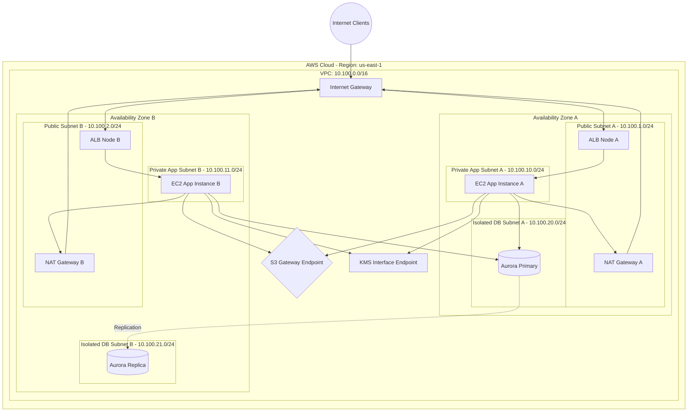

# AWS - Part 1 - Technical Study Guide & Notes

# AWS DevOps & Cloud Engineering Study Guide
## Part 1/3: Core Foundations, Topologies, and Infrastructure-as-Code

---

## 1. Part Introduction and Scope

This study guide is designed for senior IT professionals (6+ years of experience) aiming to master AWS cloud architecture, systems engineering, and DevOps practices. 

Part 1 covers the **Core Foundations** of AWS:
*   **Networking & Edge**: Virtual Private Cloud (VPC), Subnetting, Route Tables, Internet Gateways (IGW), NAT Gateways (NATGW), Security Groups (SG), Network Access Control Lists (NACL), and VPC Endpoints (PrivateLink).
*   **Identity & Access Management (IAM)**: Roles, Policies, Service Control Policies (SCPs), Permissions Boundaries, and Multi-Account Governance.
*   **Core Compute & Scaling**: Elastic Compute Cloud (EC2), Launch Templates, Auto Scaling Groups (ASG), and Elastic Load Balancing (ALB/NLB/GLB).
*   **Core Storage**: Simple Storage Service (S3) bucket security, lifecycle policies, and Elastic Block Store (EBS) volume topologies.

By the end of this guide, you will understand how to design, provision, secure, and troubleshoot these foundational components in enterprise production environments.

---

## 2. Architectural Impact on High-Availability Systems

Enterprise-grade high availability (HA) in AWS relies on the **Shared Responsibility Model** and **Design for Failure** paradigms. Foundational infrastructure choices dictate the maximum theoretical availability ($A$) of your application.

```
                  +-----------------------------------+
                  |      Route 53 (Latency/Failover)  |
                  +-----------------+-----------------+
                                    |
            +-----------------------+-----------------------+
            | (AZ-A)                                        | (AZ-B)
  +---------v---------+                           +---------v---------+
  | Public Subnet A   |                           | Public Subnet B   |
  |  [ALB Target A]   |                           |  [ALB Target B]   |
  +---------+---------+                           +---------+---------+
            |                                               |
  +---------v---------+                           +---------v---------+
  | Private Subnet A  |                           | Private Subnet B  |
  |  [ASG EC2 Inst A] |                           |  [ASG EC2 Inst B] |
  +---------+---------+                           +---------+---------+
            |                                               |
  +---------v---------+                           +---------v---------+
  | Isolated Subnet A |                           | Isolated Subnet B |
  |  [Aurora Prim] <===================================> [Aurora Repl] |
  +-------------------+        (Sync Replication) +-------------------+
```

### Blast Radius Mitigation
*   **Multi-AZ Topology**: Distributing workloads across isolated physical locations (Availability Zones) guarantees resilience against localized utility failures, fires, or network disruptions.
*   **Subnet Partitioning**: Isolating workloads into Public, Private, and Isolated subnets prevents external actors from directly scanning or attacking application and database tiers.
*   **Cellular Architectures**: Splitting large platforms into independent, parallel "cells" restricts the blast radius of a single misconfiguration or failure to a fraction of the user base.

### Zero-Trust Network Topology
*   Traditional perimeter-based security is insufficient. Zero-Trust inside AWS requires authenticating and authorizing every API call (IAM) and validating every network packet (SGs + NACLs).
*   **Security Groups (Stateful)** act as instance-level firewalls, evaluating traffic at the hypervisor layer (SR-IOV/Nitro).
*   **NACLs (Stateless)** act as subnet-level firewalls, providing a defense-in-depth layer to block specific CIDR blocks or ports before traffic reaches the instances.

### Multi-AZ State Synchronization & Recovery Objectives
*   **RTO (Recovery Time Objective)**: The maximum acceptable duration of downtime. Minimizing RTO requires automated health checks, automated DNS failover (Route 53), and self-healing Auto Scaling Groups.
*   **RPO (Recovery Point Objective)**: The maximum acceptable data loss. Achieving near-zero RPO requires synchronous replication across AZs (e.g., Amazon Aurora Multi-AZ) and point-in-time recovery (PITR) enabled on S3 and RDS.

---

## 3. Real-World Enterprise Use Case

### Scenario
An enterprise financial transaction processing platform requires strict compliance with PCI-DSS, zero exposure of database backends to the public internet, and the ability to process up to 50,000 requests per second (RPS) with sub-millisecond latency.

### Architectural Solution
1.  **VPC Topology**: A `/16` VPC divided into three Availability Zones. Each AZ contains:
    *   **Public Subnet**: Hosts Netflow-monitoring ALB interfaces and public-facing NAT Gateways.
    *   **Private App Subnet**: Hosts application EC2 instances inside an Auto Scaling Group. No public IPs are assigned. Traffic routes to the internet via NAT Gateways.
    *   **Isolated Database Subnet**: Hosts Amazon Aurora PostgreSQL clusters. No routes to the Internet Gateway or NAT Gateways exist.
2.  **Traffic Flow (Ingress)**:
    *   Public clients hit an AWS Route 53 latency-based routing record.
    *   Route 53 resolves to a Network Load Balancer (NLB) for ultra-low latency TCP termination, which routes to an Application Load Balancer (ALB) for advanced HTTP path-based routing, TLS termination (using AWS Certificate Manager), and AWS WAF inspection.
    *   ALB forwards traffic to EC2 instances in the Private App Subnet.
3.  **Traffic Flow (Egress & Internal)**:
    *   EC2 instances communicate with AWS S3 and AWS Key Management Service (KMS) using **VPC Gateway Endpoints** and **Interface Endpoints (PrivateLink)**, preventing traffic from traversing the public internet.
    *   Database queries flow from Private App Subnets to Isolated DB Subnets via strict Security Group rules.

---

## 4. Comprehensive Architecture Diagrams

### Infrastructure Topology (Multi-AZ, Multi-Tier with VPC Endpoints)



---

## 5. Component Deep Dive & Classifications

### VPC Subnetting & Routing Table Mechanics
*   **Public Subnets**: Associated with a Route Table containing a route to an Internet Gateway (`0.0.0.0/0 -> igw-xxxx`).
*   **Private Subnets**: Associated with a Route Table directing external traffic to a NAT Gateway (`0.0.0.0/0 -> nat-xxxx`).
*   **Isolated Subnets**: No default route (`0.0.0.0/0`) exists in their Route Table. They only routing local VPC traffic (`10.100.0.0/16 -> local`).
*   **AWS Reserved IPs**: In every subnet CIDR block, AWS reserves 5 IP addresses:
    *   `.0`: Network address.
    *   `.1`: VPC router address.
    *   `.2`: DNS server (AmazonProvidedDNS / Route 53 Resolver).
    *   `.3`: Reserved by AWS for future use.
    *   `.255`: Network broadcast address.

### Security Groups vs. Network Access Control Lists (NACLs)

| Feature | Security Group (SG) | Network Access Control List (NACL) |
| :--- | :--- | :--- |
| **Operating Layer** | Instance Level (Hypervisor / ENI) | Subnet Level |
| **Statefulness** | **Stateful**: Return traffic is automatically allowed regardless of rules. | **Stateless**: Return traffic must be explicitly allowed by inbound/outbound rules. |
| **Rule Evaluation** | All rules are evaluated before permitting traffic. | Rules are processed sequentially by rule number (lowest first). |
| **Action Types** | Supports `Allow` rules only. | Supports `Allow` and `Deny` rules. |
| **Use Case** | Micro-segmentation between application components. | Broad network blocking (e.g., blocking malicious IP ranges). |

### IAM Policy Evaluation Logic
AWS IAM evaluates policies using a strict decision tree:
1.  **Default Deny**: All requests are denied by default.
2.  **Explicit Deny**: If any policy contains an explicit `Deny` matching the action and resource, the final decision is a **Deny**, overriding any allows.
3.  **Explicit Allow**: If no explicit deny exists, and an explicit `Allow` is present, the decision is **Allow**.
4.  **Evaluation Scope**: Includes SCPs, Resource-based policies, IAM Permissions Boundaries, Session Policies, and Identity-based policies.

```
                  +--------------------------+
                  |       API Request        |
                  +------------+-------------+
                               |
                   Is there an Explicit Deny?
                     /                  \
                  YES                    NO
                  /                        \
         [Decision: DENY]           Is there an Explicit Allow?
                                      /                  \
                                   YES                    NO
                                   /                        \
                          [Decision: ALLOW]          [Decision: DENY]
```

### Elastic Load Balancing (ELB) Classifications

*   **Application Load Balancer (ALB)**:
    *   Operates at **Layer 7** (HTTP/HTTPS).
    *   Supports path-based routing (`/api`), host-based routing (`api.domain.com`), HTTP/2, and gRPC.
    *   Slow-start mode allows newly added instances to warm up before receiving full traffic.
*   **Network Load Balancer (NLB)**:
    *   Operates at **Layer 4** (TCP/UDP/TLS).
    *   Capable of handling millions of requests per second with ultra-low latency.
    *   Preserves client-side source IP addresses and supports static IP/Elastic IP assignment per AZ.
*   **Gateway Load Balancer (GLB)**:
    *   Operates at **Layer 3 & 4**.
    *   Used to scale third-party virtual appliances (firewalls, IDS/IPS) using GENEVE protocol encapsulation.

### S3 Storage Classes Technical Parameters

| Storage Class | Durability | Availability | Min Duration | Retrieval Fee | Use Case |
| :--- | :--- | :--- | :--- | :--- | :--- |
| **S3 Standard** | 99.999999999% | 99.99% | None | None | Active, frequently accessed data. |
| **S3 Standard-IA**| 99.999999999% | 99.9% | 30 days | Per GB retrieved | Infrequently accessed data, rapid access. |
| **S3 Glacier Instant**| 99.999999999%| 99.9% | 90 days | Per GB retrieved | Archival data needing millisecond access. |
| **S3 Glacier Flexible**| 99.999999999%| 99.99% | 90 days | Per GB retrieved | Archive; retrieval from minutes to hours. |
| **S3 Glacier Deep**| 99.999999999% | 99.9% | 180 days | Per GB retrieved | Long-term retention (years), 12-hour retrieval.|

---

## 6. Step-by-Step Production Implementation Guide

This section outlines how to deploy a production-ready, security-hardened VPC infrastructure using **Terraform**.

### Step 1: Directory Layout
```bash
terraform-vpc/
├── providers.tf
├── variables.tf
├── main.tf
├── outputs.tf
└── terraform.tfvars
```

### Step 2: `providers.tf`
```hcl
terraform {
  required_version = ">= 1.5.0"
  required_providers {
    aws = {
      source  = "hashicorp/aws"
      version = "~> 5.0"
    }
  }
}

provider "aws" {
  region = var.aws_region
  default_tags {
    tags = {
      Environment = var.environment
      ManagedBy   = "Terraform"
      Project     = "Core-Infrastructure"
    }
  }
}
```

### Step 3: `variables.tf`
```hcl
variable "aws_region" {
  type        = string
  description = "Target AWS Region"
  default     = "us-east-1"
}

variable "environment" {
  type        = string
  description = "Deployment Environment"
  default     = "production"
}

variable "vpc_cidr" {
  type        = string
  description = "Base CIDR block for the VPC"
  default     = "10.100.0.0/16"
}

variable "availability_zones" {
  type        = list(string)
  description = "Target Availability Zones"
  default     = ["us-east-1a", "us-east-1b", "us-east-1c"]
}
```

### Step 4: `main.tf`
```hcl
# 1. VPC Definition
resource "aws_vpc" "main" {
  cidr_block           = var.vpc_cidr
  enable_dns_hostnames = true
  enable_dns_support   = true

  tags = {
    Name = "${var.environment}-vpc"
  }
}

# 2. Internet Gateway
resource "aws_internet_gateway" "igw" {
  vpc_id = aws_vpc.main.id
  tags = {
    Name = "${var.environment}-igw"
  }
}

# 3. Subnets Configuration (Public, Private, Isolated)
resource "aws_subnet" "public" {
  count                   = length(var.availability_zones)
  vpc_id                  = aws_vpc.main.id
  cidr_block              = cidrsubnet(var.vpc_cidr, 8, count.index) # 10.100.0.0/24, 10.100.1.0/24...
  availability_zone       = var.availability_zones[count.index]
  map_public_ip_on_launch = true

  tags = {
    Name = "${var.environment}-public-subnet-${var.availability_zones[count.index]}"
    Type = "Public"
  }
}

resource "aws_subnet" "private" {
  count             = length(var.availability_zones)
  vpc_id            = aws_vpc.main.id
  cidr_block        = cidrsubnet(var.vpc_cidr, 8, count.index + 10) # 10.100.10.0/24, 10.100.11.0/24...
  availability_zone = var.availability_zones[count.index]

  tags = {
    Name = "${var.environment}-private-subnet-${var.availability_zones[count.index]}"
    Type = "Private"
  }
}

resource "aws_subnet" "isolated" {
  count             = length(var.availability_zones)
  vpc_id            = aws_vpc.main.id
  cidr_block        = cidrsubnet(var.vpc_cidr, 8, count.index + 20) # 10.100.20.0/24, 10.100.21.0/24...
  availability_zone = var.availability_zones[count.index]

  tags = {
    Name = "${var.environment}-isolated-subnet-${var.availability_zones[count.index]}"
    Type = "Isolated"
  }
}

# 4. Elastic IPs for NAT Gateways
resource "aws_eip" "nat" {
  count  = length(var.availability_zones)
  domain = "vpc"
  tags = {
    Name = "${var.environment}-nat-eip-${var.availability_zones[count.index]}"
  }
}

# 5. NAT Gateways (One per AZ for High Availability)
resource "aws_nat_gateway" "nat" {
  count         = length(var.availability_zones)
  allocation_id = aws_eip.nat[count.index].id
  subnet_id     = aws_subnet.public[count.index].id

  tags = {
    Name = "${var.environment}-nat-gw-${var.availability_zones[count.index]}"
  }
  depends_on = [aws_internet_gateway.igw]
}

# 6. Route Tables & Associations
# Public Route Table
resource "aws_route_table" "public" {
  vpc_id = aws_vpc.main.id

  route {
    cidr_block = "0.0.0.0/0"
    gateway_id = aws_internet_gateway.igw.id
  }

  tags = {
    Name = "${var.environment}-public-rt"
  }
}

resource "aws_route_table_association" "public" {
  count          = length(var.availability_zones)
  subnet_id      = aws_subnet.public[count.index].id
  route_table_id = aws_route_table.public.id
}

# Private Route Tables (One per NAT Gateway to isolate AZ failure domains)
resource "aws_route_table" "private" {
  count  = length(var.availability_zones)
  vpc_id = aws_vpc.main.id

  route {
    cidr_block     = "0.0.0.0/0"
    nat_gateway_id = aws_nat_gateway.nat[count.index].id
  }

  tags = {
    Name = "${var.environment}-private-rt-${var.availability_zones[count.index]}"
  }
}

resource "aws_route_table_association" "private" {
  count          = length(var.availability_zones)
  subnet_id      = aws_subnet.private[count.index].id
  route_table_id = aws_route_table.private[count.index].id
}

# Isolated Route Table (No NAT gateway route)
resource "aws_route_table" "isolated" {
  vpc_id = aws_vpc.main.id

  tags = {
    Name = "${var.environment}-isolated-rt"
  }
}

resource "aws_route_table_association" "isolated" {
  count          = length(var.availability_zones)
  subnet_id      = aws_subnet.isolated[count.index].id
  route_table_id = aws_route_table.isolated.id
}

# 7. VPC Flow Logs (S3 Bucket Destination for Audit Compliance)
resource "aws_s3_bucket" "flow_logs" {
  bucket        = "${var.environment}-vpc-flow-logs-${data.aws_caller_identity.current.account_id}"
  force_destroy = true
}

resource "aws_s3_bucket_lifecycle_configuration" "flow_logs_lifecycle" {
  bucket = aws_s3_bucket.flow_logs.id

  rule {
    id     = "expire-old-logs"
    status = "Enabled"

    transition {
      days          = 30
      storage_class = "GLACIER"
    }

    expiration {
      days = 90
    }
  }
}

resource "aws_flow_log" "main" {
  log_destination      = aws_s3_bucket.flow_logs.arn
  log_destination_type = "s3"
  traffic_type         = "ALL"
  vpc_id               = aws_vpc.main.id
}

data "aws_caller_identity" "current" {}
```

### Step 5: Deployment Execution
Initialize and apply the configuration to your environment:
```bash
terraform init
terraform validate
terraform plan -out=tfplan.binary
terraform apply tfplan.binary
```

---

## 7. Standard AWS CLI Reference

The following commands are critical for managing and auditing core services.

### 1. Retrieve VPC Subnet IP Availability
Query available IP counts across subnets to prevent allocation failures during scaling events.
```bash
aws ec2 describe-subnets \
  --filters "Name=vpc-id,Values=vpc-0123456789abcdef0" \
  --query "Subnets[*].{ID:SubnetId,AZ:AvailabilityZone,CIDR:CidrBlock,AvailableIPs:AvailableIpAddressCount}" \
  --output table
```
*   `--filters`: Narrows the query scope to a specific VPC target.
*   `--query`: Uses JMESPath notation to extract only the specified fields, reducing output size.

### 2. Assume an IAM Role Programmatically
Acquire temporary security credentials for cross-account operations.
```bash
aws sts assume-role \
  --role-arn "arn:aws:iam::111122223333:role/ProductionDeploymentRole" \
  --role-session-name "CI-CD-Pipeline-Deployment" \
  --duration-seconds 3600
```
*   `--role-arn`: The Amazon Resource Name of the target role.
*   `--role-session-name`: An identifier for the session, visible in CloudTrail logs.
*   `--duration-seconds`: Session lifetime (ranges from 900 seconds to 12 hours).

### 3. S3 Bucket Lifecycle Policy Upload
Apply a JSON lifecycle policy to automate data tiering and retention.
```bash
aws s3api put-bucket-lifecycle-configuration \
  --bucket production-raw-data-vault \
  --lifecycle-configuration file://lifecycle-policy.json
```
*   `--lifecycle-configuration`: Points to a local JSON file containing transition and expiration rules.

### 4. Create an EC2 Launch Template with IMDSv2 Enforced
Ensure all instances launched from this template have the Instance Metadata Service v2 enforced.
```bash
aws ec2 create-launch-template \
  --launch-template-name "secure-app-template" \
  --launch-template-data '{
    "ImageId": "ami-0c7217cdde317cfec",
    "InstanceType": "m6i.large",
    "MetadataOptions": {
      "HttpTokens": "required",
      "HttpPutResponseHopLimit": 1,
      "HttpEndpoint": "enabled"
    }
  }'
```
*   `HttpTokens=required`: Mandates the use of session tokens (IMDSv2), mitigating SSRF security risks.
*   `HttpPutResponseHopLimit=1`: Prevents metadata access from containers running on the host.

---

## 8. Production Configuration Examples

### Secure IAM Policy: Least-Privilege KMS Decryption with IP Restrictions
This policy limits KMS decryption to a specific application role, requiring requests to originate from the organization's corporate network CIDR.

```json
{
  "Version": "2012-10-17",
  "Statement": [
    {
      "Sid": "EnforcedKMSTransactionDecryption",
      "Effect": "Allow",
      "Action": [
        "kms:Decrypt",
        "kms:DescribeKey"
      ],
      "Resource": "arn:aws:kms:us-east-1:111122223333:key/a1b2c3d4-e5f6-7a8b-9c0d-1e2f3a4b5c6d",
      "Condition": {
        "IpAddress": {
          "aws:SourceIp": [
            "192.0.2.0/24",
            "198.51.100.0/22"
          ]
        },
        "Bool": {
          "aws:SecureTransport": "true"
        }
      }
    }
  ]
}
```

### Production S3 Bucket Policy: Enforce TLS and SSE-KMS Encryption
This bucket policy blocks non-TLS traffic and rejects uploads that do not use SSE-KMS with the designated Customer Managed Key (CMK).

```json
{
  "Version": "2012-10-17",
  "Statement": [
    {
      "Sid": "EnforceTLSRequestsOnly",
      "Effect": "Deny",
      "Principal": "*",
      "Action": "s3:*",
      "Resource": [
        "arn:aws:s3:::production-compliance-vault",
        "arn:aws:s3:::production-compliance-vault/*"
      ],
      "Condition": {
        "Bool": {
          "aws:SecureTransport": "false"
        }
      }
    },
    {
      "Sid": "DenyUnencryptedUploads",
      "Effect": "Deny",
      "Principal": "*",
      "Action": "s3:PutObject",
      "Resource": "arn:aws:s3:::production-compliance-vault/*",
      "Condition": {
        "StringNotEquals": {
          "s3:x-amz-server-side-encryption": "aws:kms"
        }
      }
    },
    {
      "Sid": "EnforceSpecificKMSKey",
      "Effect": "Deny",
      "Principal": "*",
      "Action": "s3:PutObject",
      "Resource": "arn:aws:s3:::production-compliance-vault/*",
      "Condition": {
        "StringNotEquals": {
          "s3:x-amz-server-side-encryption-aws-kms-key-id": "arn:aws:kms:us-east-1:111122223333:key/a1b2c3d4-e5f6-7a8b-9c0d-1e2f3a4b5c6d"
        }
      }
    }
  ]
}
```

---

## 9. Security Considerations & Hardening Best Practices

### IMDSv2 Enforcement Mechanics
The Instance Metadata Service (IMDS) provides configuration data to EC2 instances. IMDSv1 is vulnerable to Server-Side Request Forgery (SSRF) attacks because it uses a simple GET request without authentication headers.

*   **IMDSv2** requires a session-oriented flow:
    1.  The client issues a `PUT` request to `http://169.254.169.254/latest/api/token` with a header specifying the token lifetime.
    2.  The service returns a cryptographically signed token.
    3.  The client includes this token in the `X-aws-ec2-metadata-token` header of subsequent `GET` requests.
*   **Enforcement Rule**: Disable IMDSv1 globally using SCPs or AWS Config Rules.

### Envelope Encryption with KMS
Directly encrypting large payloads with KMS is inefficient and limited to 4 KB. Instead, use **Envelope Encryption**:

```
[KMS CMK] --(Generates)--> [Plaintext Data Key] + [Ciphertext Data Key]
                                   |
                             (Encrypts)
                                   v
[Plaintext Payload] --------> [Encrypted Payload]
```

1.  The application requests a data key from KMS using a Customer Managed Key (CMK).
2.  KMS returns a **Plaintext Data Key** and an **Encrypted Data Key** (wrapped by the CMK).
3.  The application encrypts the payload locally using the Plaintext Data Key (e.g., via AES-GCM-256) and immediately purges the plaintext key from memory.
4.  The application stores the **Encrypted Data Key** alongside the encrypted payload.
5.  To decrypt, the application sends the Encrypted Data Key back to KMS, receives the Plaintext Data Key, decrypts the payload, and purges the plaintext key from memory.

### IAM Permissions Boundaries
A permissions boundary is an advanced feature used to delegate policy creation to developers without risking privilege escalation.

```
      +-----------------------------------------+
      |        IAM Permissions Boundary         |
      |   (Max allowable permission: S3 & EC2)  |
      |                                         |
      |     +-----------------------------+     |
      |     |      Assigned IAM Policy    |     |
      |     |  (Requesting: S3 & Dynamo)  |     |
      |     |                             |     |
      |     |     +-----------------+     |     |
      |     |     | Effective Perms |     |     |
      |     |     |   (S3 Only)     |     |     |
      |     |     +-----------------+     |     |
      |     +-----------------------------+     |
      +-----------------------------------------+
```

*   The boundary policy defines the **maximum permissions** an identity-based policy can grant.
*   Even if a developer attaches `AdministratorAccess` to a role they create, the effective permissions of that role are limited to the intersection of the developer's policy and the permissions boundary.

---

## 10. Observability & Monitoring considerations

### VPC Flow Logs Analysis via Amazon Athena
To analyze rejected traffic patterns across your subnets, query VPC Flow Logs stored in Amazon S3 using Athena.

```sql
-- Create Table Schema for AWS VPC Flow Logs
CREATE EXTERNAL TABLE IF NOT EXISTS default.vpc_flow_logs (
  version int,
  account_id string,
  interface_id string,
  srcaddr string,
  dstaddr string,
  srcport int,
  dstport int,
  protocol bigint,
  packets bigint,
  bytes bigint,
  start bigint,
  `end` bigint,
  action string,
  log_status string
)
PARTITIONED BY (dt string)
ROW FORMAT DELIMITED
FIELDS TERMINATED BY ' '
LOCATION 's3://production-vpc-flow-logs-111122223333/AWSLogs/111122223333/vpcflowlogs/us-east-1/'
TBLPROPERTIES ("skip.header.line.count"="1");

-- Query Top 10 Rejected IP Addresses on Port 22 (SSH)
SELECT srcaddr, count(*) AS num_rejections
FROM default.vpc_flow_logs
WHERE dstport = 22 AND action = 'REJECT'
GROUP BY srcaddr
ORDER BY num_rejections DESC
LIMIT 10;
```

### Critical CloudWatch Metrics for Core Infrastructure

| Metric Name | Namespace | Critical Threshold | Mitigation Strategy |
| :--- | :--- | :--- | :--- |
| `SurplusConnectionCount` | `AWS/NATGateway` | $> 0$ | The NAT Gateway is resource-constrained. Scale horizontally by splitting subnets across multiple NAT Gateways. |
| `TargetResponseTime` | `AWS/ApplicationELB`| $> 1.5 \text{ sec}$ | Identify and address backend performance bottlenecks, database locking issues, or resource exhaustion on EC2 targets. |
| `UnHealthyHostCount` | `AWS/ApplicationELB`| $\ge 1$ | The load balancer marked a target as unhealthy. Investigate local application logs, resource constraints, or health check paths. |
| `VolumeQueueLength` | `AWS/EBS` | $> 5$ (for gp2/gp3) | The storage volume is experiencing high latency due to I/O operations queuing up. Transition to gp3 with higher provisioned IOPS or io2 block storage. |
| `5xxError` | `AWS/S3` | $> 1\%$ of total requests | S3 is throttling requests. Implement exponential backoff and jitter in the application, or partition S3 prefixes to distribute load. |

---

## 11. Common Troubleshooting Scenarios (Root Cause Analysis - RCA)

### Scenario A: NAT Gateway Port Exhaustion (SNAT Mitigation)
*   **Symptom**: Private EC2 instances intermittently fail to connect to external APIs or services, resulting in connection timeouts.
*   **RCA Steps**:
    1.  Inspect the CloudWatch metric `ErrorPortAllocation` under the `AWS/NATGateway` namespace.
    2.  If this metric is greater than zero, the NAT Gateway has exhausted its source port pool. A single NAT Gateway supports up to 55,000 concurrent connections to a specific destination IP and port combination.
    3.  Confirm the destination IPs using VPC Flow Logs.
*   **Resolution**:
    *   Associate multiple Elastic IP addresses (up to 8) with the NAT Gateway to scale the available port pool.
    *   Implement connection pooling in the application to reuse connections instead of opening a new TCP socket for every request.
    *   Create VPC Endpoints for AWS services to route internal AWS traffic away from the NAT Gateway.

### Scenario B: Asymmetric Routing in Transit Gateway / Peering Setup
*   **Symptom**: Traffic flows successfully from VPC-A to VPC-B, but return traffic fails, causing connection timeouts.
*   **RCA Steps**:
    1.  Trace the network path using VPC Reachability Analyzer from the source ENI to the destination ENI.
    2.  Examine the route tables in both VPC-A and VPC-B.
    3.  Confirm that VPC-A has a route for VPC-B's CIDR block pointing to the peering connection or Transit Gateway (`pcx-xxxx` or `tgw-xxxx`).
    4.  Verify that VPC-B has a corresponding return route for VPC-A's CIDR block pointing back to the same peering connection or Transit Gateway.
    5.  Check the security groups and NACLs in both VPCs. Ensure the NACL in VPC-B allows outbound ephemeral traffic (ports 1024-65535) back to VPC-A's CIDR.
*   **Resolution**: Correct the missing or asymmetrical route in the destination route table, and ensure the stateless NACLs allow ephemeral return traffic.

### Scenario C: S3 403 "Access Denied" Debugging
*   **Symptom**: An application on an EC2 instance receives a `403 Access Denied` error when attempting to read an object from an S3 bucket.
*   **RCA Steps**:
    1.  Determine if the failure is caused by authentication or authorization issues. Use the AWS CLI on the instance to check the current identity: `aws sts get-caller-identity`.
    2.  Review the IAM role attached to the EC2 instance. Verify that the policy allows `s3:GetObject` on the specific bucket and object path (e.g., `arn:aws:s3:::my-bucket/*`).
    3.  Inspect the S3 Bucket Policy. Check for explicit `Deny` statements that might override the IAM allowance (e.g., policies restricting access to specific IP ranges or requiring TLS).
    4.  Verify KMS permissions. If the target S3 object is encrypted using a Customer Managed Key (CMK), the IAM role must have `kms:Decrypt` permissions for that key.
    5.  Check for S3 Block Public Access settings or Service Control Policies (SCPs) that might restrict access at the AWS Organization level.

---

## 12. Common Production Mistakes to Avoid

### 1. Overlapping CIDR Blocks in Multi-VPC Environments
*   **The Mistake**: Provisioning multiple VPCs using the default `172.31.0.0/16` or identical `10.0.0.0/16` CIDR ranges.
*   **The Consequence**: These VPCs cannot be connected via VPC Peering, Transit Gateway, or VPN connections, requiring complex IP translation (NAT) or complete VPC reconstruction.
*   **Prevention**: Establish an enterprise-wide IP Address Management (IPAM) strategy using AWS VPC IPAM to automatically allocate non-overlapping CIDRs across accounts.

### 2. S3 Public Access Leaks
*   **The Mistake**: Relying solely on bucket ACLs or loose bucket policies for access control, which can accidentally expose sensitive data to the public internet.
*   **The Consequence**: Data breaches, regulatory fines, and reputation damage.
*   **Prevention**: Enable **S3 Block Public Access** at both the AWS Account level and the individual S3 bucket level. Use IAM policies and VPC Gateway Endpoints for private data access.

### 3. Hardcoded AWS Credentials in Code or Images
*   **The Mistake**: Embedding raw access keys (`AKIA...`) and secret keys in application configuration files, code repositories, or custom AMIs.
*   **The Consequence**: Attackers scanning public repositories (e.g., GitHub) can compromise these keys within minutes, leading to resource exploitation (e.g., crypto-mining) and data theft.
*   **Prevention**: Use IAM Roles for EC2 instances, ECS Tasks, or Kubernetes Pods (IRSA). Retrieve dynamic credentials automatically using AWS Secrets Manager or Systems Manager Parameter Store.

---

## 13. Enterprise-Level Recommendations & Best Practices

### IP Address Space Planning
Design VPC CIDR allocations using a structured hierarchy to prevent address exhaustion while avoiding wasted IP space.

```
                  +-----------------------------------+
                  |        Enterprise Block           |
                  |         10.100.0.0/14             |
                  +-----------------+-----------------+
                                    |
            +-----------------------+-----------------------+
            | (Production)                                  | (Non-Production)
  +---------v---------+                           +---------v---------+
  |    VPC Region 1   |                           |    VPC Region 1   |
  |   10.100.0.0/16   |                           |   10.101.0.0/16   |
  +---------+---------+                           +---------+---------+
            |
  +---------v---------+
  |  Subnet Allocation|
  |  - Pub:   /24     |
  |  - Priv:  /20     |
  |  - Iso:   /22     |
  +-------------------+
```

*   **Public Subnets**: Allocate small CIDR blocks (e.g., `/24` or `/25`), as they only host load balancers, NAT Gateways, and bastion hosts.
*   **Private Subnets**: Allocate larger CIDR blocks (e.g., `/20` or `/21`) to accommodate horizontal scaling of application instances, containers, and serverless runtimes.
*   **Isolated Subnets**: Allocate mid-sized CIDR blocks (e.g., `/22` or `/23`) for databases and cache clusters, which generally do not scale as dynamically as the application tier.

### Cost Optimization for Egress Traffic
NAT Gateway data processing charges ($0.045 per GB in us-east-1) can quickly become a significant portion of your cloud spend.

*   **Implement VPC Endpoints**: Route traffic destined for AWS services (S3, DynamoDB, Systems Manager, KMS) through VPC Endpoints instead of NAT Gateways. S3 and DynamoDB Gateway Endpoints are free and route traffic privately within the AWS network.
*   **Cross-AZ Traffic Reduction**: Ensure that Application Load Balancers and EC2 instances are configured to prefer local AZ targets where possible to minimize cross-AZ data transfer fees ($0.01 per GB).

---

## 14. Advanced Architectural Concepts

### AWS PrivateLink Architecture
AWS PrivateLink allows you to share services across VPCs and AWS accounts securely without exposing them to the public internet, using private IP addresses.

```
[Consumer VPC]                                           [Provider VPC]
+----------------------------------------+               +----------------------------------------+
| Private Subnet                         |               | Private Subnet                         |
|  [App Instance]                        |               |                                        |
|         |                              |               |  +----------------------------------+  |
|         v                              |               |  | Network Load Balancer (NLB)       |  |
|  [VPC Interface Endpoint (ENI)] =======(PrivateLink)=====>|  +----------------+-----------------+  |
|         | (10.100.10.55)               |               |                   |                    |
+---------+------------------------------+               |         +---------v---------+          |
                                                         |         | Target App Group  |          |
                                                         |         +-------------------+          |
                                                         +----------------------------------------+
```

*   **Mechanism**: The service provider creates an **Endpoint Service** backed by a Network Load Balancer (NLB). The service consumer creates an **Interface Endpoint** in their VPC, which provisions an Elastic Network Interface (ENI) with a private IP address in their subnet.
*   **Security Benefit**: Traffic stays entirely within the AWS network backbone. It does not require an Internet Gateway, NAT Gateway, route table modifications, or VPC Peering.

### Attribute-Based Access Control (ABAC)
ABAC is an authorization strategy that defines permissions based on tags attached to users, roles, and AWS resources.

```json
{
  "Version": "2012-10-17",
  "Statement": [
    {
      "Sid": "AllowAccessIfTagsMatch",
      "Effect": "Allow",
      "Action": [
        "ec2:StartInstances",
        "ec2:StopInstances"
      ],
      "Resource": "arn:aws:ec2:*:*:instance/*",
      "Condition": {
        "StringEquals": {
          "aws:ResourceTag/Project": "${aws:PrincipalTag/Project}",
          "aws:ResourceTag/Environment": "${aws:PrincipalTag/Environment}"
        }
      }
    }
  ]
}
```
*   **Scale Advantage**: Developers do not need to update IAM policies when adding new resources. As long as the resources are tagged with the matching `Project` and `Environment` values, access is automatically granted.

---

## 15. Integration with Other DevOps Tools

### CI/CD Deployment via GitHub Actions OIDC
Avoid storing long-lived AWS IAM User access keys in GitHub Secrets. Instead, use OpenID Connect (OIDC) to assume an IAM role dynamically.

```yaml
name: Production AWS Deployment

on:
  push:
    branches:
      - main

permissions:
  id-token: write # Required for requesting the JWT
  contents: read  # Required for actions/checkout

jobs:
  DeployInfrastructure:
    runs-on: ubuntu-latest
    steps:
      - name: Checkout Code
        uses: actions/checkout@v3

      - name: Configure AWS Credentials via OIDC
        uses: aws-actions/configure-aws-credentials@v2
        with:
          role-to-assume: arn:aws:iam::111122223333:role/GitHubActionsWorkflowRole
          aws-region: us-east-1
          audience: sts.amazonaws.com

      - name: Run Terraform Deploy
        run: |
          terraform init
          terraform apply -auto-approve
```

### Kubernetes (EKS) AWS VPC CNI Integration
The AWS VPC Container Network Interface (CNI) plugin allows Kubernetes Pods to receive real, fully-routable private IP addresses directly from the VPC CIDR block.

```
[EKS Worker Node (EC2 Instance)]
+-------------------------------------------------------------+
|  Primary ENI (eth0) -> Node IP: 10.100.10.15                |
|                                                             |
|  Secondary ENI (eth1)                                       |
|   |-- Secondary Private IP 1: 10.100.10.88  ====> [Pod A]   |
|   |-- Secondary Private IP 2: 10.100.10.102 ====> [Pod B]   |
+-------------------------------------------------------------+
```

*   **Performance Advantage**: Eliminates the overlay network encapsulation overhead (such as Flannel or Calico VXLAN), resulting in near-bare-metal network performance.
*   **Security Integration**: Pods can be associated with standard AWS Security Groups using **Security Groups for Pods**, enabling fine-grained network policies directly at the VPC level.

---

## 16. Multi-Cloud Comparison

The following table compares AWS core services with their equivalent offerings in Microsoft Azure and Google Cloud Platform (GCP).

| Feature Type | AWS Component | Azure Equivalent | GCP Equivalent | Latency / Throughput Performance | Cost Structure Comparison |
| :--- | :--- | :--- | :--- | :--- | :--- |
| **Virtual Networking** | VPC | Virtual Network (VNet) | VPC Network | **AWS/GCP**: Global/Regional routing with sub-millisecond latencies. <br>**Azure**: Regional routing. | **AWS**: Charges for NAT GW processing ($0.045/GB). <br>**GCP**: Charges for Cloud NAT. <br>**Azure**: Charges for NAT Gateway per hour + data. |
| **Identity Management**| IAM | Microsoft Entra ID (Azure AD) | Cloud IAM | **AWS/GCP**: Policy evaluation occurs in milliseconds. <br>**Azure**: Complex AD sync latency may occur. | Included with the cloud platform; charges apply only for premium directory features (e.g., Entra ID P1/P2). |
| **Object Storage** | S3 | Blob Storage | Cloud Storage | **AWS/GCP/Azure**: All offer high throughput and millisecond-level retrieval times for standard tiers. | **AWS/GCP**: Similar storage class tiers and retrieval fees. <br>**Azure**: Charges based on access tiers (Hot, Cool, Cold, Archive). |
| **Virtual Compute** | EC2 | Virtual Machines | Compute Engine | High-performance options available on all platforms, including specialized compute, memory, and GPU instances. | All platforms charge per-second billing, with substantial discounts for committed use or reservations. |

---

## 17. Visual Cheat Sheet

### Essential Security Port Matrix
Use these standard port rules to design your Security Groups:

| Protocol | Port | Source | Destination | Purpose |
| :--- | :--- | :--- | :--- | :--- |
| **TCP** | `443` | `0.0.0.0/0` | ALB Security Group | Public HTTPS Ingress |
| **TCP** | `80` | `0.0.0.0/0` | ALB Security Group | Redirect to HTTPS |
| **TCP** | `App Port` | ALB Security Group | EC2 App Instances | Secure Ingress from Load Balancer |
| **TCP** | `5432` | EC2 App Security Group | Aurora DB Security Group | PostgreSQL Database Access |
| **TCP** | `6379` | EC2 App Security Group | ElastiCache Security Group | Redis Cache Access |

### Critical AWS CLI Commands Cheat Sheet
Keep these high-priority commands handy for quick reference:

```bash
# Get current caller identity (Verify IAM Role)
aws sts get-caller-identity

# List all S3 buckets with creation dates
aws s3 ls

# Sync local directory to S3 bucket (with deletion)
aws s3 sync ./local-dir s3://my-bucket --delete

# Describe running EC2 instances in a VPC
aws ec2 describe-instances --filters "Name=vpc-id,Values=vpc-xxxx" "Name=instance-state-name,Values=running"

# Fetch latest console output of an instance (Troubleshooting boot issues)
aws ec2 get-console-output --instance-id i-xxxxxx
```

---

## 18. Comprehensive Final Learning Summary

In this first part of our AWS Cloud study guide, we have established the foundational components of a production-grade AWS infrastructure:

1.  **VPC Networking**: We designed a secure, multi-tier VPC architecture spanning multiple Availability Zones. By separating workloads into public, private, and isolated subnets, we minimized the blast radius of potential security incidents.
2.  **Identity and Access Management (IAM)**: We explored the evaluation logic of IAM policies, emphasizing least-privilege access, envelope encryption using KMS, and the use of permissions boundaries to delegate administrative tasks safely.
3.  **Compute and Storage Foundations**: We reviewed the technical parameters of EC2, Auto Scaling, Elastic Load Balancing, and S3, providing a solid foundation for deploying resilient and scalable applications.
4.  **DevOps Best Practices**: We demonstrated how to implement this architecture using Infrastructure-as-Code (Terraform), automate deployments securely via GitHub Actions OIDC, and troubleshoot common network and access issues using structured RCA steps.

In **Part 2** of this series, we will build upon these foundations to explore advanced compute configurations, database architectures, containerization (ECS/EKS), and serverless design patterns.

# AWS Interview Preparation Guide (Part 1/3): Core Foundations, Configurations, and Topologies

---

### Q1. How do you design a highly available, secure, and scalable AWS VPC architecture from scratch? Explain CIDR planning, subnetting, and routing table design.

**Detailed Answer**:
Designing an enterprise-grade VPC requires meticulous planning of the IPv4 CIDR block, subnet partitioning, and routing tables to guarantee high availability (HA), security, and scalability. 

1. **CIDR Planning**: Choose a private IP range from RFC 1918 (typically `10.0.0.0/16`, providing 65,536 IP addresses). Ensure this block does not overlap with corporate on-premises networks or other peered VPCs to prevent routing conflicts.
2. **Subnet Partitioning**: Divide the `/16` CIDR into smaller blocks distributed across at least three Availability Zones (AZs) for high availability:
   * **Public Subnets** (e.g., `/24` per AZ): Host resources that must connect directly to the internet (e.g., ALBs, NAT Gateways, Bastion hosts).
   * **Private App Subnets** (e.g., `/20` per AZ): Host application servers (e.g., EC2 instances, ECS/EKS tasks). These route outbound internet traffic via NAT Gateways.
   * **Isolated Data Subnets** (e.g., `/24` per AZ): Host databases (RDS, DynamoDB endpoints) and cache clusters (ElastiCache). These have *no* direct route to the internet or NAT Gateways.
3. **Routing Table Design**:
   * **Public Route Table**: Associated with public subnets. Contains a default route (`0.0.0.0/0`) pointing to the **Internet Gateway (IGW)**.
   * **Private Route Tables (One per AZ)**: Associated with private subnets. Contains a default route (`0.0.0.0/0`) pointing to the **NAT Gateway** located in the *same* AZ to prevent cross-AZ data transfer charges and latency.
   * **Isolated Route Table**: Associated with data subnets. Has no default route to `0.0.0.0/0`. It only contains local VPC routes and **VPC Endpoint** routes (Gateway Endpoints for S3/DynamoDB) to keep database traffic entirely within the AWS private network backbone.

```
+--------------------------------------------------------------------------------------------------+
|                                        VPC (10.0.0.0/16)                                         |
|                                                                                                  |
|   +----------------------------------+                   +----------------------------------+    |
|   |        Availability Zone A       |                   |        Availability Zone B       |    |
|   |                                  |                   |                                  |    |
|   |  +----------------------------+  |                   |  +----------------------------+  |    |
|   |  | Public Subnet (10.0.1.0/24)|  |                   |  | Public Subnet (10.0.2.0/24)|  |    |
|   |  |  [ NAT Gateway A ]         |  |                   |  |  [ NAT Gateway B ]         |  |    |
|   |  +--------------+-------------+  |                   |  +--------------+-------------+  |    |
|   |                 | Route: 0.0.0.0/0 -> IGW                              | Route: 0.0.0.0/0 -> IGW|    |
|   |                                  |                   |                                  |    |
|   |  +----------------------------+  |                   |  +----------------------------+  |    |
|   |  | Private Subnet (10.0.16.0/20| |                   |  | Private Subnet (10.0.32.0/20| |    |
|   |  |  [ App Instances ]         |  |                   |  |  [ App Instances ]         |  |    |
|   |  +--------------+-------------+  |                   |  +--------------+-------------+  |    |
|   |                 | Route: 0.0.0.0/0 -> NAT GW A                         | Route: 0.0.0.0/0 -> NAT GW B|
|   |                                  |                   |                                  |    |
|   |  +----------------------------+  |                   |  +----------------------------+  |    |
|   |  | Isolated Subnet (10.0.3.0/24)|  |                  |  | Isolated Subnet (10.0.4.0/24)|  |    |
|   |  |  [ RDS Postgres DB ]       |  |                   |  |  [ RDS Postgres DB ]       |  |    |
|   |  +----------------------------+  |                   |  +----------------------------+  |    |
|   |     Route: Local Only            |                   |     Route: Local Only            |    |
|   +----------------------------------+                   +----------------------------------+    |
|                                                                                                  |
|   [ Internet Gateway (IGW) ] <-----------------------------------------------------------------+ |
+--------------------------------------------------------------------------------------------------+
```

**Production Scenario / Practical Example**:
Here is a Terraform configuration snippet implementing this architecture with non-overlapping subnets and dedicated route tables per AZ to avoid single points of failure:

```hcl
resource "aws_vpc" "main" {
  cidr_block           = "10.0.0.0/16"
  enable_dns_hostnames = true
  enable_dns_support   = true
  tags                 = { Name = "production-vpc" }
}

resource "aws_subnet" "public_az1" {
  vpc_id            = aws_vpc.main.id
  cidr_block        = "10.0.1.0/24"
  availability_zone = "us-east-1a"
  tags                 = { Name = "prod-public-us-east-1a" }
}

resource "aws_subnet" "private_az1" {
  vpc_id            = aws_vpc.main.id
  cidr_block        = "10.0.16.0/20"
  availability_zone = "us-east-1a"
  tags                 = { Name = "prod-private-us-east-1a" }
}

resource "aws_route_table" "private_rt_az1" {
  vpc_id = aws_vpc.main.id
  tags   = { Name = "prod-private-rt-us-east-1a" }
}

resource "aws_route" "private_nat_route_az1" {
  route_table_id         = aws_route_table.private_rt_az1.id
  destination_cidr_block = "0.0.0.0/0"
  nat_gateway_id         = aws_nat_gateway.nat_az1.id
}

resource "aws_route_table_association" "private_az1_assoc" {
  subnet_id      = aws_subnet.private_az1.id
  route_table_id = aws_route_table.private_rt_az1.id
}
```

---

### Q2. Explain the AWS IAM Policy Evaluation Logic in detail. How do SCPs, Permissions Boundaries, Resource-based Policies, and Identity-based Policies interact?

**Detailed Answer**:
AWS evaluates policies using a strict, deterministic flow. By default, all requests are denied (**Default Deny**). The evaluation logic follows these steps:

1. **Explicit Deny**: If any policy applicable to the request contains an explicit `Deny` for the action, the final decision is immediately **Deny**, overriding any `Allow` statements.
2. **Organizations SCPs (Service Control Policies)**: AWS evaluates SCPs attached to the account's AWS Organization hierarchy. If an SCP does not allow the action (or explicitly denies it), the request is denied. SCPs set the maximum permission boundary for an account.
3. **Resource-based Policies**: AWS checks resource-based policies (e.g., S3 Bucket Policies, KMS Key Policies). 
   * *Crucial Exception*: If a resource-based policy grants direct access to an IAM principal within the *same* account, and there is no explicit deny, the request is allowed, even if the identity-based policy does not explicitly grant it (except for KMS and IAM roles in some scenarios). If the principal is in a *different* account (cross-account), both the resource-based policy and the identity-based policy must explicitly allow the action.
4. **IAM Permissions Boundaries**: If a Permissions Boundary is set on the IAM user or role, AWS evaluates it next. The action must be allowed by both the identity-based policy *and* the permissions boundary. If either does not allow it, the request is denied.
5. **Session Policies**: If the request uses temporary credentials assumed via STS (e.g., `AssumeRole`, `GetSessionToken`), session policies are evaluated. The permission is the intersection of the session policy and the identity-based policy.
6. **Identity-based Policies**: AWS evaluates the policies attached directly to the IAM user, group, or role. If an `Allow` is found and no explicit `Deny` exists elsewhere, the request is **Allowed**.

```
                           [ Incoming Request ]
                                    │
                                    ▼
                        ┌──────────────────────┐
                        │  Is there an         │ ── Yes ──► [ EXPLICIT DENY ]
                        │  EXPLICIT DENY?      │
                        └──────────────────────┘
                                    │ No
                                    ▼
                        ┌──────────────────────┐
                        │  Evaluated by SCP?   │ ── No  ──► [ DENY ]
                        └──────────────────────┘
                                    │ Yes
                                    ▼
                        ┌──────────────────────┐
                        │ Evaluated by Resource│ ── Yes ──► [ ALLOW (Same Account)* ]
                        │ Policy?              │
                        └──────────────────────┘
                                    │ No
                                    ▼
                        ┌──────────────────────┐
                        │ Evaluated by         │ ── No  ──► [ DENY ]
                        │ Permission Boundary? │
                        └──────────────────────┘
                                    │ Yes
                                    ▼
                        ┌──────────────────────┐
                        │ Evaluated by Session │ ── No  ──► [ DENY ]
                        │ Policy (if any)?     │
                        └──────────────────────┘
                                    │ Yes
                                    ▼
                        ┌──────────────────────┐
                        │ Evaluated by Identity│ ── Yes ──► [ ALLOW ]
                        │ Policy?              │
                        └──────────────────────┘
                                    │ No
                                    ▼
                                 [ DENY ]
```

**Production Scenario / Practical Example**:
An SRE wants to delegate IAM role creation to a developer but prevent privilege escalation (e.g., creating an admin role). We attach a **Permissions Boundary** to the developer's IAM role.

Developer Identity Policy (allows creating roles only if they attach the boundary):
```json
{
  "Version": "2012-10-17",
  "Statement": [
    {
      "Sid": "AllowCreateRoleWithBoundary",
      "Effect": "Allow",
      "Action": [
        "iam:CreateRole",
        "iam:AttachRolePolicy"
      ],
      "Resource": "*",
      "Condition": {
        "StringEquals": {
          "iam:PermissionsBoundary": "arn:aws:iam::111122223333:policy/DeveloperBoundaryPolicy"
        }
      }
    }
  ]
}
```

---

### Q3. How do you implement S3 bucket security, versioning, and lifecycle policies to comply with regulatory standards (e.g., PCI-DSS, HIPAA) requiring data immutability and automatic archival?

**Detailed Answer**:
To secure Amazon S3 buckets for regulatory compliance, a multi-layered approach is required:

1. **Encryption at Rest**: Enforce SSE-KMS (AWS Key Management Service) with Customer Managed Keys (CMK) to ensure auditability of key access via CloudTrail. Enforce encryption in transit (TLS 1.2+) via Bucket Policies using the `aws:SecureTransport` condition.
2. **Access Control**: Disable ACLs (Access Control Lists) entirely and enforce **Bucket Owner Enforced** settings. Block all Public Access at the bucket and account levels.
3. **Data Immutability (WORM)**: Enable **S3 Object Lock** in compliance mode. Compliance mode ensures that even the AWS root account user cannot overwrite or delete the object version until the retention period expires. S3 Versioning is a prerequisite for Object Lock.
4. **Lifecycle Management**: Configure rules to transition older versions of objects to cheaper storage tiers (e.g., Glacier Flexible Retrieval or Glacier Deep Archive) and permanently delete expired noncurrent versions to optimize costs.

```
+------------------------------------------------------------------------------------+
|                               S3 Bucket Security Arch                              |
|                                                                                    |
|  Incoming Request                                                                  |
|        │                                                                           |
|        ├──► [ Bucket Policy Evaluation ] ──► (Deny if SecureTransport == false)    |
|        │                                                                           |
|        ├──► [ KMS Key Decryption ] ───────► (Access logged via CloudTrail)         |
|        │                                                                           |
|        ▼                                                                           |
|  +──────────────────────────────────────────────────────────────────────────────+  |
|  | S3 Bucket                                                                    |  |
|  |                                                                              |  |
|  |  Active Version  ──(30 Days)──► [ S3 Standard-IA ]                           |  |
|  |                                       │                                      |  |
|  |                                    (90 Days)                                 |  |
|  |                                       ▼                                      |  |
|  |  Noncurrent Version ──────────► [ Glacier Deep Archive ]                     |  |
|  |                                       │                                      |  |
|  |                                    (365 Days)                                |  |
|  |                                       ▼                                      |  |
|  |                               [ Permanent Delete ]                           |  |
|  |                                                                              |  |
|  |  * Object Lock (Compliance Mode Enabled) - Immutability Active               |  |
|  +──────────────────────────────────────────────────────────────────────────────+  |
+------------------------------------------------------------------------------------+
```

**Production Scenario / Practical Example**:
The following S3 bucket policy enforces TLS-only access and rejects any uploads that do not use SSE-KMS with a specified KMS key:

```json
{
  "Version": "2012-10-17",
  "Statement": [
    {
      "Sid": "EnforceTLSRequestsOnly",
      "Effect": "Deny",
      "Principal": "*",
      "Action": "s3:*",
      "Resource": [
        "arn:aws:s3:::prod-regulatory-data-bucket",
        "arn:aws:s3:::prod-regulatory-data-bucket/*"
      ],
      "Condition": {
        "Bool": {
          "aws:SecureTransport": "false"
        }
      }
    },
    {
      "Sid": "EnforceKMSOnUpload",
      "Effect": "Deny",
      "Principal": "*",
      "Action": "s3:PutObject",
      "Resource": "arn:aws:s3:::prod-regulatory-data-bucket/*",
      "Condition": {
        "StringNotEquals": {
          "s3:x-amz-server-side-encryption": "aws:kms"
        }
      }
    }
  ]
}
```

---

### Q4. What is the difference between EC2 Instance Metadata Service Version 1 (IMDSv1) and Version 2 (IMDSv2)? Why is IMDSv2 preferred, and how do you enforce it across an enterprise?

**Detailed Answer**:
The EC2 Instance Metadata Service (IMDS) allows instances to retrieve configuration data and temporary IAM credentials.

* **IMDSv1 (Request/Response)**: Uses a simple HTTP GET request to `http://169.254.169.254/latest/meta-data/`. It is highly vulnerable to **Server-Side Request Forgery (SSRF)**, open WAF/reverse proxy misconfigurations, and Layer 3 firewall bypasses. If an attacker can trick an application on the instance into making a request to this endpoint, they can steal the instance's IAM role credentials.
* **IMDSv2 (Session-oriented)**: Mitigates SSRF vulnerabilities by requiring a session-oriented flow. It uses a **token-based** mechanism:
  1. The client must execute an HTTP `PUT` request containing a custom header (`X-aws-ec2-metadata-token-ttl-seconds`) to retrieve a temporary session token.
  2. Subsequent `GET` requests must pass this token in the `X-aws-ec2-metadata-token` header.
  3. The `PUT` request is blocked by default if it attempts to cross a network hop (IP packet TTL is set to 1 by default), protecting against SSRF through misconfigured routers or container bridges.

```
IMDSv1 Flow:
[ Attacker / App ] ─────── GET /latest/meta-data/iam/security-credentials/ ───────► [ IMDSv1 ]
                    ◄────────────────── Returns Credentials ───────────────────────

IMDSv2 Flow:
[ Client ] ─────────────── PUT (Header: Token-TTL: 21600) to /latest/api/token ───► [ IMDSv2 ]
           ◄────────────── Returns Token (Valid for 6 hours) ─────────────────────
[ Client ] ─────────────── GET /latest/meta-data/ (Header: X-aws-ec2-metadata-token) ─► [ IMDSv2 ]
           ◄────────────── Returns Metadata / Credentials ────────────────────────
```

**Production Scenario / Practical Example**:
To enforce IMDSv2 across all newly launched EC2 instances in an AWS account, you can use a Service Control Policy (SCP) or execute the following AWS CLI command to update an existing running instance to reject IMDSv1 calls and limit the metadata token response hop limit to 1 (preventing container escapes):

```bash
aws ec2 modify-instance-metadata-options \
    --instance-id i-0123456789abcdef0 \
    --http-tokens required \
    --http-put-response-hop-limit 1 \
    --http-endpoint enabled
```

---

### Q5. How does Route 53 handle Active-Passive and Active-Active DNS routing policies? Describe how health checks, DNS failover, and TTL configurations work together.

**Detailed Answer**:
Route 53 uses DNS routing policies combined with health checks to orchestrate highly resilient architectures:

* **Active-Active Routing**: Route 53 returns multiple resources (e.g., load balancers in different regions) for a single record query. Traffic is distributed based on policies like **Weighted**, **Latency-based**, or **Geolocation**. If one resource fails its health check, Route 53 stops returning that specific IP/Alias target, routing 100% of the traffic to the remaining healthy endpoints.
* **Active-Passive Routing**: Used for primary-failover setups. You configure a **Failover** routing policy:
  * **Primary Record**: Points to your primary site (e.g., ALB in `us-east-1`). Associated with a health check.
  * **Secondary Record**: Points to your disaster recovery (DR) site (e.g., Static S3 site or ALB in `us-west-2`).
  * If the primary health check fails, Route 53 automatically switches the DNS resolution target to the secondary record.

**The Role of TTL**:
DNS resolvers cache records for the duration of the **Time to Live (TTL)**. For rapid failover, configure a low TTL (e.g., 60 seconds or less). However, for **Alias records** pointing to AWS resources (ALBs, CloudFront), Route 53 uses an internal TTL mapping (typically 60 seconds) which is managed automatically by AWS and does not incur Route 53 query charges.

```
+------------------------------------------------------------------------------------+
|                               Route 53 Failover DNS                                |
|                                                                                    |
|                                [ Client Request ]                                  |
|                                        │                                           |
|                                        ▼                                           |
|                              [ Route 53 DNS Engine ]                               |
|                               /                   \                                |
|                       (Healthy)                  (Unhealthy)                       |
|                       /                             \                              |
|                      ▼                               ▼                             |
|         [ Primary: US-East-1 ALB ]             [ Secondary: US-West-2 ALB ]        |
|         (Weight: 100 / Active)                 (Passive / Standby)                 |
|                      ▲                                                             |
|                      │                                                             |
|            [ Route 53 Health Check ]                                               |
|            Checks endpoint every 10s                                               |
|            Failure Threshold: 3                                                    |
+------------------------------------------------------------------------------------+
```

**Production Scenario / Practical Example**:
An SRE configures an Active-Passive failover Route 53 DNS setup using the AWS CLI:

```bash
# Create a Route 53 Health Check for the Primary Endpoint
aws route53 create-health-check \
    --caller-reference "primary-endpoint-check-$(date +%s)" \
    --health-check-config '{\
        "Type": "HTTPS",\
        "FullyQualifiedDomainName": "primary.example.com",\
        "Port": 443,\
        "ResourcePath": "/healthz",\
        "RequestInterval": 10,\
        "FailureThreshold": 3\
    }'
```

---

### Q6. Compare Application Load Balancer (ALB), Network Load Balancer (NLB), and Gateway Load Balancer (GLB) across OSI layers, performance characteristics, and target types.

**Detailed Answer**:

| Feature | Application Load Balancer (ALB) | Network Load Balancer (NLB) | Gateway Load Balancer (GLB) |
| :--- | :--- | :--- | :--- |
| **OSI Layer** | Layer 7 (HTTP/HTTPS/gRPC) | Layer 4 (TCP/UDP/TLS) | Layer 3 Gateway + Layer 4 Route |
| **Routing Decisions** | Host header, Path, Query parameters, HTTP Methods, Source IP | IP Protocol, Source IP, Source Port, Destination IP, Destination Port | IP packets (encapsulated via GENEVE protocol) |
| **Static IP Support** | No (IPs change dynamically; must use CNAME or Route 53 Alias) | Yes (Assigns one Elastic IP per AZ) | No (Uses endpoint service routing) |
| **Latency** | ~10-100ms (Inspects HTTP headers; terminates TCP connections) | Ultra-low (<10ms; direct pass-through of TCP packets) | Low latency bump-in-the-wire for virtual appliances |
| **Target Types** | Instance, IP, Lambda, ALB | Instance, IP, ALB | Instance, IP |
| **Sticky Sessions** | Cookie-based (Duration/Application-based) | Source IP Affinity | Not natively applicable (handled by GENEVE session) |

* **ALB** is ideal for microservices and containerized applications where routing logic is complex. It terminates HTTP requests, allowing for SSL/TLS offloading and HTTP header injection (e.g., `X-Forwarded-For`).
* **NLB** is designed for high-throughput, volatile traffic patterns (millions of requests/sec). It does not terminate TCP connections unless configured for TLS termination. It preserves the client's source IP address down to the target level.
* **GLB** acts as a single gateway for scaling and managing third-party virtual appliances (firewalls, IDS/IPS). It uses the **GENEVE** protocol on port 6081 to forward IP packets to appliances without altering packet headers.

```
ALB (L7):  [ Client ] ──(TCP Conn 1)──► [ ALB ] ──(TCP Conn 2)──► [ Target Instance ] (Inspects HTTP)
NLB (L4):  [ Client ] ─────────────────(Direct TCP Connection)─────────────────► [ Target Instance ]
GLB (L3):  [ Client ] ──► [ GLB ] ──(GENEVE Port 6081)──► [ Firewall Appliance ] ──► [ Destination ]
```

**Production Scenario / Practical Example**:
For a high-throughput financial trading API, we require static IPs to allow clients to safelist our endpoints, combined with sub-millisecond response times. We deploy an NLB targeting an Auto Scaling Group of EC2 instances.

Terraform snippet to define the NLB target group with client IP preservation:

```hcl
resource "aws_lb_target_group" "nlb_tg" {
  name        = "prod-fintech-nlb-tg"
  port        = 443
  protocol    = "TCP"
  vpc_id      = aws_vpc.main.id
  target_type = "instance"

  # Preserves client source IP
  preserve_client_ip = true

  health_check {
    protocol            = "TCP"
    port                = "80"
    interval            = 10
    healthy_threshold   = 2
    unhealthy_threshold = 2
  }
}
```

---

### Q7. How does AWS KMS (Key Management Service) implement envelope encryption? Explain the lifecycle of a data key during encryption and decryption.

**Detailed Answer**:
**Envelope Encryption** is the practice of encrypting plaintext data with a **Data Key (DK)**, and then encrypting the Data Key with a **Key Encryption Key (KEK)** managed by AWS KMS (referred to as the KMS Customer Managed Key or AWS Managed Key). This prevents the performance bottleneck of sending massive payloads over the network to KMS, as KMS APIs only accept payloads up to 4KB.

#### The Encryption Workflow:
1. The application calls the KMS API `GenerateDataKey`, passing the KMS Key ID (the KEK) and the desired encryption algorithm (e.g., AES_256).
2. KMS generates a new cryptographically secure symmetric key.
3. KMS returns two copies of the Data Key to the application:
   * **Plaintext Data Key**: Held in application memory.
   * **Ciphertext (Encrypted) Data Key**: Encrypted using the KMS KEK.
4. The application encrypts the raw data with the **Plaintext Data Key** locally (using libraries like OpenSSL or the AWS Encryption SDK).
5. The application purges the Plaintext Data Key from memory.
6. The application stores the **Encrypted Data** alongside the **Ciphertext Data Key** (often prepended as a header in the metadata).

#### The Decryption Workflow:
1. The application reads the **Ciphertext Data Key** from the stored file.
2. The application calls the KMS API `Decrypt`, passing the Ciphertext Data Key.
3. KMS decrypts the ciphertext key using the associated KEK and returns the **Plaintext Data Key** to the application over TLS.
4. The application uses the Plaintext Data Key to decrypt the payload.
5. The Plaintext Data Key is purged from memory.

```
Encryption Phase:
[ KMS (KEK) ] ─── GenerateDataKey ───► [ App Memory ]
                                         ├── Plaintext DK ──► Encrypts Data ──► [ Encrypted Payload ]
                                         └── Ciphertext DK ───────────────────► [ Stored Metadata ]

Decryption Phase:
[ Stored Metadata ] ─── Ciphertext DK ───► [ KMS (KEK) ]
                                                │
                                                ▼ (Decrypts)
[ App Memory ] ◄────── Plaintext DK ────────────┘
     │
     └── Decrypts Payload ──► [ Plaintext Data ]
```

**Production Scenario / Practical Example**:
Using the AWS CLI to demonstrate the generation of a data key:

```bash
# Generate a Data Key using a specific KMS Key ID
aws kms generate-data-key \
    --key-id arn:aws:kms:us-east-1:111122223333:key/a1b2c3d4-e5f6-7a8b-9c0d-1e2f3a4b5c6d \
    --key-spec AES_256
```
Output:
```json
{
    "CiphertextBlob": "AQIDAHg4...",
    "Plaintext": "YTM0N...",
    "KeyId": "arn:aws:kms:us-east-1:111122223333:key/a1b2c3d4-e5f6-7a8b-9c0d-1e2f3a4b5c6d"
}
```

---

### Q8. How do AWS Auto Scaling Group (ASG) Lifecycle Hooks work? Explain how you would implement a graceful shutdown process for a stateful application.

**Detailed Answer**:
AWS Auto Scaling Group (ASG) Lifecycle Hooks allow you to pause an instance during its launch or termination phase so you can perform custom actions before the instance enters or leaves service.

When a scale-in event occurs, the ASG termination lifecycle transitions the instance from `Terminating` to `Terminating:Wait`. The instance is kept in this state for a default timeout (1 hour, configurable) or until you complete the lifecycle action.

#### Graceful Shutdown Workflow for Stateful Applications:
1. **Trigger**: ASG initiates a scale-in event.
2. **Lifecycle State Transition**: The instance state changes to `Terminating:Wait`. The lifecycle hook triggers an EventBridge rule or sends a message to an SQS Queue / SNS Topic.
3. **Execution**:
   * An SRE-configured daemon running on the instance (e.g., a systemd service listening to EC2 metadata events or an external Lambda function) notices the termination state.
   * The application stops accepting new requests (by failing its local ALB health check).
   * It completes in-flight transactions, flushes logs to CloudWatch, and backs up local state (e.g., SQLite databases, local session caches) to S3.
4. **Completion**: Once the cleanup tasks complete, a script on the instance executes the `complete-lifecycle-action` command, informing the ASG to continue terminating the instance (`Terminating:Proceed`).

```
Scale-In Event ──► [ Terminating:Wait ] ──► (Trigger EventBridge/SNS) ──► [ Lambda / Local Script ]
                                                                                  │
                                                                           (Drain Connections)
                                                                           (Flush Logs to S3)
                                                                                  │
                                                                                  ▼
                   [ Terminated ] ◄─────── [ Terminating:Proceed ] ◄────── Send Complete Action
```

**Production Scenario / Practical Example**:
Here is a bash script executed on an EC2 instance via User Data or a cron daemon that polls for termination and gracefully drains a local Node.js process before signaling ASG to proceed:

```bash
#!/usr/bin/env bash
set -euo pipefail

INSTANCE_ID=$(token=$(curl -s -X PUT "http://169.254.169.254/latest/api/token" -H "X-aws-ec2-metadata-token-ttl-seconds: 21600") && curl -s -H "X-aws-ec2-metadata-token: $token" http://169.254.169.254/latest/meta-data/instance-id)
ASG_NAME="prod-app-asg"
HOOK_NAME="graceful-shutdown-hook"

echo "Beginning graceful application shutdown..."
# Step 1: Stop the systemd service to stop accepting new requests
systemctl stop web-app.service

# Step 2: Backup local application state to S3
aws s3 sync /var/lib/app/state/ s3://prod-app-state-backups/"$INSTANCE_ID"/

# Step 3: Notify the Auto Scaling Group that it is safe to terminate
aws autoscaling complete-lifecycle-action \
    --lifecycle-hook-name "$HOOK_NAME" \
    --auto-scaling-group-name "$ASG_NAME" \
    --lifecycle-action-result CONTINUE \
    --instance-id "$INSTANCE_ID" \
    --region us-east-1
```

---

### Q9. Compare AWS Security Groups and Network Access Control Lists (NACLs) across statefulness, evaluation order, rule limits, and target scopes.

**Detailed Answer**:

| Feature | Security Groups (SG) | Network Access Control Lists (NACL) |
| :--- | :--- | :--- |
| **Statefulness** | **Stateful**: Return traffic is automatically allowed, bypassing any inbound/outbound rules. | **Stateless**: Return traffic must be explicitly allowed via inbound/outbound rules. |
| **Scope** | Attached to the Network Interface (ENI) level (applies to individual resources). | Attached to the Subnet level (applies to all resources in that subnet). |
| **Rule Evaluation** | All rules are evaluated simultaneously. There is no concept of rule ordering. Deny rules are not supported (only Allow). | Evaluated sequentially by rule number (lowest number first). Supports both Allow and Deny rules. |
| **Rule Limits** | Typically 60 inbound and 60 outbound rules per SG (adjustable up to 1000, though performance may degrade). | Hard limit of 20 rules per NACL (can be increased to 40, but causes network latency overhead). |
| **Ephemeral Ports** | Not a concern due to statefulness. | Must explicitly open ephemeral ports (1024-65535) for outbound return traffic. |

#### Stateful vs Stateless:
If an EC2 instance initiates an outbound HTTP request on port 80 to an external API:
* **Security Group**: The outgoing packet is allowed if there is an outbound rule for port 80. The returning packet (on an ephemeral port like 49152) is automatically allowed, even if there are no inbound rules.
* **NACL**: The outbound NACL must allow port 80. The inbound NACL *must* also have a rule allowing traffic on ephemeral ports (1024-65535) from the external API's source IP, otherwise the return connection is dropped.

```
Security Group (Stateful):
[ EC2 Instance ] ──(Outbound Port 80 Allowed)──► [ Internet ]
[ EC2 Instance ] ◄──(Return Traffic Allowed)──── [ Internet ]  <-- Auto-allowed by state tracking

NACL (Stateless):
[ Subnet (NACL) ] ──(Outbound Port 80 Allowed)──► [ Internet ]
[ Subnet (NACL) ] ◄──(Inbound Ephemeral Port Allowed Required!)── [ Internet ]
```

**Production Scenario / Practical Example**:
An SRE needs to block a malicious IP address (`198.51.100.45`) from hitting an entire subnet. Since Security Groups do not support `Deny` rules, this must be handled at the NACL level.

Terraform configuration to block the IP while allowing normal traffic:

```hcl
resource "aws_network_acl" "main" {
  vpc_id     = aws_vpc.main.id
  subnet_ids = [aws_subnet.public_az1.id]
  tags       = { Name = "subnet-nacl" }
}

# Rule 100: Explicitly DENY the malicious IP
resource "aws_network_acl_rule" "block_attacker" {
  network_acl_id = aws_network_acl.main.id
  rule_number    = 100
  egress         = false
  protocol       = "-1" # All protocols
  rule_action    = "deny"
  cidr_block     = "198.51.100.45/32"
  from_port      = 0
  to_port        = 0
}

# Rule 200: Allow all other inbound traffic
resource "aws_network_acl_rule" "allow_all_inbound" {
  network_acl_id = aws_network_acl.main.id
  rule_number    = 200
  egress         = false
  protocol       = "-1"
  rule_action    = "allow"
  cidr_block     = "0.0.0.0/0"
  from_port      = 0
  to_port        = 0
}
```

---

### Q10. What are the architectural, cost, and availability differences between an AWS NAT Gateway and an AWS NAT Instance?

**Detailed Answer**:

* **Architectural & Operational Overhead**:
  * **NAT Gateway**: A fully managed AWS service. You do not manage the underlying OS, patching, scaling, or high availability. It scales automatically up to 45 Gbps.
  * **NAT Instance**: A self-managed EC2 instance running a custom NAT AMI. You must manage OS patching, security updates, routing tables, and scaling.
* **High Availability**:
  * **NAT Gateway**: Highly available within a single Availability Zone (AZ) by design. To achieve multi-AZ HA, you *must* deploy one NAT Gateway per AZ. If AZ-A goes down, the NAT Gateway in AZ-B continues functioning, preventing a single point of failure.
  * **NAT Instance**: Requires custom scripts (e.g., Keepalived or Auto Scaling Groups with health checks) to transition routes if the instance fails.
* **Cost Structure**:
  * **NAT Gateway**: Charged per hour of execution plus a processing charge per gigabyte of data transferred. For high-volume data transfers (e.g., multi-terabyte data pipelines), NAT Gateway data processing charges can become prohibitively expensive.
  * **NAT Instance**: Charged at standard EC2 instance rates (no data processing fee). This makes NAT instances cost-effective for dev/test environments or high-throughput workloads where manageability is not a concern.

```
NAT Gateway Architecture (Highly Available):
+--------------------------------------------------------------------------------+
| us-east-1a                                                                     |
| [ Private Subnet A ] ──────► [ NAT Gateway A (Managed) ] ──────► [ Internet ]  |
+--------------------------------------------------------------------------------+
| us-east-1b                                                                     |
| [ Private Subnet B ] ──────► [ NAT Gateway B (Managed) ] ──────► [ Internet ]  |
+--------------------------------------------------------------------------------+

NAT Instance Architecture (Single Point of Failure without manual scaling/failover):
+--------------------------------------------------------------------------------+
| us-east-1a                                                                     |
| [ Private Subnet A ] ──────► [ NAT Instance (EC2) ] ───────────► [ Internet ]  |
+--------------------------------------------------------------------------------+
| us-east-1b                                                                     |
| [ Private Subnet B ] ──────► (Cross-AZ Traffic) ───────────────┘              |
+--------------------------------------------------------------------------------+
```

**Production Scenario / Practical Example**:
To configure a NAT Instance, you must disable the **Source/Destination Check** attribute on the EC2 instance, otherwise AWS drops the forwarded packets.

AWS CLI command to disable source/destination check for a NAT Instance:

```bash
aws ec2 modify-instance-attribute \
    --instance-id i-0987654321fedcba0 \
    --no-source-dest-check
```

---

### Q11. How does IAM Role Federation for Amazon EKS (using IAM Roles for Service Accounts - IRSA) work under the hood?

**Detailed Answer**:
IAM Roles for Service Accounts (IRSA) solves the security issue of having containerized applications share the same IAM permissions as the underlying EKS worker node. It implements the **least privilege** principle at the pod level using OpenID Connect (OIDC).

#### Under-the-Hood Workflow:
1. **OIDC Provider Setup**: When you create an EKS cluster, AWS provisions an OIDC identity provider endpoint for the cluster. You register this OIDC provider in IAM.
2. **IAM Role Creation**: You create an IAM Role with a trust policy that permits the EKS cluster's OIDC provider to assume the role. The trust policy uses the condition `oidc.eks.<region>.amazonaws.com/id/<id>:sub` to restrict role assumption to a specific Kubernetes namespace and ServiceAccount name.
3. **K8s ServiceAccount Annotation**: You create a Kubernetes `ServiceAccount` and annotate it with the IAM Role's ARN:
   `eks.amazonaws.com/role-arn: arn:aws:iam::111122223333:role/my-pod-role`
4. **Pod Injection (EKS Pod Identity Webhook)**:
   * When a Pod is created using that ServiceAccount, the EKS Pod Identity Webhook intercepts the creation request.
   * It injects two environment variables into the container: `AWS_ROLE_ARN` and `AWS_WEB_IDENTITY_TOKEN_FILE`.
   * It mounts a projected volume containing a temporary OIDC JSON Web Token (JWT) at `/var/run/secrets/eks.amazonaws.com/serviceaccount/token`.
5. **Role Assumption**: The AWS SDK within the container detects these environment variables, reads the token, and calls STS using the `AssumeRoleWithWebIdentity` API. STS validates the token against the OIDC provider and returns temporary IAM credentials.

```
+------------------------------------------------------------------------------------+
|                                  IRSA Architecture                                 |
|                                                                                    |
|  [ EKS Pod ] ───────────────( Mounts JWT Token )───────────────► [ Local File ]    |
|       │                                                                ▲           |
|       │ (Detects AWS_ROLE_ARN & AWS_WEB_IDENTITY_TOKEN_FILE)           │           |
|       ▼                                                                │           |
|  [ AWS SDK ] ─── AssumeRoleWithWebIdentity(JWT, Role ARN) ──► [ AWS STS ]          |
|       ▲                                                                │           |
|       │                                                        (Validates Token)   |
|       │                                                                ▼           |
|       └────────────────── Returns Temp Credentials ◄───────── [ EKS OIDC Provider ]|
+------------------------------------------------------------------------------------+
```

**Production Scenario / Practical Example**:
Here is the Trust Policy JSON for an IAM Role that allows only the service account `prometheus-sa` in the `monitoring` namespace to assume the role:

```json
{
  "Version": "2012-10-17",
  "Statement": [
    {
      "Effect": "Allow",
      "Principal": {
        "Federated": "arn:aws:iam::111122223333:oidc-provider/oidc.eks.us-east-1.amazonaws.com/id/EXAMPLETOCKEN12345"
      },
      "Action": "sts:AssumeRoleWithWebIdentity",
      "Condition": {
        "StringEquals": {
          "oidc.eks.us-east-1.amazonaws.com/id/EXAMPLETOCKEN12345:sub": "system:serviceaccount:monitoring:prometheus-sa"
        }
      }
    }
  ]
}
```

---

### Q12. How do you ingest, parse, and analyze VPC Flow Logs using Amazon Athena to detect unauthorized network traffic?

**Detailed Answer**:
VPC Flow Logs capture IP traffic going to and from network interfaces in your VPC. To perform ad-hoc analysis at scale:

1. **Ingestion**: Configure VPC Flow Logs to publish directly to an Amazon S3 bucket. Choose the default format or a custom format containing fields like `srcaddr`, `dstaddr`, `srcport`, `dstport`, `protocol`, `action`, and `log-status`.
2. **Athena Integration**: Amazon Athena is an interactive query service that lets you analyze data in S3 using standard SQL. You must define a schema mapping to the flow logs in S3.
3. **Partitioning**: To prevent Athena from scanning the entire S3 bucket (which increases costs and latency), partition the data by `year`, `month`, and `day` using S3 prefix paths.

```
+------------------------------------------------------------------------------------+
|                               VPC Flow Logs Ingestion                              |
|                                                                                    |
|  [ VPC Resources ] ──► [ VPC Flow Logs ] ──► [ S3 Bucket (Partitioned) ]           |
|                                                     ▲                              |
|                                                     │ (SQL Query)                  |
|                                                     ▼                              |
|                                             [ Amazon Athena ]                      |
+------------------------------------------------------------------------------------+
```

**Production Scenario / Practical Example**:
Here is the DDL SQL script to create the Athena table for VPC Flow Logs:

```sql
CREATE EXTERNAL TABLE IF NOT EXISTS default.vpc_flow_logs (
  version int,
  account_id string,
  interface_id string,
  srcaddr string,
  dstaddr string,
  srcport int,
  dstport int,
  protocol bigint,
  packets bigint,
  bytes bigint,
  start_time bigint,
  end_time bigint,
  action string,
  log_status string
)
ROW FORMAT DELIMITED
FIELDS TERMINATED BY ' '
LOCATION 's3://prod-vpc-flow-logs-111122223333/AWSLogs/111122223333/vpcflowlogs/us-east-1/'
TBLPROPERTIES ("skip.header.line.count"="1");
```

SRE query to identify the top 10 external IP addresses sending rejected packets to your VPC on port 22 (SSH):

```sql
SELECT srcaddr, count(*) AS total_rejected_attempts
FROM default.vpc_flow_logs
WHERE dstport = 22 AND action = 'REJECT'
GROUP BY srcaddr
ORDER BY total_rejected_attempts DESC
LIMIT 10;
```

---

### Q13. Compare AWS Systems Manager (SSM) Parameter Store and AWS Secrets Manager. When should you use one over the other?

**Detailed Answer**:

| Feature | AWS SSM Parameter Store | AWS Secrets Manager |
| :--- | :--- | :--- |
| **Primary Use Case** | Application configuration, non-sensitive strings, basic secrets. | Highly sensitive secrets requiring automatic rotation (DB credentials, API keys). |
| **Automatic Rotation** | No native rotation. Requires integration with EventBridge and custom Lambda functions. | Native integration with RDS, Redshift, and DocumentDB for automatic credential rotation via built-in Lambda templates. |
| **Cost** | **Free** for standard parameters (up to 10,000 parameters). $0.05 per 10,000 API operations. | **$0.40 per secret per month** + $0.05 per 10,000 API operations. |
| **Cross-Account Sharing**| Harder to share across accounts (requires custom resource setups or parameter replication). | Native cross-account sharing via resource-based policies attached directly to the secret. |
| **Size Limit** | 4 KB for Standard; 8 KB for Advanced parameters. | Up to 64 KB per secret. |

#### Architectural Decision Matrix:
* Use **SSM Parameter Store** for standard environment variables, configuration flags, and low-cost secret management where custom rotation scripts are already managed.
* Use **Secrets Manager** if you must comply with security standards (PCI-DSS, SOC2) requiring automatic rotation of database credentials every 30 days, or when sharing secrets across multiple AWS accounts in an Organization.

```
Config Management Pattern:
[ Parameter Store ] ───► /prod/api/timeout ────────► [ ECS Task / Pod ]
[ Secrets Manager  ] ───► /prod/db/credentials ───► [ ECS Task / Pod ] (Auto-rotated every 30 days)
```

**Production Scenario / Practical Example**:
Here is an AWS CLI command to retrieve a decrypted database password from Secrets Manager, demonstrating the structured JSON output:

```bash
aws secretsmanager get-secret-value \
    --secret-id "prod/database/postgres" \
    --query "SecretString" \
    --output text
```
Output:
```json
{"username":"db_admin","password":"SuperSecurePassword123!","host":"rds.prod.internal"}
```

---

### Q14. Deep Dive: Compare Amazon EBS Volume Types (gp3 vs io2 Block Express). How do you design for maximum performance and cost efficiency?

**Detailed Answer**:

* **gp3 (General Purpose SSD)**:
  * **Performance Model**: Decouples IOPS and throughput from volume size.
  * **Baseline**: Provides a baseline performance of 3,000 IOPS and 125 MB/s throughput for free, regardless of volume size.
  * **Scaling**: You can scale up to 16,000 IOPS and 1,000 MB/s throughput independently of storage capacity for an additional charge.
  * **Use Case**: Virtual desktops, medium-sized databases, dev/test environments, and general boot volumes.
* **io2 Block Express (Provisioned IOPS SSD)**:
  * **Performance Model**: Designed for sub-millisecond latencies and high-performance, mission-critical workloads.
  * **Scaling**: Scales up to 256,000 IOPS and 4,000 MB/s throughput per volume, with a ratio of up to 1,000 IOPS per GiB of storage.
  * **Durability**: 99.999% durability (compared to gp3's 99.8% to 99.9%).
  * **Use Case**: Large, highly transactional databases (SAP HANA, Oracle, Microsoft SQL Server).

#### SRE Cost-Optimization Strategy:
Migrate legacy `gp2` and `io1` volumes to `gp3`. `gp3` is up to 20% cheaper per gigabyte than `gp2`. Only use `io2 Block Express` if your workload requires sustained IOPS exceeding 16,000 or demands sub-millisecond latency guarantees.

```
Performance Comparison:
gp3:                 [ Max IOPS: 16,000 ]      [ Max Throughput: 1,000 MB/s ]   (Cost: $)
io2 Block Express:   [ Max IOPS: 256,000 ]     [ Max Throughput: 4,000 MB/s ]   (Cost: $$$)
```

**Production Scenario / Practical Example**:
An SRE executes a non-disruptive, live migration of a production database volume from `gp2` to `gp3`, scaling the performance to 8,000 IOPS and 250 MB/s throughput:

```bash
aws ec2 modify-volume \
    --volume-id vol-0123456789abcdef0 \
    --volume-type gp3 \
    --iops 8000 \
    --throughput 250
```

---

### Q15. How do you design a hub-and-spoke network topology across 50+ AWS accounts using AWS Transit Gateway (TGW)?

**Detailed Answer**:
VPC Peering does not scale linearly. For $N$ VPCs, you need $N(N-1)/2$ peering connections. If you have 50 VPCs, you would need 1,225 peering connections, which is operationally impossible to manage and runs into hard limit restrictions.

**AWS Transit Gateway (TGW)** acts as a cloud router. It simplifies network topology into a hub-and-spoke model:
* **The Hub**: The Transit Gateway resource.
* **The Spokes**: VPCs, VPN connections, or Direct Connect gateways attached to the TGW.

#### Route Table Orchestration for Isolation (Dev vs. Prod):
To prevent Dev environments from reaching Prod environments while allowing both to reach a shared services VPC:
1. Create separate **TGW Route Tables**:
   * `TGW-Prod-Route-Table`
   * `TGW-Dev-Route-Table`
   * `TGW-SharedServices-Route-Table`
2. **Associations**: Associate each VPC attachment with its respective route table (e.g., Prod VPCs associate with `TGW-Prod-Route-Table`).
3. **Propagations**: 
   * Propagate Prod VPC routes to the `TGW-SharedServices-Route-Table`.
   * Propagate Shared Services VPC routes to *both* the Prod and Dev Route Tables.
   * Do *not* propagate Dev VPC routes to the Prod Route Table. This isolates Dev from Prod at the TGW layer.

```
+------------------------------------------------------------------------------------+
|                               TGW Hub-and-Spoke Arch                               |
|                                                                                    |
|  [ Dev VPC 1 ] ───┐                                         ┌─── [ Prod VPC 1 ]    |
|  [ Dev VPC 2 ] ───┼──► [ TGW Dev RT ]       [ TGW Prod RT ] ◄──┼─── [ Prod VPC 2 ]    |
|                   │         │                      │           │                   |
|                   │    (No Route)             (No Route)       │                   |
|                   │         ▼                      ▼           │                   |
|                   └───────► [ AWS Transit Gateway ] ◄──────────┘                   |
|                                     ▲                                              |
|                                     │ (Propagates to both)                         |
|                                     ▼                                              |
|                           [ Shared Services VPC ]                                  |
+------------------------------------------------------------------------------------+
```

**Production Scenario / Practical Example**:
Terraform snippet defining a Transit Gateway and attaching a production VPC to it:

```hcl
resource "aws_ec2_transit_gateway" "tgw" {
  description                     = "Main Transit Gateway Hub"
  default_route_table_association = "disable"
  default_route_table_propagation = "disable"
  tags                            = { Name = "main-tgw" }
}

resource "aws_ec2_transit_gateway_vpc_attachment" "prod_vpc_attachment" {
  transit_gateway_id = aws_ec2_transit_gateway.tgw.id
  vpc_id             = aws_vpc.main.id
  subnet_ids         = [aws_subnet.private_az1.id] # Attach private subnets for routing
  tags               = { Name = "prod-vpc-tgw-attachment" }
}
```

---

### Q16. Compare Amazon Elastic File System (EFS), Amazon EBS, and Amazon FSx (for Lustre/Windows) in terms of performance, protocols, and multi-instance accessibility.

**Detailed Answer**:

| Feature | Amazon EBS | Amazon EFS | Amazon FSx for Lustre | Amazon FSx for Windows |
| :--- | :--- | :--- | :--- | :--- |
| **Storage Type** | Block Storage | Shared File Storage | High-Performance File | Windows Native File |
| **Protocol** | NVMe / SCSI (Proprietary AWS bus) | NFSv4 | Lustre client protocol | SMB (Server Message Block) |
| **Accessibility** | Single instance (except Multi-Attach io1/io2 in same AZ). | Multi-instance (thousands of instances cross-AZ). | Multi-instance (thousands of compute nodes). | Multi-instance (hundreds of Windows/Linux clients). |
| **Performance Profile** | Sub-millisecond latency, up to 256k IOPS. | Scalable throughput, millisecond-range latency. | Sub-millisecond latency, hundreds of GB/s. | High throughput, integrated with Active Directory. |
| **Typical Use Case** | Databases, boot volumes, applications. | Shared content management, container persistent storage (EKS). | High-Performance Computing (HPC), AI/ML training datasets. | Windows enterprise applications, SQL Server clusters. |

* **EFS** scales automatically. You only pay for what you use. It supports **Lifecycle Management** to transition infrequently accessed files to EFS Infrequent Access (IA) storage classes.
* **FSx for Lustre** is optimized for raw speed. It can ingest data directly from S3, run parallel processing workloads, and write the output back to S3.

```
EBS: [ EC2 Instance ] ──(1:1 Dedicated Block)──► [ EBS Volume ]
EFS: [ EC2-A ] ──┐
     [ EC2-B ] ──┼──(NFSv4 Shared File)────────► [ EFS Mount Target ] (Cross-AZ)
     [ EC2-C ] ──┘
```

**Production Scenario / Practical Example**:
Mounting an EFS volume onto an EC2 instance securely using the EFS Mount Helper utility over TLS:

```bash
# Install EFS utilities
sudo yum install -y amazon-efs-utils

# Mount the EFS filesystem using TLS encryption
sudo mkdir -p /mnt/efs
sudo mount -t efs -o tls fs-0123456789abcdef0:/ /mnt/efs

# Add to /etc/fstab for persistent mounting across reboots
echo "fs-0123456789abcdef0:/ /mnt/efs efs _netdev,noresvport,tls 0 0" | sudo tee -a /etc/etc/fstab
```

---

### Q17. How does AWS CloudFront Origin Access Control (OAC) secure S3 origins compared to Origin Access Identity (OAI)?

**Detailed Answer**:
To ensure that users cannot bypass your Amazon CloudFront CDN and access S3 bucket objects directly, you must restrict S3 access to CloudFront requests only.

* **Origin Access Identity (OAI)**:
  * The legacy mechanism.
  * OAI creates a special CloudFront user principal that you reference in the S3 bucket policy.
  * **Limitations**: OAI does not support **SSE-KMS** (S3 encryption using custom KMS keys), HTTP POST requests, or modern AWS regions (launched after 2022).
* **Origin Access Control (OAC)**:
  * The recommended best practice.
  * OAC uses **AWS Signature Version 4 (SigV4)** to sign requests from CloudFront to the S3 origin.
  * **Advantages**:
    * Supports SSE-KMS natively (CloudFront can pass the signature to KMS to decrypt the object).
    * Supports all HTTP methods (GET, PUT, POST, DELETE).
    * Enhanced security profile with automatic key rotation.

```
OAC Flow:
[ Client ] ──► [ CloudFront Edge ] ──(Signs Req with SigV4)──► [ S3 Bucket Policy ] ──► [ Decrypt via KMS ]
                                                                      │
                                                               (Allows only OAC)
```

**Production Scenario / Practical Example**:
Here is an S3 Bucket Policy enforcing that only requests originating from a specific CloudFront Distribution via OAC can access the objects:

```json
{
  "Version": "2012-10-17",
  "Statement": [
    {
      "Sid": "AllowCloudFrontOACAccess",
      "Effect": "Allow",
      "Principal": {
        "Service": "cloudfront.amazonaws.com"
      },
      "Action": "s3:GetObject",
      "Resource": "arn:aws:s3:::prod-static-assets-bucket/*",
      "Condition": {
        "StringEquals": {
          "AWS:SourceArn": "arn:aws:cloudfront::111122223333:distribution/E1A2B3C4D5E6F7"
        }
      }
    }
  ]
}
```

---

### Q18. How do you design and implement an automated Disaster Recovery (DR) pipeline for AWS databases and storage to meet a 15-minute RPO and a 1-hour RTO?

**Detailed Answer**:
* **Recovery Point Objective (RPO)**: The maximum acceptable age of data that can be lost (15 minutes).
* **Recovery Time Objective (RTO)**: The maximum acceptable duration of downtime before service is restored (1 hour).

To meet these strict metrics, we implement a **Warm Standby** or **Pilot Light** architecture using automated cross-region replication:

1. **RDS Database Layer**:
   * Deploy an RDS instance with **Multi-AZ** enabled in the primary region (`us-east-1`) to survive local AZ outages (RTO < 60s, RPO = 0).
   * Create an **RDS Cross-Region Read Replica** in the secondary region (`us-west-2`). Replication is asynchronous, but typically lag is less than 1 second, well within the 15-minute RPO.
   * In a disaster scenario, promote the Read Replica in `us-west-2` to a standalone primary database (RTO ~ 5-10 minutes).
2. **S3 Storage Layer**:
   * Enable **S3 Cross-Region Replication (CRR)** with **Replication Time Control (RTC)**. S3 RTC guarantees replication of 99.99% of objects within 15 minutes, satisfying the RPO.
3. **DNS Orchestration**:
   * Use Route 53 with health checks to automate failover or manage manual DNS routing flips via API.

```
Primary Region (us-east-1)                             Secondary Region (us-west-2)
+------------------------+                             +------------------------+
|  [ RDS Multi-AZ Primary] ───(Async Replication)────► [ RDS Read Replica ]     |
|           │                                                       │           |
|           ▼                                                       ▼           |
|  [ S3 Bucket (Primary) ] ───(S3 RTC Replication)───► [ S3 Bucket (DR Standby) ] |
+------------------------+                             +------------------------+
```

**Production Scenario / Practical Example**:
AWS CLI script to manually promote an RDS cross-region read replica to a standalone primary database during a regional disaster recovery execution:

```bash
# Promote the read replica in the DR region
aws rds promote-read-replica \
    --db-instance-identifier "dr-postgres-replica" \
    --backup-retention-period 7 \
    --region us-west-2

# Monitor promotion status until it becomes 'available'
aws rds wait db-instance-available \
    --db-instance-identifier "dr-postgres-replica" \
    --region us-west-2
```

---

### Q19. Explain the architectural differences between Amazon RDS Multi-AZ deployments and Amazon RDS Read Replicas.

**Detailed Answer**:

| Feature | RDS Multi-AZ | RDS Read Replicas |
| :--- | :--- | :--- |
| **Replication Type** | **Synchronous** physical block-level replication. | **Asynchronous** logical replication. |
| **Primary Purpose** | High Availability (HA) and Disaster Recovery (DR) within a region. | Read scalability and offloading reporting queries. |
| **Active/Active vs Active/Standby**| Active/Standby. The standby instance cannot accept read or write traffic. | Active/Active. Read replicas can accept read traffic. |
| **Failover Behavior** | Automatic failover. Route 53 CNAME is updated to point to the standby. No application changes needed. | Manual promotion to a standalone instance. Requires application DNS/connection string updates. |
| **Scope** | Restricted to a single region (spread across different AZs). | Can span across multiple AWS Regions (Cross-Region Read Replicas). |
| **Backups** | Backups are taken from the standby instance, avoiding performance degradation on the primary. | Backups are not enabled on read replicas by default. |

```
RDS Multi-AZ (HA):
[ Client App ] ──► [ DNS Endpoint ] ──► [ Primary RDS (AZ-A) ] (Writable)
                                                │
                                        (Synchronous Block Sync)
                                                ▼
                                        [ Standby RDS (AZ-B) ] (Inaccessible)

RDS Read Replicas (Scaling):
[ Client App ] ──► [ Primary RDS ] (Writable)
                        │
                (Async Logical Sync)
                        ▼
                [ Read Replica ] (Readable Only)
```

**Production Scenario / Practical Example**:
When a failover occurs in an RDS Multi-AZ setup, AWS dynamically updates the DNS record of your database endpoint to point to the standby instance. 

To ensure minimal downtime during failovers, configure your application's connection pool (e.g., HikariCP, pg pool) with a low connection timeout and dynamic DNS resolution caching (TTL) set to less than 30 seconds:

```properties
# Java JVM DNS caching override (set in security properties or code)
networkaddress.cache.ttl=10
```

---

### Q20. What are AWS Organizations Service Control Policies (SCPs)? Write an SCP that denies all actions in an account if the API request does not originate from a specified region list.

**Detailed Answer**:
**Service Control Policies (SCPs)** are organization policies used to manage permissions across an entire AWS Organization. SCPs offer central control over the maximum available permissions for all accounts in your organization.

* **Key Characteristics**:
  * SCPs do *not* grant permissions. They act as **guardrails** (filters).
  * Even if an IAM policy grants admin access (`*:*`), if an SCP denies an action, the user cannot perform that action.
  * SCPs apply to all IAM users, roles, and *the root user of the member accounts* (unlike IAM policies, which cannot restrict root).
  * SCPs do *not* affect service-linked roles.

#### Regional Guardrail Strategy:
For security compliance (e.g., GDPR, CCPA), organizations often require that no resources be provisioned outside authorized geographical regions. An SCP is the most effective way to enforce this across hundreds of accounts.

```
                  [ AWS Organization Root ]
                             │
                             ▼ (Attached SCP: Deny Non-US Regions)
                    [ OU: Production ]
                             │
                             ▼
                    [ Member Account ]
                             │
       ┌─────────────────────┴─────────────────────┐
       ▼                                           ▼
[ Action in us-east-1 ]                     [ Action in eu-west-1 ]
   Allowed by SCP                              Denied by SCP
```

**Production Scenario / Practical Example**:
The following SCP denies access to any AWS service action if the request is made in any region other than `us-east-1` (N. Virginia) and `us-west-2` (Oregon). It includes exclusions for global services (like IAM, CloudFront, Route 53) that only operate in the `us-east-1` region or globally:

```json
{
  "Version": "2012-10-17",
  "Statement": [
    {
      "Sid": "DenyAllOutsideApprovedRegions",
      "Effect": "Deny",
      "NotAction": [
        "iam:*",
        "organizations:*",
        "route53:*",
        "budgets:*",
        "support:*",
        "cloudfront:*",
        "globalaccelerator:*",
        "importexport:*",
        "sts:*"
      ],
      "Resource": "*",
      "Condition": {
        "StringNotEquals": {
          "aws:RequestedRegion": [
            "us-east-1",
            "us-west-2"
          ]
        },
        "ArnNotLike": {
          "aws:PrincipalARN": [
            "arn:aws:iam::*:role/AWSCloudFormationStackSetExecutionRole*"
          ]
        }
      }
    }
  ]
}
```