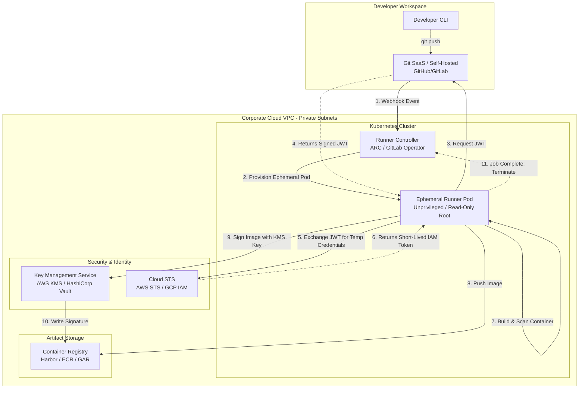

# CI/CD - Part 1 - Technical Study Guide & Notes

# CI/CD (Part 1/3): Core Foundations, Topologies, and Ephemeral Execution

---

## 1. Part Introduction and Scope

This guide establishes the foundational architectures, execution topologies, and security paradigms of modern Continuous Integration and Continuous Delivery (CI/CD). 

### Scope of Part 1
* **Structural Topologies**: Decoupled, ephemeral build execution models (Kubernetes-native runners) versus legacy static VM runner pools.
* **Branching Mechanics**: Deep mathematical and operational comparison of Trunk-Based Development (TBD) versus GitFlow.
* **Hermetic Build Pipelines**: The construction of deterministic, reproducible pipelines that eliminate external runtime state mutation.
* **Identity Federation (OIDC)**: Complete elimination of long-lived static cloud credentials in CI/CD pipelines.
* **Hands-on Implementations**: Production-grade, security-hardened configurations (GitHub Actions, Docker Buildx, Cosign, AWS OIDC) alongside the core command-line plumbing required to operate these systems at scale.

---

## 2. Why Core CI/CD Foundations are Critical for High-Availability Systems

In high-availability (HA) systems, the CI/CD pipeline is not merely an automation script; it is the **sole authoritative path to production**. The reliability, speed, and security of this path directly dictate the system's Mean Time to Resolution (MTTR) and Service Level Objectives (SLOs).

```
┌────────────────────────────────────────────────────────────────────────┐
│                        CRITICAL PATH TO RECOVERY                       │
│                                                                        │
│  Production   ───►  Identify  ───►  Write  ───►  CI/CD Pipeline  ───►  │
│   Incident           Root Cause      Hotfix       (Must be Fast/       │
│  (P0 Outage)                                       Deterministic)      │
└────────────────────────────────────────────────────────────────────────┘
```

### The Cost of Flaky and Slow Pipelines
When a critical P0 incident occurs in production, the time to deploy a hotfix is bounded by the pipeline's execution duration. 
* A pipeline that takes **45 minutes** due to unoptimized caching, static agent queuing, or serial execution directly inflates MTTR by 45 minutes.
* A pipeline that is **flaky** (e.g., fails 10% of the time due to network timeouts, shared state on static runners, or race conditions) forces engineers to repeatedly retry builds, introducing cognitive load and unpredictable delays during high-stress incidents.

### Blast Radius & Security Compromise
If a CI/CD build agent is compromised due to shared state, persistent execution environments, or hardcoded secrets, the blast radius spans the entire cloud infrastructure. An attacker who gains control of a persistent runner can:
1. Exfiltrate long-lived AWS IAM/GCP Service Account keys stored on the disk.
2. Inject malicious payloads (e.g., backdoors, cryptominers) into container images or binaries.
3. Pivot laterally to other systems within the runner's Virtual Private Cloud (VPC).

### Determinism and Reproducibility
High-availability systems require **hermetic builds**—builds that yield the exact same output binary/image given the same source code input, independent of the host environment or external network state. Without determinism, debugging a production issue becomes a multi-variable nightmare, as the binary running in production may contain dependencies or configurations that cannot be reproduced locally.

---

## 3. Real-World Enterprise Use Cases

### Use Case 1: Zero-Trust Ephemeral Builds in Financial Technology
* **The Challenge**: A global fintech enterprise running hundreds of microservices required a CI/CD architecture that complied with PCI-DSS Requirement 6.4.3 (strict control over production deployments) and eliminated the risk of credential theft from build agents.
* **The Solution**: The team implemented GitHub Actions Runner Controller (ARC) on a dedicated, private Amazon EKS cluster. 
    * Every build job triggers the dynamic provisioning of an ephemeral Kubernetes Pod runner that is destroyed immediately upon job completion.
    * The runner authenticates to AWS dynamically via **OpenID Connect (OIDC)** and AWS STS, obtaining a scoped IAM session token valid for a maximum of 1 hour.
    * No static AWS keys are stored inside GitHub or on the runner's disk.
* **The Impact**: Zero persistent attack surface. Compromise of a single runner pod grants the attacker access to a short-lived IAM token restricted to a single AWS account/role, which automatically expires within minutes.

### Use Case 2: High-Scale E-Commerce Trunk-Based Delivery
* **The Challenge**: A major e-commerce platform experienced frequent merge conflicts, integration delays, and deployment bottlenecks during peak shopping seasons due to a legacy GitFlow branching model. Code freezes lasted days, and releases occurred bi-weekly.
* **The Solution**: The organization transitioned to **Trunk-Based Development** paired with automated feature flags.
    * Engineers commit small, incremental changes directly to the `main` branch multiple times per day.
    * Every commit triggers a highly optimized GitLab CI pipeline utilizing **distributed S3 caching** and **Docker Buildx remote cache backends** (`type=registry,mode=max`).
    * Build times were reduced from 52 minutes to **3 minutes and 40 seconds**.
* **The Impact**: Deployment frequency increased from 0.07 deployments/day to **42 deployments/day**, while the Change Failure Rate dropped from 18% to **under 2.5%** because changes were small, isolated, and rapidly testable.

---

## 4. Comprehensive Architecture Explanation

The following architecture represents a modern, enterprise-grade Git-to-Artifact pipeline topology. It utilizes a **Pull-Based Ephemeral Runner Model** on Kubernetes, incorporating OpenID Connect (OIDC) for cloud authentication, dynamic runner scaling, and cryptographic container signing.

### Architectural Workflow
1. **Developer Push**: A developer pushes code to the remote Git Repository.
2. **Webhook Trigger**: The Git Platform sends a webhook event to the Runner Controller (e.g., GitHub Actions Runner Controller or GitLab Runner Operator) running inside a private Kubernetes VPC.
3. **Dynamic Pod Provisioning**: The Controller scales up an ephemeral Runner Pod in a private subnet with no inbound internet access.
4. **OIDC Handshake**: The Runner Pod requests a JSON Web Token (JWT) from the Git Platform's OIDC Provider, then exchanges this JWT with the Cloud Provider's STS (Security Token Service) for a temporary IAM Role session.
5. **Secure Build & Scan**: The runner pulls code, runs hermetic tests, builds a container image using Docker Buildx, and scans it for vulnerabilities using an inline scanner (e.g., Trivy/Snyk).
6. **Artifact Push**: The image is pushed to an Enterprise Container Registry (e.g., Harbor, Amazon ECR).
7. **Cryptographic Signing**: The runner uses **Cosign** (paired with a Key Management Service like AWS KMS) to cryptographically sign the container image, attesting that it passed all quality gates.
8. **Pod Demolition**: The Runner Controller immediately terminates the Pod, wiping all local storage and memory.

### Mermaid Architecture Diagram



---

## 5. Types, Classifications, and Component Topologies

### A. Branching Strategies: Comprehensive Comparison

| Metric / Dimension | Trunk-Based Development (TBD) | GitFlow | GitHub Flow |
| :--- | :--- | :--- | :--- |
| **Merge Frequency** | Multiple times per day to `main`. | Weekly, bi-weekly, or monthly to `develop`/`master`. | Daily to `main` via short-lived feature branches. |
| **Branch Lifespan** | < 24 hours. | Weeks to months. | 1 to 3 days. |
| **Release Mechanism** | Feature flags / dark launches. | Release branches (`release/*`). | Merging to `main` triggers immediate production deploy. |
| **Merge Conflict Resolution** | Trivial; continuous integration prevents drift. | Painful ("Merge Hell"); massive drift over time. | Moderate; isolated to feature branch lifespan. |
| **Best-Fit Architecture** | Microservices, SaaS, continuous deployment. | Monoliths, scheduled releases, regulated software. | Web applications, continuous delivery. |
| **Blast Radius of Bad Commit** | High (mitigated by automated rollbacks/flags). | Low (caught in long QA cycles, but delays releases). | Medium (mitigated by rapid rollbacks). |

---

### B. Runner Architectures: Ephemeral vs. Static

#### 1. Ephemeral / Dynamic Runners (Kubernetes Pods, ECS Tasks)
* **Mechanics**: A controller listens for job queues. It API-provisions a single-use container/VM for one specific job. Once the job completes, the container/VM is destroyed.
* **Pros**: Complete process isolation; zero configuration drift; absolute security boundaries; cost-efficient (scale-to-zero).
* **Cons**: Cold-start latency (pulling runner images); complex initial setup; requires robust caching strategies (distributed network caches).

#### 2. Static / Persistent Runners (Dedicated VMs, Bare Metal)
* **Mechanics**: A pool of virtual or physical machines remains continuously online, polling the CI queue. Jobs run sequentially or concurrently on the same OS instance.
* **Pros**: Zero cold-start latency; local disk caching is fast and simple.
* **Cons**: Massive security risk (cross-job data leakage, persistent credentials); configuration drift (e.g., "it works on Runner 3 but fails on Runner 4"); high idle costs.

---

### C. Continuous Delivery Models: Push vs. Pull

```
PUSH MODEL:
┌───────────────┐      kubectl apply / helm upgrade      ┌────────────────────┐
│  CI Runner    │───────────────────────────────────────►│ Kubernetes Cluster │
└───────────────┘                                        └────────────────────┘

PULL MODEL (GitOps):
┌───────────────┐                                        ┌────────────────────┐
│  Git Repo     │◄───────────────────────────────────────│ GitOps Operator    │
│  (State Store)│          Polls state & reconciles      │ (ArgoCD / Flux)    │
└───────────────┘                                        └────────────────────┘
```

#### Push-Based CD
* **Workflow**: The CI runner executes a deployment command (e.g., `kubectl apply`, `helm upgrade`, `terraform apply`) directly against the target environment's API.
* **Security Implications**: The runner **must** possess high-privilege credentials (e.g., cluster-admin kubeconfig, CloudOwner IAM) to write to the production environment. This makes the runner a high-value target for attackers.

#### Pull-Based CD (GitOps)
* **Workflow**: An agent (e.g., ArgoCD, Flux) runs *inside* the target cluster and continuously polls a Git repository representing the desired state. It reconciles the cluster's actual state with the Git repository.
* **Security Implications**: The CI runner needs **zero** production cloud credentials. It only needs write access to the Git repository containing Kubernetes manifests. The cluster does not expose its API control plane to the external network.

---

## 6. Step-by-Step Production Implementation Guide

This guide details the implementation of a secure, ephemeral build pipeline. We will configure an **AWS OIDC Trust Relationship**, install the **GitHub Actions Runner Controller (ARC)** on an EKS cluster, and deploy an ephemeral runner pool.

### Step 1: Establish AWS OIDC Identity Provider (IdP)
Create the OIDC trust relationship so GitHub Actions can request temporary AWS credentials without static access keys.

```bash
# Define variables
export AWS_REGION="us-east-1"
export OIDC_PROVIDER_URL="token.actions.githubusercontent.com"
export OIDC_AUDIENCE="sts.amazonaws.com"

# Retrieve the thumbprint of the GitHub OIDC CA certificate
# (Required for AWS IAM OIDC Provider creation)
export GITHUB_CA_THUMBPRINT="1c58a3a8518e8759bf075b76b750d4f2df264fcd"

# Create the IAM OIDC Provider
aws iam create-open-id-connect-provider \
    --url "https://${OIDC_PROVIDER_URL}" \
    --client-id-list "${OIDC_AUDIENCE}" \
    --thumbprint-list "${GITHUB_CA_THUMBPRINT}"
```

### Step 2: Create a Security-Hardened IAM Role for CI/CD
Create an IAM Trust Policy that restricts role assumption to a specific GitHub Organization and Repository.

Save the following as `trust-policy.json` (replace `my-org` and `my-repo` with your actual organization and repository names):

```json
{
  "Version": "2012-10-17",
  "Statement": [
    {
      "Effect": "Allow",
      "Principal": {
        "Federated": "arn:aws:iam::123456789012:oidc-provider/token.actions.githubusercontent.com"
      },
      "Action": "sts:AssumeRoleWithWebIdentity",
      "Condition": {
        "StringEquals": {
          "token.actions.githubusercontent.com:aud": "sts.amazonaws.com"
        },
        "StringLike": {
          "token.actions.githubusercontent.com:sub": "repo:my-org/my-repo:ref:refs/heads/main"
        }
      }
    }
  ]
}
```

Execute the command to create the role:

```bash
aws iam create-role \
    --role-name "github-actions-cicd-role" \
    --assume-role-policy-document file://trust-policy.json
```

Attach a policy allowing ECR artifact pushing:

```bash
aws iam attach-role-policy \
    --role-name "github-actions-cicd-role" \
    --policy-arn "arn:aws:iam::aws:policy/AmazonEC2ContainerRegistryPowerUser"
```

### Step 3: Install GitHub Actions Runner Controller (ARC) on EKS
Using Helm, deploy the controller and the custom resource definitions (CRDs) into your EKS cluster.

```bash
# Add the Helm repository
helm repo add actions-runner-controller https://actions-runner-controller.github.io/actions-runner-controller
helm repo update

# Install the controller in its own namespace
helm upgrade --install arc \
    actions-runner-controller/actions-runner-controller \
    --namespace actions-runner-system \
    --create-namespace \
    --set authSecret.create=true \
    --set authSecret.github_token="ghp_YOUR_GITHUB_PERSONAL_ACCESS_TOKEN_WITH_ADMIN_OR_REPO_SCOPE"
```

### Step 4: Deploy the Ephemeral Runner Deployment Manifest
Apply this Kubernetes manifest to define a self-scaling, ephemeral runner pool. Each runner pod runs as an unprivileged user with a read-only root filesystem.

Save as `runner-deployment.yaml`:

```yaml
apiVersion: actions.summerwind.dev/v1alpha1
kind: RunnerDeployment
metadata:
  name: dynamic-runner-pool
  namespace: actions-runner-system
spec:
  replicas: 2
  template:
    spec:
      repository: my-org/my-repo
      # Enforce dynamic scaling: pods are destroyed immediately after executing one job
      ephemeral: true
      securityContext:
        runAsNonRoot: true
        runAsUser: 1000
        fsGroup: 2000
      containers:
        - name: runner
          image: summerwind/actions-runner:latest
          imagePullPolicy: Always
          resources:
            limits:
              cpu: "2"
              memory: "4Gi"
            requests:
              cpu: "1"
              memory: "2Gi"
          securityContext:
            readOnlyRootFilesystem: true
            allowPrivilegeEscalation: false
            capabilities:
              drop:
                - ALL
          volumeMounts:
            - name: tmp-dir
              mountPath: /tmp
            - name: runner-work
              mountPath: /runner/_work
      volumes:
        - name: tmp-dir
          emptyDir: {}
        - name: runner-work
          emptyDir: {}
---
apiVersion: actions.summerwind.dev/v1alpha1
kind: HorizontalRunnerAutoscaler
metadata:
  name: runner-asg
  namespace: actions-runner-system
spec:
  scaleTargetRef:
    name: dynamic-runner-pool
  minReplicas: 1
  maxReplicas: 10
  metrics:
    - type: PercentageRunnersBusy
      scaleUpThreshold: "75"
      scaleDownThreshold: "20"
```

Apply the configuration:

```bash
kubectl apply -f runner-deployment.yaml
```

---

## 7. Standard CLI Commands with Deep Technical Explanations

### 1. Git Plumbing for Change-Detection Builds
In mono-repositories or high-scale environments, we must avoid rebuilding services that have not changed. Use Git plumbing commands to determine the exact delta between the current commit and the target branch.

```bash
git diff-tree --no-commit-id --name-only -r HEAD
```
* **`diff-tree`**: Compares the content of trees associated with two commit objects.
* **`--no-commit-id`**: Suppresses the commit ID output header, returning only the raw list of modified file paths.
* **`--name-only`**: Returns only the names of changed files, omitting structural diff details (additions/deletions). Useful for parsing inside shell scripts.
* **`-r`**: Recursively traverses subdirectories.
* **`HEAD`**: Tells Git to compare the current working commit against its immediate parent.

---

### 2. Docker Buildx with Distributed Cache Exporters
Docker Buildx allows building multi-architecture images and exporting intermediate build layers to remote registries to accelerate subsequent builds.

```bash
docker buildx build \
  --platform linux/amd64,linux/arm64 \
  --tag my-registry.io/app:v1.0.0 \
  --cache-from type=registry,ref=my-registry.io/app:build-cache \
  --cache-to type=registry,ref=my-registry.io/app:build-cache,mode=max \
  --provenance=true \
  --sbom=true \
  --push .
```
* **`--platform linux/amd64,linux/arm64`**: Instructs the build engine to compile the image for both x86_64 and ARM64 architectures concurrently using QEMU emulation or native builders.
* **`--cache-from type=registry,ref=...`**: Specifies a remote OCI registry as the input cache source. The builder pulls down cached layers from this location instead of rebuilding them locally.
* **`--cache-to type=registry,ref=...,mode=max`**: Exports the build cache back to the registry. 
    * **`mode=max`**: Forces Buildx to export intermediate layers for all stages (including multi-stage builds), not just the final image layers. This maximizes cache hits on future runs.
* **`--provenance=true`**: Generates SLSA (Software Supply Chain Levels for Software Artifacts) build provenance attestations, describing exactly how the image was built.
* **`--sbom=true`**: Automatically generates a Software Bill of Materials (SBOM) using tools like Syft and embeds it in the final OCI image index.

---

### 3. Cosign Cryptographic Artifact Signing
Cosign is part of the Sigstore project, used to sign and verify OCI artifacts.

```bash
cosign sign \
  --key awskms://arn:aws:kms:us-east-1:123456789012:key/a1b2c3d4-e5f6-7a8b-9c0d-1e2f3a4b5c6d \
  -y \
  my-registry.io/app:v1.0.0
```
* **`sign`**: Generates a cryptographic signature for the specified container image.
* **`--key awskms://...`**: Specifies the URI of an asymmetric signing key stored inside AWS KMS. The private key never leaves the KMS Hardware Security Module (HSM); the payload hash is sent to KMS, and the signed hash is returned.
* **`-y`**: Automatically answers "yes" to confirmation prompts, essential for non-interactive CI/CD runs.
* **`my-registry.io/app:v1.0.0`**: The target OCI image. Cosign uploads the signature as a separate object in the same registry tag directory.

---

## 8. Production Configuration Examples

### Production GitHub Actions Workflow (`.github/workflows/ci.yml`)
This configuration defines a secure, high-performance pipeline that uses AWS OIDC, builds with Buildx caching, runs security scans, and signs the resulting image.

```yaml
name: Production Secure Build Pipeline

on:
  push:
    branches:
      - main
  pull_request:
    branches:
      - main

# Explicitly strip all default permissions, granting only required scopes
permissions:
  contents: read
  id-token: write # Required for OIDC JWT generation

jobs:
  build-and-secure-publish:
    name: Build, Scan, and Sign Artifact
    runs-on: ubuntu-latest
    
    # Restrict execution environment to prevent unauthorized access
    environment: production

    steps:
      - name: Checkout Source Code
        uses: actions/checkout@v4
        with:
          persist-credentials: false # Prevent Git credentials from residing on disk

      - name: Configure AWS Credentials (OIDC Identity Federation)
        uses: aws-actions/configure-aws-credentials@v4
        with:
          role-to-assume: arn:aws:iam::123456789012:role/github-actions-cicd-role
          aws-region: us-east-1
          audience: sts.amazonaws.com
          role-session-name: GHA-Session-${{ github.run_id }}

      - name: Set up QEMU (Multi-Arch Support)
        uses: docker/setup-qemu-action@v3

      - name: Set up Docker Buildx
        uses: docker/setup-buildx-action@v3

      - name: Log in to Amazon ECR
        id: login-ecr
        uses: aws-actions/amazon-ecr-login@v2

      - name: Build and Push OCI Image
        uses: docker/build-push-action@v5
        id: build-image
        with:
          context: .
          file: ./Dockerfile
          push: true
          tags: ${{ steps.login-ecr.outputs.registry }}/production-app:${{ github.sha }}
          # Optimize caching by utilizing the GitHub Actions cache API
          cache-from: type=gha
          cache-to: type=gha,mode=max
          provenance: true
          sbom: true

      - name: Install Cosign
        uses: sigstore/cosign-installer@v3.3.0

      - name: Cryptographically Sign Container Image
        run: |
          cosign sign \
            --key awskms://arn:aws:kms:us-east-1:123456789012:key/a1b2c3d4-e5f6-7a8b-9c0d-1e2f3a4b5c6d \
            -y \
            ${{ steps.login-ecr.outputs.registry }}/production-app:${{ github.sha }}

      - name: Run Vulnerability Scan (Trivy)
        uses: aquasecurity/trivy-action@master
        with:
          image-ref: ${{ steps.login-ecr.outputs.registry }}/production-app:${{ github.sha }}
          format: 'sarif'
          output: 'trivy-results.sarif'
          severity: 'HIGH,CRITICAL'
          exit-code: '1' # Break the build if High or Critical vulnerabilities are found

      - name: Upload Scan Results to Security Tab
        uses: github/codeql-action/upload-sarif@v3
        if: always() # Ensure scan results are uploaded even if Trivy fails the build
        with:
          sarif_file: 'trivy-results.sarif'
```

---

## 9. Security Considerations & Hardening Best Practices

### A. OpenID Connect (OIDC) Security Architecture
Using static long-lived credentials (such as AWS IAM Access Keys stored as GitHub Actions secrets) introduces key rotation overhead and risk of credential exposure. OIDC solves this through a federated trust handshake:

```
┌──────────┐                                                   ┌───────────┐
│  GitHub  │─── 1. Requests OIDC JWT token with Claims ───────►│  GitHub   │
│  Runner  │◄── 2. Returns cryptographically signed JWT ───────│  OIDC IdP │
└──────────┘                                                   └───────────┘
     │
     │ 3. Requests temporary credentials (AssumeRoleWithWebIdentity)
     ▼
┌──────────┐
│ AWS STS  │─── 4. Validates JWT signature against GitHub IdP ─► (Valid)
└──────────┘
     │
     ▼ 5. Generates & returns temporary IAM session credentials (1 hour max)
┌──────────┐
│  GitHub  │
│  Runner  │
└──────────┘
```

#### How to Harden the Trust Policy
Always constrain the `sub` (Subject) claim in your cloud provider's IAM trust policy. Never use wildcard matches on organization levels alone (e.g., `repo:my-org/*`). An attacker could create a public repository under your organization and use it to assume your production roles.

**Hardened Subject Claim Examples:**
* Restrict to a single repository on a specific branch:  
  `repo:my-org/my-repo:ref:refs/heads/main`
* Restrict to tags matching a release pattern:  
  `repo:my-org/my-repo:ref:refs/tags/v*`

---

### B. Network Isolation of Runners
* **Zero Inbound Connectivity**: Ephemeral runners must reside in private subnets with **no public IP addresses** and **no inbound firewall rules open**. They communicate with the parent Git Platform via outbound polling connections over HTTPS (Port 443) using persistent TCP connections or WebSockets.
* **Egress Filtering**: Restrict outbound traffic from build subnets using security groups or network firewalls. A build agent should only be allowed to resolve and connect to:
    1. The Git control plane (e.g., `github.com`).
    2. Specific public package registries (e.g., `registry.npmjs.org`, `files.pythonhosted.org`).
    3. Internal cloud endpoints (ECR, KMS, STS).
* **VPC Endpoints**: For AWS deployments, route all traffic destined for S3, ECR, KMS, and STS through **VPC Gateway/Interface Endpoints** to ensure traffic never leaves the private AWS backbone network.

---

### C. Mitigation of Poisoned Pipeline Execution (PPE)
PPE occurs when an attacker modifies a pipeline configuration file (e.g., `.github/workflows/ci.yml`) in a pull request, forcing the runner to execute malicious code with the permissions of the target branch.

#### Mitigation Strategies
1. **Require Approval for Fork Pull Requests**: Configure your Git platform to require explicit manual approval from an administrator before running CI pipelines on pull requests submitted from forks.
2. **Isolate Pull Request Secrets**: Never expose production secrets or allow OIDC role assumption on `pull_request` events. Use the `pull_request_target` event with extreme caution, as it runs in the context of the base branch but can checkout untrusted code if misconfigured.
3. **Pin Third-Party Actions to SHA-256 Hashes**: Never reference actions by mutable tags (e.g., `uses: actions/checkout@v4`). An attacker who compromises the repository of that action can update the tag to point to a malicious release. Instead, pin actions to their immutable SHA-256 commit hash:
   `uses: actions/checkout@b4ffde65f46336ab88eb53be808477a3936bae11 # v4.1.1`

---

## 10. Observability & Monitoring Considerations

To maintain high availability of build infrastructure, you must monitor both the health of the runner platform and the performance of individual pipelines.

### A. Crucial Prometheus Metrics to Watch

| Metric Name | Type | Description | Alerting Threshold |
| :--- | :--- | :--- | :--- |
| `runner_listener_job_queue_duration_seconds` | Histogram | Time a job spends waiting in the queue before an ephemeral runner picks it up. | Warn: > 60s<br/>Critical: > 180s (indicates runner starvation). |
| `runner_worker_execution_duration_seconds` | Histogram | Execution time of active jobs. | Alert if deviation from 30-day moving average is > 3x standard deviation. |
| `runner_errors_total` | Counter | Total count of runner system-level failures (e.g., Docker daemon crash, out of memory). | Critical: > 1 in 5 minutes (indicates infrastructural failure). |
| `kube_pod_container_status_terminated_reason` | Gauge | Kubernetes termination status. Tracks pods killed due to `OOMKilled`. | Critical: Any occurrence with reason `OOMKilled`. |

### B. Log Aggregation and Audit Trails
1. **System Logs**: Forward logs from the Runner Controller and container runtime (Docker/containerd) via FluentBit/Logstash to a centralized log management tool (e.g., OpenSearch, Datadog). Look for system errors such as:
   `API rate limit exceeded`, `No space left on device`, or `Failed to pull image`.
2. **Job Logs**: Stream job execution logs to read-only, long-term object storage (e.g., S3 with Object Lock enabled) to satisfy compliance and security auditing requirements.
3. **Audit Trails**: Monitor CloudTrail (AWS) or Activity Logs (Azure) for `AssumeRoleWithWebIdentity` API calls. Correlate the `role-session-name` (which should embed the unique CI run ID) with the corresponding Git execution log to verify authenticity.

---

## 11. Common Troubleshooting Scenarios with Root Cause Analysis (RCA)

### Scenario 1: Docker-in-Docker (DinD) Disk Exhaustion on Kubernetes Nodes
* **Symptom**: Ephemeral runner pods fail mid-build with the error: `no space left on device`. EKS worker nodes transition to `DiskPressure` state and evict unrelated system pods.
* **Root Cause Analysis (RCA)**: The ephemeral runner pod uses Docker-in-Docker to build images. By default, DinD writes all intermediate container layers to `/var/lib/docker` inside the runner container. Because the root filesystem of the pod is backed by the host node's primary storage disk, multiple concurrent multi-gigabyte builds can rapidly consume the node's local storage capacity.
* **Resolution Steps**:
    1. Modify the Runner Pod specification to mount an **ephemeral `emptyDir` volume** with a configured storage medium or size limit to `/var/lib/docker`.
    2. Configure a Kubernetes cron job to run `docker system prune -a --volumes -f` periodically on persistent nodes, or switch to rootless, daemonless build tools like **Kaniko** or **Buildah** that build images in user-space without requiring a running Docker daemon.

---

### Scenario 2: OIDC Token Exchange Failure (`403 Forbidden` from AWS STS)
* **Symptom**: Pipeline fails during the AWS credential configuration step with the error: 
  `An error occurred (AccessDenied) when calling the AssumeRoleWithWebIdentity operation: OpenIDConnect provider's HTTPS certificate thumbprint does not match`.
* **Root Cause Analysis (RCA)**: AWS validates the identity of the OIDC provider (GitHub) using a SHA-1 cryptographic thumbprint of the root certificate authority (CA) that signed the provider's SSL certificate. If GitHub rotates its SSL certificates (which occurs periodically), the thumbprint stored in the AWS IAM OIDC Provider configuration becomes invalid, causing STS to reject all token exchange requests.
* **Resolution Steps**:
    1. Retrieve the new active thumbprint of GitHub's OIDC certificate.
    2. Update the IAM OIDC Provider thumbprint list in AWS:
       ```bash
       aws iam update-open-id-connect-provider-thumbprint \
         --open-id-connect-provider-arn "arn:aws:iam::123456789012:oidc-provider/token.actions.githubusercontent.com" \
         --thumbprint-list "1c58a3a8518e8759bf075b76b750d4f2df264fcd" "NEW_THUMBPRINT_HERE"
       ```
    3. *Recommended*: Migrate to AWS's automated thumbprint management if supported in your region, which dynamically tracks root CA changes.

---

### Scenario 3: Cache Pollution Leading to Production Runtime Failures
* **Symptom**: A node application builds successfully in CI and deploys to production, but crashes immediately on startup with a `TypeError: Cannot read property of undefined` or a missing module error. The issue cannot be reproduced locally.
* **Root Cause Analysis (RCA)**: The pipeline configuration uses a generic cache key based on the branch name (e.g., `cache-node-modules-${{ github.ref_name }}`). A previous build on that branch installed an experimental or corrupted dependency. Because the cache key did not change, subsequent builds pulled the corrupted `node_modules` folder from the cache rather than performing a clean installation of the lockfile's declared dependencies.
* **Resolution Steps**:
    1. Bind the cache key directly to the cryptographic hash of the dependency lockfile:
       ```yaml
       key: ${{ runner.os }}-node-${{ hashFiles('**/package-lock.json') }}
       ```
    2. Ensure the install command uses clean installation flags (e.g., `npm ci` instead of `npm install`). `npm ci` bypasses package installation if the lockfile is out of sync and deletes existing `node_modules` before running.

---

## 12. Common Mistakes and How to Avoid Them in Production

### Mistake 1: Relying on the `latest` Tag for Base Images and Actions
* **The Danger**: Using `FROM ubuntu:latest` in a Dockerfile or `uses: actions/checkout@v4` in a workflow introduces non-deterministic behavior. If the upstream image or action updates, your pipeline can break without any changes to your code.
* **The Solution**: Pin base images to their specific **cryptographic digest (SHA-256)** and actions to their commit hash.
  * *Bad*: `FROM node:20`
  * *Good*: `FROM node:20.11.0-alpine3.19@sha256:c02690b207a97478059048c895964828f73e7210e30d7b70744047a74075b6e2`

### Mistake 2: Running CI/CD Jobs with Elevated or Root Privileges
* **The Danger**: Many pre-built runner images run as the `root` user by default. If an attacker exploits a remote code execution vulnerability in a dependency during tests, they gain root access to the runner OS or container.
* **The Solution**: Enforce non-root execution in the runner container spec (`runAsNonRoot: true`, `runAsUser: 1000`). If building containers, use daemonless tools like Kaniko, which run entirely in user-space and do not require root privileges or access to the host's `/var/run/docker.sock`.

### Mistake 3: Failing to Clean Up Ephemeral Workspace Directories on Persistent Runners
* **The Danger**: If you must use persistent runners, failing to clean up the workspace directory after a job can leak sensitive files (e.g., `.env` files, build logs, API keys) to subsequent runs executed by other users on the same host.
* **The Solution**: Implement a strict `always()` cleanup step at the end of every workflow to wipe the workspace.
  ```yaml
  - name: Post-Job Workspace Cleanup
    if: always()
    run: rm -rf ${{ github.workspace }}/*
  ```

---

## 13. Enterprise-Level Recommendations

### A. Distributed Caching Strategies
In a microservices architecture, building every service from scratch on every commit is highly inefficient.
* **Remote Build Caching**: For Monorepos, implement build systems like **Bazel**, **Turborepo**, or **Nx**. These tools compute a hash of the source files for each package and check a remote storage bucket (S3/GCS) for an existing build artifact before executing a build step. If the hash matches, they download the pre-compiled binary in milliseconds.
* **Docker Multi-Stage Cache Tuning**: Ensure your Dockerfile layers are ordered from least-frequently changed to most-frequently changed.
  ```dockerfile
  # Layer 1: Base OS (Rarely changes)
  FROM node:20-alpine
  WORKDIR /app
  
  # Layer 2: Dependencies (Changes only when package.json changes)
  COPY package.json package-lock.json ./
  RUN npm ci
  
  # Layer 3: Source Code (Changes on every commit)
  COPY . .
  RUN npm run build
  ```

### B. Pull-Through Package Mirrors
To avoid rate limiting (e.g., Docker Hub pull limits) and safeguard against public registry outages (e.g., npm registry downtime), configure enterprise pull-through caches and repository managers (such as **JFrog Artifactory** or **Sonatype Nexus**).
* Configure your runners to route all dependency resolution requests through these internal mirrors.
* Enable automated vulnerability scanning at the proxy level to prevent malicious packages from entering your build environment.

---

## 14. Advanced Concepts

### A. Hermetic Build Environments
A **hermetic build** is executed in an environment that is completely isolated from the internet and the host machine's configuration.
* **Characteristics**:
    * No network access during the compilation stage. All dependencies must be pre-fetched and declared in a lockfile.
    * No access to host system clocks or environment variables (preventing time-based or environment-based non-determinism).
    * Compiler outputs are byte-for-byte identical regardless of whether they are built on macOS, Linux, or a CI runner.
* **Tooling**: **Nix** and **Bazel** are the industry standards for achieving hermeticity. They construct sandboxed file trees containing only the explicitly declared compilers and dependencies required for the build.

---

### B. Software Bill of Materials (SBOM) & SLSA Framework

```
SLSA LEVEL 3 PIPELINE COMPLIANCE:
┌──────────────┐      Hermetic Build      ┌──────────────┐      Cryptographic Attestation      ┌──────────────────┐
│ Source Code  │─────────────────────────►│ Build Engine │────────────────────────────────────►│ Secured Artifact │
│ (Signed Git) │                          │ (Isolated)   │      (Cosign + Provenance JSON)     │ (ECR / Harbor)   │
└──────────────┘                          └──────────────┘                                     └──────────────────┘
```

* **SBOM**: A structured machine-readable inventory of all software components, libraries, and dependencies embedded within an artifact. Standard formats include **SPDX** and **CycloneDX**. Generating an SBOM allows organizations to quickly identify if they are vulnerable to newly disclosed CVEs (like Log4j).
* **SLSA (Software Supply Chain Levels for Software Artifacts)**: A security framework that provides a set of incrementally harder standards to secure the software supply chain.
    * **SLSA Level 1**: Requires an automated build process that generates provenance metadata describing how the artifact was built.
    * **SLSA Level 2**: Requires version control and signed provenance generated by a hosted build service (preventing tampering).
    * **SLSA Level 3**: Requires that the build platform is hardened against tampering, executes builds in isolated/hermetic environments, and generates non-falsifiable cryptographic attestations of provenance.

---

## 15. Integration with Other DevOps Tools

### 1. HashiCorp Vault Integration
Instead of storing static secrets in your Git platform, use OIDC to authenticate with HashiCorp Vault and fetch dynamic, short-lived secrets on the fly.

```yaml
- name: Retrieve Secrets from HashiCorp Vault
  uses: hashicorp/vault-action@v2
  with:
    url: https://vault.enterprise.io:8200
    role: ci-runner-role
    method: jwt
    jwtGithubAudience: sts.amazonaws.com
    secrets: |
      secret/data/production/database password | DB_PASSWORD ;
      secret/data/production/api_key token | API_KEY
```

### 2. Infrastructure-as-Code (Terraform) Execution in CI/CD
To prevent concurrent state modifications and maintain a clear audit trail, execute Terraform plans within your CI/CD pipeline.

```yaml
- name: Terraform Plan
  run: terraform plan -out=tfplan -input=false
  env:
    TF_IN_AUTOMATION: "true" # Suppresses interactive CLI output formatting

- name: Upload Terraform Plan Artifact
  uses: actions/upload-artifact@v4
  with:
    name: tfplan
    path: tfplan
    retention-days: 1 # Keep plan files short-lived
```

---

## 16. Comprehensive Comparison of Competing Tools

| Dimension | GitHub Actions | GitLab CI | Jenkins | Tekton (K8s Native) |
| :--- | :--- | :--- | :--- | :--- |
| **Execution Latency** | Low (if using warm runners). | Low (efficient runner polling). | High (JVM startup + dynamic node provisioning overhead). | Extremely Low (native K8s controller loop). |
| **Infrastructure Overhead** | Zero (SaaS) to Low (ARC). | Zero (SaaS) to Low. | High (requires dedicated VM master + worker maintenance). | High (requires deep K8s operator administration). |
| **Security Model** | Strong (OIDC, fine-grained permissions, isolated environments). | Strong (OIDC, runner token isolation). | Weak (legacy master-agent model, shared workspace risks). | Strongest (fully sandboxed Kubernetes Pods per step). |
| **Configuration Style** | YAML | YAML | Groovy (Jenkinsfile) / UI | Kubernetes CRDs (YAML) |
| **Extensibility** | Massive (GitHub Marketplace). | Moderate (via custom CI templates). | Massive (legacy plugin ecosystem, high maintenance). | High (via custom Task and Pipeline resources). |
| **Cost Profile** | Pay-per-minute (SaaS) or compute cost (self-hosted). | Pay-per-minute or compute cost. | Flat VM costs (high idle waste unless tuned). | Compute cost of K8s cluster (highly optimized). |
| **Primary Use Case** | Cloud-native SaaS or hybrid enterprise apps. | Single-pane-of-glass DevSecOps platforms. | Legacy monolithic systems, complex custom pipelines. | High-scale, Kubernetes-native platform engineering. |

---

## 17. Visual Cheat Sheet: Core Pipelines & Tooling

```
┌──────────────────────────────────────────────────────────────────────────────────────────────────┐
│                                     CI/CD FOUNDATIONAL CHEAT SHEET                               │
├──────────────────────────────┬──────────────────────────────────┬────────────────────────────────┤
│ COMMAND / TECHNIQUE          │ PRIMARY FLAG / PARAMETER         │ OPERATIONAL USE CASE           │
├──────────────────────────────┼──────────────────────────────────┼────────────────────────────────┤
│ git diff-tree                │ --no-commit-id --name-only -r    │ High-performance mono-repo     │
│                              │                                  │ change-detection builds.       │
├──────────────────────────────┼──────────────────────────────────┼────────────────────────────────┤
│ docker buildx build          │ --cache-to type=gha,mode=max     │ Maximizes layer reuse across   │
│                              │                                  │ multi-stage builds.            │
├──────────────────────────────┼──────────────────────────────────┼────────────────────────────────┤
│ cosign sign                  │ --key awskms://<arn>             │ Cryptographic artifact signing │
│                              │                                  │ without local private keys.    │
├──────────────────────────────┼──────────────────────────────────┼────────────────────────────────┤
│ OIDC IAM Policy              │ StringLike: sub: repo:org/repo:* │ Eliminates persistent cloud    │
│                              │                                  │ access keys in CI systems.     │
├──────────────────────────────┼──────────────────────────────────┼────────────────────────────────┤
│ Trivy Scan                   │ --exit-code 1                    │ Automated vulnerability gate   │
│                              │                                  │ to block insecure deployments. │
└──────────────────────────────┴──────────────────────────────────┴────────────────────────────────┘
```

---

## 18. Comprehensive Final Learning Summary

In this first part of our CI/CD series, we established the core principles of enterprise-grade integration and delivery pipelines. We analyzed how a pipeline's performance and stability directly impact system MTTR and SLOs. 

### Key Takeaways
1. **Trunk-Based Development** is the preferred branching strategy for high-velocity, high-availability teams, drastically reducing merge conflicts and integration delays compared to legacy GitFlow models.
2. **Ephemeral, pull-based runner topologies** (such as those managed by the GitHub Actions Runner Controller) provide complete isolation between build runs, eliminating configuration drift and reducing the attack surface.
3. **OpenID Connect (OIDC)** is a critical security control for modern pipelines. It establishes a federated trust relationship between your Git platform and cloud providers, eliminating the need for long-lived static secrets.
4. **Hermetic build principles**, cryptographic artifact signing with **Cosign**, and automated **SBOM generation** are essential components of a secure software supply chain, helping organizations achieve SLSA Level 3 compliance.

In **Part 2**, we will build upon these foundations to explore advanced deployment strategies (Blue/Green, Canary, Progressive Delivery), automated rollback patterns, and deep integration with GitOps controllers like ArgoCD and Flux.

## CI/CD Interview Preparation Guide (Part 1/3)

---

### Q1. Compare Declarative and Scripted pipelines in Jenkins. Under what conditions does the Groovy CPS (Continuation-Passing Style) engine fail, and how do you resolve `@NonCPS` serialization issues?

**Detailed Answer**:
Jenkins pipelines are historically split into Scripted (imperative Groovy) and Declarative (structured, opinionated DSL). 
*   **Scripted Pipelines** execute within a highly flexible Groovy environment. They offer maximum programmability but lack strict structural validation, making them harder to maintain, audit, and secure. They rely heavily on programmatic constructs (`try/catch/finally`, loops, dynamic method dispatch).
*   **Declarative Pipelines** enforce a strict, pre-defined schema (`pipeline`, `agent`, `stages`, `steps`, `post`). This structure allows Jenkins to pre-validate the pipeline syntax before execution, render the pipeline in the Blue Ocean UI, and automatically handle common requirements like cleanups and stage restarts.

The execution engine behind Jenkins Pipelines is the **CPS (Continuation-Passing Style) engine**. CPS transforms standard Groovy code so that execution can be paused (persisted to disk) and resumed across Jenkins controller restarts or agent disconnections. The engine serializes the execution state (local variables, call stacks, loop states). 

CPS failure occurs when the code executes non-serializable objects (such as raw XML parsers, database connections, regex matchers like `java.util.regex.Matcher`, or closures containing non-serializable states). When the engine attempts to serialize these objects at a pipeline checkpoint, it throws a `java.io.NotSerializableException`.

To resolve serialization issues, you must isolate non-serializable operations into methods annotated with `@NonCPS`. This annotation instructs the CPS interpreter to execute the method using standard, high-performance JVM execution without attempting to pause or serialize its internal state. However, `@NonCPS` methods have strict limitations: they cannot call pipeline steps (e.g., `sh`, `echo`, `error`), and they must complete their execution quickly to avoid blocking the execution thread.

**Production Scenario / Practical Example**:
A pipeline parses a complex JSON payload using Groovy's `JsonSlurper` (which is not serializable) to extract deployment metadata. If executed directly in a standard pipeline step, it fails with a `NotSerializableException` upon the next pipeline pause point.

```groovy
// Jenkinsfile
pipeline {
    agent any
    stages {
        stage('Parse Config') {
            steps {
                script {
                    def rawJson = '{"env": "prod", "replicas": 5, "region": "us-east-1"}'
                    // Call the NonCPS helper method
                    def config = parseJsonPayload(rawJson)
                    
                    // Use the serialized safe map back in the pipeline
                    echo "Deploying to ${config.env} in region ${config.region}"
                }
            }
        }
    }
}

// Annotation forces standard JVM execution, bypassing CPS serialization
@NonCPS
Map parseJsonPayload(String jsonString) {
    // JsonSlurperClassic is non-serializable but safe inside @NonCPS
    def slurper = new groovy.json.JsonSlurperClassic()
    def parsed = slurper.parseText(jsonString)
    
    // Return a standard, serializable LinkedHashMap
    return [
        env: parsed.env,
        replicas: parsed.replicas,
        region: parsed.region
    ]
}
```

---

### Q2. Explain the security boundary and isolation differences between Shared, Dedicated, and Ephemeral CI/CD runners (e.g., GitLab Runner, GitHub Actions Runner). How do you configure a secure, zero-trust Kubernetes-based ephemeral executor?

**Detailed Answer**:
Runner architecture dictates the security posture of an entire CI/CD platform. The configurations differ across three main topologies:
1.  **Shared Runners**: Multi-tenant runners serving multiple teams/repositories. Without strict isolation, malicious pipeline code in Repository A can access the file system, environment variables, or docker sockets of Repository B.
2.  **Dedicated Runners**: Single-tenant VMs or bare-metal instances allocated to a specific project. While isolating teams from each other, they still suffer from "dirty state" issues where successive builds run on the same OS, allowing residual artifacts or compromised credentials to persist across runs.
3.  **Ephemeral Runners**: Single-use, dynamic executors (usually Kubernetes Pods or ephemeral VMs) spawned for a single job and immediately destroyed upon completion. This guarantees a clean state and minimizes the blast radius of a compromised build.

To build a **zero-trust Kubernetes-based ephemeral executor** (using GitLab Runner Kubernetes Executor or GitHub Actions Runner Controller - ARC), you must enforce strict security boundaries:
*   **No Privileged Containers**: Avoid mounting `/var/run/docker.sock` or running containers with `securityContext.privileged: true`. Doing so allows container escape to the host node.
*   **Network Policies**: Restrict egress traffic from the build pods. They should only talk to the internal container registry, package managers, and the VCS control plane.
*   **Dedicated Service Accounts**: Assign a minimal IAM/RBAC role to the pod. Avoid using the `default` service account.
*   **Rootless Execution**: Enforce non-root user execution inside the runner pod (`runAsNonRoot: true`, `runAsUser: 10001`).

**Production Scenario / Practical Example**:
Below is a secure, production-grade Kubernetes manifest template for an ephemeral runner pod configuration used by a Kubernetes Executor, enforcing rootless execution, read-only root filesystems, and strict resource boundaries.

```yaml
apiVersion: v1
kind: Pod
metadata:
  name: secure-ephemeral-runner
  namespace: cicd-runners
  labels:
    tier: executor
spec:
  securityContext:
    runAsNonRoot: true
    runAsUser: 10001
    runAsGroup: 10001
    fsGroup: 10001
    seccompProfile:
      type: RuntimeDefault
  containers:
    - name: runner-helper
      image: gitlab/gitlab-runner-helper:x86_64-latest
      securityContext:
        allowPrivilegeEscalation: false
        readOnlyRootFilesystem: true
        capabilities:
          drop:
            - ALL
      resources:
        limits:
          cpu: "2"
          memory: 4Gi
        requests:
          cpu: "500m"
          memory: 1Gi
      volumeMounts:
        - name: tmp-volume
          mountPath: /tmp
        - name: build-dir
          mountPath: /builds
  volumes:
    - name: tmp-volume
      emptyDir: {}
    - name: build-dir
      emptyDir: {}
```

---

### Q3. Detail the mechanics of CI caching versus Artifact storage. How do you design an optimal, multi-layer caching strategy for Node.js (npm/yarn) and Go builds in a distributed runner architecture?

**Detailed Answer**:
Though often confused, **CI Caching** and **Artifact Storage** serve fundamentally different purposes, lifecycles, and reliability requirements:
*   **CI Caching**: Designed to speed up build times by reusing transient dependencies (e.g., `node_modules`, `.gradle/caches`, Go module cache) across pipeline runs. Caches are stored in fast, local, or object-storage-backed directories. They are non-essential; if a cache is deleted or missed, the build must still succeed by downloading dependencies from scratch. Caches are write-once, read-many, and key-based (using content hashes of lockfiles).
*   **Artifact Storage**: Designed to store the immutable, verified output of a successful build (e.g., `.war`, `.tar.gz`, Docker images, compiled binaries). These are stored in dedicated artifact repositories (JFrog Artifactory, Sonatype Nexus, AWS ECR) with strict access controls, semantic versioning, and retention policies. Artifacts must be highly available and durable; downstream deployment stages depend on them.

To design an **optimal multi-layer caching strategy** in a distributed runner architecture (e.g., runners spread across multiple Kubernetes nodes or cloud instances):
1.  **Layer 1: Local Runner Cache**: Use fast, host-path-mounted SSD directories for local builds running on the same VM.
2.  **Layer 2: Distributed Object Storage Cache**: Use S3, GCS, or MinIO backed by high-speed networks to share caches across different runner nodes.
3.  **Layer 3: Lock-file Hashing**: Generate deterministic cache keys using cryptographic hashes of dependency lockfiles (`package-lock.json`, `go.sum`).
4.  **Fallback Keys**: Provide fallback keys to restore the closest historical cache if an exact match is not found (e.g., falling back to `npm-cache-refs/heads/main` if `npm-cache-<git-commit-sha>` misses).

**Production Scenario / Practical Example**:
Optimized multi-layer caching configuration for a GitHub Actions workflow handling both Go and Node.js dependencies in a monorepo.

```yaml
name: Optimized Build Pipeline
on: [push]

jobs:
  build:
    runs-on: ubuntu-latest
    steps:
      - name: Checkout Code
        uses: actions/checkout@v4

      # Layer 3/4: Node.js Dependency Caching with exact-match and fallback keys
      - name: Cache Node Modules
        uses: actions/cache@v4
        with:
          path: ~/.npm
          key: ${{ runner.os }}-node-${{ hashFiles('**/package-lock.json') }}
          restore-keys: |
            ${{ runner.os }}-node-
            ${{ runner.os }}-

      # Layer 3/4: Go Modules and Build Cache
      - name: Cache Go Build Cache & Modules
        uses: actions/cache@v4
        with:
          path: |
            ~/go/pkg/mod
            ~/.cache/go-build
          key: ${{ runner.os }}-go-${{ hashFiles('**/go.sum') }}
          restore-keys: |
            ${{ runner.os }}-go-

      - name: Install Node Dependencies
        run: npm ci --prefer-offline --no-audit

      - name: Build Go Binary
        run: go build -v -o app ./cmd/main.go
```

---

### Q4. Compare Push-based (e.g., Jenkins/GitLab CI executing kubectl) and Pull-based (e.g., ArgoCD/Flux) Continuous Delivery. What are the security, drift, and scalability implications of each model?

**Detailed Answer**:
The choice between Push-based and Pull-based CD represents a fundamental architectural split in how software is delivered to production.

| Metric | Push-Based CD (e.g., GitLab CI, Jenkins) | Pull-Based CD (e.g., ArgoCD, Flux) |
| :--- | :--- | :--- |
| **Mechanics** | The CI/CD runner runs a script (e.g., `kubectl apply -f manifest.yaml`) to push changes directly to the Kubernetes API. | An agent running inside the Kubernetes cluster polls a Git repository, detects changes, and pulls/applies them. |
| **Security Boundary** | **High Risk**. The CI/CD runner must hold high-privilege credentials (kubeconfig, AWS IAM keys) to access the target cluster. If the CI runner is compromised, the cluster is compromised. | **Zero-Trust (Inbound)**. No external credentials are exposed. The agent runs inside the cluster using native Kubernetes Service Accounts. The cluster only needs read access to Git. |
| **Configuration Drift** | **Not Handled**. If a developer manually edits a resource using `kubectl edit`, the CI pipeline is unaware of the change until the next run. | **Self-Healing**. The agent continuously reconciles the live cluster state with the desired state in Git, automatically reverting manual changes. |
| **Scalability** | **Difficult**. Managing hundreds of target clusters requires managing hundreds of credentials, network firewalls, and pipeline runners. | **Excellent**. Each cluster manages its own state reconciliation, distributing the compute and scheduling load across the fleet. |

**Production Scenario / Practical Example**:
An enterprise platform shifts from a push-based GitLab CI pipeline to a pull-based ArgoCD GitOps model. Below is the ArgoCD `Application` manifest that defines the pull-based synchronization, self-healing, and automated pruning of resources.

```yaml
apiVersion: argoproj.io/v1alpha1
kind: Application
metadata:
  name: core-payment-service
  namespace: argocd
spec:
  project: default
  source:
    repoURL: 'https://github.com/enterprise-org/gitops-manifests.git'
    targetRevision: HEAD
    path: apps/payment-service/overlays/production
  destination:
    server: 'https://kubernetes.default.svc'
    namespace: production
  syncPolicy:
    automated:
      prune: true        # Delete resources no longer present in Git
      selfHeal: true     # Overwrite manual changes / configuration drift
    syncOptions:
      - CreateNamespace=true
      - ApplyOutOfSyncOnly=true
```

---

### Q5. Explain how Directed Acyclic Graphs (DAGs) optimize pipeline execution compared to traditional phase-based execution. Provide a GitLab CI configuration implementing a complex DAG.

**Detailed Answer**:
Traditional phase-based pipelines execute sequentially: Stage A must completely finish all its jobs before Stage B can begin. For example, if Stage A contains a slow integration test job for Component 1, and Stage B contains a build job for Component 2, the build job for Component 2 is blocked waiting for Component 1's tests to finish, even though there are no dependencies between them. This creates significant bottlenecks and wastes compute resources.

**Directed Acyclic Graphs (DAGs)** remove stage-based sequencing. Instead of relying on rigid stages, you define explicit dependency relationships between individual jobs. A job can start executing the exact millisecond its declared dependencies are satisfied, regardless of whether other jobs in the same or previous stages are still running.

This yields:
*   **Reduced Cycle Time**: Independent execution paths bypass slow, unrelated jobs.
*   **Optimal Resource Allocation**: Runners are utilized as soon as work is ready, smoothing out resource utilization spikes.
*   **Granular Failure Isolation**: If an independent branch of the DAG fails, other branches can continue to build and deploy to staging environments.

**Production Scenario / Practical Example**:
Consider a monorepo containing a frontend application, a backend API, and database migrations. The frontend build does not depend on the database migration. Using a DAG, the frontend can build and deploy to staging while the backend waits for migrations to finish and then deploys.

```yaml
stages:
  - test
  - build
  - deploy

# Stage: Test
test-frontend:
  stage: test
  script:
    - cd frontend && npm run test

test-backend:
  stage: test
  script:
    - cd backend && go test ./...

migrate-db:
  stage: test
  script:
    - ./scripts/run-migrations.sh

# Stage: Build
build-frontend:
  stage: build
  needs: ["test-frontend"] # Starts immediately after test-frontend completes
  script:
    - cd frontend && npm run build
  artifacts:
    paths:
      - frontend/dist/

build-backend:
  stage: build
  needs: ["test-backend"] # Starts immediately after test-backend completes
  script:
    - cd backend && go build -o api
  artifacts:
    paths:
      - backend/api

# Stage: Deploy
deploy-frontend:
  stage: deploy
  needs: ["build-frontend"] # Deploys frontend even if migrations/backend are still running
  script:
    - aws s3 sync frontend/dist/ s3://prod-frontend-bucket/

deploy-backend:
  stage: deploy
  needs: ["build-backend", "migrate-db"] # Requires BOTH the backend build and migrations to pass
  script:
    - ./scripts/deploy-api.sh backend/api
```

---

### Q6. How does OpenID Connect (OIDC) federation eliminate static cloud provider credentials in CI/CD pipelines? Provide a complete GitHub Actions workflow and AWS IAM Role Trust Policy implementing this.

**Detailed Answer**:
Historically, CI/CD pipelines deploying to cloud providers (AWS, GCP, Azure) required static, long-lived credentials (e.g., `AWS_ACCESS_KEY_ID` and `AWS_SECRET_ACCESS_KEY`) stored as repository secrets. This pattern presents severe security risks:
*   **Credential Leakage**: Secrets can be exposed via compromised runners, malicious dependencies, or accidental logging.
*   **No Automatic Rotation**: Static keys are rarely rotated, violating compliance frameworks (SOC2, ISO27001).
*   **Broad Blast Radius**: Compromised static credentials often grant broad, permanent access to cloud accounts.

**OpenID Connect (OIDC) federation** completely eliminates static secrets. It establishes a cryptographic trust relationship between the Identity Provider (e.g., GitHub, GitLab) and the Cloud Provider (e.g., AWS IAM). 

The OIDC authentication flow operates as follows:
1.  When a pipeline job starts, the CI runner requests a temporary JSON Web Token (JWT) from the CI platform's OIDC provider.
2.  The CI platform signs the JWT with its private key and injects it into the runner environment.
3.  The runner presents this JWT directly to the cloud provider's Security Token Service (STS) using the `AssumeRoleWithWebIdentity` API call.
4.  The cloud provider validates the JWT's signature against the CI platform's public key (retrieved via its well-known OIDC configuration endpoint).
5.  The cloud provider validates the claims in the JWT (e.g., verifying that the repository name, branch, and organization match the trust policy).
6.  If valid, STS issues short-lived (e.g., 15 to 60 minutes) temporary security credentials directly to the runner.

**Production Scenario / Practical Example**:
Here is the configuration required to set up OIDC between GitHub Actions and AWS:

#### 1. AWS IAM Role Trust Policy (`trust-policy.json`)
This policy establishes trust with GitHub's OIDC provider and restricts role assumption strictly to a specific repository (`enterprise-org/payment-gateway`) on the `main` branch.

```json
{
  "Version": "2012-10-17",
  "Statement": [
    {
      "Effect": "Allow",
      "Principal": {
        "Federated": "arn:aws:iam::123456789012:oidc-provider/token.actions.githubusercontent.com"
      },
      "Action": "sts:AssumeRoleWithWebIdentity",
      "Condition": {
        "StringEquals": {
          "token.actions.githubusercontent.com:aud": "sts.amazonaws.com"
        },
        "StringLike": {
          "token.actions.githubusercontent.com:sub": "repo:enterprise-org/payment-gateway:ref:refs/heads/main"
        }
      }
    }
  ]
}
```

#### 2. GitHub Actions Workflow (`.github/workflows/deploy.yml`)
The workflow requests the OIDC token via `permissions: id-token: write` and assumes the AWS IAM role.

```yaml
name: Secure AWS Deployment via OIDC

on:
  push:
    branches:
      - main

permissions:
  id-token: write  # Required to request the JWT OIDC token
  contents: read   # Required for actions/checkout

jobs:
  deploy:
    runs-on: ubuntu-latest
    steps:
      - name: Checkout Code
        uses: actions/checkout@v4

      - name: Configure AWS Credentials via OIDC
        uses: aws-actions/configure-aws-credentials@v4
        with:
          role-to-assume: arn:aws:iam::123456789012:role/github-actions-payment-gateway-role
          aws-region: us-east-1
          audience: sts.amazonaws.com

      - name: Verify AWS Identity
        run: |
          aws sts get-caller-identity
```

---

### Q7. Analyze the security and performance trade-offs of using Docker-in-Docker (DinD) versus Kaniko or Buildah for building container images inside a Kubernetes-based CI/CD runner.

**Detailed Answer**:
Building container images inside containerized CI/CD environments is a standard requirement. However, doing so securely and efficiently presents significant challenges.

#### 1. Docker-in-Docker (DinD)
*   **Mechanism**: Runs a fully functional Docker daemon inside a container.
*   **Security Implications**: **Highly Insecure**. Requires the runner container to run in `privileged` mode (`securityContext.privileged: true`). This grants the container root-level capabilities over the host kernel, bypassing all cgroup and namespace boundaries. A compromised build step can easily gain root access to the underlying Kubernetes node, escape to the host, and compromise the entire cluster.
*   **Performance**: Fast, as it supports native layer caching and standard Docker storage drivers (like `overlay2`).

#### 2. Kaniko (by Google)
*   **Mechanism**: Runs as a rootless, self-contained executor. It does not rely on a Docker daemon. Instead, it unpacks the base image filesystem in the container's user space, executes the Dockerfile commands sequentially, and pushes the new layers directly to the target registry.
*   **Security Implications**: **Highly Secure**. Does not require privileged mode or access to the host's Docker socket. It runs entirely within user space and can run as a non-root user (with some caveats regarding specific Dockerfile instructions).
*   **Performance**: Slower than DinD because it must snapshot the filesystem after each instruction. However, it supports remote caching (storing layers in a container registry) to mitigate this.

#### 3. Buildah (by Red Hat)
*   **Mechanism**: A lightweight tool designed to build OCI-compliant images without a daemon. It integrates natively with Podman.
*   **Security Implications**: **Secure**. Supports true rootless builds utilizing user namespaces (`subuid` and `subgid` mapping) to safely emulate root execution inside the container without granting actual host privileges.
*   **Performance**: Excellent performance when running on hosts with native overlay filesystem support, but requires complex configuration inside Kubernetes pods due to mounting requirements.

**Production Scenario / Practical Example**:
Here is a secure, production-grade GitLab CI configuration that uses **Kaniko** to build and push a Docker image to AWS ECR without requiring privileged access.

```yaml
build_image:
  stage: build
  image:
    name: gcr.io/kaniko-project/executor:v1.14.0-debug
    entrypoint: [""]
  variables:
    # Disable SSL verification only if using a private self-signed registry
    # AWS_DEFAULT_REGION: us-east-1
    REGISTRY_URL: "123456789012.dkr.ecr.us-east-1.amazonaws.com"
    IMAGE_NAME: "payment-service"
    IMAGE_TAG: $CI_COMMIT_SHORT_SHA
  script:
    # Generate ECR credentials / config for Kaniko
    - mkdir -p /kaniko/.docker
    # Kaniko automatically reads standard AWS IAM credentials via OIDC if configured
    - echo "{\"credsStore\":\"ecr-login\"}" > /kaniko/.docker/config.json
    # Run the Kaniko executor
    - /kaniko/executor
      --context "${CI_PROJECT_DIR}"
      --dockerfile "${CI_PROJECT_DIR}/Dockerfile"
      --destination "${REGISTRY_URL}/${IMAGE_NAME}:${IMAGE_TAG}"
      --destination "${REGISTRY_URL}/${IMAGE_NAME}:latest"
      --cache=true
      --cache-repo="${REGISTRY_URL}/${IMAGE_NAME}-cache"
```

---

### Q8. Describe how Git branching strategies (GitFlow, Trunk-Based Development, GitHub Flow) map to CI/CD pipeline triggers. Write a GitFlow-compliant GitLab CI configuration routing triggers based on target branches.

**Detailed Answer**:
Git branching strategies directly dictate the design, frequency, and execution rules of CI/CD pipelines.

#### 1. GitFlow
*   **Topology**: Heavy branching structure with `main`, `develop`, `feature/*`, `release/*`, and `hotfix/*`.
*   **CI/CD Mapping**:
    *   `feature/*` triggers fast linting, unit testing, and static analysis on push.
    *   `develop` triggers deployment to a shared Development environment.
    *   `release/*` triggers deployment to a Staging/UAT environment and executes intensive integration/regression test suites.
    *   `main` (or `master`) triggers production deployment and generates immutable release tags.

#### 2. Trunk-Based Development
*   **Topology**: Developers merge small, frequent commits directly into a single `main` branch (trunk). Feature flags are used to isolate uncompleted features.
*   **CI/CD Mapping**: Every single commit to `main` must trigger a comprehensive, highly optimized pipeline that runs tests, builds artifacts, and ideally deploys automatically to production (Continuous Deployment) or staging. Branch-specific routing is minimal; the focus is on speed and automated rollbacks.

#### 3. GitHub Flow
*   **Topology**: A lightweight, branch-based workflow. Developers create feature branches off `main`, open Pull Requests, and merge back to `main` once approved.
*   **CI/CD Mapping**:
    *   PR creation/update triggers test suites and optionally spawns ephemeral preview environments.
    *   Merge to `main` triggers production deployment.

**Production Scenario / Practical Example**:
Below is a production-grade GitLab CI configuration that implements routing rules tailored for **GitFlow**:

```yaml
stages:
  - test
  - deploy-dev
  - deploy-staging
  - deploy-prod

# Global Defaults
default:
  image: node:20-alpine

# Stage: Test (Runs on ALL branches and Merge Requests)
run-tests:
  stage: test
  script:
    - npm ci
    - npm test
  rules:
    - if: $CI_PIPELINE_SOURCE == "merge_request_event"
    - if: $CI_COMMIT_BRANCH

# Stage: Deploy to Dev (Only triggers on pushes to the 'develop' branch)
deploy-to-dev:
  stage: deploy-dev
  script:
    - echo "Deploying to Development Environment..."
    - ./scripts/deploy.sh dev
  rules:
    - if: $CI_COMMIT_BRANCH == "develop"

# Stage: Deploy to Staging (Only triggers on 'release/*' or 'hotfix/*' branches)
deploy-to-staging:
  stage: deploy-staging
  script:
    - echo "Deploying to Staging Environment..."
    - ./scripts/deploy.sh staging
  rules:
    - if: $CI_COMMIT_BRANCH =~ /^release\/.*/
    - if: $CI_COMMIT_BRANCH =~ /^hotfix\/.*/

# Stage: Deploy to Production (Only triggers on the 'main' branch)
deploy-to-production:
  stage: deploy-prod
  script:
    - echo "Deploying to Production Environment..."
    - ./scripts/deploy.sh prod
  rules:
    - if: $CI_COMMIT_BRANCH == "main"
      when: manual # Enforce manual gate for production deployments
```

---

### Q9. How do you construct an end-to-end SAST, Dependency Scanning, and Container Vulnerability pipeline stage? Write a GitHub Actions job integrating Trivy and failing the build if high-severity vulnerabilities are detected.

**Detailed Answer**:
A modern DevSecOps pipeline must inject security scanning into multiple layers of the lifecycle before code reaches production. This is often referred to as "shifting left". A comprehensive pipeline includes three distinct scanning stages:

1.  **Static Application Security Testing (SAST)**: Analyzes source code for security vulnerabilities, bad coding practices, and hardcoded secrets (e.g., SQL injections, buffer overflows, exposed API keys) without executing the application. Tools include SonarQube, Semgrep, and Bandit.
2.  **Software Composition Analysis (SCA) / Dependency Scanning**: Scans transitive third-party dependencies (defined in `package-lock.json`, `go.sum`, `requirements.txt`) against known vulnerability databases (like CVE, NVD). Tools include Snyk, OWASP Dependency-Check, and Trivy.
3.  **Container Vulnerability Scanning**: Scans the compiled container image layers, including the base OS packages (e.g., OpenSSL, glibc) and system libraries, for vulnerabilities. Tools include Trivy, Clair, and Grype.

To prevent security regressions, these tools must be configured to return non-zero exit codes when vulnerabilities exceeding a specific threshold (e.g., `HIGH` or `CRITICAL`) are discovered. This action immediately breaks the build and prevents the artifact from progressing through the pipeline.

**Production Scenario / Practical Example**:
Here is a complete GitHub Actions job integrating **Trivy** to perform security scans on both the repository code (SCA) and the compiled Docker image. It is configured to fail the build if any `HIGH` or `CRITICAL` vulnerabilities are detected.

```yaml
name: DevSecOps Security Pipeline

on:
  push:
    branches: [ main ]
  pull_request:
    branches: [ main ]

jobs:
  security-scan:
    name: Security Vulnerability Scanning
    runs-on: ubuntu-latest
    steps:
      - name: Checkout Code
        uses: actions/checkout@v4

      # Step 1: Scan repository filesystem (SCA / Dependency Scan)
      - name: Run Trivy FS Scan (SCA)
        uses: aquasecurity/trivy-action@master
        with:
          scan-type: 'fs'
          scan-ref: '.'
          format: 'table'
          severity: 'HIGH,CRITICAL'
          exit-code: '1' # Fail the build if HIGH or CRITICAL are found

      # Step 2: Build the Docker Image locally
      - name: Build Local Docker Image
        run: |
          docker build -t local/payment-service:${{ github.sha }} .

      # Step 3: Scan the compiled Docker Image before pushing to registry
      - name: Run Trivy Container Image Scan
        uses: aquasecurity/trivy-action@master
        with:
          image-ref: 'local/payment-service:${{ github.sha }}'
          format: 'table'
          severity: 'HIGH,CRITICAL'
          exit-code: '1' # Fail the build if image contains HIGH/CRITICAL vulnerabilities
          ignore-unfixed: true # Ignore CVEs that do not have an official patch yet
```

---

### Q10. Explain Semantic Versioning (SemVer) and how Conventional Commits can automate version bumps and changelog generation in a CI pipeline. Show a semantic-release execution configuration.

**Detailed Answer**:
**Semantic Versioning (SemVer)** enforces a strict versioning schema: `MAJOR.MINOR.PATCH`.
*   **MAJOR**: Incremented when you make incompatible API changes (breaking changes).
*   **MINOR**: Incremented when you add functionality in a backwards-compatible manner.
*   **PATCH**: Incremented when you make backwards-compatible bug fixes.

Manually determining the next version number and updating changelogs is error-prone and leads to version drift. **Conventional Commits** solves this by enforcing a structured format for commit messages. The format is:
`<type>(<scope>): <description>` (with an optional `BREAKING CHANGE:` in the footer).

The mapping between commit types and SemVer bumps is:
*   `fix(api): resolved memory leak` -> Bumps **PATCH** (`1.0.0` -> `1.0.1`)
*   `feat(auth): added OAuth2 support` -> Bumps **MINOR** (`1.0.0` -> `1.1.0`)
*   `feat(db)!: dropped legacy tables` or footer contains `BREAKING CHANGE:` -> Bumps **MAJOR** (`1.0.0` -> `2.0.0`)

In a CI pipeline, tools like `semantic-release` automate this entire process. On a successful build of the `main` branch, `semantic-release`:
1.  Analyzes all commit messages since the last release tag.
2.  Determines the next version number based on the commit types.
3.  Generates a comprehensive `CHANGELOG.md` file listing all new features, fixes, and breaking changes.
4.  Commits and pushes the changelog and updates the version in files (e.g., `package.json`).
5.  Publishes a Git tag and releases the package to package managers or container registries.

**Production Scenario / Practical Example**:
Here is a configuration for a Node.js project running in GitHub Actions that uses `semantic-release` to automate versioning and release generation.

#### 1. Configuration File (`.releaserc.json` / `release.config.js`)
```json
{
  "branches": ["main"],
  "plugins": [
    "@semantic-release/commit-analyzer",
    "@semantic-release/release-notes-generator",
    [
      "@semantic-release/changelog",
      {
        "changelogFile": "CHANGELOG.md"
      }
    ],
    [
      "@semantic-release/npm",
      {
        "npmPublish": false
      }
    ],
    [
      "@semantic-release/git",
      {
        "assets": ["package.json", "CHANGELOG.md"],
        "message": "chore(release): ${nextRelease.version} [skip ci]\n\n${nextRelease.notes}"
      }
    ],
    "@semantic-release/github"
  ]
}
```

#### 2. GitHub Actions Workflow (`.github/workflows/release.yml`)
```yaml
name: Automated Semantic Release

on:
  push:
    branches:
      - main

jobs:
  release:
    name: Release and Publish
    runs-on: ubuntu-latest
    permissions:
      contents: write # Required to push git tags and write CHANGELOG.md
      issues: write
      pull-requests: write
    steps:
      - name: Checkout Code
        uses: actions/checkout@v4
        with:
          persist-credentials: false # Required for semantic-release git plugin to work with custom token

      - name: Setup Node.js
        uses: actions/setup-node@v4
        with:
          node-version: 20

      - name: Install Dependencies
        run: npm ci

      - name: Run Semantic Release
        env:
          GITHUB_TOKEN: ${{ secrets.CUSTOM_GITHUB_TOKEN }} # Must have write permissions to repository
        run: npx semantic-release
```

---

### Q11. Design a multi-environment promotion pipeline (Dev -> Staging -> Prod) that guarantees build immutability. Explain why rebuilding artifacts for each environment is an anti-pattern.

**Detailed Answer**:
Rebuilding deployment artifacts (Docker images, binaries, zip packages) for each target environment is a critical anti-pattern. 
*   **Why it is an anti-pattern**: Rebuilding introduces non-deterministic changes. Even if the source code is identical, external dependencies (e.g., a package resolved via `npm install` or `go get` without an exact lockfile pin), compiler versions, build environment configurations, or OS updates can inject differences into the newly built artifact. This violates the core principle of continuous delivery: **what you test in Staging must be exactly what runs in Production**.
*   **The Immutability Paradigm**: Build the artifact **exactly once** at the beginning of the pipeline (typically on commit to `main` or merge request). This artifact is assigned a unique, immutable identifier (such as a Git SHA-1 hash or cryptographic digest) and stored in an artifact repository. This identical, bite-for-bite binary is then promoted across Dev, Staging, and Production environments. Configuration differences (database connections, API endpoints, secrets) must be injected at runtime using environment variables, ConfigMaps, or secret management systems, never baked into the artifact itself.

**Multi-Environment Promotion Pipeline Design**:
1.  **Build Stage**: Compiles code, runs tests, builds the Docker image, tags it with `$CI_COMMIT_SHA`, and pushes it to ECR.
2.  **Dev Deploy**: Deploys `$CI_COMMIT_SHA` to the Dev namespace. Runs automated smoke tests.
3.  **Staging Deploy**: Deploys the identical `$CI_COMMIT_SHA` to the Staging namespace. Runs integration/performance tests.
4.  **Production Gate**: A manual approval step blocks the pipeline until QA/Product signs off.
5.  **Prod Deploy**: Promotes the identical `$CI_COMMIT_SHA` to Production.

**Production Scenario / Practical Example**:
Below is a GitHub Actions workflow demonstrating immutable artifact promotion using a single Docker image tag across three environments with manual approval gating.

```yaml
name: Immutable Promotion Pipeline

on:
  push:
    branches:
      - main

env:
  REGISTRY: 123456789012.dkr.ecr.us-east-1.amazonaws.com
  IMAGE_NAME: core-payment-service
  ARTIFACT_TAG: ${{ github.sha }}

jobs:
  build:
    name: Build Immutable Artifact
    runs-on: ubuntu-latest
    outputs:
      artifact_tag: ${{ steps.output-tag.outputs.tag }}
    steps:
      - name: Checkout Code
        uses: actions/checkout@v4

      - name: Build and Push Docker Image
        run: |
          echo "Building image version: ${IMAGE_NAME}:${ARTIFACT_TAG}"
          # docker build -t ${REGISTRY}/${IMAGE_NAME}:${ARTIFACT_TAG} .
          # docker push ${REGISTRY}/${IMAGE_NAME}:${ARTIFACT_TAG}
          
      - id: output-tag
        run: echo "tag=${{ env.ARTIFACT_TAG }}" >> $GITHUB_OUTPUT

  deploy-dev:
    name: Deploy to Dev
    needs: build
    runs-on: ubuntu-latest
    environment: development
    steps:
      - name: Deploy to Dev EKS Cluster
        run: |
          echo "Deploying ${REGISTRY}/${IMAGE_NAME}:${{ needs.build.outputs.artifact_tag }} to DEV"
          # helm upgrade --install payment-dev ./charts --set image.tag=${{ needs.build.outputs.artifact_tag }}

  deploy-staging:
    name: Deploy to Staging
    needs: [build, deploy-dev]
    runs-on: ubuntu-latest
    environment: staging
    steps:
      - name: Deploy to Staging EKS Cluster
        run: |
          echo "Deploying ${REGISTRY}/${IMAGE_NAME}:${{ needs.build.outputs.artifact_tag }} to STAGING"
          # helm upgrade --install payment-staging ./charts --set image.tag=${{ needs.build.outputs.artifact_tag }}

  deploy-prod:
    name: Deploy to Production
    needs: [build, deploy-staging]
    runs-on: ubuntu-latest
    # Enforces manual approval gate configured in GitHub Environment settings
    environment: production
    steps:
      - name: Deploy to Production EKS Cluster
        run: |
          echo "Deploying ${REGISTRY}/${IMAGE_NAME}:${{ needs.build.outputs.artifact_tag }} to PRODUCTION"
          # helm upgrade --install payment-prod ./charts --set image.tag=${{ needs.build.outputs.artifact_tag }}
```

---

### Q12. How do you implement path-based change detection (microservices monorepo CI/CD)? Write a GitHub Actions workflow that dynamically executes test and build jobs only for changed sub-projects.

**Detailed Answer**:
In a monorepo containing multiple microservices (e.g., `/services/auth`, `/services/payment`, `/services/shipping`), triggering the entire pipeline to build and test every microservice on every commit is highly inefficient. If a developer changes a single line of CSS in the frontend, rebuilding the Java backend is a waste of compute, time, and money.

To optimize monorepo pipelines, you must implement **path-based change detection**. This mechanism:
1.  Identifies the files modified between the current commit and a base commit (typically the target branch HEAD on a pull request, or the previous commit on a push to `main`).
2.  Maps those changed files to their respective microservice directories.
3.  Dynamically generates a matrix or triggers downstream pipelines only for the affected directories.

To achieve this natively in GitHub Actions, you can use the `tj-actions/changed-files` action or Git commands (e.g., `git diff --name-only $BASE_SHA $HEAD_SHA`). The output is then formatted as a JSON array and passed to a downstream matrix job.

**Production Scenario / Practical Example**:
Below is a complete, production-grade GitHub Actions workflow that dynamically detects changes in three sub-directories (`services/auth`, `services/payment`, `services/shipping`) and executes parallelized matrix jobs only for the modified services.

```yaml
name: Monorepo Dynamic CI

on:
  pull_request:
    branches:
      - main

jobs:
  detect-changes:
    name: Detect Changed Microservices
    runs-on: ubuntu-latest
    outputs:
      services: ${{ steps.set-matrix.outputs.services }}
      any_changed: ${{ steps.set-matrix.outputs.any_changed }}
    steps:
      - name: Checkout Code
        uses: actions/checkout@v4
        with:
          fetch-depth: 0 # Fetch all history for accurate diffs

      # Use git diff to find which directories changed
      - name: Determine Changed Services
        id: set-matrix
        run: |
          # Get list of changed files
          CHANGED_FILES=$(git diff --name-only ${{ github.event.pull_request.base.sha }} ${{ github.event.pull_request.head.sha }})
          echo "Changed files:"
          echo "$CHANGED_FILES"
          
          SERVICES=()
          if echo "$CHANGED_FILES" | grep -q "^services/auth/"; then SERVICES+=('"auth"'); fi
          if echo "$CHANGED_FILES" | grep -q "^services/payment/"; then SERVICES+=('"payment"'); fi
          if echo "$CHANGED_FILES" | grep -q "^services/shipping/"; then SERVICES+=('"shipping"'); fi
          
          if [ ${#SERVICES[@]} -eq 0 ]; then
            echo "services=[]" >> $GITHUB_OUTPUT
            echo "any_changed=false" >> $GITHUB_OUTPUT
          else
            # Join array elements with commas
            JSON_ARRAY=$(IFS=,; echo "[${SERVICES[*]}]")
            echo "services=${JSON_ARRAY}" >> $GITHUB_OUTPUT
            echo "any_changed=true" >> $GITHUB_OUTPUT
          fi

  build-and-test:
    name: Build & Test
    needs: detect-changes
    if: needs.detect-changes.outputs.any_changed == 'true'
    runs-on: ubuntu-latest
    strategy:
      fail-fast: false
      matrix:
        # Dynamically inject the JSON array of changed services
        service: ${{ fromJson(needs.detect-changes.outputs.services) }}
    steps:
      - name: Checkout Code
        uses: actions/checkout@v4

      - name: Setup Node.js
        uses: actions/setup-node@v4
        with:
          node-version: 20

      - name: Run Service Specific CI
        run: |
          echo "Executing CI for microservice: ${{ matrix.service }}"
          cd services/${{ matrix.service }}
          npm ci
          npm test
```

---

### Q13. Detail the architecture of dynamic preview environments (ephemeral deployments) driven by Pull Requests in Kubernetes. How do you automate DNS, Ingress routing, and resource cleanup upon PR closure?

**Detailed Answer**:
Dynamic preview environments (or ephemeral environments) provide a fully isolated copy of an entire application stack for every open Pull Request. This allows QA, product managers, and developers to test features in a production-like environment before they are merged.

#### Architectural Components:
1.  **Kubernetes Namespace Isolation**: Every PR triggers the creation of a dedicated namespace (e.g., `pr-104-payment-service`). This isolates all resources (Pods, Services, ConfigMaps).
2.  **Dynamic DNS Resolution**: A wildcard DNS record (e.g., `*.preview.enterprise.com`) must point to the Kubernetes Ingress Controller's external IP address.
3.  **Dynamic Ingress Routing**: The application's Helm chart or Kubernetes manifests must dynamically compute the Ingress host using the PR number (e.g., `pr104.preview.enterprise.com`).
4.  **Database Isolation**: Each preview environment should spin up a lightweight, ephemeral database pod (e.g., PostgreSQL) pre-seeded with sanitized test data, or dynamically provision an isolated schema in a shared staging database cluster.
5.  **Automated Cleanup**: A pipeline triggered on the PR `closed` event must execute a teardown script (e.g., `helm uninstall` and `kubectl delete namespace`) to free up cluster resources.

**Production Scenario / Practical Example**:
Below is a GitHub Actions workflow that handles the creation of a dynamic preview environment in an EKS cluster on PR creation/update, and handles automated cleanup when the PR is closed.

```yaml
name: Preview Environments

on:
  pull_request:
    types: [opened, synchronize, closed]

env:
  PR_NUMBER: ${{ github.event.number }}
  NAMESPACE: pr-${{ github.event.number }}-preview
  DOMAIN: preview.enterprise.com

jobs:
  deploy-preview:
    if: github.event.action != 'closed'
    runs-on: ubuntu-latest
    steps:
      - name: Checkout Code
        uses: actions/checkout@v4

      - name: Connect to EKS Cluster
        uses: aws-actions/configure-aws-credentials@v4
        with:
          role-to-assume: arn:aws:iam::123456789012:role/eks-deployer-role
          aws-region: us-east-1

      - name: Create Namespace
        run: |
          kubectl create namespace ${{ env.NAMESPACE }} --dry-run=client -o yaml | kubectl apply -f -

      - name: Deploy Stack via Helm
        run: |
          helm upgrade --install payment-pr-${{ env.PR_NUMBER }} ./charts/payment-service \
            --namespace ${{ env.NAMESPACE }} \
            --set ingress.enabled=true \
            --set ingress.hosts[0].host="pr-${{ env.PR_NUMBER }}.${{ env.DOMAIN }}" \
            --set ingress.hosts[0].paths[0].path="/" \
            --set ingress.hosts[0].paths[0].pathType="Prefix" \
            --set config.envName="pr-${{ env.PR_NUMBER }}"

  cleanup-preview:
    if: github.event.action == 'closed'
    runs-on: ubuntu-latest
    steps:
      - name: Connect to EKS Cluster
        uses: aws-actions/configure-aws-credentials@v4
        with:
          role-to-assume: arn:aws:iam::123456789012:role/eks-deployer-role
          aws-region: us-east-1

      - name: Teardown Preview Environment
        run: |
          echo "PR closed. Deleting namespace: ${{ env.NAMESPACE }}"
          helm uninstall payment-pr-${{ env.PR_NUMBER }} --namespace ${{ env.NAMESPACE }} || true
          kubectl delete namespace ${{ env.NAMESPACE }} --wait=false
```

---

### Q14. Explain the mechanics of Blue-Green deployments via CI/CD. How do you safely shift traffic at the DNS or Ingress level, and what metrics trigger an automated rollback?

**Detailed Answer**:
A **Blue-Green Deployment** is a release strategy that minimizes downtime and risk by running two identical production environments, called "Blue" and "Green".

*   **Blue**: Represents the current active production environment receiving 100% of live production traffic.
*   **Green**: Represents the new version of the application being deployed. It is completely isolated from production traffic.

#### Deployment Flow:
1.  **Deploy Green**: The CI/CD pipeline deploys the new version of the application to the "Green" environment.
2.  **Smoke Testing**: The pipeline executes automated integration and smoke tests directly against the Green environment's private IP/internal DNS (e.g., `green.internal.api`).
3.  **Traffic Shift**: Once green is verified, the pipeline triggers a swap at the routing layer. This can occur at:
    *   **DNS Level**: Updating a CNAME record (e.g., AWS Route53). This is slower due to DNS TTL caching.
    *   **Ingress/Load Balancer Level (Recommended)**: Updating the target group of an Application Load Balancer (ALB) or changing the selector of a Kubernetes Service. This shifts traffic almost instantaneously.
4.  **Coexistence & Monitoring**: Both environments run simultaneously for a defined soaking period.
5.  **Rollback or Promote**:
    *   **Rollback**: If anomalies are detected, traffic is instantly routed back to Blue.
    *   **Promote**: If the system remains stable, Blue is decommissioned or kept idle to prepare for the next cycle.

#### Automated Rollback Metrics:
Automated rollback systems continuously poll APM metrics (Prometheus, Datadog, CloudWatch). Key metrics that must trigger an immediate rollback include:
*   **HTTP 5xx Error Rate**: Any spike above a defined threshold (e.g., > 1% of total requests).
*   **Latency p99**: If response time increases significantly (e.g., > 500ms).
*   **System Health**: Pod crash-looping or high CPU/Memory exhaustion.

**Production Scenario / Practical Example**:
Below is a Bash deployment script executed within a CI/CD runner to shift traffic at the Kubernetes Service level by updating the active selector, followed by an automated rollback monitoring loop.

```bash
#!/usr/bin/env bash
set -euo pipefail

# Configuration
SERVICE_NAME="payment-service-router"
NAMESPACE="production"
PROMETHEUS_URL="http://prometheus-k8s.monitoring.svc.cluster.local:9090"

# Determine current active environment
CURRENT_ACTIVE=$(kubectl get svc "$SERVICE_NAME" -n "$NAMESPACE" -o jsonpath='{.spec.selector.version}')

if [ "$CURRENT_ACTIVE" == "blue" ]; then
    TARGET_ENV="green"
else
    TARGET_ENV="blue"
fi

echo "Current active environment is: $CURRENT_ACTIVE. Shifting traffic to: $TARGET_ENV"

# Step 1: Patch the service selector to point to the new target environment
kubectl patch svc "$SERVICE_NAME" -n "$NAMESPACE" -p "{\"spec\":{\"selector\":{\"version\":\"$TARGET_ENV\"}}}"

# Step 2: Monitor metrics for a 2-minute soaking period
echo "Traffic shifted. Starting 2-minute soak and rollback monitoring..."
for i in {1..12}; do
    sleep 10
    
    # Query Prometheus for HTTP 5xx rate on the new target environment
    # If 5xx rate > 1% in the last 1 minute, trigger rollback
    ERROR_RATE=$(curl -sG --data-urlencode "query=sum(rate(http_requests_total{status=~'5..', env='$TARGET_ENV'}[1m])) / sum(rate(http_requests_total[1m])) * 100" "$PROMETHEUS_URL/api/v1/query" \
      | jq -r '.data.result[0].value[1] // "0"')
    
    # Convert float to integer for basic bash comparison
    ERROR_INT=${ERROR_RATE%.*}
    if [ -n "$ERROR_INT" ] && [ "$ERROR_INT" -ge 1 ]; then
        echo "CRITICAL: HTTP 5xx error rate is $ERROR_RATE%. Rolling back to $CURRENT_ACTIVE immediately!"
        kubectl patch svc "$SERVICE_NAME" -n "$NAMESPACE" -p "{\"spec\":{\"selector\":{\"version\":\"$CURRENT_ACTIVE\"}}}"
        exit 1
    fi
    echo "Soak check $i/12 passed. Error rate: $ERROR_RATE%"
done

echo "Deployment succeeded. $TARGET_ENV is now the primary production environment."
```

---

### Q15. Contrast Canary deployments with Progressive Delivery using Argo Rollouts. Provide an Argo Rollout manifest utilizing Prometheus queries to automate analysis and rollback.

**Detailed Answer**:
Traditional **Canary Deployments** involve routing a small percentage of production traffic (e.g., 5%) to the new version of an application, manually monitoring dashboards, and then shifting 100% of traffic if no errors are reported. This is often a coarse, manual, and binary process.

**Progressive Delivery** (using tools like Argo Rollouts or Flagger) automates and refines this process:
1.  **Fine-Grained Traffic Routing**: Leverages Service Meshes (Istio, Linkerd) or advanced Ingress Controllers (Nginx, Traefik) to split traffic precisely (e.g., starting at 1%, incrementing by 5% every hour).
2.  **Automated Metric Analysis**: Integrates directly with telemetry sources (Prometheus, Datadog). The system runs background queries at each step to validate the new version's performance.
3.  **Self-Healing / Auto-Rollback**: If any metric query fails (e.g., latency spikes, error rate increases), the rollout is automatically aborted, and traffic is instantly reverted to 0% for the canary version, without human intervention.
4.  **Dry-run/Shadowing**: Can send mirrored, duplicate production traffic to the canary version to test performance without impacting real users.

**Production Scenario / Practical Example**:
Below is a production-grade **Argo Rollouts** manifest (`Rollout` and `AnalysisTemplate`) that automates progressive delivery, increasing traffic in steps while querying Prometheus to ensure the HTTP error rate remains under 1%.

```yaml
apiVersion: argoproj.io/v1alpha1
kind: Rollout
metadata:
  name: payment-service-rollout
  namespace: production
spec:
  replicas: 5
  strategy:
    canary:
      analysis:
        templates:
          - templateName: prometheus-error-rate-check
        args:
          - name: service-name
            value: payment-service
      steps:
        - setWeight: 10
        - pause: { duration: 5m } # Soak at 10% for 5 minutes while running analysis
        - setWeight: 30
        - pause: { duration: 10m }
        - setWeight: 60
        - pause: { duration: 10m }
  selector:
    matchLabels:
      app: payment-service
  template:
    metadata:
      labels:
        app: payment-service
    spec:
      containers:
        - name: payment-service
          image: 123456789012.dkr.ecr.us-east-1.amazonaws.com/payment-service:v2.1.0
          ports:
            - containerPort: 8080

---
apiVersion: argoproj.io/v1alpha1
kind: AnalysisTemplate
metadata:
  name: prometheus-error-rate-check
  namespace: production
spec:
  metrics:
    - name: success-rate
      interval: 1m
      successCondition: result[0] >= 0.99 # Success rate must be >= 99% (error rate < 1%)
      failureLimit: 2 # Allow up to 2 failed checks before aborting
      provider:
        prometheus:
          address: http://prometheus-k8s.monitoring.svc.cluster.local:9090
          query: |
            sum(rate(http_requests_total{status!~"5..", service="{{args.service-name}}"}[2m])) 
            / 
            sum(rate(http_requests_total{service="{{args.service-name}}"}[2m]))
```

---

### Q16. How do you design an enterprise-grade artifact retention policy in JFrog Artifactory or Sonatype Nexus? Write a cleanup script/policy targeting untagged Docker images and old snapshots.

**Detailed Answer**:
In enterprise environments, CI/CD pipelines generate massive volumes of artifacts daily. Without strict, automated retention policies, storage costs in artifact repositories (Nexus, Artifactory, S3) will grow exponentially, and search performance will degrade.

An **enterprise-grade artifact retention policy** must balance compliance, disaster recovery, and cost optimization:
1.  **Differentiate Release vs. Development Artifacts**:
    *   **Releases**: Must be kept indefinitely or for a legally mandated period (e.g., 7 years for financial systems).
    *   **Development / Branch Builds**: Should have a short lifespan (e.g., 7 to 14 days).
2.  **Clean Up Untagged / Orphaned Images**: Docker registries store images as collections of layers. When a tag is overwritten (e.g., pushing `latest` repeatedly), the old image layers become "untagged" or "orphaned" but still consume storage.
3.  **Limit Snapshots / Prereleases**: Retain only the last $N$ builds (e.g., keep only the 5 most recent snapshot builds for any given branch).
4.  **Enforce Metadata-Driven Cleanup**: Use metadata tags (e.g., `git.branch`, `build.status`) to target cleanup candidates.

**Production Scenario / Practical Example**:
Below is a Python script utilizing the **JFrog Artifactory REST API** (AQL - Artifactory Query Language) to identify and delete all Docker images and Maven snapshots that are older than 30 days and are not tagged as production releases.

```python
#!/usr/bin/env python3
import requests
import json
from datetime import datetime, timedelta

ARTIFACTORY_URL = "https://artifactory.enterprise.com/artifactory"
API_TOKEN = "AKCp8j..." # Artifactory Admin/Scavenger Token
HEADERS = {
    "Authorization": f"Bearer {API_TOKEN}",
    "Content-Type": "text/plain"
}

# Define threshold: 30 days ago
threshold_date = (datetime.now() - timedelta(days=30)).strftime("%Y-%m-%dT%H:%M:%SZ")

# Artifactory Query Language (AQL) to find artifacts matching criteria:
# - Located in 'docker-dev-local' or 'maven-snapshots-local'
# - Created more than 30 days ago
# - Do not have the property 'release.status=prod-approved'
aql_query = f'''
items.find({{
    "repo": {{"$eq": "docker-dev-local"}},
    "created": {{"$lt": "{threshold_date}"}},
    "@release.status": {{"$ne": "prod-approved"}}
}})
'''

def run_cleanup():
    # 1. Query for candidates
    response = requests.post(
        f"{ARTIFACTORY_URL}/api/search/aql",
        headers=HEADERS,
        data=aql_query
    )
    response.raise_for_status()
    results = response.json().get("results", [])
    
    print(f"Found {len(results)} artifacts eligible for deletion.")
    
    # 2. Delete found artifacts
    for item in results:
        file_path = f"{item['repo']}/{item['path']}/{item['name']}"
        delete_url = f"{ARTIFACTORY_URL}/{file_path}"
        
        print(f"Deleting: {file_path}")
        # To run dry-run first, comment out the line below
        del_resp = requests.delete(delete_url, headers=HEADERS)
        if del_resp.status_code == 204:
            print(f"Successfully deleted {file_path}")
        else:
            print(f"Failed to delete {file_path}: {del_resp.status_code}")

if __name__ == "__main__":
    run_cleanup()
```

---

### Q17. How do GitOps engines (e.g., ArgoCD) detect configuration drift? Explain the reconciliation loop mechanics and write a manifest to configure self-healing and pruning.

**Detailed Answer**:
At the core of a GitOps engine like ArgoCD is the **Reconciliation Loop**. This loop continuously runs to ensure that the actual state of resources in a live Kubernetes cluster matches the desired state declared in a Git repository.

```
       +-----------------------------------------+
       |                                         |
       |             Git Repository              |
       |       (Desired State: Manifests)        |
       |                                         |
       +--------------------+--------------------+
                            |
                            | Polls / Webhook
                            v
       +--------------------+--------------------+
       |                                         |
       |              ArgoCD Engine              | <---+
       |       (Computes Diff / Reconciles)      |     |
       |                                         |     |
       +--------------------+--------------------+     |
                            |                          |
                            | Applies Changes          | Monitors Live State
                            v                          |
       +--------------------+--------------------+     |
       |                                         |     |
       |            Kubernetes Cluster           | ----+
       |       (Actual State: Live Pods)         |
       |                                         |
       +-----------------------------------------+
```

#### Reconciliation Loop Mechanics:
1.  **Retrieve Desired State**: ArgoCD regularly clones/polls the Git repository containing the target Kubernetes manifests (or Helm charts/Kustomize files).
2.  **Retrieve Actual State**: ArgoCD queries the Kubernetes API Server to fetch the current live configuration of all resources belonging to the application.
3.  **Compute Diff (Drift Detection)**: ArgoCD compares the two states. If there is any discrepancy (e.g., a replica count is 3 in Git but 5 in the cluster, or a developer manually deleted a ConfigMap), ArgoCD marks the application status as `OutOfSync`.
4.  **Reconcile (Self-Healing & Pruning)**:
    *   **Self-Healing**: If enabled, ArgoCD automatically overwrites the manual changes in the live cluster with the configurations defined in Git.
    *   **Pruning**: If resources are deleted from the Git repository, ArgoCD will automatically delete those resources from the live cluster to prevent "orphaned" resources.

**Production Scenario / Practical Example**:
Below is an ArgoCD `Application` manifest configured to automatically reconcile drift, prune deleted resources, and ignore specific non-critical live modifications (such as horizontal pod autoscaler replicas).

```yaml
apiVersion: argoproj.io/v1alpha1
kind: Application
metadata:
  name: payment-service-gitops
  namespace: argocd
spec:
  project: default
  source:
    repoURL: 'https://github.com/enterprise-org/gitops-infra.git'
    targetRevision: HEAD
    path: environments/production/payment-service
  destination:
    server: 'https://kubernetes.default.svc'
    namespace: core-apps
  syncPolicy:
    automated:
      prune: true        # Automatically delete resources no longer in Git
      selfHeal: true     # Automatically overwrite manual cluster modifications
    syncOptions:
      - CreateNamespace=true
      - ApplyOutOfSyncOnly=true # Optimize performance by only applying out-of-sync resources
  ignoreDifferences:
    # Ignore dynamic fields modified by Kubernetes controllers at runtime
    - group: apps
      kind: Deployment
      jsonPointers:
        - /spec/replicas # Prevents ArgoCD from fighting the HorizontalPodAutoscaler (HPA)
```

---

### Q18. How do you design a secure, authenticated webhook architecture to trigger CI/CD pipelines from external VCS platforms (e.g., GitHub Enterprise to an on-premise Jenkins/GitLab)? Provide a verification script using HMAC-SHA256.

**Detailed Answer**:
Webhooks allow Version Control Systems (VCS) to notify CI/CD systems of events (pushes, pull requests) in real-time. However, exposing an unauthenticated CI/CD webhook endpoint to the public internet presents significant security risks:
*   **Denial of Service (DoS)**: Attackers can flood the endpoint with fake payloads, causing the CI system to exhaust its build queue.
*   **Remote Code Execution (RCE)**: If the payload dictates what script to run, an attacker can craft a malicious payload to run arbitrary code on your runners.

To secure inbound webhooks, you must implement **HMAC-SHA256 signature verification**:
1.  **Shared Secret**: Configure a strong, random shared secret key in both the VCS and the CI/CD webhook receiver.
2.  **Signature Generation**: When sending a webhook, the VCS computes a cryptographic hash of the JSON payload body using the shared secret and the HMAC-SHA256 algorithm. It transmits this signature in a header (e.g., `X-Hub-Signature-256` for GitHub).
3.  **Signature Verification**: The CI/CD receiver intercepts the request, reads the raw request body, and computes its own HMAC-SHA256 signature using the local shared secret.
4.  **Constant-Time Comparison**: The receiver compares the computed signature with the header signature using a constant-time comparison algorithm (to prevent timing attacks). If they match, the payload is authentic and can be processed.

**Production Scenario / Practical Example**:
Below is a secure Node.js (Express) microservice designed to act as a webhook receiver. It validates incoming GitHub webhooks using HMAC-SHA256 before triggering a downstream Jenkins job.

```javascript
const express = require('express');
const crypto = require('crypto');
const axios = require('axios');

const app = express();
const PORT = process.env.PORT || 8080;
const WEBHOOK_SECRET = process.env.WEBHOOK_SECRET; // Shared secret key
const JENKINS_URL = "https://jenkins.enterprise.com/generic-webhook-trigger/invoke";

// Capture the raw request body (required for accurate HMAC calculation)
app.use(express.json({
    verify: (req, res, buf) => {
        req.rawBody = buf;
    }
}));

app.post('/webhook', (req, res) => {
    const signature = req.headers['x-hub-signature-256'];
    
    if (!signature) {
        return res.status(401).send('Missing signature header');
    }

    // Compute the expected HMAC signature
    const hmac = crypto.createHmac('sha256', WEBHOOK_SECRET);
    const digest = 'sha256=' + hmac.update(req.rawBody).digest('hex');

    // Use constant-time comparison to prevent timing attacks
    if (!crypto.timingSafeEqual(Buffer.from(signature), Buffer.from(digest))) {
        console.warn('Unauthorized webhook attempt: Signature mismatch.');
        return res.status(403).send('Invalid signature');
    }

    // Signature verified! Process payload.
    const event = req.headers['x-github-event'];
    const repoName = req.body.repository.full_name;
    const branch = req.body.ref ? req.body.ref.replace('refs/heads/', '') : 'unknown';

    console.log(`Verified webhook received for ${repoName} on branch ${branch}`);

    // Trigger downstream Jenkins pipeline
    if (event === 'push' && branch === 'main') {
        axios.post(JENKINS_URL, {
            project: repoName,
            branch: branch,
            commit: req.body.after
        }, {
            headers: { 'Authorization': `Bearer ${process.env.JENKINS_TOKEN}` }
        })
        .then(() => console.log('Successfully triggered Jenkins job.'))
        .catch(err => console.error('Failed to trigger Jenkins:', err.message));
    }

    res.status(200).send('Webhook processed successfully');
});

app.listen(PORT, () => console.log(`Secure webhook receiver running on port ${PORT}`));
```

---

### Q19. Define the four DORA metrics. How do you architect a system to automatically collect, calculate, and visualize these metrics using CI/CD pipeline events and telemetry?

**Detailed Answer**:
The DevOps Research and Assessment (DORA) group identified four key metrics that indicate the performance and velocity of a software delivery organization:

1.  **Deployment Frequency (DF)**: How often successful software releases are deployed to production.
2.  **Lead Time for Changes (LTFC)**: The time it takes for a commit to go from being merged into the codebase to running successfully in production.
3.  **Mean Time to Restore (MTTR)**: The time it takes to recover from a failure or outage in production.
4.  **Change Failure Rate (CFR)**: The percentage of deployments to production that result in a failure (requiring a rollback, hotfix, or patch).

#### Architectural Design for Automated Collection:
To collect these metrics without manual overhead, you must capture events from both the VCS and the Production environment:

```
+---------------+      Deploy Event
|  VCS / Git    +------------------+
+---------------+                  |
                                   v
+---------------+      Deploy Event|      +-----------------+      +-----------------+
| CI/CD Engine  +------------------+----->|  Metrics API    |----->|  Time-Series DB |
+---------------+                  |      |  (Collector)    |      |  (Prometheus /  |
                                   |      +--------+--------+      |   PostgreSQL)   |
+---------------+      Alert Event |               |               +--------+--------+
| APM / PagerDuty+-----------------+               |                        |
+---------------+                                  |                        v
                                                   |               +--------+--------+
                                                   |               |    Grafana      |
                                                   +-------------->|  (Dashboards)   |
                                                                   +-----------------+
```

1.  **Data Source 1 (VCS)**: Emits event payload when a PR is merged (capturing the commit timestamp $T_{\text{commit}}$).
2.  **Data Source 2 (CI/CD / GitOps)**: Emits event payload when a deployment to production completes successfully (capturing the deploy timestamp $T_{\text{deploy}}$).
3.  **Data Source 3 (APM / Incident Management)**: Emits events when an incident is opened in production ($T_{\text{incident\_start}}$) and when it is marked resolved ($T_{\text{incident\_resolved}}$).
4.  **Collector Service**: A microservice processes these events and calculates metrics:
    *   $\text{Lead Time} = T_{\text{deploy}} - T_{\text{commit}}$
    *   $\text{MTTR} = T_{\text{incident\_resolved}} - T_{\text{incident\_start}}$
    *   $\text{CFR} = \frac{\text{Number of Deployments triggering incidents}}{\text{Total Number of Deployments}}$
5.  **Database**: Stores calculated metrics in a time-series database (e.g., Prometheus, InfluxDB) or a relational database (PostgreSQL) for visualization in Grafana.

**Production Scenario / Practical Example**:
Below is a Node.js API endpoint that receives deployment success events from a GitHub Action and incident recovery events from PagerDuty, storing them in PostgreSQL to allow SQL-based DORA calculation.

```sql
-- Database Schema for DORA metrics
CREATE TABLE deployment_events (
    id SERIAL PRIMARY KEY,
    repository VARCHAR(255),
    commit_sha VARCHAR(40),
    commit_time TIMESTAMP NOT NULL,
    deploy_time TIMESTAMP DEFAULT CURRENT_TIMESTAMP,
    status VARCHAR(50) -- 'SUCCESS', 'FAILED'
);

CREATE TABLE incident_events (
    id SERIAL PRIMARY KEY,
    incident_id VARCHAR(100),
    started_at TIMESTAMP NOT NULL,
    resolved_at TIMESTAMP,
    associated_deploy_sha VARCHAR(40) NULL
);
```

```sql
-- SQL Query to calculate 'Lead Time for Changes' (LTFC) over the last 30 days
SELECT 
    repository,
    AVG(deploy_time - commit_time) AS mean_lead_time_for_changes
FROM 
    deployment_events
WHERE 
    status = 'SUCCESS' 
    AND deploy_time >= NOW() - INTERVAL '30 days'
GROUP BY 
    repository;

-- SQL Query to calculate 'Change Failure Rate' (CFR)
SELECT 
    d.repository,
    (COUNT(i.id)::float / COUNT(d.id)::float) * 100 AS change_failure_rate_percentage
FROM 
    deployment_events d
LEFT JOIN 
    incident_events i ON d.commit_sha = i.associated_deploy_sha
WHERE 
    d.deploy_time >= NOW() - INTERVAL '30 days'
GROUP BY 
    d.repository;
```

---

### Q20. Formulate a Disaster Recovery (DR) and High-Availability (HA) strategy for a Jenkins or GitLab CI control plane. How do you back up state, configurations, and handle active-passive failovers?

**Detailed Answer**:
The CI/CD control plane is a tier-0 critical system. If it goes down, development stops, and critical security patches cannot be deployed to production.

#### 1. High Availability (HA) Architecture
*   **GitLab CI**: Natively supports HA. You run multiple stateless GitLab application servers behind a Load Balancer, backed by a highly available PostgreSQL cluster (using Patroni), shared object storage (AWS S3) for build artifacts and caches, and a Redis cluster for job queues.
*   **Jenkins**: Historically difficult to run in active-active HA because the Jenkins controller relies heavily on a single filesystem (`JENKINS_HOME`) and memory state. To achieve HA/DR in Jenkins:
    *   **Active-Passive Setup**: Run two Jenkins controller instances. The Active instance writes to a shared, highly performant distributed file system (e.g., AWS EFS or Onyx). The Passive instance is kept warm (or cold) and takes over the IP/DNS if the Active instance fails.
    *   **Kubernetes-Native Jenkins**: Run Jenkins on Kubernetes using the Jenkins Operator. If the Jenkins pod dies, Kubernetes automatically reschedules it on a healthy node in seconds, reattaching the persistent volume.

#### 2. Disaster Recovery (DR) Strategy
*   **Configuration as Code (CaC)**: Never configure pipelines, jobs, or system settings manually in the UI. 
    *   For Jenkins, use the **Jenkins Configuration as Code (JCasC)** plugin.
    *   For GitLab, define all settings via Terraform.
    *   This allows you to reconstruct the entire CI/CD control plane from scratch in minutes using Git.
*   **State Backups**:
    *   **GitLab**: Back up the PostgreSQL database, the Git repositories (if hosted on GitLab), and the object storage buckets.
    *   **Jenkins**: Back up `JENKINS_HOME` but exclude heavy, non-essential directories (e.g., exclude `workspace/` and `caches/` which can be regenerated). Focus on backing up `config.xml`, user databases, plugin lists, and build history metadata.

**Production Scenario / Practical Example**:
Below is a Kubernetes cron job manifest that runs daily to back up the essential configuration files of `JENKINS_HOME` directly to a secure AWS S3 bucket, excluding heavy directories.

```yaml
apiVersion: batch/v1
kind: CronJob
metadata:
  name: jenkins-backup-job
  namespace: cicd
spec:
  schedule: "0 2 * * *" # Run daily at 2:00 AM
  concurrencyPolicy: Forbid
  jobTemplate:
    spec:
      template:
        spec:
          serviceAccountName: jenkins-backup-sa # Has IAM role to write to S3
          restartPolicy: OnFailure
          containers:
            - name: backup-executor
              image: amazon/aws-cli:latest
              command:
                - /bin/sh
                - -c
                - |
                  echo "Starting Jenkins backup..."
                  BACKUP_DATE=$(date +%Y%m%d_%H%M%S)
                  BACKUP_FILE="/tmp/jenkins_backup_${BACKUP_DATE}.tar.gz"
                  
                  # Archive JENKINS_HOME, excluding workspaces, caches, and build artifacts
                  tar --exclude='/var/jenkins_home/workspace' \
                      --exclude='/var/jenkins_home/caches' \
                      --exclude='/var/jenkins_home/fingerprints' \
                      -czf "$BACKUP_FILE" -C /var/jenkins_home .
                  
                  echo "Uploading backup to S3..."
                  aws s3 cp "$BACKUP_FILE" "s3://enterprise-jenkins-backups/backups/jenkins_backup_${BACKUP_DATE}.tar.gz"
                  
                  echo "Backup completed successfully."
              volumeMounts:
                - name: jenkins-home-volume
                  mountPath: /var/jenkins_home
                  readOnly: true
          volumes:
            - name: jenkins-home-volume
              persistentVolumeClaim:
                claimName: jenkins-home-pvc
```