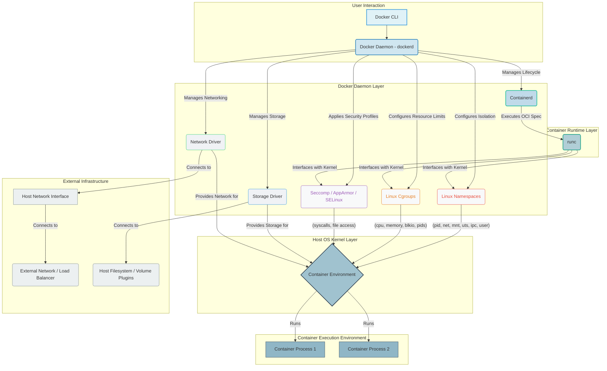

# Docker - Part 2 - Technical Study Guide & Notes

This study guide, "Docker: Advanced Configurations, Performance, Security, and Scale Boundaries (Part 2/3)," is tailored for a seasoned IT professional aiming to master Docker beyond basic usage. We will delve into the critical aspects required to operate Docker in high-stakes production environments, focusing on resilience, security, and optimal resource utilization.

---

### 1. Part Introduction and Scope

Welcome to Part 2 of our Docker deep dive. Having covered the fundamentals of containerization, image building, and basic container management in Part 1, we now elevate our focus to the enterprise-grade operational aspects of Docker. This section is dedicated to transforming theoretical knowledge into practical expertise for managing Docker in production. We will dissect advanced configurations that dictate container behavior, implement robust performance tuning strategies, fortify containerized applications with multi-layered security measures, understand sandboxing mechanisms, and analyze the inherent scale boundaries of a Docker-centric infrastructure. The objective is to equip you with the insights and skills necessary to design, deploy, and maintain highly available, secure, and performant containerized services.

### 2. Why This Part's Concepts Are Critical for High-Availability Systems

For any system aspiring to high availability (HA), resilience, and operational excellence, understanding the advanced facets of Docker is non-negotiable.

*   **Performance Tuning:** Inadequate resource allocation (CPU, memory, I/O) leads to "noisy neighbor" issues, where one container starves others, causing service degradation or outages. Properly tuned containers ensure consistent performance, predictable latency, and efficient resource utilization, directly contributing to HA by preventing resource-induced failures.
*   **Security Capabilities & Sandboxing:** A single compromised container can be a gateway to the entire host system or other containers, leading to data breaches, service disruptions, or complete system compromise. Robust security configurations (e.g., AppArmor, Seccomp, user namespaces, capability dropping) and strong sandboxing prevent such lateral movement and reduce the attack surface, safeguarding the system's integrity and availability.
*   **Advanced Configurations:** The default Docker settings are often insufficient for production. Tailoring storage drivers, network configurations, logging mechanisms, and daemon-level parameters ensures stability, data persistence, network isolation, and effective troubleshooting – all pillars of HA.
*   **Scale Boundaries:** Understanding Docker's limitations and how it interacts with the underlying OS (e.g., maximum PIDs, network interfaces, open files) is crucial for preventing unexpected failures under load. Knowing these boundaries allows for proactive architectural decisions, capacity planning, and the timely introduction of orchestration layers like Kubernetes, ensuring the system scales gracefully without encountering hard limits.
*   **Predictability and Reliability:** Advanced configurations provide a deterministic environment. When containers behave predictably under various loads and failure conditions, it enhances the overall reliability of the system, a cornerstone of HA.

### 3. Real-world Enterprise Use Cases with Architecture-Level Details

These advanced Docker capabilities are fundamental in complex enterprise architectures:

1.  **Multi-Tenant SaaS Platform with Resource Isolation:**
    *   **Use Case:** A SaaS provider hosts multiple customer applications on shared Docker hosts. Each customer's application stack (e.g., frontend, API, database proxy) runs in dedicated containers.
    *   **Architecture Detail:**
        *   **Resource Isolation:** Each customer's container group is strictly limited using `cgroup` parameters (`--cpus`, `--memory`, `--blkio-weight`) during `docker run` or defined in Docker Compose. This prevents one "noisy neighbor" tenant from impacting others, ensuring fair resource sharing and consistent performance SLAs.
        *   **Network Sandboxing:** Dedicated Docker networks (e.g., custom bridge or MacVLAN) are created for each tenant's application stack, isolating their network traffic from other tenants. Internal communication within a tenant's stack occurs over this isolated network.
        *   **Security Context:** `security-opt seccomp=<profile.json>` and `cap-drop ALL --cap-add <specific_caps>` are applied to containers to minimize syscall access and kernel capabilities. User Namespace Remapping (`userns-remap`) ensures that container `root` is mapped to an unprivileged user on the host, significantly reducing the impact of a container escape.
        *   **Persistent Storage:** Customer data volumes are mounted from a shared, highly available storage solution (e.g., NFS, Amazon EFS, Azure Files) with strict access control lists (ACLs) enforced at the storage layer and within the Docker volume mounts (`:ro`, `:z`, `:Z` for SELinux).

2.  **Secure CI/CD Build Agents:**
    *   **Use Case:** An enterprise runs hundreds of concurrent build jobs for various development teams, some requiring elevated privileges (e.g., installing kernel modules, accessing specific network segments for integration tests).
    *   **Architecture Detail:**
        *   **Ephemeral Nature:** Each build job runs in a fresh Docker container, ensuring a clean and consistent build environment. Images are pre-built with necessary tools (Maven, Node, Python, Go compilers).
        *   **Resource Limits:** Build containers are launched with `--memory` and `--cpus` limits to prevent any single build from consuming excessive host resources and starving other concurrent builds. `--pids-limit` is used to prevent fork bombs.
        *   **Security Context:** Build agents are often more privileged than production containers. Instead of `privileged=true`, specific capabilities are granted (`--cap-add SYS_ADMIN` for FUSE mounts, `--cap-add NET_RAW` for network testing) and AppArmor/SELinux profiles are tailored to the specific needs of the build process, preventing unintended actions. `security-opt no-new-privileges` is typically enforced.
        *   **Network Access Control:** Build agents are placed in specific network segments. For external dependencies, they might use proxy configurations (`--build-arg HTTP_PROXY`) or have temporary firewall rules applied via the Docker network driver's integration with `iptables`.
        *   **Secrets Management:** Build secrets (e.g., Git tokens, cloud credentials) are never baked into images. They are injected at runtime via environment variables or mounted files, often from an integrated secrets management system (e.g., HashiCorp Vault, AWS Secrets Manager) using Docker's `--secret` flag (if using Docker Swarm) or a simple volume mount of a temporary file.

### 4. Comprehensive Architecture Explanation

The advanced architecture of Docker focuses on the interplay between the user, the Docker daemon, its low-level components, and the underlying host operating system's kernel features for isolation and resource management.

**Textual Explanation:**

At its core, Docker relies on a client-server architecture. The **Docker Client** (CLI) communicates with the **Docker Daemon** (`dockerd`), which is the persistent background process responsible for managing Docker objects like images, containers, networks, and volumes.

The Docker Daemon doesn't directly manage containers. Instead, it delegates this responsibility to **containerd**. Containerd is an industry-standard core container runtime that manages the complete container lifecycle of its host system, from image transfer and storage to container execution and supervision. Containerd interacts with **runc**, which is the actual low-level component responsible for spawning and running containers according to the Open Container Initiative (OCI) specification. RunC directly interfaces with the Linux kernel.

The critical components enabling Docker's advanced features, particularly for sandboxing and performance, are provided by the **Linux Kernel**:

1.  **Namespaces (pid, net, mnt, uts, ipc, user):** These kernel features provide process isolation. Each container gets its own isolated view of system resources.
    *   `pid` namespace: Isolates process IDs, making processes inside a container unaware of processes outside.
    *   `net` namespace: Provides a container with its own network stack (interfaces, IP addresses, routing tables).
    *   `mnt` namespace: Isolates filesystem mount points.
    *   `uts` namespace: Isolates hostname and NIS domain name.
    *   `ipc` namespace: Isolates Inter-Process Communication resources.
    *   `user` namespace: Isolates user and group IDs, allowing a container's root user to be mapped to an unprivileged user on the host. This is a cornerstone of enhanced container security.

2.  **Cgroups (Control Groups):** These kernel features enable resource management and allocation. Cgroups allow the Docker daemon to limit, account for, and isolate the resource usage (CPU, memory, block I/O, network I/O) of a collection of processes. This is fundamental for performance tuning and preventing resource starvation.

3.  **Seccomp (Secure Computing Mode):** This Linux kernel feature allows a process to restrict the system calls it can make to the kernel. Docker uses Seccomp profiles (JSON files) to define a whitelist or blacklist of allowed syscalls for containers, significantly reducing the kernel attack surface.

4.  **AppArmor/SELinux:** These are Mandatory Access Control (MAC) systems for Linux. Docker can integrate with them to enforce granular security policies on containers, such as restricting file system access, network access, or the ability to execute certain programs, providing an additional layer of defense beyond standard discretionary access control (DAC).

5.  **Storage Drivers:** Docker uses various storage drivers (e.g., OverlayFS, Btrfs, Device Mapper) to manage how images and containers are stored on the host. These drivers implement a Copy-on-Write (CoW) strategy for efficient storage of layers and container changes. The choice of driver impacts performance, especially for I/O-intensive workloads.

6.  **Network Drivers:** Docker's networking subsystem provides different drivers (e.g., `bridge`, `host`, `overlay`, `macvlan`, `ipvlan`) to connect containers to each other and to the outside world. Advanced configurations involve selecting the right driver for isolation, performance, and integration with existing network infrastructure.

**Mermaid Diagram: Docker Advanced Runtime Architecture**



### 5. Types, Classifications, or Components Relating to This Part's Focus

This section categorizes the core components and concepts under our advanced focus areas:

**A. Advanced Configurations & Performance Tuning:**

1.  **Resource Constraints (Cgroups):**
    *   **CPU:** `cpu-shares`, `cpu-period`, `cpu-quota`, `cpuset-cpus`, `cpuset-mems`. Controls CPU allocation and affinity.
    *   **Memory:** `memory`, `memory-swap`, `memory-swappiness`, `kernel-memory`. Manages RAM and swap space usage.
    *   **Block I/O:** `blkio-weight`, `blkio-weight-device`, `device-read-bps`, `device-write-bps`, `device-read-iops`, `device-write-iops`. Controls read/write rates and IOPS for block devices.
    *   **PIDs:** `pids-limit`. Limits the number of processes a container can create, preventing fork bombs.
2.  **Storage Drivers:**
    *   **Layered Copy-on-Write (CoW) Drivers:** `overlay2` (recommended for most Linux systems), `aufs`, `btrfs`, `devicemapper`, `zfs`. Each has different performance characteristics, snapshotting capabilities, and storage overhead.
    *   **Volume Drivers/Plugins:** Integration with external storage systems (e.g., NFS, iSCSI, cloud storage) for persistent, shared, or highly available data.
3.  **Network Drivers:**
    *   **Bridge (default):** Private network for containers on a single host. `docker0` bridge.
    *   **Host:** Container shares the host's network stack directly (least isolation, highest performance for networking).
    *   **None:** No external networking for the container.
    *   **Overlay:** For multi-host container communication (used in Swarm).
    *   **MacVLAN/IPVLAN:** Allows assigning a MAC address and IP directly to containers, making them appear as physical devices on the network. Excellent for legacy applications or specific network monitoring needs.
    *   **Custom Bridge Networks:** User-defined bridges for better isolation and DNS resolution between specific container groups.
4.  **Logging Drivers:**
    *   `json-file` (default): Stores logs in JSON format on the host filesystem.
    *   `syslog`: Sends logs to a syslog server.
    *   `journald`: Sends logs to systemd journal.
    *   `gelf`: Sends logs to a Graylog Extended Log Format (GELF) endpoint (e.g., Graylog, Logstash).
    *   `fluentd`: Sends logs to a Fluentd collector.
    *   `awslogs`, `gcplogs`, `splunk`, `logentries`: Cloud-specific or vendor-specific integrations.
5.  **Daemon Configuration (`daemon.json`):**
    *   `log-driver`, `log-opts`.
    *   `data-root`, `storage-driver`, `storage-opts`.
    *   `live-restore`: Allows containers to remain running when the daemon restarts.
    *   `userland-proxy`: Disables/enables the userland proxy for published ports.
    *   `dns`, `dns-opts`, `dns-search`.
    *   `insecure-registries`, `registry-mirrors`.
    *   `default-ulimits`: Sets default ulimits for all containers.

**B. Security Capabilities & Sandboxing:**

1.  **User Namespaces (UserNs):**
    *   Remaps `root` user inside the container to an unprivileged user on the host. This significantly reduces the impact of a container breakout.
    *   Enabled via `userns-remap` in `daemon.json`.
2.  **Capabilities (Linux Capabilities):**
    *   Traditional Unix superuser privileges are split into distinct units. Docker allows dropping specific capabilities (`--cap-drop`) or adding only necessary ones (`--cap-add`).
    *   `CAP_NET_ADMIN`, `CAP_SYS_ADMIN`, `CAP_DAC_OVERRIDE` are common examples. `CAP_NET_RAW` for ping utility.
    *   Default `cap-drop ALL` then `cap-add` is the most secure approach.
3.  **Seccomp (Secure Computing Mode):**
    *   A kernel feature that filters system calls. Docker applies a default Seccomp profile that whitelists many common syscalls but blacklists dangerous ones.
    *   Custom Seccomp profiles (`--security-opt seccomp=<profile.json>`) can be created to further restrict a container's syscall surface.
4.  **AppArmor/SELinux:**
    *   **AppArmor:** Mandatory Access Control (MAC) system that restricts programs' capabilities on a per-program basis. Profiles define rules for network access, file permissions, and other system resources. Docker can apply custom AppArmor profiles (`--security-opt apparmor=<profile_name>`).
    *   **SELinux (Security-Enhanced Linux):** Another MAC system offering fine-grained control over processes and files. Docker containers can be run with specific SELinux labels (`--security-opt label=type:container_t`).
5.  **Read-Only Filesystems:**
    *   `--read-only`: Mounts the container's root filesystem as read-only, preventing any writes to the image layers. This forces applications to write data only to explicitly mounted volumes, enhancing security and making containers more immutable.
6.  **`no-new-privileges`:**
    *   `--security-opt no-new-privileges`: Prevents a process in a container from gaining new privileges (e.g., via `setuid` or `setgid` binaries).
7.  **`privileged` mode:**
    *   `--privileged`: Grants a container all capabilities and access to all devices, essentially removing nearly all container isolation. Should be avoided at all costs in production unless absolutely necessary and understood.
8.  **Image Scanning:**
    *   Tools like Clair, Trivy, Anchore Engine, or cloud-native scanning services (AWS ECR, GCP GCR) scan container images for known vulnerabilities (CVEs) in OS packages and application dependencies.
9.  **Secrets Management:**
    *   Securely injects sensitive data (API keys, database credentials) into containers at runtime without baking them into images or exposing them as environment variables in `docker inspect` output. Integrated with Orchestrators (`docker secret` in Swarm, Kubernetes Secrets) or external systems (Vault, AWS Secrets Manager).

### 6. Step-by-Step Production Implementation Guide

This guide focuses on hardening a Docker host and its containers for a production environment.

1.  **Harden the Docker Host OS:**
    *   **Minimize OS Footprint:** Use a minimal Linux distribution (e.g., Alpine Linux, CoreOS, Photon OS, Ubuntu Server minimal).
    *   **Keep OS Up-to-Date:** Regular patching and updates for kernel and system libraries.
    *   **Firewall Configuration:** Restrict access to the Docker daemon port (2375/2376) and expose only necessary application ports. Use `ufw`, `firewalld`, or cloud security groups.
    *   **Disable Unnecessary Services:** Stop and disable any services not required for Docker operation.
    *   **Audit Logging:** Configure `auditd` to monitor Docker-related activity.

2.  **Secure Docker Daemon Installation & Configuration:**
    *   **Install from Official Repositories:** Always use the Docker Engine packages from official Docker or distribution repositories.
    *   **TLS for Remote Access:** Configure Docker daemon to accept connections only over TLS. Generate client and server certificates.
        *   Edit `/etc/docker/daemon.json`:
            ```json
            {
              "tlsverify": true,
              "tlscacert": "/etc/docker/ca.pem",
              "tlscert": "/etc/docker/server-cert.pem",
              "tlskey": "/etc/docker/server-key.pem",
              "hosts": ["tcp://0.0.0.0:2376", "unix:///var/run/docker.sock"]
            }
            ```
        *   Ensure `/var/run/docker.sock` permissions are tightly controlled (only `root` or `docker` group).
    *   **Storage Driver Selection:** Choose `overlay2` unless specific needs dictate otherwise.
        *   `daemon.json`: `"storage-driver": "overlay2"`
    *   **Logging Driver Configuration:** Centralize logs.
        *   `daemon.json`:
            ```json
            {
              "log-driver": "json-file",
              "log-opts": {
                "max-size": "10m",
                "max-file": "5"
              }
            }
            ```
            (or `gelf`, `fluentd`, etc. with appropriate `log-opts` for remote endpoints).
    *   **User Namespace Remapping (Recommended):**
        *   Enable in `daemon.json`: `"userns-remap": "default"`
        *   Create `/etc/subuid` and `/etc/subgid` entries for the `dockremap` user (e.g., `dockremap:100000:65536`).
        *   Restart Docker daemon. This will move container processes to run as a non-privileged user on the host.

3.  **Build Secure and Performant Docker Images:**
    *   **Use Multi-Stage Builds:** Minimize final image size by separating build dependencies from runtime dependencies.
    *   **Minimal Base Images:** Prefer `scratch`, `alpine`, or `distroless` images.
    *   **Run as Non-Root User:**
        *   In `Dockerfile`: `USER <non_root_user_id>` (e.g., `USER 1000`). Create the user first.
        *   `RUN groupadd -r appuser && useradd -r -g appuser appuser`
        *   `USER appuser`
    *   **Copy Only Necessary Files:** Avoid copying entire directories. Use `.dockerignore`.
    *   **Set `WORKDIR`:** To a specific directory, ideally owned by the non-root user.
    *   **No Sensitive Data in Images:** Never bake credentials or secrets into an image. Use runtime injection.
    *   **Image Scanning:** Integrate image vulnerability scanning into your CI/CD pipeline.

4.  **Run Containers Securely and Efficiently:**
    *   **Least Privilege Principle:**
        *   **`--read-only`:** Mount the root filesystem as read-only.
        *   **`--cap-drop ALL --cap-add <necessary_caps>`:** Drop all default capabilities and add only what's strictly required (e.g., `CAP_NET_BIND_SERVICE` for ports < 1024).
        *   **`--security-opt no-new-privileges`:** Prevent privilege escalation.
        *   **`--user <non_root_user_id>`:** Explicitly run as a non-root user.
    *   **Resource Constraints:**
        *   `--memory="512m"` `--cpus="0.5"` `--pids-limit=100` `--blkio-weight=400`
        *   Apply `ulimits` via `--ulimit nofile=1024:2048`.
    *   **Network Isolation:**
        *   Create custom bridge networks for applications: `docker network create my-app-net`.
        *   Attach containers: `--network my-app-net`. Avoid `--network host` unless absolutely critical.
    *   **Volume Management:**
        *   Use named volumes for persistent data.
        *   Mount host paths with specific permissions: `-v /host/path:/container/path:ro,z`.
        *   Avoid binding `/` or sensitive host directories.
    *   **Secrets Management:**
        *   For single host, use `docker run --env-file` or `docker run -e` with caution (values visible in `docker inspect`).
        *   Better: Mount secrets as files from a secure temporary filesystem (`tmpfs`).
        *   Best (with orchestrator): Use `docker secret` (Swarm) or Kubernetes Secrets.
    *   **Health Checks:** Configure `HEALTHCHECK` in Dockerfile for robust application monitoring.

### 7. Standard CLI Commands with Deep Technical Explanations of Each Flag

We'll focus on `docker run` as it encapsulates most advanced configuration options.

`docker run [OPTIONS] IMAGE [COMMAND] [ARG...]`

*   `--cap-drop <CAPABILITY>`: **Technical Explanation:** Drops a specific Linux capability from the container. Linux capabilities are distinct units of privilege that traditionally belong to the root user. By default, Docker containers run with a subset of capabilities. `CAP_DROP` removes even these. For instance, `CAP_NET_ADMIN` allows network interface configuration, `CAP_SYS_ADMIN` allows a broad range of system administration tasks. Dropping all capabilities and then adding back only essential ones (`--cap-drop ALL --cap-add CAP_NET_BIND_SERVICE`) drastically reduces the kernel attack surface, making it harder for a compromised container to interact with the host kernel.
*   `--cap-add <CAPABILITY>`: **Technical Explanation:** Adds a specific Linux capability to the container. Used in conjunction with `--cap-drop ALL` to precisely control privileges. Example: `CAP_NET_BIND_SERVICE` allows binding to privileged ports (<1024) without running as `root`. `CAP_NET_RAW` is needed for raw socket operations like `ping`.
*   `--cpu-shares <VALUE>`: **Technical Explanation:** Assigns a relative share of CPU cycles to the container (default: 1024). This is a *weighting* value for `CFS (Completely Fair Scheduler)` scheduling. If two containers have `cpu-shares=1024` and `cpu-shares=512`, the first container gets twice the CPU time when there is contention. It's not a hard limit; if the host CPU is idle, a container can use all available CPU.
*   `--cpus <VALUE>`: **Technical Explanation:** Specifies a hard CPU limit. For example, `--cpus="1.5"` means the container can use a maximum of 1.5 CPU cores. This uses `cpu-period` and `cpu-quota` cgroup parameters under the hood, ensuring the container never exceeds this boundary, even if the host has spare capacity.
*   `--cpu-period <VALUE>`: **Technical Explanation:** Defines the CPU CFS (Completely Fair Scheduler) period in microseconds. Default is 100000 (100ms). Used with `--cpu-quota` to implement hard CPU limits.
*   `--cpu-quota <VALUE>`: **Technical Explanation:** Defines the CPU CFS quota in microseconds. Used with `--cpu-period`. For example, `--cpu-period=100000 --cpu-quota=50000` means the container can use 50% of one CPU core in any given 100ms period.
*   `--cpuset-cpus <CPU_LIST>`: **Technical Explanation:** Binds the container to specific CPU cores. `0-2` for cores 0, 1, 2; `0,2` for cores 0 and 2. This can improve cache locality and reduce context switching overhead for performance-critical applications by preventing processes from migrating between cores.
*   `--memory <BYTES>`: **Technical Explanation:** Sets a hard limit on the amount of physical memory (RAM) the container can use. If the container tries to exceed this, the Linux OOM (Out Of Memory) killer will terminate processes within the container.
*   `--memory-swap <BYTES>`: **Technical Explanation:** Sets the total memory (RAM + swap) limit. If `memory-swap` is set to `-1`, it means unlimited swap. If `memory-swap` is set to less than `memory`, then the container cannot use swap. If `memory-swap` is greater than `memory`, the difference is the amount of swap space the container can use.
*   `--pids-limit <VALUE>`: **Technical Explanation:** Limits the number of processes (PIDs) that can be created inside a container. This prevents fork bombs or resource exhaustion from applications that spawn too many processes.
*   `--read-only`: **Technical Explanation:** Mounts the container's root filesystem as read-only. This means applications can only write data to explicitly configured volumes or `tmpfs` mounts. Enhances security by preventing malicious or accidental writes to the container's base image layers and encourages immutable container design.
*   `--security-opt <OPTION>`: **Technical Explanation:** Specifies security options for the container.
    *   `seccomp=<profile.json>`: Applies a custom Seccomp profile (JSON file) to filter allowed system calls. This is a critical hardening measure.
    *   `apparmor=<profile_name>`: Applies a custom AppArmor profile, enforcing Mandatory Access Control for finer-grained resource access.
    *   `label=type:<type>`: Applies an SELinux type label to the container, integrating with SELinux policies.
    *   `no-new-privileges`: Prevents the container from gaining new privileges (e.g., through `setuid` binaries), which is a common vector for privilege escalation attacks.
*   `--user <USER>[:<GROUP>]`: **Technical Explanation:** Specifies the username or UID (and optionally group name or GID) to run the container process as. Running as a non-root user (e.g., `--user 1000`) is a fundamental security best practice, limiting the impact of a container compromise.
*   `--network <NETWORK_NAME|DRIVER_OPTION>`: **Technical Explanation:** Connects a container to a specified network.
    *   `bridge` (default): Connects to the default `docker0` bridge.
    *   `host`: Container shares the host's network namespace, giving it direct access to host network interfaces and localhost (least isolation).
    *   `none`: No network connectivity.
    *   `my_custom_network`: Connects to a user-defined bridge network, providing isolation and internal DNS resolution.
    *   `macvlan --subnet=...`: Gives the container its own MAC address and IP on the physical network.
*   `--log-driver <DRIVER_NAME>`: **Technical Explanation:** Specifies the logging driver for the container. Overrides the daemon's default. E.g., `json-file`, `syslog`, `gelf`, `fluentd`. Essential for centralized log aggregation.
*   `--log-opt <KEY>=<VALUE>`: **Technical Explanation:** Passes options to the logging driver. E.g., `--log-opt max-size=10m --log-opt max-file=5` for `json-file` to rotate logs locally, or `--log-opt gelf-address=udp://192.168.1.10:12201` for GELF.
*   `--ulimit <TYPE>=<SOFT>[:<HARD>]`: **Technical Explanation:** Sets ulimits (resource limits) for the container. E.g., `--ulimit nofile=1024:2048` sets the soft limit for open files to 1024 and the hard limit to 2048, preventing resource exhaustion from a single process opening too many files.
*   `--tmpfs <PATH>[:<OPTIONS>]`: **Technical Explanation:** Mounts a `tmpfs` (temporary file system in RAM) into the container. Useful for temporary files or sensitive data that should not persist on disk and is automatically cleared when the container stops. E.g., `--tmpfs /run/secrets:size=64M,mode=1777`.

### 8. Production Configuration Examples

#### A. Hardened `daemon.json` Configuration (`/etc/docker/daemon.json`)

```json
{
  "log-driver": "gelf",
  "log-opts": {
    "gelf-address": "udp://your_gelf_server_ip:12201",
    "tag": "{{.ImageName}}/{{.Name}}/{{.ID}}"
  },
  "storage-driver": "overlay2",
  "data-root": "/var/lib/docker-data",
  "userns-remap": "default",
  "live-restore": true,
  "metrics-addr": "0.0.0.0:9323",
  "experimental": true,
  "default-address-pools": [
    {
      "base": "172.18.0.0/16",
      "size": 24
    },
    {
      "base": "172.19.0.0/16",
      "size": 24
    }
  ],
  "default-ulimits": {
    "nofile": {
      "Hard": 65536,
      "Soft": 65536
    },
    "nproc": {
      "Hard": 4096,
      "Soft": 2048
    }
  }
}
```
**Explanation:**
*   `log-driver` & `log-opts`: Centralizes logs to a GELF server (e.g., Graylog, ELK stack via Logstash). `tag` helps identify source.
*   `storage-driver`: Explicitly sets `overlay2` for performance and efficiency.
*   `data-root`: Custom path for Docker data, useful for separating concerns or placing on dedicated storage.
*   `userns-remap`: Enables user namespace remapping for enhanced security (container root is unprivileged on host). Requires `dockremap` user setup.
*   `live-restore`: Allows containers to continue running if the Docker daemon restarts, improving availability.
*   `metrics-addr`: Exposes Prometheus metrics endpoint for the Docker daemon itself.
*   `experimental`: Enables experimental features like `metrics-addr` and BuildKit features.
*   `default-address-pools`: Defines custom IP address ranges for Docker networks, avoiding conflicts with existing infrastructure.
*   `default-ulimits`: Sets default file descriptor and process limits for *all* containers, preventing resource exhaustion.

#### B. Secure Dockerfile Example (Multi-stage, Non-Root, Minimal)

```dockerfile
# Stage 1: Build the application
FROM golang:1.21-alpine AS builder

WORKDIR /app

# Install build dependencies
RUN apk add --no-cache git

# Copy go.mod and go.sum first to leverage Docker cache
COPY go.mod go.sum ./
RUN go mod download

# Copy the rest of the application source code
COPY . .

# Build the application
RUN CGO_ENABLED=0 GOOS=linux go build -a -installsuffix cgo -o /app/my-service .

# Stage 2: Create the final, minimal runtime image
FROM alpine:3.18

# Create a non-root user and group
# UID/GID 10000 is chosen to be high enough to avoid conflicts with system users,
# but also low enough to fit within typical `subuid`/`subgid` ranges if userns-remap is active
RUN addgroup -S appgroup && adduser -S appuser -G appgroup -u 10000

# Set the working directory
WORKDIR /app

# Copy only the compiled binary from the builder stage
COPY --from=builder /app/my-service /app/my-service

# Set permissions for the binary
RUN chown appuser:appgroup /app/my-service && \
    chmod 755 /app/my-service

# Drop privileges by setting the user
USER appuser

# Expose the port the application listens on
EXPOSE 8080

# Define a health check for the container
HEALTHCHECK --interval=30s --timeout=5s --start-period=5s --retries=3 \
  CMD wget --quiet --tries=1 --timeout=2 http://localhost:8080/health || exit 1

# Command to run the application
ENTRYPOINT ["/app/my-service"]
CMD ["serve"]
```
**Explanation:**
*   **Multi-stage build:** `builder` stage compiles Go app, `alpine` stage just takes the binary. This minimizes the final image size and attack surface.
*   **Minimal base image:** `alpine:3.18` is very small.
*   **Non-root user:** `adduser -S appuser -G appgroup -u 10000` creates a dedicated, unprivileged user. `USER appuser` ensures the application runs with minimal privileges.
*   **`chown` and `chmod`:** Ensures the binary is owned by the `appuser` and has correct permissions.
*   **`EXPOSE`:** Documents the port, but doesn't actually publish it.
*   **`HEALTHCHECK`:** Configures Docker to periodically check the application's health, important for orchestrators and HA.
*   **`ENTRYPOINT` & `CMD`:** Defines how the application starts.

#### C. `docker run` with Hardened Parameters

```bash
docker run \
  --name my-secure-app \
  --network my-app-internal-net \
  --memory="256m" \
  --cpus="0.5" \
  --pids-limit=100 \
  --read-only \
  --tmpfs /run/secrets:size=32M,mode=1777 \
  --mount type=volume,source=app-data,target=/app/data \
  --log-driver=json-file \
  --log-opt max-size=5m \
  --log-opt max-file=3 \
  --security-opt no-new-privileges \
  --security-opt apparmor=my_app_profile \
  --cap-drop ALL \
  --cap-add NET_BIND_SERVICE \
  --user 10000 \
  -e "DB_HOST=db-service" \
  my-registry/my-secure-app:1.2.3
```
**Explanation:**
*   `--name`: Assigns a readable name.
*   `--network`: Connects to a custom, isolated Docker network.
*   `--memory`, `--cpus`, `--pids-limit`: Strict resource limits preventing resource exhaustion.
*   `--read-only`: Enforces immutable root filesystem.
*   `--tmpfs /run/secrets`: Provides a volatile in-memory filesystem for temporary sensitive data.
*   `--mount`: Uses a named volume for persistent application data, separate from the container's lifecycle.
*   `--log-driver`, `--log-opt`: Overrides daemon defaults for this container, using `json-file` with local rotation.
*   `--security-opt no-new-privileges`: Prevents privilege escalation.
*   `--security-opt apparmor=my_app_profile`: Applies a custom AppArmor profile for granular control.
*   `--cap-drop ALL --cap-add NET_BIND_SERVICE`: Minimal capabilities – drops all then adds only ability to bind to privileged ports.
*   `--user 10000`: Runs the application as the unprivileged user `10000` (assuming `appuser` from Dockerfile has this UID).
*   `-e "DB_HOST=db-service"`: Injects environment variable (for simple non-sensitive config; for secrets, use file mounts).
*   `my-registry/my-secure-app:1.2.3`: Pulls specific, versioned image from a private registry.

### 9. Security Considerations & Hardening Best Practices

Enterprise-grade Docker security requires a multi-layered approach:

1.  **Host OS Hardening:**
    *   **Minimize Attack Surface:** Install only necessary packages. Disable unnecessary services (SSH if using console access, Telnet, FTP).
    *   **Regular Patching:** Keep the kernel and all packages up-to-date to fix known vulnerabilities.
    *   **Firewall Rules:** Implement strict firewall rules (e.g., `iptables`, `firewalld`, cloud security groups) to only allow essential traffic to the Docker host and specific container ports. Block Docker daemon remote API access (port 2375) entirely if not strictly needed, or secure it with TLS.
    *   **Audit Logging:** Configure `auditd` to monitor Docker daemon activities, container starts/stops, and file system changes in critical areas.
    *   **Kernel Hardening:** Tune kernel parameters (e.g., `sysctl -a`) for security, like disabling IP forwarding if not a router, enabling `rp_filter`.

2.  **Docker Daemon Hardening:**
    *   **Secure Remote API Access:** Always use TLS for remote access to the Docker daemon (port 2376). Never expose the daemon over plain HTTP (port 2375) on public networks.
    *   **Control `docker.sock` Access:** The Docker socket `/var/run/docker.sock` grants root-level access to the host. Restrict access to only trusted users or processes (e.g., members of the `docker` group, but carefully consider who is in this group). Avoid mounting it into containers.
    *   **User Namespace Remapping (`userns-remap`):** Enable this in `daemon.json`. It maps the container's `root` user to an unprivileged user on the host, significantly mitigating the impact of container escapes.
    *   **Choose Secure Storage Driver:** `overlay2` is generally recommended for its stability and security.
    *   **Centralized Logging:** Configure the Docker daemon to send container logs to a centralized logging solution (e.g., GELF, Fluentd, Syslog) rather than relying on local `json-file` logs.
    *   **Live Restore:** Enable `live-restore` to minimize downtime for running containers during daemon restarts.
    *   **Cgroup Driver:** Ensure the `cgroupfs` driver is used if running on a system with `systemd` (which uses `systemd` cgroup driver by default), or configure Docker to use the `systemd` cgroup driver for consistency and resource management.

3.  **Container Hardening:**
    *   **Principle of Least Privilege:**
        *   **Non-Root User:** Always run container processes as an unprivileged user (`USER` instruction in Dockerfile, `--user` flag in `docker run`).
        *   **Drop Capabilities:** Use `--cap-drop ALL --cap-add <necessary_caps>` to remove all unnecessary kernel capabilities. This is one of the most effective ways to reduce the kernel attack surface.
        *   **`--read-only` Root Filesystem:** Mount the container's root filesystem as read-only. Force applications to write data to designated volumes or `tmpfs`.
        *   **`--security-opt no-new-privileges`:** Prevent privilege escalation within the container.
        *   **Custom Seccomp Profiles:** Implement specific Seccomp profiles for applications that need a very limited set of syscalls, further reducing kernel attack surface.
        *   **AppArmor/SELinux Profiles:** Utilize AppArmor or SELinux to enforce Mandatory Access Control policies on containers, restricting filesystem access, network operations, and execution of binaries.
    *   **Minimal Base Images:** Use minimal base images (e.g., `scratch`, `alpine`, `distroless`) to reduce the attack surface by minimizing installed software and libraries.
    *   **Multi-Stage Builds:** Use multi-stage builds to remove build tools and intermediate artifacts from the final image, reducing size and vulnerability count.
    *   **No Sensitive Data in Images:** Never embed secrets, API keys, or credentials directly into Docker images.
    *   **Volume Security:**
        *   Be cautious with host path mounts (`-v /host/path:/container/path`). Avoid mounting sensitive host directories.
        *   Use named volumes for persistence.
        *   Mount volumes with `ro` (read-only) when possible.
        *   Ensure proper permissions on host paths mounted into containers.
    *   **Network Segmentation:** Use custom Docker bridge networks for isolation between different application tiers or tenants. Avoid `--network host` unless absolutely necessary.
    *   **Health Checks:** Implement `HEALTHCHECK` in Dockerfiles to ensure applications are actually responsive, not just running.

4.  **Image Registry Security:**
    *   **Private Registries:** Use private, secure Docker registries (e.g., AWS ECR, GCP GCR, Azure Container Registry, Harbor, Docker Trusted Registry).
    *   **Authentication & Authorization:** Enforce strong authentication (IAM, OIDC) and granular authorization (RBAC) for image push/pull operations.
    *   **Vulnerability Scanning:** Integrate image scanning tools (Clair, Trivy, Anchore) into your CI/CD pipeline to identify and block vulnerable images from deployment.
    *   **Image Signing & Content Trust:** Use Docker Content Trust (Notary) to cryptographically sign images, ensuring their authenticity and integrity.

5.  **Secrets Management:**
    *   **External Secrets Management:** Integrate with dedicated secrets management solutions (e.g., HashiCorp Vault, AWS Secrets Manager, Azure Key Vault) to inject secrets at runtime as environment variables or mounted files, rather than baking them into images or exposing them in `docker inspect`.
    *   **Ephemeral Secrets:** Use `--tmpfs` mounts for temporary sensitive files that should not persist.

### 10. Observability & Monitoring Considerations

Robust observability is crucial for maintaining performance, security, and availability of Docker environments.

1.  **Metrics:**
    *   **Docker Daemon Metrics:**
        *   Docker daemon itself can expose Prometheus metrics (`metrics-addr` in `daemon.json`). Monitor daemon resource usage (CPU, memory), image pulls, container starts/stops.
    *   **Container Resource Metrics:**
        *   **Prometheus Node Exporter:** Run on the host to collect host-level metrics (CPU, memory, disk I/O, network I/O).
        *   **cAdvisor (Container Advisor):** Can be run as a container to automatically discover all containers on a host and collect resource usage statistics (CPU, memory, network, filesystem I/O) from their cgroups. Exposes a Prometheus endpoint. Key metrics:
            *   `container_cpu_usage_seconds_total`: Total CPU usage.
            *   `container_memory_usage_bytes`: Current memory usage.
            *   `container_memory_working_set_bytes`: Amount of memory actually used (excluding caches).
            *   `container_network_receive_bytes_total`, `container_network_transmit_bytes_total`: Network I/O.
            *   `container_fs_reads_bytes_total`, `container_fs_writes_bytes_total`: Filesystem I/O.
            *   `container_pids_current`: Number of processes inside container.
        *   **`docker stats`:** Provides real-time, aggregated CPU, memory, network, and block I/O usage for running containers. Useful for quick checks, but not for historical data or alerting.
    *   **Application-Specific Metrics:**
        *   Instrument applications (e.g., using Prometheus client libraries) to expose business logic metrics (e.g., request latency, error rates, throughput) from within the container.

2.  **Logs:**
    *   **Centralized Log Aggregation:** Configure Docker to send container logs to a centralized system (ELK Stack - Elasticsearch, Logstash, Kibana; Splunk; Datadog; Loki; Graylog).
        *   Use `gelf`, `fluentd`, `syslog`, or cloud-specific drivers (`awslogs`, `gcplogs`) for `log-driver` in `daemon.json` or per-container.
    *   **Structured Logging:** Encourage applications to log in structured formats (e.g., JSON) for easier parsing, filtering, and analysis in the aggregation system.
    *   **Log Context:** Ensure logs contain sufficient context (container ID, image name, service name, timestamp, log level) for effective troubleshooting.

3.  **Tracing:**
    *   **Distributed Tracing:** Implement distributed tracing (e.g., Jaeger, Zipkin, OpenTelemetry) within your microservices architecture. This helps visualize request flows across multiple containers and services, aiding in performance bottleneck identification and debugging complex interactions.

4.  **Alerting:**
    *   **Resource Thresholds:** Set up alerts for high CPU, memory, network I/O, or disk I/O usage on both the host and individual containers.
    *   **Container State Changes:** Alert on containers exiting unexpectedly, repeatedly restarting, or failing health checks.
    *   **Daemon Health:** Monitor Docker daemon process health and resource usage.
    *   **Security Events:** Integrate with host security tools (e.g., `auditd`, intrusion detection systems) and container security scanners to alert on suspicious activity.

### 11. Common Troubleshooting Scenarios with RCA Steps

1.  **Scenario: Container Fails to Start or Immediately Exits**
    *   **Symptoms:** `docker ps -a` shows container with `Exited (1)` or `Exited (137)` status.
    *   **RCA Steps:**
        1.  **Check Logs:** `docker logs <container_id>`. Look for application errors, permission issues, missing dependencies, or port conflicts.
        2.  **Inspect Container:** `docker inspect <container_id>`. Verify `Entrypoint`, `Cmd`, `Env`, `Volumes`, `NetworkSettings` to ensure configuration matches expectations. Pay attention to `ExitCode` and `Error`. `ExitCode 137` usually means OOM (Out Of Memory) kill or manual `kill -9`.
        3.  **Review Dockerfile:** Ensure correct `ENTRYPOINT`/`CMD`, non-root user setup, and necessary dependencies.
        4.  **Resource Limits:** If `Exited (137)`, increase `--memory` or `--memory-swap`. If `Exited (128 + Signal)`, check if a signal (e.g., SIGTERM, SIGKILL) was sent.
        5.  **Volume Permissions:** If mounting a host path, ensure the user inside the container has appropriate read/write permissions on the host path. `chown` or `chmod` on the host might be required.
        6.  **Network Conflicts:** If publishing a port, ensure no other process on the host is already using that port.
        7.  **`docker run` Flags:** Double-check `--cap-drop`, `--security-opt`, `--user` flags, as overly restrictive settings can prevent startup. Temporarily remove some to isolate.

2.  **Scenario: Application Performance Degradation Inside Container**
    *   **Symptoms:** High latency, slow response times, service timeouts, sluggish UI.
    *   **RCA Steps:**
        1.  **Monitor Host Resources:** Use `top`, `htop`, `iostat`, `netstat` on the Docker host. Is the host itself overloaded (CPU, memory, disk I/O, network)?
        2.  **Monitor Container Resources:** Use `docker stats <container_id>` (real-time) or cAdvisor/Prometheus metrics (historical).
            *   **High CPU:** Is the container constantly hitting its `--cpus` limit? Increase limit or optimize application code.
            *   **High Memory:** Is the container nearing its `--memory` limit? Increase limit or debug memory leaks in the application. Check `container_memory_working_set_bytes`.
            *   **High Disk I/O:** Is the application performing excessive disk operations? Check `container_fs_reads_bytes_total`, `container_fs_writes_bytes_total`. Consider faster storage or optimizing I/O patterns (e.g., caching, batching). Adjust `blkio-weight`.
            *   **High Network I/O:** Is network saturation occurring? Check `container_network_receive_bytes_total`, `container_network_transmit_bytes_total`.
        3.  **Application Logs/Metrics:** Check application-specific logs for internal bottlenecks (e.g., slow database queries, inefficient algorithms). Use application performance monitoring (APM) tools.
        4.  **Network Latency:** Test network latency between containers and external dependencies. Check DNS resolution times.
        5.  **Storage Driver Performance:** If I/O is the bottleneck, investigate the underlying storage driver performance. `overlay2` is generally good, but specific workloads might benefit from `btrfs` or dedicated volume mounts.

3.  **Scenario: Container Security Alert / Suspicious Activity**
    *   **Symptoms:** Alert from IDS/IPS, `auditd` logs, or container security scanning tool about unusual syscalls, privilege escalation attempts, or unauthorized network activity.
    *   **RCA Steps:**
        1.  **Isolate & Stop:** Immediately isolate the compromised container (e.g., disconnect from network, stop it).
        2.  **Forensic Snapshot:** Create a snapshot of the container's filesystem (e.g., `docker export <container_id> > snapshot.tar`) and host memory if feasible.
        3.  **Review Logs:**
            *   **Container Logs:** `docker logs <container_id>` for any anomalies leading up to the event.
            *   **Docker Daemon Logs:** `journalctl -u docker` for daemon-level events.
            *   **Host OS Logs:** `journalctl`, `auth.log`, `audit.log` for suspicious host activity (e.g., process spawns, failed logins).
        4.  **Inspect Configuration:** `docker inspect <container_id>` to check `CapAdd`, `CapDrop`, `SecurityOpt`, `User`, `Privileged` settings. Was it run with too many privileges?
        5.  **Image Analysis:** Scan the image for new vulnerabilities or unexpected changes. Compare `docker history` with expected build process.
        6.  **Network Analysis:** Check container's network connections (`lsof -i`, `ss -tuln` inside container if possible, or host-level network monitoring).
        7.  **Identify Root Cause:** Was it a vulnerable application, a misconfigured container, or a host compromise?
        8.  **Remediation:** Patch vulnerabilities, tighten container configurations (more `cap-drop`, stricter Seccomp/AppArmor), update host hardening.

### 12. Common Mistakes and How to Avoid Them in Production

1.  **Running Containers as `root`:**
    *   **Mistake:** Not specifying `USER` in Dockerfile or `--user` in `docker run`. The container process runs as root inside the container, which maps to root (or an unprivileged user if `userns-remap` is enabled, but still considered bad practice) on the host.
    *   **Avoid:**
        *   Always create a dedicated non-root user and group in your Dockerfile (`RUN adduser -S appuser`) and switch to it (`USER appuser`).
        *   Explicitly specify `--user <UID>:<GID>` when running containers.

2.  **Using `--privileged` Mode Unnecessarily:**
    *   **Mistake:** Launching containers with `--privileged`, which grants them all capabilities and full access to host devices, effectively bypassing most container isolation.
    *   **Avoid:**
        *   Understand exactly *why* a container needs elevated privileges.
        *   Instead of `--privileged`, grant only specific capabilities using `--cap-add` (e.g., `NET_ADMIN`, `SYS_ADMIN`) and mount only specific devices (`--device`).
        *   Re-evaluate the need for such access; often, it indicates an anti-pattern for containerization.

3.  **Exposing Sensitive Ports or Volumes:**
    *   **Mistake:** Publishing ports directly to the host (`-p 80:80`) or mounting sensitive host directories (`-v /:/host`) without careful consideration.
    *   **Avoid:**
        *   Use custom Docker bridge networks for internal container communication. Only publish ports to the host that absolutely need external access.
        *   Restrict host volume mounts to specific, non-sensitive directories and use `ro` (read-only) flag whenever possible.
        *   Never mount `/` or `/etc` from the host unless explicitly understood for specific tools (e.g., host monitoring agents).

4.  **Not Setting Resource Limits (`--memory`, `--cpus`, `--pids-limit`):**
    *   **Mistake:** Allowing containers to consume unlimited host resources, leading to "noisy neighbor" issues, host instability, and OOM kills.
    *   **Avoid:**
        *   Profile your applications to understand their resource consumption patterns.
        *   Apply appropriate `--memory`, `--cpus`, `--pids-limit`, and `--blkio-weight` limits based on profiling data.
        *   Start with slightly generous limits and tune down as performance data confirms stability.

5.  **Ignoring Image Vulnerabilities:**
    *   **Mistake:** Pulling images from untrusted registries or deploying images without scanning them for known CVEs.
    *   **Avoid:**
        *   Use only trusted, minimal base images.
        *   Integrate image vulnerability scanning (Clair, Trivy, Anchore) into your CI/CD pipeline, ideally blocking deployments of images with critical vulnerabilities.
        *   Regularly rebuild images to pull in patched base layers and dependencies.

6.  **Using `latest` Tag in Production:**
    *   **Mistake:** Deploying containers with `image:latest` tag, leading to non-reproducible deployments as `latest` can change unexpectedly.
    *   **Avoid:**
        *   Always use specific, immutable tags for production deployments (e.g., `image:1.2.3`, `image:sha256:abcd...`).
        *   Promote images through different environments (dev, staging, prod) using the *exact same* tag.

7.  **Lack of Centralized Logging and Monitoring:**
    *   **Mistake:** Relying solely on `docker logs` on individual hosts or `json-file` driver without aggregation, making troubleshooting in distributed environments nearly impossible.
    *   **Avoid:**
        *   Configure `daemon.json` or `docker run` to use a centralized logging driver (`gelf`, `fluentd`, `syslog`, `awslogs`).
        *   Implement a comprehensive monitoring stack (Prometheus, Grafana, cAdvisor) to collect and visualize container and host metrics.
        *   Set up proactive alerts for resource exhaustion, container failures, and security incidents.

8.  **Not Using Health Checks:**
    *   **Mistake:** Assuming a container is healthy just because its process is running. The application inside might be frozen or unresponsive.
    *   **Avoid:**
        *   Define `HEALTHCHECK` instructions in your Dockerfiles to provide an accurate reflection of application readiness and liveness. Orchestrators use this for intelligent restarts and traffic routing.

### 13. Enterprise-Level Recommendations

1.  **Automated Image Vulnerability Management:**
    *   Integrate automated image scanning (e.g., Trivy, Anchore Engine, Snyk) into your CI/CD pipeline.
    *   Define clear policies for blocking images with critical/high vulnerabilities from being pushed to production registries or deployed.
    *   Implement continuous scanning of images *in production* to detect new CVEs in running containers.

2.  **Immutable Infrastructure Principles:**
    *   Treat containers as immutable artifacts. Once built and tagged, they should never be modified. If a change is needed, build a new image.
    *   This ensures consistency across environments and simplifies rollbacks. Data should be externalized to volumes.

3.  **Dedicated Build Agents/Environments:**
    *   Run Docker image builds on dedicated, isolated CI/CD agents.
    *   Avoid running Docker builds directly on production hosts.
    *   Ensure build environments are ephemeral and clean to prevent supply chain attacks (e.g., malicious build tools).

4.  **Private Registries with Robust Access Control:**
    *   Mandate the use of private, enterprise-grade registries (e.g., Harbor, Artifactory, cloud provider CRs).
    *   Implement strong authentication (LDAP/AD integration, OIDC) and fine-grained Role-Based Access Control (RBAC) for who can push, pull, and manage images.
    *   Enable content trust (image signing) to verify image integrity and authenticity.

5.  **Policy Enforcement and Admission Control:**
    *   Implement policy engines (e.g., Open Policy Agent (OPA) with Gatekeeper for Kubernetes, or custom hooks for Docker) to enforce organizational security and configuration policies *before* containers are deployed.
    *   Examples: Mandate non-root users, prohibit `--privileged`, enforce resource limits, require specific image registries.

6.  **Advanced Storage Solutions:**
    *   For stateful applications, leverage enterprise-grade persistent storage solutions via Docker volume plugins (e.g., NFS, iSCSI, Ceph, cloud provider block/file storage).
    *   Focus on high availability, data replication, backup, and recovery for volumes.

7.  **Leveraging Orchestration for Scale and Resilience:**
    *   While this guide focuses on Docker itself, for true enterprise scale, resilience, and automation, integrate Docker with a robust orchestrator like Kubernetes (via `containerd` runtime).
    *   Orchestrators handle scheduling, scaling, self-healing, service discovery, and advanced networking beyond what standalone Docker offers.

### 14. Advanced Concepts Relating to This Part

1.  **Rootless Docker:**
    *   Allows the Docker daemon and containers to run as an unprivileged user, rather than `root`.
    *   **Benefit:** Significantly enhances host security by eliminating the need for the Docker daemon to run with root privileges. A container escape would only grant access to the user's namespace, not the host's root.
    *   **Mechanism:** Achieved using User Namespaces, where the user's UID is mapped to root inside the namespace, but remains unprivileged outside.

2.  **Docker BuildKit:**
    *   A next-generation build engine for Dockerfiles, offering enhanced performance, security, and extensibility.
    *   **Features:** Concurrent build steps, efficient caching (including external cache exports), support for new `Dockerfile` syntax (e.g., `RUN --mount=type=cache`), multi-platform builds, and better security isolation for build steps.
    *   **Usage:** Enabled by default in recent Docker versions, or via `DOCKER_BUILDKIT=1 docker build`.

3.  **Containerd Integration and OCI Runtime Spec:**
    *   Docker daemon primarily acts as a management layer. The actual heavy lifting of container lifecycle management (image pull, container execution, supervision) is delegated to `containerd`.
    *   `containerd` then uses `runc` (the OCI runtime reference implementation) to interact with the Linux kernel (namespaces, cgroups, seccomp) to spawn and run containers according to the Open Container Initiative (OCI) Runtime Specification.
    *   **Significance:** This modular architecture allows for greater flexibility and standardized container runtimes, making Docker interoperable with other OCI-compliant tools and enabling Kubernetes to use `containerd` directly.

4.  **Custom Network Plugins (CNI):**
    *   Docker's native network drivers are powerful, but for complex, hybrid, or highly specific networking requirements (e.g., integrating with existing SDN solutions, advanced IPAM), Container Network Interface (CNI) plugins can be used.
    *   **CNI:** A specification for configuring network interfaces for Linux containers. Docker can integrate with CNI plugins, allowing for highly customized networking solutions.

5.  **Checkpoint/Restore (CRIU):**
    *   **CRIU (Checkpoint/Restore in User-space):** A Linux utility that allows freezing a running application and saving its state to disk, then restoring it later, potentially on a different machine.
    *   **Docker Integration:** Docker supports CRIU for checkpointing and restoring containers (`docker checkpoint create`, `docker start --checkpoint`).
    *   **Use Cases:** Fast migration of live containers, debugging (analyzing a frozen state), fault tolerance (restarting from a known good state).

6.  **Advanced Storage Drivers (e.g., VirtioFS, LVM thin provisioning):**
    *   While `overlay2` is common, specific needs might leverage other drivers.
    *   **VirtioFS:** A new shared filesystem for virtual machines that offers near bare-metal performance for container filesystems when running Docker inside VMs.
    *   **LVM Thin Provisioning:** `devicemapper` driver can use LVM thin pools for efficient storage management and snapshots, especially in large-scale on-premises deployments.

7.  **Securing the Docker Socket with `systemd` Socket Activation:**
    *   Instead of `dockerd` directly listening on a TCP socket, `systemd` can manage the socket. `dockerd` is then launched on demand when a connection comes in. This can provide better integration with `systemd`'s security features and resource management for the daemon itself.

### 15. Integration with Other DevOps Tools

1.  **CI/CD Systems (Jenkins, GitLab CI, GitHub Actions, Azure DevOps):**
    *   **Image Builds:** CI pipelines automate `docker build` (often with BuildKit for speed) to create application images, run unit and integration tests inside ephemeral containers.
    *   **Vulnerability Scanning:** After building, images are scanned for vulnerabilities (e.g., Trivy, Clair) before being pushed to a private registry.
    *   **Image Tagging:** Automatic tagging of images with build numbers, Git SHAs, or semantic versions.
    *   **Deployment Artifacts:** The resulting container image is the primary artifact for deployment.
    *   **Example (GitLab CI `gitlab-ci.yml`):**
        ```yaml
        build-image:
          stage: build
          image: docker:20.10.16
          services:
            - docker:20.10.16-dind
          variables:
            DOCKER_HOST: tcp://docker:2375
            DOCKER_TLS_VERIFY: "false"
            APP_IMAGE: $CI_REGISTRY_IMAGE:$CI_COMMIT_SHORT_SHA
          script:
            - docker login -u $CI_REGISTRY_USER -p $CI_REGISTRY_PASSWORD $CI_REGISTRY
            - docker build --pull -t $APP_IMAGE .
            - docker push $APP_IMAGE
            - trivy image --severity HIGH --input $APP_IMAGE
          only:
            - master
        ```

2.  **Terraform (Infrastructure as Code):**
    *   **Docker Host Provisioning:** Terraform can provision cloud VMs (e.g., AWS EC2, Azure VM) and then use `cloud-init` or `remote-exec` to install Docker Engine and configure `daemon.json`.
    *   **Registry Management:** Manage private Docker registries (e.g., `aws_ecr_repository`, `azurerm_container_registry`).
    *   **Network Setup:** Define network infrastructure (VPCs, subnets, security groups) where Docker hosts and containerized applications will run.

3.  **Kubernetes (Container Orchestration):**
    *   **Runtime:** Kubernetes uses `containerd` (which itself uses `runc`) as its default container runtime, making Docker images directly compatible. `dockerd` itself is not directly used by Kubernetes for running containers anymore.
    *   **Deployment:** Define Kubernetes `Deployments`, `Pods`, `Services`, `Ingresses` to orchestrate and scale Docker containers across a cluster. Kubernetes abstracts away the underlying Docker commands.
    *   **Resource Management:** Kubernetes `ResourceQuotas` and `LimitRanges` provide cluster-wide and namespace-wide resource management, building upon Docker's cgroup capabilities.
    *   **Security Contexts:** Kubernetes `PodSecurityContext` and `ContainerSecurityContext` map directly to Docker's `--user`, `--cap-drop`, `--read-only`, `privileged` flags.

4.  **Ansible (Configuration Management):**
    *   **Docker Host Setup:** Automate the installation of Docker Engine, configuration of `daemon.json`, creation of necessary users/groups, and hardening of the host OS.
    *   **Docker Compose Deployment:** Deploy Docker Compose applications to a fleet of hosts.
    *   **Image Pull/Prune:** Automate pulling specific images or pruning old images/volumes/networks on hosts.
    *   **Example (Ansible Playbook to install Docker):**
        ```yaml
        - name: Install Docker
          hosts: docker_hosts
          become: true
          tasks:
            - name: Install apt-transport-https
              ansible.builtin.apt:
                name: apt-transport-https
                state: present
            - name: Add Docker GPG key
              ansible.builtin.apt_key:
                url: https://download.docker.com/linux/ubuntu/gpg
                state: present
            - name: Add Docker APT repository
              ansible.builtin.apt_repository:
                repo: deb [arch=amd64] https://download.docker.com/linux/ubuntu focal stable
                state: present
            - name: Install Docker packages
              ansible.builtin.apt:
                name: ["docker-ce", "docker-ce-cli", "containerd.io"]
                state: present
                update_cache: yes
            - name: Create docker group
              ansible.builtin.group:
                name: docker
                state: present
            - name: Add remote user to docker group
              ansible.builtin.user:
                name: "{{ ansible_user }}"
                groups: docker
                append: yes
            - name: Copy daemon.json configuration
              ansible.builtin.copy:
                src: files/daemon.json
                dest: /etc/docker/daemon.json
                owner: root
                group: root
                mode: '0644'
              notify: Restart docker
          handlers:
            - name: Restart docker
              ansible.builtin.systemd:
                name: docker
                state: restarted
                daemon_reload: yes
        ```

### 16. Comparison Tables with Competing Tools

Focusing on *container runtimes* or *containerization approaches* rather than orchestration.

| Feature / Tool         | Docker Engine (with containerd/runc)                               | Podman (with Buildah/Skopeo)                                      | Containerd (standalone)                                             | LXC (Linux Containers)                                            |
| :--------------------- | :----------------------------------------------------------------- | :---------------------------------------------------------------- | :------------------------------------------------------------------ | :---------------------------------------------------------------- |
| **Philosophy**         | Full container platform (daemon, CLI, client, Swarm, BuildKit)     | Daemonless, rootless-first, OCI-compliant toolkit                 | Low-level container runtime, focus on simplicity & performance      | Lightweight virtualization, close to VM, Linux-specific           |
| **Daemon Requirement** | Yes (dockerd)                                                      | No (direct interaction with OCI runtimes)                         | Yes (containerd daemon)                                             | No (uses `lxc` CLI, interacts with kernel directly)                |
| **Rootless Execution** | Supported (via `dockerd-rootless.sh`), but not default            | Default and primary mode of operation                             | N/A (runtime itself can be run by unprivileged user, but containers are typically managed by privileged `containerd`) | Supported, but often requires privileged setup for full features |
| **OCI Compliance**     | Yes (via containerd/runc)                                          | Yes (direct, native)                                              | Yes (native)                                                        | No (uses its own format, but can run OCI images via `lxc-oci`)    |
| **Build Tool**         | Docker BuildKit (`docker build`)                                   | Buildah (`buildah build`, `buildah bud`)                          | N/A (primarily a runtime, not a build tool)                         | N/A (no built-in image build, uses templates)                     |
| **Image Mgmt**         | `docker image` commands                                            | Skopeo (`skopeo copy`, `skopeo inspect`), `podman image`          | `ctr images`                                                        | `lxc-create -t` with templates                                    |
| **Registry Interaction** | `docker login/pull/push`                                           | `podman login/pull/push`, Skopeo                                  | `ctr images pull/push`                                              | N/A (indirect)                                                    |
| **Networking**         | `docker network` (bridge, overlay, macvlan, host)                  | `podman network` (based on CNI plugins)                           | CNI plugin integration                                              | `lxc.network` config (bridge, veth, macvlan)                      |
| **Volume Management**  | `docker volume` (named volumes, bind mounts)                       | `podman volume` (named volumes, bind mounts)                      | Low-level volume management via `ctr`                               | `lxc.mount` config                                                |
| **Orchestration**      | Docker Swarm built-in, widely used with Kubernetes (via containerd) | Podman Compose, compatible with Kubernetes via `podman generate kube` | Primary runtime for Kubernetes, no native orchestration           | N/A (used as a building block for higher-level orchestrators)     |
| **Pros**               | - Mature ecosystem, extensive tooling. <br> - Swarm for simple orchestration. <br> - BuildKit speed/features. | - Daemonless: Improved security (no single point of failure). <br> - Rootless by default: Strong security posture. <br> - Direct OCI: Simpler architecture. | - Lightweight, minimal overhead. <br> - Highly stable, core component of Kubernetes. <br> - OCI compliant. | - Very high performance (near-native). <br> - Excellent isolation (closer to VM than Docker). <br> - Full OS features. |
| **Cons**               | - Daemon required: Single point of failure, root access. <br> - Can be resource-intensive for large fleets. | - Ecosystem less mature than Docker. <br> - No native multi-host networking like Swarm. <br> - Learning curve for Docker users. | - Low-level, not user-friendly for direct interaction. <br> - No built-in build or higher-level management. | - Linux-only. <br> - Less portable than Docker. <br> - Higher complexity for image management and multi-host. |
| **Latency (startup)**  | Moderate (Daemon startup + container startup)                      | Low (direct container startup)                                    | Very Low (direct `runc` interaction)                                | Very Low (kernel-level startup)                                   |
| **Resource Overhead**  | Moderate (daemon consumes resources)                               | Low (no daemon overhead)                                          | Very Low                                                            | Minimal (closer to native process)                                |
| **Use Cases**          | - General-purpose containerization. <br> - Local development. <br> - Single-host production or small Swarm clusters. <br> - CI/CD. | - Secure multi-tenant environments. <br> - Developer workstations (rootless). <br> - CI/CD agents. <br> - When avoiding a daemon is critical. | - Core component of Kubernetes. <br> - Custom container platforms. <br> - Edge computing where resources are very constrained. | - Lightweight VMs. <br> - When very strong isolation and near-native performance are needed without full VM overhead. <br> - System containerization. |

### 17. A Visual Cheat Sheet (Text/Table Form)

| **Category**      | **Concept / Command**             | **Key Option / Value**                       | **Production Best Practice**                                       |
| :---------------- | :-------------------------------- | :------------------------------------------- | :----------------------------------------------------------------- |
| **Daemon Config** | `/etc/docker/daemon.json`         | `"userns-remap": "default"`                  | Enable user namespace remapping for host security.                 |
|                   |                                   | `"log-driver": "gelf"`                       | Centralize logs.                                                   |
|                   |                                   | `"live-restore": true`                       | Maintain container uptime during daemon restarts.                  |
|                   |                                   | `"storage-driver": "overlay2"`               | Use recommended, performant storage driver.                        |
| **Dockerfile**    | `FROM`                            | `alpine:3.18`, `scratch`, `distroless`       | Use minimal, secure base images.                                   |
|                   | `USER`                            | `appuser` (non-root UID/GID)                 | Run applications as unprivileged users.                            |
|                   | `HEALTHCHECK`                     | `CMD wget --quiet ...`                       | Define app liveness/readiness checks.                              |
|                   | Multi-stage build                 | `FROM builder AS final`                      | Reduce final image size and attack surface.                        |
| **`docker run`**  | `--memory`                        | `"512m"`, `"1g"`                             | Set hard memory limits to prevent OOM.                             |
|                   | `--cpus`                          | `"0.5"`, `"1.5"`                             | Set hard CPU limits to prevent noisy neighbors.                    |
|                   | `--pids-limit`                    | `100`                                        | Limit number of processes to prevent fork bombs.                   |
|                   | `--read-only`                     |                                              | Mount root filesystem read-only for immutability and security.     |
|                   | `--cap-drop`                      | `ALL`                                        | Drop all unnecessary kernel capabilities.                          |
|                   | `--cap-add`                       | `NET_BIND_SERVICE`, `NET_RAW`                | Add ONLY essential capabilities back.                              |
|                   | `--security-opt`                  | `no-new-privileges`                          | Prevent privilege escalation within the container.                 |
|                   |                                   | `apparmor=my_profile`, `seccomp=my_profile.json` | Apply custom MAC/syscall filtering profiles.                       |
|                   | `--user`                          | `10000` (non-root UID)                       | Override Dockerfile `USER` if needed, run unprivileged.            |
|                   | `--network`                       | `my-isolated-net`                            | Use custom bridge networks for isolation.                          |
|                   | `--mount` / `-v`                  | `type=volume,src=app-data,dst=/app/data`     | Use named volumes for persistent data.                             |
|                   | `--tmpfs`                         | `/run/secrets:size=32M`                      | For temporary, sensitive data (cleared on stop).                   |
| **Security**      | Image Scanning                    | Trivy, Clair, Anchore                        | Integrate into CI/CD, scan images for CVEs.                        |
|                   | Registry Security                 | Private Registry + RBAC + Content Trust      | Securely store and distribute images.                              |
|                   | Secrets Management                | Vault, AWS Secrets Manager, K8s Secrets      | Inject secrets at runtime, never bake into images.                 |
| **Observability** | Metrics                           | cAdvisor, Prometheus Node Exporter           | Collect host and container resource metrics.                       |
|                   | Logs                              | ELK, Splunk, Graylog, Loki                   | Centralize and aggregate all container logs.                       |
|                   | Tracing                           | Jaeger, Zipkin, OpenTelemetry                | Understand distributed request flow across services.               |

### 18. A Comprehensive Final Learning Summary

This deep dive into advanced Docker configurations, performance tuning, security, sandboxing, and scale boundaries marks a significant step towards becoming a Docker expert. We've moved beyond merely running containers to understanding the intricate mechanisms that ensure their stability, efficiency, and resilience in a production context.

The core takeaway is the principle of **least privilege** and **proactive resource management**. Every configuration choice, from the base image in your Dockerfile to the `--cap-drop` flags in your `docker run` command, contributes to the overall security posture and performance characteristics of your containerized application.

You've learned that Docker isn't just a simple runtime; it's a sophisticated system built upon Linux kernel primitives like **namespaces** (for isolation) and **cgroups** (for resource management). Understanding the roles of `dockerd`, `containerd`, and `runc` provides a clearer picture of the container lifecycle and its interaction with the host.

We explored critical hardening techniques, including **user namespace remapping**, precise **Linux capabilities** management, **Seccomp** and **AppArmor/SELinux** profiles, and the importance of **read-only filesystems**. These measures are not optional but essential to mitigate the impact of potential container breakouts.

For performance, the judicious application of **CPU, memory, I/O, and PID limits** is crucial to prevent resource starvation and ensure predictable application behavior. The choice and configuration of **storage and network drivers** directly impact data persistence, I/O throughput, and network isolation.

Finally, we emphasized that in an enterprise setting, standalone Docker is often a building block for a larger ecosystem. Integration with **CI/CD pipelines** for automated secure builds, **Terraform/Ansible** for infrastructure provisioning and configuration, and ultimately **Kubernetes** for robust orchestration and scaling, are the next logical steps for leveraging Docker's full potential in highly available, distributed systems.

By internalizing these advanced concepts and applying the best practices outlined, you are now equipped to design, implement, and operate Docker-based solutions that meet the stringent requirements of production environments, ensuring high availability, robust security, and optimal performance for your cloud-native applications.

Here is the second part of your Docker interview preparation guide, focusing on advanced configurations, performance tuning, security capabilities, sandboxing, and scale boundaries.

### Q21. How do you configure the Docker daemon for specific security, logging, or networking requirements using `daemon.json`? Provide examples for production use cases.
**Detailed Answer**:
The `daemon.json` file is the primary configuration file for the Docker daemon, allowing administrators to customize its behavior beyond command-line flags. It's typically located at `/etc/docker/daemon.json` on Linux. This file uses JSON format and supports a wide array of settings, making it crucial for establishing consistent, secure, and performant Docker environments across a fleet of hosts. Changes to this file require a Docker daemon restart (`systemctl restart docker`) to take effect.

For security, `daemon.json` can specify insecure registries, enable user namespace remapping, or set default AppArmor/SELinux profiles. For logging, it defines the default logging driver (e.g., `json-file`, `syslog`, `fluentd`) and its options, which is critical for centralized log aggregation. On the networking front, it can configure default bridge network settings, IP address ranges, or even enable experimental features like IPv6. Advanced settings also include storage driver configurations, cgroup driver selection, and live-restore settings.

**Production Scenario / Practical Example**:
Consider a scenario where an organization needs to:
1.  Use a private, self-signed registry that Docker should trust.
2.  Route all container logs to a centralized `fluentd` collector.
3.  Implement user namespace remapping for enhanced security.
4.  Set a default bridge network range to avoid conflicts with existing infrastructure.

Here’s how the `/etc/docker/daemon.json` would be configured:

```json
{
  "insecure-registries": ["my-private-registry.example.com:5000"],
  "log-driver": "fluentd",
  "log-opts": {
    "fluentd-address": "fluentd.example.com:24224",
    "fluentd-async-connect": "true",
    "tag": "docker.{{.ID}}"
  },
  "userns-remap": "default",
  "bip": "172.28.0.1/16",
  "fixed-cidr-v6": "2001:db8:1::/64",
  "data-root": "/mnt/docker-data",
  "default-address-pools": [
    {
      "scope": "local",
      "base": "10.10.0.0/16",
      "size": 24
    }
  ],
  "live-restore": true
}
```
After placing this file, run `sudo systemctl daemon-reload && sudo systemctl restart docker`.
This configuration tells Docker to trust the private registry, send all logs to a Fluentd instance, remap container UIDs/GIDs to host non-root users, allocate a specific IP range for the default bridge, and ensure containers remain running even if the daemon crashes (live-restore). The `data-root` change is also crucial for moving Docker's data directory to a dedicated, potentially larger or faster, storage volume.

### Q22. Compare and contrast `overlay2` and `devicemapper` storage drivers, explaining their performance implications and ideal use cases in an enterprise environment.
**Detailed Answer**:
Docker storage drivers manage how images and container layers are stored on the host system. `overlay2` and `devicemapper` are two prominent drivers, each with distinct characteristics regarding performance, resource utilization, and underlying technology.

`overlay2` is currently the recommended and default storage driver. It leverages the OverlayFS union filesystem, which is integrated directly into the Linux kernel (since 3.18). OverlayFS operates by layering one filesystem on top of another. Docker uses an `upperdir` (writable layer for container changes), a `lowerdir` (read-only image layers), and a `workdir` for internal operations. Its primary advantages are simplicity, speed, and efficiency. File operations typically involve a "copy-up" mechanism for writes, where a file from a lower layer is copied to the upper layer before modification. This is generally very fast and performs well, especially for I/O-intensive workloads. It requires no special block device setup, working directly on an existing filesystem (like XFS or ext4).

`devicemapper` (now deprecated in favor of `overlay2` and `btrfs`/`zfs` for specific needs) was an older, block-based storage driver. It utilized thin provisioning and snapshot capabilities of the Device Mapper kernel framework. It could run in two modes: "loop-lvm" (using sparse files on loopback devices, unsuitable for production due to poor performance) and "direct-lvm" (using raw block devices, requiring dedicated block storage like an LVM logical volume). `devicemapper` offered robust snapshotting and copy-on-write mechanisms at the block level. However, its setup was more complex, and performance could be inconsistent, especially with loopback mode. Direct-lvm offered better performance but still suffered from higher overhead compared to `overlay2` for common container operations, particularly file `stat()` calls and small file I/O. Its primary benefit was perhaps a more robust snapshotting mechanism at the block level, which could be useful for specific backup strategies, but this is less relevant for transient container workloads.

**Performance Implications**:
*   **`overlay2`**: Generally superior performance due to native kernel integration and efficient copy-up operations. It has lower CPU and memory overhead. File I/O for reads is direct from the lower layers, and writes involve an efficient copy-up. It scales well with many layers.
*   **`devicemapper`**: In `direct-lvm` mode, performance could be acceptable but typically had higher latency for file operations and higher CPU utilization due to block-level mapping and metadata management. Its "copy-on-write" was at the block level, which could be less efficient for file-level changes compared to `overlay2`'s file-level copy-up. Loop-lvm mode was notoriously slow and should never be used in production.

**Ideal Use Cases**:
*   **`overlay2`**:
    *   **Default for almost all production environments**: Ideal for general-purpose container deployments, microservices, web applications, and most stateless workloads.
    *   **High-density container hosts**: Its efficiency in handling many image layers and containers makes it suitable for environments running numerous containers.
    *   **Cloud environments**: Simplifies setup as it doesn't require dedicated block devices.
*   **`devicemapper`**:
    *   **Legacy systems**: Might still be found in older deployments where it was initially configured.
    *   **Specific enterprise storage integrations**: In rare cases where a deep integration with LVM-based storage management was a primary requirement, `devicemapper` (direct-lvm) might have been chosen. However, even for these cases, modern alternatives or volume plugins are generally preferred. It is largely considered deprecated for new deployments.

**Production Scenario / Practical Example**:
An SRE team is setting up a new Docker host fleet for a microservices platform.
To ensure optimal performance and simplified management, they would explicitly configure Docker to use `overlay2` if not already the default or if they needed to ensure a specific `fs.overlayfs.limit_upper` setting (though this is less common). They would also ensure the underlying filesystem for `/var/lib/docker` (where `overlay2` stores its data) is performant, typically XFS or ext4.

Example `/etc/docker/daemon.json` (though usually not strictly necessary if `overlay2` is default):
```json
{
  "storage-driver": "overlay2",
  "storage-opts": [
    "overlay2.override_kernel_check=true"
  ]
}
```
This ensures `overlay2` is used. For `overlay2`, performance tuning often involves ensuring sufficient disk I/O for the `/var/lib/docker` partition and monitoring file system usage. Monitoring tools would track disk latency and throughput to ensure no bottlenecks, especially during image pulls or container start-up storms.

### Q23. Explain how `macvlan` or `ipvlan` network drivers enhance container networking performance and isolation, detailing a practical setup for a multi-tier application.
**Detailed Answer**:
`macvlan` and `ipvlan` are advanced Docker network drivers that allow containers to appear as physical devices on a network. Unlike the default `bridge` driver, which uses network address translation (NAT) and a virtual bridge, `macvlan`/`ipvlan` drivers bypass NAT, giving containers their own unique MAC addresses (macvlan) or IP addresses (ipvlan) directly on the host's physical network interface. This direct connection significantly enhances network performance by reducing overhead and provides stronger network isolation, as containers are visible as distinct entities on the network.

**`macvlan`**: Each container gets its own MAC address and IP address, making it appear as a separate physical host on the network. This is useful when you need containers to have a public IP address or when legacy applications expect to be directly on the physical network. It operates at Layer 2 (Data Link Layer).
**`ipvlan`**: Similar to `macvlan`, but all containers on an `ipvlan` network share the same MAC address as the parent interface. This can be beneficial in environments with MAC address limitations on switches. `ipvlan` can operate in L2 (like macvlan) or L3 mode (routing between subnets).

**Performance and Isolation Benefits**:
*   **Performance**: Direct host network access eliminates the overhead of NAT, port mapping, and kernel-level bridging. This results in lower latency and higher throughput, especially for high-volume network traffic.
*   **Isolation**: Containers are isolated at the network level, just like distinct physical machines. They can participate in VLANs, enforce firewall rules directly on their assigned IP addresses, and be discovered by network devices without needing NAT translations. This simplifies network monitoring and troubleshooting.
*   **Simplified IP Management**: Containers can be assigned IPs from the existing network subnet, making them easily addressable by other network devices or services.

**Practical Setup for a Multi-Tier Application**:
Consider a multi-tier application with a web frontend, an API backend, and a database, all needing direct access to specific network segments or external services without NAT.

**Prerequisites**:
*   A physical network interface on the Docker host (e.g., `eth0`).
*   An available subnet for containers (e.g., `192.168.1.0/24`) with a gateway.

**Setup Steps**:

1.  **Create a `macvlan` network**:
    We'll create two `macvlan` networks, one for the frontend (public-facing) and one for the backend (internal), both on the same physical interface but potentially different subnets or VLANs for stronger isolation.

    ```bash
    # Create macvlan network for frontend (e.g., public-facing)
    docker network create -d macvlan \
      --subnet=192.168.1.0/24 \
      --gateway=192.168.1.1 \
      -o parent=eth0 \
      --ip-range=192.168.1.100/28 \
      my-frontend-macvlan

    # Create macvlan network for backend (e.g., internal-facing)
    # Could be a different VLAN if eth0 is a trunk port with sub-interfaces (eth0.10, eth0.20)
    # For simplicity, using same parent but conceptually it could be on a different VLAN/subnet
    docker network create -d macvlan \
      --subnet=192.168.2.0/24 \
      --gateway=192.168.2.1 \
      -o parent=eth0 \
      --ip-range=192.168.2.100/28 \
      my-backend-macvlan
    ```
    *   `--subnet`: The subnet from which container IPs will be assigned.
    *   `--gateway`: The gateway for that subnet.
    *   `-o parent=eth0`: Specifies the physical host interface to bind to.
    *   `--ip-range`: (Optional) Specifies a specific range within the subnet for Docker to allocate IPs.

2.  **Deploy containers to respective networks**:

    ```bash
    # Frontend container (e.g., Nginx serving static content)
    docker run -d --name web-frontend \
      --network my-frontend-macvlan \
      --ip 192.168.1.100 \
      nginx:latest

    # API Backend container (e.g., Python Flask API)
    docker run -d --name api-backend \
      --network my-backend-macvlan \
      --ip 192.168.2.100 \
      my-api-app:latest

    # Database container (e.g., PostgreSQL, typically would be on a separate, even more restricted network or host)
    # For this example, placing on backend network for simplicity of demonstration
    docker run -d --name database \
      --network my-backend-macvlan \
      --ip 192.168.2.101 \
      postgres:latest
    ```

**Production Scenario / Practical Example**:
In a data center with strict network segmentation requirements, an SRE team deploys a critical financial application. The application has three tiers: public-facing load balancers/web servers, an internal application logic tier, and a highly restricted database tier.
Using `macvlan`, they can provision containers that directly receive IPs from specific VLANs.
*   **Web Servers**: Deployed on a `macvlan` network mapped to VLAN 10 (public DMZ segment) with public IPs.
*   **Application Servers**: Deployed on a `macvlan` network mapped to VLAN 20 (internal application segment) with private IPs, reachable only from the web tier or specific internal networks.
*   **Database Servers**: Deployed on a `macvlan` network mapped to VLAN 30 (restricted database segment) with private IPs, accessible only by the application tier.

This setup ensures that each container has an IP address directly on the designated network segment, allowing existing network firewalls, ACLs, and monitoring tools to operate on container IPs as if they were physical machines. This provides robust isolation and full network visibility without the complexities of port mapping or NAT traversal. Performance is maximized as traffic goes directly to/from the container's virtual NIC.

### Q24. Discuss advanced logging configurations in Docker, specifically using `fluentd` or `syslog` drivers with specific parameters for production tracing and aggregation.
**Detailed Answer**:
In a production environment, effectively collecting, aggregating, and analyzing container logs is paramount for monitoring, debugging, security auditing, and compliance. Docker's default `json-file` driver is often insufficient for scale, as it stores logs locally on the host, making centralized access cumbersome. Advanced logging drivers like `fluentd` and `syslog` offer robust solutions for pushing logs to external aggregation systems.

**`fluentd` logging driver**:
The `fluentd` driver streams container logs as JSON messages to a Fluentd daemon, which then acts as a data collector and forwarder to various destinations (e.g., Elasticsearch, S3, Splunk). This driver is highly flexible and suitable for microservices architectures due to its support for structured logging (JSON) and rich ecosystem of Fluentd plugins.

**Key Parameters for Production**:
*   `fluentd-address`: `host:port` of the Fluentd collector. Essential for directing logs.
*   `fluentd-buffer-limit`: Maximum size of the buffer when Fluentd is unreachable. Prevents memory exhaustion on the Docker host.
*   `fluentd-async-connect`: `true` or `false`. If `true`, Docker connects to Fluentd asynchronously, preventing container startup delays if Fluentd is temporarily down.
*   `tag`: Allows custom tags for log messages, often including dynamic placeholders like `{{.Name}}` (container name), `{{.ID}}` (container ID), or `{{.ImageName}}` for better filtering and routing in Fluentd.
*   `fluentd-sub-second-precision`: `true` to include sub-second precision timestamps. Critical for high-frequency logs and precise tracing.

**`syslog` logging driver**:
The `syslog` driver sends container logs to a local or remote syslog server. This is a traditional and widely supported logging standard, making it compatible with many existing enterprise logging solutions (e.g., Splunk, LogRhythm, ELK Stack via Logstash). Logs are typically sent as plain text, though some structured formats can be achieved.

**Key Parameters for Production**:
*   `syslog-address`: `tcp://host:port`, `udp://host:port`, or `unix:///path/to/socket` for the syslog server.
*   `syslog-format`: `rfc3164` or `rfc5424` (with or without `netstring`). `rfc5424` is preferred for modern systems as it includes more structured metadata.
*   `syslog-facility`: `daemon`, `local0`, `local1`, etc. Allows categorization of logs at the syslog level.
*   `tag`: Similar to Fluentd, allows custom tags for log messages for identification and filtering.

**Production Scenario / Practical Example**:
An SRE team manages a large fleet of Docker hosts running hundreds of microservices. They need:
1.  Centralized log aggregation for all services.
2.  High availability and resilience against temporary log collector unavailability.
3.  Structured logs for easy parsing and analysis.
4.  Sub-second timestamp precision for debugging race conditions.
5.  Ability to trace logs back to specific containers and services.

**Using `fluentd` (preferred for this scenario)**:

First, configure the Docker daemon to use `fluentd` as the default logging driver in `/etc/docker/daemon.json`:
```json
{
  "log-driver": "fluentd",
  "log-opts": {
    "fluentd-address": "fluentd.log-cluster.example.com:24224",
    "fluentd-async-connect": "true",
    "fluentd-buffer-limit": "5MB",
    "fluentd-max-retries": "5",
    "fluentd-retry-wait": "1s",
    "fluentd-sub-second-precision": "true",
    "tag": "docker.{{.Name}}.{{.ID}}"
  }
}
```
Then, restart the Docker daemon: `sudo systemctl restart docker`.

Now, when launching a container, logs will automatically go to Fluentd with the specified options:
```bash
docker run -d --name my-app-service \
  --log-opt fluentd-address=fluentd.log-cluster.example.com:24224 \
  --log-opt fluentd-async-connect=true \
  --log-opt tag="my-app.{{.Name}}.{{.ID}}" \
  my-app-image:latest
```
Note: The `--log-opt` flags on `docker run` override the daemon's default, allowing per-container customization. This is useful for specific services that might need different tags or targets.

The `tag` `docker.{{.Name}}.{{.ID}}` ensures that each log entry reaching Fluentd is tagged with the container's name and ID, allowing Fluentd to route them to specific indices in Elasticsearch or S3 buckets, and enabling SREs to quickly filter and search for logs related to a particular service instance. The `fluentd-sub-second-precision` ensures high-resolution timestamps, crucial for correlating events in distributed systems. `fluentd-async-connect` and `fluentd-buffer-limit` provide resilience by buffering logs if the Fluentd collector is temporarily unavailable, preventing log loss and container startup blocking.

### Q25. Beyond `--memory` and `--cpus`, how do you implement advanced CPU and I/O resource constraints for Docker containers using cgroups?
**Detailed Answer**:
While `--memory` and `--cpus` (or `--cpu-shares`, `--cpu-quota`, `--cpu-period`) provide basic resource limiting, Linux Control Groups (cgroups) offer much finer-grained control over CPU and I/O resources, critical for preventing noisy neighbor issues and ensuring performance isolation in multi-tenant Docker hosts. Docker exposes several flags to directly interface with cgroup parameters.

**Advanced CPU Constraints**:
*   **`--cpu-period` and `--cpu-quota`**: These work together to limit the absolute CPU time a container can consume. `cpu-period` defines a period (e.g., 100,000 microseconds) and `cpu-quota` defines the amount of CPU time (in microseconds) the container can get within that period. For example, `--cpu-period=100000 --cpu-quota=50000` limits a container to 50% of one CPU core. This is more precise than `--cpus` which internally might map to `cpu-quota`/`cpu-period` and is generally preferred for hard limits.
*   **`--cpuset-cpus`**: Restricts a container to run on a specific set of CPU cores. This is invaluable for NUMA architectures or for dedicating cores to performance-critical applications, minimizing context switching and cache invalidation. For example, `--cpuset-cpus="0-1,5"` would pin a container to CPU cores 0, 1, and 5.
*   **`--cpuset-mems`**: Restricts a container to run on memory nodes (NUMA nodes). Used in conjunction with `cpuset-cpus` on NUMA machines to ensure CPU and memory locality.

**Advanced I/O Constraints**:
Docker leverages the `blkio` cgroup subsystem for I/O limiting. This allows controlling the read/write bandwidth (BPS - bytes per second) and operations per second (IOPS) for block devices.

*   **`--blkio-weight`**: Assigns a relative weight (10-1000) to a container for block I/O. Containers with higher weights get a larger share of I/O bandwidth when there is contention.
*   **`--device-read-bps`**: Limits the read rate from a specific block device in bytes per second. Format: `device_path:limit`.
*   **`--device-write-bps`**: Limits the write rate to a specific block device in bytes per second. Format: `device_path:limit`.
*   **`--device-read-iops`**: Limits the read operations per second from a specific block device. Format: `device_path:limit`.
*   **`--device-write-iops`**: Limits the write operations per second to a specific block device. Format: `device_path:limit`.

**Production Scenario / Practical Example**:
An SRE team manages a Docker host that runs a mix of critical, low-latency microservices and batch processing jobs. To prevent the batch jobs from impacting the critical services, they need to apply stringent CPU and I/O limits.

Assume `/dev/sda` is the primary block device for Docker storage.

1.  **Critical Microservice (high priority, guaranteed CPU cores):**
    This service needs exclusive access to CPU cores 0 and 1, and should not be throttled on I/O.

    ```bash
    docker run -d --name critical-service \
      --cpuset-cpus="0,1" \
      --memory="4g" \
      --restart=always \
      my-critical-app:latest
    ```
    This pins the container to specific CPU cores, ensuring minimal interference from other processes and containers. No I/O limits are set to allow it full disk performance.

2.  **Batch Processing Job (low priority, throttled CPU and I/O):**
    This job can use up to 50% of one CPU core (from the remaining cores), and its disk write operations must be capped to prevent saturating the storage array. It should also have a lower I/O priority.

    ```bash
    docker run -d --name batch-job \
      --cpuset-cpus="2-7" \
      --cpu-period=100000 \
      --cpu-quota=50000 \
      --memory="8g" \
      --blkio-weight="100" \
      --device-write-bps="/dev/sda:10mb" \
      --device-read-iops="/dev/sda:500" \
      my-batch-job:latest
    ```
    *   `--cpuset-cpus="2-7"`: Restricts the job to a pool of available cores, ensuring it doesn't contend with the critical service.
    *   `--cpu-period=100000 --cpu-quota=50000`: Limits it to 0.5 CPU cores within that pool.
    *   `--blkio-weight="100"`: Assigns a low I/O weight, so other containers with higher weights get preference during disk contention.
    *   `--device-write-bps="/dev/sda:10mb"`: Hard limit on write bandwidth to 10 MB/s.
    *   `--device-read-iops="/dev/sda:500"`: Hard limit on read operations to 500 IOPS.

By applying these granular cgroup controls, the SRE team ensures that the critical application consistently meets its performance SLAs, while the batch job runs efficiently without impacting other services, preventing resource starvation and maintaining host stability.

### Q26. Describe the process and tools for scanning Docker images for vulnerabilities, and how this integrates into a secure CI/CD pipeline.
**Detailed Answer**:
Docker image vulnerability scanning is a critical security practice that identifies known security flaws, misconfigurations, or outdated components within container images. It involves analyzing the layers of an image, examining the installed packages, libraries, and binaries, and comparing them against vulnerability databases (CVEs). This process is essential for reducing the attack surface of containerized applications and ensuring compliance with security policies.

**Process of Scanning Docker Images**:

1.  **Image Layer Analysis**: Scanners deconstruct the Docker image into its constituent layers. Each `RUN`, `COPY`, or `ADD` instruction in a `Dockerfile` typically creates a new layer.
2.  **Package and Dependency Identification**: For each layer, the scanner identifies installed operating system packages (e.g., `apt`, `yum`, `apk`), programming language dependencies (e.g., `pip`, `npm`, `maven`), and other binaries.
3.  **Vulnerability Database Lookup**: The identified components are cross-referenced against continuously updated vulnerability databases (e.g., NVD, OSV, vendor-specific advisories).
4.  **Reporting**: A report is generated, detailing found vulnerabilities, their severity (CVSS scores), and often suggesting remediation steps (e.g., upgrade package versions).

**Common Tools**:
*   **Trivy**: Open-source, comprehensive, and easy-to-use scanner for OS packages, application dependencies (Go, Java, Python, Node.js, Ruby, PHP), and IaC.
*   **Clair**: An open-source, API-driven static analysis tool that indexes container image layers and notifies about new vulnerabilities. Requires a backend database.
*   **Anchore Engine**: An open-source, policy-driven container security and compliance platform that performs deep image inspection, vulnerability scanning, and policy enforcement.
*   **Snyk Container**: Commercial tool offering vulnerability scanning, license compliance, and runtime monitoring, often integrated with development workflows.
*   **Docker Scout (formerly Snyk for Docker Desktop)**: Integrates directly with Docker Desktop and provides visibility into image vulnerabilities and supply chain risks.

**Integration into a Secure CI/CD Pipeline**:
Integrating image scanning into the CI/CD pipeline enforces security earlier in the development lifecycle ("shift left"), preventing vulnerable images from reaching production.

1.  **Build Stage (Post-build, Pre-push)**:
    *   After a new Docker image is built, but *before* it's pushed to a registry, the scanning tool is invoked.
    *   The pipeline step runs `trivy image --severity HIGH,CRITICAL --exit-code 1 my-app:latest` (or similar for other tools).
    *   If vulnerabilities above a defined threshold (e.g., HIGH or CRITICAL severity) are found, the pipeline fails, preventing the image from being pushed.
    *   **Example:** A Jenkinsfile or GitLab CI/CD configuration would have a stage like `scan_image` after `build_image`.

2.  **Registry Stage (Post-push, Pre-deploy)**:
    *   Once an image is pushed to a private registry (e.g., Harbor, AWS ECR, GCR), the registry itself can perform continuous scanning.
    *   Tools like Harbor have built-in vulnerability scanning (e.g., using Clair or Trivy) that automatically scans new images and re-scans existing images as new CVEs are discovered.
    *   Policies can be set to prevent pulling images with critical vulnerabilities.

3.  **Deployment Stage (Pre-runtime)**:
    *   Orchestrators (like Kubernetes admission controllers) can be configured to reject deployments of images identified as vulnerable by a scanning tool or registry.
    *   This provides a final gate, catching any vulnerabilities that might have been missed or newly discovered after the build phase.

**Production Scenario / Practical Example**:
An SRE team is implementing a CI/CD pipeline for their microservices. They want to ensure no critical vulnerabilities are introduced.

**`Jenkinsfile` Snippet for Image Scanning**:
```groovy
pipeline {
    agent any
    stages {
        stage('Build Docker Image') {
            steps {
                script {
                    sh 'docker build -t my-app:${BUILD_ID} .'
                }
            }
        }
        stage('Scan Docker Image') {
            steps {
                script {
                    // Install Trivy if not already present
                    sh 'curl -sfL https://raw.githubusercontent.com/aquasecurity/trivy/main/contrib/install.sh | sh -s -- -b /usr/local/bin'
                    echo "Scanning my-app:${BUILD_ID} for vulnerabilities..."
                    // Scan for HIGH or CRITICAL vulnerabilities. Exit with code 1 if found.
                    sh 'trivy image --severity HIGH,CRITICAL --exit-code 1 --format table my-app:${BUILD_ID}'
                }
            }
        }
        stage('Push Docker Image') {
            steps {
                script {
                    // Only pushes if scan stage passed
                    withCredentials([usernamePassword(credentialsId: 'docker-hub-credentials', passwordVariable: 'DOCKER_PASSWORD', usernameVariable: 'DOCKER_USERNAME')]) {
                        sh "echo $DOCKER_PASSWORD | docker login -u $DOCKER_USERNAME --password-stdin"
                        sh 'docker tag my-app:${BUILD_ID} myregistry/my-app:${BUILD_ID}'
                        sh 'docker push myregistry/my-app:${BUILD_ID}'
                    }
                }
            }
        }
        // ... further stages like deployment
    }
}
```
In this pipeline, if `trivy` finds any HIGH or CRITICAL severity vulnerabilities in `my-app:${BUILD_ID}`, it will exit with code 1, causing the Jenkins pipeline to fail at the "Scan Docker Image" stage. This prevents the vulnerable image from being pushed to the registry and subsequently deployed to production, ensuring a secure supply chain. SREs receive immediate notification of the build failure, allowing them to address the vulnerabilities proactively.

### Q27. Explain Docker's user namespaces feature and how it enhances container security by remapping the root user inside the container to a non-root user on the host.
**Detailed Answer**:
Docker's user namespaces feature significantly enhances container security by enabling the remapping of User IDs (UIDs) and Group IDs (GIDs) between the container and the host system. Traditionally, the `root` user (UID 0) inside a container is also `root` on the host, albeit with capabilities restricted by cgroups, AppArmor/SELinux, and seccomp profiles. This means if an attacker manages to escape the container, they would immediately have root privileges on the host, which is a major security risk.

User namespaces address this by allowing a container's `root` user (UID 0) to be mapped to an unprivileged, non-root user on the host system. Similarly, other UIDs/GIDs within the container are mapped to a range of unprivileged UIDs/GIDs on the host. This means that even if an attacker gains `root` access *within* the container, their effective privileges on the host are those of an ordinary, unprivileged user. This dramatically limits the damage potential of a container escape.

The mapping is defined in files like `/etc/subuid` and `/etc/subgid` on the host, which specify ranges of UIDs and GIDs that a local user can own for the purpose of user namespace creation. For example, an entry `dockremap:100000:65536` in `/etc/subuid` means the user `dockremap` can own 65536 UIDs starting from 100000. When user namespaces are enabled, Docker maps the container's UID 0 to the first UID in this range (e.g., 100000 on the host), and subsequent container UIDs map accordingly.

**How it enhances security**:
1.  **Reduced Host Impact**: The most significant benefit is that a container breakout no longer automatically grants root privileges on the host. An attacker would only have the privileges of the mapped unprivileged user, making further system compromise much harder.
2.  **Principle of Least Privilege**: It enforces the principle of least privilege at a fundamental level, ensuring that container processes, even if run as root internally, do not possess equivalent privileges externally.
3.  **Isolation**: It adds another layer of isolation, making the container's internal view of user identities distinct from the host's.

**Limitations/Considerations**:
*   **Volume Ownership**: Data volumes mounted from the host might have incorrect permissions from the container's perspective unless managed carefully (e.g., by ensuring host paths are owned by the remapped user or adjusting permissions within the container).
*   **Host Networking**: Containers running with user namespaces cannot use `host` networking mode because that would expose the container's root to the host's actual root network capabilities.
*   **Image Compatibility**: Some older or poorly built images might assume UID 0 has full capabilities on the host and might break when remapped.
*   **Debugging Complexity**: Debugging permission issues can be slightly more complex due to the UID/GID remapping.

**Production Scenario / Practical Example**:
An SRE team is deploying a multi-tenant application where each tenant's components run in separate containers on shared Docker hosts. Security is paramount, and preventing container escapes with host root privileges is a top priority.

**Steps to enable user namespaces on a Docker host**:

1.  **Create a dedicated user for remapping**:
    ```bash
    sudo useradd -r -s /bin/false dockremap
    ```
2.  **Configure `/etc/subuid` and `/etc/subgid`**:
    Add entries for the `dockremap` user, granting it a range of UIDs and GIDs for remapping. A common range is 65536 UIDs/GIDs starting from 100000.

    `/etc/subuid`:
    ```
    dockremap:100000:65536
    ```
    `/etc/subgid`:
    ```
    dockremap:100000:65536
    ```
3.  **Configure `daemon.json`**:
    Edit `/etc/docker/daemon.json` to enable user namespace remapping for the Docker daemon.

    ```json
    {
      "userns-remap": "dockremap"
    }
    ```
4.  **Restart Docker daemon**:
    `sudo systemctl restart docker`.
    Upon restart, Docker will move its data directory (`/var/lib/docker`) to `/var/lib/docker/<ID_OF_DOCKREMAP_USER_OR_PATH>` and change ownership to the remapped user. All new containers will run with user namespace remapping applied.

Now, if a container is launched:
```bash
docker run -it --rm ubuntu:latest bash
```
Inside the container, `whoami` will report `root` and `id -u` will show `0`. However, if you inspect the host process:
```bash
ps aux | grep bash
```
You will see that the `bash` process (and all other container processes) are actually running as the host user `dockremap` (or its numerical UID like `100000`), not as the host's `root` user. This significantly mitigates the impact of a container escape, as any compromise would be limited to the privileges of the `dockremap` user on the host, preventing immediate system-wide compromise.

### Q28. How do you create and apply custom seccomp profiles to restrict syscalls for Docker containers, and what are the benefits for security?
**Detailed Answer**:
Seccomp (Secure Computing mode) is a Linux kernel feature that allows a process to restrict the system calls it can make. Docker leverages seccomp to enhance container security by providing a default seccomp profile that blocks a large number of potentially dangerous syscalls. However, for applications with unique or highly sensitive security requirements, a custom seccomp profile can be created to further narrow down the allowed syscalls, adhering more strictly to the principle of least privilege.

A seccomp profile is a JSON file that defines a whitelist or blacklist of syscalls. Docker's default profile is a whitelist, allowing only a safe subset of syscalls. When a container attempts to execute a syscall not permitted by its seccomp profile, the kernel terminates the process with a `SIGSYS` signal, effectively preventing malicious or unintended operations.

**Benefits for Security**:
1.  **Reduced Attack Surface**: By limiting the available syscalls, the potential attack vectors for exploiting kernel vulnerabilities or misusing container privileges are significantly reduced.
2.  **Defense in Depth**: Seccomp provides another layer of defense, complementing other security mechanisms like AppArmor, SELinux, and capabilities. Even if a vulnerability allows code execution within a container, seccomp can prevent it from performing unauthorized system actions.
3.  **Granular Control**: Custom profiles allow SREs to tailor syscall restrictions precisely to the needs of an application, only permitting what is absolutely necessary for its operation.

**Creating a Custom Seccomp Profile**:
1.  **Identify Required Syscalls**: This is the most challenging part. You need to run your application and monitor the syscalls it makes. Tools like `strace` or `sysdig` can help. For example, `strace -c -f <your_application>` can list syscalls.
2.  **Start with a Base Profile**: It's often easier to start with Docker's default seccomp profile (available in the Docker source code or by extracting it from a running Docker daemon) and then modify it.
3.  **Define Rules in JSON**: The JSON file specifies an `action` (e.g., `SCMP_ACT_ERRNO` to return an error, `SCMP_ACT_KILL` to terminate the process) and a list of `names` (syscalls) to act upon. It can also define `architectures` and `args` (syscall arguments) for more precise control.

**Applying a Custom Seccomp Profile**:
The custom profile is applied to a container using the `--security-opt seccomp=<path_to_profile.json>` flag during `docker run`.

**Production Scenario / Practical Example**:
An SRE team has a highly sensitive, sandboxed image processing service. This service only needs to read input files, perform CPU-bound image transformations, and write output files. It should not need network access or the ability to create new processes. A custom seccomp profile can be used to enforce this.

**Example `image-processor-seccomp.json` (simplified for demonstration)**:
Let's assume our image processor needs `openat`, `read`, `write`, `close`, `fstat`, `exit_group`, and basic memory management syscalls. Crucially, we want to block network-related syscalls (`socket`, `connect`, `bind`) and process creation (`fork`, `execve`).

```json
{
  "defaultAction": "SCMP_ACT_ERRNO",
  "architectures": [
    "SCMP_ARCH_X86_64",
    "SCMP_ARCH_AARCH64"
  ],
  "syscalls": [
    {
      "names": [
        "accept", "accept4", "bind", "connect", "getpeername", "getsockname", "getsockopt",
        "listen", "recvfrom", "recvmmsg", "recvmsg", "sendto", "sendmmsg", "sendmsg", "socket", "socketpair"
      ],
      "action": "SCMP_ACT_KILL"
    },
    {
      "names": [
        "fork", "vfork", "execve", "clone"
      ],
      "action": "SCMP_ACT_KILL"
    },
    {
      "names": [
        "chmod", "chown", "setuid", "setgid", "setgroups", "mount", "umount", "reboot"
      ],
      "action": "SCMP_ACT_KILL"
    },
    {
      "names": [
        "fstat", "openat", "read", "write", "close", "exit_group", "brk", "mmap", "munmap", "mprotect",
        "access", "newfstatat", "lseek", "getdents64", "getpid", "getppid", "gettid", "getuid", "geteuid", "getgid",
        "getegid", "rt_sigaction", "rt_sigprocmask", "ioctl", "prctl", "set_tid_address", "set_robust_list"
      ],
      "action": "SCMP_ACT_ALLOW"
    }
  ]
}
```
*   `"defaultAction": "SCMP_ACT_ERRNO"`: By default, any syscall not explicitly listed is blocked and returns an error.
*   The first three blocks explicitly `KILL` the container if network, process creation, or privilege escalation/mount-related syscalls are attempted.
*   The last block explicitly `ALLOW`s a minimal set of necessary syscalls for file I/O, process management, and memory operations.

**Applying the profile**:
Save this JSON file (e.g., as `image-processor-seccomp.json`) on the Docker host. Then, run the container:

```bash
docker run -it --rm \
  --security-opt seccomp=/path/to/image-processor-seccomp.json \
  my-image-processor:latest
```
Now, if the `my-image-processor` container attempts to make a network connection (e.g., `ping google.com` or a web request), or tries to `fork` a new process, the kernel will immediately terminate the container, indicating a security violation. This granular control provides a strong sandboxing mechanism, significantly reducing the risk of a compromised container affecting the host or other services through unauthorized syscalls.

### Q29. Explain the concept of Linux capabilities in Docker and how to manage them (`--cap-add`, `--cap-drop`) to minimize container privileges.
**Detailed Answer**:
Linux capabilities break down the traditional monolithic "root" privilege into a set of distinct, granular units. Instead of a process either having all root privileges or none, capabilities allow a process to perform specific privileged operations (like binding to a low port, changing system time, or manipulating network interfaces) without granting it full root access. Docker containers, by default, run with a *reduced* set of capabilities compared to a bare metal root user, but they still retain many that are often unnecessary for typical application workloads.

**How Docker Manages Capabilities**:
*   **Default Set**: When a Docker container runs as root, it starts with a default set of capabilities, which is a subset of all available Linux capabilities. This default set is already a security improvement over running a process directly as root on the host. Examples of default capabilities include `CAP_CHOWN`, `CAP_KILL`, `CAP_NET_BIND_SERVICE`, `CAP_NET_RAW`, `CAP_SETUID`, `CAP_SETGID`, `CAP_MKNOD`.
*   **`--cap-add`**: Allows adding specific capabilities to a container's default set. This is used when a containerized application legitimately needs a capability that is not included in Docker's default set (e.g., `CAP_SYS_ADMIN` for certain system-level operations, though this should be avoided if possible).
*   **`--cap-drop`**: Allows removing specific capabilities from a container's default set. This is the primary mechanism for implementing the principle of least privilege, ensuring containers only have the minimum necessary capabilities to function.

**Minimizing Container Privileges**:
The goal is to remove as many capabilities as possible without breaking the application. Every capability granted is a potential security hole. For most applications (web servers, databases, APIs), a significant portion of the default capabilities can be safely dropped.

**Benefits**:
1.  **Reduced Attack Surface**: Fewer capabilities mean fewer ways an attacker can exploit a vulnerability to gain elevated privileges or interact with the host kernel in unintended ways.
2.  **Principle of Least Privilege**: Enforces that containers only have the specific kernel-level permissions they absolutely require, rather than an all-or-nothing root access.
3.  **Enhanced Isolation**: Contributes to stronger isolation between the container and the host system.

**Production Scenario / Practical Example**:
An SRE team is deploying a static file server (Nginx) in a Docker container. This service only needs to serve files from a mounted volume and bind to a low port (e.g., 80 or 443). It certainly does not need to modify kernel modules, create new devices, or perform raw network operations.

**Default Capabilities (for `nginx:latest` running as root)**:
If you run `docker run --rm --cap-add=ALL --cap-drop=NET_RAW nginx:latest cat /proc/self/status | grep Cap`, you'd see something like:
`CapPrm: 00000000a80425fb` (This is a bitmask representation of capabilities)
A common default set includes: `CHOWN`, `DAC_OVERRIDE`, `FOWNER`, `FSETID`, `KILL`, `SETGID`, `SETUID`, `SETPCAP`, `NET_BIND_SERVICE`, `NET_RAW`, `SYS_CHROOT`, `MKNOD`, `AUDIT_WRITE`, `SETFCAP`.

**Dropping unnecessary capabilities for Nginx**:
For a static file server, many of these are unnecessary.
*   `CAP_NET_RAW`: Not needed for standard HTTP traffic.
*   `CAP_MKNOD`: Not needed unless the container creates special device files.
*   `CAP_SETUID`, `CAP_SETGID`, `CAP_CHOWN`, `CAP_FOWNER`, `CAP_DAC_OVERRIDE`: If Nginx is configured to drop privileges internally (e.g., `user nginx;` in its config) and access files from an already correctly owned volume, these might be reducible or unnecessary. For safety, `NET_BIND_SERVICE` is generally needed if binding to ports < 1024.

Let's drop some common capabilities for an Nginx container:
```bash
docker run -d --name my-nginx \
  --cap-drop=ALL \
  --cap-add=NET_BIND_SERVICE \
  --cap-add=CHOWN \
  --cap-add=DAC_OVERRIDE \
  --cap-add=SETUID \
  --cap-add=SETGID \
  -p 80:80 \
  -v /path/to/html:/usr/share/nginx/html:ro \
  nginx:latest
```
In this command:
*   `--cap-drop=ALL`: This is the most secure starting point. It removes *all* default capabilities.
*   `--cap-add=NET_BIND_SERVICE`: Added back because Nginx needs to bind to port 80 (a privileged port < 1024).
*   `--cap-add=CHOWN`, `--cap-add=DAC_OVERRIDE`, `--cap-add=SETUID`, `--cap-add=SETGID`: These might be necessary if Nginx needs to change ownership/permissions of files it creates (e.g., cache files, though usually these are on non-persistent volumes or managed by entrypoint scripts) or if it drops privileges to a non-root user internally. For a purely static server with read-only mounted content, some of these could potentially be dropped further, but it depends on the exact Nginx configuration and entrypoint script.

By explicitly dropping all and then selectively adding back only `NET_BIND_SERVICE`, `CHOWN`, `DAC_OVERRIDE`, `SETUID`, `SETGID`, we significantly reduce the attack surface. Any attempt by a compromised Nginx process to perform actions like creating raw sockets, loading kernel modules, or performing `chroot` would fail, as the necessary capabilities have been revoked. This makes the container much more resilient against privilege escalation attempts.

### Q30. Describe the architecture and benefits of running Docker in "rootless mode." What are its current limitations?
**Detailed Answer**:
Docker's "rootless mode" allows the Docker daemon and containers to be run as an unprivileged user, without requiring root privileges on the host machine. Instead of the Docker daemon running as `root` and managing containers, a user-specific Docker daemon runs as a non-root user, leveraging user namespaces to achieve container isolation. This is a significant security enhancement, as it drastically reduces the impact of a potential Docker daemon compromise or container escape.

**Architecture**:
1.  **User-specific Daemon**: The Docker daemon (and its associated components like `containerd`, `runc`) runs as an ordinary user (e.g., `user1`).
2.  **User Namespaces**: Each container launched by the rootless daemon runs within its own user namespace. Crucially, the `root` user (UID 0) inside the container is mapped to an unprivileged UID (e.g., 100000) on the host *within the scope of the user's rootless Docker environment*. This is different from the system-wide user namespace remapping for the rootful Docker daemon, as the entire daemon itself is now unprivileged.
3.  **`slirp4netns` and `VPNKit`**: For networking, rootless Docker often uses `slirp4netns` for network connectivity and NAT, allowing containers to access the external network. `VPNKit` might also be used in some contexts for more advanced networking. These tools run in user space and do not require root privileges.
4.  **FUSE-based OverlayFS**: For storage, rootless Docker often uses `fuse-overlayfs`, a FUSE (Filesystem in Userspace) implementation of OverlayFS, which allows unprivileged users to create overlay mounts. This is an alternative to the kernel's OverlayFS, which typically requires root.

**Benefits**:
1.  **Enhanced Security (Primary Benefit)**: This is the most compelling reason. If the Docker daemon itself is compromised, or if a container escapes, the attacker gains only the privileges of the unprivileged user running the Docker daemon, not `root` on the host. This significantly limits the blast radius of any security incident.
2.  **Multi-user Environments**: Multiple users can run their own independent Docker daemons on the same host without interfering with each other's containers or requiring elevated privileges. This is ideal for development and testing environments where users need isolated Docker instances.
3.  **Simpler Installation**: No need for `sudo` for `docker` commands, as the daemon is owned by the user.

**Current Limitations**:
While rootless mode offers significant security advantages, it comes with certain limitations:
1.  **Network Modes**:
    *   `host` networking mode is not supported.
    *   `macvlan` and `ipvlan` network drivers are not supported directly by the rootless daemon, as they require kernel-level network interface manipulation.
    *   `port-forwarding` to privileged ports (<1024) requires special configuration (e.g., using `sudo` to configure `sysctl net.ipv4.ip_unprivileged_port_start=80` or `cap_net_bind_service` on the `slirp4netns` process, though the latter is complex).
2.  **Resource Control (`cgroups`)**: Rootless Docker typically cannot manage cgroups directly because cgroup v1 (and sometimes v2) operations require root privileges. This means `--memory`, `--cpus`, `--blkio-*` flags might not work as expected or might be less effective.
3.  **Storage Drivers**: `overlay2` (kernel-native) is not directly usable. `fuse-overlayfs` is used instead, which might have slightly different performance characteristics. Other block-based drivers like `devicemapper` or `zfs` are also not supported.
4.  **Mount Options**: Specific mount options like `rw` or `bind` might behave differently or be restricted. Mounting certain host paths might require explicit permissions for the unprivileged user.
5.  **Kernel Modules**: Containers cannot load kernel modules.
6.  **`--privileged` Mode**: The `--privileged` flag has limited effect in rootless mode, as the user running the daemon itself is unprivileged, so it cannot grant true root-level privileges to containers.
7.  **`cgroupfs` Cgroup Driver**: Rootless Docker works best with the `systemd` cgroup driver.

**Production Scenario / Practical Example**:
An organization wants to provide developers with isolated Docker environments on shared development servers without granting them `sudo` access or risking host compromise through Docker. Rootless Docker is an ideal solution.

**Installation (Simplified on a Linux host for `user1`)**:

1.  **Install Docker (if not already)**.
2.  **Run Docker as a regular user**:
    ```bash
    # As user1
    curl -fsSL https://get.docker.com/rootless | sh
    ```
    This script sets up `dockerd-rootless.sh` and configures environment variables (`DOCKER_HOST`) in the user's shell profile (`.bashrc`, `.zshrc`). It also generates a `systemd` unit for the user's daemon.
3.  **Start the rootless Docker daemon**:
    ```bash
    # As user1
    systemctl --user start docker
    systemctl --user enable docker
    ```
    The user's Docker daemon is now running. `docker ps` will work without `sudo`.

**Testing Limitations**:
If `user1` tries to run a container that requires `host` networking:
```bash
# As user1
docker run --rm --network=host alpine ip addr
```
This will result in an error indicating that `host` networking is not supported in rootless mode.

Similarly, trying to use a cgroup-related flag that requires root privileges might not work as expected:
```bash
# As user1
docker run --rm --cpuset-cpus="0" alpine ls
```
This might execute but the `cpuset-cpus` might not be enforced effectively by `containerd` or `runc` in rootless mode, depending on the underlying cgroup version and system configuration, often leading to a warning or silent failure to apply the limit.

While rootless mode is excellent for development and specific sandboxed scenarios, its current network and cgroup limitations mean it's not yet a drop-in replacement for rootful Docker in all complex production orchestration environments (like Kubernetes nodes), where the full capabilities of the host kernel are often leveraged. However, for individual service execution where maximum isolation from the host is desired, its security benefits are significant.

### Q31. Detail the benefits and implementation of multi-stage builds for creating lean and secure Docker images.
**Detailed Answer**:
Multi-stage builds are a powerful feature in Docker that allows you to use multiple `FROM` statements in a single Dockerfile. Each `FROM` instruction starts a new build stage, and critically, you can selectively copy artifacts from one stage to another. The key benefit is that you only copy the *necessary* build artifacts (e.g., compiled binaries, minified assets) into the final production image, discarding all the build-time dependencies, temporary files, and intermediate layers.

**Benefits of Multi-Stage Builds**:
1.  **Smaller Image Sizes**: This is the most significant advantage. By not including build tools (compilers, SDKs, package managers), source code, and development dependencies in the final image, the resulting image size can be dramatically reduced. Smaller images lead to faster pulls, less disk space consumption, and reduced network traffic.
2.  **Increased Security**: A smaller image has a smaller attack surface. Less software (build tools, unnecessary libraries) means fewer potential vulnerabilities. Removing source code and development tools also makes it harder for an attacker to compromise the application or exploit the build environment.
3.  **Cleaner Images**: The final image contains only what's essential for running the application, making it easier to manage, audit, and understand.
4.  **Faster Builds (for subsequent builds)**: While the initial multi-stage build might involve more steps, Docker's layer caching often speeds up subsequent builds, especially if only the application code changes.
5.  **Separation of Concerns**: Clearly separates the build environment from the runtime environment, promoting best practices in software development.

**Implementation**:
A multi-stage Dockerfile typically involves:
*   **A "builder" stage**: Uses a robust base image (e.g., `golang:1.21-alpine`, `node:18-slim`) that includes all necessary build tools and dependencies. This is where the application code is compiled, dependencies are installed, or static assets are minified.
*   **A "runner" or "final" stage**: Uses a lightweight base image (e.g., `alpine`, `scratch`, `distroless`) that contains only the runtime environment. In this stage, you `COPY --from=<builder_stage_name>` the compiled artifacts from the builder stage into the final image.

**Production Scenario / Practical Example**:
An SRE team needs to containerize a Go application. A typical Go build requires the Go SDK, which is quite large. The final executable, however, is a single static binary.

**`Dockerfile` without Multi-Stage (Bad Practice)**:
```dockerfile
FROM golang:1.21-alpine

WORKDIR /app

COPY go.mod go.sum ./
RUN go mod download

COPY . .
RUN go build -o myapp .

EXPOSE 8080
CMD ["./myapp"]
```
This image would contain the entire Go SDK, `go.mod`, `go.sum`, source code, and intermediate build caches, resulting in a large and less secure image.

**`Dockerfile` with Multi-Stage Build (Good Practice)**:
```dockerfile
# Stage 1: Builder
FROM golang:1.21-alpine AS builder

WORKDIR /app

COPY go.mod go.sum ./
RUN go mod download

COPY . .
RUN CGO_ENABLED=0 GOOS=linux go build -a -installsuffix cgo -o myapp .

# Stage 2: Runner
FROM alpine:latest

WORKDIR /app

# Copy only the compiled binary from the builder stage
COPY --from=builder /app/myapp .

# Optional: Copy certificates if needed for TLS/SSL connections
# If your app makes HTTPS requests to external services, it might need CA certificates.
# FROM alpine:latest as certs
# RUN apk update && apk add --no-cache ca-certificates
# COPY --from=certs /etc/ssl/certs/ca-certificates.crt /etc/ssl/certs/

EXPOSE 8080
CMD ["./myapp"]
```
**Explanation**:
1.  **`FROM golang:1.21-alpine AS builder`**: This defines the first stage, named `builder`. It uses a Go-specific image.
2.  **Build Steps in `builder`**: The Go application is built (`go build -o myapp .`). `CGO_ENABLED=0` creates a statically linked binary, making it more portable and reducing runtime dependencies.
3.  **`FROM alpine:latest`**: This starts a *new*, much smaller image from scratch (or a very minimal base image like Alpine). All previous layers from the `builder` stage are discarded.
4.  **`COPY --from=builder /app/myapp .`**: This is the crucial step. It copies *only* the compiled `myapp` binary from the `builder` stage's `/app` directory into the current stage's `/app` directory. Nothing else from the `builder` stage is included.
5.  **Optional Certs**: For services that make outgoing TLS/SSL connections (e.g., to databases, external APIs), `ca-certificates` might be needed. This can be handled by installing them in the final stage or copying them from an intermediate stage.

**Result**:
The final image will be significantly smaller (e.g., from hundreds of MBs to ~10-20 MB for a simple Go app on Alpine) and more secure, containing only the `myapp` executable and the minimal Alpine Linux filesystem, without any Go SDK, source code, or build tools. This drastically reduces the attack surface and download times for deployments. SRE teams leverage this practice universally to maintain efficient and secure container images across their fleet.

### Q32. Discuss how AppArmor or SELinux can be used with Docker to enforce Mandatory Access Control (MAC) policies on containers.
**Detailed Answer**:
AppArmor and SELinux are Mandatory Access Control (MAC) security systems for Linux. Unlike Discretionary Access Control (DAC), where access is determined by file ownership and permissions (which `root` can bypass), MAC systems enforce policies that cannot be overridden by `root`. When integrated with Docker, AppArmor or SELinux provide a powerful layer of defense by restricting what containers (and the processes within them) can do, even if they escape other isolation mechanisms or gain root privileges.

**AppArmor**:
*   **Concept**: AppArmor ("Application Armor") is a Linux Security Module (LSM) that allows system administrators to restrict program capabilities per program, using profiles. A profile specifies which resources an application can access, such as network interfaces, raw sockets, file system paths, and capabilities.
*   **Ease of Use**: Generally considered easier to learn and use than SELinux. Profiles are typically defined in a human-readable text format and loaded into the kernel.
*   **Docker Integration**: Docker provides a default AppArmor profile (often named `docker-default`) that is applied to containers by default (if AppArmor is enabled on the host). This profile restricts common dangerous operations like mounting filesystems, writing to `/proc`, or accessing raw network devices.
*   **Custom Profiles**: You can create custom AppArmor profiles for specific containers to further restrict their actions.

**SELinux**:
*   **Concept**: SELinux (Security-Enhanced Linux) is also a Linux Security Module that provides robust MAC. It uses a "type enforcement" model where every process, file, and system object has a security context (e.g., `system_u:object_r:httpd_exec_t:s0`). Policies define how objects with different contexts can interact.
*   **Granularity and Complexity**: SELinux is extremely granular and powerful, but also notoriously complex to configure and troubleshoot due to its comprehensive nature and strictness.
*   **Docker Integration**: Docker can run containers with SELinux enabled. When SELinux is active, Docker ensures that containers are run with specific SELinux labels. For example, container processes might run with a `container_t` type, and container volumes might be labeled `container_file_t`. The SELinux policy then dictates what processes with `container_t` type can access.
*   **Custom Policies**: Custom SELinux policies can be written to precisely define interactions, but this requires deep understanding of SELinux policy language.

**Enforcing MAC Policies with Docker**:
*   **Default Profiles**: Docker applies a default AppArmor profile by default. For SELinux, Docker sets default labels (e.g., `label=type:container_t`).
*   **Custom Profiles/Labels**:
    *   **AppArmor**: Load a custom AppArmor profile onto the host (`sudo apparmor_parser -r -W /etc/apparmor.d/my-app-profile`). Then, run the container with `--security-opt apparmor=my-app-profile`.
    *   **SELinux**: Run the container with `--security-opt label=type:my_app_container_t` (assuming `my_app_container_t` is a custom type defined in your SELinux policy) or `--security-opt label=disable` to disable SELinux for that container (generally not recommended).

**Benefits**:
*   **Defense in Depth**: Even if a container is compromised, AppArmor or SELinux can prevent the attacker from performing unauthorized actions (e.g., accessing sensitive host files, modifying kernel parameters, or making network connections to restricted targets) if those actions are denied by the MAC policy.
*   **Stronger Isolation**: MAC provides a hardened boundary between containers and the host, and between containers themselves if policies are finely tuned.
*   **Compliance**: Helps meet stringent security compliance requirements in regulated industries.

**Production Scenario / Practical Example**:
An SRE team is deploying a web application container that should only serve content from its `/var/www/html` directory and never write to the host's `/etc` directory. They decide to use AppArmor for its relative ease of use and strong file system controls.

**1. Create a Custom AppArmor Profile (`/etc/apparmor.d/docker-my-webapp`)**:
```
#include <tunables/global>

profile docker-my-webapp flags=(attach_disconnected, complain) {
  #include <abstractions/base>
  #include <abstractions/user-tmp>

  network inet stream,
  network tcp,

  # Allow read access to specific system files needed by most apps
  /proc/sys/kernel/random/uuid r,
  /sys/devices/virtual/dmi/id/board_serial r, # Example of specific hardware info
  /sys/kernel/mm/transparent_hugepage/hpage_pmd_size r,

  # Allow read/execute access to container's own binaries and libraries
  /usr/local/sbin/** mr,
  /usr/local/bin/** mr,
  /usr/sbin/** mr,
  /usr/bin/** mr,
  /sbin/** mr,
  /bin/** mr,
  /var/lib/docker/** r, # Docker's internal files

  # Allow read/write access to container's working directory
  /var/www/html/** rwk, # Read, Write, Deny execution (k - unlink)

  # Deny ALL write access to host's /etc directory
  deny /etc/** w,
  deny /etc/** rw,
  deny /etc/** rwk,
  
  # Deny all mounts
  deny mount,

  # Deny access to raw sockets (unless explicitly needed)
  deny network raw,

  # Deny access to the docker socket (to prevent container-in-container escapes)
  deny /var/run/docker.sock rw,
  deny /run/docker.sock rw,

  # Allow other default operations that are typically safe
  capability chown,
  capability dac_override,
  capability setuid,
  capability setgid,
  capability net_bind_service,
  # ... other capabilities as needed
}
```
**2. Load the Profile**:
```bash
sudo apparmor_parser -r -W /etc/apparmor.d/docker-my-webapp
```
The `-r` flag reloads, and `-W` forces the profile into `enforce` mode.

**3. Run the Docker Container with the Custom Profile**:
```bash
docker run -d --name my-webapp \
  --security-opt apparmor=docker-my-webapp \
  -p 80:80 \
  -v /path/to/host/html:/var/www/html:ro \
  my-webapp-image:latest
```
Now, if a process inside `my-webapp` tries to write to `/etc/shadow` on the host (which it shouldn't be able to anyway due to user namespace remapping, but this adds another layer), or tries to modify a critical system file, AppArmor will block the attempt and log an audit message. This provides an extremely robust defense against container escapes and privilege escalation, ensuring that even a compromised container cannot perform actions outside its strictly defined policy.

### Q33. Explain how Docker Swarm's built-in secrets and configs management works and how to use them securely for sensitive application data.
**Detailed Answer**:
Docker Swarm provides built-in mechanisms for securely managing sensitive data (secrets) and non-sensitive configuration data (configs) for services. This eliminates the need to hardcode sensitive information directly into images or expose it via environment variables, which can be easily inspected or accidentally logged. Both secrets and configs are first-class objects within the Swarm cluster, encrypted at rest and in transit, and only exposed to the services that explicitly require them.

**Docker Swarm Secrets**:
*   **Purpose**: Designed for highly sensitive data like API keys, database credentials, TLS certificates, SSH keys.
*   **Storage**: Secrets are stored encrypted in the Swarm's Raft-based distributed key-value store. Only Swarm managers have access to the encrypted secrets.
*   **Distribution**: When a service requests a secret, the Swarm manager securely transmits it to the specific worker node where the service's task is scheduled. The secret is then mounted into the container's filesystem as a `tmpfs` (in-memory filesystem) file, typically at `/run/secrets/<secret_name>`. This means the secret is never written to disk within the container's writable layer or on the worker node's permanent storage.
*   **Access**: Only tasks explicitly granted access to a secret can mount it. If a task dies, the `tmpfs` mount is destroyed, removing the secret from memory.
*   **Rotation**: Secrets can be updated (rotated). When a secret is updated, Swarm orchestrates a rolling update of services using that secret, ensuring old versions are replaced with new ones without downtime.

**Docker Swarm Configs**:
*   **Purpose**: Designed for non-sensitive configuration data that needs to be easily updated and shared across services, such as application configuration files (e.g., `nginx.conf`, `appsettings.json`), feature flags, or startup scripts.
*   **Storage**: Configs are also stored in the Swarm's distributed key-value store, but unlike secrets, they are not encrypted at rest by default (though network transit is TLS-encrypted).
*   **Distribution**: Similar to secrets, configs are transmitted to worker nodes and mounted into the container's filesystem as a `tmpfs` file, typically at `/run/configs/<config_name>`.
*   **Access**: Only services explicitly granted access can mount a config.
*   **Rotation**: Configs can also be updated, triggering a rolling update of associated services.

**Key Security Aspects**:
*   **No Hardcoding**: Prevents secrets from being committed to source control or baked into image layers.
*   **Ephemeral Nature**: Secrets/configs are mounted into `tmpfs`, meaning they reside only in memory while the container is running and are automatically purged when the container stops.
*   **Least Privilege**: Services only get access to the specific secrets/configs they declare.
*   **Encrypted Communication**: All communication between Swarm managers and workers is secured with TLS.

**Production Scenario / Practical Example**:
An SRE team is deploying a web application (frontend, backend API, database) in Docker Swarm. The backend API needs a database password and an external API key. The frontend needs an Nginx configuration file.

**1. Create Secrets and Configs**:
First, create the secret and config objects on a Swarm manager node.

```bash
# Create database password secret
echo "mySuperSecretDBPassword123" | docker secret create db_password_secret -

# Create external API key secret
echo "apiKey_xyz123abc" | docker secret create external_api_key_secret -

# Create Nginx configuration file config
cat <<EOF | docker config create nginx_frontend_config -
worker_processes 1;
events { worker_connections 1024; }
http {
    server {
        listen 80;
        location / {
            root /usr/share/nginx/html;
            index index.html;
        }
        location /api/ {
            proxy_pass http://backend-api:8080/;
        }
    }
}
EOF
```

**2. Deploy Services with Secrets and Configs (using Docker Compose for Swarm)**:
Define the services in a `docker-compose.yml` file.

```yaml
version: '3.8'

services:
  frontend:
    image: nginx:latest
    ports:
      - "80:80"
    volumes:
      - ./html:/usr/share/nginx/html:ro # Mount static content
    configs:
      - source: nginx_frontend_config
        target: /etc/nginx/nginx.conf  # Mount config as nginx.conf
        mode: 0444 # Read-only for Nginx
    deploy:
      replicas: 3
      update_config:
        parallelism: 1
        delay: 10s

  backend:
    image: my-backend-api:latest
    environment:
      # Application reads secrets from files, not env vars directly
      # DB_PASSWORD_FILE: /run/secrets/db_password_secret # (Alternative for apps that support file-based secret loading)
    secrets:
      - db_password_secret
      - external_api_key_secret
    deploy:
      replicas: 3
      update_config:
        parallelism: 1
        delay: 10s
    # Example for an app that needs to read custom config file
    # configs:
    #   - source: backend_app_config
    #     target: /app/config.json

networks:
  default:
    external: true # Assuming an overlay network is already created, or define one.

secrets:
  db_password_secret:
    external: true
  external_api_key_secret:
    external: true

configs:
  nginx_frontend_config:
    external: true
```

**3. Deploy the Stack**:
```bash
docker stack deploy -c docker-compose.yml myapp
```

**Accessing Secrets/Configs in Containers**:
*   **Frontend (Nginx)**: The `nginx_frontend_config` is mounted as `/etc/nginx/nginx.conf`. Nginx will read this file directly.
*   **Backend API**: The `db_password_secret` and `external_api_key_secret` are mounted as files at `/run/secrets/db_password_secret` and `/run/secrets/external_api_key_secret` respectively. The `my-backend-api` application must be written to read these files from the specified paths at startup. For example, in Python: `db_password = open('/run/secrets/db_password_secret').read().strip()`.

This setup ensures that sensitive database passwords and API keys are never stored in the image or environment variables. The Nginx configuration is managed centrally and updated via Swarm, making configuration management robust and secure.

### Q34. Describe the purpose and configuration of the `live-restore` daemon option and its importance for SRE during Docker daemon restarts.
**Detailed Answer**:
The `live-restore` daemon option is a critical feature for SREs in production environments, particularly for maintaining high availability and minimizing downtime of containerized applications. Its purpose is to allow running containers to remain active and functional even when the Docker daemon (dockerd) is restarted or crashes.

Without `live-restore` enabled, if the Docker daemon restarts (e.g., due to an upgrade, configuration change, or crash), all running containers managed by that daemon would be stopped. This leads to downtime for applications and services. With `live-restore` enabled, the daemon essentially detaches from the running containers. When the daemon comes back online, it reconnects to the existing containers without interrupting their execution. This is achieved because `containerd` (the core container runtime component that Docker daemon uses) continues to manage the containers, and `dockerd` simply re-establishes its control plane connection to `containerd` after its restart.

**Importance for SRE**:
1.  **High Availability**: `live-restore` is fundamental for achieving higher availability for containers on a single host. It ensures that applications remain responsive during planned or unplanned Docker daemon restarts. This is especially critical for long-running services or stateful applications where even short interruptions can be problematic.
2.  **Reduced Downtime**: Minimizes service interruption during daemon maintenance, configuration updates, or Docker version upgrades. SREs can perform these operations with less concern about immediate impact on running workloads.
3.  **Graceful Recovery**: In case of a Docker daemon crash, containers continue to run, allowing SREs time to investigate and resolve the daemon issue without the immediate pressure of an application outage.
4.  **Operational Simplicity**: Simplifies operational procedures around Docker daemon management, reducing the need for complex restart strategies or draining hosts.

**Configuration**:
`live-restore` is configured in the Docker daemon's configuration file, `daemon.json`, typically located at `/etc/docker/daemon.json`.

```json
{
  "live-restore": true
}
```
After modifying `daemon.json`, the Docker daemon must be restarted *once* for the `live-restore` setting to take effect: `sudo systemctl restart docker`. Subsequent daemon restarts will then leverage the `live-restore` functionality.

**Production Scenario / Practical Example**:
An SRE team manages a critical production server running several Docker containers, including a caching layer (Redis), a message queue (RabbitMQ), and a legacy application that is not easily re-deployable. The Docker daemon needs to be upgraded to a new version to patch a security vulnerability or apply performance improvements.

**Without `live-restore`**:
If `sudo systemctl restart docker` is executed, all Redis, RabbitMQ, and legacy app containers would immediately stop, leading to an outage. The caching layer would be lost (unless persisted), messages in the queue might be interrupted, and the legacy app would go down. This would require coordinating downtime and a full application restart, impacting users.

**With `live-restore`**:
1.  The SRE team ensures `live-restore` is set to `true` in `/etc/docker/daemon.json` and the daemon has been restarted once to apply this setting.
2.  When it's time to upgrade or restart the Docker daemon (e.g., `sudo apt update && sudo apt upgrade docker-ce` followed by `sudo systemctl restart docker`), the following happens:
    *   The `dockerd` process stops.
    *   `containerd` and its runc child processes, which are actually running the containers, remain active.
    *   All containers (Redis, RabbitMQ, legacy app) continue to run uninterrupted, serving traffic and processing data.
    *   The new `dockerd` process starts up.
    *   The new `dockerd` instance connects to the existing `containerd` instance and retrieves information about the running containers.
    *   `docker ps` will now show all containers as running, even though the daemon was restarted.

This allows the SRE team to perform the necessary Docker daemon maintenance without causing an outage for the critical applications, greatly simplifying operations and improving the overall resilience of the system. While `live-restore` doesn't protect against host reboots or `containerd` crashes, it's a vital tool for managing the Docker daemon itself.

### Q35. How do you implement robust network segmentation for multi-tier applications running in Docker Swarm or standalone containers, using custom bridge networks and firewall rules?
**Detailed Answer**:
Robust network segmentation is crucial for security and performance in multi-tier applications. It limits the blast radius of a compromise, controls traffic flow, and improves observability. In Docker, this is primarily achieved using custom bridge networks (for standalone containers) or overlay networks (for Docker Swarm) combined with host-level firewall rules.

**Principles of Network Segmentation**:
1.  **Least Privilege**: Services should only be able to communicate with the specific services they need.
2.  **Internal vs. External**: Clear separation between internal application traffic and external public traffic.
3.  **Tier Isolation**: Database, application, and web tiers should be in separate network segments.
4.  **Firewall Enforcement**: Use host-level firewalls (e.g., `iptables`, `firewalld`, `ufw`) to enforce policies that Docker's internal networking doesn't cover by default.

**Implementation with Custom Bridge Networks (Standalone Containers)**:
For containers on a single host, custom bridge networks are isolated from each other by default.
1.  **Create Custom Bridge Networks**: Create separate networks for each tier (e.g., `frontend-net`, `backend-net`, `db-net`).
2.  **Connect Containers**: Connect containers only to the networks they require.
3.  **Host Firewall Rules**: Implement `iptables` rules on the Docker host to control traffic *between* these custom bridge networks, or *from*/`to` the host and external networks. Docker creates `iptables` rules for port mapping, but additional rules are needed for fine-grained inter-container or host-to-container control.

**Implementation with Docker Swarm (Overlay Networks)**:
Docker Swarm uses overlay networks for inter-container communication across multiple hosts.
1.  **Create Overlay Networks**: Create separate overlay networks for each tier (`docker network create -d overlay frontend-net`).
2.  **Connect Services**: Attach Swarm services to the appropriate overlay networks. A service can be attached to multiple networks if it needs to communicate with different tiers.
3.  **Service-to-Service Communication**: Docker Swarm's DNS resolver allows services to communicate by name (e.g., `backend-api` can resolve `database`).
4.  **Host Firewall Rules**: This is critical. While overlay networks provide isolation, they typically don't restrict traffic *from the host* into an overlay network, or from one overlay network to another via a non-Docker route. Host-level `iptables` rules are essential to protect the host itself and to enforce external ingress/egress policies for the Swarm cluster.

**Production Scenario / Practical Example**:
An SRE team is deploying a three-tier web application (Nginx frontend, Node.js API backend, PostgreSQL database) on a Docker Swarm cluster.

**Goals for Network Segmentation**:
*   Frontend (Nginx) can only be accessed from external internet (port 80/443).
*   Backend API (Node.js) can only be accessed by the Nginx frontend and should be able to access the database.
*   Database (PostgreSQL) can only be accessed by the Node.js API.
*   No direct access to the database from the public internet or other application tiers.

**Steps**:

1.  **Create Overlay Networks**:
    On a Swarm manager:
    ```bash
    docker network create -d overlay frontend_public_net
    docker network create -d overlay backend_internal_net
    docker network create -d overlay database_private_net
    ```
    *   `frontend_public_net`: For Nginx to expose to the internet.
    *   `backend_internal_net`: For Node.js API and Nginx internal communication.
    *   `database_private_net`: For PostgreSQL and Node.js API internal communication.

2.  **Deploy Services via `docker-compose.yml`**:
    ```yaml
    version: '3.8'

    services:
      nginx:
        image: nginx:latest
        ports:
          - "80:80" # Publish port to host, handled by Swarm ingress
        networks:
          - frontend_public_net # Public facing
          - backend_internal_net # To talk to backend API
        deploy:
          mode: replicated
          replicas: 2

      api:
        image: my-node-api:latest
        networks:
          - backend_internal_net # To talk to frontend and database
          - database_private_net # To talk to database
        environment:
          DATABASE_URL: postgres://user:password@db:5432/mydb
        deploy:
          mode: replicated
          replicas: 3

      db:
        image: postgres:14
        environment:
          POSTGRES_DB: mydb
          POSTGRES_USER: user
          POSTGRES_PASSWORD: password
        networks:
          - database_private_net # Only accessible from backend
        volumes:
          - db_data:/var/lib/postgresql/data
        deploy:
          mode: replicated
          replicas: 1 # Typically single replica or specific HA setup

    networks:
      frontend_public_net:
        external: true
      backend_internal_net:
        external: true
      database_private_net:
        external: true

    volumes:
      db_data:
    ```
    Deploy: `docker stack deploy -c docker-compose.yml myapp`

3.  **Host-Level Firewall Rules (on each Swarm worker/manager)**:
    This is critical for external access and potential cross-network leaks.
    *   **Allow Ingress for Nginx (Port 80/443)**: Only allow external traffic to the Swarm's ingress network for published ports.
        ```bash
        # Allow incoming HTTP/HTTPS to the Docker Swarm ingress network.
        # This assumes the ingress network uses the default range, or you know the specific IP.
        # A more robust rule would target the specific IP of the Swarm ingress interface.
        iptables -A INPUT -p tcp --dport 80 -j ACCEPT
        iptables -A INPUT -p tcp --dport 443 -j ACCEPT
        ```
    *   **Deny Direct Access to Database Network**: Prevent any direct connections from the host or other non-authorized networks to the `database_private_net`.
        Assuming `database_private_net` is in a specific IP range (e.g., `10.0.3.0/24` based on Docker's default overlay range assignment):
        ```bash
        # Block any direct connections from outside sources or the host itself
        # to the database private network subnet (replace X.X.X.X with actual overlay subnet)
        iptables -A FORWARD -i eth0 -o br-XXXXXXXXXXXX -d 10.0.3.0/24 -j DROP
        iptables -A INPUT -s 0.0.0.0/0 -d 10.0.3.0/24 -j DROP
        ```
        (Note: `br-XXXXXXXXXXXX` is the bridge interface created by Docker on the host for the overlay network. You'd need to identify this with `ip a` or `docker network inspect`).

    *   **Default Deny**: Implement a default deny policy for all non-explicitly allowed traffic.
        ```bash
        iptables -P INPUT DROP
        iptables -P FORWARD DROP
        ```
        (Always ensure SSH access is allowed before default DROP!)

This layered approach using Docker's internal networking features (overlay networks) combined with external firewall enforcement provides robust network segmentation. It ensures that the database is isolated, the API is only reachable by the frontend, and the frontend is the only public-facing component, significantly enhancing the security posture of the application.

### Q36. Explain Docker Content Trust (DCT) and how it helps ensure the integrity and authenticity of Docker images. How is it enforced in a CI/CD pipeline?
**Detailed Answer**:
Docker Content Trust (DCT) is a mechanism that allows you to verify the integrity and authenticity of Docker images. It ensures that the images you pull from a registry are exactly what the publisher intended and have not been tampered with. DCT achieves this by using digital signatures, based on The Update Framework (TUF), to cryptographically sign images.

**How it Works**:
1.  **Keys**: DCT uses a hierarchy of signing keys:
    *   **Root Key**: The most sensitive key, offline, used to sign target keys.
    *   **Target Key (Repository Key)**: Used to sign images (tags) within a specific repository.
    *   **Timestamp Key**: Signs a list of current tags, preventing rollback attacks.
    *   **Snapshot Key**: Signs a list of all current repository data.
2.  **Signing Process**:
    *   When an image is pushed to a registry (e.g., Docker Hub, a private registry), it is signed by the publisher using their private target key.
    *   The digital signature, along with a signed manifest (containing image details and hash), is stored in the content trust data of the registry.
3.  **Verification Process**:
    *   When a user attempts to pull an image with DCT enabled (`DOCKER_CONTENT_TRUST=1`), the Docker client retrieves the image manifest and its signatures from the registry.
    *   The client then uses the publisher's public key (retrieved securely via the TUF framework) to verify the signature.
    *   If the signature is valid and matches the image content, the image is deemed authentic and untampered, and the pull proceeds. If verification fails, or if the image is unsigned, the pull operation is rejected.
4.  **Notary**: Docker Content Trust relies on Notary, an open-source framework for securing software updates, which implements TUF. Notary manages the keys and signing infrastructure.

**Benefits**:
*   **Integrity**: Ensures that the image content has not been altered since it was signed.
*   **Authenticity**: Verifies that the image was published by the expected entity (the holder of the private signing key).
*   **Protection Against Supply Chain Attacks**: Prevents malicious actors from injecting compromised images into the software supply chain.
*   **Non-Repudiation**: The publisher cannot deny having signed a particular image.

**Enforcement in a CI/CD Pipeline**:
Enforcing DCT in a CI/CD pipeline involves both *signing* images upon creation and *verifying* images before deployment.

1.  **Image Signing (Publisher Side - CI Pipeline)**:
    *   During the image build and push stage, the pipeline must be configured to sign the images. This typically involves setting `DOCKER_CONTENT_TRUST=1` in the CI/CD environment and ensuring the necessary signing keys are available (e.g., loaded from a secure vault).
    *   The `docker push` command, when `DOCKER_CONTENT_TRUST` is enabled, will automatically prompt for a passphrase for the target key if not provided via an environment variable.
    *   **Example**:
        ```bash
        export DOCKER_CONTENT_TRUST=1
        export DOCKER_CONTENT_TRUST_REPOSITORY_PASSPHRASE="your_key_passphrase" # Or use a secure vault
        docker push myregistry/my-app:latest
        ```

2.  **Image Verification (Consumer Side - CD Pipeline / Runtime)**:
    *   Before deploying any Docker image to a production environment (e.g., Kubernetes, Docker Swarm), the deployment pipeline or the orchestration system should enforce content trust.
    *   This is done by setting `DOCKER_CONTENT_TRUST=1` in the environment where `docker pull` or `docker run` commands are executed.
    *   If an image is unsigned or its signature cannot be verified, the pull/run command will fail, preventing the deployment of potentially compromised images.
    *   **Example in a CD script**:
        ```bash
        export DOCKER_CONTENT_TRUST=1
        # This will fail if the image is not signed or signature is invalid
        docker pull myregistry/my-app:latest
        docker run myregistry/my-app:latest
        ```

**Production Scenario / Practical Example**:
An SRE team manages a critical microservice application. They want to ensure that only officially signed and verified images are deployed to their production Swarm cluster.

**CI Pipeline (Image Signing)**:
The Jenkins/GitLab CI job for `my-app` build and push:

```groovy
stage('Build and Sign Image') {
    steps {
        script {
            sh 'docker build -t myregistry/my-app:${BUILD_ID} .'
            // Securely fetch DOCKER_CONTENT_TRUST_REPOSITORY_PASSPHRASE from a vault
            withCredentials([string(credentialsId: 'docker-trust-passphrase', variable: 'DOCKER_TRUST_PASSPHRASE')]) {
                sh 'export DOCKER_CONTENT_TRUST=1'
                sh 'export DOCKER_CONTENT_TRUST_REPOSITORY_PASSPHRASE=$DOCKER_TRUST_PASSPHRASE'
                sh 'docker push myregistry/my-app:${BUILD_ID}'
            }
        }
    }
}
```
This ensures that every image built and pushed by the CI pipeline is cryptographically signed.

**CD Pipeline (Image Verification)**:
The deployment script (e.g., running on a Swarm manager node or a Kubernetes cluster) for `my-app`:

```bash
#!/bin/bash
# Enable content trust for all Docker operations in this script
export DOCKER_CONTENT_TRUST=1

IMAGE_TO_DEPLOY="myregistry/my-app:latest" # Or specific BUILD_ID tag

echo "Attempting to pull and verify image: $IMAGE_TO_DEPLOY"
docker pull "$IMAGE_TO_DEPLOY"

if [ $? -eq 0 ]; then
    echo "Image verification successful. Deploying..."
    docker service update --image "$IMAGE_TO_DEPLOY" myapp_service
else
    echo "Image verification failed or image is unsigned. Aborting deployment."
    exit 1
fi
```
In this scenario, if an attacker somehow manages to inject an unsigned or tampered image into `myregistry/my-app:latest`, the `docker pull` command in the CD pipeline will fail because `DOCKER_CONTENT_TRUST=1` is enabled. The deployment will be aborted, preventing the compromised image from reaching production. This provides a crucial security gate in the image supply chain. SREs can also manually verify images using `docker trust inspect myregistry/my-app:latest` to see who signed the image.

### Q37. How do you use placement constraints and preferences to control where services are deployed within a Docker Swarm cluster?
**Detailed Answer**:
In a Docker Swarm cluster, placement constraints and preferences are powerful tools for SREs to control the scheduling of service tasks onto specific nodes. This is crucial for optimizing resource utilization, ensuring high availability, adhering to licensing requirements, separating workloads for security, or placing services near specific hardware (e.g., GPUs, SSDs).

**1. Placement Constraints (`--constraint`)**:
Constraints are *hard requirements* that a node must meet for a service task to be scheduled on it. If no nodes satisfy all constraints, the service tasks will remain in a pending state. Constraints are defined using node labels (key-value pairs) or built-in node attributes.

**Common Node Attributes for Constraints**:
*   `node.id`: The ID of the node.
*   `node.hostname`: The hostname of the node.
*   `node.role`: The role of the node (`manager` or `worker`).
*   `node.labels.<label_name>`: Custom labels assigned to the node.
*   `node.platform.os`: The operating system (e.g., `linux`).
*   `node.platform.arch`: The architecture (e.g., `x86_64`).

**Constraint Operators**:
*   `==`: Equality (node label must exactly match the value).
*   `!=`: Inequality (node label must not match the value).

**Use Cases**:
*   **Hardware Affinity**: Deploying GPU-intensive workloads only on nodes with GPUs.
*   **Security Segmentation**: Running sensitive applications only on hardened nodes.
*   **Licensing**: Placing licensed software on specific nodes to comply with licensing agreements.
*   **Role-based Deployment**: Ensuring managers don't run application workloads.

**2. Placement Preferences (`--placement-pref`)**:
Preferences are *soft requirements* that influence where Swarm schedules tasks, but do not strictly prevent tasks from being scheduled elsewhere if no preferred nodes are available. Preferences aim to spread tasks or keep them together based on a strategy.

**Preference Strategies**:
*   `spread`: Spreads tasks evenly across nodes based on a specified label or attribute. This is useful for high availability.
*   `max-replicas-per-node`: Limits the number of replicas of a service that can be placed on a single node. This is a special type of spread that ensures no more than X replicas land on one node.

**Use Cases**:
*   **High Availability**: Spreading replicas across different availability zones or racks.
*   **Resource Balancing**: Distributing workloads evenly across nodes to prevent hot spots.
*   **Anti-Affinity**: Ensuring no two replicas of a critical service run on the same node (e.g., `max-replicas-per-node`).

**Production Scenario / Practical Example**:
An SRE team manages a Docker Swarm cluster with various node types:
*   `gpu-nodes`: Equipped with GPUs for machine learning workloads.
*   `ssd-nodes`: With NVMe SSDs for high-I/O databases.
*   `general-nodes`: Standard compute nodes.
*   Nodes are also tagged with `rack=rack1`, `rack=rack2` for HA purposes.

**1. Labeling Nodes**:
First, label the nodes on the Swarm manager:
```bash
docker node update --label-add gpu=true node-gpu-01
docker node update --label-add gpu=true node-gpu-02

docker node update --label-add storage=ssd node-ssd-01
docker node update --label-add storage=ssd node-ssd-02

docker node update --label-add rack=rack1 node-gpu-01 node-ssd-01 node-general-01
docker node update --label-add rack=rack2 node-gpu-02 node-ssd-02 node-general-02
```

**2. Deploying Services with Constraints and Preferences**:

*   **Machine Learning Service (GPU required, spread across racks)**:
    ```bash
    docker service create --name ml-trainer \
      --replicas 4 \
      --constraint 'node.labels.gpu == true' \
      --placement-pref 'spread=node.labels.rack' \
      my-ml-image:latest
    ```
    *   **Constraint**: `node.labels.gpu == true` ensures tasks only run on GPU nodes.
    *   **Preference**: `spread=node.labels.rack` attempts to distribute the 4 replicas evenly between `rack1` and `rack2` (2 replicas on GPU nodes in rack1, 2 on GPU nodes in rack2) for high availability.

*   **High-I/O Database Service (SSD required, max 1 replica per SSD node)**:
    ```bash
    docker service create --name high-io-db \
      --replicas 2 \
      --constraint 'node.labels.storage == ssd' \
      --placement-pref 'max-replicas-per-node=1' \
      my-db-image:latest
    ```
    *   **Constraint**: `node.labels.storage == ssd` ensures tasks only run on SSD nodes.
    *   **Preference**: `max-replicas-per-node=1` ensures that no more than one replica of the database service runs on a single SSD node, maximizing fault tolerance and preventing resource contention on a single storage device.

*   **General Web Application (Exclude Manager nodes, spread evenly)**:
    ```bash
    docker service create --name webapp \
      --replicas 6 \
      --constraint 'node.role == worker' \
      --placement-pref 'spread=node.hostname' \
      my-webapp-image:latest
    ```
    *   **Constraint**: `node.role == worker` prevents the webapp from consuming resources on manager nodes (which should be reserved for Swarm management tasks).
    *   **Preference**: `spread=node.hostname` distributes the 6 replicas across as many worker nodes as possible for better resource utilization and resilience.

By combining node labeling with these granular placement controls, SREs can precisely orchestrate where their workloads run, ensuring optimal performance, resource isolation, and fault tolerance within the Swarm cluster.

### Q38. Discuss the implications of resource overcommitment in Docker environments and how to monitor and prevent throttling issues.
**Detailed Answer**:
Resource overcommitment in Docker environments refers to the practice of allocating more aggregate CPU, memory, or I/O resources to containers than are physically available on the host machine. While it can improve resource utilization and reduce infrastructure costs by packing more workloads onto fewer servers, it introduces significant risks, primarily resource contention and throttling, which can degrade application performance and system stability.

**Implications of Resource Overcommitment**:
1.  **Performance Degradation**: When containers demand more resources than available, the kernel's cgroup scheduler steps in.
    *   **CPU Throttling**: If a container hits its CPU quota (`--cpu-quota`), its processes are paused until the next CPU period, leading to application slowdowns, increased latency, and missed deadlines.
    *   **Memory Swapping/OOM Kills**: If a container exceeds its memory limit (`--memory`), the host might start swapping, severely degrading performance. If swapping is disabled or the host runs out of swap, the kernel's Out-Of-Memory (OOM) killer will terminate processes (potentially the container itself), leading to service instability and downtime.
    *   **I/O Bottlenecks**: Overcommitting disk I/O can lead to high disk latency, queueing, and slow application responses, impacting services reliant on storage.

2.  **Noisy Neighbor Problem**: A single resource-hungry container can negatively impact the performance of other, well-behaved containers on the same host, making performance debugging difficult.

3.  **System Instability**: Severe overcommitment can lead to host instability, including kernel panics, unresponsiveness, or cascading failures if core services are affected.

4.  **Unpredictable Performance**: Applications might perform well during low load periods but suffer drastically during peak usage, leading to inconsistent user experience and difficulty meeting SLAs.

**Monitoring and Preventing Throttling Issues**:

**Monitoring**:
Effective monitoring is key to detecting and diagnosing overcommitment and throttling.
1.  **CPU Metrics**:
    *   `cpuacct.usage`: Total CPU time used.
    *   `cpu.stat` (or `cpuacct.stat`): Specifically look for `nr_throttled` (number of times a container was throttled) and `throttled_time` (total time a container was throttled). These are direct indicators of CPU contention.
    *   `top`, `htop`, `docker stats`: Provide real-time CPU usage.
    *   Prometheus/Grafana: Collect and visualize `container_cpu_usage_seconds_total`, `container_cpu_system_seconds_total`, `container_cpu_throttled_periods_total`, `container_cpu_throttled_seconds_total`.
2.  **Memory Metrics**:
    *   `memory.usage_in_bytes`, `memory.limit_in_bytes`: Current usage vs. configured limit.
    *   `memory.stat`: Look for `pgfault`, `pgmajfault`, `total_inactive_anon`, `total_active_file` to understand memory pressure and page faults.
    *   `docker stats`: Shows current memory usage and limits.
    *   Prometheus/Grafana: Collect and visualize `container_memory_usage_bytes`, `container_memory_max_usage_bytes`, `container_memory_failcnt`.
3.  **I/O Metrics**:
    *   `blkio.throttle.io_service_bytes_recursive`, `blkio.throttle.io_serviced_recursive`: Read/write bytes/ops for throttled groups.
    *   Host-level tools (`iostat`, `dstat`): Monitor disk queue depth, latency, and utilization.
    *   Prometheus/Grafana: Collect `container_blkio_reads_bytes_total`, `container_blkio_writes_bytes_total`, `container_blkio_io_serviced_recursive_total`.

**Prevention**:
1.  **Right-Sizing**:
    *   **Start with Requests/Limits**: For orchestrators like Kubernetes, define `requests` (guaranteed resources) and `limits` (max resources). For Docker, use `--memory`, `--cpus`, `--cpu-quota`, `--cpu-period`.
    *   **Monitor and Adjust**: Continuously monitor resource usage patterns and adjust limits based on actual application needs and peak loads. Avoid setting limits too high initially.
2.  **Conservative Overcommitment**: If overcommitment is necessary, do it conservatively. For CPU, a safe overcommitment ratio might be 1.5:1 or 2:1, but this varies greatly by workload. For memory, overcommitment is riskier and often avoided.
3.  **Prioritization**: Use `cpu-shares` (`--cpu-shares`) to assign relative CPU priority. High-priority services get more CPU when contention occurs.
4.  **Dedicated Hosts/Nodes**: For extremely critical or resource-intensive applications, consider dedicated hosts or nodes to avoid noisy neighbor issues.
5.  **Affinity/Anti-affinity**: Use placement constraints/preferences (Docker Swarm) or node/pod affinity (Kubernetes) to distribute workloads and prevent critical services from co-locating on overcommitted nodes.
6.  **Load Testing**: Simulate peak loads to identify potential throttling points and resource bottlenecks before they impact production.
7.  **Resource Reservation (Swapping)**: Properly configure swap space on the host, or for critical workloads, disable swap to ensure OOM kills occur quickly rather than slow-downs from swapping.

**Production Scenario / Practical Example**:
An SRE team has a Docker host running a web application (Nginx), an API service, and a batch processing job. They observe intermittent performance issues with the API service during peak hours.

**Investigation**:
1.  **`docker stats`**: Initial check reveals high CPU usage for the batch job.
2.  **`cgroupfs` (or Prometheus/Grafana)**:
    ```bash
    # For a specific container, e.g., 'batch-job'
    cat /sys/fs/cgroup/cpu,cpuacct/docker/<container_id>/cpu.stat
    ```
    Output shows `nr_throttled` and `throttled_time` values for the batch job are non-zero and increasing rapidly, indicating it's hitting its CPU limit. The API service also shows occasional throttling, suggesting it's being starved.

**Solution**:
1.  **Apply Stricter Limits to Batch Job**: The batch job is non-critical during peak hours. Reduce its CPU share and set a hard CPU quota.
    ```bash
    # Update the batch job service with reduced CPU (e.g., 0.5 CPU core)
    docker service update --limit-cpu 0.5 --name batch-job batch-job_service
    # Or for a standalone container:
    docker update --cpu-quota 50000 --cpu-period 100000 batch-job
    ```
2.  **Increase Resources for API Service**: Ensure the API service has sufficient CPU and memory.
    ```bash
    docker service update --limit-cpu 1.0 --limit-memory 2g --name api-service api_service
    ```
3.  **Monitor Proactively**: Set up alerts in Prometheus/Grafana for `container_cpu_throttled_periods_total` and `container_memory_failcnt` exceeding thresholds.
4.  **Review Overcommitment Ratio**: Re-evaluate the overall CPU/memory overcommitment ratio on the host. If the sum of all `requests` (or `--limit-cpu` if used as a request) is consistently exceeding physical capacity, consider adding more hosts or reducing workloads.

By actively monitoring cgroup metrics and adjusting resource limits based on application behavior, the SRE team can prevent throttling, ensure stable performance for critical services, and optimize resource utilization without compromising reliability.

### Q39. Advanced Docker Compose for Multi-environment Deployments: Explain how `profiles`, `extends`, and environment variables in Docker Compose can be used to manage complex multi-environment application deployments.
**Detailed Answer**:
Managing complex multi-environment (development, staging, production) deployments with Docker Compose requires flexible and modular configurations. Docker Compose offers powerful features like `profiles`, `extends`, and robust environment variable handling to achieve this efficiently.

**1. `profiles`**:
Docker Compose `profiles` allow you to define groups of services that should only be started under specific circumstances. A service can be associated with one or more profiles. When you run `docker compose up`, you specify which profiles to activate, and only services belonging to those profiles (or no profile) will be started.

*   **Benefits**:
    *   **Conditional Service Startup**: Start only necessary services for a given environment (e.g., a debugger in dev, a Prometheus exporter in prod).
    *   **Reduced Complexity**: A single `docker-compose.yml` can describe all services, but only a subset runs at any time.
    *   **Local Development**: Developers can use a `debug` profile to enable specific tools or configurations without affecting the core application.

**2. `extends`**:
The `extends` keyword allows you to reuse common service definitions from one Compose file in another. This promotes the DRY (Don't Repeat Yourself) principle and helps manage configurations for multiple environments where services share many common attributes but differ in a few specifics.

*   **Benefits**:
    *   **Code Reusability**: Define base service configurations in a `base.yml` and extend them in environment-specific files (e.g., `dev.yml`, `prod.yml`).
    *   **Centralized Updates**: Changes to common configurations only need to be made in one place.
    *   **Maintainability**: Reduces the chance of configuration drift between environments.

**3. Environment Variables**:
Docker Compose deeply integrates with environment variables.
*   **`.env` files**: Docker Compose automatically loads variables from a `.env` file (by default, in the same directory as `docker-compose.yml`).
*   **Shell Environment**: Variables set in the shell environment override those in `.env` files.
*   **Interpolation**: Variables can be used within the `docker-compose.yml` file using `${VAR_NAME}` syntax for dynamic configuration (e.g., image tags, port mappings, resource limits).

*   **Benefits**:
    *   **Dynamic Configuration**: Easily switch parameters like database hostnames, API endpoints, or debug flags based on the environment.
    *   **Security**: Avoid hardcoding sensitive information directly into the `docker-compose.yml` (though for highly sensitive data, Swarm Secrets/Configs are better).
    *   **Flexibility**: Adapt a single Compose file to various deployment contexts.

**Production Scenario / Practical Example**:
An SRE team manages a microservices application with a frontend, backend, and database. They need to deploy this to `development`, `staging`, and `production` environments.

**File Structure**:
```
.
├── .env.dev
├── .env.prod
├── docker-compose.base.yml
├── docker-compose.dev.yml
└── docker-compose.prod.yml
```

**`docker-compose.base.yml` (Common definitions)**:
```yaml
# docker-compose.base.yml
version: '3.8'

services:
  backend:
    image: myapp/backend:${TAG:-latest}
    build:
      context: ./backend
    environment:
      DATABASE_HOST: ${DATABASE_HOST}
      API_KEY: ${API_KEY}
    networks:
      - app_net
    deploy:
      resources:
        limits:
          memory: 512M
          cpus: '0.5'
    ports:
      - "${BACKEND_PORT:-8080}:8080" # Default port, can be overridden

  frontend:
    image: myapp/frontend:${TAG:-latest}
    build:
      context: ./frontend
    networks:
      - app_net
    ports:
      - "${FRONTEND_PORT:-80}:80"
    deploy:
      resources:
        limits:
          memory: 256M
          cpus: '0.2'

  database:
    image: postgres:14
    environment:
      POSTGRES_DB: ${DB_NAME}
      POSTGRES_USER: ${DB_USER}
      POSTGRES_PASSWORD: ${DB_PASSWORD}
    volumes:
      - db_data:/var/lib/postgresql/data
    networks:
      - app_net
    deploy:
      resources:
        limits:
          memory: 1G
          cpus: '1.0'
    profiles: ["db"] # Database service can be optionally started

networks:
  app_net:
    driver: bridge # Or overlay for Swarm

volumes:
  db_data:
```

**`docker-compose.dev.yml` (Extends base, adds profiles)**:
```yaml
# docker-compose.dev.yml
version: '3.8'

services:
  backend:
    extends:
      file: docker-compose.base.yml
      service: backend
    build:
      target: development # Use multi-stage build target for dev
    environment:
      DEBUG_MODE: "true"
    profiles: ["dev"] # Only start in dev profile

  frontend:
    extends:
      file: docker-compose.base.yml
      service: frontend
    build:
      target: development
    profiles: ["dev"]

  database:
    extends:
      file: docker-compose.base.yml
      service: database
    profiles: ["dev", "db"] # DB is also part of dev profile
```

**`docker-compose.prod.yml` (Extends base, overrides for prod)**:
```yaml
# docker-compose.prod.yml
version: '3.8'

services:
  backend:
    extends:
      file: docker-compose.base.yml
      service: backend
    build:
      target: production # Use multi-stage build target for prod
    environment:
      API_KEY: ${PROD_API_KEY} # Override API_KEY for prod
    deploy:
      replicas: 3 # Scale backend for prod
      resources:
        limits:
          memory: 1024M
          cpus: '1.0'

  frontend:
    extends:
      file: docker-compose.base.yml
      service: frontend
    build:
      target: production
    deploy:
      replicas: 2
      resources:
        limits:
          memory: 512M
          cpus: '0.5'

  database:
    extends:
      file: docker-compose.base.yml
      service: database
    profiles: ["db"] # Still allow optional DB start, though prod usually has external DB
    deploy:
      replicas: 1 # For internal DB, if used. Otherwise, database service might be removed.
```

**`.env.dev`**:
```
TAG=dev
DATABASE_HOST=database
DB_NAME=dev_db
DB_USER=dev_user
DB_PASSWORD=dev_password
API_KEY=dev_api_key
BACKEND_PORT=8080
FRONTEND_PORT=80
```

**`.env.prod`**:
```
TAG=latest # Or a specific Git SHA/version
DATABASE_HOST=prod-db.example.com # External DB
DB_NAME=prod_db
DB_USER=prod_user
DB_PASSWORD=prod_password_from_vault
API_KEY=prod_api_key_from_vault
BACKEND_PORT=8080
FRONTEND_PORT=80
```

**Deployment Commands**:
*   **Development**:
    ```bash
    cp .env.dev .env
    docker compose -f docker-compose.dev.yml --profile dev up --build -d
    ```
    This command reads `.env.dev`, uses `docker-compose.dev.yml`, and activates the `dev` profile (which includes `backend`, `frontend`, and `database`).

*   **Production**:
    ```bash
    cp .env.prod .env
    # For production, we might not always want to spin up a DB locally,
    # so we explicitly only start the backend and frontend.
    # The DB_NAME etc. would be for external service configuration.
    docker compose -f docker-compose.prod.yml up --build -d backend frontend
    # Or, if using Swarm:
    # docker stack deploy -c docker-compose.prod.yml myapp_prod
    ```
    This uses `docker-compose.prod.yml` and starts only the `backend` and `frontend` services, using variables from `.env.prod`. If a service had `profiles: ["prod"]`, `docker compose --profile prod up` would activate it.

This setup provides a highly flexible and maintainable way to manage multi-environment Docker Compose deployments. `extends` keeps common configurations consistent, `profiles` enable conditional service startup, and environment variables provide dynamic, per-environment parameterization.

### Q40. What are the key architectural and operational considerations when scaling a private Docker Registry for high availability and performance in an enterprise environment?
**Detailed Answer**:
Scaling a private Docker Registry (like Docker Distribution, Harbor, or Nexus) for high availability (HA) and performance in an enterprise environment is a critical architectural decision. It involves ensuring that image pulls/pushes are fast, reliable, and continuously available, even under heavy load or node failures.

**Key Architectural Considerations**:

1.  **Storage Backend**:
    *   **Highly Available Storage**: The registry's image data (blobs) must be stored on a highly available and scalable backend. Options include:
        *   **Cloud Object Storage**: AWS S3, Google Cloud Storage, Azure Blob Storage are excellent choices for their scalability, durability, and HA built-in. This is the recommended approach for cloud-native deployments.
        *   **Distributed Filesystems**: Ceph, GlusterFS, or NFS with HA can be used for on-premises deployments, but require careful management.
        *   **Block Storage (local/SAN)**: Less ideal for HA as it often ties storage to a single node, requiring complex replication.
    *   **Performance**: Choose a storage solution with high I/O throughput for fast image pulls/pushes. Latency can significantly impact performance, especially for large images with many layers.

2.  **Registry Application Layer (e.g., Docker Distribution, Harbor)**:
    *   **Statelessness**: The registry application itself should be stateless. All persistent data (images, metadata) should reside in the shared storage backend and a separate database. This allows horizontal scaling of registry instances.
    *   **Load Balancing**: Place multiple registry instances behind a load balancer (e.g., Nginx, HAProxy, cloud load balancers) to distribute traffic and provide failover.
    *   **Replication**: Run multiple instances of the registry application on different nodes/VMs to ensure HA.

3.  **Metadata Database**:
    *   **HA Database**: The registry's metadata (image manifests, tags, user info, security scan results) is typically stored in a relational database (e.g., PostgreSQL, MySQL). This database must also be highly available (e.g., using primary-replica setup, database clusters like Patroni for PostgreSQL, or cloud-managed database services like AWS RDS).
    *   **Performance**: Ensure the database has sufficient resources (CPU, memory, fast storage) to handle metadata queries efficiently.

4.  **Security Scanning and Content Trust (e.g., Clair, Trivy, Notary)**:
    *   **Dedicated Scanners**: For vulnerability scanning, dedicate separate scanner instances that can scale independently from the core registry.
    *   **Notary Server (for DCT)**: For Docker Content Trust, run a highly available Notary server and associated database.

5.  **Caching**:
    *   **CDN/Edge Caching**: For geographically dispersed teams, using a Content Delivery Network (CDN) in front of the registry can significantly improve pull performance by caching images closer to the consumers.
    *   **Local Caching Proxies**: Deploy local Docker registry caching proxies (e.g., `docker/distribution` as a proxy, `Nexus Repository Manager`, `Artifactory`) in different data centers or regions. These proxies cache frequently pulled images, reducing latency and bandwidth usage to the central registry.

**Key Operational Considerations**:

1.  **Monitoring and Alerting**:
    *   **Application Metrics**: Monitor registry health, request rates, error rates, image pull/push durations, and response times.
    *   **Storage Metrics**: Monitor I/O performance (IOPS, throughput, latency), storage utilization, and availability of the backend storage.
    *   **Database Metrics**: Monitor database connections, query performance, and replication status.
    *   **Resource Utilization**: Monitor CPU, memory, and network usage of registry nodes.
    *   **Alerting**: Set up alerts for critical thresholds (e.g., high error rates, storage nearly full, database replication lag) to enable proactive intervention.

2.  **Backup and Restore**:
    *   **Regular Backups**: Implement automated, regular backups of both the image data (if not using immutable object storage) and the metadata database.
    *   **Disaster Recovery Plan**: Have a tested plan for restoring the registry in case of a catastrophic failure.

3.  **Security**:
    *   **Authentication and Authorization**: Integrate with enterprise identity systems (LDAP, OAuth/OpenID Connect) for secure user authentication and granular role-based access control (RBAC) to repositories.
    *   **TLS/SSL**: Enforce HTTPS for all registry traffic.
    *   **Network Segmentation**: Deploy the registry components in a secure network segment, isolated from other application traffic.
    *   **Vulnerability Scanning**: Continuously scan images for vulnerabilities (either built-in to the registry like Harbor, or external tools).
    *   **Content Trust**: Enforce Docker Content Trust to ensure image integrity and authenticity.

4.  **Maintenance and Upgrades**:
    *   **Rolling Upgrades**: Design the architecture to support rolling upgrades of registry components to minimize downtime.
    *   **Garbage Collection**: Implement regular garbage collection of unused image layers to free up storage space. This often requires temporary downtime for the registry if not handled carefully.

5.  **Scalability Testing**:
    *   **Load Testing**: Regularly perform load tests to simulate peak usage scenarios and identify performance bottlenecks before they impact production.
    *   **Failure Injection**: Test the HA setup by simulating node failures to ensure automatic failover works as expected.

**Production Scenario / Practical Example**:
An SRE team needs to set up a private Docker registry for their global development and production teams.

**Architecture**:
*   **Registry Application**: Multiple instances of Harbor deployed as Docker Swarm services or Kubernetes pods across multiple availability zones.
*   **Load Balancer**: An L7 load balancer (e.g., Nginx ingress controller in Kubernetes, AWS ALB) distributing traffic to Harbor instances.
*   **Storage Backend**: AWS S3 bucket for image blobs (highly scalable, durable, global access).
*   **Metadata Database**: AWS RDS for PostgreSQL (multi-AZ deployment for HA).
*   **Security Scanners**: Clair and Trivy (integrated with Harbor) running in dedicated pods/services, scaled independently.
*   **Caching**: AWS CloudFront (CDN) in front of the load balancer for global pull performance. Additionally, local caching proxies (e.g., Nexus) deployed in regional data centers.
*   **Authentication**: Integrated with Okta (SSO/OIDC).

**Operations**:
*   **Monitoring**: Prometheus and Grafana collecting metrics from Harbor, S3, RDS, and host nodes. Alerts configured for high error rates, slow S3/RDS responses, high CPU usage on Harbor instances, and low disk space.
*   **Backup**: RDS automated backups enabled. S3 provides data durability.
*   **Upgrades**: Rolling upgrades of Harbor pods orchestrated by Kubernetes. Garbage collection scheduled weekly during off-peak hours.
*   **Security**: All endpoints exposed via HTTPS. Mandatory vulnerability scanning on image push. Docker Content Trust enforced for production deployments.

This comprehensive approach ensures that the private Docker registry is not only highly available and performant but also secure and manageable for a large-scale enterprise.