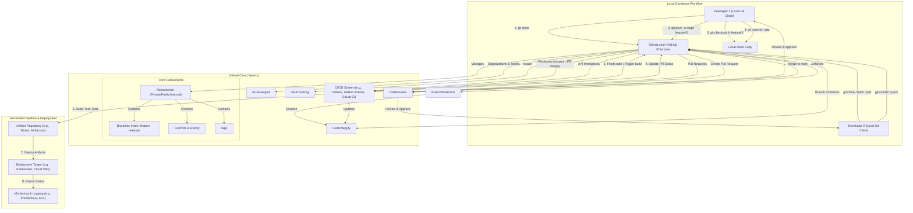

# GitHub - Part 1 - Technical Study Guide & Notes

This study guide is designed for experienced IT professionals seeking to master GitHub from a DevOps and Cloud perspective, aiming for expert-level proficiency within six months. This is Part 1 of 3, focusing on the foundational elements crucial for building robust, scalable, and secure software delivery pipelines.

---

## GitHub Study Guide: Core Foundations for Enterprise DevOps (Part 1/3)

### 1. Part Introduction and Scope

This section, "Core Foundations," establishes GitHub as the indispensable backbone of modern software development and operations. Far beyond a simple code repository, GitHub serves as a collaborative platform that orchestrates the entire development lifecycle, from initial code commit to eventual deployment.

The scope of Part 1 specifically covers:
*   **Fundamental Git Concepts:** How Git, the underlying version control system, operates and interacts with GitHub.
*   **GitHub as a Remote Repository:** Setting up and managing repositories, including visibility, structure, and initial configurations.
*   **Core Collaboration Mechanisms:** Branching strategies, Pull Requests (PRs) for code review, and issue tracking.
*   **Basic Security Postures:** Initial access control, authentication, and the very first layer of repository hardening.
*   **Essential CLI Interactions:** The `git` commands every engineer must master for daily operations.
*   **Fundamental Integrations:** How GitHub begins to connect with other systems via webhooks, laying the groundwork for CI/CD.

Mastering these foundational elements is not merely about understanding commands; it's about internalizing the best practices for collaboration, code integrity, and auditability that underpin all high-performing DevOps organizations.

### 2. Why This Part's Concepts Are Critical for High-Availability Systems

The core concepts covered in this section are paramount for achieving and maintaining high-availability (HA) systems for several reasons:

*   **Source Code as the Single Source of Truth (SSOT):** In HA environments, the integrity and availability of the application's source code are non-negotiable. GitHub ensures that all changes are versioned, traceable, and recoverable. This eliminates ambiguity about "what code is running where" and enables rapid rollback to stable versions, a critical HA capability.
*   **Atomic Changes and Auditability:** Every commit represents an atomic change, providing a granular history. This audit trail is vital for diagnosing production issues (RCA), understanding when and by whom a change was introduced, and fulfilling compliance requirements. The ability to pinpoint a faulty commit and revert it swiftly minimizes downtime.
*   **Parallel Development and Conflict Resolution:** HA systems often involve multiple teams contributing concurrently. GitHub's branching model facilitates parallel development without interfering with the main production codebase. Pull Requests with robust review processes prevent faulty code from reaching production, acting as a critical quality gate. Effective conflict resolution mechanisms ensure that divergent work can be merged predictably, preventing integration hell that could destabilize deployments.
*   **Reproducibility and Disaster Recovery:** The entire codebase, including configuration as code (IaC), is stored in GitHub. This means that in a disaster recovery scenario, the complete application and infrastructure definition can be re-provisioned from scratch, ensuring reproducibility and significantly reducing recovery time objectives (RTO).
*   **Foundation for Automation (GitOps):** The principles established here directly support GitOps. By managing all operational configurations (Kubernetes manifests, Terraform plans) in Git, every change to an HA system is versioned, reviewed, and automatically applied, reducing human error and increasing system stability. GitHub webhooks, in particular, are the fundamental trigger for these automated pipelines.
*   **Security and Compliance Baselines:** Enforcing branch protection rules, requiring code reviews, and mandating signed commits directly contribute to the security posture of an HA system. These measures prevent unauthorized or unvetted changes from entering critical code paths, thereby mitigating risks that could lead to system outages or data breaches.

### 3. Real-world Enterprise Use Cases with Architecture-level Details

GitHub's foundational features are central to various enterprise architectures:

#### 3.1. Monorepo Strategy for Multi-Service Applications

**Description:** A single GitHub repository hosts the source code for multiple, related services or applications, often with shared libraries or build tools. This is common in organizations aiming for simplified dependency management and atomic changes across services.

**Architecture-Level Details:**

*   **GitHub Repository:** A single, large private repository (e.g., `company-platform`) contains directories for `service-a/`, `service-b/`, `shared-libs/`, `infra/terraform/`, `docs/`.
*   **Branch Protection:** The `main` branch has strict protection rules:
    *   Minimum 2 approving reviews.
    *   All required status checks must pass (e.g., linting, unit tests, integration tests, security scans for *all affected services*).
    *   Require signed commits.
    *   Linear history enforced (squash or rebase merges).
*   **Webhooks:** A primary webhook is configured on `push` and `pull_request` events to a central CI/CD orchestrator (e.g., Jenkins, GitLab CI, GitHub Actions).
    *   **Payload Filtering:** The CI/CD system analyzes the webhook payload to identify which specific paths (`service-a/**`, `service-b/**`, etc.) within the monorepo have changed.
*   **CI/CD Pipeline (e.g., Jenkins with Shared Libraries):**
    *   **Change Detection:** Uses `git diff` or webhook payload analysis to determine affected components.
    *   **Conditional Builds:** Only builds, tests, and deploys the services whose code has changed, or services dependent on changed shared libraries.
    *   **Shared Pipelines:** Standardized `Jenkinsfile` or CI configuration templates are used across services, leveraging shared functions for common tasks (e.g., Docker builds, artifact publishing).
    *   **Artifact Repository (e.g., Sonatype Nexus, JFrog Artifactory):** Stores immutable build artifacts (Docker images, JARs, npm packages) tagged with Git commit SHAs and service versions.
*   **Deployment Target (e.g., Kubernetes Cluster):**
    *   Deployment manifests (Helm charts, Kustomize files) for all services might also reside within the monorepo in the `k8s/` directory.
    *   A GitOps operator (e.g., ArgoCD, FluxCD) monitors the `k8s/` directory in the GitHub monorepo for changes.
    *   Upon a merge to `main` (which updates image tags in K8s manifests), the GitOps operator automatically applies the new configurations to the cluster.

**Benefit:** Coordinated releases, simplified dependency management, atomic changes across services, and a unified view of the entire system.

#### 3.2. Microservices Architecture with Independent Repositories

**Description:** Each microservice, infrastructure component, or library resides in its own dedicated GitHub repository. This promotes autonomy, independent deployment, and technological diversity for each service.

**Architecture-Level Details:**

*   **Multiple GitHub Repositories:**
    *   `microservice-user-auth-api`
    *   `microservice-product-catalog`
    *   `microservice-order-processor`
    *   `infrastructure-terraform-base`
    *   `common-java-library`
*   **Branch Protection:** Each repository's `main` branch has its own, potentially unique, set of protection rules, tailored to the service's criticality and team structure.
*   **Webhooks:** Each service repository has a webhook configured to trigger its *own dedicated CI/CD pipeline*.
*   **CI/CD Pipeline (e.g., GitHub Actions, Azure DevOps Pipelines):**
    *   **Dedicated Pipeline per Repo:** Each service has a `workflow.yml` (GitHub Actions) or equivalent file in its repository.
    *   **Independent Build/Test/Deploy:** A push to `microservice-user-auth-api` only triggers its specific pipeline, building and testing only that service.
    *   **Artifact Registry:** Each pipeline publishes its service's artifacts (e.g., Docker images to ECR/ACR/GCR) with unique version tags.
*   **Deployment Target (e.g., Kubernetes Cluster):**
    *   Deployment manifests for each service are often stored in a separate "GitOps repository" or within the service's own repo, managed by a GitOps tool.
    *   Changes to a service's image tag within its deployment manifest are pushed to the GitOps repo, which then triggers the GitOps operator to update the Kubernetes cluster.

**Benefit:** Strong service autonomy, independent scaling, faster deployment cycles for individual services, clear ownership.

#### 3.3. Infrastructure as Code (IaC) with GitOps for Cloud Resources

**Description:** All infrastructure configurations (cloud networks, VMs, databases, Kubernetes clusters) are defined as code using tools like Terraform or CloudFormation and stored in GitHub. Changes are applied via a GitOps workflow.

**Architecture-Level Details:**

*   **GitHub Repository (e.g., `infra-terraform-aws`):** Contains all Terraform `.tf` files, modules, and `tfvars` for a specific cloud environment (e.g., AWS production).
    *   Separate directories for different environments (e.g., `prod/`, `staging/`, `dev/`).
*   **Branch Protection:** The `main` branch is highly protected, requiring multiple approvals, static analysis checks (e.g., `terraform validate`, `tflint`, `tfsec`), and linear history.
*   **Pull Requests:** All infrastructure changes must go through a PR.
    *   **Automated Plan Generation:** A webhook from GitHub triggers a service like HashiCorp's Atlantis or Terraform Cloud/Enterprise.
    *   **Atlantis/Terraform Cloud:**
        *   Listens for PR comments (e.g., `/atlantis plan`).
        *   Clones the repository, runs `terraform plan` for the affected directory.
        *   Posts the `plan` output (showing proposed infrastructure changes) as a comment back on the GitHub PR.
        *   On approval and a `/atlantis apply` comment, executes `terraform apply`.
*   **State Management:** Terraform state files are stored securely in a remote backend (e.g., S3 with DynamoDB locking, Azure Blob Storage, Terraform Cloud).
*   **Cloud Provider (e.g., AWS, Azure, GCP):** Atlantis or Terraform Cloud assumes an IAM role with appropriate permissions to provision and manage resources in the cloud.

**Benefit:** Versioned infrastructure, peer-reviewed changes, auditability, reduced human error, automated provisioning, and consistent environments.

### 4. Comprehensive Architecture Explanation

GitHub, at its core, is a hosted service that leverages the Git version control system. Understanding its architecture requires differentiating between the local Git workflow and the centralized collaboration features provided by GitHub.

#### 4.1. Textual Explanation

1.  **Git (Distributed Version Control System):** The foundation of GitHub. Git enables developers to work locally on a complete copy (clone) of the repository. Each clone contains the full history of the project, allowing offline work, rapid operations (commits, diffs), and robust branching. Changes are committed locally first, then pushed to a remote.
2.  **GitHub Cloud Service (Remote Repository):** This is the central server where all developers' local Git repositories synchronize their changes. It acts as the "source of truth" for the project. GitHub provides a web interface, APIs, and enhanced features beyond raw Git.
    *   **Repositories:** The fundamental unit for storing project code, documentation, and history. They can be public (anyone can see), private (only invited collaborators), or internal (GitHub Enterprise Cloud/Server specific, visible only within the organization).
    *   **Branches:** Pointers to specific commits, allowing developers to isolate work without affecting the main codebase. Common branches include `main` (for production-ready code), `develop`, `feature/*`, `release/*`, `hotfix/*`.
    *   **Commits:** Snapshots of the repository at a specific point in time, identified by a unique SHA-1 hash. Each commit includes a message, author, date, and points to its parent commit(s), forming a directed acyclic graph (DAG) representing the project history.
    *   **Pull Requests (PRs):** The primary mechanism for proposing changes and initiating code reviews. A developer pushes a feature branch to GitHub, then opens a PR to merge it into a target branch (e.g., `main`). Reviewers can comment, suggest changes, and approve.
    *   **Issues:** A system for tracking tasks, bugs, feature requests, and general project management. Issues can be linked to PRs and commits.
    *   **Webhooks:** Event-driven callbacks that allow GitHub to notify external systems (like CI/CD pipelines) about specific events (e.g., `push`, `pull_request_opened`, `issue_commented`). This is critical for integrating GitHub into a broader DevOps toolchain.
    *   **Organizations and Teams:** Enterprise features for managing multiple repositories, users, and permissions at scale. Organizations group repositories, and teams group users, making permission management efficient.
    *   **Users/Collaborators:** Individual developers or service accounts with authenticated access to GitHub, typically via SSH keys, HTTPS with Personal Access Tokens (PATs), or integrated with corporate SSO.
3.  **CI/CD System:** An external system (e.g., Jenkins, GitHub Actions, GitLab CI, Azure DevOps Pipelines) that subscribes to GitHub webhooks. Upon receiving an event, it fetches the relevant code, executes automated builds, tests, security scans, and potentially deploys the application.
4.  **Artifact Repository:** A centralized storage for build artifacts (Docker images, JARs, npm packages) produced by the CI/CD system. These artifacts are versioned and immutable.
5.  **Deployment Target:** The environment where the application is deployed (e.g., Kubernetes cluster, virtual machines, serverless functions).

The typical workflow involves developers cloning a repository, creating a new branch, making local commits, pushing the branch to GitHub, opening a Pull Request, getting code reviewed, and finally merging the PR. This merge event then triggers the CI/CD system via a webhook, initiating the automated pipeline.

#### 4.2. Mermaid Diagram



### 5. Types, Classifications, or Components Relating to This Part's Focus

This section details the fundamental building blocks and organizational structures within GitHub.

#### 5.1. Repositories (Repos)

The core unit for storing all project files, including code, documentation, and version history.
*   **Public:** Visible to anyone on the internet. Ideal for open-source projects.
*   **Private:** Only accessible to explicitly invited collaborators or members of the owning organization/team. Standard for enterprise applications and sensitive data.
*   **Internal (GitHub Enterprise Cloud/Server):** A middle ground, visible to all members of a GitHub Enterprise organization, but not to the public. Encourages inner-sourcing within large companies.

#### 5.2. Branches

Independent lines of development within a repository. They allow teams to work on new features, bug fixes, or experiments without affecting the stable codebase.
*   **`main` (or `master`):** The default branch, representing the latest stable release or production-ready code. Highly protected in production.
*   **Feature Branches:** Created for developing a specific feature. Merged back into `develop` or `main` after completion.
*   **Develop Branch:** (Common in GitFlow) An integration branch where all completed feature branches are merged before a release.
*   **Release Branches:** (Common in GitFlow) Created when a release is planned, allowing final bug fixes and preparation without affecting ongoing feature development.
*   **Hotfix Branches:** Created directly from `main` to quickly address critical bugs in production.

**Branching Strategies:**
*   **GitHub Flow:** Simple, lightweight. `main` is always deployable. Feature branches are created from `main`, merged back via PRs.
*   **GitFlow:** More complex, prescriptive. Uses `main`, `develop`, `feature`, `release`, and `hotfix` branches. Suitable for projects with strict release cycles.
*   **Trunk-Based Development (TBD):** All developers commit frequently to a single `main` branch. Relies heavily on feature flags and automated testing. Becoming popular for high-velocity teams.

#### 5.3. Commits

A snapshot of the repository at a specific point in time.
*   **Commit Hash (SHA-1):** Unique identifier for each commit.
*   **Author & Committer:** The person who wrote the code and the person who applied the commit (can be different, e.g., in a rebase).
*   **Commit Message:** A description of the changes. Crucial for understanding history.
*   **Parent Commits:** Links commits together, forming the project history.

#### 5.4. Tags

Pointers to specific commits, typically used to mark release points (e.g., `v1.0.0`).
*   **Lightweight Tags:** Just a name pointing to a commit.
*   **Annotated Tags:** Stores tagger name, email, date, and a message, along with a GPG signature for verification. Recommended for production releases.

#### 5.5. Pull Requests (PRs) / Merge Requests

A mechanism to propose changes from one branch (e.g., a feature branch) to another (e.g., `main`) and initiate a code review.
*   **Code Review:** Collaborators examine changes, provide feedback, and approve.
*   **Status Checks:** External CI/CD systems report build/test/scan results, which can be mandatory for merging.
*   **Merge Strategies:**
    *   **Merge Commit:** Creates a new commit that records the merge, preserving full branch history.
    *   **Squash and Merge:** Combines all commits from the feature branch into a single new commit on the target branch. Cleans up history.
    *   **Rebase and Merge:** Re-writes the history of the feature branch on top of the target branch, then fast-forwards. Creates a linear history. *Only available through GitHub UI, not a standard Git rebase operation.*

#### 5.6. Issues

GitHub's built-in issue tracking system for managing tasks, bugs, feature requests, and project enhancements.
*   **Labels:** Categorize issues (e.g., `bug`, `enhancement`, `P1`).
*   **Milestones:** Group issues and PRs for a specific release or project phase.
*   **Assignees:** Designate who is responsible for an issue.
*   **Projects (Kanban/Scrum Boards):** Visual boards for organizing and tracking issues and PRs through various stages.

#### 5.7. Webhooks

HTTP callbacks that notify external services when specific events occur in a GitHub repository or organization.
*   **Payload URL:** The endpoint where GitHub sends the event data.
*   **Secret:** A shared secret used to verify the authenticity of the webhook payload, preventing spoofing.
*   **Events:** Configurable to trigger on various events (e.g., `push`, `pull_request`, `issue_comment`, `release`).

#### 5.8. Organizations and Teams

Enterprise-grade features for managing access and collaboration across multiple repositories and users.
*   **Organizations:** A shared account for multiple users, typically representing a company or a large project. Owns repositories and manages teams.
*   **Teams:** Groups of organization members. Teams can be granted specific permissions to repositories, simplifying access management compared to granting permissions to individual users.
    *   **Team Permissions:** Read, Triage, Write, Maintain, Admin.

#### 5.9. Code Owners

A `CODEOWNERS` file (at the root or `.github/` directory) specifies individuals or teams responsible for code in specific parts of the repository. GitHub automatically requests reviews from these owners for PRs affecting their designated code.

### 6. Step-by-step Production Implementation Guide

This guide outlines the foundational steps for setting up GitHub for an enterprise, focusing on security, collaboration, and maintainability.

#### 6.1. Establish GitHub Organization

1.  **Create Organization:**
    *   Go to GitHub.com, click your profile photo, then **Your organizations**, then **New organization**.
    *   Choose an appropriate plan (e.g., GitHub Team or Enterprise Cloud).
    *   Define a clear organization name (e.g., `AcmeCorp`, `GlobalTechSolutions`).
2.  **Configure Organization Settings (Security & Compliance First):**
    *   **Mandate Two-Factor Authentication (2FA):** Navigate to `Organization settings > Member privileges > Authentication` and select "Require two-factor authentication for all members of this organization." This is a critical security baseline.
    *   **Integrate Single Sign-On (SSO) / SAML:** For GitHub Enterprise Cloud, configure SAML SSO under `Organization settings > Security`. This ensures all corporate users authenticate via your identity provider (e.g., Okta, Azure AD, OneLogin), centralizing identity management and access control.
    *   **IP Allow List (Enterprise Cloud):** Restrict access to your organization's resources from specific IP ranges (`Organization settings > Security > IP allow list`). Crucial for sensitive environments.
    *   **Audit Log Streaming:** Set up streaming of your organization's audit logs to a SIEM (Security Information and Event Management) system for long-term retention and analysis (`Organization settings > Audit log > Audit log streaming`).
3.  **Define Organization Roles:**
    *   **Owners:** Grant this role sparingly (e.g., to a small group of senior architects/security ops). Owners have full control over the organization.
    *   **Members:** Standard role for most developers. Permissions are then granted at the team and repository level.
4.  **Create Teams Based on Functional Groups:**
    *   Go to `Organization > Teams` and create teams (e.g., `backend-devs`, `frontend-devs`, `platform-ops`, `security-auditors`).
    *   Add relevant members to each team. This simplifies permission management.

#### 6.2. Repository Creation & Configuration

1.  **Create a New Private Repository:**
    *   Within your organization, create a new repository. **Always default to `Private`** unless there's a specific, approved reason for public visibility.
    *   Initialize with:
        *   `.gitignore`: Select a template appropriate for your primary language/framework (e.g., `Java`, `Node`, `Terraform`).
        *   `LICENSE`: Choose an appropriate open-source license if public, or a corporate license if private.
        *   `README.md`: Provide essential project information, setup instructions, and contribution guidelines.
    *   Set the default branch name to `main` (or `develop` if using GitFlow).
2.  **Configure Branch Protection Rules (CRITICAL for Production):**
    *   Navigate to `Repository settings > Branches`.
    *   Click "Add branch protection rule" for `main` (and any other critical branches like `release/*`).
    *   **Highly Recommended Production Rules:**
        *   `Require a pull request before merging`: Enforces code review.
        *   `Require approvals`: Set `Required approving reviews` to `2` (or more for highly critical projects).
        *   `Require code owner reviews`: Mandates reviews from individuals/teams listed in `CODEOWNERS`.
        *   `Require status checks to pass before merging`: Enable for all critical CI/CD checks (e.g., build, test, lint, security scan). Select `Require branches to be up to date before merging` for strictness.
        *   `Require signed commits`: Mandates all commits to the branch must be cryptographically signed (GPG/S/MIME). Enhances commit integrity and author verification.
        *   `Require linear history`: Prevents merge commits by forcing squash or rebase merges. Keeps history clean.
        *   `Do not allow bypassing the above settings`: Uncheck "Allow specified actors to bypass required pull requests." This is a security hardening measure.
        *   `Allow force pushes`: **Disable for `main` and release branches.** Allows `git push --force`.
        *   `Allow deletions`: **Disable for `main` and release branches.** Prevents accidental branch deletion.
        *   `Restrict who can push to matching branches`: Only specific teams (e.g., `ops-admins` for emergency fixes) should have direct push access, bypassing PRs. Use with extreme caution.
3.  **Add Teams to Repository with Appropriate Permissions:**
    *   Go to `Repository settings > Manage access`.
    *   Add your previously created teams with the principle of least privilege:
        *   `backend-devs`: `Write` (can push branches, open PRs).
        *   `frontend-devs`: `Write` (if applicable).
        *   `platform-ops`: `Maintain` or `Admin` (if they manage repository settings, webhooks, etc.).
        *   `security-auditors`: `Triage` or `Read` (for security reviews without direct code contribution).
    *   Avoid giving `Admin` permissions broadly.

#### 6.3. Developer Workflow Setup

1.  **Clone Repository:**
    *   Developers use `git clone <repo_url>` (SSH or HTTPS with PAT).
    *   `git config --global user.name "Your Name"` and `git config --global user.email "your.email@example.com"` are set up once.
2.  **Create Feature Branch:**
    *   `git checkout -b feature/my-new-feature` from `main`.
3.  **Commit Changes:**
    *   `git add .` or `git add -p` (for interactive staging).
    *   `git commit -S -m "feat: implement new feature X"` (use `-S` for GPG signing if required by branch protection).
4.  **Push Branch:**
    *   `git push -u origin feature/my-new-feature` (sets upstream tracking).
5.  **Create Pull Request:**
    *   Go to GitHub UI, navigate to the repo, and click "Compare & pull request" for the newly pushed branch.
    *   Fill in title, description, link issues, request specific reviewers, add labels.
6.  **Code Review & Approval:**
    *   Reviewers check code, provide feedback.
    *   CI/CD system runs (triggered by webhook), status checks report back to the PR.
    *   Once all checks pass and required approvals are met, the PR is ready.
7.  **Merge Pull Request:**
    *   Choose "Squash and merge" or "Rebase and merge" to maintain a clean linear history, especially for `main`.
    *   Merging triggers the next stage of the CI/CD pipeline (e.g., deployment to staging).

### 7. Standard CLI Commands with Deep Technical Explanations of Each Flag

Understanding these `git` commands and their flags is fundamental for effective interaction with GitHub in a production environment.

1.  **`git clone <repository_url> [options]`**
    *   **Purpose:** Downloads a copy of an existing Git repository from a remote server (like GitHub) to your local machine.
    *   **`repository_url`**: The URL of the GitHub repository (HTTPS or SSH).
    *   **`--branch <name>`**: Clones only the specified branch instead of the default branch (usually `main`).
        *   *Technical Detail:* Reduces the amount of data transferred if you only care about a specific line of development.
        *   *Production Tip:* Useful in CI/CD pipelines where you only need a specific branch to build, e.g., `--branch production-release-v2.0`.
    *   **`--single-branch`**: Clones only the history of the specified branch. Implies `--branch`.
        *   *Technical Detail:* Optimizes further by not fetching remote branches that are not the target branch.
        *   *Production Tip:* Combine with `--depth` in CI for minimal clone operations, significantly speeding up build times for large repositories.
    *   **`--depth <num>`**: Creates a "shallow clone" with a history truncated to the specified number of revisions.
        *   *Technical Detail:* Instead of fetching the entire commit history, it only fetches the last `num` commits. This dramatically reduces repository size and clone time.
        *   *Production Tip:* **Essential for CI/CD pipelines.** For a typical CI build, you often only need the latest commit or a few recent commits, not the entire history spanning years. E.g., `--depth 1` for the latest commit.

2.  **`git checkout [-b] <branch_name> [<start_point>]`**
    *   **Purpose:** Switches between branches or restores working tree files.
    *   **`-b`**: Creates a new branch named `<branch_name>` and immediately switches to it.
        *   *Technical Detail:* A shorthand for `git branch <branch_name>` followed by `git switch <branch_name>` (or `git checkout <branch_name>` in older Git versions).
        *   *Production Tip:* Always create new branches for features or bug fixes to isolate work and prevent direct changes to `main`.
    *   **`<start_point>`**: The commit, branch, or tag from which the new branch will be created. If omitted, it defaults to the current `HEAD`.
        *   *Technical Detail:* Allows you to diverge from a specific point in history, not just the tip of the current branch.
        *   *Production Tip:* `git checkout -b feature/new-dashboard develop` to base a new feature on the `develop` branch.

3.  **`git add [-p | --patch] <file_pattern>`**
    *   **Purpose:** Stages changes from the working directory to the Git index (staging area).
    *   **`-p`, `--patch`**: Interactively stages changes. Git presents hunks (diff blocks) and asks if you want to stage each one.
        *   *Technical Detail:* Allows fine-grained control over what gets committed. You can stage parts of a file, even individual lines, for a more focused commit.
        *   *Production Tip:* **Highly recommended for production work.** Prevents accidental inclusion of debugging code, incomplete features, or unrelated changes in a commit. Enables creating small, atomic, and logical commits.

4.  **`git commit [-m <message>] [--amend] [--signoff] [--no-verify]`**
    *   **Purpose:** Records the staged changes as a new commit in the local repository history.
    *   **`-m <message>`**: Provides a commit message inline. Multiple `-m` flags concatenate messages.
        *   *Production Tip:* Write clear, concise, and descriptive commit messages following a standard (e.g., Conventional Commits).
    *   **`--amend`**: Combines the staged changes with the *previous* commit instead of creating a new one. It re-writes the last commit.
        *   *Technical Detail:* Changes the SHA-1 hash of the last commit. If pushed to a remote, it requires a force push (`git push --force`).
        *   *Production Tip:* **Use with extreme caution on branches that have already been pushed and shared.** It rewrites history, which can cause issues for collaborators who have pulled the original commit. Safe for local commits not yet pushed or for feature branches you own exclusively.
    *   **`--signoff`, `-s`**: Adds a `Signed-off-by:` line to the commit message.
        *   *Technical Detail:* Often used for Developer Certificate of Origin (DCO) to certify that you have the right to contribute the code. Required by many open-source projects and some enterprise policies.
        *   *Production Tip:* Check your organization's contribution guidelines. If DCO is required, integrate this into your workflow.
    *   **`--no-verify`**: Bypasses pre-commit hooks.
        *   *Technical Detail:* `pre-commit` hooks are scripts that run before a commit is created (e.g., linters, formatters). `--no-verify` skips these.
        *   *Production Tip:* **Avoid in production unless absolutely necessary for an emergency bypass.** Pre-commit hooks are vital for maintaining code quality and security standards. Bypassing them can introduce issues.

5.  **`git push [-u | --set-upstream] [--force | -f] [--no-verify] [<remote> <branch>]`**
    *   **Purpose:** Uploads local branch commits to the remote repository (e.g., GitHub).
    *   **`-u`, `--set-upstream`**: Configures the current local branch to track the remote branch, so subsequent `git pull` or `git push` commands can be run without specifying the remote and branch.
        *   *Production Tip:* Use this the first time you push a new branch: `git push -u origin feature/my-feature`.
    *   **`--force`, `-f`**: Overwrites the remote branch with the local branch's history, even if it results in a non-fast-forward update (i.e., remote history would be lost).
        *   *Technical Detail:* Dangerous because it can erase history on the remote repository, potentially losing collaborators' work.
        *   *Production Tip:* **NEVER use `--force` on `main`, `develop`, or any other shared, protected branch.** Only use on your own feature branches if you are sure no one else has pulled from them, typically after a `git rebase` operation. Consider `--force-with-lease` as a safer alternative (see below).
    *   **`--force-with-lease`**: A safer variant of `--force`. It only forces the push if the remote branch hasn't changed since you last pulled. If someone else pushed, it will fail, preventing accidental overwrites.
        *   *Production Tip:* **Prefer `--force-with-lease` over `--force`** when you need to rewrite history on a remote feature branch.
    *   **`--no-verify`**: Bypasses pre-push hooks.
        *   *Production Tip:* Similar to `--no-verify` for `git commit`, avoid unless absolutely critical. Pre-push hooks can perform final checks before code leaves your machine.

6.  **`git pull [--rebase | --ff-only]`**
    *   **Purpose:** Fetches changes from the remote repository and integrates them into the current local branch.
    *   **`--rebase`**: Fetches changes, then "replays" your local commits on top of the newly fetched remote changes. Creates a linear history.
        *   *Technical Detail:* Avoids merge commits, resulting in a cleaner, more linear project history. However, it rewrites the history of your local commits.
        *   *Production Tip:* **Recommended for keeping feature branches up-to-date with `main` or `develop`** (`git pull --rebase origin main`). This keeps your feature branch history clean before opening a PR. Be cautious if your local commits have already been shared.
    *   **`--ff-only`**: Performs a "fast-forward only" merge. If the remote history has diverged from your local history (i.e., a fast-forward merge is not possible without creating a merge commit), `git pull` will abort.
        *   *Technical Detail:* Ensures that `git pull` is a non-destructive operation on your local history.
        *   *Production Tip:* Useful in scripts or automated environments where you want to ensure the pull operation is clean and doesn't introduce merge conflicts automatically.

7.  **`git merge [--no-ff | --squash]`**
    *   **Purpose:** Integrates changes from one branch into another.
    *   **`--no-ff`, `--no-fast-forward`**: Creates a merge commit even if a fast-forward merge is possible.
        *   *Technical Detail:* Preserves the exact history of the merged branch, showing when and where the merge occurred.
        *   *Production Tip:* Useful when you want to explicitly record a merge event for a feature branch, even if it could have been fast-forwarded. Often used in GitFlow's merge from `develop` to `main`.
    *   **`--squash`**: Combines all commits from the merged branch into a single new commit on the current branch. The original branch's history is not preserved.
        *   *Technical Detail:* Creates a clean, single commit from a feature branch, reducing noise in the main branch's history. The new commit will have a new SHA.
        *   *Production Tip:* **Often preferred for merging feature branches into `main` via PRs in GitHub, especially with GitHub's "Squash and Merge" button.** It creates a clean, understandable history on `main` without individual feature branch commits.

8.  **`git config --global user.name "Your Name"` & `git config --global user.email "your.email@example.com"`**
    *   **Purpose:** Sets your name and email address that will be associated with your commits.
    *   *Technical Detail:* These are stored in your global Git configuration file (`~/.gitconfig`).
    *   *Production Tip:* Essential for proper attribution and DCO compliance. Ensure they match your corporate identity.

9.  **`git remote -v`**
    *   **Purpose:** Lists the remote repositories configured for your local repository, along with their URLs.
    *   *Technical Detail:* Shows both fetch and push URLs for each remote.
    *   *Production Tip:* Handy for verifying you're pushing/pulling from the correct GitHub repository.

10. **`git status`**
    *   **Purpose:** Shows the state of your working directory and staging area.
    *   *Technical Detail:* Indicates which files are modified, staged, or untracked.
    *   *Production Tip:* Run frequently to understand your current local changes before committing or pulling.

11. **`git log`**
    *   **Purpose:** Displays the commit history of the current branch.
    *   *Technical Detail:* Shows commit hash, author, date, and message.
    *   *Production Tip:* Use `git log --oneline --graph --all` for a compact, visual representation of the entire repository history, useful for understanding branching and merging.

### 8. Production Configuration Examples

These examples demonstrate how to configure GitHub for enterprise environments using JSON (for API interactions/Terraform) and standard configuration files.

#### 8.1. GitHub Branch Protection Rule (JSON for API/Terraform)

This JSON structure represents a hardened branch protection rule for a critical branch (`main` or `release/*`). When managed via Terraform, this would typically map to `github_branch_protection` resource attributes.

```json
{
  "pattern": "main",
  "required_status_checks": {
    "strict": true, // Requires branches to be up-to-date before merging
    "contexts": [
      "ci/jenkins/build",       // Example: Primary build and unit tests
      "ci/sonarqube/analysis",  // Example: Static code analysis
      "security/snyk/scan",     // Example: Dependency vulnerability scan
      "infra/terraform/plan"    // Example: For IaC repos, ensure Terraform plan passes
    ]
  },
  "required_pull_request_reviews": {
    "dismiss_stale_reviews": true,         // Dismisses approval if new commits are pushed
    "require_code_owner_reviews": true,    // Mandates review from CODEOWNERS
    "required_approving_review_count": 2,  // Minimum 2 approvals
    "bypass_pull_request_allowances": {    // Who can bypass PR requirements (use sparingly)
      "users": [],                         // No individual users should bypass for main
      "teams": ["ops-admins"]              // E.g., for emergency hotfixes, restrict carefully
    },
    "dismiss_approvals_on_push": true,     // Equivalent to dismiss_stale_reviews
    "require_last_push_approval": true     // Requires approval after last push (Enterprise Cloud)
  },
  "restrictions": null,                    // No user/team restrictions on who can push/merge (managed by PRs)
  "enforce_admins": true,                  // Applies protection rules to repository administrators
  "required_linear_history": true,         // Enforces squash or rebase merges, no merge commits
  "allow_force_pushes": false,             // Strictly disallow force pushes
  "allow_deletions": false,                // Strictly disallow branch deletions
  "required_signatures": true,             // Mandates GPG or S/MIME signed commits
  "required_conversation_resolution": true // All comments on PR must be resolved before merging
}
```

#### 8.2. GitHub Webhook Configuration (JSON for API/Terraform)

This configures a webhook to notify a CI/CD system upon critical events.

```json
{
  "name": "web", // Type of webhook
  "active": true, // Webhook is enabled
  "events": [
    "push",        // Trigger on any push to any branch
    "pull_request",// Trigger on PR opened, edited, synchronized, closed, reviewed, etc.
    "issues",      // Trigger on issue opened, edited, closed, assigned, etc.
    "release",     // Trigger on release published, created, deleted, etc.
    "status"       // Trigger when commit status changes (e.g., CI build result)
  ],
  "config": {
    "url": "https://your-ci-system.example.com/github-webhook-endpoint/", // Endpoint for CI/CD
    "content_type": "json", // Payload format
    "secret": "your_highly_secure_webhook_secret_from_ci_system", // Shared secret for verification
    "insecure_ssl": "0" // 0 = require SSL verification (production), 1 = disable (development only)
  }
}
```

#### 8.3. `.gitignore` for a Robust Enterprise Project (Multi-language/tooling)

A comprehensive `.gitignore` is crucial for keeping repositories clean and focused on source code.

```gitignore
# Operating System generated files
.DS_Store
Thumbs.db
Desktop.ini
.Spotlight-V100
.Trashes

# IDE and Editor specific files
.idea/                          # IntelliJ IDEA
.vscode/                        # Visual Studio Code
*.iml                           # IntelliJ IDEA module files
*.ipr                           # IntelliJ IDEA project files
*.iws                           # IntelliJ IDEA workspace files
.project                        # Eclipse project files
.classpath                      # Eclipse classpath files
.settings/                      # Eclipse settings directory
*.sublime-project               # Sublime Text project files
*.sublime-workspace             # Sublime Text workspace files
.history                        # VS Code Local History
*.bak                           # Backup files
*.swp                           # Vim swap files

# Build artifacts and directories
target/                         # Maven build output
build/                          # Gradle/Generic build output
dist/                           # Distribution output
out/                            # Common output directory
bin/                            # Compiled binaries
*.jar
*.war
*.ear
*.zip
*.tar.gz
*.exe
*.dll
*.so
*.o
*.class
*.pyc
__pycache__/                    # Python compiled bytecode
node_modules/                   # Node.js dependencies
vendor/                         # Go/PHP dependencies (if not using modules)
.gradle/                        # Gradle wrapper files
.terraform/                     # Terraform working directory
.terraform.lock.hcl             # Terraform lock file

# Test and coverage reports
junit.xml
surefire-reports/
target/site/jacoco/
coverage/
.nyc_output/

# Environment variables and sensitive data (CRITICAL)
.env                            # Generic environment file
.env.development
.env.production
*.env                           # Any file ending with .env
*.conf.local                    # Local configuration overrides
*.yaml.local
*.yml.local
*.json.local
secrets.yaml                    # Explicitly exclude common secret names
credentials.json
.aws/credentials                # AWS CLI credentials
.kube/config                    # Kubernetes config
id_rsa*                         # SSH private keys
*.pem
*.key
*.p12
*.pfx

# Logs
*.log
log/
logs/

# Package manager files
npm-debug.log*
yarn-debug.log*
yarn-error.log*
pnpm-debug.log*

# Git specific
.git-credentials
.git-completion.bash
.gitmodules                     # Exclude if submodules are not intended to be versioned directly
.gitattributes                  # Exclude if you manage this externally

# Dependency Lock Files (Conditional exclusion for multi-repo vs monorepo)
# For monorepos, you might want to version these
# package-lock.json
# yarn.lock
# pnpm-lock.yaml
# composer.lock
# Gemfile.lock
# Pipfile.lock
```

### 9. Security Considerations & Hardening Best Practices

Securing GitHub is paramount for enterprise integrity, as it holds the intellectual property and the very blueprint of your systems.

#### 9.1. Identity and Access Management (IAM)

*   **Single Sign-On (SSO) / SAML:**
    *   **Best Practice:** Enforce SAML SSO for your GitHub Organization (or Enterprise). This delegates user authentication to your corporate Identity Provider (IdP) (e.g., Okta, Azure AD, Auth0).
    *   **Benefit:** Centralized user management, automatic provisioning/deprovisioning, consistent authentication policies, and reduced credential sprawl.
*   **Two-Factor Authentication (2FA):**
    *   **Best Practice:** Mandate 2FA for all organization members, especially owners. GitHub provides granular control to enforce this.
    *   **Benefit:** Adds a critical layer of security against compromised passwords.
*   **Least Privilege Principle:**
    *   **Best Practice:** Grant only the minimum necessary permissions to users and teams.
    *   **Implementation:**
        *   **Organization Roles:** Limit `Owner` role to a very small, trusted group. Most users should be `Members`.
        *   **Team Permissions:** Use GitHub Teams to manage access. Assign `Read`, `Triage`, `Write`, `Maintain`, or `Admin` permissions to teams on a per-repository basis. `Read` is default, `Write` for developers, `Maintain` for technical leads, `Admin` for repository owners/ops.
        *   **Bot Accounts/Service Principals:** For automated systems (CI/CD, GitOps tools), create dedicated GitHub Apps or use Personal Access Tokens (PATs) with the absolute minimum scope required.
*   **Access Reviews & Audits:**
    *   **Best Practice:** Regularly audit user and team access to repositories. Remove inactive users.
    *   **Implementation:** Leverage GitHub's audit logs, or integrate with a SIEM for automated reporting and alerts on access changes.

#### 9.2. Repository Security

*   **Branch Protection Rules (as detailed in Section 8.1):**
    *   **Best Practice:** Implement stringent branch protection on `main`, `develop`, and `release/*` branches.
    *   **Key Controls:** Require PRs, multiple approving reviews, code owner reviews, passing status checks (CI/CD, security scans), signed commits, and linear history. **Crucially, disable force pushes and deletions for protected branches.**
*   **Code Owners:**
    *   **Best Practice:** Define a `CODEOWNERS` file at the repository root or `.github/CODEOWNERS`.
    *   **Benefit:** Ensures that changes to critical code paths are reviewed by the responsible team/individual, improving code quality and security.
*   **Secret Management:**
    *   **Best Practice:** **NEVER commit secrets (API keys, database passwords, tokens) directly to Git.**
    *   **Implementation:**
        *   **Client-Side:** Use pre-commit hooks (e.g., `git-secrets`, `pre-commit` framework) to scan for common secret patterns before a commit is created.
        *   **CI/CD Integration:** Use secure secret management solutions like HashiCorp Vault, AWS Secrets Manager, Azure Key Vault, or GitHub's own Encrypted Secrets in GitHub Actions. Inject secrets as environment variables at runtime, never hardcode.
        *   **`.gitignore`:** Ensure sensitive file types are listed.
*   **Repository Visibility:**
    *   **Best Practice:** Default to `Private` for all new repositories. Only use `Internal` or `Public` if explicitly required and after a security review.
*   **Dependabot Alerts & Security Scanning:**
    *   **Best Practice:** Enable Dependabot for automated vulnerability scanning of dependencies. Integrate SAST (Static Application Security Testing) and DAST (Dynamic Application Security Testing) tools into your CI/CD pipelines.
    *   **Benefit:** Proactive identification and remediation of security vulnerabilities in your codebase and its dependencies.
*   **Signed Commits:**
    *   **Best Practice:** Require GPG or S/MIME signed commits via branch protection rules.
    *   **Benefit:** Verifies the authenticity of the commit author, preventing spoofing and providing non-repudiation for changes in the repository.

#### 9.3. Webhooks Security

*   **Secrets:**
    *   **Best Practice:** Always configure a `secret` for your webhooks.
    *   **Implementation:** The receiving system (CI/CD) uses this secret to compute a hash of the payload and compares it to the `X-Hub-Signature` header sent by GitHub. This verifies the payload's integrity and origin.
*   **HTTPS Only:**
    *   **Best Practice:** Ensure all webhook `payload_url`s use HTTPS.
    *   **Benefit:** Encrypts webhook payloads in transit, preventing eavesdropping.
*   **IP Whitelisting:**
    *   **Best Practice:** If your CI/CD system or webhook receiver is in a private network, configure its firewall/security groups to only accept incoming connections from GitHub's documented IP ranges.
    *   **Benefit:** Restricts network access to your webhook endpoint, reducing the attack surface.

#### 9.4. SSH Keys and Personal Access Tokens (PATs)

*   **SSH Keys:**
    *   **Best Practice:** Use strong passphrases for SSH keys. Regenerate and revoke keys when personnel leave or keys are compromised.
    *   **Deploy Keys:** For read-only access for automated systems to *single repositories*, use deploy keys. Avoid using the same deploy key across multiple repositories if possible.
*   **Personal Access Tokens (PATs):**
    *   **Best Practice:** Use PATs with the principle of least privilege – grant only the necessary scopes. Set expiration dates. Rotate them regularly. Store them securely (e.g., in a password manager or secret manager).
    *   **Benefit:** PATs provide granular control over API access without exposing your GitHub password.

#### 9.5. Audit Logs

*   **Best Practice:** Regularly review GitHub organization audit logs for unusual activities (e.g., permission changes, repository deletions, force pushes, creation of new PATs).
*   **Implementation:** Stream audit logs to a SIEM for centralized logging, alerting, and long-term retention to meet compliance requirements.

### 10. Observability & Monitoring Considerations

Monitoring GitHub isn't about its internal health (GitHub manages that), but about the *activity within it* and how integrated systems respond to those activities. This is crucial for pipeline health, security, and developer productivity.

#### 10.1. GitHub's Own Audit Logs and Webhooks

*   **Audit Logs:**
    *   **What to Watch:** All organization-level changes (member additions/removals, permission changes, repository visibility changes), repository creations/deletions, branch protection rule modifications, PAT creations/deletions, SSH key additions.
    *   **Action:** Stream these logs to your SIEM (Splunk, ELK, Datadog Security) for real-time alerting on suspicious activities and long-term compliance auditing.
*   **Webhook Delivery Status:**
    *   **What to Watch:** Monitor webhook delivery failures (HTTP 4xx/5xx responses) from the GitHub UI (`Repository Settings > Webhooks > Recent Deliveries`) or programmatically via API.
    *   **Action:** Set up alerts if webhook delivery failures exceed a threshold. This indicates a problem with your CI/CD system's endpoint or network connectivity.

#### 10.2. CI/CD Pipeline Metrics (derived from GitHub events)

Your CI/CD system, being the primary consumer of GitHub events, is where most actionable metrics will be generated.

*   **Lead Time for Changes:**
    *   **Metric:** Time from first commit in a feature branch to merge into `main`.
    *   **Prometheus Example:** `histogram_quantile(0.95, sum by (le) (ci_pipeline_pr_merge_duration_seconds_bucket))`
    *   **Benefit:** Indicates development efficiency, code review bottlenecks, and pipeline speed.
*   **Pull Request (PR) Metrics:**
    *   **Metrics:**
        *   PR Open Rate / Merge Rate: Number of PRs opened vs. merged per day/week.
        *   PR Size (lines of code changed): Indicates complexity of changes.
        *   Time to First Review / Time to Merge: Average duration for PRs to receive their first review and to be merged.
        *   Number of review comments per PR: Indicator of review thoroughness or code quality issues.
    *   **Prometheus Example:**
        *   `github_pr_open_total`
        *   `github_pr_merged_total`
        *   `histogram_quantile(0.9, sum by (le) (github_pr_time_to_first_review_seconds_bucket))`
        *   `github_pr_comments_total{type="review"}`
    *   **Benefit:** Identifies team collaboration patterns, potential bottlenecks in code review, and helps optimize development flow.
*   **Build Success/Failure Rate:**
    *   **Metric:** Percentage of builds triggered by GitHub events that pass or fail.
    *   **Prometheus Example:** `(sum(ci_build_status_total{status="success"}) / sum(ci_build_status_total)) * 100`
    *   **Benefit:** Direct indicator of code quality, test suite effectiveness, and pipeline stability. Differentiate failures by type (e.g., unit test failure, integration test failure, linter error).
*   **Branch Protection Violations:**
    *   **Metric:** Number of attempts to push directly to protected branches, or merge PRs that violate rules.
    *   **Prometheus Example:** `github_branch_protection_violations_total{repo="my-app", type="force_push"}`
    *   **Benefit:** Indicates potential process adherence issues or attempts to bypass controls.

#### 10.3. Log Aggregation

*   **Webhook Consumer Logs:**
    *   **What to Log:** Incoming webhook payloads, processing logic, any errors encountered while parsing or dispatching events to CI jobs.
    *   **Action:** Centralize these logs in an ELK stack, Splunk, Datadog, or similar. Alert on critical errors.
*   **Git CLI Command Outputs (from CI/CD):**
    *   **What to Log:** The full output of `git clone`, `git fetch`, `git pull`, `git push` commands executed by your CI/CD agents.
    *   **Benefit:** Crucial for debugging CI pipeline failures related to Git operations (e.g., authentication issues, shallow clone problems, large repo performance).
*   **Authentication Logs:**
    *   **What to Log:** Successful and failed authentication attempts to GitHub from CI/CD systems using PATs or SSH keys.
    *   **Benefit:** Detects brute-force attempts or expired credentials for automated systems.

### 11. Common Troubleshooting Scenarios with RCA (Root Cause Analysis) Steps

#### 11.1. Scenario 1: `git push` Fails Due to Authentication Error

**Problem:** You try to `git push` to GitHub, but it responds with "Authentication failed" or "Permission denied (publickey)".

**RCA Steps:**

1.  **Verify Git Configuration:**
    *   `git config --global user.name` and `git config --global user.email`: Ensure these are correctly set and match your GitHub identity.
    *   `git remote -v`: Confirm the remote URL is correct (e.g., `git@github.com:org/repo.git` for SSH, `https://github.com/org/repo.git` for HTTPS).
2.  **Check Credential Helper (for HTTPS):**
    *   `git config credential.helper`: If using HTTPS, ensure a credential helper (e.g., `osxkeychain`, `manager-core`, `cache`) is configured and working. Try clearing cached credentials.
    *   **Action:** Re-enter your username and Personal Access Token (PAT) when prompted. If using password, GitHub no longer supports it; you *must* use a PAT.
3.  **Validate Personal Access Token (PAT):**
    *   **GitHub UI:** Go to `Settings > Developer settings > Personal access tokens`.
    *   **Check:** Is the PAT still valid (not expired)? Does it have the necessary scopes (e.g., `repo` for full repository access, `write:packages` for package management)?
    *   **Action:** Generate a new PAT with appropriate scopes and expiry, and update your credential helper or `.git-credentials` file.
4.  **Inspect SSH Key (for SSH):**
    *   `ssh -v git@github.com`: This command provides verbose output about the SSH connection attempt. Look for "Authentication successful" or errors.
    *   `ssh-add -l`: Check if your SSH agent has loaded the correct key.
    *   `ls -al ~/.ssh/`: Verify your private key (`id_rsa`, `id_ed25519`, etc.) exists and has correct permissions (`-rw-------`).
    *   **GitHub UI:** Go to `Settings > SSH and GPG keys`.
    *   **Check:** Is your public SSH key present and active on GitHub? Does its fingerprint match your local private key?
    *   **Action:** Ensure your key is added to `ssh-agent`. If not, `ssh-add ~/.ssh/id_rsa`. If the key is not on GitHub, upload your public key. If the key is corrupted or passphrase forgotten, generate a new one.
5.  **Repository Permissions:**
    *   **GitHub UI:** Check if your user/team has `Write` access to the repository.
    *   **Action:** Request appropriate permissions from an organization owner or repository admin.

#### 11.2. Scenario 2: Pull Request Cannot Be Merged Due to Failed Status Checks

**Problem:** A PR is approved, but the "Merge pull request" button is disabled because "Required status checks haven't passed."

**RCA Steps:**

1.  **Identify Failed Checks:**
    *   **GitHub PR Page:** Scroll down to the "Checks" section. Red 'X' icons clearly indicate which specific checks failed (e.g., "ci/jenkins/build", "security/snyk/scan", "lint/prettier").
2.  **Examine Detailed Check Results:**
    *   Click on the "Details" link next to a failed check. This will redirect you to the specific CI/CD job run (e.g., Jenkins job log, GitHub Actions workflow run).
3.  **Analyze CI/CD Logs:**
    *   **CI System Logs:** Read the logs carefully from the failed job.
        *   Was it a compilation error? A failing unit test? A linter rule violation? A timeout?
        *   Was the environment correctly set up (dependencies, credentials)?
    *   **Action:** Based on the logs, either fix the code, update the CI configuration, or address environmental issues.
4.  **Check "Require branches to be up to date before merging":**
    *   **GitHub PR Page:** Look for a message like "This branch is out-of-date with the base branch."
    *   **RCA:** The base branch (`main`) has new commits since the feature branch was last updated. The branch protection rule requires the feature branch to be rebased/merged with `main` before it can be merged.
    *   **Action:** Click "Update branch" on GitHub (performs a merge) or locally run `git pull --rebase origin main` on the feature branch, resolve any conflicts, and `git push --force-with-lease`.
5.  **Review Branch Protection Rules:**
    *   **GitHub UI:** `Repository settings > Branches`. Review the specific rules configured for the target branch (`main`).
    *   **RCA:** Ensure all required status checks are actually passing. Sometimes a new check is added to the protection rules but isn't yet implemented in the CI pipeline.
    *   **Action:** Ensure your CI pipeline reports status for all required checks, or adjust the branch protection rules if a check is no longer relevant.

#### 11.3. Scenario 3: Webhook Not Triggering CI/CD Pipeline

**Problem:** A `push` to GitHub occurs, but the expected CI/CD pipeline job doesn't start.

**RCA Steps:**

1.  **Check GitHub Webhook Deliveries:**
    *   **GitHub UI:** Navigate to `Repository settings > Webhooks`. Click on the specific webhook in question.
    *   **Recent Deliveries:** Review the "Recent Deliveries" section.
        *   **Green Checkmark:** GitHub successfully delivered the payload (HTTP 2xx). This means the issue is likely on your CI system's side.
        *   **Red 'X' (Failed Delivery):** GitHub failed to deliver the payload (e.g., HTTP 4xx, 5xx, timeout).
            *   **RCA:** Incorrect `Payload URL`, network firewall blocking, invalid SSL certificate on CI system, CI system endpoint down/unresponsive.
            *   **Action:**
                *   Verify `Payload URL` is correct and accessible.
                *   Check firewall rules on your CI system to ensure GitHub's IP ranges are allowed.
                *   Inspect the "Response" tab in GitHub's delivery details for error messages from your CI system.
                *   Temporarily disable SSL verification (`insecure_ssl: 1`) *for testing only* to rule out certificate issues, then fix the certificate and re-enable.
2.  **Verify Webhook Secret (if used):**
    *   **RCA:** A mismatch between the `secret` configured in GitHub and the secret expected by your CI system will cause the CI system to reject the payload.
    *   **Action:** Regenerate and reconfigure the webhook secret on both GitHub and your CI system.
3.  **Check Configured Events:**
    *   **GitHub Webhook Settings:** Ensure the desired event (e.g., `push`, `pull_request`) is checked in the webhook configuration.
    *   **RCA:** Webhook configured to listen for `pull_request` but not `push`, or vice versa.
    *   **Action:** Select the correct events.
4.  **Inspect CI System Logs:**
    *   **CI System:** Check the logs of your CI orchestrator (e.g., Jenkins controller logs, GitHub Actions runner logs, GitLab Runner logs).
    *   **RCA:** The CI system might be receiving the webhook but failing to process it due to:
        *   Misconfigured job triggers.
        *   Incorrect payload parsing logic.
        *   Internal errors in the CI system itself.
        *   Lack of resources on the CI runner.
    *   **Action:** Debug the CI system configuration and code.
5.  **Test Webhook Manually:**
    *   **GitHub Webhook Settings:** Click "Redeliver" on a past delivery or "Test webhook" (if available) to send a test payload.
    *   **Action:** Observe if the CI system reacts and check its logs.

### 12. Common Mistakes and How to Avoid Them in Production

Avoiding common pitfalls is as crucial as knowing the right steps. These mistakes can lead to security vulnerabilities, data loss, and significant operational overhead.

1.  **Committing Secrets to the Repository:**
    *   **Mistake:** Hardcoding API keys, database credentials, or sensitive configuration directly into source code and committing it.
    *   **Impact:** Massive security breach if the repository is ever compromised or accidentally made public. Even in private repos, it's a security risk.
    *   **Avoidance:**
        *   **Client-Side Hooks:** Implement `pre-commit` hooks (e.g., `git-secrets`, `pre-commit.com` framework with secret detection) to scan for common secret patterns before a commit is even created.
        *   **CI/CD Scanning:** Integrate secret detection tools (e.g., Trufflehog, gitleaks, GitGuardian) into your CI pipeline to scan every push.
        *   **Dedicated Secret Managers:** Use external secret management services (HashiCorp Vault, AWS Secrets Manager, Azure Key Vault, Google Secret Manager) and inject secrets at runtime into applications or CI/CD pipelines. Never store them in Git.
        *   **`.gitignore`:** Ensure `.env` files, `credentials.json`, `id_rsa`, etc., are in `.gitignore`.

2.  **Force Pushing to Shared/Protected Branches (`main`, `develop`):**
    *   **Mistake:** Using `git push --force` or `git push -f` on branches that other developers are working on or that are protected.
    *   **Impact:** Overwrites remote history, potentially causing collaborators to lose their work or creating confusing divergent histories (`git pull` becomes problematic for others). Bypasses branch protection rules.
    *   **Avoidance:**
        *   **Branch Protection:** **Strictly enforce "Allow force pushes" as `false`** in branch protection rules for `main`, `develop`, and `release` branches.
        *   **Education:** Train developers on the dangers of force pushing. Teach `git revert` for undoing commits on shared branches, and `git push --force-with-lease` as a safer alternative for personal feature branches after a rebase.
        *   **Linear History:** Use "Squash and merge" or "Rebase and merge" options on GitHub PRs to maintain a clean history without force pushes.

3.  **Ignoring `.gitignore` Best Practices:**
    *   **Mistake:** Not having a comprehensive `.gitignore` or frequently adding files that should be ignored (e.g., IDE files, build artifacts, large binaries).
    *   **Impact:** Bloated repositories, longer clone times, unnecessary churn in commit history, potential exposure of local configuration or transient files.
    *   **Avoidance:**
        *   **Standard Templates:** Start with a standard `.gitignore` template for your language/framework (GitHub provides many).
        *   **Regular Review:** Periodically review and update `.gitignore` as new tools or build processes are introduced.
        *   **Git LFS:** For large binary files (images, compiled artifacts, video), use Git Large File Storage (Git LFS) instead of ignoring them if they *must* be versioned.

4.  **Lack of Branch Protection on Critical Branches:**
    *   **Mistake:** Leaving `main` or other production-critical branches unprotected.
    *   **Impact:** Direct pushes to production, unreviewed code, broken builds, security vulnerabilities, or accidental deletions.
    *   **Avoidance:**
        *   **Mandatory Branch Protection:** **Always enable and configure strong branch protection rules** (as detailed in Section 8.1) for `main` and any other branches used for releases or production. This is non-negotiable for enterprise environments.
        *   **Enforce for Admins:** Ensure "Enforce all configured restrictions for administrators" is enabled.

5.  **Over-Permissive Access Control (No Least Privilege):**
    *   **Mistake:** Granting `Admin` or `Write` access to all users or teams unnecessarily.
    *   **Impact:** Increased attack surface, potential for unauthorized changes, accidental repository deletions, or exposure of sensitive settings.
    *   **Avoidance:**
        *   **Least Privilege:** Adhere strictly to the principle of least privilege. Use GitHub Teams and assign the lowest possible permission level required for a role (`Read`, `Triage`, `Write`, `Maintain`).
        *   **Role-Based Access Control (RBAC):** Map GitHub teams to your organization's internal RBAC structure.
        *   **Regular Audits:** Conduct periodic access reviews to ensure permissions remain appropriate.

6.  **Using Personal GitHub Accounts for Enterprise Work:**
    *   **Mistake:** Developers using their personal GitHub accounts (not linked to an organization via SSO) for company repositories.
    *   **Impact:** Lack of central control, inability to enforce 2FA/SSO policies, complicates offboarding, and audit trail fragmentation.
    *   **Avoidance:**
        *   **Mandatory SSO/SAML:** Enforce SAML SSO for your GitHub Organization. This automatically links user identities to your corporate IdP.
        *   **Clear Policies:** Establish and communicate clear policies that all company-related development must occur under the corporate GitHub organization with SSO-enabled accounts.

7.  **Inadequate or Missing `CODEOWNERS` File:**
    *   **Mistake:** Not defining `CODEOWNERS` or having an outdated/incomplete file.
    *   **Impact:** Changes to critical code areas might not be reviewed by the responsible experts, leading to quality issues, bugs, or security vulnerabilities being merged.
    *   **Avoidance:**
        *   **Mandate `CODEOWNERS`:** Make it a requirement for all repositories.
        *   **Regular Review:** Treat `CODEOWNERS` as code; review and update it as team structures or project ownership changes.
        *   **Branch Protection:** Enable "Require code owner reviews" in branch protection rules.

### 13. Enterprise-Level Recommendations

For organizations operating at scale, beyond the basic setup, these recommendations enhance security, performance, and manageability.

#### 13.1. GitHub Enterprise Cloud / GitHub Enterprise Server

*   **Recommendation:** For large enterprises with strict compliance, security, and scalability needs.
*   **Benefits:**
    *   **Enhanced Security:** IP allow lists, audit log streaming to SIEM, advanced security features (e.g., GitHub Advanced Security for secret scanning, dependency review, code scanning).
    *   **Compliance:** Meets various regulatory requirements (e.g., SOC 2, ISO 27001).
    *   **Centralized Management:** Organization-level policies, enterprise accounts to manage multiple organizations.
    *   **GitHub Enterprise Server:** Self-hosted option for complete control over data residency and network isolation. Offers air-gapped deployments.

#### 13.2. Standardized Repository Templates

*   **Recommendation:** Create and enforce the use of repository templates within your organization.
*   **Implementation:**
    *   **Template Repositories:** Design template repositories with pre-configured `.gitignore`, `README.md`, `LICENSE`, `CODEOWNERS`, default CI/CD workflows (e.g., `github_actions.yml`), and recommended directory structures.
    *   **Benefits:** Ensures consistency, reduces setup time, bakes in best practices (security, quality, compliance) from the start. Simplifies onboarding for new projects and developers.

#### 13.3. Centralized Credential Management for Automation

*   **Recommendation:** Avoid individual PATs for CI/CD systems where possible.
*   **Implementation:**
    *   **GitHub Apps:** Prefer creating a GitHub App for CI/CD integrations. Apps have granular permissions, generate short-lived installation tokens, and provide a better audit trail than PATs.
    *   **OIDC (OpenID Connect):** For GitHub Actions, leverage OIDC to allow workflows to authenticate directly with cloud providers (AWS, Azure, GCP) or HashiCorp Vault without needing to store long-lived cloud credentials or PATs as secrets in GitHub. This is the most secure method.
    *   **HashiCorp Vault / Cloud Secret Managers:** For non-GitHub Actions CI/CD systems, integrate with Vault or cloud-native secret managers to securely retrieve credentials at runtime.

#### 13.4. Git LFS (Large File Storage) for Binary Assets

*   **Recommendation:** Implement Git LFS for managing large binary files (e.g., compiled executables, large datasets, design assets, Docker images if not using a dedicated registry) that traditionally bloat Git repositories.
*   **How it Works:** Git LFS replaces large files in the Git repository with small pointer files. The actual binary content is stored on a separate LFS server (GitHub hosts this for you).
*   **Benefits:** Keeps repository clones fast, reduces repository size, prevents performance degradation for `git clone`/`git fetch` operations.

#### 13.5. Audit Log Streaming to SIEM

*   **Recommendation:** Actively stream GitHub organization and repository audit logs to your Security Information and Event Management (SIEM) system.
*   **Implementation:** Configure GitHub Enterprise Cloud to stream logs (via webhooks or directly to a storage service like Azure Blob Storage/AWS S3, then ingested by SIEM).
*   **Benefits:** Real-time monitoring for suspicious activities, long-term retention for compliance, centralized security analysis, and automated alerting on critical events (e.g., repository visibility changes, admin permission changes, mass deletions).

#### 13.6. Pre-commit Hooks Orchestration

*   **Recommendation:** Standardize and distribute pre-commit hooks across developer workstations.
*   **Implementation:** Use a framework like `pre-commit.com` to manage and install hooks that enforce code quality, security checks (e.g., `git-secrets`), and formatting before commits are made.
*   **Benefits:** Enforces consistent code quality and security policies early in the development cycle, reducing issues in CI/CD and production.

### 14. Advanced Concepts Relating to This Part

While Part 1 focuses on core foundations, these advanced concepts are intrinsically linked and provide deeper understanding for enterprise-level use.

#### 14.1. Git LFS (Large File Storage)

*   **Concept:** Git LFS is an extension that optimizes Git for handling large files. Instead of storing large files directly in the Git repository history (which would bloat the repo and slow down operations), Git LFS stores pointers to these files in Git, and the actual file content is stored on a remote LFS server.
*   **How it works:**
    1.  You configure Git LFS to track specific file types (e.g., `*.psd`, `*.iso`, `*.zip`).
    2.  When you commit a file tracked by LFS, Git stores a small "pointer" file (containing a hash of the content) in the Git repository.
    3.  The actual large file content is pushed to the Git LFS server (hosted by GitHub or self-hosted).
    4.  When someone clones or pulls, Git LFS transparently downloads the actual large files from the LFS server.
*   **Production Relevance:** Essential for projects dealing with large assets (e.g., game development, data science, firmware, design files) to maintain fast Git operations and manageable repository sizes.

#### 14.2. Git Hooks (Client-Side)

*   **Concept:** Git hooks are scripts that Git executes automatically before or after certain events, such as committing, pushing, or receiving updates.
*   **Types (Client-side):**
    *   `pre-commit`: Runs before a commit. Ideal for linting, code formatting, secret scanning, or unit tests. If the script exits with a non-zero status, the commit is aborted.
    *   `prepare-commit-msg`: Runs before the commit message editor is launched. Can be used to automatically populate commit messages.
    *   `commit-msg`: Runs after a commit message is created. Ideal for validating commit message format (e.g., Conventional Commits).
    *   `pre-rebase`: Runs before a rebase operation. Can prevent rebasing if certain conditions are not met.
    *   `post-checkout`, `post-merge`, `post-rewrite`: Run after corresponding operations for notification or cleanup.
    *   `pre-push`: Runs before pushing. Can prevent pushes if certain conditions are not met (e.g., uncommitted changes, failed tests, unapproved code).
*   **Production Relevance:** Enforcing code quality, security, and consistency at the developer's workstation *before* code even reaches the remote repository. This shifts left quality and security checks.

#### 14.3. Git Rebase vs. Merge (Deep Dive)

*   **Merge:** Integrates changes from one branch into another by creating a new "merge commit."
    *   **Pros:** Preserves the exact historical timeline, showing where and when branching/merging occurred. Simple to perform.
    *   **Cons:** Can lead to a "noisy" and non-linear history with many merge commits, especially if feature branches are frequently merged into `main`.
    *   **When to use:** When you need to preserve the exact history of a branch, or when merging into a release branch where explicit merge points are desired.
*   **Rebase:** Integrates changes by moving (re-applying) a series of commits from one branch onto another. It rewrites the commit history of the rebased branch.
    *   **Pros:** Creates a clean, linear history. Feature branches appear as if they were developed directly on top of the target branch. Excellent for cleaning up local commits before pushing.
    *   **Cons:** **Rewrites history.** If commits have already been pushed and shared, rebasing and force-pushing can be disruptive to collaborators. Requires conflict resolution commit-by-commit if history diverges.
    *   **When to use:**
        *   To keep your local feature branch up-to-date with `main` (`git pull --rebase origin main`).
        *   To clean up your own feature branch commits before opening a PR (e.g., combining small commits into logical units using `git rebase -i`).
        *   Often enforced by GitHub's "Rebase and merge" option for PRs to maintain a clean `main` branch history.
*   **Production Decision:** For the `main` branch, many enterprises prefer a clean, linear history (often achieved with "Squash and merge" or "Rebase and merge" via GitHub PR options). Developers usually rebase their feature branches against `main` *before* opening a PR.

#### 14.4. Submodules / Subtrees

*   **Concept:** Mechanisms for including one Git repository inside another.
    *   **Submodules:** A Git repository embedded as a subdirectory within another Git repository. The submodule points to a specific commit of the embedded repo.
        *   **Pros:** Keeps sub-project history separate. Easy to update to a specific version.
        *   **Cons:** Can be complex to manage, especially with nested submodules or when making changes within the submodule from the superproject. Requires explicit `git submodule update --init --recursive`.
    *   **Subtrees:** Merges another repository into a subdirectory of the main repository, treating its history as part of the main project.
        *   **Pros:** Simpler workflow than submodules, appears as a normal subdirectory.
        *   **Cons:** Merging upstream changes from the original subtree repository can be more involved.
*   **Production Relevance:** Used for managing shared libraries, vendor dependencies, or components that are independently developed but needed within a larger project. However, they introduce complexity, and alternatives like package managers (npm, Maven, Go Modules) or mono-repositories are often preferred.

### 15. Integration with Other DevOps Tools

GitHub is rarely used in isolation. Its true power is unlocked through seamless integration with the broader DevOps toolchain.

#### 15.1. CI/CD Systems (Jenkins, GitHub Actions, GitLab CI, Azure DevOps Pipelines)

*   **Primary Integration Point:** Webhooks. GitHub sends events (push, pull request, release) to the CI/CD system's endpoint.
*   **CI/CD Actions:**
    *   **Code Fetching:** CI/CD agents `git clone` or `git fetch` the repository content.
    *   **Status API:** CI/CD systems use GitHub's Status API to post build/test/scan results back to Pull Requests, providing immediate feedback to developers.
    *   **Checks API:** GitHub's Checks API provides a richer experience than the Status API, allowing detailed reports, annotations on code, and re-run capabilities directly within the PR interface.
    *   **Deployment:** CI/CD pipelines typically deploy artifacts (Docker images, packages) that were built from code in GitHub.
*   **Example (GitHub Actions):** `.github/workflows/main.yml` defines workflows that are triggered by GitHub events, run directly within GitHub's infrastructure, and integrate deeply with other GitHub features.

#### 15.2. Infrastructure as Code (IaC) - Terraform, Pulumi, CloudFormation

*   **GitOps for Infrastructure:** Store all IaC definitions (Terraform `.tf` files, Pulumi programs, CloudFormation templates) in GitHub repositories.
*   **Pull Request Workflow:** Changes to IaC are submitted via PRs.
    *   **Automated Plan:** A tool like HashiCorp's Atlantis, Terraform Cloud/Enterprise, or a custom CI job triggered by a webhook runs `terraform plan` (or equivalent) and posts the proposed infrastructure changes as a comment on the GitHub PR.
    *   **Review and Approval:** Reviewers examine the plan, approve the PR.
    *   **Automated Apply:** Upon PR merge, the CI/CD system or GitOps tool automatically runs `terraform apply` (or equivalent) to provision/update cloud resources.
*   **GitHub Provider for Terraform:** Terraform itself has a GitHub provider (`hashicorp/github`) which allows managing GitHub resources (repositories, teams, webhooks, branch protection rules) as code.
    *   **Example:** Automating the creation of new repositories with standard branch protection rules and team access.

#### 15.3. Kubernetes (K8s) - GitOps Tools (FluxCD, ArgoCD)

*   **GitOps Principle:** The desired state of the Kubernetes cluster (deployments, services, ingress, configurations) is declared in YAML manifests stored in a GitHub repository.
*   **Synchronization:** GitOps operators (FluxCD, ArgoCD) run inside the Kubernetes cluster, continuously monitor the specified GitHub repository for changes.
*   **Automated Deployment:** When a change is detected in the GitHub repository (e.g., a new Docker image tag in a deployment manifest), the GitOps operator automatically pulls the changes and applies them to the Kubernetes cluster.
*   **Benefits:** Auditable, versioned, and automated deployments to Kubernetes, reducing manual configuration errors and enabling fast rollbacks.

#### 15.4. Configuration Management - Ansible, Chef, Puppet

*   **Code Storage:** Configuration playbooks (Ansible), cookbooks (Chef), or manifests (Puppet) are stored in GitHub repositories.
*   **Deployment Trigger:** CI/CD pipelines (triggered by GitHub webhooks) fetch these configuration files and execute them against target servers.
*   **Ansible `git` module:** Ansible itself has a `git` module that can be used within playbooks to clone or pull repositories directly onto target machines, ensuring that configuration data or scripts are always up-to-date.

#### 15.5. Security Scanning Tools (Snyk, SonarQube, Checkmarx)

*   **Integration:** These tools integrate into CI/CD pipelines, which are triggered by GitHub events.
*   **Code Scanning:** Perform SAST (Static Application Security Testing) on the code within the GitHub repository for vulnerabilities, code quality issues, and security hotspots.
*   **Dependency Scanning:** Analyze `package.json`, `pom.xml`, `requirements.txt` for known vulnerabilities in third-party libraries.
*   **Feedback to GitHub:** Post results back to GitHub PRs via the Status or Checks API, often making security checks mandatory before merging.

### 16. Comparison Tables with Competing Tools

GitHub is a leading platform, but it operates in a competitive landscape with strong alternatives. Understanding their nuances is crucial for strategic decisions.

#### 16.1. GitHub vs. GitLab vs. Bitbucket (Cloud Offerings)

| Feature / Aspect       | GitHub.com                                   | GitLab.com                                   | Atlassian Bitbucket Cloud                       |
| :--------------------- | :------------------------------------------- | :------------------------------------------- | :---------------------------------------------- |
| **Core SCM**           | Git-based, excellent UI/UX.                  | Git-based, robust.                           | Git-based, tight Jira/Confluence integration.   |
| **Native CI/CD**       | GitHub Actions (tightly integrated).         | GitLab CI/CD (built-in, very comprehensive). | Bitbucket Pipelines (built-in, simpler).        |
| **Issue Tracking**     | Integrated Issues, Projects (Kanban).        | Integrated Issues, Boards, Epics, Roadmaps.  | Integrated Jira (paid separately for full func). |
| **Wiki**               | Basic, markdown-based Wiki.                  | Comprehensive Wiki.                          | Basic Wiki.                                     |
| **Container Registry** | GitHub Packages (Docker, npm, Maven, NuGet). | GitLab Container Registry (Docker, Helm).    | Docker Hub integration, not native registry.    |
| **Static Sites**       | GitHub Pages.                                | GitLab Pages.                                | No native pages hosting.                        |
| **Security Scanning**  | Advanced Security (Code/Secret/Dependency Scanning). Dependabot. | SAST, DAST, Dependency Scanning, Container Scanning, Secret Detection (premium tiers). | Basic dependency scanning. Integrates with Snyk. |
| **Open Source Focus**  | Very strong, large community.                | Strong, open-core model.                     | Less emphasis.                                  |
| **Enterprise Offering**| GitHub Enterprise Cloud/Server.              | GitLab Self-Managed/Cloud.                   | Bitbucket Data Center/Cloud.                    |
| **Monorepo Support**   | Excellent, mature.                           | Excellent, mature.                           | Good.                                           |
| **Git LFS**            | Supported (with usage limits).               | Supported (with usage limits).               | Supported (with usage limits).                  |
| **Primary Integrations**| Broad ecosystem, focus on open APIs.         | Focus on end-to-end DevOps platform.         | Atlassian suite (Jira, Confluence).             |
| **Pricing Model (Cloud)**| Per user per month (Free, Team, Enterprise). | Per user per month (Free, Premium, Ultimate). | Per user per month (Free, Standard, Premium).   |
| **Latency**            | Generally low for global users (distributed).| Generally low for global users.              | Varies, generally good.                         |
| **Pros**               | Best-in-class UI/UX, massive community, vast integrations, strong for open source. | All-in-one DevOps platform, comprehensive built-in CI/CD, strong GitOps support, robust security features. | Tight integration with Jira/Confluence (if already in Atlassian ecosystem), simple and intuitive SCM. |
| **Cons**               | CI/CD (Actions) requires learning YAML, some security features behind Advanced Security (paid). | Can be overwhelming with many features, some features might be less polished than dedicated tools. | CI/CD (Pipelines) is less mature/powerful than competitors, weaker ecosystem outside Atlassian. |
| **Typical Use Cases**  | Open Source projects, enterprises seeking best-in-class SCM with flexible CI/CD choices. | Enterprises wanting a single, integrated DevOps platform from SCM to deployment and monitoring. | Teams heavily invested in the Atlassian ecosystem (Jira/Confluence) needing a simple, integrated SCM. |

---

### 17. A Visual Cheat Sheet (Text/Table Form)

This cheat sheet summarizes the most important commands, concepts, and best practices for quick reference.

```
+--------------------------+------------------------------------------------------+---------------------------------------------------------------------------------------------------+
| Category                 | Command / Concept                                    | Description & Production Best Practice                                                            |
+--------------------------+------------------------------------------------------+---------------------------------------------------------------------------------------------------+
| **Local Git Operations** | `git clone <URL> [--depth N]`                        | Get remote repo copy. Use `--depth 1` for CI/CD to save time/space.                               |
|                          | `git checkout -b <branch>`                           | Create & switch to a new branch. **Always branch for new work.**                                  |
|                          | `git add -p <file>`                                  | Stage changes interactively. **Review every hunk before committing.**                               |
|                          | `git commit -m "msg" [-S]`                           | Save staged changes locally. Use `-S` for signed commits (if enforced). **Clear messages.**       |
|                          | `git push -u origin <branch>`                        | Upload local branch to remote. **NEVER `--force` `main` or shared branches.**                     |
|                          | `git pull [--rebase]`                                | Fetch & integrate remote changes. Use `--rebase` for linear history on feature branches.            |
|                          | `git status`                                         | Check current working directory state.                                                            |
|                          | `git log [--oneline --graph]`                        | Review commit history. Use flags for concise, visual history.                                     |
+--------------------------+------------------------------------------------------+---------------------------------------------------------------------------------------------------+
| **GitHub Collaboration** | Repositories (Private/Public)                        | Store code & history. **Default to Private for enterprise.**                                      |
|                          | Branches (`main`, `feature/*`)                       | Isolate work. `main` is production-ready.                                                         |
|                          | Pull Requests (PRs)                                  | **Mandatory for code review.** Merge via Squash/Rebase for clean history.                         |
|                          | Branch Protection Rules                              | **CRITICAL for `main`:** Req. PRs, Approvals, Status Checks, Signed Commits, Linear History.     |
|                          | Webhooks                                             | Event triggers for CI/CD. **Always use HTTPS URL and a `secret` for security.**                   |
|                          | Organizations & Teams                                | Manage users & permissions at scale. **Integrate SSO/SAML.**                                      |
|                          | `CODEOWNERS` file                                    | Designate code reviewers for specific paths. **Enforce via Branch Protection.**                     |
+--------------------------+------------------------------------------------------+---------------------------------------------------------------------------------------------------+
| **Security & Hardening** | IAM: SSO/SAML, 2FA, Least Privilege                  | Enforce corporate identity, MFA. Grant minimal necessary access. **Regularly audit.**             |
|                          | Secret Management                                    | **NEVER commit secrets.** Use `.gitignore`, pre-commit hooks, and external secret managers.       |
|                          | Signed Commits                                       | Verify author identity. **Enable in Branch Protection for non-repudiation.**                      |
|                          | Audit Logs                                           | Stream to SIEM. **Monitor for suspicious activity (e.g., permission changes, deletions).**          |
|                          | Repository Visibility                                | **Default to Private.** Public only if absolutely required and reviewed.                          |
+--------------------------+------------------------------------------------------+---------------------------------------------------------------------------------------------------+
| **Observability**        | Webhook Delivery Monitoring                          | Check GitHub's "Recent Deliveries." Alert on failures.                                            |
|                          | CI/CD Pipeline Metrics (derived from Git)            | Lead Time for Changes, PR Merge Rate, Build Success Rate.                                         |
|                          | Log Aggregation                                      | Centralize CI/CD logs, webhook processor logs for debugging.                                      |
+--------------------------+------------------------------------------------------+---------------------------------------------------------------------------------------------------+
| **Common Pitfalls**      | Committing secrets, Force pushing shared branches,   | Use hooks, branch protection, education, `.gitignore`. **Prioritize security & data integrity.**  |
|                          | Over-permissive access, No branch protection.        |                                                                                                   |
+--------------------------+------------------------------------------------------+---------------------------------------------------------------------------------------------------+
```

### 18. A Comprehensive Final Learning Summary

This first part of the GitHub study guide has laid the groundwork for leveraging GitHub as the central nervous system of an enterprise DevOps practice. We've established that GitHub is far more than a simple version control system; it's a collaborative platform whose foundational elements are critical for building high-availability, secure, and efficient software delivery pipelines.

We delved into the **core concepts of Git**, understanding how distributed version control underpins GitHub's capabilities for code integrity, auditability, and parallel development. The architectural overview highlighted the interplay between local Git clients, the GitHub Cloud service, and integrated DevOps tools via **webhooks and APIs**.

Crucially, we focused on **production realities**. This included setting up GitHub Organizations with **strict IAM controls (SSO, 2FA, Least Privilege)**, meticulously configuring **repository and branch protection rules** (requiring PRs, multiple approvals, status checks, signed commits, and linear history), and understanding the implications of various **Git CLI commands** and their flags. We examined real-world enterprise use cases, from monorepos to microservices and GitOps for IaC, demonstrating GitHub's versatility.

**Security and hardening** emerged as a recurring theme, emphasizing the absolute necessity of never committing secrets, rigorously managing access, and leveraging GitHub's audit capabilities. **Observability and monitoring** considerations extended beyond GitHub's internal health to the performance and reliability of the entire CI/CD pipeline, driven by GitHub events.

By mastering these core foundations, an IT professional with 6+ years of experience is not just learning a tool; they are internalizing the principles of reliable source code management, secure collaboration, and the initial integration patterns that form the bedrock of any successful enterprise DevOps transformation. This foundational understanding is the prerequisite for exploring more advanced features, automation with GitHub Actions, and scaling strategies that will be covered in subsequent parts of this guide. The journey to becoming an industry expert in GitHub begins with this solid, production-grade understanding of its core.

Here is a comprehensive interview preparation guide for 'GitHub' (Part 1/3), covering core foundations, basic setups, commands, configurations, and fundamental topologies.

### Q1. Explain the fundamental difference between Git and GitHub. How does this distinction impact a DevOps engineer's workflow?
**Detailed Answer**:
Git is a distributed version control system (DVCS) that operates locally on your machine. It's the underlying technology that tracks changes in source code, allowing you to manage different versions, revert to previous states, and collaborate with others by merging their changes. Git's core strength lies in its ability to operate offline, providing a complete history of the project on every developer's machine. It handles commit histories, branching, merging, and local repository management.

GitHub, on the other hand, is a web-based hosting service for Git repositories. It provides a centralized platform to host your Git repositories in the cloud, offering a suite of collaborative features built on top of Git. These features include pull requests, issue tracking, project boards, wikis, code review tools, and CI/CD integrations (GitHub Actions). GitHub transforms Git from a purely local version control system into a powerful collaborative development platform.

For a DevOps engineer, this distinction is crucial. Git is the tool you use daily for versioning your infrastructure-as-code (IaC), application code, and configurations on your local workstation. GitHub is where you centralize these repositories for team collaboration, implement CI/CD pipelines, manage access controls, track issues, and facilitate code reviews. A DevOps workflow leverages Git for local changes and commits, then pushes these changes to GitHub to trigger automated builds, tests, deployments via GitHub Actions, and to allow other team members to review and merge contributions.

**Production Scenario / Practical Example**:
An SRE is tasked with deploying a new Kubernetes manifest. They would first `git clone` the infrastructure repository from GitHub to their local machine. They'd then use Git commands like `git add` and `git commit` to stage and record changes to the manifest files. Once satisfied, they would `git push` these changes to a feature branch on GitHub. This push event would then trigger a GitHub Actions workflow, which might lint the YAML, run `kubeval` for schema validation, and then, after a successful pull request review and merge to `main`, deploy the manifest to a staging Kubernetes cluster using `kubectl apply` or Argo CD, all orchestrated by GitHub Actions. Git is the local workhorse, GitHub is the orchestration and collaboration hub.

### Q2. Describe the concept of a Git repository. What are the key components within it, and how does Git track changes?
**Detailed Answer**:
A Git repository is essentially a directory that Git monitors for changes. It contains all the files and folders of a project, along with a hidden `.git` directory at its root. This `.git` directory is the heart of the repository; it holds all the metadata, object database, configuration files, and references (like branches and tags) that Git needs to manage the project's version history.

Key components within the `.git` directory include:
1.  **Objects (in `objects/`)**: This is the object database, storing all the content of your repository in a highly efficient and compressed manner. It contains three main types of objects:
    *   **Blobs**: Store the actual content of files. When a file changes, Git stores a new blob.
    *   **Trees**: Represent directories and their contents (other trees or blobs). They map names to blobs/trees.
    *   **Commits**: Point to a specific tree object (the root directory at that point in time), store metadata like author, committer, timestamp, and a pointer to its parent commit(s).
2.  **References (in `refs/`)**: These are pointers to specific commits. Examples include `heads` (for branches) and `tags`. `HEAD` is a special reference that points to the current branch or commit you are working on.
3.  **Index (or staging area)**: A temporary file (often `index` within `.git/`) that records the state of the working directory that will go into your next commit. It acts as a buffer between your working directory and the repository's history.
4.  **Configuration (in `config`)**: Stores repository-specific Git configurations.

Git tracks changes by creating snapshots of your project's files at each commit. When you make changes to files and `git add` them, their content (as blobs) is prepared for the index. When you `git commit`, Git creates new tree objects representing the directory structure, and a commit object pointing to the root tree, along with metadata and a reference to the parent commit. This chain of commit objects forms the project's history. Git doesn't store diffs between files by default but reconstructs them on demand; it primarily stores full file contents (blobs) and pointers, which is highly efficient due to content-addressable storage and deduplication.

**Production Scenario / Practical Example**:
An SRE team manages a configuration repository for all their services. They have a `service-a/values.yaml` file.
1.  Initial commit: `git init` creates the `.git` directory. `git add .` stages all files. `git commit -m "Initial commit"` creates the first commit object, pointing to a tree object for the root, which in turn points to a blob for `service-a/values.yaml`.
2.  Change `service-a/values.yaml`: The SRE modifies a value. `git add service-a/values.yaml` adds the *new* content of this file as a *new* blob to the object database and updates the index.
3.  Second commit: `git commit -m "Update Service A memory limit"` creates a new commit object. This commit points to a new root tree object (which itself might be largely unchanged except for the updated pointer to the new `service-a/values.yaml` blob), and importantly, its parent is the first commit. Git now has two distinct snapshots, efficiently stored as objects, and can easily show the difference between them using `git diff HEAD~1 HEAD`.

### Q3. Differentiate between `git fetch` and `git pull`. When would an SRE choose one over the other in a collaborative environment?
**Detailed Answer**:
`git fetch` is used to download commits, files, and refs from a remote repository into your local repository, but it *does not* automatically merge or modify your local working directory. It essentially updates your remote-tracking branches (e.g., `origin/main`). After a `git fetch`, you can inspect the changes that have occurred on the remote branch without affecting your current local branch or working files.

`git pull`, on the other hand, is a composite command that performs two operations: it first runs `git fetch` to download the remote changes, and then it immediately attempts to `git merge` those changes into your current local branch. By default, `git pull` uses `git merge`, but it can be configured to use `git rebase` (`git pull --rebase`).

An SRE would choose `git fetch` when they want to see what changes have been made on the remote repository without immediately integrating them into their local development branch. This is useful for:
*   Reviewing changes before merging: An SRE might `git fetch origin` and then `git diff main origin/main` to see what has changed on the `main` branch before deciding to integrate it.
*   Updating remote-tracking branches for `git log` inspection: `git log origin/main` will show the history of the remote `main` branch after a fetch.
*   Avoiding disruption: If an SRE is in the middle of a complex task and doesn't want to risk merge conflicts or unexpected changes to their working directory, `git fetch` allows them to stay updated on the remote's state without altering their local work.

`git pull` is preferred when the SRE is confident they want to integrate the latest remote changes directly into their current branch, typically when their local work is relatively minor or completed, and they want to synchronize with the team's progress. It's a convenient shortcut for keeping a local branch up-to-date.

**Production Scenario / Practical Example**:
An SRE is working on a critical hotfix branch locally. Before pushing their changes, they want to ensure no new critical changes have landed on `main` that might conflict or supersede their hotfix.
1.  **`git fetch origin`**: The SRE runs this command. Their `main` branch remains untouched, but `origin/main` (their local representation of the remote `main`) is updated.
2.  **`git log -p main..origin/main` or `git diff main origin/main`**: They can now review the changes that have landed on the remote `main` since their last pull.
3.  If no conflicts or critical changes are observed, they might decide to `git merge origin/main` into their hotfix branch or directly `git push` their hotfix.
4.  Alternatively, if they were working on a non-critical feature and wanted to quickly sync up, they might simply run `git pull origin main` from their feature branch to automatically fetch and merge the latest changes from the remote `main`.

### Q4. Explain the purpose of a `.gitignore` file. Provide an example of a `.gitignore` configuration for a typical Python/Node.js project managed by an SRE for a microservice.
**Detailed Answer**:
The `.gitignore` file specifies intentionally untracked files that Git should ignore. When Git looks for changes in your working directory, it consults this file to know which files or directories to disregard. This is crucial for keeping your repository clean, focused on source code and essential configurations, and preventing sensitive or superfluous files from being committed. Common use cases for `.gitignore` include:
*   **Operating System files**: `.DS_Store` (macOS), `Thumbs.db` (Windows).
*   **Editor/IDE specific files**: `.vscode/`, `.idea/`, `*.swp`.
*   **Build artifacts**: `target/`, `build/`, `*.o`, `*.class`.
*   **Dependency directories**: `node_modules/`, `venv/`, `vendor/`.
*   **Log files**: `*.log`, `logs/`.
*   **Temporary files**: `*.tmp`, `temp/`.
*   **Sensitive configuration files**: `*.env`, `config.local.js`, `credentials.json` (though environment variables or dedicated secret management systems are preferred for secrets).

For an SRE managing a microservice, a clean `.gitignore` is essential for managing dependencies, build outputs, and local development configurations.

**Production Scenario / Practical Example**:
Consider a microservice written in Node.js with some Python scripts for deployment or tooling.

```gitignore
# General Ignore Rules
.DS_Store
*.log
npm-debug.log*
yarn-debug.log*
.env # Environment variables - ALWAYS IGNORE!

# Node.js specific
node_modules/
dist/ # Compiled output directory for TypeScript/Babel
build/ # Another common build output directory
coverage/ # Test coverage reports
*.tgz # npm packed modules
.nyc_output/ # nyc test coverage output
/.pnp # Yarn Plug'n'Play cache
.pnp.js

# Python specific
__pycache__/
*.pyc
*.pyd
*.so
.Python
venv/ # Python virtual environment directory
env/ # Another common virtual environment name
pip-log.txt
.pytest_cache/
.tox/

# IDE specific files
.idea/ # IntelliJ/PyCharm
.vscode/ # VS Code
*.swp # Vim swap files
*~ # Emacs backup files

# Docker specific
*.dockerignore # It's generally good practice to commit .dockerignore, but if generated or temporary, ignore.
*.bak

# Kubernetes manifests generated locally, not meant for Git
kustomize-build/
```
In this example, an SRE ensures that local development environments (like `node_modules`, `venv`), build outputs (`dist`, `build`), and sensitive local configuration (`.env`) are never accidentally committed, keeping the repository lean and focused on the deployable code and infrastructure configuration.

### Q5. Explain the concept of Git branches. Why are they critical for collaborative development and continuous delivery in a DevOps context?
**Detailed Answer**:
Git branches are lightweight, movable pointers to a specific commit. When you create a branch, you're essentially creating a new line of development that diverges from the main project history. Each branch represents an independent path for adding new features, fixing bugs, or experimenting without affecting the stable `main` (or `master`) branch. The `HEAD` pointer indicates your current working branch.

Branches are critical for collaborative development because they enable parallel work streams. Multiple developers or teams can work on different features or fixes simultaneously on their respective branches without interfering with each other's progress. This isolation is fundamental for maintaining stability in a rapidly changing codebase. Once a feature or fix is complete and reviewed, it can be merged back into a more stable branch, like `main`.

In a DevOps context, branches are indispensable for:
1.  **Parallel Development**: Teams can develop features in parallel, reducing bottlenecks and increasing throughput.
2.  **Isolation and Stability**: New features or experimental code are developed on separate branches, protecting the `main` branch which typically represents production-ready code. This ensures that the code base used for deployments remains stable.
3.  **Code Review Workflow**: The pull request (PR) mechanism, which is built on branches, allows peers to review changes before they are merged. This promotes code quality, knowledge sharing, and catches potential issues early.
4.  **Continuous Integration (CI)**: Pushing to a feature branch can trigger CI pipelines (e.g., unit tests, linting, security scans) specific to that branch. This provides immediate feedback on the health of the new code without impacting the `main` branch's CI.
5.  **Continuous Delivery/Deployment (CD)**: The `main` branch typically serves as the source for CD pipelines, ensuring that only thoroughly tested and reviewed code makes it to production. Other branches might trigger deployments to staging or preview environments.
6.  **Hotfixes**: Critical bugs can be fixed on a dedicated hotfix branch, quickly merged into `main` and deployed, without waiting for ongoing feature development.

**Production Scenario / Practical Example**:
An SRE team is developing a new monitoring agent.
1.  **`main` branch**: Represents the currently deployed stable agent code.
2.  **`feature/new-metrics` branch**: An SRE creates this branch from `main` to add support for a new set of metrics. They work on this branch, making commits.
3.  **`bugfix/agent-crash` branch**: Another SRE concurrently creates this branch from `main` to address a critical bug causing the agent to crash.
4.  **CI**: Pushing to `feature/new-metrics` triggers a CI pipeline that builds the agent and runs integration tests against the new metrics. Pushing to `bugfix/agent-crash` triggers a CI pipeline focused on the crash scenario.
5.  **Pull Request**: Once the bugfix is complete, the SRE opens a PR from `bugfix/agent-crash` to `main`. After peer review and successful CI, it's merged and immediately deployed to production as a hotfix.
6.  **Feature Merge**: Once `feature/new-metrics` is complete, thoroughly tested, and reviewed, it's merged into `main`, potentially after `main` has incorporated the bugfix. This ensures a controlled, stable release cycle.

### Q6. Explain the concept of a Git commit. What information does a commit object contain, and why is a clear commit message important for SRE teams?
**Detailed Answer**:
A Git commit represents a snapshot of your repository at a specific point in time. It's the fundamental unit of history in Git. When you `git commit`, Git takes the files currently in your staging area (index), stores them as objects in the repository, and creates a commit object that references these files and metadata.

A commit object typically contains the following information:
1.  **Tree object ID**: A pointer to the root tree object that represents the state of your working directory at the time of the commit. This allows Git to reconstruct the entire project's file system for that commit.
2.  **Parent commit ID(s)**: A pointer to the commit(s) that directly preceded this one. Most commits have one parent (linear history). Merge commits have two or more parents. The very first commit has no parent.
3.  **Author Information**: Name and email of the person who originally wrote the code.
4.  **Committer Information**: Name and email of the person who actually created the commit (can be different from author, e.g., when rebasing or applying patches).
5.  **Timestamp**: The date and time when the commit was authored and committed.
6.  **Commit Message**: A human-readable description of the changes introduced by the commit.

A clear and descriptive commit message is paramount for SRE teams for several reasons:
*   **Auditability and Troubleshooting**: When a bug or regression occurs, SREs often need to pinpoint when a change was introduced and why. A good commit message helps quickly identify the responsible change, saving valuable debugging time.
*   **Context and Knowledge Transfer**: Commit messages serve as a historical record and documentation. They provide context for *why* a change was made, which is crucial for onboarding new team members or understanding older parts of the codebase.
*   **Code Review**: During pull requests, commit messages help reviewers understand the intent and scope of changes before diving into the code.
*   **Release Notes and Changelogs**: Automated tools or manual processes can parse commit messages (especially if following conventions like Conventional Commits) to generate release notes, informing stakeholders of new features or fixes.
*   **`git blame` and `git log` effectiveness**: Clear messages make `git log` output meaningful and `git blame` more informative, aiding in understanding the evolution of specific lines of code.

**Production Scenario / Practical Example**:
An SRE modifies a Prometheus alert rule.
**Bad Commit Message**: `fix alert`
*   *Problem*: Provides no context. Which alert? What was fixed? Why?

**Good Commit Message (following a common convention like Conventional Commits)**:
```
feat(monitoring): Add high CPU utilization alert for service-X

Adds a new Prometheus alert rule to detect sustained high CPU utilization (over 90% for 5 minutes)
for the `service-x` deployment in the production namespace.

This alert aims to proactively identify potential performance bottlenecks
or runaway processes before they impact service availability.

The threshold was determined based on historical usage patterns and consultation with the development team.
```
This good commit message immediately tells any SRE:
*   **Type of change**: `feat` (feature, in this case, a new alert).
*   **Scope**: `monitoring` (specifically, an alert for `service-X`).
*   **Subject**: "Add high CPU utilization alert for service-X".
*   **Body**: Explains *why* the change was made, its purpose, and the rationale behind the threshold.
If an SRE later sees `service-X` alerting due to this rule, they can quickly trace back to this commit to understand its intent.

### Q7. How do you initialize a new Git repository and connect it to a remote GitHub repository? Provide the necessary commands.
**Detailed Answer**:
Initializing a new Git repository and connecting it to a remote GitHub repository involves a few fundamental steps. First, you create the local repository, then create the remote repository on GitHub, and finally link the two.

Here are the step-by-step commands:

1.  **Create a local directory for your project (if it doesn't exist) and navigate into it**:
    ```bash
    mkdir my-new-project
    cd my-new-project
    ```

2.  **Initialize a new Git repository in the current directory**:
    This command creates the `.git` subdirectory, which is the core of your local Git repository.
    ```bash
    git init
    ```

3.  **Create your initial files and add them to the staging area**:
    For example, create a `README.md` and add it.
    ```bash
    echo "# My New Project" > README.md
    git add README.md
    ```

4.  **Make your first commit**:
    ```bash
    git commit -m "Initial project setup"
    ```

5.  **Create a new repository on GitHub**:
    Go to `github.com` and create a *new empty repository*. **Do not initialize it with a README, .gitignore, or license**, as this would create an initial commit on the remote, which might conflict with your local initial commit. Let's assume you name it `my-new-project` and it's owned by `your-github-username`. After creation, GitHub will provide you with a remote URL (e.g., `https://github.com/your-github-username/my-new-project.git` or `git@github.com:your-github-username/my-new-project.git`).

6.  **Add the remote GitHub repository as an 'origin' remote**:
    This command tells your local Git repository where the remote counterpart is located. `origin` is the conventional name for the primary remote.
    ```bash
    git remote add origin https://github.com/your-github-username/my-new-project.git
    # OR for SSH:
    # git remote add origin git@github.com:your-github-username/my-new-project.git
    ```
    You can verify it with `git remote -v`.

7.  **Push your local `main` (or `master`) branch to the remote `origin`**:
    The `-u` or `--set-upstream` flag sets the upstream branch, meaning future `git push` and `git pull` commands will automatically know which remote branch to interact with.
    ```bash
    git push -u origin main
    # If your default branch is 'master' locally and you want to push to 'main' on GitHub:
    # git push -u origin master:main
    # Or rename your local branch first:
    # git branch -M main
    # git push -u origin main
    ```

**Production Scenario / Practical Example**:
An SRE team decides to create a new repository for shared Kubernetes configurations.
1.  On a local workstation, the SRE executes:
    ```bash
    mkdir k8s-common-configs
    cd k8s-common-configs
    git init
    echo "This repository holds common Kubernetes configurations and templates." > README.md
    echo "*.yaml.tmp" > .gitignore # Ignore temporary YAML files
    git add .
    git commit -m "Initial commit: Setup k8s-common-configs repo"
    ```
2.  The SRE then goes to GitHub, creates a new empty repository named `k8s-common-configs` under their organization account (e.g., `devops-org`).
3.  Back on the local machine:
    ```bash
    git remote add origin git@github.com:devops-org/k8s-common-configs.git
    git push -u origin main
    ```
    Now, the local repository is linked to the GitHub repository, and the initial `README.md` and `.gitignore` are available on GitHub for the entire team.

### Q8. Describe the typical Git workflow for contributing a new feature or bug fix using a feature branch and pull requests in a team environment.
**Detailed Answer**:
A common and robust Git workflow for contributing features or bug fixes, especially popular in DevOps environments, involves using feature branches and pull requests (PRs). This workflow promotes collaboration, code quality, and a clear audit trail.

Here's the typical sequence of steps:

1.  **Ensure Local `main` is Up-to-Date**: Before starting any new work, the developer or SRE first ensures their local `main` (or `master`) branch is synchronized with the remote `main` to avoid working on stale code.
    ```bash
    git checkout main
    git pull origin main
    ```

2.  **Create a New Feature/Bugfix Branch**: From the up-to-date `main` branch, a new dedicated branch is created for the specific task. This isolates the work and prevents interference with other ongoing development. Branch names are typically descriptive (e.g., `feature/add-alert-rules`, `bugfix/fix-memory-leak`).
    ```bash
    git checkout -b feature/my-new-feature
    ```

3.  **Develop and Commit Changes Locally**: The developer implements the feature or bug fix, making incremental commits as they progress. Each commit should be a logical unit of change with a clear message.
    ```bash
    # Make changes to files
    git add .
    git commit -m "feat(module): Implement part of new feature"
    # Repeat for further changes
    ```

4.  **Push the Feature Branch to Remote**: Once the work reaches a logical checkpoint or is complete, the feature branch is pushed to the remote repository (GitHub).
    ```bash
    git push -u origin feature/my-new-feature
    ```

5.  **Open a Pull Request (PR)**: On GitHub, the developer opens a Pull Request from their `feature/my-new-feature` branch to the `main` branch. The PR description should clearly explain the changes, their purpose, and any relevant context (e.g., linked issue numbers). Automated CI checks (GitHub Actions) are usually triggered at this stage.

6.  **Code Review and Iteration**: Team members review the PR, provide feedback, suggest improvements, and ensure quality standards are met. The developer might need to make additional commits to their feature branch based on review comments.
    ```bash
    # After receiving review comments, make more changes
    git add .
    git commit -m "fix(review): Address feedback on xyz"
    git push origin feature/my-new-feature # Pushes new commits to the PR
    ```

7.  **Merge the Pull Request**: Once the PR is approved, all CI checks pass, and conflicts are resolved, the branch is merged into `main`. GitHub offers different merge strategies (Merge commit, Squash and merge, Rebase and merge). "Squash and merge" often keeps the `main` branch history cleaner by consolidating all feature branch commits into a single commit.

8.  **Clean Up Local and Remote Branches**: After a successful merge, the feature branch is typically deleted both locally and on the remote to keep the repository tidy.
    ```bash
    git checkout main
    git pull origin main # Ensure local main is updated with the merge commit
    git branch -d feature/my-new-feature # Delete local branch
    git push origin --delete feature/my-new-feature # Delete remote branch
    ```

**Production Scenario / Practical Example**:
An SRE identifies a performance bottleneck in a database query and develops a new index to optimize it.
1.  `git checkout main && git pull origin main`
2.  `git checkout -b feature/db-index-optimization`
3.  They write the SQL migration for the new index and test it locally.
    ```bash
    git add sql/migrations/003_add_index_to_users_table.sql
    git commit -m "feat(db): Add index on users.email for performance"
    ```
4.  `git push -u origin feature/db-index-optimization`
5.  Open a PR on GitHub from `feature/db-index-optimization` to `main`. The PR description explains the performance issue, the proposed solution, and provides benchmark results.
6.  Database specialists review the PR, ensuring the index is correctly designed and won't cause other issues. They might suggest a different index type. The SRE updates the migration and pushes new commits.
7.  Once approved, the PR is merged into `main`. A GitHub Action workflow then automatically applies the migration to a staging database and triggers performance tests. After successful validation, it's promoted to production.
8.  `git branch -d feature/db-index-optimization` and `git push origin --delete feature/db-index-optimization`.

### Q9. What are Git tags, and how are they used in a release management strategy for SRE/DevOps?
**Detailed Answer**:
Git tags are markers that point to specific commits in the repository's history, typically used to mark release points (e.g., `v1.0.0`, `v1.2-RC1`). Unlike branches, tags are static; once created, they don't change or move unless explicitly overwritten. There are two main types of tags:
1.  **Lightweight Tags**: These are essentially just a name and a pointer to a commit. They are not stored as full objects in the Git database and contain no additional information.
2.  **Annotated Tags**: These are full Git objects stored in the Git database. They contain the tagger's name, email, date, and a tagging message, in addition to a pointer to the commit. Annotated tags are cryptographically signed and recommended for releases because they provide more metadata and authenticity.

In a release management strategy for SRE/DevOps, Git tags are crucial for:
*   **Marking Release Versions**: The most common use is to mark specific commits as official releases. For instance, `git tag -a v1.0.0 -m "Release version 1.0.0"` on the commit that represents the 1.0.0 release.
*   **Immutable References**: Tags provide immutable references to specific codebases. This is vital for SREs who need to deploy a specific, known-good version of an application or configuration. If a rollback is needed, they can reliably check out or deploy from a tagged commit.
*   **Auditing and Traceability**: Tags make it easy to audit which exact version of the code was deployed to which environment. This helps in debugging production issues by allowing SREs to quickly switch to the code state that was running at the time of the incident.
*   **Triggering CI/CD Pipelines**: Many CI/CD systems (including GitHub Actions) can be configured to trigger specific deployment pipelines only when a new tag is pushed. For example, pushing a `vX.Y.Z` tag might trigger a pipeline to build a Docker image, push it to a registry, and deploy it to production.
*   **Documentation and Changelogs**: Tags help in generating release notes and changelogs by indicating significant milestones in the project's history. Tools can extract commits between two tags to generate a list of changes.

**Production Scenario / Practical Example**:
An SRE team manages a critical microservice. When a new version is ready for production deployment:
1.  All approved changes for the `v2.1.0` release are merged into the `main` branch.
2.  An SRE or an automated CI/CD job will create an annotated tag on the latest `main` commit:
    ```bash
    git checkout main
    git pull origin main
    git tag -a v2.1.0 -m "Release version 2.1.0 - New authentication module and performance fixes"
    git push origin v2.1.0 # Push the tag to GitHub
    ```
3.  This `git push origin v2.1.0` event triggers a GitHub Actions workflow defined in `.github/workflows/release.yaml`.
    ```yaml
    on:
      push:
        tags:
          - 'v*.*.*' # Trigger on any tag starting with 'v'

    jobs:
      release:
        runs-on: ubuntu-latest
        steps:
          - name: Checkout code
            uses: actions/checkout@v4
            with:
              fetch-depth: 0 # Needed for git describe, etc.

          - name: Build Docker Image
            run: docker build -t myorg/microservice:${{ github.ref_name }} .

          - name: Push Docker Image to Registry
            run: docker push myorg/microservice:${{ github.ref_name }}

          - name: Deploy to Production
            uses: myorg/actions/deploy-to-k8s@v1
            with:
              image: myorg/microservice:${{ github.ref_name }}
              cluster: production
              namespace: default
    ```
    This workflow uses the tag name (`v2.1.0`) as the Docker image tag, ensuring that the deployed image precisely corresponds to the tagged commit. If a rollback to `v2.0.0` is ever needed, the SRE can simply redeploy the `myorg/microservice:v2.0.0` image, which was built from the `v2.0.0` tagged commit.

### Q10. What is a "fork" in GitHub, and how does it differ from cloning a repository? When would an SRE use a fork?
**Detailed Answer**:
A "fork" in GitHub (and other Git hosting platforms) is a personal copy of another user's or organization's repository. When you fork a repository, GitHub creates a complete copy of that repository under your own GitHub account. This copy includes all branches, commits, and files of the original repository at the time of the fork. The key characteristic of a fork is that it's *server-side* on GitHub and entirely independent of the original "upstream" repository. You have full control over your fork, allowing you to make changes, push new branches, and commit without affecting the original project.

"Cloning" a repository, on the other hand, means creating a local copy of a remote repository on your machine. When you `git clone` a repository, you download its entire history and files to your local filesystem. This local clone maintains a reference to the original remote repository (usually named `origin`). You can make local changes, commit them, and push them back to the *same* remote repository if you have write access.

**Key Differences**:
*   **Location**: Forking happens on GitHub (server-side). Cloning happens on your local machine.
*   **Purpose**: Forking is primarily for contributing to projects where you don't have direct write access or for creating an independent variation of a project. Cloning is for creating a local working copy of a repository you already have access to (either the original or your fork).
*   **Control**: With a fork, you own the new repository on GitHub and can make any changes. With a clone, you work on a local copy that's usually intended to push back to the cloned remote.
*   **Relationship**: A fork maintains an "upstream" relationship to the original repository, allowing you to pull in updates and submit pull requests. A clone's `origin` typically points back to itself.

**When an SRE would use a fork**:
An SRE would primarily use a fork in two main scenarios:
1.  **Contributing to Open Source Projects**: If an SRE wants to contribute a bug fix or a new feature to an open-source tool (e.g., a Prometheus exporter, a Kubernetes operator) that their team uses, and they don't have direct write access to the main project repository, they would fork it. They'd then clone their *fork* locally, make changes, push to their fork, and then open a pull request from their fork's branch to the original "upstream" repository.
2.  **Internal Contributions to Restricted Repositories**: Within an organization, if SREs need to contribute to a repository where they only have read access (e.g., a core application repository owned by a dev team), they might fork it to their personal or SRE team's GitHub organization. This allows them to experiment, develop, and then submit a pull request back to the original repository, following a similar workflow to open-source contributions.
3.  **Creating a "Template" or "Derivative" Project**: Sometimes an SRE might fork a project to create a new, distinct project based on the original, intending to diverge significantly rather than contribute back.

**Production Scenario / Practical Example**:
An SRE team relies on a community-maintained Kubernetes admission controller. They discover a critical bug in the controller that causes intermittent pod creation failures.
1.  The SRE team decides to fix the bug and contribute it back to the community.
2.  An SRE navigates to the admission controller's GitHub repository and clicks the "Fork" button. This creates `your-sre-org/admission-controller` on GitHub.
3.  The SRE then clones *their fork* to their local machine:
    ```bash
    git clone git@github.com:your-sre-org/admission-controller.git
    cd admission-controller
    ```
4.  They create a new branch (`bugfix/pod-creation-failure`), implement the fix, commit, and push to their *fork*:
    ```bash
    git checkout -b bugfix/pod-creation-failure
    # Make changes
    git add .
    git commit -m "fix(admission): Resolve intermittent pod creation failure"
    git push origin bugfix/pod-creation-failure
    ```
5.  From their fork on GitHub, they open a Pull Request targeting the `main` branch of the *original upstream* repository (`community/admission-controller`).
6.  The community project maintainers review the PR, and if approved, merge it into their `main` branch.
7.  The SRE team can also, in the interim, deploy a version of the controller built from their own `bugfix/pod-creation-failure` branch or a tag on their fork until the fix is officially released upstream.

### Q11. How do you set up and use SSH keys with GitHub for secure authentication? What are the advantages over HTTPS?
**Detailed Answer**:
Setting up and using SSH keys for GitHub authentication provides a secure and convenient way to interact with remote repositories without repeatedly entering your username and password or personal access token.

**Setup Steps**:
1.  **Generate an SSH Key Pair (if you don't have one)**:
    On your local machine (Linux/macOS terminal or Git Bash on Windows):
    ```bash
    ssh-keygen -t ed25519 -C "your_email@example.com"
    # Or for RSA (older, but widely compatible): ssh-keygen -t rsa -b 4096 -C "your_email@example.com"
    ```
    *   `ssh-keygen`: The command to generate keys.
    *   `-t ed25519`: Specifies the type of key to create (Ed25519 is generally recommended for its security and performance).
    *   `-C "your_email@example.com"`: Adds a comment to the key for easy identification.
    You'll be prompted to enter a file in which to save the key (default is `~/.ssh/id_ed25519`) and an optional passphrase. A passphrase adds an extra layer of security, encrypting your private key.

2.  **Start the SSH Agent (if not running) and Add Your Private Key**:
    The SSH agent manages your SSH keys and passphrases.
    ```bash
    eval "$(ssh-agent -s)" # Starts the agent on macOS/Linux
    ssh-add ~/.ssh/id_ed25519 # Add your private key to the agent
    # If you used a passphrase, you'll be prompted for it.
    ```
    For persistent agent setup, you might need to add `eval "$(ssh-agent -s)"` to your shell's startup file (e.g., `~/.bashrc`, `~/.zshrc`).

3.  **Copy Your Public SSH Key to GitHub**:
    Your public key is typically found in `~/.ssh/id_ed25519.pub`. Copy its content to your clipboard:
    ```bash
    cat ~/.ssh/id_ed25519.pub
    # On macOS: pbcopy < ~/.ssh/id_ed25519.pub
    # On Linux (xclip): xclip -sel clip < ~/.ssh/id_ed25519.pub
    ```
    Then, navigate to GitHub: `Settings > SSH and GPG keys > New SSH key`. Paste the copied public key, give it a descriptive title (e.g., "My Work Laptop"), and click "Add SSH key".

4.  **Configure Git to Use SSH**:
    Ensure your remote URLs use the SSH format (e.g., `git@github.com:user/repo.git`) instead of HTTPS (e.g., `https://github.com/user/repo.git`). If you've already cloned using HTTPS, you can change the remote URL:
    ```bash
    git remote set-url origin git@github.com:your-github-username/your-repo.git
    ```

5.  **Test Your SSH Connection**:
    ```bash
    ssh -T git@github.com
    # You should see a message like: "Hi <your-username>! You've successfully authenticated..."
    ```

**Advantages of SSH over HTTPS**:
1.  **Security**: SSH keys are cryptographically stronger than password-based authentication. The private key never leaves your machine, and the public key on GitHub only allows authentication, not decryption. Using a passphrase on your private key adds another layer of security.
2.  **Convenience**: Once set up with an SSH agent, you don't need to re-enter credentials for every Git operation (push, pull, fetch), which can be a significant time-saver, especially in automated scripts or frequent interactions. HTTPS with Personal Access Tokens (PATs) also offers convenience, but SSH keys are generally considered more robust for machine-to-machine communication.
3.  **Automation**: SSH is ideal for automated scripts and CI/CD pipelines (e.g., GitHub Actions running on self-hosted runners, or external CI systems) as it avoids interactive credential prompts. You can configure CI environments with a deploy key (a special SSH key for a single repository) or an SSH key pair stored securely.
4.  **Granular Control (Deploy Keys)**: SSH allows for "Deploy Keys" on GitHub, which are SSH keys specifically granted read-only or read/write access to a *single* repository. This is perfect for CI/CD systems where you want to limit the scope of access. A PAT, by default, often grants access to all repositories a user has access to, unless carefully scoped.

**Production Scenario / Practical Example**:
An SRE is setting up a new CI/CD pipeline in Jenkins that needs to clone a private GitHub repository, build an application, and push a new Docker image tag.
1.  The SRE generates a new SSH key pair specifically for the Jenkins server: `ssh-keygen -t ed25519 -f ~/.ssh/jenkins_github_key -C "jenkins@ci-server"`
2.  They copy the public key (`jenkins_github_key.pub`) and add it as a "Deploy Key" to the specific GitHub repository (`my-org/my-app`) in GitHub's settings, granting "write access" if Jenkins needs to push tags or update branches.
3.  The private key (`jenkins_github_key`) is securely stored in Jenkins' credential manager.
4.  In the Jenkins pipeline script, instead of cloning with `https://github.com/my-org/my-app.git` and using a PAT, they use `git@github.com:my-org/my-app.git` and configure Jenkins to use the stored SSH private key for authentication. This ensures that the Jenkins server can interact with the repository securely and non-interactively, and its access is restricted only to that specific repository via the deploy key.

### Q12. Explain how to manage multiple Git identities (e.g., work and personal) on a single machine.
**Detailed Answer**:
Managing multiple Git identities (different names and email addresses) on a single machine is a common requirement for SREs and developers who contribute to both work projects and personal open-source projects. Git allows for this flexibility through a combination of global and local configurations, and potentially SSH configuration.

**1. Global Git Configuration**:
By default, Git uses a global configuration (`~/.gitconfig`) for your user name and email. This is usually set up when you first configure Git:
```bash
git config --global user.name "Your Global Name"
git config --global user.email "your.global.email@example.com"
```
This identity will be used for all commits unless overridden.

**2. Local Git Configuration (Repository Specific)**:
For specific repositories where you need a different identity (e.g., your work email for a company project), you can override the global settings at the repository level. Navigate into the repository's directory and set the user details without the `--global` flag:
```bash
cd /path/to/work/repo
git config user.name "Your Work Name"
git config user.email "your.work.email@company.com"
```
This creates a `.git/config` file within that repository, containing these local settings, which take precedence over global ones.

**3. Conditional Includes (Git 2.13+)**:
For a more robust and automated approach, especially if you have many repositories that fall under a specific identity (e.g., all repos in a `~/work` directory should use your work identity), you can use Git's conditional includes.
First, define your global identity (e.g., personal):
```bash
git config --global user.name "My Personal Name"
git config --global user.email "my.personal.email@gmail.com"
```
Then, create a separate configuration file for your work identity (e.g., `~/.gitconfig-work`):
```bash
# ~/.gitconfig-work
[user]
    name = Your Work Name
    email = your.work.email@company.com
```
Finally, modify your global `~/.gitconfig` to conditionally include this work configuration based on the directory path:
```bash
# ~/.gitconfig
[user]
    name = My Personal Name
    email = my.personal.email@gmail.com

[includeIf "gitdir:~/work/"] # Apply if the .git directory is within ~/work/
    path = ~/.gitconfig-work
```
Now, any Git repository cloned or initialized within the `~/work/` directory (e.g., `~/work/project-a`, `~/work/team-b/repo-x`) will automatically use your "work" identity, while others will use your "personal" identity.

**4. SSH Keys for Authentication**:
While `user.name` and `user.email` control commit authorship, SSH keys manage authentication with GitHub. You can manage multiple SSH keys for different GitHub accounts or organizations:
*   **Generate separate SSH keys**: `ssh-keygen -t ed25519 -f ~/.ssh/id_personal_github -C "personal@example.com"` and `ssh-keygen -t ed25519 -f ~/.ssh/id_work_github -C "work@example.com"`.
*   **Add public keys to respective GitHub accounts**: Add `id_personal_github.pub` to your personal GitHub account and `id_work_github.pub` to your work GitHub account (or as a deploy key/member key in the organization).
*   **Configure `~/.ssh/config`**:
    ```
    # Personal GitHub account
    Host github.com-personal
        HostName github.com
        User git
        IdentityFile ~/.ssh/id_personal_github
        IdentitiesOnly yes

    # Work GitHub account
    Host github.com-work
        HostName github.com
        User git
        IdentityFile ~/.ssh/id_work_github
        IdentitiesOnly yes
    ```
*   **Update remote URLs**: When cloning/setting remotes, use the custom `Host` aliases:
    ```bash
    # For personal repo
    git remote add origin git@github.com-personal:my-personal-user/my-personal-repo.git

    # For work repo
    git remote add origin git@github.com-work:my-work-org/my-work-repo.git
    ```

**Production Scenario / Practical Example**:
An SRE works for "Acme Corp" and also contributes to a personal open-source project.
1.  **Global (Personal) Setup**:
    ```bash
    git config --global user.name "John Doe"
    git config --global user.email "john.doe@gmail.com"
    ```
2.  **Work Repo Setup (using conditional include)**:
    They have a directory `~/acme-corp/` for all work projects.
    `~/.gitconfig-acme`:
    ```
    [user]
        name = John Doe (Acme Corp)
        email = john.doe@acmecorp.com
    ```
    `~/.gitconfig` updated:
    ```
    [user]
        name = John Doe
        email = john.doe@gmail.com
    [includeIf "gitdir:~/acme-corp/"]
        path = ~/.gitconfig-acme
    ```
3.  **SSH Setup**:
    *   Generated `~/.ssh/id_personal_github` and `~/.ssh/id_acmecorp_github`.
    *   `id_personal_github.pub` added to personal GitHub.
    *   `id_acmecorp_github.pub` added to Acme Corp GitHub organization's member keys or as a deploy key for specific repos.
    *   `~/.ssh/config`:
        ```
        Host github.com-personal
            HostName github.com
            User git
            IdentityFile ~/.ssh/id_personal_github
        Host github.com-acmecorp
            HostName github.com
            User git
            IdentityFile ~/.ssh/id_acmecorp_github
        ```
4.  **Usage**:
    When cloning a personal project: `git clone git@github.com-personal:john-doe-gh/my-oss-project.git`. Commits will be `john.doe@gmail.com`.
    When cloning a work project: `git clone git@github.com-acmecorp:acmecorp-org/infra-repo.git ~/acme-corp/infra-repo`. Commits will be `john.doe@acmecorp.com`.

This setup ensures the correct author metadata for commits and seamless authentication for both personal and work repositories.

### Q13. Describe the concept of a "staging area" (or index) in Git. Why is it important before making a commit?
**Detailed Answer**:
The "staging area," also known as the "index," is an intermediate area in Git between your working directory and the repository's history. It's a snapshot of what your *next commit* will look like. When you modify files in your working directory, they are initially untracked or modified. To include these changes in a commit, you must explicitly "stage" them using the `git add` command.

Here's how it works:
1.  **Working Directory**: This is where you make changes to your project files. Files here can be untracked, modified, or deleted.
2.  **Staging Area (Index)**: When you run `git add <file>`, Git takes the current version of that file from your working directory and places a snapshot of its content into the staging area. This doesn't commit the file yet; it just marks it for inclusion in the next commit. If you modify the file *again* after staging it, the staged version remains the old one until you `git add` it again.
3.  **Local Repository (`.git` directory)**: When you run `git commit`, Git takes all the files and their states from the staging area and records them as a new commit object in the repository's history.

**Why the staging area is important**:
The staging area provides fine-grained control over what goes into each commit. This explicit control is crucial for several reasons, especially in an SRE/DevOps context:
1.  **Atomic Commits**: It allows you to create small, focused, and "atomic" commits. You might have made several unrelated changes in your working directory (e.g., fixing a bug, adding a new feature, updating a README). The staging area lets you pick and choose which specific changes (even parts of a file using `git add -p`) belong together in a single logical commit. This makes commits easier to review, revert, and understand.
2.  **Review Before Commit**: By staging changes, you get a chance to review exactly what will be included in your commit using `git diff --staged` before making it permanent. This helps prevent accidental inclusion of debug code, sensitive information, or unfinished work.
3.  **Separation of Concerns**: It reinforces the idea of "separation of concerns" for version control. You can work on multiple things simultaneously, but commit them independently. For example, you might be debugging a production issue and also refactoring some code. You can stage and commit the bug fix first, then separately stage and commit the refactoring.
4.  **Flexibility**: If you accidentally stage a file or a part of a file, you can easily "unstage" it using `git restore --staged <file>` (or `git reset HEAD <file>` in older Git versions) without losing your working directory changes.

**Production Scenario / Practical Example**:
An SRE is working on a configuration repository. They are tasked with:
1.  Updating a Kubernetes Deployment's image tag.
2.  Refactoring a Helm `values.yaml` file for better readability.
3.  Adding a new `README.md` section for an internal tool.

If the SRE just did `git add .` and `git commit -m "Update config"`, all unrelated changes would be bundled. Instead, using the staging area:
```bash
# 1. Update image tag in deployment.yaml
# ... modify deployment.yaml ...
git add deployment.yaml
git commit -m "fix(deployment): Update service-X image to v1.2.3" # Atomic commit for the fix

# 2. Refactor values.yaml
# ... modify values.yaml ...
git add values.yaml
git commit -m "refactor(helm): Improve readability of common values.yaml" # Atomic commit for refactoring

# 3. Add README section
# ... modify README.md ...
git add README.md
git commit -m "docs: Add section on internal tool usage" # Atomic commit for documentation
```
This approach results in three clear, atomic commits, each addressing a single logical change. If later the image tag update causes an issue, it can be easily identified and potentially reverted using `git revert <commit-hash-of-fix>` without affecting the refactoring or documentation changes.

### Q14. What is `git rebase` and how does it differ from `git merge`? Discuss when an SRE might prefer `rebase` over `merge` and highlight potential risks.
**Detailed Answer**:
Both `git rebase` and `git merge` are commands used to integrate changes from one branch into another. However, they achieve this in fundamentally different ways, resulting in distinct commit histories.

**`git merge`**:
*   **How it works**: `git merge` takes the changes from a source branch and integrates them into a target branch by creating a *new merge commit*. This merge commit has two (or more) parent commits: the tip of the target branch and the tip of the source branch.
*   **History**: It preserves the original commit history, including all merge points and branch divergences. It creates a non-linear history.
*   **Idempotency**: The original commits on the source branch remain untouched.

**`git rebase`**:
*   **How it works**: `git rebase` moves or "replays" a series of commits from one branch onto another base commit. Instead of creating a merge commit, it rewrites the project history by applying the commits from the source branch *one by one* onto the tip of the target branch, as if they were developed directly on top of it. This creates new commit IDs for the rebased commits.
*   **History**: It creates a linear history, making it appear as if all development happened sequentially on a single branch.
*   **Idempotency**: It *rewrites history* by creating new commit objects with new SHA-1 hashes for the rebased commits.

**When an SRE might prefer `rebase` over `merge`**:
An SRE might prefer `git rebase` in specific scenarios, primarily to maintain a clean, linear, and easier-to-read project history:
1.  **Local Feature Branches (before pushing)**: When working on a private, local feature branch that hasn't been pushed to a remote repository yet, rebasing onto `main` (or `develop`) can keep the feature branch up-to-date and simplify the history before the eventual merge. This avoids unnecessary merge commits in the main history.
2.  **Squashing Commits**: Interactive rebase (`git rebase -i`) is excellent for cleaning up messy commit histories on a feature branch. An SRE can combine multiple small, "work-in-progress" commits into a single, meaningful commit before pushing to a remote for review. This creates a cleaner, more logical commit history for the final merge.
3.  **Maintaining a Linear History**: In projects that strictly adhere to a linear commit history (e.g., using a "GitHub Flow" where `main` is always linear), rebasing is used to incorporate upstream changes.

**Potential Risks of `git rebase`**:
The primary and most significant risk of `git rebase` is **rewriting history on a shared branch**.
1.  **Breaking Shared History**: If you rebase a branch that has already been pushed to a shared remote repository and other team members have pulled those original commits, rebasing and force-pushing will rewrite that shared history. This leads to conflicts for anyone who has the original commits, forcing them to perform complex `git pull --rebase` or `git reset` operations, which can be confusing and disruptive.
2.  **Loss of Context**: While a linear history is cleaner, it removes the context of when and where branches diverged and merged. Merge commits explicitly show points of integration, which can be useful for understanding the project's evolution.
3.  **Complexity**: Resolving conflicts during a rebase can be more complex than during a merge, especially if there are many commits being replayed. You might have to resolve the same conflict multiple times if it occurs in several replayed commits.

**Production Scenario / Practical Example**:
An SRE is working on a `feature/new-dashboard` branch for a new Grafana dashboard.
*   **Initial State**:
    ```
    A -- B -- C (main)
          \
           D -- E (feature/new-dashboard)
    ```
*   **Scenario 1: `git merge`**:
    Meanwhile, `main` progresses with `F` and `G`.
    ```
    A -- B -- C -- F -- G (main)
          \              /
           D -- E ----- M (merge commit)
    ```
    To merge `feature/new-dashboard` into `main`, you'd typically do `git checkout main && git merge feature/new-dashboard`. This creates a merge commit `M`, preserving the full history.

*   **Scenario 2: `git rebase` (Preferred if `feature/new-dashboard` is local and not shared)**:
    If the SRE wants to update their `feature/new-dashboard` with the latest `main` *before* opening a PR and maintaining a clean history:
    ```bash
    git checkout feature/new-dashboard
    git rebase main
    # Resolve any conflicts during the rebase
    ```
    Resulting history (new commit IDs D', E'):
    ```
    A -- B -- C -- F -- G -- D' -- E' (feature/new-dashboard)
                          ^
                          |
                          (main)
    ```
    Now, when `feature/new-dashboard` is eventually merged into `main`, it will likely be a fast-forward merge (no new merge commit needed), keeping `main`'s history perfectly linear.

    **Crucial Note**: If `D` and `E` had already been pushed to `origin/feature/new-dashboard` and another SRE had pulled them, then `git push -f origin feature/new-dashboard` after rebase would be necessary and **highly discouraged** as it would rewrite their shared history. `git rebase` is generally safe for private, unshared branches.

### Q15. How can GitHub Actions be used to automate a simple CI/CD pipeline for an SRE's infrastructure-as-code (IaC) repository?
**Detailed Answer**:
GitHub Actions is a powerful, event-driven CI/CD platform integrated directly into GitHub. It allows you to automate workflows directly within your repository. For an SRE's Infrastructure-as-Code (IaC) repository, GitHub Actions can automate linting, validation, testing, and even deployment of infrastructure changes.

A simple CI/CD pipeline for an IaC repository (e.g., using Terraform or Kubernetes YAMLs) would typically involve these stages:
1.  **Linting/Formatting**: Ensure code style and syntax are consistent.
2.  **Validation**: Check the correctness and validity of the IaC (e.g., `terraform validate`, `kubeval`).
3.  **Planning/Diff**: Generate a plan of changes without applying them (e.g., `terraform plan`).
4.  **Deployment (on merge to main)**: Apply the changes to a target environment.

Here's an example of a GitHub Actions workflow for an IaC repository containing Terraform configurations:

**File**: `.github/workflows/terraform-ci.yaml`

```yaml
name: Terraform CI/CD

on:
  push:
    branches:
      - main
      - feature/** # Trigger on pushes to main and any feature branch
  pull_request:
    branches:
      - main # Trigger on pull requests targeting main

env:
  TF_VERSION: '1.5.7' # Specify Terraform version
  AWS_REGION: 'us-east-1' # Specify AWS region for Terraform
  GITHUB_TOKEN: ${{ secrets.GITHUB_TOKEN }} # Automatically provided token for GitHub API interactions

jobs:
  terraform:
    name: 'Terraform'
    runs-on: ubuntu-latest
    env:
      AWS_ACCESS_KEY_ID: ${{ secrets.AWS_ACCESS_KEY_ID }} # AWS credentials
      AWS_SECRET_ACCESS_KEY: ${{ secrets.AWS_SECRET_ACCESS_KEY }}
      # Assuming S3 backend for Terraform state, which is best practice
      # TF_VAR_environment: 'dev' # Example of passing a Terraform variable

    steps:
      - name: Checkout repository
        uses: actions/checkout@v4

      - name: Setup Terraform
        uses: hashicorp/setup-terraform@v2
        with:
          terraform_version: ${{ env.TF_VERSION }}

      - name: Terraform fmt check
        id: fmt
        run: terraform fmt -check
        continue-on-error: true # Allow subsequent steps to run even if fmt fails

      - name: Terraform Init
        id: init
        run: terraform init

      - name: Terraform Validate
        id: validate
        run: terraform validate -no-color

      - name: Terraform Plan
        id: plan
        if: github.event_name == 'pull_request' # Only plan on PRs
        run: terraform plan -no-color -out=tfplan
        # Optionally, save the plan artifact for later apply on merge
        # - name: Upload Terraform Plan
        #   uses: actions/upload-artifact@v4
        #   with:
        #     name: tfplan
        #     path: tfplan

      - name: Terraform Apply
        id: apply
        if: github.ref == 'refs/heads/main' && github.event_name == 'push' # Only apply on push to main
        run: terraform apply -auto-approve tfplan # Or without -out if not uploaded as artifact
        env:
          # Production-specific environment variables or credentials
          TF_VAR_environment: 'prod' # Example of overriding for prod deployment

      # Optional: Post comments to PR
      - name: Post Terraform Plan to PR
        if: github.event_name == 'pull_request'
        uses: marocchino/sticky-pull-request-comment@v2
        with:
          header: terraform-plan
          message: |
            ```terraform
            ${{ steps.plan.outputs.stdout }}
            ```
          # You might want to include output from fmt or validate as well
```

**Production Scenario / Practical Example**:
An SRE wants to update an AWS S3 bucket policy using Terraform.
1.  **Developer Action**: The SRE creates a new branch (`feature/s3-policy-update`), modifies `s3.tf` with the new policy, commits the changes, and pushes the branch.
2.  **GitHub Action (Push to Branch)**: The `push` trigger on `feature/**` runs the `terraform fmt -check`, `init`, and `validate` steps. If there are syntax errors or validation issues, the workflow fails, providing immediate feedback.
3.  **Developer Action**: The SRE opens a Pull Request from `feature/s3-policy-update` to `main`.
4.  **GitHub Action (Pull Request)**: The `pull_request` trigger runs the `fmt`, `init`, `validate`, and importantly, the `terraform plan` steps. The `terraform plan` output is then posted as a comment on the PR by the `sticky-pull-request-comment` action, showing exactly what changes will be applied to the AWS infrastructure.
5.  **Review and Merge**: Team members review the PR and the `terraform plan` output. If approved, the PR is merged into `main`.
6.  **GitHub Action (Push to `main`)**: The `push` trigger on `main` runs the `fmt`, `init`, `validate` steps again, and then, because `github.ref == 'refs/heads/main'`, it executes `terraform apply -auto-approve`. This automatically applies the S3 policy changes to the production AWS environment, ensuring that only validated and reviewed IaC reaches production.

This workflow provides automated quality gates and a clear audit trail for infrastructure changes.

### Q16. What are GitHub webhooks, and how can an SRE leverage them for integrating GitHub with external systems or for custom automation?
**Detailed Answer**:
GitHub webhooks are a mechanism that allows you to send automated HTTP POST requests to a specified URL whenever certain events occur in your GitHub repository or organization. Essentially, they act as event notifications that GitHub sends to external services. When an event (like a `push`, `pull_request`, `issue_comment`, `release`, etc.) happens, GitHub gathers information about that event and sends a payload (a JSON object) to the configured webhook URL.

**How SREs can leverage webhooks**:
SREs can use webhooks as a powerful integration point to connect GitHub's event stream with various external systems, enabling custom automation beyond what GitHub Actions might natively provide or to integrate with existing tooling.

Common use cases for SREs include:
1.  **Custom CI/CD Triggers**: While GitHub Actions handles most CI/CD, an SRE might use webhooks to trigger an external CI/CD system (e.g., Jenkins, GitLab CI if running on a separate instance, or a custom deployment script) that requires specific infrastructure or processes not easily done directly in GitHub Actions.
2.  **Monitoring and Alerting**:
    *   **Security Scans**: Trigger an external security scanner (e.g., a custom vulnerability scanner) when code is pushed or a PR is opened.
    *   **Incident Management**: Automatically create an incident in an ITSM (Incident Management System like PagerDuty or ServiceNow) when a critical issue is opened or labeled in GitHub.
    *   **ChatOps Integration**: Send notifications to Slack, Microsoft Teams, or custom chat platforms about important events like failed deployments, new releases, or critical issues being opened.
3.  **Automated Environment Provisioning**: When a new `feature/` branch is created, a webhook could trigger a serverless function (e.g., AWS Lambda, Azure Function) to provision a temporary testing environment specific to that branch.
4.  **Configuration Management Updates**: A `push` to a configuration repository could trigger a job on an Ansible Tower or SaltStack master to apply new configurations to a fleet of servers.
5.  **Audit and Compliance**: Send all GitHub events to a centralized logging system (e.g., Splunk, ELK stack) for audit trails and compliance monitoring.
6.  **Synchronizing External Issue Trackers**: Automatically update Jira tickets when GitHub issues are closed, comments are added, or PRs are merged.

**Setting up a webhook**:
1.  Navigate to your GitHub repository or organization `Settings > Webhooks`.
2.  Click "Add webhook".
3.  Provide the **Payload URL**: The endpoint of your external service that will receive the webhook.
4.  Specify the **Content type**: Usually `application/json`.
5.  Optionally, provide a **Secret**: A shared secret key used to sign the webhook payloads, allowing your external service to verify that the request originated from GitHub.
6.  Choose **which events** trigger the webhook (e.g., `Push events`, `Pull request events`, `Issues`). You can also select "Send me everything."
7.  Activate the webhook.

**Production Scenario / Practical Example**:
An SRE team has a custom internal tool called "EnvManager" that provisions ephemeral testing environments for each feature branch.
1.  **Webhook Configuration**: In their `my-app` repository, the SRE configures a webhook:
    *   **Payload URL**: `https://api.acmecorp.com/envmanager/github-webhook` (This is an API Gateway endpoint backed by an AWS Lambda function).
    *   **Secret**: `shh_its_a_secret_token` (shared with the Lambda function).
    *   **Events**: Select `Create` and `Delete` events for `Branches`.
2.  **`envmanager-lambda.py` (simplified logic)**:
    ```python
    import json
    import os
    import hmac
    import hashlib

    def lambda_handler(event, context):
        secret = os.environ.get('GITHUB_WEBHOOK_SECRET').encode('utf-8')
        signature = event['headers'].get('X-Hub-Signature-256')
        payload = event['body'].encode('utf-8')

        # Verify webhook signature
        if not signature or not verify_signature(payload, signature, secret):
            return {'statusCode': 401, 'body': 'Invalid signature'}

        github_event = event['headers'].get('X-GitHub-Event')
        payload_data = json.loads(payload)

        if github_event == 'create' and payload_data['ref_type'] == 'branch':
            branch_name = payload_data['ref']
            repo_name = payload_data['repository']['full_name']
            print(f"Branch '{branch_name}' created in '{repo_name}'. Triggering environment provisioning.")
            # Call internal API or trigger another workflow to provision environment
            # e.g., create a Kubernetes namespace, deploy Helm chart with branch-specific values
            return {'statusCode': 200, 'body': f"Provisioning env for {branch_name}"}

        elif github_event == 'delete' and payload_data['ref_type'] == 'branch':
            branch_name = payload_data['ref']
            repo_name = payload_data['repository']['full_name']
            print(f"Branch '{branch_name}' deleted in '{repo_name}'. Triggering environment de-provisioning.")
            # Call internal API or trigger another workflow to tear down environment
            return {'statusCode': 200, 'body': f"De-provisioning env for {branch_name}"}

        return {'statusCode': 200, 'body': 'Event received, no action taken.'}

    def verify_signature(payload, signature, secret):
        # Implementation to verify signature using HMAC-SHA256
        # ... (standard verification logic)
        return True # Placeholder
    ```
3.  **Workflow**: When a developer creates a new feature branch (`git push -u origin feature/my-new-feature`), GitHub sends a `create` event to the Lambda function. The Lambda verifies the signature, parses the event, and then calls the `EnvManager` API to provision a new environment URL (e.g., `https://feature-my-new-feature.acmecorp.com`). When the branch is deleted after a merge, another event triggers environment teardown, saving cloud costs.

### Q17. Outline the steps to effectively revert changes in Git. When would you use `git revert` versus `git reset`?
**Detailed Answer**:
Reverting changes in Git means undoing commits or modifications. The two primary commands for this are `git revert` and `git reset`, but they operate on fundamentally different principles and are used in different scenarios.

**1. `git revert`**:
*   **What it does**: `git revert` creates a *new commit* that undoes the changes introduced by a specified existing commit. It doesn't erase history; instead, it adds a new commit that explicitly cancels out the effects of an earlier one.
*   **History**: It preserves the project history, adding a new commit that records the "undo" operation. The original commit remains in the history.
*   **Use Cases**:
    *   **Public/Shared History**: This is the **safest way to undo changes on branches that have already been pushed to a remote repository and shared with others**. Since it doesn't rewrite history, it avoids disrupting other developers' local repositories.
    *   **Undoing specific commits**: If a bug was introduced by a single commit, `git revert <commit-hash>` creates a clean, auditable way to undo just that commit's changes.
    *   **Maintaining history**: It's good for audit trails, as the original commit and the reverting commit are both visible.

**Steps for `git revert`**:
1.  Identify the commit you want to undo (e.g., using `git log`).
2.  Run `git revert <commit-hash>`.
    ```bash
    git log --oneline
    # Output:
    # abcde12 fix(api): Introduce race condition
    # fghij34 feat(api): Add new endpoint
    # ...

    git revert abcde12
    ```
3.  Git will open your editor to let you review/modify the revert commit message. Save and close.
4.  A new commit is created that undoes `abcde12`. You can then `git push` this new commit.

**2. `git reset`**:
*   **What it does**: `git reset` moves the `HEAD` pointer (and optionally the branch pointer) to a different commit. It *rewrites history* by abandoning subsequent commits. It has three main modes:
    *   **`--soft`**: Moves `HEAD` and the current branch pointer to the specified commit. It leaves all changes from the "reset" commits in the staging area.
    *   **`--mixed` (default)**: Moves `HEAD` and the current branch pointer. It moves changes from the "reset" commits into the working directory, but *unstages* them.
    *   **`--hard`**: Moves `HEAD` and the current branch pointer. It *discards all changes* from the "reset" commits from both the staging area and the working directory. **This is destructive!**
*   **History**: It rewrites history by effectively removing commits from the branch's lineage (locally). If these commits were pushed, a `git push --force` would be required to update the remote, which is highly disruptive.
*   **Use Cases**:
    *   **Local, Unpushed Commits**: Ideal for undoing changes that haven't been shared with anyone yet.
    *   **Cleaning up local history**: Before pushing a feature branch, you might `git reset` back a few commits to squash them with `git rebase -i`.
    *   **Undoing local mistakes**: If you committed too early or made a mistake on your local branch, `git reset` can quickly clean it up.
    *   **Discarding all local changes (`--hard`)**: Use with extreme caution to completely discard all local work and match the state of a remote branch or specific commit.

**Steps for `git reset`**:
1.  Identify the commit you want to reset *to*.
2.  Run `git reset <mode> <commit-hash>`.
    ```bash
    git log --oneline
    # Output:
    # 1111111 Commit 3 (latest)
    # 2222222 Commit 2
    # 3333333 Commit 1 (want to reset to here)

    # To undo Commit 3 and Commit 2, but keep changes in working directory (unstaged):
    git reset --mixed 3333333

    # To undo Commit 3 and Commit 2, keeping changes staged:
    git reset --soft 3333333

    # To undo Commit 3 and Commit 2, discarding all changes (DANGEROUS!):
    git reset --hard 3333333
    ```
3.  If you reset a pushed branch, you will need `git push --force` (or `git push --force-with-lease`) to update the remote, which should be avoided on shared branches.

**When an SRE would use `git revert` vs. `git reset`**:
*   **`git revert`**: **ALWAYS** use `git revert` when the commits you want to undo have already been pushed to a shared remote branch (like `main`, `develop`, or a shared feature branch). This preserves history and avoids breaking other team members' repositories. Ideal for production hotfixes, rolling back bad deployments, or publicly undoing changes.
*   **`git reset`**: Use `git reset` **ONLY** on your local, private branches where the commits have not yet been pushed to a remote, or where you are absolutely certain no one else has based work on those commits. It's excellent for cleaning up local development history before pushing a feature for review. `git reset --hard` should be used with extreme caution, typically only to discard all local changes and synchronize with a known remote state.

**Production Scenario / Practical Example**:
An SRE team deploys a new version of their service.
1.  **Bad Commit Deployed**: Commit `abcde12` (from an SRE on a feature branch, then merged to `main`) introduced a critical bug causing high error rates in production.
2.  **Immediate Action**: The SRE needs to roll back. Since `abcde12` is on `main` and deployed, `git reset` is out of the question as it would rewrite history and affect other developers.
    ```bash
    git checkout main
    git pull origin main # Ensure local main is up-to-date
    git revert abcde12 # Create a new commit that undoes abcde12
    git push origin main # Push the revert commit
    ```
    A GitHub Action workflow would then pick up this new `main` commit (the revert) and deploy the previous stable version, effectively rolling back the bad change. The history clearly shows both the problematic commit and the revert commit for auditing.

3.  **Local Development Mistake**: An SRE is working on a new feature locally. They've made two commits (`1111111` and `2222222`) but realized `2222222` introduced a major architectural flaw and want to start fresh from `1111111`, discarding `2222222` and its changes. This is on a private, unpushed branch.
    ```bash
    git checkout feature/new-design
    git reset --hard 1111111
    ```
    This completely removes `2222222` from their local branch and discards its changes, allowing them to re-implement it correctly.

### Q18. How do you resolve a Git merge conflict? Provide a step-by-step example.
**Detailed Answer**:
A Git merge conflict occurs when Git attempts to combine changes from two different branches, and both branches have modified the *same part* of the *same file* in ways that Git cannot automatically resolve. This means Git needs human intervention to decide which changes to keep.

**Step-by-step example to resolve a merge conflict**:

Let's assume we have a `main` branch and a `feature` branch. Both branches have modified the `config.yaml` file at the same line.

**Initial State**:
`main` branch:
```yaml
# config.yaml
database:
  host: localhost
  port: 5432
  user: admin
  password_secret: db-admin-pass
```

`feature` branch:
```yaml
# config.yaml
database:
  host: 127.0.0.1 # Changed from localhost
  port: 5432
  user: admin
  password_secret: db-admin-pass
```
(Let's say `main` also changed `host` to `prod-db.example.com` simultaneously)

**Scenario**: You are on `main` and try to merge `feature` into it.
```bash
git checkout main
git pull origin main # Ensure main is up-to-date
git merge feature
```

**Git's Output (indicating a conflict)**:
```
Auto-merging config.yaml
CONFLICT (content): Merge conflict in config.yaml
Automatic merge failed; fix conflicts and then commit the result.
```

**Resolution Steps**:

1.  **Identify the conflicting files**:
    ```bash
    git status
    # Output:
    # On branch main
    # You have unmerged paths.
    #   (fix conflicts and run "git commit")
    #   (use "git merge --abort" to abandon merge)
    #
    # Unmerged paths:
    #   (use "git add <file>..." to mark resolution)
    #         both modified: config.yaml
    #
    # no changes added to commit (use "git add" and/or "git commit -a")
    ```
    The output clearly shows `config.yaml` has a conflict.

2.  **Open the conflicting file(s) in your text editor**:
    Git inserts conflict markers into the file, indicating the conflicting sections:
    ```yaml
    # config.yaml
    database:
    <<<<<<< HEAD
      host: prod-db.example.com
    =======
      host: 127.0.0.1
    >>>>>>> feature
      port: 5432
      user: admin
      password_secret: db-admin-pass
    ```
    *   `<<<<<<< HEAD`: Marks the beginning of the changes from the current branch (`main` in this case).
    *   `=======`: Separates the changes from the two branches.
    *   `>>>>>>> feature`: Marks the end of the changes from the incoming branch (`feature`).

3.  **Manually resolve the conflict**:
    You, the SRE, must decide which version of the change to keep, combine them, or introduce an entirely new change. In this example, if `prod-db.example.com` is the correct host for `main` and `127.0.0.1` was a local development host on the feature branch, you'd choose `prod-db.example.com`.
    Delete the conflict markers and the unwanted lines, resulting in:
    ```yaml
    # config.yaml
    database:
      host: prod-db.example.com # Keeping the 'main' version
      port: 5432
      user: admin
      password_secret: db-admin-pass
    ```
    Or, if both changes were valid and needed to be integrated in a different way, e.g., using a new variable:
    ```yaml
    # config.yaml
    database:
      host: ${{ env.DB_HOST }} # Making it environment variable driven
      port: 5432
      user: admin
      password_secret: db-admin-pass
    ```

4.  **Stage the resolved file**:
    After resolving the conflict in `config.yaml`, tell Git that you've handled it.
    ```bash
    git add config.yaml
    ```
    You can run `git status` again to confirm all conflicts are resolved.

5.  **Commit the merge**:
    Once all conflicts are resolved and staged, commit the merge. Git will automatically provide a default merge commit message, which you can edit.
    ```bash
    git commit -m "Merge branch 'feature' into main (resolved conflicts in config.yaml)"
    ```

6.  **Push the merged branch**:
    ```bash
    git push origin main
    ```

**Tools for conflict resolution**:
For complex conflicts, a dedicated merge tool (like `Meld`, `KDiff3`, `Beyond Compare`, or IDEs like VS Code, IntelliJ) can be invaluable. You can configure Git to use your preferred merge tool:
```bash
git config --global merge.tool meld
git mergetool # This command will launch the configured merge tool
```

**Production Scenario / Practical Example**:
An SRE team has a shared `deployment.yaml` for a critical microservice.
*   SRE A (on `feature/resource-limits`) increases `cpu` limits.
*   SRE B (on `feature/env-vars`) adds a new environment variable to the same `deployment.yaml`.
*   Both pull requests are opened targeting `main`. SRE A's PR is merged first.
*   When SRE B tries to merge their PR, GitHub (or `git merge` locally) reports a conflict in `deployment.yaml` because both branches modified lines near the `resources` block and the `env` block.
*   SRE B resolves the conflict by manually combining the resource limit changes from `main` with their new environment variable definition, ensuring both sets of critical changes are present in the final `deployment.yaml`. They then `git add deployment.yaml` and complete the merge. This ensures the service deploys with both the new limits and the new environment variable.

### Q19. Explain what Git submodules are and when an SRE would consider using them. What are the common challenges?
**Detailed Answer**:
Git submodules allow you to embed one Git repository inside another Git repository as a subdirectory. They essentially enable a project to depend on a specific version of another project, treating the embedded repository as a separate component that maintains its own Git history. The parent repository only records the specific commit ID of the submodule, not its entire contents.

**When an SRE would consider using Git submodules**:
SREs might consider submodules for managing related but independent codebases or configurations, typically in scenarios where:
1.  **Shared Libraries/Tools**: A main application repository needs to include a specific version of a reusable library, a custom SRE tool, or a set of common configuration files that are maintained in their own separate Git repository. This allows the sub-project to evolve independently while the parent project tracks a stable version.
2.  **Vendor Dependencies (specific versions)**: If an SRE team maintains a fork of an open-source tool and needs to ensure that their primary application consumes that *specific forked version* at a particular commit, submodules can link to it.
3.  **Monorepo-like Structure with Independent Components**: For teams transitioning from a distributed microservice setup to a monorepo approach, but where certain components truly need to retain their independent release cycles and ownership, submodules can provide a hybrid solution.
4.  **Configuration Management for Multiple Services**: A central configuration repository might use submodules to pull in default configurations for various services, allowing each service's default config to be managed in its own repo.

**Common Challenges with Git Submodules**:
While powerful, submodules introduce significant complexity and have several well-known challenges that SREs must be aware of:
1.  **Complexity of Operations**:
    *   **Cloning**: A simple `git clone` of the parent repo won't automatically fetch submodule content. You need `git clone --recurse-submodules` or `git submodule init` followed by `git submodule update`. For existing clones, `git submodule update --init --recursive` is often needed.
    *   **Updating Submodules**: To get the latest changes from the submodule's remote, you need to `cd` into the submodule directory, `git pull`, then go back to the parent and `git add <submodule_path>` and `git commit` the new submodule commit reference.
    *   **Branching**: Switching branches in the parent repo can leave submodules in a "detached HEAD" state, requiring careful handling to switch them to the correct branch/commit.
2.  **Detached HEAD State**: Submodules typically point to a specific commit, not a branch. If you `cd` into a submodule and make changes, you'll be in a detached HEAD state. To commit, you need to create a branch, commit, push the branch, then go back to the parent repo and commit the new submodule reference.
3.  **Collaboration Overhead**: In a team, if one person updates a submodule, others must remember to `git submodule update` to reflect the change. Forgetting this leads to inconsistent builds or local environments.
4.  **Security**: If submodules are sourced from external, untrusted repositories, there's a risk of supply chain attacks. The parent repository implicitly trusts the submodule's content.
5.  **CI/CD Complexity**: CI/CD pipelines need to be explicitly configured to handle submodules (e.g., `git clone --recurse-submodules` for the build agent).
6.  **Accidental State Changes**: It's easy to accidentally commit the wrong submodule reference, or forget to commit the updated submodule reference in the parent repository after updating the submodule itself.

**Production Scenario / Practical Example**:
An SRE team manages a `monitoring-stack` repository containing Helm charts for Prometheus, Grafana, Alertmanager. They also maintain a separate `custom-alert-rules` repository with custom Prometheus rules that are versioned independently.

**Initial Setup**:
```bash
# In monitoring-stack repo
git submodule add https://github.com/acmecorp/custom-alert-rules.git charts/prometheus/rules
git commit -m "Add custom-alert-rules as submodule"
git push
```

**Workflow for updating custom-alert-rules**:
1.  A new alert rule is added to `custom-alert-rules`.
    ```bash
    # Developer/SRE works in the custom-alert-rules repo directly
    cd custom-alert-rules
    # Add new rule, commit, push to custom-alert-rules main
    git push origin main
    ```
2.  The `monitoring-stack` needs to consume this new version.
    ```bash
    cd monitoring-stack
    git checkout main
    git pull origin main

    cd charts/prometheus/rules # Navigate into the submodule
    git pull origin main       # Pull the latest from the submodule's remote

    cd ../../../ # Go back to the parent repo root
    git add charts/prometheus/rules # Stage the change to the submodule reference
    git commit -m "Update custom-alert-rules submodule to latest version"
    git push origin main
    ```
3.  **Challenge**: If another SRE clones `monitoring-stack` or pulls `main` without `git submodule update`, their `charts/prometheus/rules` directory will contain the *old* version of the custom rules, leading to inconsistencies in their local environment or CI/CD.
    They would need to run:
    ```bash
    git submodule update --init --recursive
    ```
    This manual step is often forgotten and causes confusion. Due to these complexities, many teams prefer Git subtrees or package managers for dependencies, reserving submodules for very specific, controlled scenarios.

### Q20. Describe the main components of a GitHub repository's `Settings` and `Security` tabs that are relevant for an SRE managing a critical application.
**Detailed Answer**:
For an SRE managing a critical application, the `Settings` and `Security` tabs in a GitHub repository are crucial for maintaining operational excellence, security posture, and compliance.

**GitHub Repository `Settings` Tab (Key components for SREs)**:

1.  **General**:
    *   **Features**: Enable/disable Issues, Pull Requests, Discussions, Wikis, Projects. SREs ensure these are configured appropriately for team collaboration and incident tracking.
    *   **Default Branch**: Set the default branch (e.g., `main`). Critical for CI/CD pipelines targeting production deployments.
    *   **Allow auto-merge**: Can be useful for non-critical, auto-tested PRs, but often disabled for critical paths to ensure manual review.
    *   **Merge button**: Configure allowed merge methods (Merge commit, Squash and merge, Rebase and merge). SREs often prefer Squash or Rebase for a clean `main` history for easier debugging.
    *   **Archiving the repository**: For decommissioning old services, ensuring they are read-only.

2.  **Branches**:
    *   **Branch protection rules**: **This is arguably the most critical setting for SREs.**
        *   **Require a pull request before merging**: Enforces code review.
        *   **Require approvals**: Specifies the number of approving reviews needed.
        *   **Require status checks to pass before merging**: Integrates CI/CD health. SREs enforce checks like unit tests, integration tests, linting, security scans, `terraform plan` success, etc.
        *   **Require conversation resolution**: Ensures all comments are addressed.
        *   **Require signed commits**: For enhanced auditability and non-repudiation.
        *   **Require linear history**: Enforces `git rebase` before merge, keeping history clean.
        *   **Do not allow bypassing the above settings**: Prevents administrators from accidentally or maliciously circumventing protection.
        *   **Restrict who can push to matching branches**: Essential for limiting direct pushes to `main` or production branches.
    *   **SRE Relevance**: These rules define the "definition of done" for any code going into critical branches, enforcing quality, security, and process.

3.  **Environments**:
    *   **Deployment Protection Rules**: Configure manual approvals, waiting timers, and specific environment secrets for deployments to `staging`, `production`, etc. This is vital for SREs to implement release gates for critical services, preventing unauthorized or premature deployments.
    *   **Environment Secrets**: Store environment-specific secrets that GitHub Actions workflows can consume only when deploying to that environment.
    *   **SRE Relevance**: Enables secure, controlled, and auditable deployments to various environments, aligning with least privilege and separation of duties.

4.  **Secrets and Variables (for GitHub Actions)**:
    *   **Repository secrets**: Store sensitive information (API keys, credentials) for GitHub Actions workflows. SREs manage these carefully, ensuring they are encrypted and follow least privilege.
    *   **Repository variables**: Store non-sensitive configuration values.
    *   **SRE Relevance**: Securely manage credentials for automation, ensuring workflows can interact with external systems without exposing sensitive data in code.

5.  **Webhooks**:
    *   Configure webhooks to send GitHub events to external systems (e.g., Slack, custom deployment systems, log aggregators).
    *   **SRE Relevance**: For integrations, notifications, and custom automation.

**GitHub Repository `Security` Tab (Key components for SREs)**:

1.  **Code security and analysis**:
    *   **Dependabot alerts**: Automatically scan for vulnerable dependencies. SREs monitor these to address supply chain security risks in their applications.
    *   **Dependabot security updates**: Automated PRs for dependency updates. SREs can enable this for proactive patching.
    *   **Dependabot version updates**: Automated PRs for dependency version upgrades.
    *   **Code scanning alerts**: Integrates with tools like CodeQL or third-party scanners (e.g., Snyk, SonarQube) to find vulnerabilities in code. SREs leverage this for static analysis of application and IaC code.
    *   **Secret scanning alerts**: Scans for accidental exposure of secrets (API keys, tokens) in the repository. **Highly critical for SREs** to prevent credential leaks.
    *   **SRE Relevance**: Proactive security posture management. SREs are often responsible for ensuring security vulnerabilities are identified and remediated quickly, and these tools are their first line of defense.

2.  **Advisories**:
    *   Report and manage security vulnerabilities (CVEs) found in the repository's code.
    *   **SRE Relevance**: Used for responsible disclosure and tracking of security issues affecting the application.

3.  **Deploy Keys**:
    *   SSH keys granted read-only or read/write access to a *single* repository.
    *   **SRE Relevance**: Ideal for CI/CD systems or automation scripts that need programmatic access to only one repository, adhering to the principle of least privilege.

**Production Scenario / Practical Example**:
An SRE is onboarding a new critical microservice repository.
*   **Settings -> Branches**: They create a branch protection rule for `main`:
    *   Require 2 approvals.
    *   Require status checks: `build`, `unit-tests`, `terraform-plan-check`, `kubeval-check`, `snyk-scan`.
    *   Require linear history.
    *   Restrict pushes to only core SREs and Dev Leads.
*   **Settings -> Environments**: They define `staging` and `production` environments.
    *   For `production`, they add a manual approval step requiring sign-off from two SRE leads.
    *   They define `prod-db-connection-string` as an environment secret for `production`.
*   **Settings -> Secrets and Variables**: They add `AWS_ACCESS_KEY_ID` and `AWS_SECRET_ACCESS_KEY` as repository secrets for GitHub Actions, scoped to the `terraform` job.
*   **Security -> Code security and analysis**: They enable `Dependabot alerts`, `Code scanning` (with CodeQL), and `Secret scanning`. They set up notifications for `Secret scanning` to go to their team's PagerDuty integration for immediate alerts.

This configuration creates a robust security and operational framework for the critical microservice, ensuring that all changes are reviewed, tested, secure, and deployed through controlled gates.