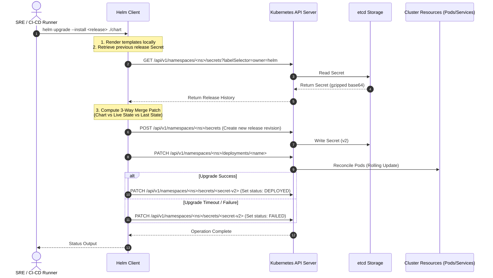

# Helm - Part 3 - Technical Study Guide & Notes

# Helm Production Systems Study Guide (Part 3/3)

---

## 1. Part Introduction and Scope

This guide is the final part of our Helm series. It focuses on the operational realities of running Helm in enterprise production environments. It is designed for Site Reliability Engineers (SREs), Platform Engineers, and DevOps Architects managing large Kubernetes clusters.

### Scope of This Guide
* **Production SRE & Diagnostics:** Deep-dive into Helm state storage mechanics, the Helm state machine, and programmatic recovery of corrupted releases.
* **Troubleshooting & Root Cause Analysis (RCA):** Step-by-step diagnostic workflows for complex failure modes, including 3-way merge conflicts, hook timeouts, and etcd storage exhaustion.
* **Observability & Alerting:** Production-grade Prometheus alerting rules, log-parsing strategies, and monitoring patterns for Helm-deployed workloads.
* **Incident Runbooks:** Executable, copy-paste-ready scripts and configurations to resolve production outages caused by deployment failures.
* **Advanced Architecture:** Detailed analysis of Helm's 3-way merge patch engine and integration patterns with GitOps controllers (ArgoCD, Flux).

---

## 2. Operational Impact of Helm Failures in High-Availability Systems

In high-availability (HA) systems, the deployment toolchain is a critical vector for outages. Helm is not just a client-side templating tool; it is the orchestrator of state transitions within your Kubernetes clusters. When Helm operations fail, they can cause cascading failures across your infrastructure.

```
+-------------------------------------------------------------------------+
|                           Operational Risks                             |
+-------------------------------------------------------------------------+
|                                                                         |
|  1. Release Lockouts (Stuck in pending-upgrade)                          |
|     Prevents emergency hotfixes from being applied.                     |
|                                                                         |
|  2. Out-of-Sync State (Drift)                                           |
|     Discrepancies between Helm's storage and the live cluster state.    |
|                                                                         |
|  3. etcd Performance Degradation                                        |
|     Bloated release histories cause storage pressure and latency spikes.|
|                                                                         |
|  4. Hook Failures & Resource Leaks                                       |
|     Orphaned resources and blocked rollbacks.                           |
|                                                                         |
+-------------------------------------------------------------------------+
```

### The SRE Impact Metrics
* **Mean Time to Detect (MTTD):** Without structured metadata and custom exporters, Helm release failures often go unnoticed until standard application-level alerts fire (e.g., HTTP 5xx spikes).
* **Mean Time to Resolution (MTTR):** Manual recovery from a stuck Helm release typically requires decoding, patching, and recoding Kubernetes Secrets. This process can take 15 to 30 minutes under stress. Automated runbooks can reduce this time to seconds.
* **Blast Radius:** A single misconfigured Helm hook with an indefinite timeout can block the entire deployment pipeline, preventing unrelated microservices from deploying critical security patches.

---

## 3. Real-World Enterprise Use Cases

### Use Case 1: Automated Self-Healing of Stuck Helm Releases in a GitOps Pipeline
* **Context:** An enterprise financial platform deploys hundreds of microservices using an automated GitOps pipeline. 
* **The Problem:** Network instability or transient Kubernetes API timeouts during a deployment leave Helm releases stuck in a `pending-upgrade` or `pending-install` state. Subsequent automated pipeline runs fail immediately with the error: `another operation (install/upgrade/rollback) is in progress`.
* **The Solution:** A Kubernetes-native daemon/cron utility that monitors Helm release secrets. It detects releases stuck in a transitional state for more than 15 minutes, automatically marks them as `failed` to release the lock, and triggers a safe, automated rollback.

### Use Case 2: Multi-Tenant Helm Release Isolation and RBAC Hardening at Scale
* **Context:** A shared SaaS platform runs multiple tenants on a single, large EKS cluster.
* **The Problem:** Tenant A must not be able to view, modify, or delete the deployment state of Tenant B. By default, if a tenant has access to read Secrets in their namespace, they can read and potentially tamper with Helm release records, or use Helm to escalate privileges.
* **The Solution:** A strictly partitioned RBAC model where the Helm client's service account is bound to namespace-scoped roles. Helm release storage is restricted using Kubernetes KMS envelope encryption, and network policies isolate tenant-specific Helm operations.

---

## 4. Comprehensive Architecture Explanation

Helm v3 is a client-only architecture. It does not use an in-cluster server component like Tiller (Helm v2). Instead, it interacts directly with the Kubernetes API server using the user's local `Kubeconfig` credentials.

### Component Interaction Diagram



### The Helm Release State Machine
Helm tracks the lifecycle of a release using a state machine stored within Kubernetes Secrets (or ConfigMaps) in the namespace of the release. The key states include:

```
                  +------------------+
                  |     UNKNOWN      |
                  +------------------+
                            |
                            v
                  +------------------+
                  | PENDING-INSTALL  |
                  +------------------+
                     /            \
                    /              \
                   v                v
        +------------+            +------------+
        |  DEPLOYED  |            |   FAILED   |
        +------------+            +------------+
          /        \                /        \
         /          \              /          \
        v            v            v            v
+-----------------+ +------------------+ +-----------------+
| PENDING-UPGRADE | | PENDING-ROLLBACK | |  UNINSTALLING   |
+-----------------+ +------------------+ +-----------------+
     /         \         /         \              |
    v           v       v           v             v
+------------+ +------------+ +------------+ +-------------+
|  DEPLOYED  | |   FAILED   | |  SUPERSEDED| | UNINSTALLED |
+------------+ +------------+ +------------+ +-------------+
```

* **`unknown`:** The release state is indeterminate.
* **`deployed`:** The release was successfully executed, and all resources passed validation/readiness checks (if `--wait` was used).
* **`failed`:** The release execution failed (e.g., hook failure, timeout, or validation error).
* **`superseded`:** A newer revision has been successfully deployed. This release record is now historical.
* **`pending-install` / `pending-upgrade` / `pending-rollback`:** Transitional states. **Crucial SRE Note:** If the Helm process is killed or timed out during these states, the release remains locked in this state, blocking subsequent operations.

---

## 5. Types, Classifications, and Components of Helm Failure Modes

Understanding how Helm fails requires categorizing the failure vectors. 

### 1. Storage Driver Failures
Helm stores its release history as Kubernetes Secrets (default) or ConfigMaps in the target namespace.
* **Size Limit Exhaustion:** Kubernetes Secrets have a strict **1MB** storage limit. If your chart contains large embedded files (e.g., inline certificates, large configuration files, or schemas) or if your release history is very long, the gzipped, base64-encoded release secret can exceed 1MB. This causes the error: `etcdserver: request limit exceeded`.
* **etcd Write Saturation:** In clusters with high deployment frequency (e.g., continuous deployment of hundreds of microservices), keeping a history limit of `0` (unlimited) or a high default like `256` causes massive etcd database bloat, leading to slow API response times.

### 2. Lifecycle Hook Failures
Helm hooks allow actions at specific points in a release's lifecycle (e.g., `pre-install`, `post-upgrade`, `pre-delete`).
* **Hanging Hooks:** If a hook (typically run as a Kubernetes Job) does not exit, Helm will hang indefinitely or until the `--timeout` value is reached.
* **Orphaned Jobs:** By default, failed hook jobs are not automatically cleaned up. This can prevent subsequent upgrades if the job name is static.

### 3. Three-Way Merge Patch Failures
Helm v3 uses a 3-way merge patch strategy. It compares:
1. The **last proposed state** (from the previous Helm release secret).
2. The **live state** of the cluster (which may have been mutated by controllers, mutating webhooks, or manual `kubectl edit` commands).
3. The **newly proposed state** (from the current chart templates).

* **Conflict Scenario:** If an external controller (like an Istio sidecar injector or an enterprise mutation webhook) modifies a resource in a way that conflicts with the new chart definition, the 3-way merge patch engine can fail with schema validation errors.

### 4. Custom Resource Definition (CRD) Upgrade Collisions
Helm handles CRDs differently than standard resources.
* CRDs placed in the `crds/` directory of a chart are only installed during the initial `helm install`.
* Helm **never** upgrades or deletes CRDs in the `crds/` directory during a `helm upgrade` or `helm uninstall` to prevent accidental loss of custom resource data.
* **Failure Mode:** If a chart upgrade requires a new version of a CRD, the upgrade will fail or the application pods will crash because the live CRD is out of date.

---

## 6. Step-by-Step Production Implementation Guide

This section provides a guide to implementing an automated recovery system for stuck Helm releases.

### Step 1: Deploying the Helm Release Recovery Daemon
We will configure a Kubernetes CronJob that scans for Helm release secrets stuck in `pending-upgrade` or `pending-install` for more than 10 minutes, decodes them, patches their state to `failed` to release the lock, and alerts the SRE team.

#### Create the ServiceAccount, Role, and RoleBinding
Save the following as `helm-recovery-rbac.yaml`:

```yaml
apiVersion: v1
kind: ServiceAccount
metadata:
  name: helm-recovery-sa
  namespace: platform-system
---
apiVersion: rbac.authorization.k8s.io/v1
kind: ClusterRole
metadata:
  name: helm-recovery-role
rules:
  - apiGroups: [""]
    resources: ["secrets"]
    verbs: ["get", "list", "watch", "update", "patch"]
---
apiVersion: rbac.authorization.k8s.io/v1
kind: ClusterRoleBinding
metadata:
  name: helm-recovery-binding
subjects:
  - kind: ServiceAccount
    name: helm-recovery-sa
    namespace: platform-system
roleRef:
  kind: ClusterRole
  name: helm-recovery-role
  apiGroup: rbac.authorization.k8s.io
```

Apply the RBAC configuration:
```bash
kubectl apply -f helm-recovery-rbac.yaml
```

---

## 7. Standard CLI Commands with Deep Technical Explanations

Here are the essential diagnostic and recovery commands for Helm operations.

### 1. Inspecting Release History
```bash
helm history <release-name> --namespace <namespace> --max 10
```
* **Technical Explanation:** Queries the Kubernetes API for Secrets labeled with `owner=helm` and `name=<release-name>`. It decodes the release metadata, sorting them by revision number. Use this to identify the last known stable revision and determine if a release is stuck in a transitional state.

### 2. Detailed Status Inspection
```bash
helm status <release-name> --namespace <namespace> --show-desc
```
* **Technical Explanation:** Retrieves the current active release record and queries the Kubernetes API server for the status of all resources managed by this release. The `--show-desc` flag forces Helm to output the description field from the release secret, which often contains the exact error message that caused a deployment to fail.

### 3. Safe Rollback with Guardrails
```bash
helm rollback <release-name> <revision> \
  --namespace <namespace> \
  --force \
  --recreate-pods \
  --cleanup-on-fail \
  --timeout 5m0s \
  --wait
```
* **Deep Flag Breakdown:**
  * `--force`: Forces resource updates through a delete-and-recreate cycle if the standard 3-way merge patch fails (e.g., due to immutable field updates like changing a Deployment's selector).
  * `--recreate-pods`: Restarts all pods managed by the resources being upgraded. Use this only when you must ensure that application state is fully reinitialized.
  * `--cleanup-on-fail`: If the rollback itself fails, Helm will automatically delete any resources created during this rollback attempt. This prevents orphaned resources from cluttering the namespace.
  * `--timeout 5m0s`: Sets the threshold for resources to reach a ready state before marking the operation as failed.
  * `--wait`: Blocks the CLI return until all Pods, PVCs, and Services are fully ready, instead of returning immediately after sending the manifests to the API server.

### 4. Atomic Upgrades
```bash
helm upgrade <release-name> <chart-path> \
  --install \
  --atomic \
  --cleanup-on-fail \
  --wait \
  --timeout 10m
```
* **Technical Explanation:** The `--atomic` flag combined with `--wait` guarantees that if any resource fails to become ready within 10 minutes, Helm will automatically roll back the entire transaction to the previous stable release. This is critical for continuous delivery pipelines to prevent broken code from remaining in the cluster.

---

## 8. Production Configuration Examples

### Production-Grade PrometheusRule for Helm Failures
This configuration uses Prometheus Operator's `PrometheusRule` custom resource to alert SRE teams when a Helm release remains in a failed or pending state.

```yaml
apiVersion: monitoring.coreos.com/v1
kind: PrometheusRule
metadata:
  name: helm-release-alerts
  namespace: monitoring
  labels:
    role: alert-rules
spec:
  groups:
    - name: helm.rules
      rules:
        - alert: HelmReleaseFailed
          expr: kube_secret_labels{label_owner="helm"} * on(secret, namespace) group_right() kube_secret_annotations{annotation_status="failed"} == 1
          for: 5m
          labels:
            severity: critical
            tier: platform
          annotations:
            summary: "Helm release {{ $labels.secret }} has failed"
            description: "The Helm release {{ $labels.secret }} in namespace {{ $labels.namespace }} is in a FAILED state. Immediate manual intervention or rollback is required."

        - alert: HelmReleaseStuckPending
          expr: kube_secret_labels{label_owner="helm"} * on(secret, namespace) group_right() (kube_secret_annotations{annotation_status="pending-upgrade"} == 1 or kube_secret_annotations{annotation_status="pending-install"} == 1)
          for: 15m
          labels:
            severity: warning
            tier: platform
          annotations:
            summary: "Helm release {{ $labels.secret }} is stuck in pending state"
            description: "The Helm release {{ $labels.secret }} in namespace {{ $labels.namespace }} has been in a pending state for more than 15 minutes. This blocks subsequent deployments."
```

### Stuck Helm Release Recovery CronJob
This CronJob runs every 5 minutes. It searches for secrets representing Helm releases stuck in `pending-upgrade` or `pending-install` for over 10 minutes. It decodes the release data, updates the status to `failed` to release the deployment lock, and saves it back.

```yaml
apiVersion: batch/v1
kind: CronJob
metadata:
  name: helm-lock-remover
  namespace: platform-system
spec:
  schedule: "*/5 * * * *"
  concurrencyPolicy: Forbid
  successfulJobsHistoryLimit: 1
  failedJobsHistoryLimit: 3
  jobTemplate:
    spec:
      template:
        spec:
          serviceAccountName: helm-recovery-sa
          restartPolicy: OnFailure
          containers:
            - name: lock-remover
              image: bitnami/kubectl:1.28
              command:
                - /bin/bash
                - -c
                - |
                  set -euo pipefail
                  echo "Starting scanning for stuck Helm releases..."
                  
                  # Get all Helm release secrets across all namespaces
                  secrets=$(kubectl get secrets --all-namespaces -l owner=helm -o json)
                  
                  # Iterate through each secret using jq
                  echo "$secrets" | jq -c '.items[]' | while read -r secret; do
                    name=$(echo "$secret" | jq -r '.metadata.name')
                    ns=$(echo "$secret" | jq -r '.metadata.namespace')
                    status=$(echo "$secret" | jq -r '.metadata.labels.status // empty')
                    
                    # If status is pending-upgrade or pending-install
                    if [[ "$status" == "pending-upgrade" || "$status" == "pending-install" ]]; then
                      last_modified=$(echo "$secret" | jq -r '.metadata.creationTimestamp')
                      last_epoch=$(date -d "$last_modified" +%s)
                      now_epoch=$(date +%s)
                      diff_min=$(( (now_epoch - last_epoch) / 60 ))
                      
                      if [ "$diff_min" -gt 10 ]; then
                        echo "Found stuck release: $name in namespace $ns (Age: ${diff_min}m, Status: $status)"
                        
                        # Fetch the full secret payload
                        secret_payload=$(kubectl get secret "$name" -n "$ns" -o json)
                        
                        # Extract and decode the base64 gzipped release data
                        release_data_b64=$(echo "$secret_payload" | jq -r '.data.release')
                        
                        # Decode, gunzip, patch status to 'failed', gzip, base64 encode
                        patched_release_data=$(echo "$release_data_b64" | base64 -d | base64 -d | gunzip -c | \
                          jq '.info.status = "failed" | .info.description = "Deployment timed out. Unlocked by automated SRE daemon."' | \
                          gzip -c | base64 | base64 | tr -d '\n')
                        
                        # Patch the secret back in-cluster
                        kubectl patch secret "$name" -n "$ns" --type='json' -p="[
                          {\"op\": \"replace\", \"path\": \"/data/release\", \"value\": \"$patched_release_data\"},
                          {\"op\": \"replace\", \"path\": \"/metadata/labels/status\", \"value\": \"failed\"}
                        ]"
                        
                        echo "Successfully patched release $name to 'failed' state. Lock released."
                      fi
                    fi
                  done
```

---

## 9. Security Considerations & Hardening Best Practices

### 1. Securing Release Storage (Secrets)
By default, Helm release data is stored as plain base64-encoded text within Kubernetes Secrets. To secure these records:
* **KMS Envelope Encryption:** Enable KMS envelope encryption in your Kubernetes control plane (e.g., AWS KMS, Azure Key Vault, Google Cloud KMS) specifically for the `secrets` resource type. This ensures that even if etcd is compromised, Helm release configurations (which contain environment variables, API keys, and certificates) remain encrypted at rest.
* **RBAC Restrictions:** Implement strict RBAC policies. Prevent general application developers from reading secrets with the label `owner=helm`.
  ```yaml
  # Example Role to restrict access to Helm Secrets
  apiVersion: rbac.authorization.k8s.io/v1
  kind: Role
  metadata:
    name: deny-helm-secrets-reader
    namespace: production
  rules:
    - apiGroups: [""]
      resources: ["secrets"]
      verbs: ["get", "list"]
      # Use a validating webhook or OPA Gatekeeper to reject requests for labels matching owner=helm
  ```

### 2. Chart Provenance and Verification
In enterprise environments, executing unverified third-party Helm charts is a significant security risk.
* **GnuPG Digital Signatures:** Ensure that your internal Helm repository requires all charts to be signed using GPG keys.
* **Enforce Verification in CI/CD:**
  ```bash
  helm verify <chart-path>.tgz --keyring ~/.gnupg/pubring.kbx
  ```
  This command validates the chart's cryptographic signature against a trusted public keyring. If the signature is invalid or missing, the deployment pipeline aborts immediately.

### 3. Execution Privilege Hardening
Do not run Helm pipelines using a service account with `cluster-admin` privileges. Instead:
* Create a dedicated ServiceAccount for each deployment pipeline.
* Bind that ServiceAccount to a Role scoped specifically to the target namespace.
* If cluster-wide resources (like CRDs, ClusterRoles, or Namespaces) must be managed, split the deployment into two phases: a privileged bootstrap phase (managed by platform administrators) and an unprivileged application phase (managed by the CI/CD pipeline).

---

## 10. Observability & Monitoring Considerations

### Key Prometheus Metrics to Watch
Since Helm is a client-side CLI, it does not expose a Prometheus metrics endpoint directly. To monitor Helm releases, you must run an exporter such as the `helm-exporter` or configure `kube-state-metrics` to expose Secret metadata.

| Metric Name | Type | Description | Target Value | SRE Action on Threshold |
| :--- | :--- | :--- | :--- | :--- |
| `helm_release_status` | Gauge | Current status of a Helm release (represented as an enum mapped to integers: Deployed=1, Failed=2, Pending=3). | `1` (Deployed) | If status is `2`, trigger immediate rollback. If `3` for >10m, trigger lock-remover. |
| `helm_release_revision` | Counter | The revision number of the current release. | Monotonically increasing | Sudden jumps or rapid increments indicate deployment loops or automated rollback thrashing. |
| `kube_secret_labels` | Gauge | Exposes labels of Kubernetes Secrets (filtered by `label_owner="helm"`). | Constant | Monitor to track the total inventory of Helm-managed applications in the cluster. |

### Log Aggregation and Parsing
Configure your log aggregation system (Elasticsearch, Datadog, or Grafana Loki) to parse the output of your CI/CD runners executing Helm commands. Set up alerts for these specific log patterns:

1. **`Error: UPGRADE FAILED: another operation (install/upgrade/rollback) is in progress`**
   * **Root Cause:** A previous Helm invocation was interrupted or timed out, leaving the release state locked in a pending state.
2. **`Error: rendered manifests contain a resource that already exists`**
   * **Root Cause:** Resource ownership conflict. A resource defined in the chart already exists in the cluster and is either unmanaged or managed by a different Helm release.
3. **`Error: etcdserver: request limit exceeded`**
   * **Root Cause:** The rendered manifest or the historical release records exceeded the 1MB limit for a Kubernetes Secret.

---

## 11. Common Troubleshooting Scenarios with Root Cause Analysis (RCA)

### Scenario A: Release Stuck in `pending-upgrade` State
* **Symptom:** Subsequent deployments fail with: `Error: UPGRADE FAILED: another operation (install/upgrade/rollback) is in progress`.
* **RCA:** A previous `helm upgrade` run was forcefully terminated (e.g., CI/CD runner timed out, spot instance reclamation, or manual cancellation). The release record in Kubernetes remains in the `pending-upgrade` state, serving as an active distributed lock.
* **Resolution Steps:**
  1. Identify the stuck release secret:
     ```bash
     kubectl get secret -n <namespace> -l owner=helm,status=pending-upgrade
     ```
  2. Run the manual patch command to change the status to `failed`:
     ```bash
     kubectl patch secret <stuck-secret-name> -n <namespace> \
       --type='json' \
       -p='[{"op": "replace", "path": "/metadata/labels/status", "value": "failed"}]'
     ```
  3. Re-run the deployment pipeline or execute a manual rollback:
     ```bash
     helm rollback <release-name> <last-known-good-revision> -n <namespace>
     ```

### Scenario B: "Request entity too large" (etcd 1MB Secret Limit)
* **Symptom:** Helm upgrade fails with: `Error: create: failed to create: Secret "sh.helm.release.v1.my-app.v42" is invalid: data: Too long: must have at most 1048576 bytes`.
* **RCA:** The chart contains massive static assets (e.g., embedded binary configuration files, local database files in ConfigMaps, or large graphics files) or has a massive release history. The compressed release manifest payload exceeds the 1MB limit for Kubernetes Secrets.
* **Resolution Steps:**
  1. Move large static configuration files out of the Helm chart and host them in an external storage system (e.g., AWS S3) or use a Kubernetes `PersistentVolume` to mount them.
  2. Reduce the release history limit immediately:
     ```bash
     helm upgrade <release-name> <chart> --history-max 10 -n <namespace>
     ```
  3. Clean up old historical secrets manually to reclaim etcd space:
     ```bash
     kubectl get secrets -n <namespace> -l owner=helm,name=<release-name> -o json | \
       jq -r '.items[] | select(.metadata.labels.version | tonumber < <current-version-minus-10>) | .metadata.name' | \
       xargs -I {} kubectl delete secret {} -n <namespace>
     ```

### Scenario C: Resource Ownership Conflict
* **Symptom:** `Error: rendered manifests contain a resource that already exists and is managed by another release`.
* **RCA:** Helm's 3-way merge engine discovered that a resource defined in the current chart already exists in the target namespace, but lacks the appropriate metadata annotations and labels designating it as managed by this specific Helm release.
* **Resolution Steps:**
  If the resource should indeed be managed by this Helm release, you must manually annotate and label the existing resource to match Helm's ownership expectations:
  ```bash
  # Annotate the resource
  kubectl annotate <resource-type> <resource-name> -n <namespace> \
    meta.helm.sh/release-name="<release-name>" \
    meta.helm.sh/release-namespace="<namespace>" --overwrite

  # Label the resource
  kubectl label <resource-type> <resource-name> -n <namespace> \
    app.kubernetes.io/managed-by="Helm" --overwrite
  ```
  Once annotated and labeled, re-run `helm upgrade`.

---

## 12. Common Mistakes and How to Avoid Them in Production

### Mistake 1: Relying on `helm upgrade --force` as a Default Rollback Strategy
* **Why it is dangerous:** The `--force` flag does not perform a safe, rolling update. Instead, it deletes existing resources and recreates them. If applied to stateful workloads or services without redundant replicas, it will cause immediate downtime and potential data corruption if PersistentVolumes are unmounted or deleted.
* **How to avoid it:** Always design applications to support safe rolling updates. Use standard `helm rollback` or `helm upgrade` without `--force`. Only reserve `--force` for emergency operations on stateless workloads where resource schema changes are incompatible.

### Mistake 2: Missing or Infinite Helm Hook Timeouts
* **Why it is dangerous:** If a `pre-upgrade` hook job fails to complete (e.g., a database migration job hangs waiting for a lock), and no timeout is specified, the Helm process will run indefinitely. This blocks CI/CD runners, consumes resources, and holds the deployment lock.
* **How to avoid it:** Always define a strict timeout in your hook templates:
  ```yaml
  apiVersion: batch/v1
  kind: Job
  metadata:
    name: "{{ .Release.Name }}-db-migrate"
    annotations:
      "helm.sh/hook": pre-upgrade
      "helm.sh/hook-delete-policy": hook-succeeded,before-hook-creation
      "helm.sh/activeDeadlineSeconds": "300" # Enforces absolute timeout at the Kubernetes level
  ```

### Mistake 3: Storing Dynamic Secrets in Helm Values
* **Why it is dangerous:** Passing raw database passwords, API tokens, or private keys via `--set` or cleartext `values.yaml` files embeds these secrets permanently in the Helm release history. Anyone with read access to the Helm release secrets can easily decode and extract these sensitive values.
* **How to avoid it:** Use external secrets management solutions such as HashiCorp Vault, AWS Secrets Manager, or Sealed Secrets. Reference these secrets in your Helm templates using external secret operators (e.g., ExternalSecrets or Secrets Store CSI Driver). Do not pass raw secret values through Helm.

---

## 13. Enterprise-Level Recommendations

### Performance Tuning and etcd Protection
In large-scale enterprise environments with high deployment velocity, configuring Helm's history limit is critical to maintaining etcd performance.

```
+--------------------------------------------------------------------------+
|                      etcd Protection Best Practice                       |
+--------------------------------------------------------------------------+
|                                                                          |
|  Default History Limit: 256 or Unlimited (0)                             |
|  * Leads to etcd database bloat, slow API responses, disk space pressure |
|                                                                          |
|  Enterprise Recommended Limit: 5 to 10                                  |
|  * Keeps historical records small while allowing sufficient rollback     |
|    capability. Set via:                                                  |
|    helm upgrade --history-max 10                                         |
|                                                                          |
+--------------------------------------------------------------------------+
```

### Rate Limiting and Client-Side Concurrency
When running parallelized CI/CD pipelines (e.g., hundreds of microservices building and deploying concurrently), Helm can overwhelm the Kubernetes API server control plane, leading to rate-limiting (`HTTP 429 Too Many Requests`).
* **Recommendation:** Set the client-side QPS (Queries Per Second) and burst limits in your runner's environment variables or configuration if supported by your CI/CD integration. 
* Use the `--kube-api-qps` and `--kube-api-burst` flags if executing deployments via custom scripts:
  ```bash
  helm upgrade <release> <chart> --kube-api-qps 100 --kube-api-burst 200
  ```

---

## 14. Advanced Concepts: The 3-Way Merge Patch Engine

Helm v3's deployment engine relies on a 3-way merge patch. This algorithm is designed to preserve changes made to cluster resources by external controllers (such as Horizontal Pod Autoscalers or service mesh sidecar injectors) during subsequent upgrades.

### How the 3-Way Merge Algorithm Operates

```
                                +---------------------------+
                                |  1. Old Release Manifest  |
                                |  (From Helm Secret Store) |
                                +---------------------------+
                                              |
                                              |
                                              v
+---------------------------+   +---------------------------+   +---------------------------+
|   3. Proposed Manifest    |<--|   Compute Differences     |-->|     2. Live State         |
|   (New Chart Templates)   |   |   & Generate JSON Patch   |   |   (In-Cluster Resource)   |
+---------------------------+   +---------------------------+   +---------------------------+
              |                                                               |
              +-------------------------------+-------------------------------+
                                              |
                                              v
                                +---------------------------+
                                |    4. Final Merged State  |
                                |    Applied to Cluster     |
                                +---------------------------+
```

1. **The Old State (1):** Helm retrieves the manifest of the last deployed revision from the storage backend (Kubernetes Secret).
2. **The Live State (2):** Helm queries the Kubernetes API server to get the current runtime configuration of the resource in the cluster. This resource may contain mutations (e.g., `replicas` scaled to `10` by an HPA, or injected sidecar containers added by Istio).
3. **The Proposed State (3):** Helm renders the templates of the new chart version.
4. **The Merge (4):** Helm computes the difference between the Old State and the Proposed State. It then applies this delta to the Live State, generating a final JSON patch. This ensures that:
   * If a field was modified in the new chart (e.g., image tag updated), it is applied.
   * If a field was modified dynamically in the cluster but was *not* changed in the new chart (e.g., HPA scaling replicas), the dynamic change is preserved.
   * If a resource was removed from the new chart, it is deleted from the cluster.

---

## 15. Integration with Other DevOps Tools

### GitOps Integration: ArgoCD vs. Flux
In modern enterprise architectures, Helm is often deployed via GitOps controllers rather than direct client-side CLI execution.

```
+-------------------------------------------------------------------------+
|                          GitOps Integration                             |
+-------------------------------------------------------------------------+
|                                                                         |
|  +-------------------+       Sync        +---------------------------+  |
|  |   Git Repository  | ----------------> |      GitOps Controller    |  |
|  |  (Helm / Kustomize|                   |    (ArgoCD / Flux CD)     |  |
|  +-------------------+                   +---------------------------+  |
|                                                        |                |
|                                                        | Reconciles     |
|                                                        v                |
|                                          +---------------------------+  |
|                                          |    Kubernetes Cluster     |  |
|                                          |   (Renders & Applies)     |  |
|                                          +---------------------------+  |
+-------------------------------------------------------------------------+
```

#### ArgoCD
ArgoCD natively supports rendering Helm charts. It bypasses the Helm storage backend entirely.
* **How it works:** ArgoCD fetches the Helm chart, renders the templates locally using `helm template`, and then applies the raw manifests directly to the cluster using its own reconciliation loop.
* **Impact:** You will not see any Helm release history when running `helm list` on the cluster. ArgoCD acts as the source of truth and state manager.

#### Flux (Helm Controller)
Flux uses a dedicated `HelmController` that executes Helm operations directly within the cluster.
* **How it works:** Flux uses a `HelmRelease` custom resource. The controller runs the Helm engine library code to perform standard `helm install`, `upgrade`, and `rollback` operations.
* **Impact:** Flux maintains standard Helm release history secrets. Running `helm list` in the cluster will show the releases managed by Flux.

---

## 16. Comparison with Competing Tools

The table below compares Helm with other popular Kubernetes deployment and configuration management tools.

| Feature / Dimension | Helm (v3) | Kustomize | Pulumi | Kapitan |
| :--- | :--- | :--- | :--- | :--- |
| **Paradigm** | Package Manager & Templating | Overlay-based Customization | Infrastructure as Code (IaC) | Declarative Data-driven Templating |
| **State Management** | In-cluster Secrets / ConfigMaps | Stateless (relies on Git/K8s) | Client-side or SaaS Backend | Stateless |
| **Templating Engine** | Go Templates (textual substitution) | No templates (structured YAML merging) | General programming languages (Go, TS, Python) | Jsonnet / Jinja2 |
| **Drift Detection** | Client-side only (during upgrade) | None native (requires external GitOps) | Native (via state file comparison) | None native |
| **Learning Curve** | Moderate | Low | High (requires programming skills) | High |
| **Execution Speed** | Fast (client-side rendering) | Extremely Fast (native to `kubectl`) | Slow (requires full state initialization) | Fast |
| **Target Use Case** | Distributing reusable third-party apps | Environment-specific overrides (Dev/Stg/Prod) | Multi-cloud resource orchestration | Large-scale enterprise multi-cluster configurations |

---

## 17. Visual Cheat Sheet

### Helm SRE Diagnostics & Recovery Cheat Sheet

| Task | Command / Action | Key Flags / Parameters | Why Use It? |
| :--- | :--- | :--- | :--- |
| **List Releases** | `helm list -A` | `--all-namespaces` | Find all releases across the entire cluster. |
| **Check History** | `helm history <name> -n <ns>` | `--max 20` | Check if a release is stuck in a transition state. |
| **Inspect Failures** | `helm status <name> -n <ns>` | `--show-desc` | Read the exact error message from the release metadata. |
| **Unlock Release** | `kubectl patch secret <secret-name> ...` | `-p '{"metadata":{"labels":{"status":"failed"}}}'` | Manually break a deployment lock. |
| **Safe Rollback** | `helm rollback <name> <rev> -n <ns>` | `--wait --cleanup-on-fail --timeout 5m` | Safely revert to a known stable version with guardrails. |
| **Atomic Upgrade** | `helm upgrade <name> <chart> -n <ns>` | `--atomic --wait --history-max 10` | Deploy with automatic rollback if the upgrade fails. |

---

## 18. Final Learning Summary

Throughout this three-part guide, we have progressed from Helm fundamentals to advanced, production-grade SRE operations.

```
+--------------------------------------------------------------------------+
|                        Helm Mastery Journey                              |
+--------------------------------------------------------------------------+
|                                                                          |
|  Part 1: Core Fundamentals & Template Architecture                       |
|  * Values, scope, control flow, functions, and named templates.          |
|                                                                          |
|  Part 2: Advanced Chart Design & Lifecycle Management                    |
|  * Dependency resolution, lifecycle hooks, and testing.                  |
|                                                                          |
|  Part 3: Production SRE, Diagnostics, & GitOps                           |
|  * State recovery, 3-way merge, Prometheus alerting, and runbooks.       |
|                                                                          |
+--------------------------------------------------------------------------+
```

### Key Takeaways for the Enterprise Architect
1. **Treat Helm as a Transactional Engine:** Always design your charts and deployment pipelines to be atomic. Use `--atomic`, `--wait`, and `--cleanup-on-fail` to guarantee that your clusters do not end up in an inconsistent state.
2. **Protect your etcd Database:** Never leave `--history-max` unlimited in production. Set a strict limit of 5 to 10 historical revisions to prevent etcd performance degradation.
3. **Automate Recovery:** Do not rely on manual intervention to resolve stuck releases. Implement automated monitoring and self-healing tools (like the CronJob outlined in Section 8) to detect and unlock stuck releases.
4. **Understand the 3-Way Merge:** Remember that Helm v3 respects cluster-side mutations. Ensure that your chart definitions do not conflict with changes made by mutating admission controllers or Horizontal Pod Autoscalers.

### Q41. Diagnosing Helm Release State Mismatches (e.g., `another operation (install/upgrade/rollback) is in progress` or stuck in `PENDING_UPGRADE`)

**Detailed Answer**:
Helm v3 maintains release state using Kubernetes Secrets (or ConfigMaps) in the namespace of the release. Each release version corresponds to a Secret named `sh.helm.release.v1.<release_name>.v<revision_number>`. The secret contains a base64-encoded, gzipped JSON payload detailing the release state. 

When an operation like `helm upgrade` starts, Helm creates a new release secret with the state set to `PENDING_UPGRADE` or `PENDING_INSTALL`. If the Helm client crashes, loses connection to the Kubernetes API server, or gets terminated by a CI/CD timeout during this window, the state remains locked in this pending status. Any subsequent Helm command will fail with the error: `Error: UPGRADE FAILED: another operation (install/upgrade/rollback) is in progress`.

To diagnose and resolve this state mismatch as an SRE:
1. **Identify the Stuck Revision**: List the secrets matching the release name to find the latest revision and its status.
2. **Decode the Release Payload**: (Optional but recommended for RCA) Extract the payload to verify what resources were being deployed when the failure occurred.
3. **Manual State Patching vs. Deletion**: 
   * *Option A (Safer)*: Patch the stuck secret's metadata and payload to transition its state to `FAILED` or `SUPERSEDED`, allowing Helm to attempt a new upgrade.
   * *Option B (Fastest)*: Delete the pending secret revision. Helm will treat the previous revision as the current active release.
4. **Preventative Controls**: Implement `--timeout` and `--atomic` or `--cleanup-on-fail` flags in your deployment pipelines to ensure automated cleanup of failed or hanging states.

**Production Scenario / Practical Example**:
An emergency hotfix deployment via GitOps was aborted mid-execution, leaving the release `payment-gateway` stuck in `PENDING_UPGRADE`.

**Step 1: Locate the stuck release secret**
```bash
kubectl get secrets -n payments -l "owner=helm,name=payment-gateway"
```
Output:
```text
NAME                                     TYPE                 DATA   AGE
sh.helm.release.v1.payment-gateway.v14   helm.sh/release.v1   1      10d
sh.helm.release.v1.payment-gateway.v15   helm.sh/release.v1   1      2h
sh.helm.release.v1.payment-gateway.v16   helm.sh/release.v1   1      15m  <-- Stuck revision
```

**Step 2: Inspect the state of the stuck release**
```bash
# Decode the base64, decompress the gzip, and parse the JSON state
kubectl get secret sh.helm.release.v1.payment-gateway.v16 -n payments -o jsonpath='{.data.release}' \
  | base64 -d | base64 -d | gunzip | jq '.info.status'
```
Output: `"pending-upgrade"`

**Step 3: Safe Mitigation (Patching the state to FAILED)**
Instead of deleting the secret (which loses audit history), patch the release payload. We can programmatically decode, modify the status to `failed`, re-compress, re-encode, and patch the secret. Alternatively, for a rapid recovery, delete the stuck revision secret:
```bash
# Backup the secret first
kubectl get secret sh.helm.release.v1.payment-gateway.v16 -n payments -o yaml > payment-gateway.v16.bak.yaml

# Delete the pending secret to unlock the release
kubectl delete secret sh.helm.release.v1.payment-gateway.v16 -n payments
```
Helm now considers revision `v15` as the active release. Run the upgrade again with proper timeouts and safety flags:
```bash
helm upgrade payment-gateway ./charts/payment-gateway \
  --namespace payments \
  --reuse-values \
  --timeout 5m0s \
  --atomic
```

---

### Q42. Designing a High-Availability Helm-based GitOps Pipeline with Prometheus Alerting for Release Failures

**Detailed Answer**:
In a high-availability GitOps pipeline (e.g., using Argo CD or Flux CD with Helm Controller), monitoring the health of Helm releases cannot rely on ad-hoc CLI commands. SREs must implement automated alerting using metrics exported by the GitOps controllers or `kube-state-metrics` combined with custom Prometheus alerting rules (`PrometheusRule` CRDs).

When utilizing the Flux Helm Controller, the controller exports Prometheus metrics such as `gothemis_active_resources` and `helm_controller_reconcile_condition`. If using Argo CD, metrics like `argocd_app_info` and `argocd_app_reconcile_count` are available. If you are running standard Helm via CI/CD pipelines (e.g., GitLab CI, GitHub Actions), you must leverage `kube-state-metrics` to monitor the underlying Kubernetes Job/Pod states of Helm lifecycle hooks and the status of Helm release Secrets.

An enterprise-grade alerting architecture for Helm releases should monitor:
1. **Reconciliation Failures**: Helm releases failing to reconcile over a specific threshold.
2. **Release Drift & Suspended States**: Helm releases that have been suspended or have drifted from the Git source of truth.
3. **Hook Failures**: Helm lifecycle hook jobs that have entered a failed phase.

**Production Scenario / Practical Example**:
Below is a production-ready `PrometheusRule` configuration designed to alert on Flux Helm Controller reconciliation failures and failed Helm lifecycle hook jobs.

```yaml
apiVersion: monitoring.coreos.com/v1
kind: PrometheusRule
metadata:
  name: helm-release-alerts
  namespace: monitoring
  labels:
    role: alert-rules
    prometheus: k8s
spec:
  groups:
  - name: helm.rules
    rules:
    - alert: HelmReleaseReconciliationFailed
      expr: |
        gothemis_reconcile_condition{type="Ready", status="False"} == 1
        or
        helm_controller_reconcile_condition{status="False"} == 1
      for: 10m
      labels:
        severity: critical
        tier: platform
      annotations:
        summary: "Helm release reconciliation failing for {{ $labels.name }}"
        description: "The Helm release {{ $labels.name }} in namespace {{ $labels.namespace }} has failed to reconcile for more than 10 minutes. Check controller logs for details."
        runbook_url: "https://wiki.corp.internal/sre/runbooks/helm-reconciliation-failure"

    - alert: HelmHookJobFailed
      expr: |
        kube_job_status_failed{job_name=~"^[a-zA-Z0-9-]+-pre-.*|^[a-zA-Z0-9-]+-post-.*"} > 0
      for: 5m
      labels:
        severity: warning
        tier: platform
      annotations:
        summary: "Helm lifecycle hook job failed"
        description: "The Helm hook job {{ $labels.job_name }} in namespace {{ $labels.namespace }} has failed. This may block the release upgrade."
        runbook_url: "https://wiki.corp.internal/sre/runbooks/helm-hook-failure"
```

**Alertmanager Routing Configuration**:
To route these critical alerts to the SRE on-call rotation (e.g., PagerDuty) and warning alerts to Slack:
```yaml
route:
  group_by: ['alertname', 'namespace', 'name']
  group_wait: 30s
  group_interval: 5m
  repeat_interval: 12h
  receiver: 'slack-notifications'
  routes:
  - match:
      severity: critical
    receiver: 'pagerduty-high-priority'
```

---

### Q43. Post-Mortem Analysis: Troubleshooting a Silent Failure due to Helm Template Hook Execution Order & Lifecycle Hooks

**Detailed Answer**:
Helm lifecycle hooks allow chart developers to intervene at specific points in a release's life cycle (e.g., `pre-install`, `post-install`, `pre-upgrade`, `post-upgrade`, `pre-delete`, `post-delete`). However, hooks do not manage Kubernetes resources in the same way as standard manifests. 

**The Root Cause of Hook-Induced Silent Failures**:
1. **Hook Resource Isolation**: Resources created via hooks (e.g., a database migration Job annotated with `"helm.sh/hook": pre-upgrade`) are not tracked as part of the release's normal resource lifecycle. They are created, executed, and left in the cluster unless explicit hook deletion policies are defined.
2. **Blocking Executions**: When an upgrade is triggered, Helm renders the hook templates, submits them to the API server, and *blocks* the rest of the deployment until the hook resources (typically Jobs) run to completion (reach `Succeeded` status).
3. **The "Silent Hang"**: If a `pre-upgrade` Job hangs indefinitely (e.g., due to an incorrect database connection string, lack of IAM permissions, or missing image pull secrets), Helm will wait up to the default timeout (often 5 minutes or more) and then fail. During this period, no new pods are rolled out, and the deployment appears hung.
4. **Hook Delete Policies**: If `"helm.sh/hook-delete-policy": hook-succeeded` or `before-hook-creation` is missing, subsequent deployments will fail because the API server will reject the creation of a duplicate Job name.

**Production Scenario / Practical Example**:
During a production rollout, the `order-service` deployment hung for 15 minutes and then timed out. The rollback also hung.

**Step 1: Identify the Hook Block**
Run a describe on the active release to check the last events:
```bash
helm status order-service -n core --show-desc
```
Output:
```text
Status: deployed
Description: Upgrade "order-service" failed: timed out waiting for the condition
```

**Step 2: Locate the Orphaned Hook Job**
Find all Jobs in the namespace and check their status:
```bash
kubectl get jobs -n core -l "helm.sh/chart"
```
Output:
```text
NAME                                  COMPLETIONS   DURATION   AGE
order-service-db-migration-v12        0/1           18m        18m   <-- Active but incomplete
```

**Step 3: Inspect the Pod Logs of the Failed Job**
```bash
kubectl logs -n core -l job-name=order-service-db-migration-v12 --tail=100
```
Output:
```text
[FATAL] 2023-10-24T14:32:10Z Database connection failed: dial tcp 10.100.45.2:5432: i/o timeout
```
The migration job was trying to connect to a database across a newly restricted VPC peering link, causing it to hang.

**Step 4: Remediate the Chart Hook Definition**
To prevent this failure pattern, the hook must be configured with a strict execution timeout, a non-blocking retry limit, and a clean deletion policy. Update `templates/migration-job.yaml`:

```yaml
apiVersion: batch/v1
kind: Job
metadata:
  name: "{{ .Release.Name }}-db-migration-{{ .Release.Revision }}"
  labels:
    app.kubernetes.io/managed-by: {{ .Release.Service | quote }}
  annotations:
    "helm.sh/hook": pre-upgrade
    "helm.sh/hook-weight": "0"
    # Ensure previous hook runs are cleaned up before creating a new one
    "helm.sh/hook-delete-policy": before-hook-creation,hook-failed
spec:
  activeDeadlineSeconds: 120 # Hard timeout for the job execution
  backoffLimit: 2            # Fail fast instead of retrying indefinitely
  template:
    spec:
      restartPolicy: Never
      containers:
      - name: migration
        image: "{{ .Values.image.repository }}:{{ .Values.image.tag }}"
        command: ["/app/migrate"]
```

---

### Q44. Deep Dive: Diagnosing Helm Dry-Run/Template Differences vs. Actual Cluster State (Three-Way Strategic Merge Patch)

**Detailed Answer**:
SREs frequently encounter situations where running `helm template` or `helm install --dry-run=client` succeeds, but the actual deployment fails. It is critical to understand the architectural differences between these commands:

1. **`helm template`**: A purely local client-side operation. It parses the templates, injects values, and outputs raw YAML. It performs *no* validation against the Kubernetes API server schema, CRD definitions, or mutating/validating webhooks.
2. **`helm install/upgrade --dry-run=client`**: Similar to `helm template`, it validates basic YAML syntax locally but does not contact the cluster.
3. **`helm install/upgrade --dry-run=server`**: This flag sends the rendered manifests to the Kubernetes API server, which runs them through the admission control pipeline (including validating webhooks and CRD schema checks) without persisting the resources.
4. **Three-Way Strategic Merge Patch**: Helm v3 uses a three-way strategic merge patch algorithm during upgrades. It compares:
   * The old manifest (stored in the previous Helm release Secret).
   * The live state of the resources in the cluster (which may have been modified by operators, controllers, or manual `kubectl edit` actions).
   * The new manifest (rendered from the updated chart).

If a third-party controller (like an Istio sidecar injector, a security agent mutating webhook, or an HPA modifying replica counts) alters a resource, Helm's three-way merge ensures these changes are not accidentally overwritten, provided the fields do not conflict. However, if a field is modified in the live cluster that is immutable (like `spec.clusterIP` on a Service or `spec.selector` on a Deployment), the three-way merge will fail during an actual upgrade, even if `--dry-run` passed.

**Production Scenario / Practical Example**:
An SRE is attempting to upgrade an API gateway deployment. The local `helm template` command succeeds, but the production pipeline fails during the actual apply phase.

**Step 1: Run Server-Side Dry Run to catch schema validation errors**
```bash
helm upgrade api-gateway ./charts/api-gateway \
  --namespace gateway \
  --dry-run=server \
  --values values-prod.yaml
```
Output:
```text
Error: UPGRADE FAILED: admission webhook "validation.gatekeeper.sh" denied the request: 
[denied by k8s-allowed-repos] container image must come from an approved registry: registry.untrusted.io/api-gateway:v2
```
*Why this failed in production but passed `helm template`:* The Gatekeeper validating webhook only runs on the API server. Using `--dry-run=server` caught the policy violation before any changes were committed.

**Step 2: Diagnose Three-Way Merge Failure on Immutable Fields**
If the server dry-run passes but the live apply fails with:
```text
Error: UPGRADE FAILED: cannot patch "api-gateway" with Kind Deployment: Deployment.apps "api-gateway" is invalid: spec.selector: Invalid value: ... field is immutable
```
This indicates the chart developer changed the `spec.selector.matchLabels` in the new chart version. The three-way merge cannot reconcile this because Kubernetes forbids changing selectors on existing Deployments. 

**Mitigation Runbook**:
1. Revert the selector change in the Helm chart values.
2. If the selector change is absolutely necessary, delete the deployment manually *without* deleting the Helm release (using `--cascade=orphan`), then run the upgrade:
   ```bash
   kubectl delete deployment api-gateway -n gateway --cascade=orphan
   helm upgrade api-gateway ./charts/api-gateway -n gateway
   ```

---

### Q45. SRE Incident Runbook: Recovering from a Corrupted Helm Release Secret Store

**Detailed Answer**:
Helm v3 stores its release metadata in standard Kubernetes Secrets, encoded in base64 and compressed with gzip. If these secrets are deleted (e.g., by an over-aggressive cleanup script, namespace migration, or accidental manual deletion) or corrupted, Helm will lose track of the deployment. 

**The Impact**:
* Running `helm list` will return an empty list.
* Attempting to run `helm install` will fail with errors stating that the resources (Deployments, Services, ConfigMaps) already exist in the cluster.
* Attempting to run `helm upgrade` will fail because Helm cannot calculate a strategic merge patch without the base revision.

**The Recovery Strategy**:
As an SRE, you must restore the Helm release state without causing downtime to the active production workloads running in the cluster. 
1. **Reconstruct the Secret manually**: If you have a backup of the secret, restore it.
2. **Use the `helm mapkubeapis` plugin**: If APIs were deprecated, this helps, but for missing secrets, we must reconstruct the release.
3. **Adopt existing resources using Helm annotations**: In Helm v3, you can force Helm to adopt existing resources by adding specific metadata labels and annotations to those resources, and then running `helm install` again.

**Production Scenario / Practical Example**:
A platform engineer accidentally ran a script that purged all secrets in the `payment-processing` namespace, destroying the Helm release secret for `processor-app`, but the actual application pods and services are still running.

**Step 1: Verify the loss of the Helm release**
```bash
helm list -n payment-processing
# Returns: No releases found
```

**Step 2: Annotate and Label the Existing Live Resources**
To make Helm adopt the existing resources, you must inject the following metadata:
* **Annotation**: `meta.helm.sh/release-name: <release-name>`
* **Annotation**: `meta.helm.sh/release-namespace: <namespace>`
* **Label**: `app.kubernetes.io/managed-by: Helm`

Let's apply these to the Deployment and Service:
```bash
# Annotate the Deployment
kubectl annotate deployment processor-app -n payment-processing \
  "meta.helm.sh/release-name=processor-app" \
  "meta.helm.sh/release-namespace=payment-processing" --overwrite

# Label the Deployment
kubectl label deployment processor-app -n payment-processing \
  "app.kubernetes.io/managed-by=Helm" --overwrite

# Annotate and Label the Service
kubectl annotate service processor-app-svc -n payment-processing \
  "meta.helm.sh/release-name=processor-app" \
  "meta.helm.sh/release-namespace=payment-processing" --overwrite

kubectl label service processor-app-svc -n payment-processing \
  "app.kubernetes.io/managed-by=Helm" --overwrite
```

**Step 3: Run Helm Install/Upgrade to Recreate the Release Secret**
Now, run `helm install` with the exact same values and chart version. Helm will detect the resources, see that they carry the correct ownership annotations, adopt them under its management, and recreate the release secret without restarting the active pods.

```bash
helm install processor-app ./charts/processor-app \
  --namespace payment-processing \
  --values values-prod.yaml
```
Output:
```text
NAME: processor-app
LAST DEPLOYED: Tue Oct 24 15:45:12 2023
NAMESPACE: payment-processing
STATUS: deployed
REVISION: 1
```
Verify the secret is back:
```bash
kubectl get secret -n payment-processing -l owner=helm
```

---

### Q46. Custom Prometheus Alerts and Dashboards for Helm Controller (Flux CD / Argo CD Application Controller) Performance and Rate-Limiting

**Detailed Answer**:
In large-scale Kubernetes environments with hundreds of namespaces and thousands of Helm releases, the controller responsible for managing these releases (e.g., Flux CD's `helm-controller` or Argo CD's `argocd-application-controller`) can become a performance bottleneck. 

Typical failure modes at scale include:
1. **API Rate Limiting**: The controller makes too many requests to the Kubernetes API server, leading to client-side throttling (HTTP 429).
2. **Reconciliation Queue Starvation**: The worker pool of the controller is fully saturated, causing a backlog of Helm releases waiting to be reconciled.
3. **Memory Exhaustion (OOMKilled)**: Highly nested charts or large numbers of release revisions consume excessive memory during template rendering.

**Key Metrics to Monitor**:
* `controller_runtime_reconcile_errors_total`: Total number of reconciliation errors. High rates indicate broken charts or API issues.
* `controller_runtime_reconcile_queue_duration_seconds`: Time spent by a release in the queue before processing starts. Spikes indicate queue starvation.
* `controller_runtime_active_workers`: Number of active concurrent workers. If this flatlines at the maximum configured worker limit, you need to scale up workers.
* `workqueue_depth`: The current queue depth of pending reconciliations.

**Production Scenario / Practical Example**:
An enterprise cluster with 400 microservices is experiencing delayed deployments. Upgrades initiated in Git are taking up to 30 minutes to reflect in the cluster.

**Step 1: Inspect the Controller Metrics**
Query Prometheus to analyze the queue duration:
```promql
# Average time spent in the reconciliation queue
rate(workqueue_queue_duration_seconds_sum{controller="helmrelease"}[5m]) 
/ 
rate(workqueue_queue_duration_seconds_count{controller="helmrelease"}[5m])
```
If this value is high (e.g., > 60 seconds), the controller is starved of workers.

**Step 2: Deploy Custom Prometheus Alerts**
Add alerts specifically targeting the performance of the GitOps Helm engine.

```yaml
apiVersion: monitoring.coreos.com/v1
kind: PrometheusRule
metadata:
  name: helm-controller-performance-alerts
  namespace: flux-system
spec:
  groups:
  - name: helm-controller-performance
    rules:
    - alert: HelmControllerQueueStarvation
      expr: workqueue_depth{controller="helmrelease"} > 50
      for: 15m
      labels:
        severity: warning
        tier: platform
      annotations:
        summary: "Helm Controller reconciliation queue depth is high"
        description: "The workqueue depth for helmrelease controller is {{ $value }}. Reconciliations are queueing up, causing deployment delays."
        runbook_url: "https://wiki.corp.internal/sre/runbooks/scale-helm-controller"

    - alert: HelmControllerRateLimiting
      expr: rate(controller_runtime_reconcile_errors_total{controller="helmrelease"}[10m]) > 0.5
      for: 10m
      labels:
        severity: critical
        tier: platform
      annotations:
        summary: "High reconciliation error rate for Helm Controller"
        description: "Helm Controller is failing to reconcile releases at a rate of {{ $value }} errors/sec. This could be due to API rate-limiting or cluster-wide API server degradation."
```

**Step 3: Scaling Mitigation (Flux Helm Controller)**
If the queue depth is high, update the controller deployment arguments to increase concurrency and memory limits:
```yaml
apiVersion: apps/v1
kind: Deployment
metadata:
  name: helm-controller
  namespace: flux-system
spec:
  template:
    spec:
      containers:
      - name: manager
        args:
        - --concurrent=24 # Increase concurrent reconciliations (Default is often 4)
        resources:
          limits:
            cpu: 2000m
            memory: 2Gi
          requests:
            cpu: 500m
            memory: 512Mi
```

---

### Q47. Troubleshooting Chart Dependency Resolution and Subchart Value Overrides in Complex Multi-Tier Microservices

**Detailed Answer**:
Modern enterprise Helm charts often use an umbrella chart pattern, where a single parent chart manages multiple microservices as subcharts listed in `Chart.yaml` under the `dependencies` key. 

**The Complexity of Value Overrides**:
1. **Scope Isolation**: Subcharts cannot access values defined at the parent chart level unless those values are explicitly passed down or defined under the subchart's name block in the parent's `values.yaml`.
2. **Global Values**: The `global` key in the parent's `values.yaml` is the only block automatically passed down to all subcharts.
3. **Dependency Drift**: If developers do not commit the `Chart.lock` file, or if the pipeline runs `helm dependency update` dynamically, different versions of subcharts can be pulled at deploy time, introducing configuration drift.

**Value Injection Precedence**:
1. Parent `values.yaml` under the subchart key:
   ```yaml
   # Parent values.yaml
   subchart-name:
     replicaCount: 5
   ```
2. Parent `global` block:
   ```yaml
   # Parent values.yaml
   global:
     environment: production
   ```
3. Subchart's own local `values.yaml`.

If an SRE notices that a database credentials configuration or replica count specified in the parent values is not being applied to the subchart's deployed pods, they must trace the value resolution path.

**Production Scenario / Practical Example**:
An umbrella chart named `e-commerce` contains a subchart named `payment-api`. The SRE updated the database host value in the parent `values.yaml`, but the deployed `payment-api` pods are still trying to connect to the old database host.

**Step 1: Check the Dependency Tree and Lock File**
```bash
helm dependency list ./charts/e-commerce
```
Output:
```text
NAME         	VERSION	REPOSITORY            	STATUS
payment-api  	2.4.1  	https://charts.corp   	ok
```

**Step 2: Use `helm template` with `--show-only` to Isolate Output**
Render only the deployment manifest of the subchart to inspect the generated environment variables:
```bash
helm template e-commerce ./charts/e-commerce \
  --values ./charts/e-commerce/values.yaml \
  --show-only templates/subcharts/payment-api/templates/deployment.yaml
```
Observe that the rendered output contains the old database host value.

**Step 3: Analyze the Parent `values.yaml` Structure**
Let's inspect the parent `values.yaml`:
```yaml
# INCORRECT Parent values.yaml
payment_api: # Note the underscore instead of hyphen
  dbHost: "db-prod-new.corp.internal"
```
The subchart is named `payment-api` (hyphenated) in `Chart.yaml`, but the override block in the parent `values.yaml` used an underscore `payment_api`. Helm ignored this block entirely without throwing an error because it did not match the subchart name.

**Step 4: Fix and Validate**
Correct the parent `values.yaml`:
```yaml
# CORRECT Parent values.yaml
payment-api:
  dbHost: "db-prod-new.corp.internal"
```
Verify the fix:
```bash
helm template e-commerce ./charts/e-commerce \
  --values ./charts/e-commerce/values.yaml \
  --show-only charts/payment-api/templates/deployment.yaml | grep dbHost
```
Output:
```text
value: "db-prod-new.corp.internal"
```

---

### Q48. Incident RCA: Helm Rollback Fails to Revert Immutable Fields (e.g., StatefulSet volumeClaimTemplates or Service ClusterIP)

**Detailed Answer**:
During a production incident, an SRE's first line of defense is often `helm rollback <release> <revision>`. However, a rollback behaves exactly like an upgrade in reverse: it renders the templates of the target revision and submits them to the Kubernetes API server using a strategic merge patch.

If the target revision contains changes to **immutable fields** relative to the currently deployed (broken) state, the API server will reject the rollback patch with an HTTP 422 Unprocessable Entity error.

Common immutable fields that cause rollback failures:
1. **`StatefulSet`**: The `spec.volumeClaimTemplates` block cannot be altered or removed after creation.
2. **`Service`**: The `spec.clusterIP` and `spec.ipFamilies` fields are immutable once allocated by the control plane.
3. **`Job`**: The `spec.selector` and `spec.template` fields cannot be changed.
4. **`Deployment`**: The `spec.selector` is immutable.

**Root Cause Analysis (RCA)**:
A developer updated a StatefulSet chart to change the storage size of a PVC template. The upgrade succeeded because the developer manually deleted the StatefulSet first. However, the application began crashing. The SRE on-call ran `helm rollback`, which failed because the API server rejected the rollback patch due to the mismatch in the immutable `volumeClaimTemplates` field between the running state and the target rollback revision.

**Production Scenario / Practical Example**:
An emergency rollback of the database StatefulSet `cassandra` fails.

**Step 1: Attempt the rollback and capture the error**
```bash
helm rollback cassandra 14 -n databases
```
Output:
```text
Error: ROLLBACK FAILED: cannot patch "cassandra" with Kind StatefulSet: StatefulSet.apps "cassandra" is invalid: spec.volumeClaimTemplates: Forbidden: is forbidden to update
```

**Step 2: Execute the "Orphan Delete" Mitigation Pattern**
To allow the rollback to succeed without deleting the underlying Persistent Volume Claims (PVCs) and losing data, you must delete the StatefulSet resource from the cluster *without* deleting its pods or associated PVCs. This is achieved using the `--cascade=orphan` flag.

```bash
# Delete the StatefulSet controller, leaving pods and PVCs intact
kubectl delete statefulset cassandra -n databases --cascade=orphan
```

**Step 3: Re-run the Rollback**
Now that the StatefulSet resource is gone from the API server, Helm can recreate it from scratch using the target revision's schema:
```bash
helm rollback cassandra 14 -n databases
```
Output:
```text
Rollback release cassandra to revision 14 was successful.
```
The StatefulSet controller is recreated, adopts the running pods, and the deployment is successfully reverted without data loss or pod restarts.

---

### Q49. Securing and Auditing Helm Releases in a Multi-Tenant Cluster: Diagnosing RBAC Failures and Tillerless Security Violations

**Detailed Answer**:
In a secure, multi-tenant Kubernetes cluster, tenants must be restricted to their assigned namespaces. Helm v3 operates entirely client-side (unlike Helm v2, which used the highly privileged in-cluster daemon `Tiller`). Helm v3 uses the active user's kubeconfig credentials (or the ServiceAccount of the CI/CD runner) to interact with the Kubernetes API.

**RBAC Failure Mechanics**:
If a tenant tries to deploy a Helm chart that contains cluster-scoped resources (such as `ClusterRole`, `ClusterRoleBinding`, or `MutatingWebhookConfiguration`) or resources in other namespaces, the API server will reject the request with a `403 Forbidden` error.

**Auditing Helm Actions**:
To trace who initiated a Helm action and what resources were affected, SREs use Kubernetes Audit Logs. Because Helm v3 translates actions into standard Kubernetes API calls (e.g., `create secret`, `patch deployment`), you can monitor audit logs for:
* Requests targeting Secrets with the label `owner=helm`.
* User-agents containing `helm/v3`.

**Production Scenario / Practical Example**:
A developer in the tenant namespace `team-billing` is attempting to deploy a new release of their service but receives an RBAC authorization error.

**Step 1: Inspect the Deployment Failure**
```bash
helm install billing-service ./charts/billing-service -n team-billing
```
Output:
```text
Error: INSTALL FAILED: failed to create resource: roles.rbac.authorization.k8s.io "billing-service-role" is forbidden: 
User "billing-deployer" cannot create resource "roles" in API group "rbac.authorization.k8s.io" in the namespace "team-billing"
```

**Step 2: Diagnose the RBAC Policy**
Check the permissions of the ServiceAccount/User running the deployment:
```bash
kubectl auth can-i create roles -n team-billing --as=billing-deployer
# Returns: no
```

**Step 3: Implement the Correct Multi-Tenant Role**
To allow the deployment of Helm charts containing Roles and RoleBindings within their own namespace, apply a scoped `Role` and `RoleBinding` to the deployer:

```yaml
apiVersion: rbac.authorization.k8s.io/v1
kind: Role
metadata:
  name: helm-deployer-role
  namespace: team-billing
rules:
- apiGroups: [""]
  resources: ["secrets", "configmaps", "services", "pods", "persistentvolumeclaims"]
  verbs: ["get", "list", "watch", "create", "update", "patch", "delete"]
- apiGroups: ["apps"]
  resources: ["deployments", "statefulsets", "replicasets"]
  verbs: ["get", "list", "watch", "create", "update", "patch", "delete"]
- apiGroups: ["rbac.authorization.k8s.io"]
  resources: ["roles", "rolebindings"]
  verbs: ["get", "list", "watch", "create", "update", "patch", "delete"]
---
apiVersion: rbac.authorization.k8s.io/v1
kind: RoleBinding
metadata:
  name: helm-deployer-binding
  namespace: team-billing
subjects:
- kind: User
  name: billing-deployer
  apiGroup: rbac.authorization.k8s.io
roleRef:
  kind: Role
  name: helm-deployer-role
  apiGroup: rbac.authorization.k8s.io
```

**Step 4: Audit Log Rule for Security Compliance**
To capture all Helm-related operations across the cluster for compliance audits, configure the Kubernetes API Server Audit Policy:
```yaml
apiVersion: audit.k8s.io/v1
kind: Policy
rules:
  # Log Helm release modifications at RequestResponse level
  - level: RequestResponse
    resources:
      - group: ""
        resources: ["secrets"]
    namespaces: ["team-billing", "team-shipping"]
    labelSelector: "owner=helm"
```

---

### Q50. Debugging Complex Helm Template Functions and Control Structures (e.g., `tpl`, `lookup`, and `fail` functions) under Scale

**Detailed Answer**:
As Helm charts scale to support complex enterprise requirements, they often utilize advanced template functions:
1. **`tpl`**: Allows evaluation of string values as templates. This is useful for passing dynamic configuration strings containing Go template syntax into a container.
2. **`lookup`**: Queries the live Kubernetes cluster to retrieve existing resources. *Warning*: The `lookup` function does not work during `helm template` or `helm install --dry-run` (it returns an empty map), which can cause templates to fail or generate incorrect manifests if not handled safely.
3. **`fail`**: Halts the rendering process immediately with a custom error message. This is highly effective for enforcing configuration validation constraints before submitting manifests to the cluster.

**The SRE Challenge**:
At scale, charts using the `lookup` function can experience performance issues because each lookup issues a synchronous API call to the Kubernetes API server. If a chart performs lookups inside a loop, it can overwhelm the API server, trigger rate-limiting, and cause deployment pipelines to fail. Furthermore, permissions issues (RBAC) can prevent the Helm client from reading resources via `lookup`, leading to silent failures or empty configurations.

**Production Scenario / Practical Example**:
An enterprise chart uses the `lookup` function to find an existing ingress controller's public IP address. If found, it configures an external DNS record; if not, it should fail gracefully. However, during CI/CD test pipelines, the `helm template` command fails because `lookup` returns empty.

**Step 1: Inspect the Broken Template**
The template `templates/dns-record.yaml` was defined as:
```yaml
{{- $ingress := lookup "v1" "Service" "ingress-nginx" "ingress-nginx-controller" -}}
apiVersion: externaldns.k8s.io/v1alpha1
kind: DNSEndpoint
metadata:
  name: {{ .Release.Name }}-dns
spec:
  endpoints:
  - dnsName: {{ .Values.domain }}
    targets:
    - {{ index $ingress.status.loadBalancer.ingress 0 "ip" }} # Fails if lookup is empty
```
*Why it fails:* During a local dry-run or linting step, `lookup` returns nothing, and indexing `status.loadBalancer` throws a nil-pointer evaluation error: `nil pointer evaluating interface {}`.

**Step 2: Refactor with Safe Fallbacks and Validation**
Rewrite the template to handle dry-runs safely and use the `fail` function to enforce validation if required values are missing in a non-dry-run environment:

```yaml
{{- $ingress := lookup "v1" "Service" "ingress-nginx" "ingress-nginx-controller" -}}

# Check if we are running in dry-run mode or if lookup returned empty
{{- $targetIp := "" -}}
{{- if and $ingress $ingress.status $ingress.status.loadBalancer $ingress.status.loadBalancer.ingress -}}
  {{- $targetIp = index $ingress.status.loadBalancer.ingress 0 "ip" -}}
{{- else if .Release.IsInstall -}}
  # If it is a real installation and we found nothing, fail the deployment
  {{- if not .Values.developerMode -}}
    {{- fail "CRITICAL ERROR: Ingress controller IP could not be resolved via lookup. Aborting deployment." -}}
  {{- else -}}
    {{- $targetIp = "127.0.0.1" -}} # Safe fallback for local development
  {{- end -}}
{{- else -}}
  {{- $targetIp = "10.0.0.1" -}} # Safe fallback for dry-run/template generation
{{- end -}}

apiVersion: externaldns.k8s.io/v1alpha1
kind: DNSEndpoint
metadata:
  name: {{ .Release.Name }}-dns
spec:
  endpoints:
  - dnsName: {{ .Values.domain }}
    targets:
    - {{ $targetIp | quote }}
```

**Step 3: Validate the Refactored Chart**
Run `helm template` to verify it no longer crashes:
```bash
helm template billing-dns ./charts/billing-dns \
  --set domain="billing.corp.internal"
```
Output:
```yaml
apiVersion: externaldns.k8s.io/v1alpha1
kind: DNSEndpoint
metadata:
  name: billing-dns-dns
spec:
  endpoints:
  - dnsName: billing.corp.internal
    targets:
    - "10.0.0.1"
```
The fallback is successfully applied during template generation, and the validation logic prevents broken configurations from reaching production.