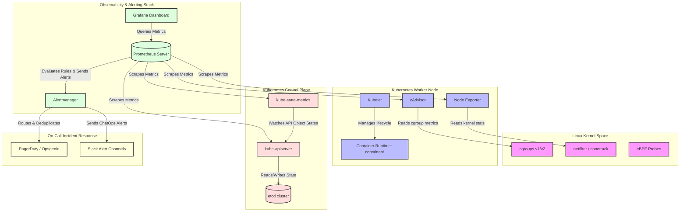

# Kubernetes - Part 3 - Technical Study Guide & Notes

# Kubernetes Production SRE, Diagnostics, & Incident Response (Part 3/3)

---

## 1. Part Introduction and Scope

This guide focuses on **Day-2 Kubernetes operations**: Production Site Reliability Engineering (SRE), diagnostics, troubleshooting, custom Prometheus alerting rules, and incident Root Cause Analysis (RCA). 

### Scope of This Guide
*   **Deep Diagnostics:** Kernel-level interactions, `sysctl` tuning, eBPF-based debugging, and container runtime investigations.
*   **Production Telemetry & Alerting:** Writing syntactically correct, production-grade PromQL alerts, configuring Alertmanager routing trees, and establishing SLO/SLI frameworks.
*   **Incident Runbooks & RCAs:** Step-by-step diagnostic workflows for complex cluster failures, including PLEG issues, CoreDNS degradation, OOMKilled loops, and etcd split-brain scenarios.
*   **Enterprise Hardening & Best Practices:** Securing diagnostic access, optimizing kernel parameters for high-throughput networking, and building automated remediation pipelines.

---

## 2. Why SRE & Diagnostics are Critical for High-Availability Systems

In a high-availability (HA) Kubernetes ecosystem, achieving a $99.99\%$ (four nines) or $99.999\%$ (five nines) uptime SLA requires minimizing both the **Mean Time to Detection (MTTD)** and **Mean Time to Resolution (MTTR)**. 

At enterprise scale, simple failures manifest as complex, cascading degradations:

```
[etcd Disk Latency Spike]
       │
       ▼
[APIServer Request Queue Saturation]
       │
       ▼
[Kubelet PLEG Timeout] ──► [Nodes Mark "NotReady"]
       │
       ▼
[Pod Evictions & Rescheduling Storm]
       │
       ▼
[CoreDNS Overload & Cascading Network Failure]
```

### The Cost of Inadequate SRE and Diagnostic Frameworks
*   **Cascading Failures:** A single misconfigured liveness probe can trigger a cascading restart loop across an entire microservice fleet, overwhelming downstream databases.
*   **Alert Fatigue:** Poorly designed alerting rules (e.g., alerting on static CPU utilization thresholds of $80\%$) cause alert fatigue, leading SREs to miss critical alerts.
*   **Silent Data Packet Drops:** Misconfigured container network interfaces (CNIs) or exhausted Linux connection tracking tables (`conntrack`) can drop packets silently, causing intermittent $502/504$ Gateway Timeouts that evade basic HTTP uptime checks.

---

## 3. Real-World Enterprise Use Cases

### Use Case 1: Silent Packet Drops in a High-Transaction Microservices Mesh
*   **The Scenario:** A financial transaction system processing $50,000$ requests per second (RPS) experiences intermittent $504$ Gateway Timeouts. Standard application logs show no errors, and Prometheus reports normal CPU and Memory usage.
*   **The SRE Investigation:** By inspecting host-level kernel metrics, SREs discover that the Linux connection tracking table (`nf_conntrack`) is saturated. Packets are being silently dropped by the kernel's netfilter framework before reaching the container runtime.
*   **The Resolution:** SREs tune the host kernel parameters (`net.netfilter.nf_conntrack_max`), implement Cilium with eBPF to bypass iptables/conntrack, and deploy a custom Prometheus alert to monitor conntrack table saturation.

### Use Case 2: JVM Heap Exhaustion vs. Container OOMKilled (SIGKILL 137)
*   **The Scenario:** A critical Java-based payment gateway service randomly restarts. The application team claims there are no OutOfMemory (OOM) errors in the application logs.
*   **The SRE Investigation:** SREs run `kubectl describe pod` and identify the termination reason as `OOMKilled` with exit code `137`. This indicates the Linux kernel's Out-Of-Memory Killer terminated the container, not the JVM. The JVM was configured with `-Xmx4g` on a container restricted to a $4\text{ GiB}$ memory limit. The JVM overhead (metaspace, thread stacks, GC overhead) pushed the total process memory usage to $4.2\text{ GiB}$, violating the cgroup limit.
*   **The Resolution:** SREs configure the JVM to use percentage-based heap sizing (`-XX:MaxRAMPercentage=75.0`) and set appropriate container resource limits, aligning the JVM runtime with cgroup boundaries.

### Use Case 3: etcd Latency Spikes Leading to Cluster-Wide Control Plane Degraded State
*   **The Scenario:** During a deployment of $500$ microservices, the Kubernetes control plane becomes unresponsive. `kubectl` commands time out, and nodes begin flipping between `Ready` and `NotReady` states.
*   **The SRE Investigation:** SREs analyze etcd metrics and find that the `etcd_disk_wal_write_duration_seconds_bucket` is exceeding $500\text{ ms}$ (the recommended threshold is $< 10\text{ ms}$). The underlying storage (AWS EBS gp2) is experiencing I/O operations per second (IOPS) and throughput throttling. etcd cannot commit transactions to the Write-Ahead Log (WAL) fast enough, causing leader election timeouts and control plane starvation.
*   **The Resolution:** SREs migrate the etcd storage class to dedicated NVMe-backed local SSDs (or AWS `gp3` with provisioned IOPS), separate the etcd WAL and data directories onto different physical disks, and configure IOPS monitoring.

---

## 4. Comprehensive Architecture Explanation

To diagnose and troubleshoot a Kubernetes cluster effectively, you must understand how telemetry data flows from the Linux kernel up to the SRE's alerting dashboard.

### Telemetry and Diagnostic Data Flow
1.  **Kernel & Hardware Space:** System metrics originate in the Linux kernel (e.g., cgroups, namespaces, netfilter, eBPF probes).
2.  **Node Space:**
    *   `Kubelet` monitors pod lifecycles and reports node status. It includes `cAdvisor` to collect container-level resource utilization metrics.
    *   `Node Exporter` runs as a DaemonSet to capture host-level metrics (disk I/O, CPU, network, conntrack).
3.  **Cluster Space:**
    *   `kube-state-metrics` queries the Kubernetes API Server to generate object-state metrics (e.g., pod deployment status, replica counts, resource limits).
    *   `Prometheus` pulls metrics from cAdvisor, Node Exporter, kube-state-metrics, and the API Server.
4.  **Alerting & Visualization:**
    *   `Prometheus` evaluates custom `PrometheusRule` definitions. If an alert condition is met, it fires the alert to `Alertmanager`.
    *   `Alertmanager` deduplicates, groups, silences, and routes the alerts to on-call paging platforms (e.g., PagerDuty, Opsgenie) or communication tools (e.g., Slack).



---

## 5. Types, Classifications, and Components of Kubernetes SRE

### A. Alerting Classifications (The SRE Golden Signals)
To build a resilient alerting architecture, alerts must be classified based on their impact:

| Signal | Metric Source | Definition | Example PromQL Focus |
| :--- | :--- | :--- | :--- |
| **Latency** | APIServer / App | Time taken to service a request. | `apiserver_request_duration_seconds_bucket` |
| **Traffic** | Ingress / Service | Demand placed on the system (RPS). | `sum(rate(http_requests_total[5m]))` |
| **Errors** | Ingress / App Logs | Rate of requests that fail (e.g., HTTP 5xx). | `rate(nginx_ingress_controller_requests{status=~"5.."}[5m])` |
| **Saturation** | OS / cgroups | How "full" the system's resources are. | `container_memory_working_set_bytes / container_spec_memory_limit_bytes` |

### B. Diagnostic Data Sources
When troubleshooting an active incident, SREs leverage four primary layers of data:

```
┌────────────────────────────────────────────────────────────────────────┐
│ 1. Metrics (Prometheus)                                                │
│    - Quantitative timeseries data indicating *where* and *when*        │
│                                                                        │
│ 2. Logs (Loki, Elasticsearch)                                          │
│    - Qualitative text streams explaining *why* a process failed        │
│                                                                        │
│ 3. Traces (Tempo, Jaeger)                                              │
│    - Request lifecycles showing *which* microservice introduced latency│
│                                                                        │
│ 4. Kernel/Runtime Telemetry (eBPF, strace, nsenter)                    │
│    - Low-level system calls showing *how* the OS interacted with code  │
└────────────────────────────────────────────────────────────────────────┘
```

---

## 6. Step-by-Step Production Implementation Guide

This guide details how to build a production-grade diagnostic and alerting pipeline using the **Prometheus Operator (`kube-prometheus-stack`)**.

### Step 1: Install the Prometheus Stack with Production-Grade Values
Deploy the Helm chart with a custom, hardened `values.yaml` that configures resource constraints, retention policies, and persistent storage.

```bash
# Add the Prometheus community Helm repository
helm repo add prometheus-community https://prometheus-community.github.io/helm-charts
helm repo update

# Create the custom values file
cat <<EOF > prometheus-production-values.yaml
prometheus:
  prometheusSpec:
    retention: 15d
    retentionSize: 40GiB
    resources:
      requests:
        cpu: "2"
        memory: 4Gi
      limits:
        cpu: "4"
        memory: 8Gi
    storageSpec:
      volumeClaimTemplate:
        spec:
          storageClassName: gp3-encrypted
          accessModes: ["ReadWriteOnce"]
          resources:
            requests:
              storage: 50Gi
    securityContext:
      runAsGroup: 2000
      runAsNonRoot: true
      runAsUser: 1000
      fsGroup: 2000

alertmanager:
  alertmanagerSpec:
    resources:
      requests:
        cpu: "200m"
        memory: 256Mi
      limits:
        cpu: "500m"
        memory: 512Mi
    storageSpec:
      volumeClaimTemplate:
        spec:
          storageClassName: gp3-encrypted
          accessModes: ["ReadWriteOnce"]
          resources:
            requests:
              storage: 10Gi
EOF

# Install the chart into the monitoring namespace
helm install prometheus-stack prometheus-community/kube-prometheus-stack \
  --namespace monitoring \
  --create-namespace \
  -f prometheus-production-values.yaml
```

### Step 2: Deploy Custom PrometheusRules for Critical Alerts
Create custom rules to monitor etcd disk latency, Pod crash loops, node disk pressure, and API Server latency.

```yaml
apiVersion: monitoring.coreos.com/v1
kind: PrometheusRule
metadata:
  name: kubernetes-sre-critical-alerts
  namespace: monitoring
  labels:
    release: prometheus-stack
spec:
  groups:
  - name: kubernetes-control-plane.rules
    rules:
    - alert: EtcdDiskWriteLatencyHigh
      expr: histogram_quantile(0.99, sum(rate(etcd_disk_wal_write_duration_seconds_bucket[5m])) by (le)) > 0.015
      for: 2m
      labels:
        severity: critical
        tier: control-plane
      annotations:
        summary: "etcd WAL write latency is dangerously high on {{ $labels.instance }}"
        description: "The 99th percentile of etcd Write-Ahead Log (WAL) commit latency is {{ $value }}s (threshold is > 15ms). This indicates disk I/O saturation on the control plane nodes, which can cause cluster split-brain or API server unresponsiveness."
        runbook_url: "https://wiki.enterprise.internal/sre/runbooks/etcd-disk-latency"

    - alert: KubeAPIServerLatencyHigh
      expr: histogram_quantile(0.99, sum(rate(apiserver_request_duration_seconds_bucket{subresource!="log", verb=~"GET|POST|PUT|DELETE"}[5m])) by (le, resource)) > 1.0
      for: 5m
      labels:
        severity: warning
        tier: control-plane
      annotations:
        summary: "Kubernetes API Server latency is high"
        description: "The 99th percentile of API Server request duration for resource '{{ $labels.resource }}' is {{ $value }}s (threshold is > 1.0s)."
        runbook_url: "https://wiki.enterprise.internal/sre/runbooks/apiserver-latency"

  - name: kubernetes-workloads.rules
    rules:
    - alert: PodCrashLooping
      expr: rate(kube_pod_container_status_restarts_total[5m]) * 60 > 2
      for: 5m
      labels:
        severity: critical
        tier: workload
      annotations:
        summary: "Pod {{ $labels.pod }} is crash looping"
        description: "Pod '{{ $labels.pod }}' in namespace '{{ $labels.namespace }}' is restarting at a rate of {{ $value }} times per minute."
        runbook_url: "https://wiki.enterprise.internal/sre/runbooks/pod-crashloop"

    - alert: ContainerOOMKilled
      expr: kube_pod_container_status_terminated_reason{reason="OOMKilled"} == 1
      for: 0m
      labels:
        severity: warning
        tier: workload
      annotations:
        summary: "Container {{ $labels.container }} was OOMKilled"
        description: "Container '{{ $labels.container }}' in Pod '{{ $labels.pod }}' (Namespace: '{{ $labels.namespace }}') was terminated by the Linux kernel OOM killer."
        runbook_url: "https://wiki.enterprise.internal/sre/runbooks/oomkilled-remediation"
```

Apply this configuration:
```bash
kubectl apply -f custom-prometheus-rules.yaml
```

### Step 3: Configure Alertmanager Routing and Receivers
Configure Alertmanager to route critical alerts to your on-call system (e.g., PagerDuty) and warnings to Slack.

```yaml
apiVersion: monitoring.coreos.com/v1alpha1
kind: AlertmanagerConfig
metadata:
  name: global-alertmanager-config
  namespace: monitoring
spec:
  route:
    groupBy: ['alertname', 'namespace', 'tier']
    groupWait: 30s
    groupInterval: 5m
    repeatInterval: 4h
    receiver: 'SlackNotifications'
    routes:
    - matchers:
      - name: severity
        value: critical
        matchType: =
      receiver: 'PagerDutyOnCall'
  receivers:
  - name: 'SlackNotifications'
    slackConfigs:
    - channel: '#sre-alerts'
      apiURL:
        name: alertmanager-secrets
        key: slack-webhook-url
      sendResolved: true
      text: "Alert: {{ .CommonAnnotations.summary }}\nDescription: {{ .CommonAnnotations.description }}\nSeverity: {{ .CommonLabels.severity }}"
  - name: 'PagerDutyOnCall'
    pagerdutyConfigs:
    - routingKey:
        name: alertmanager-secrets
        key: pd-integration-key
      sendResolved: true
      client: 'Kubernetes Alertmanager'
```

Apply this configuration:
```bash
kubectl apply -f alertmanager-config.yaml
```

---

## 7. Standard CLI Commands with Deep Technical Explanations

Here are the essential SRE commands for diagnosing failures on live clusters.

### 1. Ephemeral Container Debugging (Targeting Process Namespaces)
When a pod does not contain diagnostic binaries (such as `curl`, `tcpdump`, or `nslookup`), you can inject an ephemeral container into its process namespace.

```bash
kubectl debug -it <pod-name> \
  --image=nicolaka/netshoot \
  --target=<target-container-name> \
  --namespace=<namespace>
```
*   `--image=nicolaka/netshoot`: Injects a diagnostic container loaded with network debugging tools (`tcpdump`, `termshark`, `bind-utils`, `iproute2`).
*   `--target=<target-container-name>`: Instructs the container runtime to share the process namespace (`PID namespace`) of the target container. This allows you to run commands like `strace -p 1` or inspect `/proc/1/environ` directly from the debug shell.

### 2. Accessing the Host Network Namespace from a Worker Node
To debug host-level issues (like CNI routing or `iptables` rules) without SSH access, run a privileged pod in the host's namespaces.

```bash
kubectl run host-debug -it --rm --restart=Never \
  --image=nicolaka/netshoot \
  --overrides='{"spec": {"hostNetwork": true, "hostPID": true, "hostIPC": true, "securityContext": {"privileged": true}}}'
```
*   `--overrides=...`: Modifies the Pod spec to run on the host's namespaces:
    *   `hostNetwork: true`: Bypasses the container network namespace, attaching the pod directly to the host's physical network interfaces (e.g., `eth0`).
    *   `hostPID: true`: Shares the host's PID namespace, allowing you to see every process running on the VM.
    *   `privileged: true`: Grants capabilities (like `CAP_SYS_ADMIN` and `CAP_NET_ADMIN`) to interact directly with the host kernel.

### 3. Debugging Containers via Host `nsenter` (When `kubectl` is Unresponsive)
If the API Server is down, you can debug container runtimes directly on a worker node using `nsenter`.

```bash
# Step 1: Find the PID of the container on the node
container_id=$(crictl ps --name <container-name> -q)
pid=$(crictl inspect --output json $container_id | jq '.info.pid')

# Step 2: Enter the container's network and PID namespace
nsenter -t $pid -n -p ip addr show
```
*   `nsenter`: Enters the namespaces of one or more processes.
*   `-t $pid`: Targets the specific process ID of the running container.
*   `-n`: Enters the network namespace of the target.
*   `-p`: Enters the PID namespace of the target.
*   `ip addr show`: Runs the command inside the container's isolated network namespace, showing its actual network interfaces.

### 4. Direct etcd Diagnostics
When etcd performance degrades, use `etcdctl` to inspect write latencies and database health.

```bash
kubectl exec -it etcd-control-plane-node -n kube-system -- \
  etcdctl \
  --cacert=/etc/kubernetes/pki/etcd/ca.crt \
  --cert=/etc/kubernetes/pki/etcd/peer.crt \
  --key=/etc/kubernetes/pki/etcd/peer.key \
  --endpoints=https://127.0.0.1:2379 \
  endpoint hashcheck
```
*   `endpoint hashcheck`: Compares the hash values of all cluster members to detect split-brain conditions or state desynchronization.
*   `--cacert`, `--cert`, `--key`: Points to the mutual TLS (mTLS) certificates required to authenticate with the etcd control plane.

---

## 8. Production Configuration Examples

### Production-Grade `PrometheusRule` (SLO-Based Alerting)
This rule alerts when the error budget for API Server requests is consumed too quickly. This approach helps reduce alert noise compared to static thresholds.

```yaml
apiVersion: monitoring.coreos.com/v1
kind: PrometheusRule
metadata:
  name: apiserver-slo-alerts
  namespace: monitoring
  labels:
    role: alert-rules
spec:
  groups:
  - name: apiserver-slo
    rules:
    - alert: KubeAPIErrorBudgetBurnFast
      expr: |
        (
          sum(rate(apiserver_request_total{code=~"5.."}[1h])) 
          / 
          sum(rate(apiserver_request_total[1h]))
        ) > 0.144
      for: 5m
      labels:
        severity: critical
        tier: control-plane
      annotations:
        summary: "Kubernetes API Server Error Budget is burning rapidly"
        description: "The 1-hour error rate of the API Server is currently {{ $value | humanizePercentage }}, consuming more than 2% of the monthly error budget in 1 hour."
        runbook_url: "https://wiki.enterprise.internal/sre/runbooks/slo-error-budget"
```

### Production-Grade `AlertmanagerConfig` with Inhibit Rules
Inhibit rules prevent alert storms. For example, if a node goes down (`NodeDown`), Alertmanager will suppress warnings about individual pods failing on that same node.

```yaml
apiVersion: monitoring.coreos.com/v1alpha1
kind: AlertmanagerConfig
metadata:
  name: alertmanager-hardened
  namespace: monitoring
spec:
  route:
    groupBy: ['alertname', 'cluster']
    groupWait: 15s
    groupInterval: 2m
    repeatInterval: 12h
    receiver: 'DefaultReceiver'
  inhibitRules:
  - sourceMatchers:
    - name: alertname
      value: NodeNetworkDown
      matchType: =
    targetMatchers:
    - name: alertname
      value: InstanceDown
      matchType: =
    equal: ['node']
  - sourceMatchers:
    - name: alertname
      value: NodeDown
      matchType: =
    targetMatchers:
    - name: alertname
      value: PodCrashLooping
      matchType: =
    equal: ['node']
  receivers:
  - name: 'DefaultReceiver'
    webhookConfigs:
    - url: 'https://pagerduty.enterprise.internal/integration'
```

---

## 9. Security Considerations & Hardening Best Practices

### A. Restricting `kubectl debug` and `exec` Access via RBAC
By default, the ability to run `kubectl exec` or `kubectl debug` allows users to run arbitrary commands inside containers, which can lead to host-level privilege escalation. You can restrict these permissions using RBAC.

```yaml
apiVersion: rbac.authorization.k8s.io/v1
kind: ClusterRole
metadata:
  name: lead-sre-diagnostic-role
rules:
- apiGroups: [""]
  resources: ["pods", "pods/log"]
  verbs: ["get", "list", "watch"]
- apiGroups: [""]
  resources: ["pods/exec", "pods/ephemeralcontainers"]
  verbs: ["create"] # Required to execute shell commands and attach debug containers
```

### B. Network Isolation for Monitoring Infrastructure
The monitoring stack (Prometheus, Alertmanager, Grafana) contains sensitive system metrics. Isolate this namespace using a default-deny NetworkPolicy.

```yaml
apiVersion: networking.k8s.io/v1
kind: NetworkPolicy
metadata:
  name: deny-all-except-prometheus
  namespace: monitoring
spec:
  podSelector: {}
  policyTypes:
  - Ingress
  ingress:
  - from:
    - namespaceSelector:
        matchLabels:
          kubernetes.io/metadata.name: monitoring # Allow intra-namespace monitoring traffic
    - namespaceSelector:
        matchLabels:
          kubernetes.io/metadata.name: ingress-nginx # Allow Grafana access via Ingress
```

### C. Kernel-Level Hardening for Pods with Custom Sysctls
By default, Kubernetes blocks containers from modifying kernel parameters. If a performance-sensitive pod requires custom sysctls, configure them safely using the Pod security context.

```yaml
apiVersion: apps/v1
kind: Deployment
metadata:
  name: high-performance-web
spec:
  replicas: 3
  template:
    metadata:
      labels:
        app: web
    spec:
      securityContext:
        sysctls:
        - name: net.core.somaxconn
          value: "32768" # Scale connection backlog queue
        - name: net.ipv4.tcp_max_syn_backlog
          value: "16384"
      containers:
      - name: nginx
        image: nginx:1.25-alpine
```
*Note: To use custom sysctls, the underlying worker nodes must allow them. You must configure the kubelet with `--allowed-unsafe-sysctls=net.core.somaxconn,net.ipv4.tcp_max_syn_backlog`.*

---

## 10. Observability & Monitoring Considerations

### Key SRE Metrics to Watch

| Metric Name | Source | Description | SRE Action Threshold |
| :--- | :--- | :--- | :--- |
| `container_memory_working_set_bytes` | cAdvisor | Actual memory used by the container, including filesystem cache. Used by the OOM killer. | Close to container limit ($> 90\%$) |
| `kubelet_pleg_relist_duration_seconds` | Kubelet | Time taken by Pod Lifecycle Event Generator to sync pod states. | Mean $> 1.0\text{ s}$ (indicates docker/containerd lockup) |
| `apiserver_request_duration_seconds_bucket` | API Server | API Server request latency distribution. | 99th percentile $> 2.0\text{ s}$ |
| `node_netstat_TcpExt_TCPLoss` | Node Exporter | Number of TCP packets lost on the host interface. | Rate $> 5/\text{s}$ |
| `etcd_disk_wal_write_duration_seconds_bucket` | etcd | Time to write WAL entries to disk. | 99th percentile $> 15\text{ ms}$ |

### Log Aggregation & Correlation Strategy
To accelerate incident response, correlate metrics with logs by injecting tracing identifiers into your log statements:

```
[User Request] ──► [Ingress: TraceID=x-123] ──► [App Pod: Log "DB Query failed" TraceID=x-123]
```

1.  **TraceID Injection:** Ensure your API gateway/ingress controller injects a `W3C Trace Context` header (`traceparent`) into every request.
2.  **Log Structured Output:** Configure all containerized applications to emit logs in JSON format to stdout.
3.  **Log Correlation:** Use an aggregator (such as Vector or FluentBit) to parse the JSON logs and extract fields like `trace_id` and `span_id`. This allows you to query Grafana Tempo or Loki for all logs associated with a specific transaction.

---

## 11. Common Troubleshooting Scenarios with RCA Steps

### Scenario A: `CrashLoopBackOff` due to `OOMKilled` (Exit Code 137)

```
[Container Memory Usage Rises]
       │
       ▼
[Violates cgroup limit]
       │
       ▼
[Kernel sends SIGKILL 137]
       │
       ▼
[Kubelet marks Pod: OOMKilled]
```

#### Diagnostic Workflow
1.  **Identify the termination reason:**
    ```bash
    kubectl get pod <pod-name> -o jsonpath='{.status.containerStatuses[0].lastState.terminated.reason}'
    # Expected Output: OOMKilled
    ```
2.  **Verify the exit code:**
    ```bash
    kubectl get pod <pod-name> -o jsonpath='{.status.containerStatuses[0].lastState.terminated.exitCode}'
    # Expected Output: 137 (128 + SIGKILL 9)
    ```
3.  **Trace the host-level kernel log:**
    Log in to the worker node and run `dmesg` to find the kernel event.
    ```bash
    dmesg -T | grep -i oom-killer
    # Expected Output: [Date] Out of memory: Kill process 12934 (java) score 950 or sacrifice child
    ```
4.  **Analyze memory usage trends using PromQL:**
    ```promql
    # Track container memory usage relative to its limit
    sum(container_memory_working_set_bytes{pod="<pod-name>"}) by (container) 
    / 
    sum(container_spec_memory_limit_bytes{pod="<pod-name>"}) by (container) * 100
    ```

#### Root Cause Analysis (RCA)
*   **Root Cause:** The container process exceeded the allocated cgroup memory limit, triggering the Linux kernel's Out-Of-Memory (OOM) killer.
*   **Remediation:** Increase the memory limit in the Pod's resource definition. For Java applications, configure `-XX:MaxRAMPercentage` to ensure the JVM heap does not exceed the container's memory limit.

---

### Scenario B: CoreDNS Latency & Resolv.conf Search Path Saturation

```
[App requests "api.internal"]
       │
       ▼
[Appends search paths: "api.internal.default.svc.cluster.local", "api.internal.svc.cluster.local", ...]
       │
       ▼
[Fires 5+ DNS queries per request]
       │
       ▼
[CoreDNS saturated / drops packets]
```

#### Diagnostic Workflow
1.  **Measure DNS latency from inside the container:**
    ```bash
    kubectl debug -it <pod-name> --image=nicolaka/netshoot -- dig api.internal
    ```
2.  **Inspect `/etc/resolv.conf` inside the application container:**
    ```bash
    kubectl exec -it <pod-name> -- cat /etc/resolv.conf
    ```
    *Output:*
    ```text
    nameserver 10.96.0.10
    search default.svc.cluster.local svc.cluster.local cluster.local openstack.local
    options ndots:5
    ```
    *Why this is a bottleneck:* `ndots:5` means that if a domain contains fewer than 5 dots, the system will query all search paths sequentially before trying the absolute domain. This can result in up to 5 DNS queries for a single look-up.

3.  **Monitor CoreDNS performance metrics:**
    ```promql
    # Track CoreDNS request rate
    sum(rate(coredns_dns_requests_total[5m])) by (proto, family)
    
    # Track CoreDNS response latencies
    histogram_quantile(0.99, sum(rate(coredns_dns_request_duration_seconds_bucket[5m])) by (le))
    ```

#### Root Cause Analysis (RCA)
*   **Root Cause:** The combination of `ndots:5` and frequent external DNS queries caused a high volume of redundant DNS lookups, saturating CoreDNS.
*   **Remediation:** Configure your application to use absolute domain names (ending with a trailing dot, e.g., `api.internal.`) to bypass the search path. Alternatively, adjust the pod's DNS configuration:
    ```yaml
    spec:
      dnsConfig:
        options:
        - name: ndots
          value: "1"
    ```

---

### Scenario C: Node `NotReady` due to PLEG (Pod Lifecycle Event Generator) Timeout

```
[Container Runtime (containerd) hangs]
       │
       ▼
[Kubelet PLEG loop exceeds 3m threshold]
       │
       ▼
[Kubelet stops posting status to APIServer]
       │
       ▼
[Node status flips to: NotReady]
```

#### Diagnostic Workflow
1.  **Check node status and events:**
    ```bash
    kubectl describe node <node-name> | grep -A 5 -i PLEGLoop
    ```
2.  **Inspect Kubelet logs on the affected node:**
    ```bash
    journalctl -u kubelet -n 100 --no-pager | grep -i PLEG
    # Expected Output: cgroup: fork rejected by pids controller
    # Or: PLEG is not healthy: PLG loop took 185s
    ```
3.  **Check container runtime health:**
    ```bash
    systemctl status containerd
    # Or check if containerd is responding to CLI requests
    crictl ps
    ```

#### Root Cause Analysis (RCA)
*   **Root Cause:** The Kubelet's Pod Lifecycle Event Generator (PLEG) loop timed out because the container runtime (e.g., `containerd` or `docker`) was unresponsive. This is often caused by disk I/O bottlenecks, kernel memory fragmentation, or a deadlock in the runtime.
*   **Remediation:** Restart the container runtime on the affected node:
    ```bash
    systemctl restart containerd
    ```
    To prevent future occurrences, investigate host-level disk I/O metrics and verify that the container runtime's resource limits are configured correctly.

---

## 12. Common Mistakes and How to Avoid Them in Production

### Mistake 1: Setting Static CPU Alerting Thresholds
*   **The Mistake:** Configuring alerts that fire when container CPU usage exceeds $80\%$.
*   **Why it's bad:** Kubernetes throttles CPU when limits are reached, but it does not terminate the container. High CPU usage is expected during peak traffic and does not necessarily indicate a failure. This approach often leads to alert fatigue.
*   **The Solution:** Alert on **CPU Throttling** or **Horizontal Pod Autoscaler (HPA) Saturation** instead of raw usage.
    ```promql
    # Alert when a container is throttled for more than 20% of its runtime slice
    sum(increase(container_cpu_clipped_periods_total[5m])) by (pod, namespace) 
    / 
    sum(increase(container_cpu_elapsed_periods_total[5m])) by (pod, namespace) * 100 > 20
    ```

### Mistake 2: Using Heavy Database Queries in Liveness Probes
*   **The Mistake:** Designing a liveness probe that executes a database query (e.g., `SELECT 1`) to verify application health.
*   **Why it's bad:** If the database experiences a brief latency spike, the liveness probes for all connected pods will fail. Kubernetes will then restart the entire application fleet simultaneously, creating a thundering herd effect that can overwhelm the database as the pods attempt to reconnect.
*   **The Solution:** Use liveness probes only to check internal process health. Use **Readiness Probes** or **Startup Probes** to check downstream dependencies, and configure them with appropriate timeouts and thresholds.

### Mistake 3: Failing to Set Up Log Rotation for Container Runtimes
*   **The Mistake:** Relying on default logging configurations without rotation policies.
*   **Why it's bad:** If an application begins logging rapidly (e.g., during a loop failure), the worker node's disk can fill up. This triggers a `DiskPressure` taint, causing Kubernetes to evict pods from the node.
*   **The Solution:** Configure log rotation in your container runtime configuration (e.g., `/etc/containerd/config.toml` or docker daemon options).
    ```json
    {
      "log-driver": "json-file",
      "log-opts": {
        "max-size": "50m",
        "max-file": "3"
      }
    }
    ```

---

## 13. Enterprise-Level Recommendations

### 1. Kernel Parameter Tuning for High-Volume Workloads
For Kubernetes nodes hosting high-throughput applications, apply these host-level kernel optimizations via a daemonset or systemd configuration:

```ini
# Increase maximum conntrack table size to prevent packet drops
net.netfilter.nf_conntrack_max = 1048576

# Increase the TCP backlog queue length
net.core.somaxconn = 65535

# Increase ephemeral port range for outgoing connections
net.ipv4.ip_local_port_range = 10240 65535

# Enable TCP SYN Cookies to mitigate SYN flood attacks
net.ipv4.tcp_syncookies = 1
```

### 2. Bypass iptables Overhead with eBPF (Cilium)
Standard Kubernetes networking relies on `kube-proxy` and `iptables` to route traffic to services. As the number of services grows, the sequential routing tables in `iptables` can introduce latency.

*   **Recommendation:** Migrate to **Cilium** as your CNI in kube-proxy replacement mode. Cilium uses **eBPF (Extended Berkeley Packet Filter)** to route network packets directly at the socket level, bypassing connection tracking and routing tables. This reduces network latency and CPU overhead on your worker nodes.

### 3. Implement Custom Metric Autoscaling (KEDA)
Standard HPAs scale based on CPU and memory usage. However, these metrics are often lagging indicators of load.

*   **Recommendation:** Deploy **KEDA (Kubernetes Event-driven Autoscaling)** to scale workloads based on direct traffic indicators, such as Kafka consumer lag, RabbitMQ queue depth, or Prometheus request rates.

```yaml
apiVersion: keda.sh/v1alpha1
kind: ScaledObject
metadata:
  name: queue-consumer-scaler
  namespace: default
spec:
  scaleTargetRef:
    apiVersion: apps/v1
    kind: Deployment
    name: queue-consumer
  minReplicaCount: 1
  maxReplicaCount: 50
  triggers:
  - type: prometheus
    metadata:
      serverAddress: http://prometheus-stack-prometheus.monitoring.svc.cluster.local:9090
      metricName: rabbitmq_queue_messages_ready
      query: sum(rabbitmq_queue_messages_ready{queue="transactions"})
      threshold: '100'
```

---

## 14. Advanced SRE Concepts

### eBPF (Extended Berkeley Packet Filter)
eBPF allows you to run sandboxed programs inside the Linux kernel without modifying kernel source code or loading kernel modules. This enables low-overhead observability and security monitoring.

```
┌────────────────────────────────────────────────────────┐
│                    Userspace Tools                     │
│               (kubectl, Cilium CLI, Hubble)            │
└───────────────────────────┬────────────────────────────┘
                            │ Queries/Loads
                            ▼
┌────────────────────────────────────────────────────────┐
│                      Linux Kernel                      │
│                                                        │
│  eBPF Program ──► Attached to: kprobes, tracepoints,   │
│                             sockets, network devices   │
│                                                        │
│  [Kernel Events] ──► [eBPF Map (Data Store)] ──────────┘
```

#### Key SRE Use Cases for eBPF
*   **Zero-Overhead Network Tracing:** Tools like **Hubble** use eBPF to trace every network connection down to the process and socket level, mapping service dependencies without modifying application code.
*   **Runtime Security Auditing:** **Tetragon** uses eBPF to monitor system calls (`syscalls`), file access, and execution events in real time. This allows you to detect security anomalies (such as a shell execution inside a web container) with minimal performance impact.

### Chaos Engineering in Production
To verify that your alerting and self-healing systems work as expected, you should regularly inject failure scenarios into your staging and production environments.

*   **Tooling:** Use **Chaos Mesh** or **LitmusChaos** to automate failure injection.
*   **Key Experiments:**
    *   **Network Latency Injection:** Inject $100\text{ ms}$ of latency between microservices to test how your application handles slow responses and verify that circuit breakers trigger correctly.
    *   **Pod Eviction Storms:** Simulate a node failure to ensure that workloads reschedule smoothly without violating your service's availability SLAs.
    *   **DNS Interruption:** Block access to CoreDNS for a specific namespace to verify that applications fail gracefully and recover once connectivity is restored.

---

## 15. Integration with Other DevOps Tools

```
┌─────────────────┐      Declares      ┌───────────────┐
│  Terraform IaC  ├───────────────────►│ Alerting Rules│
└─────────────────┘                    └───────┬───────┘
                                               │
                                               ▼
┌─────────────────┐      Deploys       ┌───────────────┐
│   ArgoCD GitOps ├───────────────────►│  Workloads &  │
└─────────────────┘                    │  Prometheus   │
                                       └───────┬───────┘
                                               │
                                               ▼
┌─────────────────┐      Monitors      ┌───────────────┐
│ Prometheus Stack├───────────────────►│  Production   │
└─────────────────┘                    │  Kubernetes   │
                                       └───────────────┘
```

### GitOps-Driven Alerts (ArgoCD & Terraform)
Manage your alerting rules as infrastructure. Declare your Prometheus rules in Terraform and deploy them using ArgoCD to ensure consistency across all your clusters.

```hcl
# Terraform definition of a Kubernetes PrometheusRule
resource "kubernetes_manifest" "prometheus_cpu_alert" {
  manifest = {
    apiVersion = "monitoring.coreos.com/v1"
    kind       = "PrometheusRule"
    metadata = {
      name      = "terraform-managed-alerts"
      namespace = "monitoring"
      labels = {
        release = "prometheus-stack"
      }
    }
    spec = {
      groups = [{
        name = "terraform-alerts"
        rules = [{
          alert = "HostDiskSpaceRunningLow"
          expr  = "node_filesystem_free_bytes{mountpoint='/'} / node_filesystem_size_bytes{mountpoint='/'} * 100 < 10"
          for   = "10m"
          labels = {
            severity = "warning"
          }
          annotations = {
            summary = "Host disk space is low on {{ $labels.instance }}"
          }
        }]
      }]
    }
  }
}
```

---

## 16. Diagnostic Tooling Comparison

| Feature / Metric | Prometheus + Grafana | Datadog | Dynatrace | OpenTelemetry + Honeycomb |
| :--- | :--- | :--- | :--- | :--- |
| **Primary Use Case** | Cloud-native metrics & alerting | Enterprise APM & unified observability | AI-driven root cause analysis | High-cardinality distributed tracing |
| **Data Retention** | Configurable (local disks) | Fixed by SaaS plan (typically 15-30 days) | Configurable SaaS storage | Configurable SaaS storage |
| **Agent Footprint** | Low (Prometheus pull model) | Medium (Datadog Agent DaemonSet) | Medium (OneAgent runs on host) | Low (OTel Collector) |
| **Cost Model** | Open Source (Self-managed storage costs) | High (Per-host/per-metric pricing) | High (Per-host/per-transaction pricing) | Usage-based (Per gigabyte ingested) |
| **Latency to Dashboard** | $10\text{s} - 30\text{s}$ (Scrape interval) | $5\text{s} - 15\text{s}$ | Real-time stream processing | Real-time stream processing |

---

## 17. Visual SRE Diagnostic Cheat Sheet

| Incident Symptom | Likely Underlying Cause | Initial Diagnostic Command | Remediation Step |
| :--- | :--- | :--- | :--- |
| **Pod Status: `ImagePullBackOff`** | Registry auth failure or incorrect tag | `kubectl describe pod <pod>` | Verify image path, tag, and imagePullSecrets |
| **Pod Status: `CreateContainerConfigError`** | Missing ConfigMap or Secret | `kubectl get pod <pod> -o yaml` | Create the missing ConfigMap or Secret |
| **Container Exit Code: `137`** | Out of Memory (OOMKilled) | `dmesg -T \| grep -i oom-killer` | Increase container memory limits |
| **Container Exit Code: `143`** | Graceful SIGTERM timeout | `kubectl logs <pod> --previous` | Check application shutdown handlers |
| **Node Status: `NotReady`** | Disk Pressure, Memory Pressure, or Kubelet crash | `kubectl describe node <node>` | Clean up unused images, rotate logs, or restart Kubelet |
| **DNS Resolution Timeouts** | CoreDNS saturation or `ndots:5` overhead | `kubectl logs -n kube-system -l k8s-app=kube-dns` | Use absolute domains or adjust `ndots` in pod spec |
| **Intermittent `502` / `504` Errors** | Host conntrack table exhaustion | `sysctl net.netfilter.nf_conntrack_count` | Increase `nf_conntrack_max` or migrate to Cilium |

---

## 18. Comprehensive Final Learning Summary

This final module completes your transition to a Senior SRE and Kubernetes Expert. You are now equipped with the knowledge to manage complex, high-availability Kubernetes deployments.

### Key Takeaways
1.  **Observability is Not Just Dashboards:** Shift from static, resource-based alerts (like "CPU $> 80\%$") to **SLO-based alerting** that measures error budget burn rates. This helps reduce alert fatigue and focuses your attention on user-impacting issues.
2.  **Understand the Kernel-Container Connection:** Containers are not virtual machines; they are isolated Linux processes running on a shared kernel. To diagnose complex failures, you must understand how container runtimes interact with kernel features like cgroups, namespaces, netfilter, and the OOM killer.
3.  **Prioritize Automated Runbooks and Self-Healing:** Minimize MTTR by documenting diagnostic workflows and automating remediations. Use tools like KEDA for event-driven autoscaling and Chaos Engineering to validate your system's resilience before incidents occur in production.

### Q41. Troubleshooting CrashLoopBackOff due to Silent OOM Kills
**How do you diagnose and resolve a pod repeatedly entering a `CrashLoopBackOff` state due to a silent Out-Of-Memory (OOM) event where the application process is terminated by the Linux kernel OOM-killer, but Kubernetes reports exit code 137 or a generic exit code 139? Provide the diagnostics workflow, the required Prometheus alerting rules, and an SRE mitigation runbook.**

**Detailed Answer**:
When a container is terminated due to running out of memory, it typically exits with code `137` (which indicates it was terminated by `SIGKILL` / `128 + 9`). However, diagnosing this becomes complex when:
1. The process inside the container is managed by a supervisor or runtime wrapper that catches the signal and exits with a generic code like `1` or `139` (Segmentation Fault).
2. The container runtime (containerd/CRI-O) fails to register the OOM event in the Pod status because the container was killed by the kernel's global OOM-killer rather than the cgroup-specific memory controller limit.

To diagnose this systematically, an SRE must correlate Kubernetes API state, node kernel rings, and cgroup metrics:

1. **Verify Pod Status & Exit Codes**: Run `kubectl get pod <pod-name> -o jsonpath='{.status.containerStatuses[*].state.terminated}'`. Look for `reason: OOMKilled` and `exitCode: 137`.
2. **Inspect Kernel Buffers (dmesg)**: If the exit code is not `137` but you suspect OOM, SSH into the worker node hosting the pod (or run a privileged debug pod) and inspect the kernel log buffer using:
   ```bash
   dmesg -T | grep -i -E 'oom[-_]killer|killed process'
   ```
   Look for lines indicating the kernel killed your process: `Killed process <pid> (java) total-vm:XkB, anon-rss:YkB, file-rss:ZkB, shmem-rss:WkB`.
3. **Analyze Cgroup Memory Usage**: Inspect the cgroup memory limit and current usage on the node. For cgroups v2, navigate to `/sys/fs/cgroup/kubepods.slice/kubepods-burstable.slice/pod<pod-uid>/` and check `memory.current` and `memory.max`.

**Root Cause Analysis (RCA) & Mitigation**:
* **JVM/Node.js Heap Misconfiguration**: The application runtime heap is configured larger than the container's cgroup memory limit. For example, if a Java application is configured with `-Xmx2g` but the container limit is `2Gi`, the JVM overhead (metaspace, thread stacks, GC data structures) will push the total memory usage past `2Gi`, triggering a cgroup OOM kill.
* **Solution**: Configure the runtime to be cgroup-aware (e.g., `-XX:+UseContainerSupport` for Java 10+) or explicitly set the heap size to 70-80% of the container limit (e.g., `-XX:MaxRAMPercentage=75.0`).

**Production Scenario / Practical Example**:
An SRE is paged for a critical payment microservice `payment-processor` crashing repeatedly.

#### Step 1: Querying Prometheus for Container OOM Events
We use the following PromQL query to identify containers killed by the OOM-killer:
```promql
rate(container_oom_events_total{container="payment-processor"}[5m]) > 0
```
Alternatively, if using `cadvisor` metrics:
```promql
container_memory_working_set_bytes{container="payment-processor"} / container_spec_memory_limit_bytes{container="payment-processor"} * 100 > 98
```

#### Step 2: Custom Prometheus Alerting Rule
Deploy this alert rule to catch silent and explicit OOM events before they cause cascading failures:

```yaml
apiVersion: monitoring.coreos.com/v1
kind: PrometheusRule
metadata:
  name: kubernetes-oom-alerts
  namespace: monitoring
spec:
  groups:
  - name: node-and-container-oom
    rules:
    - alert: ContainerOOMKilled
      expr: container_oom_events_total > 0
      for: 0m
      labels:
        severity: critical
        tier: platform
      annotations:
        summary: "Container {{ $labels.container }} in pod {{ $labels.pod }} was OOM killed"
        description: "Pod {{ $labels.namespace }}/{{ $labels.pod }} container {{ $labels.container }} was terminated by the OOM killer. Current memory limit is too low for the workload."
        runbook_url: "https://wiki.internal.corp/sre/runbooks/kubernetes-oom-mitigation"
```

#### Step 3: Runbook / Mitigation Execution
If a pod is crashing due to OOM, execute the following commands:

```bash
# 1. Get the node name where the pod is running
NODE_NAME=$(kubectl get pod payment-processor-7fd89bc4-abc12 -n payments -o jsonpath='{.spec.nodeName}')

# 2. Spin up a node-level debugging session using kubectl debug
kubectl debug node/$NODE_NAME -it --image=busybox -- chroot /host journalctl -k --since "10 minutes ago" | grep -i "oom"

# 3. Apply a temporary hotfix by patching the deployment limits (increase limit by 50%)
kubectl patch deployment payment-processor -n payments --type='json' -p='[
  {"op": "replace", "path": "/spec/template/spec/containers/0/resources/limits/memory", "value": "4Gi"}
]'
```

---

### Q42. Debugging a Silent Network Packet Drop at the CNI Level
**How do you diagnose and resolve a silent network packet drop where Pods on different nodes cannot communicate sporadically, while Pods on the same node communicate flawlessly? Detail the diagnostics workflow involving VXLAN/Geneve encapsulation, MTU mismatches, IPAM exhaustion, and how to debug using `nsenter` and `tcpdump`.**

**Detailed Answer**:
Inter-node pod-to-pod communication failures in Kubernetes usually stem from issues in the overlay network (VXLAN, Geneve) managed by the Container Network Interface (CNI), such as Calico, Cilium, or Flannel.

#### Core Causes of Silent Packet Drops:
1. **MTU (Maximum Transmission Unit) Mismatch**: The physical network interface has an MTU of `1500` bytes. The CNI overlay network encapsulates the original Ethernet frame inside an outer IP/UDP header (VXLAN adds 50 bytes of overhead; Geneve adds 50-100 bytes). If the CNI interface is configured with an MTU of `1500` instead of `1450` (1500 - 50), packets exceeding `1450` bytes will be dropped silently by the physical network switches or intermediate routers because the `DF` (Don't Fragment) flag is set.
2. **Asymmetric Routing / Reverse Path Filtering (rp_filter)**: The Linux kernel might drop incoming packets on the virtual interfaces if reverse path filtering (`rp_filter`) is set to strict mode (`1`) and the return path does not match the incoming interface.
3. **CNI IPAM Exhaustion**: The IP Address Management (IPAM) module has run out of IPs for the CIDR block assigned to a specific node, leading to newly spawned pods not getting a valid routing table entry.

#### Diagnostics Workflow:
1. **Identify the Pod IPs and Node IPs**:
   ```bash
   kubectl get pods -o wide -n production
   # Pod A on Node 1 (IP: 10.244.1.45, Node IP: 192.168.12.10)
   # Pod B on Node 2 (IP: 10.244.2.89, Node IP: 192.168.12.11)
   ```
2. **Test ICMP with Large Packet Sizes (MTU Test)**:
   Exec into Pod A and ping Pod B with varying packet sizes and the DF flag set:
   ```bash
   ping -I eth0 -M do -s 1472 10.244.2.89  # Works if MTU is 1500, fails if VXLAN is active
   ping -I eth0 -M do -s 1422 10.244.2.89  # Should work over VXLAN (1450 MTU)
   ```
   If the smaller packet size succeeds but the larger one fails silently, you have an MTU mismatch.

3. **Trace Packets inside the Network Namespace**:
   To find where the packet is dropped, you must trace it from the container's virtual ethernet interface (`veth`) to the physical interface (`eth0` of the node).

**Production Scenario / Practical Example**:
An SRE is troubleshooting a Cilium-based cluster where Pods on `node-1` cannot reach Pods on `node-2` for payloads larger than 1.5 KB.

#### Step 1: Locate Pod Network Namespace and Run `tcpdump`
Find the container process ID (PID) on the worker node to enter its network namespace using `nsenter`:

```bash
# On Node 1 (where Pod A resides):
# Find container ID
CONTAINER_ID=$(docker ps -a | grep "payment-service" | awk '{print $1}')
# Or if using containerd:
CONTAINER_ID=$(crictl ps --name "payment-service" -q)

# Get PID of the container
PID=$(crictl inspect --output json $CONTAINER_ID | jq '.info.pid')

# Enter the container's network namespace and run tcpdump
nsenter -t $PID -n tcpdump -nnvv -i any port 8080
```

#### Step 2: Capture Packets on the Node's Physical and VXLAN Interfaces
On Node 1, capture traffic on the tunnel interface (typically `cilium_vxlan`, `flannel.1`, or `cali+`):

```bash
# Capture VXLAN encapsulated traffic (UDP Port 4789) on the physical interface
tcpdump -i eth0 -n "udp port 4789"

# Capture decrypted traffic on the CNI tunnel interface
tcpdump -i cilium_vxlan -n "icmp or port 8080"
```
*If packets are seen leaving `cilium_vxlan` but never arrive at Node 2's `eth0`, the physical network switches are dropping the encapsulated UDP packets because they exceed the physical interface MTU.*

#### Step 3: SRE Resolution (Fixing MTU dynamically in Cilium)
Update the Cilium CNI ConfigMap to set the MTU to `1450` (or configure the physical network switches to support Jumbo Frames, e.g., MTU `9000`).

```yaml
apiVersion: v1
kind: ConfigMap
metadata:
  name: cilium-config
  namespace: kube-system
data:
  # Enable MTU auto-detection or set explicitly
  mtu: "1450"
```
Apply the changes and perform a rolling restart of the Cilium DaemonSet:
```bash
kubectl rollout restart ds/cilium -n kube-system
```

---

### Q43. Debugging APIServer Latency and `etcd` Starvation
**The control plane is sluggish, `kubectl` commands are timing out, and logs show `etcd lease expired` and `apply commit took too long`. How do you run a Root Cause Analysis (RCA), optimize `etcd` disk/network parameters, and write a PromQL alert for etcd leader changes and commit latency?**

**Detailed Answer**:
The Kubernetes API Server is entirely stateless; its performance is directly bound to the performance of `etcd`. When `etcd` experiences high disk write latency or network round-trip time (RTT) degradation, it cannot commit transactions fast enough. This leads to:
* API Server request queues filling up, causing HTTP 504 Gateway Timeouts.
* Kubelet lease updates failing, causing nodes to transition to `NotReady` status.
* Controller Manager failing to acquire leader election locks.

#### Diagnostic Metrics:
1. **Disk Sync Duration (`etcd_disk_wal_fsync_duration_seconds`)**: Measures the time it takes to write WAL (Write-Ahead Log) entries to disk. It must be consistently under **10ms** (ideally < 1ms on SSDs).
2. **Backend Commit Duration (`etcd_disk_backend_commit_duration_seconds`)**: Measures the time to commit transactions to the bbolt DB.
3. **Network Peer Round Trip Time (`etcd_network_peer_round_trip_time_seconds`)**: Measures peer-to-peer latency between etcd cluster members. Must be < 50ms.

#### Common Root Causes:
* **Disk I/O Bottlenecks**: `etcd` shares the same disk as other heavy-I/O workloads (like container logs in `/var/log` or Prometheus TSDB).
* **DB Size Limit Exceeded**: By default, `etcd` has a 2GB database quota limit. When reached, it triggers a resource limit alarm and rejects write operations.
* **CPU/Memory Starvation**: The control plane node is under-provisioned, causing the `etcd` process to be throttled by CFS.

**Production Scenario / Practical Example**:
A large production cluster is experiencing severe control plane latency. `kubectl get nodes` takes 15 seconds to respond.

#### Step 1: Run Diagnostics via `etcdctl`
Execute diagnostic checks inside the `etcd` static pod on a master node:

```bash
# Define etcdctl environment variables
export ETCDCTL_API=3
export ETCDCTL_CACERT="/etc/kubernetes/pki/etcd/ca.crt"
export ETCDCTL_CERT="/etc/kubernetes/pki/etcd/peer.crt"
export ETCDCTL_KEY="/etc/kubernetes/pki/etcd/peer.key"
export ETCDCTL_ENDPOINTS="https://127.0.0.1:2379"

# Check endpoint health and response times
etcdctl endpoint health --write-out=table

# Check database size and fragmentation
etcdctl endpoint status --write-out=table
```
*Output Analysis*: If the database size is close to 2.0 GiB and `DB SIZE` is high, but `IN USE` is low, fragmentation is high.

#### Step 2: SRE Mitigation (Defragmentation and Compaction)
If etcd is locked due to space quota:

```bash
# 1. Get current revision
REV=$(etcdctl endpoint status --write-out=json | jq .[0].Status.header.revision)

# 2. Compact historical data up to current revision
etcdctl compact $REV

# 3. Defragment the database to reclaim space
etcdctl defrag

# 4. Disarm the alarm
etcdctl alarm disarm
```

#### Step 3: Optimize System Configurations for Production
To ensure `etcd` gets priority on disk I/O and scheduling, modify the systemd unit file or static pod manifest:

1. **Set Ionice Class**: Set `etcd` to use the Real-Time I/O class to avoid sharing I/O bandwidth with other processes:
   ```bash
   ionice -c2 -n0 -p $(pgrep etcd)
   ```
2. **Configure Dedicated Disk for etcd**: Mount `/var/lib/etcd` onto a dedicated NVMe SSD.

#### Step 4: Prometheus Alerting Rules for etcd Health
Deploy these alerts to detect `etcd` degradation before it impacts the cluster:

```yaml
apiVersion: monitoring.coreos.com/v1
kind: PrometheusRule
metadata:
  name: etcd-performance-alerts
  namespace: monitoring
spec:
  groups:
  - name: etcd-health
    rules:
    - alert: EtcdHighFsyncLatency
      expr: histogram_quantile(0.99, rate(etcd_disk_wal_fsync_duration_seconds_bucket[5m])) > 0.01
      for: 5m
      labels:
        severity: critical
      annotations:
        summary: "etcd disk WAL fsync latency is too high"
        description: "99th percentile of etcd WAL fsync latency is {{ $value }}s on instance {{ $labels.instance }}. This indicates slow disk I/O."

    - alert: EtcdLeaderChanges
      expr: rate(etcd_server_leader_changes_seen_total[15m]) > 3
      for: 0m
      labels:
        severity: critical
      annotations:
        summary: "etcd leader changes occurring frequently"
        description: "etcd instance {{ $labels.instance }} has seen {{ $value }} leader changes in the last 15 minutes, indicating network instability or CPU throttling."
```

---

### Q44. Resolving "ImagePullBackOff" at Scale
**Your enterprise cluster experiences sudden, widespread `ImagePullBackOff` errors across multiple namespaces. How do you systematically diagnose whether the issue is due to Docker Hub rate limits, private registry credential propagation, or local node disk pressure causing aggressive garbage collection? Provide the exact technical verification steps.**

**Detailed Answer**:
At scale, `ImagePullBackOff` is rarely a simple "typo in the image name." It is usually caused by infrastructure-level bottlenecks or configuration drifts.

#### Diagnosis Flowchart:
```
               [ImagePullBackOff Detected]
                           │
             Check Pod Events (kubectl describe)
                           │
         ┌─────────────────┴─────────────────┐
         ▼                                   ▼
  [HTTP 429 Too Many Requests]      [HTTP 401 Unauthorized /]
         │                          [ErrImagePull: Auth Failed]
         ▼                                   │
  Docker Hub Rate Limit                      ▼
  (Configure Auth / Mirror)          Credential Failure
                                (Check ImagePullSecrets/SA)
```

1. **Docker Hub Rate Limits (HTTP 429)**: Anonymous pulls are limited to 100 pulls per 6 hours per IP address. In a large Kubernetes cluster, all nodes might share a single NAT Gateway IP, causing the cluster to hit this limit rapidly.
2. **Registry Credential Propagation**: If the image is private, the Pod must use an `imagePullSecrets` reference, or the default `ServiceAccount` in the namespace must be patched to include the credential.
3. **Local Node Disk Pressure & Garbage Collection (GC)**: If a node's root disk exceeds the `imageGCHighThresholdPercent` (default 85%), `kubelet` actively deletes unused container images. If a pod is scheduled to that node and requires a deleted image while the registry is experiencing high latency or rate limits, it will fail to pull the image in time, triggering `ImagePullBackOff`.

**Production Scenario / Practical Example**:
An enterprise application deployment with 150 replicas fails to roll out, with 80% of pods stuck in `ImagePullBackOff`.

#### Step 1: Diagnose the Exact Error Message
Inspect the events of one of the failing pods:

```bash
kubectl describe pod <failing-pod-name> -n production
```
Look closely at the `Events` section:
* **Scenario A (Rate Limit)**: `Failed to pull image "library/nginx:latest": rpc error: code = Unknown desc = failed to pull and unpack image... toomanyrequests: You have reached your pull rate limit.`
* **Scenario B (Auth Failure)**: `rpc error: code = Unknown desc = failed to pull and unpack image... unauthorized: authentication required.`

#### Step 2: Fixing Private Registry Auth at Scale (Automated Injection)
Instead of forcing developers to add `imagePullSecrets` to every deployment, we patch the `default` ServiceAccount in all namespaces or use a Mutating Admission Webhook to inject it automatically.

To patch the default ServiceAccount in a namespace:
```bash
# Create the secret holding the private registry credentials
kubectl create secret docker-registry enterprise-registry-cred \
  --docker-server=registry.enterprise.io \
  --docker-username="sre-robot" \
  --docker-password="SecurePassword123" \
  --docker-email="sre@enterprise.io" \
  -n production

# Patch the default service account to use this secret for image pulls
kubectl patch serviceaccount default -n production -p '{"imagePullSecrets": [{"name": "enterprise-registry-cred"}]}'
```

#### Step 3: Resolving Docker Hub Rate Limits via Cloud-Native Pull-Through Cache
Configure your container runtime (`containerd`) on all worker nodes to route public Docker Hub traffic through an internal harbor registry or AWS ECR Public Gallery mirror.

Add the following to `/etc/containerd/config.toml`:
```toml
[plugins."io.containerd.grpc.v1.cri".registry]
  [plugins."io.containerd.grpc.v1.cri".registry.mirrors]
    [plugins."io.containerd.grpc.v1.cri".registry.mirrors."docker.io"]
      endpoint = ["https://mirror.gcr.io", "https://registry-1.docker.io"]
```
Restart `containerd` on the node:
```bash
systemctl restart containerd
```

---

### Q45. Solving DNS Resolution Failures (`CoreDNS`)
**Your microservices are experiencing intermittent DNS lookup timeouts (e.g., `Temporary failure in name resolution`). How do you diagnose CoreDNS bottlenecks, optimize the `ndots` configuration in `resolv.conf`, scale CoreDNS dynamically, and debug the metrics using PromQL?**

**Detailed Answer**:
CoreDNS is a critical component of any Kubernetes cluster. DNS resolution failures often present as intermittent `502 Bad Gateway` errors, connection timeouts, or slow downstream API calls.

#### The Root Cause: The `ndots:5` Problem
By default, Kubernetes configures the `/etc/resolv.conf` of every pod with `options ndots:5`. This tells the resolver that if a domain name has fewer than 5 dots in it, it must try to resolve it by appending all search domains sequentially before trying an absolute query.

For example, when a pod looks up `api.external-service.com` (2 dots):
1. `api.external-service.com.production.svc.cluster.local` -> **NXDOMAIN** (No such domain)
2. `api.external-service.com.svc.cluster.local` -> **NXDOMAIN**
3. `api.external-service.com.cluster.local` -> **NXDOMAIN**
4. `api.external-service.com` -> **SUCCESS**

This causes **4 DNS queries** for a single external lookup, overwhelming CoreDNS with unnecessary internal queries.

#### Diagnostics Workflow:
1. **Check CoreDNS Logs**: Look for errors or high latency:
   ```bash
   kubectl logs -n kube-system -l k8s-app=kube-dns --tail=100
   ```
2. **Monitor CoreDNS Metrics**:
   * `coredns_dns_request_duration_seconds_bucket`: Measures latency of resolutions.
   * `coredns_dns_responses_total`: Look for high rates of `NXDOMAIN` or `SERVFAIL`.

**Production Scenario / Practical Example**:
An application experiences slow database connections. SRE suspects CoreDNS congestion.

#### Step 1: Run a DNS Debugging Pod
Deploy a debug pod and test resolution latency and paths:

```bash
kubectl run dns-debug --rm -i --tty --image=tutum/dnsutils -- bash
```
Inside the container, run `dig` to analyze the query path:
```bash
# Query with search path (triggers multiple NXDOMAIN)
dig +trace api.external-service.com

# Query as an absolute domain (ends with a dot, bypasses search path)
dig api.external-service.com.
```
If the absolute domain query is significantly faster, `ndots:5` is causing the bottleneck.

#### Step 2: SRE Resolution - Optimizing `dnsConfig` in Pod Spec
For high-throughput applications making many external API calls, override `ndots` in the Pod's template spec:

```yaml
apiVersion: apps/v1
kind: Deployment
metadata:
  name: payment-gateway
spec:
  replicas: 5
  template:
    spec:
      dnsConfig:
        options:
          - name: ndots
            value: "2"
      containers:
      - name: app
        image: payment-gateway:v2
```

#### Step 3: Autoscale CoreDNS Based on Cluster Size
To ensure CoreDNS scales dynamically with the number of nodes/cores in the cluster, deploy the `cluster-proportional-autoscaler`:

```yaml
apiVersion: apps/v1
kind: Deployment
metadata:
  name: dns-autoscaler
  namespace: kube-system
spec:
  selector:
    matchLabels:
      k8s-app: dns-autoscaler
  template:
    metadata:
      labels:
        k8s-app: dns-autoscaler
    spec:
      containers:
      - name: autoscaler
        image: registry.k8s.io/cpa/cluster-proportional-autoscaler:1.8.5
        resources:
          requests:
            cpu: "20m"
            memory: "30Mi"
        command:
          - /cluster-proportional-autoscaler
          - --namespace=kube-system
          - --configmap=dns-autoscaler
          - --target=deployment/coredns
          - --default-params={"linear":{"coresPerReplica":256,"nodesPerReplica":16,"min":2}}
          - --logtostderr=true
          - --v=2
```
*This configuration scales CoreDNS by adding 1 replica for every 16 nodes or 256 CPU cores added to the cluster.*

---

### Q46. Diagnosing "Stuck in Terminating" Pods and Namespaces
**A critical namespace or pod is stuck in a `Terminating` state indefinitely. Explain the underlying mechanics of finalizers, how to diagnose CSI volume unmount failures causing this block, and write an SRE incident runbook to safely force-delete these objects without causing data corruption.**

**Detailed Answer**:
When an object in Kubernetes (like a Pod, PVC, or Namespace) is deleted, the API server does not immediately purge it from `etcd`. Instead:
1. It sets the `.metadata.deletionTimestamp` field.
2. It checks if there are any remaining entries in the `.metadata.finalizers` list.
3. If finalizers exist, the object remains in the `Terminating` state while controller loops attempt to perform cleanup tasks associated with those finalizers.

#### Core Causes of Terminating Blocks:
1. **Pod CSI Volume Unmount Failures**: A Pod cannot terminate because the Container Storage Interface (CSI) cannot unmount the underlying Persistent Volume (PV). This usually happens because the worker node hosting the pod went offline (`NotReady`), or the storage array became unreachable. The Kubelet cannot execute the unmount, so the `kubernetes.io/pvc-protection` finalizer is never cleared.
2. **Namespace Deletion Blocked by Custom Resources**: When deleting a namespace, the Namespace controller attempts to delete all resources within it. If a Custom Resource (CR) is managed by an operator that has crashed or been uninstalled, the CR's finalizers cannot be processed, blocking the entire namespace deletion.

**Production Scenario / Practical Example**:
A stateful pod `cassandra-0` is stuck in `Terminating` for 3 hours, blocking a high-priority deployment rollout.

#### Step 1: Diagnose the Blockage
Run `kubectl get` with JSON output to inspect the active finalizers on the stuck pod:

```bash
kubectl get pod cassandra-0 -n database -o json | jq '.metadata.finalizers'
```
*Output*: `["kubernetes.io/pvc-protection"]` or `["volumeattachment.kubernetes.io/pv-protection"]`.

Check the events to see if the volume unmount is failing:
```bash
kubectl describe pod cassandra-0 -n database
```
Look for errors like: `FailedMount: Unable to attach or mount volumes: ... volume is already exclusively attached to another node`.

#### Step 2: SRE Incident Runbook (Safe Recovery Steps)

**WARNING**: Never force-delete a StatefulSet pod (`--force --grace-period=0`) without verifying the underlying storage is unmounted. Doing so can cause two pods to write to the same storage volume simultaneously, leading to **silent data corruption**.

##### Case A: Recovering from CSI Volume Lock (Node is Offline)
If the worker node `node-4` hosting `cassandra-0` has crashed:

1. **Verify Node Status**:
   ```bash
   kubectl get node node-4
   # Status: NotReady
   ```
2. **Safely Fence the Node**: If you are in a cloud provider (e.g., AWS), terminate the underlying EC2 instance to guarantee that the old pod cannot write to the volume anymore.
3. **Force Delete the Pod**: Once the node is completely dead, force delete the pod to trigger volume detachment:
   ```bash
   kubectl delete pod cassandra-0 -n database --force --grace-period=0
   ```

##### Case B: Clearing Stuck Namespace (CRD Block)
If a namespace `analytics` is stuck in `Terminating`:

1. **Identify the Stuck Resources**:
   ```bash
   kubectl api-resources --verbs=list --namespaced -o name | xargs -n 1 -I {} sh -c "kubectl get {} -n analytics 2>/dev/null | grep -q . && echo {}"
   ```
   This returns the exact custom resource preventing the deletion (e.g., `sparkapplications.sparkoperator.k8s.io`).

2. **Patch the Finalizers of the Stuck Resources**:
   If the operator is dead, patch the resources directly to remove their finalizers:
   ```bash
   kubectl get sparkapplications -n analytics -o jsonpath='{.items[*].metadata.name}' | xargs -I {} kubectl patch sparkapplication {} -n analytics --type=merge -p '{"metadata":{"finalizers":null}}'
   ```

3. **Force Clear Namespace (Last Resort)**:
   If the namespace itself is still stuck, use the raw API proxy to remove the namespace finalizer:
   ```bash
   # Start proxy in background
   kubectl proxy &
   
   # Export namespace JSON, strip finalizers, and submit via PUT
   kubectl get namespace analytics -o json | jq '.spec.finalizers = []' > temp.json
   curl -k -H "Content-Type: application/json" -X PUT --data-binary @temp.json http://127.0.0.1:8001/api/v1/namespaces/analytics/finalize
   ```

---

### Q47. Troubleshooting CPU Throttling despite Low CPU Usage
**Your application's latency spikes significantly during high traffic, and Prometheus shows high CPU throttling rates (e.g., `container_cpu_cfs_throttled_periods_total` is increasing), even though the container's average CPU usage is well below its configured limit. Explain the CFS quota bug, how to diagnose it, and the architectural solutions.**

**Detailed Answer**:
This paradox is caused by how the Linux kernel's **Completely Fair Scheduler (CFS)** enforces CPU limits in container runtimes.

#### The Mechanics of CFS Quota:
Kubernetes translates container CPU limits into CFS quotas:
* `1 CPU` limit = 100ms of CPU run time within a `100ms` period (the default `cpu.cfs_period_us`).
* If a container has a limit of `0.2 CPU` (200m), it gets `20ms` of execution time every `100ms`.

If your application is highly multi-threaded (e.g., Java, Node.js, or Go), when a burst of requests arrives, the runtime spawns threads across multiple CPU cores. If 4 threads run concurrently on 4 cores, they will consume the `20ms` quota in just `5ms` of real-world time (4 threads * 5ms = 20ms).
For the remaining **95ms** of the CFS period, the container is **completely throttled** (frozen). To the outside world, the application looks incredibly slow, yet monitoring systems (which average CPU usage over 15s or 60s intervals) report only 20% average CPU utilization.

```
CFS Period (100ms)
├─────────────────────────────────────────────────────────────────────────┤
████████████ (20ms burst) ░░░░░░░░░░░░░░░░░░░░░░░░░░░░░░░░░░░░░░░░░░░░░░░░░
[Active Execution]        [Throttled / Frozen for 80ms]
```

#### Diagnostics Workflow:
1. **Query Throttling Percentage**:
   Calculate the ratio of throttled periods to total periods:
   ```promql
   sum(increase(container_cpu_cfs_throttled_periods_total[5m])) by (pod, container)
   /
   sum(increase(container_cpu_cfs_periods_total[5m])) by (pod, container) * 100
   ```
   If this value is > 10%, your application is suffering from CFS throttling.

**Production Scenario / Practical Example**:
A Go-based API gateway experiences tail-latency (p99) spikes of up to 2 seconds under load, while average CPU utilization remains at 15%.

#### Step 1: Diagnose via PromQL
Execute the query in Prometheus:
```promql
sum(rate(container_cpu_cfs_throttled_seconds_total{container="api-gateway"}[5m])) by (pod)
```
*Result*: The query returns high throttling values (e.g., 1.5 seconds of throttling per second of wall-clock time).

#### Step 2: SRE Resolution & Architecture Fixes

##### Option A: Remove CPU Limits (Recommended for Latency-Sensitive Apps)
For microservices where low latency is critical, remove CPU limits entirely and rely on CPU requests to guarantee scheduling resources, while allowing the pod to burst freely:

```yaml
apiVersion: apps/v1
kind: Deployment
metadata:
  name: api-gateway
spec:
  template:
    spec:
      containers:
      - name: api-gateway
        resources:
          requests:
            cpu: "2"
            memory: "4Gi"
          # limits: cpu is removed to prevent CFS throttling
          limits:
            memory: "4Gi" # Keep memory limit to prevent OOM runaway
```

##### Option B: Align `GOMAXPROCS` with CPU Limits
If you must keep CPU limits, configure the runtime to not spawn more threads than the allocated CPU quota. For Go applications, use Uber's `automaxprocs` library to dynamically adjust `GOMAXPROCS` based on cgroup limits:

```go
import _ "go.uber.org/automaxprocs"

func main() {
    // The library automatically sets GOMAXPROCS to match the container's CPU limit.
}
```

##### Option C: Enable Static CPU Manager Policy on Node
For ultra-low latency workloads, configure the Kubelet to allocate dedicated physical CPU cores to the container (guaranteed QoS class with integer CPU requests):

1. Edit `/var/lib/kubelet/config.yaml` on the node:
   ```yaml
   cpuManagerPolicy: "static"
   ```
2. Configure the Pod with integer CPU requests and limits:
   ```yaml
   resources:
     requests:
       cpu: "2" # Must be an integer
       memory: "2Gi"
     limits:
       cpu: "2"
       memory: "2Gi"
   ```

---

### Q48. SRE Incident: Debugging "502 Bad Gateway" / "503 Service Unavailable" at the Ingress Controller
**An ingress controller (e.g., NGINX Ingress) is intermittently returning `502 Bad Gateway` and `503 Service Unavailable` errors to external users. Detail the end-to-end tracing path from Ingress to Service, Endpoints, and Pods. Explain how to diagnose keep-alive timeout mismatches and write a Prometheus alert for high upstream response times.**

**Detailed Answer**:
An ingress controller acts as a reverse proxy. When it returns a `502` or `503`, it means the breakdown is happening in the communication between the Ingress controller and the backend pods.

#### Distinguishing 502 vs 503:
* **HTTP 502 (Bad Gateway)**: The Ingress controller successfully routed the connection to a backend pod IP, but the pod immediately closed the TCP connection, sent a `RST` packet, or returned a malformed response. This is frequently caused by a **keep-alive timeout mismatch**.
* **HTTP 503 (Service Unavailable)**: The Ingress controller cannot find any healthy backend pods in its routing table. This means the Kubernetes Service has no active IPs in its `Endpoints` or `EndpointSlice` object, or the Ingress controller failed to resolve the service DNS.

```
[Client] ──> [Ingress Controller] ──X (No Endpoints) ──> [503 Service Unavailable]
[Client] ──> [Ingress Controller] ──> [Pod (TCP Reset)] ──> [502 Bad Gateway]
```

#### The Keep-Alive Timeout Mismatch (Common 502 Root Cause):
By default, NGINX Ingress keeps upstream TCP connections alive to avoid the latency of repeated TCP handshakes.
* If NGINX's upstream keep-alive timeout is **65 seconds** (default), but your application framework (e.g., Node.js, Spring Boot) has a keep-alive timeout of **50 seconds**.
* If a request arrives at NGINX at second 51, NGINX attempts to reuse an existing TCP connection to the pod. However, the pod has already initiated a connection close. The pod sends a `RST` (Reset) packet, and NGINX returns an immediate `502 Bad Gateway` to the client.

**Production Scenario / Practical Example**:
A high-traffic e-commerce platform experiences sudden spikes of HTTP 502 and 503 errors during checkout campaigns.

#### Step 1: Trace the Request Path via NGINX Logs
Query the NGINX Ingress controller logs to locate the error:

```bash
kubectl logs -n ingress-nginx -l app.kubernetes.io/name=ingress-nginx --tail=1000 | grep -E "502|503"
```
*Log Output Example (503)*:
```
[2023-10-24T12:00:01+00:00] "GET /api/checkout HTTP/1.1" 503 0 "-" "Mozilla" ... upstream: -
```
*Note the `upstream: -`*. This confirms that the Ingress controller could not find any backend Pod IPs in the Endpoint slice.

*Log Output Example (502)*:
```
[2023-10-24T12:00:02+00:00] "GET /api/checkout HTTP/1.1" 502 150 "-" "Mozilla" ... upstream: "10.244.3.45:8080"
```
*Note the IP `10.244.3.45:8080`*. The connection reached the pod, but the pod rejected it.

#### Step 2: SRE Mitigation & Fixes

##### Fixing 503 (Missing Endpoints):
Check if the application pods are failing readiness probes:
```bash
kubectl get endpoints payment-service -n production
```
If the list of `ENDPOINTS` is empty, check the pod statuses and probe configurations:
```bash
kubectl describe pod -l app=payment-service -n production
```
*Fix*: Adjust the `readinessProbe` parameters (e.g., increase `initialDelaySeconds` or `failureThreshold`) if the application takes longer to boot than expected.

##### Fixing 502 (Keep-Alive Mismatch):
Ensure the application's keep-alive timeout is configured to be **greater** than the Ingress controller's upstream keep-alive timeout (typically > 65 seconds).

For a Node.js Express application:
```javascript
const server = app.listen(8080);
server.keepAliveTimeout = 70000; // 70 seconds (greater than NGINX's 65s)
server.headersTimeout = 71000;
```

#### Step 3: Prometheus Alerting Rule for Upstream Latency
Deploy this alert to detect upstream response degradation before it triggers cascading gateway failures:

```yaml
apiVersion: monitoring.coreos.com/v1
kind: PrometheusRule
metadata:
  name: ingress-latency-alerts
  namespace: monitoring
spec:
  groups:
  - name: ingress-nginx
    rules:
    - alert: NginxHighUpstreamLatency
      expr: histogram_quantile(0.95, sum(rate(nginx_ingress_controller_request_duration_seconds_bucket[5m])) by (le, service)) > 2.0
      for: 2m
      labels:
        severity: warning
      annotations:
        summary: "95th percentile latency for {{ $labels.service }} is high"
        description: "The 95th percentile request latency for service {{ $labels.service }} is {{ $value }}s, indicating potential upstream application slowdown."
```

---

### Q49. Resolving "CreateContainerConfigError" and "CreateContainerError" due to Secrets Store CSI Driver Failures
**Your microservice pods are stuck in `CreateContainerConfigError` or `CreateContainerError` states. Explain how this relates to external secrets managers (like HashiCorp Vault or AWS Secrets Manager) integrated via the Secrets Store CSI Driver, how to debug mounting failures, and write a recovery runbook.**

**Detailed Answer**:
The `CreateContainerConfigError` and `CreateContainerError` states occur during the pod startup lifecycle, *after* the scheduling and image pull phases, but *before* the container process actually starts.

#### The Root Causes:
1. **`CreateContainerConfigError`**: This error indicates that a referenced configuration object (a `ConfigMap` or a `Secret`) is missing or cannot be resolved by the Kubelet.
2. **`CreateContainerError`**: This error indicates that the container runtime failed to construct the container container environment. This is often caused by the **Secrets Store CSI Driver** failing to mount the volume containing the external secrets (e.g., from HashiCorp Vault, AWS Secrets Manager, or Azure Key Vault).

#### How the Secrets Store CSI Driver Works:
The Secrets Store CSI Driver mounts external secrets as local files into the pod's volume mount path. If configured to sync these secrets into Kubernetes `Secret` objects, the creation of the Kubernetes `Secret` is **blocked** until the CSI volume mount is successfully completed. If the external secret provider is unreachable, or if the pod's IAM role lacks permission to fetch the secrets:
* The CSI driver mount fails.
* The local Kubernetes `Secret` is never created.
* The Kubelet fails to bind the secret as an environment variable or volume, resulting in `CreateContainerConfigError`.

**Production Scenario / Practical Example**:
After a security rotation of IAM roles, all new pods of the `auth-service` deployment fail to start with `CreateContainerConfigError`.

#### Step 1: Inspect the Pod Events
Run `kubectl describe` to pinpoint the exact failure:

```bash
kubectl describe pod auth-service-7f8d9b-abc12 -n security
```
*Output*:
```
Events:
  Type     Reason                    Age                From               Message
  ----     ------                    ----               ----               -------
  Warning  FailedMount               12s (x5 over 45s)  kubelet            MountVolume.SetUp failed for volume "secrets-store-inline" : rpc error: code = Unknown desc = failed to mount secrets store object, err: failed to get secret from Vault: Permission Denied
  Warning  FailedScheduling          8s                 default-scheduler  ...
```

#### Step 2: Verify the `SecretProviderClass` Configuration
Inspect the `SecretProviderClass` resource in the namespace:

```yaml
apiVersion: secrets-store.csi.x-k8s.io/v1
kind: SecretProviderClass
metadata:
  name: vault-db-credentials
  namespace: security
spec:
  provider: vault
  parameters:
    roleName: "auth-service-role"
    vaultAddress: "https://vault.internal.corp:8200"
    objects: |
      - objectName: "db_password"
        secretPath: "secret/data/production/database"
        secretKey: "password"
```
Ensure that the `vaultAddress` is reachable from the worker node and that the `roleName` matches the service account's annotations.

#### Step 3: SRE Recovery Runbook

1. **Verify Service Account IAM Association**:
   If using AWS IAM Roles for Service Accounts (IRSA), verify that the ServiceAccount has the correct annotation:
   ```bash
   kubectl get sa auth-service-sa -n security -o yaml
   ```
   *Verify annotation*: `eks.amazonaws.com/role-arn: arn:aws:iam::123456789012:role/auth-service-vault-accessor`

2. **Check CSI Driver DaemonSet Pod Logs**:
   If the IAM role is correct, check if the provider-specific CSI daemon pod (e.g., HashiCorp Vault CSI provider or AWS Secrets Manager CSI provider) is throwing errors:
   ```bash
   # Find the CSI provider pod on the same node as the failing pod
   NODE_NAME=$(kubectl get pod auth-service-7f8d9b-abc12 -n security -o jsonpath='{.spec.nodeName}')
   
   kubectl logs -n kube-system -l app=secrets-store-csi-driver --field-selector spec.nodeName=$NODE_NAME --tail=100
   ```

3. **Verify Vault Policy Permissions**:
   Ensure the Vault policy mapped to `auth-service-role` has read access to `secret/data/production/database`:
   ```hcl
   path "secret/data/production/database" {
     capabilities = ["read"]
   }
   ```

4. **Force Sync Trigger**:
   If the secret was updated in the external vault but is not propagating, restart the CSI daemon pods to force a cache flush:
   ```bash
   kubectl rollout restart daemonset/secrets-store-csi-driver -n kube-system
   ```

---

### Q50. Troubleshooting Persistent Volume (PV) Multi-Attach Errors
**You are paged for a production incident where a pod cannot start, stuck in `ContainerCreating`. Kubelet logs show `Multi-Attach error for volume ... Volume is already exclusively attached to one node and can't be attached to another`. Explain why this happens with `ReadWriteOnce` volumes and provide the exact SRE procedure to resolve it safely.**

**Detailed Answer**:
This incident is a classic cloud-native storage conflict. It typically occurs when a stateful pod (like a database) running on `Node A` is rescheduled to `Node B` (due to node eviction, node crash, or manual rescheduling), but the cloud provider's storage controller (e.g., AWS EBS, GCP PD) still registers the Persistent Volume (PV) as attached to `Node A`.

#### The Underlying Conflict:
Most block storage volumes in cloud environments are provisioned with the **`ReadWriteOnce` (RWO)** access mode. This means the volume can only be mounted as read-write by a **single node** at any given time.
When `Node A` fails or becomes unresponsive:
1. The control plane marks `Node A` as `NotReady`.
2. The deployment controller schedules a replacement pod on `Node B`.
3. The volume attachment controller attempts to attach the EBS/PD volume to `Node B`.
4. The cloud provider's API rejects this request because the volume is still attached to the dead `Node A` (the detachment command from `Node A` was never acknowledged because the node is dead/unreachable).

```
[Dead Node A] <─── (EBS Volume Attached) ─── [PV: db-volume]
                                                ▲
                                                │ (Attachment Blocked!)
                                                │
[Active Node B] ─── (Wants to Attach) ──────────┘
```

#### Diagnostics Workflow:
1. **Identify the Stuck Volume**:
   Run `kubectl describe pod` to find the volume name:
   ```bash
   kubectl describe pod database-pod-0 -n database
   ```
   Look for events containing: `Multi-Attach error for volume "pvc-12345-6789-abcd"`.
2. **Find the Active `VolumeAttachment` Object**:
   Kubernetes tracks volume attachments using `VolumeAttachment` objects in the API:
   ```bash
   kubectl get volumeattachments | grep "pvc-12345-6789-abcd"
   ```

**Production Scenario / Practical Example**:
An AWS EKS cluster experiences a node failure. The database pod is stuck in `ContainerCreating` with a `Multi-Attach` error.

#### Step 1: Locate the Stuck `VolumeAttachment`
Run the following query to locate the active attachment mapping:

```bash
kubectl get volumeattachment -o json | jq '.items[] | select(.spec.source.persistentVolumeName=="pvc-12345-6789-abcd") | {name: .metadata.name, node: .spec.nodeName, status: .status.attached}'
```
*Output*:
```json
{
  "name": "csi-abc123xyz-attachment",
  "node": "ip-192-168-10-5.ec2.internal", // The dead node
  "status": true
}
```

#### Step 2: SRE Resolution Procedure (Safe Recovery)

##### Step 2.1: Verify Node Power State
Before forcing any detachment, you must ensure the old node (`ip-192-168-10-5.ec2.internal`) is completely powered down or partitioned from the storage network. If it boots back up while another node writes to the same volume, **data corruption will occur**.

```bash
# Verify the node is marked NotReady
kubectl get node ip-192-168-10-5.ec2.internal
```

##### Step 2.2: Force Detach via Cloud Provider API (e.g., AWS CLI)
If the Kubernetes volume controller is stuck waiting for the node to respond, manually detach the volume using the cloud CLI:

```bash
# 1. Get the Volume ID from the PV spec
VOLUME_ID=$(kubectl get pv pvc-12345-6789-abcd -o jsonpath='{.spec.awsElasticBlockStore.volumeID}' | awk -F'/' '{print $NF}')
# If using EBS CSI driver:
VOLUME_ID=$(kubectl get pv pvc-12345-6789-abcd -o jsonpath='{.spec.csi.volumeHandle}')

# 2. Force detach the volume via AWS CLI
aws ec2 detach-volume --volume-id $VOLUME_ID --force
```

##### Step 2.3: Safe Deletion of the `VolumeAttachment` Object
Once the volume is detached at the infrastructure level, delete the stuck `VolumeAttachment` object in Kubernetes to allow the CSI driver on `Node B` to take over:

```bash
kubectl delete volumeattachment csi-abc123xyz-attachment
```

##### Step 2.4: Verify Mount Success
Check the status of the new pod:
```bash
kubectl get pod database-pod-0 -n database -w
```
The pod should transition from `ContainerCreating` to `Running` as the volume is successfully attached and mounted to `Node B`.