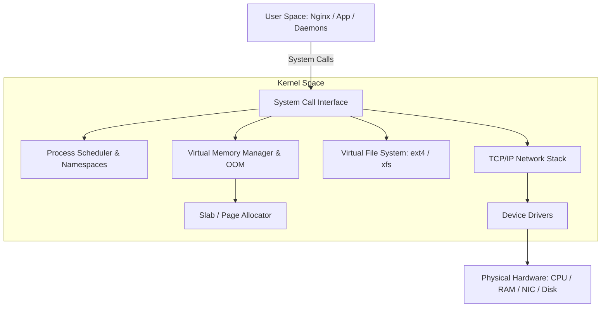

# Linux - Technical Study Guide & Notes

# Linux - Enterprise Production Systems Engineering & Kernel Hardening

## 1. Topic Introduction
Linux is the foundational operating system powering over 96.3% of the world's top one million web servers, container engines, and public cloud systems. For a senior professional, mastering Linux goes beyond basic administration; it requires a deep, architectural understanding of the kernel space, memory sub-systems, process lifecycles, virtual file systems (VFS), networking layers, and hardware-software abstractions.

## 2. Why This Topic is Critical for High-Availability Systems
In high-transaction, multi-tenant cloud environments, system reliability directly correlates with resource efficiency and kernel stability. SREs and Cloud Architects must know how to diagnose CPU starvation, memory leaks, I/O bottlenecks, and network buffer overflows. Misconfigured systems can trigger kernel panics, cascading process death, or prompt the Out-Of-Memory (OOM) Killer to terminate critical application processes like database engines or container daemons.

## 3. Real-World Enterprise Use Cases & Architecture
In multi-region Kubernetes clusters, Linux namespaces and cgroups (Control Groups) form the bedrock of container isolation.
An enterprise web-service cluster experiences sudden traffic surges. To handle this:
* The Linux kernel must accept incoming TCP sockets at high rates.
* Network devices must process interrupts efficiently across multiple CPU cores via Receive Packet Steering (RPS).
* File descriptors must scale dynamically to handle tens of thousands of concurrent client connections without leaking system resources.



## 4. Kernel Architecture & Core Subsystems
The Linux kernel uses a monolithic architecture but is highly modular. The main subsystems are:
1. **Process Scheduler**: Allocates CPU time slices to active execution threads using the Completely Fair Scheduler (CFS).
2. **Memory Manager (MM)**: Maps virtual memory addresses to physical RAM, manages page swapping, dirty-page flushing, and virtual page tables.
3. **Virtual File System (VFS)**: Abstract layer providing uniform file interface APIs across different underlying layouts (ext4, xfs, nfs).
4. **Network Stack**: Coordinates sockets, handles TCP sliding windows, routing tables, and netfilter rules (iptables/nftables).

## 5. Critical SRE Kernel Hardening & Performance Tuning
To prepare a Linux server for enterprise production traffic, key kernel parameters must be hardened via `/etc/sysctl.conf`. Below is a highly tuned configuration profile:

```ini
# /etc/sysctl.conf - Enterprise Production Hardening Profile

# Increase maximum system-wide open file descriptors (handles file/socket exhaustion)
fs.file-max = 2097152

# Adjust vm.swappiness to prevent aggressive disk swap-out of active application pages
vm.swappiness = 10

# Adjust dirty memory pages flushing to protect against high I/O write starvation
vm.dirty_background_ratio = 5
vm.dirty_ratio = 10

# Increase maximum socket backlog for high-volume TCP connection requests
net.core.somaxconn = 65535

# Increase maximum backlog of incoming network packets queued for process
net.core.netdev_max_backlog = 16384

# Increase TCP window sizes for high-throughput connections
net.ipv4.tcp_rmem = 4096 87380 16777216
net.ipv4.tcp_wmem = 4096 65536 16777216

# Prevent SYN flood attacks (TCP connection hijacking)
net.ipv4.tcp_syncookies = 1
net.ipv4.tcp_max_syn_backlog = 16384
net.ipv4.tcp_synack_retries = 2

# Maximize virtual memory areas allocation (essential for Elasticsearch and Databases)
vm.max_map_count = 262144
```

### Explanations of Core Kernel Tuning Parameters:
* **`fs.file-max`**: Defines the absolute limit on the number of file descriptors the kernel allocates system-wide. Under Linux, "everything is a file", including network sockets. Default limits are often too low (e.g. 1024 per shell), causing high-load applications to fail with "Too many open files" errors.
* **`vm.swappiness`**: Controls how aggressively the kernel moves memory pages from physical RAM onto the disk swap partition. A value of 60 is standard for desktops, but server platforms set this to 10 or lower (even 0 for databases) to avoid disk latency from hitting active memory blocks.
* **`net.core.somaxconn`**: Sets the maximum size of the listen backlog queue for established socket connections. If your web app (like Nginx) cannot process sockets fast enough, connections will be dropped if the queue exceeds this limit.

## 6. Process Lifecycle & Hardened Service Management
Processes transition through several distinct execution states:
* **Running/Runnable (R)**: Actively executing on a CPU or waiting in the CFS run queue.
* **Interruptible Sleep (S)**: Blocked waiting for an event or resource (e.g., standard network socket waiting for inputs).
* **Uninterruptible Sleep (D)**: Typically waiting for disk or network I/O. The process cannot be interrupted by signals (even `kill -9` will fail to terminate it).
* **Zombie (Z)**: Terminated processes whose parent has not yet read their exit code via the `wait()` system call.

### Hardened Production systemd Unit File
A modern microservice daemon should be isolated using systemd's built-in Linux sandboxing options:

```ini
[Unit]
Description=Enterprise High-Performance API Service
After=network.target

[Service]
Type=simple
User=api-worker
Group=api-worker
WorkingDirectory=/opt/apiservice
ExecStart=/opt/apiservice/bin/server --port 8080
Restart=always
RestartSec=5s

# --- SRE Sandboxing & Hardening ---
# Set open file descriptors limit for this specific service
LimitNOFILE=65535

# Mount /usr, /boot, /etc as read-only for this process
ProtectSystem=strict

# Prevent access to /home, /root, and /run/user directories
ProtectHome=yes

# Create an isolated /tmp namespace so this service cannot see standard system tmp files
PrivateTmp=yes

# Block the service from gaining new privileges via setuid binaries
NoNewPrivileges=yes

# Deny raw socket creations (prevents network sniffing)
RestrictAddressFamilies=AF_INET AF_INET6 AF_UNIX

# Restrict writes to kernel configurations
ProtectKernelTunables=yes
ProtectKernelModules=yes
ProtectControlGroups=yes
```

## 7. Advanced Diagnostics & Troubleshooting Commands
* **`lsof -p <PID>`**: Lists all open file descriptors (files, sockets, pipes) held by a specific process.
* **`strace -p <PID> -c`**: Attaches to a running process and counts system call invocations to pinpoint slow operations (like blocked reads).
* **`vmstat 1 5`**: Displays system statistics on memory, swap, disk I/O, interrupts, and CPU usage every second.
* **`iostat -xz 1 5`**: Displays extended disk device saturation, queue sizes (`avgqu-sz`), and disk wait times (`await`).
* **`tcpdump -i eth0 port 8080 -nn`**: Captures and prints network packet streams on port 8080 without translating hosts/ports to names.

## 8. SRE Troubleshooting: The Unlinked Open File Outage
**Scenario**: You receive a PagerDuty alert at 3:00 AM. Disk space on `/var` is reported at 100%. You log in, run `du -sh /var/*`, but the output shows only 12GB of used space on a 100GB disk partition. Where is the remaining 88GB?
* **RCA (Root Cause Analysis)**: A daemon (e.g. an application server writing to `/var/log/app.log`) was actively writing to a log file. A junior developer deleted the log file via `rm /var/log/app.log` to free up space.
* **Why this happens**: Under Linux, a file is only deleted from disk when:
  1. The link count drops to zero (e.g. `rm` removes the directory entry).
  2. The open file descriptor count held by running processes drops to zero.
* Since the application daemon was still running and had `/var/log/app.log` open, the kernel kept the file active on disk, but it was invisible to directory scanners like `du`.
* **Resolution**:
  1. Find the deleted but open file: `lsof +L1` or `lsof | grep deleted`.
  2. Locate the file descriptor path: `/proc/<PID>/fd/<FD_NUM>`.
  3. Instead of restarting the process (which might cause a production outage), truncate the active file descriptor to release the space:
     `cat /dev/null > /proc/<PID>/fd/<FD_NUM>`
  4. The disk space is immediately reclaimed, and the system is recovered safely.


# Linux - Industry-Grade Interview Preparation (20+ Q&A)

### Q1. What is the difference between a process in an 'Interruptible Sleep (S)' state vs an 'Uninterruptible Sleep (D)' state?
**Detailed Answer**: An 'Interruptible Sleep' process is blocked waiting for an event (like a socket packet or timeout) and will respond to OS signals (like SIGTERM or SIGKILL). An 'Uninterruptible Sleep' process is typically blocked in the kernel space waiting directly for hardware I/O operations (such as page faults, ext4 metadata writes, or NFS timeouts).
**Production Scenario**: If a network storage device (NFS mount) drops off, standard commands like `df -h` or `ls` will block. The processes accessing these paths will enter the 'D' state. They cannot be killed with `kill -9` since the kernel cannot deliver the signal until the hardware system call completes or times out.

### Q2. How do namespaces and cgroups differ, and how do they power container engines like Docker?
**Detailed Answer**: Namespaces provide **isolation**, while cgroups provide **resource limitation**. Namespaces hide resources from a process (PID namespace hides other processes, NET namespace isolates network interfaces, MNT namespace isolates mount trees). Control groups (cgroups) meter and restrict resources (CPU, Memory, Disk I/O, Network bandwidth) allocated to a process group.
**Production Scenario**: If a container experiences a memory leak, cgroups prevent it from consuming the entire host memory, triggering the OOM killer on the container itself rather than impacting the host kernel or neighboring pods.

### Q3. Why does 'df -h' report a partition is 100% full, but 'du -sh' of all directories indicates substantial free space?
**Detailed Answer**: This happens when large files are deleted (`rm`) but are still held open by a running process. The Linux kernel maintains the file on disk as long as a process has an open file descriptor pointing to it.
**Production Scenario**: A high-volume Java web server writes log files continuously. An operator runs `rm app.log` to clear disk space. The directory entry is removed, but the Java process still holds the open file handle. Disk space remains consumed. SREs resolve this by running `lsof | grep deleted` to find the process ID and then truncating the file descriptor path under `/proc/<PID>/fd/` without causing service downtime.

### Q4. What is a Zombie Process, and how do you resolve it?
**Detailed Answer**: A zombie process (Z state) is a process that has completed execution but still has an entry in the system process table. This entry is kept so the parent process can read the child's exit status. Zombies do not consume CPU or RAM, but they do consume system Process IDs (PIDs).
**Production Scenario**: If a parent process has a programming bug where it fails to invoke `wait()` or `waitpid()`, child processes will remain as zombies after exiting. To resolve this, you must send `SIGCHLD` to the parent process, or terminate the parent process (which forces the system `init` or `systemd` process to adopt the zombie child and clean it up).

### Q5. How does the kernel OOM Killer decide which process to terminate first when memory is exhausted?
**Detailed Answer**: The Out-of-Memory (OOM) Killer calculates an `oom_score` for every process, ranging from 0 to 1000. This score is based on the percentage of memory used by the process, plus its `oom_score_adj` adjustment value. The process with the highest score is terminated first.
**Production Scenario**: In Kubernetes, nodes protect critical components (like `kubelet` or `docker`) by setting negative `oom_score_adj` values (e.g. -998), ensuring the kernel terminates user application pods first when a node runs out of memory.

### Q6. How do you configure a process to bind to specific CPU cores?
**Detailed Answer**: This is known as CPU affinity and is configured using the `taskset` utility or programmatically via the `sched_setaffinity` system call.
**Production Scenario**: High-performance database engines or load balancers pin their threads to specific physical CPU cores to reduce context switching latency and optimize CPU L1/L2 cache locality.

### Q7. What are the differences between soft links and hard links?
**Detailed Answer**: A hard link is a direct reference to the file's underlying inode, meaning both links point to the same physical disk location and share the same permissions, size, and metadata. A soft link (symlink) is a separate file that contains a path pointer to another file.
**Production Scenario**: Hard links cannot span across different disk partitions or mount points and cannot link directories, whereas soft links can target any file, directory, or remote mount point across the system.

### Q8. What is the purpose of the VFS (Virtual File System) layer?
**Detailed Answer**: VFS is a kernel abstraction layer that provides a unified set of system call interfaces (like `read()`, `write()`, `open()`) to user-space applications, regardless of the underlying hardware storage format or filesystem type (ext4, xfs, nfs).
**Production Scenario**: This allows an SRE to swap local block storage for network file storage (NFS) without needing to rewrite any application code.

### Q9. What are the key steps in resolving a 'Too many open files' error on a production server?
**Detailed Answer**:
1. Check the system-wide descriptor count using `cat /proc/sys/fs/file-max`.
2. Check the per-user limits under `/etc/security/limits.conf` (ensure limits like `nofile 65535` are configured).
3. Find which process is leaking file descriptors: `lsof | awk '{print $2}' | sort | uniq -c | sort -nr`.
4. Inspect the process's current limits under `/proc/<PID>/limits` and adjust them dynamically if needed.
**Production Scenario**: An API service leaks database connection sockets due to a missing pool cleanup block. Over time, the sockets accumulate until they hit the per-process `nofile` limit, causing incoming connections to get rejected.

### Q10. How do you tune Linux network buffer pools for high-latency, high-bandwidth networks?
**Detailed Answer**: Tune the TCP socket read/write buffers (`net.ipv4.tcp_rmem` and `net.ipv4.tcp_wmem`) to increase the window sizes, ensuring the TCP window can hold enough data packets to saturate the link capacity (Bandwidth-Delay Product).
**Production Scenario**: Configuring multi-Gbps cross-region backups requires setting these buffers to peak values (e.g., up to 16MB) to ensure the network interface can stream data continuously without waiting for packet acknowledgments.

### Q11. Explain Page Cache and what happens when the kernel performs page reclamation.
**Detailed Answer**: Page Cache is the kernel's mechanism for caching disk read operations in physical RAM. When application memory demands increase, the kernel reclaims physical memory by writing dirty cache pages back to disk and freeing clean pages.
**Production Scenario**: An sudden memory allocation surge triggers intensive page reclamation, causing disk write saturation as dirty pages are flushed, leading to elevated application latency.

### Q12. What are system calls, and how do you monitor them in real-time?
**Detailed Answer**: System calls (syscalls) are the programmatic interfaces through which user-space applications request services from the kernel (e.g., `fork()`, `execve()`, `write()`, `socket()`). They are monitored using `strace` or `sysdig`.
**Production Scenario**: To diagnose why an application is taking 5 seconds to load a page, run `strace -c` on its process to find if it is blocked on file descriptor reads or slow network lookups.

### Q13. How does Receive Packet Steering (RPS) improve networking throughput under high traffic?
**Detailed Answer**: Under heavy traffic, processing all network packet interrupts on CPU core 0 can saturate the core, creating a bottleneck. RPS distributes packet processing interrupts programmatically across other available CPU cores.
**Production Scenario**: An Nginx load balancer handling 50,000 requests/sec configures RPS to bind packet queues across all cores, reducing packet drop rates to zero.

### Q14. What are dirty pages, and how does the kernel manage their sync rate?
**Detailed Answer**: Dirty pages are memory blocks that have been modified by user processes in RAM but have not yet been written back to physical disk storage. The kernel syncs them periodically using back-ground writeback threads controlled by `vm.dirty_background_ratio` and `vm.dirty_ratio`.
**Production Scenario**: If `vm.dirty_ratio` is set too high, massive amounts of data accumulate in RAM. When a sync is triggered, it blocks the VFS layer for several seconds, leading to system responsiveness freezes.

### Q15. How do you identify a CPU bottleneck caused by elevated System (sy) CPU usage vs User (us) CPU usage?
**Detailed Answer**: Use `top` or `vmstat`. Elevated User (us) usage indicates intensive application-level code executions (like parsing JSON or hashing). Elevated System (sy) usage indicates high kernel overhead (such as context switches, interrupts, or page table lookups).
**Production Scenario**: High context switching rates (often caused by running too many threads or virtual containers on small hosts) saturate the CPU in System (sy) space, reducing useful application execution time.

### Q16. How does cgroups v2 improve resource isolation over cgroups v1?
**Detailed Answer**: cgroups v2 provides a unified control hierarchy with a single root, eliminating the complex, overlapping controllers of v1. It implements proper resource accounting for shared objects like memory page caches.
**Production Scenario**: With cgroups v2, a container's memory accounting accurately includes writeback page caches, preventing processes inside container groups from escaping memory limits.

### Q17. How do you view active disk IO activity on a per-process basis?
**Detailed Answer**: Use `iotop` or look directly under the process's file system path: `/proc/<PID>/io`.
**Production Scenario**: A backend service begins to run slow. Running `iotop` reveals a background database compression thread is consuming 98% of write I/O bandwidth, prompting the SRE to limit the database IO priorities using `ionice`.

### Q18. What is the process descriptor table, and how does its size relate to system PIDs?
**Detailed Answer**: The process descriptor table contains data structures (`task_struct`) for every active task. The system PID limit represents the maximum index of this table, defined by `/proc/sys/kernel/pid_max`.
**Production Scenario**: A node runs out of PIDs due to a shell script fork-bomb, preventing the launching of any new processes (such as SSH logins) even if CPU and RAM usage are low.

### Q19. How do you troubleshoot high packet drops on a Linux network interface?
**Detailed Answer**: Run `ethtool -S <interface>` to view hardware statistics. Check ring buffer sizes using `ethtool -g` and increase them with `ethtool -G` if needed.
**Production Scenario**: Under bursts of traffic, packets are dropped at the network interface card buffer pool before reaching the TCP stack. Increasing the ring buffer size from 256 to 1024 resolves the drop.

### Q20. What is a system call filter, and how does it secure modern microservices?
**Detailed Answer**: System call filtering (seccomp) restricts which system calls a process can make (e.g. denying `execve` or `socket` calls).
**Production Scenario**: A containerized Python web application is compromised via remote code execution. Because its seccomp profile denies `execve`, the attacker is blocked from executing shell commands or downloading exploit payloads.
