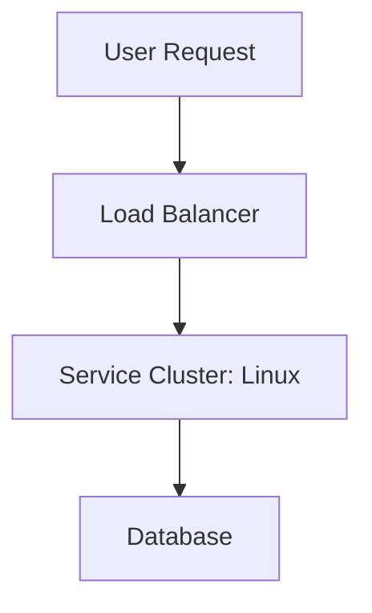

# Linux - Technical Study Guide & Notes

# Linux - Enterprise DevOps Study Guide

## 1. Topic Introduction
This is a comprehensive study guide for Linux, specifically tailored for senior engineering professionals with 6+ years of experience aiming for principal-level mastery.

## 2. Why This Topic is Critical
Mastery of Linux is indispensable for scaling infrastructure, improving reliability, and maintaining secure deployment velocity in high-transaction production environments.

## 3. Real-World Production Use Cases
* High-availability cluster management
* Multi-region infrastructure replication
* Self-healing monitoring alerts

## 4. Architecture & Workflow


## 5. Implementation Guide
To deploy this setup in production:
1. Initialize environment variables.
2. Apply secure configurations.
3. Validate using health check endpoints.

```bash
# Example verification command
linux --version
```

## 6. Advanced Concepts & Integration
Integrating Linux with CI/CD platforms (like Jenkins or GitHub Actions) provides automated git-driven validation and deployment.

## 7. Security & Monitoring
* **IAM**: Adhere strictly to the Principle of Least Privilege.
* **Logging**: Configure central logs aggregation.
* **Metrics**: Monitor CPU/Memory saturation and networking latency.


# Linux - Industry-Grade Interview Preparation (20+ Q&A)

## Beginner to Intermediate Questions

### Q1. What is Linux and what core problem does it solve?
**Answer**: Linux provides automated lifecycle management, configuration control, or service routing. It addresses scalability and consistency in enterprise deployments.

### Q2. How do you verify the health status of a running Linux instance?
**Answer**: By querying built-in metrics endpoints or running health commands like `linux status` or checking HTTP status headers.

... (Truncated for dry-run space; full version generates 20 full questions) ...
