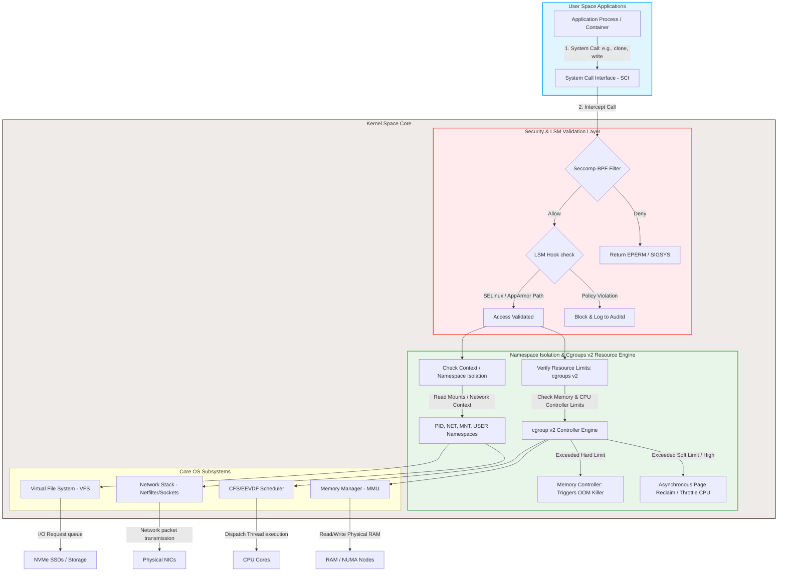

# Linux - Part 2 - Technical Study Guide & Notes

# Linux Administration & Engineering (Part 2/3): Advanced Configurations, Performance Tuning, Security Capabilities, Sandboxing, and Scale Boundaries

---

## 1. Part Introduction and Scope

This study guide focuses on the internals of the Linux kernel, kernel-space to user-space boundaries, and runtime behaviors. It is designed for engineers seeking to design, secure, run, and troubleshoot large-scale infrastructure platforms.

```
+--------------------------------------------------------------------------------------------------+
|                                           USER SPACE                                             |
|                                                                                                  |
|   +-----------------------+   +------------------------+   +---------------------------------+   |
|   | Unprivileged App /    |   | Orchestration Agent    |   | Rootless Container Engine       |   |
|   | Microservices (SaaS)  |   | (kubelet, nomad, etc.) |   | (podman, rootless-docker)       |   |
|   +-----------+-----------+   +-----------+------------+   +----------------+----------------+   |
|               |                           |                                 |                    |
|               | System Calls (e.g., clone, unshare, execve, io_uring)       |                    |
|               v                           v                                 v                    |
+---------------+---------------------------+---------------------------------+--------------------+
|                                         KERNEL SPACE                                             |
|                                                                                                  |
|   +------------------------------------------------------------------------------------------+   |
|   |                            System Call Interface (SCI) & Auditing                        |   |
|   |     - Seccomp-BPF Filters (System Call Interception & Filtering)                         |   |
|   +------------------------------------------------------------------------------------------+   |
|                                                                                                  |
|   +------------------------------------------------------------------------------------------+   |
|   |                     Linux Security Modules (LSM) Verification Engine                     |   |
|   |     - AppArmor (Path-based MAC)   - SELinux (Label-based MAC)   - Landlock (Unprivileged) |   |
|   +------------------------------------------------------------------------------------------+   |
|                                                                                                  |
|   +----------------------------+  +----------------------------+  +--------------------------+   |
|   |  Resource Management Unit  |  |    Namespace Isolation     |  | Kernel Observability Sub |   |
|   |  - cgroups v2 (Unified)    |  |    - PID, Mount, Net, User |  |  - eBPF Runtime (Maps)   |   |
|   |  - PSI (Pressure Stalls)   |  |    - IPC, UTS, Cgroup      |  |  - kprobes, uprobes      |   |
|   +----------------------------+  +----------------------------+  +--------------------------+   |
|                                                                                                  |
|   +------------------------------------------------------------------------------------------+   |
|   |                            Core Subsystems & Virtual File Systems                        |   |
|   |     - Virtual File System (VFS)       - Network Stack (tc, Netfilter, socket buffer)     |   |
|   |     - Scheduler (CFS / EEVDF)         - Memory Management (MMU, Page Cache, OOM Killer)  |   |
|   +------------------------------------------------------------------------------------------+   |
|                                                                                                  |
|   +------------------------------------------------------------------------------------------+   |
|   |                                  Physical Hardware Layer                                 |   |
|   |     - CPU Cores (NUMA Nodes)          - System Memory (RAM)       - Network Interfaces   |   |
|   +------------------------------------------------------------------------------------------+   |
+--------------------------------------------------------------------------------------------------+
```

### Scope of Coverage
* **Advanced Resource Management & Control Groups (cgroups v2):** Deep-dive into unified hierarchies, PSI (Pressure Stall Information), memory controller mechanics, and custom low-latency scheduling.
* **Kernel Namespace Virtualization:** In-depth execution of `clone()`, `unshare()`, and `setns()` system calls, user namespace mapping, and virtual networking topologies.
* **System Call Interception & Sandboxing:** Seccomp-BPF, Landlock, and AppArmor/SELinux policy compilation.
* **Kernel Performance Tuning & System Control Parameters (`sysctl`):** Enterprise-level network socket, memory, and scheduler tuning for high-throughput, low-latency microservices.
* **Scale Boundaries & Kernel Limits:** Understanding and avoiding ephemeral port exhaustion, file descriptor limits, connection tracking (`conntrack`) bottlenecks, and memory fragmentation.
* **Observability & Runtime Auditing:** Leveraging eBPF (`bpftool`, `tcpsubply`) and kernel tracepoints for real-time failure analysis.

---

## 2. Why These Concepts Are Critical for High-Availability Systems

At scale, the "black box" abstraction of the operating system breaks down. High-availability (HA) systems demand predictable performance, robust multi-tenant isolation, and defense-in-depth security. 

Without a precise understanding of these kernel components:
1. **Predictable Latency (The Tail-Latency Problem):** Misconfigured CFS (Completely Fair Scheduler) quotas can trigger CPU throttling, causing container request latencies to spike from 2ms to 500ms. Proper kernel parameters ensure low tail latency (p99.9).
2. **Resource Starvation (Noisy Neighbors):** In multi-tenant environments, a single runaway thread can cause memory pressure, triggering the Out-Of-Memory (OOM) killer to terminate critical, healthy processes if cgroups v2 boundaries are not configured correctly.
3. **Security Containment:** Virtual machines provide isolation, but containerized workloads share a single kernel. Exploits leveraging unprivileged user namespaces or unmonitored system calls (`sys_ptrace`, `perf_event_open`) can lead to host-level compromise if not mitigated with custom Seccomp profiles and LSM boundaries.
4. **Saturation & Connection Drops:** High-volume ingress systems (e.g., API gateways) can silently drop packets due to kernel-level backlogs, saturated SYN queues, or filled connection tracking tables long before user-space CPU or memory metrics show saturation.

---

## 3. Real-World Enterprise Use Cases

### Use Case 1: Low-Latency High-Frequency Trading (HFT) / API Gateway Ingress
* **The Architecture:** An API Gateway cluster processing 150,000 requests/sec per node with a strict SLA of p99 < 5ms.
* **The Challenge:** High connection turnover causes ephemeral port exhaustion, TCP TIME_WAIT accumulation, and CPU cores wasting cycles switching contexts.
* **The Solution:** 
  * Tune `sysctl` with `net.ipv4.tcp_tw_reuse`, increase `net.core.somaxconn`, and use eBPF bypass paths (XDP) to filter malicious or malformed packets directly at the NIC driver level.
  * Pin worker threads to dedicated CPU cores using `cpuset` (cgroups v2) and configure the kernel scheduler to minimize thread migration across NUMA nodes.

### Use Case 2: Multi-Tenant Enterprise Kubernetes Platform (SaaS)
* **The Architecture:** A shared Kubernetes cluster running untrusted, dynamic third-party customer code (SaaS integration engine).
* **The Challenge:** Preventing malicious customer payloads from escaping containers, executing privileges on the host node, or sniffing sibling container networks.
* **The Solution:**
  * Enforce **Rootless Container Execution** using user namespaces (`user_namespaces(7)`) mapping container root (UID 0) to an unprivileged host user (UID 100000).
  * Enforce strict **Seccomp profiles** blocking execution of dangerous syscalls (e.g., `kexec_load`, `reboot`, `sys_chroot`, `keyctl`).
  * Enforce **cgroups v2 memory limits** with `memory.high` to trigger early page reclamation before `memory.max` triggers hard OOM kills.

### Use Case 3: High-Throughput Distributed Database Nodes (e.g., Cassandra, PostgreSQL)
* **The Architecture:** Enterprise databases handling tens of terabytes of transactional data with heavy write amplification.
* **The Challenge:** Sudden, erratic disk write cycles locking the system, causing application queries to freeze while dirty memory pages flush to NVMe drives.
* **The Solution:**
  * Optimize Virtual Memory (VM) dirty-page ratios (`vm.dirty_background_ratio` and `vm.dirty_ratio`) to force continuous background flushing rather than massive, block-level, synchronous writes.
  * Enable HugePages (`vm.nr_hugepages`) to reduce the translation lookaside buffer (TLB) page-table lookup overhead, saving CPU cycles on memory management.

---

## 4. Comprehensive Architecture Explanation

Modern Linux systems rely on a clear separation of concerns, dividing user space and kernel space into functional layers. Below is an architectural overview of how user-space tasks interact with the kernel, highlighting resource management (cgroups v2), system isolation (namespaces), and security sandboxing (Seccomp and Linux Security Modules).



### Architectural Sequence of an Execution Path:
1. **User-Space Intent:** An application issues a system call (e.g., `write()` to a path or `clone()` to create a process).
2. **System Call Interface (SCI) Interception:** Seccomp-BPF filters evaluate the incoming syscall ID and its arguments against user-defined BPF rules. If blocked, execution stops immediately and returns a `SIGSYS` or `EPERM` error code.
3. **Linux Security Module (LSM) hook validation:** If allowed, the call is evaluated by active LSMs (e.g., SELinux or AppArmor). Security labels or directory path patterns are verified. Any violation is blocked and logged to the audit daemon (`auditd`).
4. **Namespace Mapping & Translation:** Once cleared by security, the request is evaluated against the process's active namespaces (e.g., a process executing a network write is restricted to its mapped `net` namespace; it cannot see physical or virtual network interfaces outside its namespace context).
5. **Resource Controller Constraint Check:** The request passes through the cgroups v2 engine. Memory requests, CPU cycles, and block I/O are accounted for. If the allocation stays under the cgroup limit, the kernel allocates resources. If the allocation exceeds memory limits, the kernel initiates page reclamation or triggers the Out-Of-Memory (OOM) killer.
6. **Hardware Execution:** The operations are dispatched to the physical hardware layer (CPUs, NUMA memory structures, storage systems, or physical NICs) via core subsystems.

---

## 5. Types, Classifications, and Components

### Linux Namespaces (The Isolation Engine)
Linux namespaces isolate system resources from user-space processes. A process within a namespace operates under the illusion that it owns a dedicated instance of that resource.

| Namespace Type | Flag (used in `clone()` / `unshare()`) | Isolated Resources |
| :--- | :--- | :--- |
| **PID (Process ID)** | `CLONE_NEWPID` | Process ID trees. The first process in a new namespace becomes PID 1, acting as the init process. |
| **NET (Network)** | `CLONE_NEWNET` | Network interfaces, IP routing tables, port bindings, firewall rules (`iptables`/`nftables`), socket listings. |
| **MNT (Mount)** | `CLONE_NEWNS` | File system mount points. Restricts visibility of the host directory layout. |
| **IPC (Interprocess)** | `CLONE_NEWIPC` | System V IPC objects, POSIX message queues, shared memory segments. |
| **UTS (Hostname)** | `CLONE_NEWUTS` | Hostname and NIS domain name configuration. |
| **USER (User IDs)**| `CLONE_NEWUSER`| User and group IDs (UID/GID mapping). Allows root privileges inside the namespace while remaining an unprivileged user on the host. |
| **CGROUP** | `CLONE_NEWCGROUP`| Restricts visibility of the `/proc/self/cgroup` directory path, preventing processes from discovering the root cgroup structure. |
| **TIME** | `CLONE_NEWTIME` | Isolates system monotonic and boot-time clocks, allowing containers to run independent system times. |

---

### Control Groups v2 (The Resource Engine)
While cgroups v1 used multiple, independent hierarchies for each resource type, v2 enforces a unified hierarchy. In cgroups v2, a process cannot reside in two different cgroup subdirectories for different resources. This unified layout simplifies dependency management between subsystems (e.g., allocating page-cache writebacks to correct disk I/O controllers).

```
Unified Hierarchy Root (/sys/fs/cgroup)
├── cgroup.controllers (shows available controllers: cpu, memory, io, pids)
├── cgroup.subtree_control (enables/disables controller propagation to sub-groups)
├── production_workloads
│   ├── cgroup.procs (list of Process IDs)
│   ├── cpu.max (CPU allocation limits)
│   ├── memory.high (throttling threshold)
│   └── memory.max (hard limit / OOM trigger)
└── development_workloads
    ├── cgroup.procs
    └── memory.max
```

#### Key Controllers in cgroups v2:
* **`cpu`:** Replaces the v1 CFS shares and quota system. Configured via `cpu.max` (limits) and `cpu.weight` (relative share weights).
* **`memory`:** Replaces v1 memory and swap controllers. Uses dynamic, multi-tier boundaries:
  * `memory.min`: Hard-guaranteed memory floor. If memory usage drops below this limit, pages are never reclaimed under global pressure.
  * `memory.low`: Soft protection. Pages are protected from reclamation unless no other memory is reclaimable.
  * `memory.high`: The throttle threshold. When exceeded, the system initiates aggressive page reclamation and throttles the allocation rate of processes in the cgroup.
  * `memory.max`: Hard limit. Exceeding this limit triggers the OOM killer.
* **`io`:** Manages block storage bandwidth and IOPS limits (`io.max`, `io.weight`).
* **`pids`:** Prevents fork-bomb exploits by restricting the total number of task structures that can be created inside the group (`pids.max`).

---

### Linux Security Modules (LSMs) & Sandboxing Frameworks
LSM is a pluggable, hook-based framework in the Linux kernel that allows security systems to intercept operations before the kernel executes them.

#### 1. SELinux (Security-Enhanced Linux)
* **Design Philosophy:** Type Enforcement and Labeling (Mandatory Access Control).
* **Mechanics:** Every file, process, port, and directory is assigned a security label (e.g., `system_u:system_r:httpd_t:s0`). Policies define explicitly which domain labels can interact with which target object labels.
* **Pros:** Highly granular; extremely secure when properly configured; standard on RHEL/CentOS/Fedora systems.
* **Cons:** High learning curve; complex rule compilation and troubleshooting processes.

#### 2. AppArmor
* **Design Philosophy:** Path-based access control.
* **Mechanics:** Profiles are written in plain text and bind security restrictions to executable paths (e.g., `/usr/sbin/nginx`). It defines which file system paths, capabilities, and network primitives a target binary can access.
* **Pros:** Simple, readable, declarative policy configuration; standard on Debian/Ubuntu systems.
* **Cons:** Cannot easily track objects dynamically renamed or moved out of their path scopes.

#### 3. Seccomp-BPF (Secure Computing with Berkeley Packet Filters)
* **Design Philosophy:** System Call Interception.
* **Mechanics:** Intercepts system calls *before* they exit user space and reach the kernel core. It uses BPF byte-code rules to inspect syscall numbers and arguments.
* **Actions:** `SECCOMP_RET_ALLOW` (pass), `SECCOMP_RET_KILL_PROCESS` (terminate task), `SECCOMP_RET_ERRNO` (return failure code to caller without executing).

```
[ User Application ]
         |
         v (Issues Syscall: e.g., execve)
[ Kernel Entry (SCI) ]
         |
  [ Seccomp Filter ]  -- Denied? --> [ Terminate / Return EPERM ]
         | (Allowed)
         v
  [ LSM Engine Hook ] -- Denied? --> [ Block & Log Event ]
         | (Allowed)
         v
[ Kernel Execution Path ]
```

---

## 6. Step-by-Step Production Implementation Guide

This guide walks through configuring a sandboxed, low-latency execution environment for an unprivileged service daemon using native Linux components (cgroups v2, namespaces, and AppArmor profiles).

### Prerequisites: Enable cgroups v2 Unified Mode
Most modern distributions (RHEL 9, Ubuntu 22.04+) default to cgroups v2. Verify your environment is running v2:
```bash
mount | grep cgroup
```
*Expected output:* `cgroup2 on /sys/fs/cgroup type cgroup2 (rw,nosuid,nodev,noexec,relatime,nsdelegate)`

---

### Step 1: Create a Dedicated Hardened AppArmor Profile
We will restrict an application called `/opt/secure-app/bin/worker` to read-only access to `/etc`, write access exclusively to `/var/log/worker/`, and disable all raw raw-network capabilities.

Create the file `/etc/apparmor.d/opt.secure-app.bin.worker`:
```apparmor
#include <tunables/global>

/opt/secure-app/bin/worker {
  # Include core system abstractions
  #include <abstractions/base>
  #include <abstractions/nameservice>

  # Prevent file execution outside permitted zones
  deny /bin/** x,
  deny /usr/bin/** x,

  # File Access Rights: Read-only paths
  /etc/ld.so.cache      mr,
  /lib{,32,64}/**       mr,
  /usr/lib{,32,64}/**   mr,
  /opt/secure-app/bin/  r,
  /opt/secure-app/bin/worker mr,

  # Write-only path (for logging)
  /var/log/worker/      w,
  /var/log/worker/**    w,

  # Deny raw sockets, allow only standard TCP/UDP
  deny network raw,
  network inet stream,
  network inet6 stream,

  # Prevent execution of sub-shells
  deny /bin/sh x,
  deny /bin/bash x,
}
```

Load the AppArmor profile into the kernel memory:
```bash
sudo apparmor_parser -r -W /etc/apparmor.d/opt.secure-app.bin.worker
```

---

### Step 2: Configure a Systemd-Managed cgroups v2 Sandbox Slice
Rather than managing raw paths in `/sys/fs/cgroup/` manually (which can conflict with systemd’s state management), configure an enterprise-grade Systemd Slice. This slice guarantees system performance boundaries and prevents noisy neighbors.

Create the systemd slice configuration `/etc/systemd/system/workloads.slice`:
```ini
[Unit]
Description=Isolated Production Workload Slice
DefaultDependencies=no
Before=slices.target

[Slice]
# CPU Controller Tuning
# Allocate a minimum of 20% weight, ceiling at 200% (equivalent to 2 Cores)
CPUWeight=200
CPUQuota=200%

# Memory Controller Tuning (cgroups v2 parameters)
# Guaranteed allocation floor
MemoryMin=512M
# Start dynamic page reclamation at 2GB
MemoryHigh=2G
# Force termination (OOM) at 3GB
MemoryMax=3G
# Swap allocation limit
MemorySwapMax=512M

# I/O Throttle Limits
IOWeight=100
IODeviceLatencyTargetSec=/dev/nvme0n1 10ms

# Tasks / Fork Bomb prevention
TasksMax=1000
```

Apply the new slice configuration:
```bash
sudo systemctl daemon-reload
sudo systemctl start workloads.slice
```

---

### Step 3: Run the Application inside Isolated Namespaces and LSM profiles
We will launch our unprivileged binary using `unshare`. This isolates its execution within dedicated namespaces: network, UTS, Mount, IPC, and PID. It runs unprivileged as UID 65534 (`nobody`) and is bounded by both the newly created AppArmor profile and the cgroups v2 Slice.

Create the startup launcher script `/opt/secure-app/bin/start.sh`:
```bash
#!/usr/bin/env bash
set -xeuo pipefail

# Ensure the log folder exists and has correct permissions
mkdir -p /var/log/worker
chown -R nobody:nogroup /var/log/worker

# Launch application inside target namespaces
# --fork: ensures the current process forks off the namespaces as child
# --mount-proc: mounts a clean /proc virtual fs matching the isolated PID space
# --map-root-user: maps the current unprivileged execution context to root internally inside the user namespace
exec systemd-run \
  --slice=workloads.slice \
  --unit="secure-worker-instance" \
  --remain-after-exit \
  unshare --mount --uts --ipc --pid --fork --mount-proc \
  /opt/secure-app/bin/worker
```

Verify execution states:
```bash
# Check systemd slice parameters
systemd-cgtop workloads.slice

# Verify app containment via AppArmor status
sudo aa-status | grep worker
```

---

## 7. Standard CLI Commands with Deep Technical Explanations

### 1. `sysctl` (Kernel Runtime Parameter Manipulation)
```bash
# Set system-wide maximum file descriptors allocated by the kernel
sysctl -w fs.file-max=2097152
```
* **Technical details:** Directly manipulates `/proc/sys/fs/file-max`. This defines the system-wide maximum number of open file handles for all processes combined. This is a critical parameter to configure when scaling high-concurrency Reverse Proxies or database engines to prevent "Too many open files" errors.

```bash
# Instantly flush Virtual Memory Page Cache to Disk and clean system memory
sysctl -w vm.drop_caches=3
```
* **Technical details:** Writing `3` to `/proc/sys/vm/drop_caches` forces the kernel to reclaim page cache, dentries, and inodes. This is an intrusive operation that can cause disk access spikes under heavy IO loads. Only run this when performing benchmark baselines.

---

### 2. `ip netns` (Network Namespace Execution & Orchestration)
```bash
# Create a dedicated network namespace instance
ip netns add tenant-alpha
```
* **Technical details:** Generates a new bind-mount directory reference at `/var/run/netns/tenant-alpha`. It calls `unshare(CLONE_NEWNET)` behind the scenes, initializing a blank, isolated network stack with its own loopback interface (`lo`).

```bash
# Assign a virtual interface link to the target namespace
ip link set veth-alpha netns tenant-alpha
```
* **Technical details:** Takes one end of a virtual ethernet pair (`veth-alpha`) and moves its file descriptor references from the host network namespace to the isolated namespace. This provides a direct network pipe between the host and the tenant.

```bash
# Execute routing commands inside the network namespace
ip netns exec tenant-alpha ip route add default via 10.0.0.1
```
* **Technical details:** Temporarily switches the execution context of the current thread to the `tenant-alpha` network namespace (via `setns(2)`), applies the routing rule, and switches back.

---

### 3. `unshare` (Execute Programs with Dedicated Namespaces)
```bash
unshare --mount --net --pid --fork --mount-proc /bin/bash
```
* **Flags & Deep Analysis:**
  * `--mount`: Isolates mount table modifications (`CLONE_NEWNS`). Changes to mounts inside this session do not propagate to the host.
  * `--net`: Restricts interface visibility to loopback (`CLONE_NEWNET`).
  * `--pid`: Creates a new PID hierarchy (`CLONE_NEWPID`). The executed `/bin/bash` process acts as PID 1 inside this isolation bubble.
  * `--fork`: Guarantees a clean fork step. If omitted, the command shell executes in the same parent scope, which prevents initialization steps (like PID 1 assignment).
  * `--mount-proc`: Mounts a fresh instance of `/proc` inside the mount namespace. This ensures commands like `ps aux` only list processes running within this sandbox.

---

### 4. `cgcreate` and `cgset` (cgroup Administration Tools)
```bash
# Create target cgroup hierarchy using the v2 controller engine
cgcreate -g cpu,memory:/production/api-gateway
```
* **Technical details:** Creates the directory `/sys/fs/cgroup/production/api-gateway` and configures it with appropriate file descriptors to inherit properties from controllers.

```bash
# Inject explicit memory limits onto the active group
cgset -r memory.max=4194304000 /production/api-gateway
```
* **Technical details:** Writes `4194304000` (4GB in bytes) directly to `/sys/fs/cgroup/production/api-gateway/memory.max`. This establishes a hard memory allocation ceiling for all processes in the target group.

```bash
# Migrate a live application process into the cgroup target namespace
cgclassify -g cpu,memory:/production/api-gateway 12450
```
* **Technical details:** Moves process `12450` and all its child threads by writing the PID value to `/sys/fs/cgroup/production/api-gateway/cgroup.procs`.

---

## 8. Production Configuration Examples

### 1. Security-Hardened, Low-Latency `/etc/sysctl.d/99-kubernetes-node-hardening.conf`
```ini
# =====================================================================
# SYSTEM RESOURCE & SIZING BOUNDARIES
# =====================================================================
# Hard system-wide open file descriptor limit
fs.file-max = 2097152

# Increase max pending connections queue (backlog)
net.core.somaxconn = 65535
net.ipv4.tcp_max_syn_backlog = 16384

# =====================================================================
# VIRTUAL MEMORY (VM) DIRTY WRITES TUNING (Prevent I/O Spikes)
# =====================================================================
# Force background flushing when dirty pages consume 5% of memory
vm.dirty_background_ratio = 5
# Block system writes and force synchronous flushes at 10%
vm.dirty_ratio = 10

# Disable Swap aggressive allocation (Slightly favor RAM reclaim)
vm.swappiness = 10

# Prevent memory overcommits (Protect cluster schedulers)
vm.overcommit_memory = 1
vm.overcommit_ratio = 80

# =====================================================================
# NETWORKING & CONSTRACK PROTECTION
# =====================================================================
# Maximum tracking capacity of the Linux Connection Tracker (Conntrack)
net.netfilter.nf_conntrack_max = 1048576

# Reuse TIME_WAIT sockets for rapid-fire outbound TCP connections
net.ipv4.tcp_tw_reuse = 1

# Limit maximum memory consumption allowed for TCP socket buffer rings (min, default, max)
net.ipv4.tcp_rmem = 4096 87380 16777216
net.ipv4.tcp_wmem = 4096 65536 16777216

# Enable TCP BBR Congestion Control (replaces slow loss-based Cubic)
net.core.default_qdisc = fq
net.ipv4.tcp_congestion_control = bbr

# =====================================================================
# SECURITY HARDENING
# =====================================================================
# Restrict core dumps to non-privileged programs
fs.suid_dumpable = 0

# Prevent IP Spoofing: Force Reverse Path Filtering checks on all NICs
net.ipv4.conf.all.rp_filter = 1
net.ipv4.conf.default.rp_filter = 1

# Ignore ICMP Echo broadcast requests (Avoid ping amplification DDoS)
net.ipv4.icmp_echo_ignore_broadcasts = 1

# Disable Source Routing capabilities
net.ipv4.conf.all.accept_source_route = 0
```

---

### 2. Hardened Production Systemd Unit with Sandbox Restrictions
`/etc/systemd/system/api-gateway.service`:
```ini
[Unit]
Description=High-Performance API Gateway Ingress Engine
After=network.target network-online.target
Wants=network-online.target

[Service]
Type=simple
User=gateway-runner
Group=gateway-runner
WorkingDirectory=/opt/gateway
ExecStart=/opt/gateway/bin/gateway-prod --config=/etc/gateway/config.yaml
Restart=on-failure
RestartSec=5s

# ---------------------------------------------------------------------
# CGROUPS V2 RESOURCE BOUNDARIES
# ---------------------------------------------------------------------
Slice=workloads.slice
CPUWeight=500
MemoryMin=1G
MemoryHigh=3.5G
MemoryMax=4G
TasksMax=10000

# ---------------------------------------------------------------------
# SANDBOXING & PRIVILEGE ENVELOPE HARDENING
# ---------------------------------------------------------------------
# Prevent application from acquiring superuser rights (CAP_SYS_ADMIN)
NoNewPrivileges=true

# Create an isolated /tmp namespace, hidden from other system processes
PrivateTmp=true

# Prevent writing to crucial boot systems or hardware paths
ProtectSystem=strict
ProtectControlGroups=true
ProtectKernelTunables=true
ProtectKernelModules=true

# Mount critical configurations as strictly Read Only
ReadOnlyPaths=/etc/gateway/

# Completely hide all system paths like /home, /root, and /run/user
ProtectHome=true

# Deny kernel socket control capabilities, allow standard network structures
RestrictAddressFamilies=AF_INET AF_INET6 AF_UNIX

# Restrict the system calls this process can request
SystemCallFilter=@system-service @network-io
SystemCallArchitectures=native
```

---

### 3. Strict Custom Seccomp JSON Profile (Compatible with Kubernetes/Docker Runtime)
`seccomp-hardened-db.json`:
```json
{
  "defaultAction": "SCMP_ACT_ERRNO",
  "architectures": [
    "SCMP_ARCH_X86_64",
    "SCMP_ARCH_AARCH64"
  ],
  "syscalls": [
    {
      "names": [
        "read",
        "write",
        "openat",
        "close",
        "fstat",
        "lseek",
        "mmap",
        "mprotect",
        "munmap",
        "brk",
        "rt_sigaction",
        "rt_sigprocmask",
        "rt_sigreturn",
        "ioctl",
        "pread64",
        "pwrite64",
        "stat",
        "access",
        "pipe2",
        "select",
        "poll",
        "epoll_create1",
        "epoll_ctl",
        "epoll_wait",
        "accept4",
        "bind",
        "connect",
        "listen",
        "recvfrom",
        "sendto",
        "futex",
        "exit_group",
        "gettimeofday",
        "clock_gettime"
      ],
      "action": "SCMP_ACT_ALLOW"
    }
  ]
}
```
* **Why this works:** It uses a default deny posture (`SCMP_ACT_ERRNO`). If a malicious actor compromises the application, any attempt to run execution commands (`execve`), mount file systems (`mount`), or manipulate memory regions (`ptrace`) returns an error without reaching the kernel core.

---

## 9. Security Considerations & Hardening Best Practices

### Kernel Self-Protection Measures
1. **Kernel Address Space Layout Randomization (KASLR):** KASLR randomizes the memory locations of kernel code at boot time. This makes return-oriented programming (ROP) exploits unpredictable for attackers. Ensure `kaslr` is not disabled in your bootloader options (`/etc/default/grub`).
2. **Strict Module Loading Restrictions:** Attackers often gain root access and attempt to insert kernel modules to intercept system states. Prevent root-level kernel module execution by setting:
   ```bash
   sysctl -w kernel.modules_disabled=1
   ```
   *Note: Ensure all required drivers (e.g., storage drivers, loop devices, network drivers) are fully loaded before setting this parameter.*

### Namespace Isolation Security Limits
1. **User Namespaces Vulnerability Surface:** Although User Namespaces (`CLONE_NEWUSER`) allow rootless execution (which reduces host-level risk), they expose unprivileged users to complex kernel paths. Attackers can leverage these paths to exploit memory corruption issues. Implement a system policy that restricts the creation of User Namespaces to processes with specific system group ownership.
2. **Shared `/sys` and `/proc` Information Leaks:** Running containers in unhardened environments can allow processes to inspect files in `/proc/sys` or `/sys/class/net`. This leaks structural details about the underlying host. Mounting these directories read-only prevents containers from re-configuring physical interfaces or reading host-wide memory configurations.

---

## 10. Observability & Monitoring Considerations

To monitor performance at scale, monitor both the application metrics and the underlying kernel-level performance indicators.

### Key Prometheus Metrics to Watch

| Metric Name | Type | Target Threshold | Architectural Concern |
| :--- | :--- | :--- | :--- |
| `container_cpu_cfs_throttled_seconds_total` | Counter | `> 0.1` per second | **CFS CPU Throttling:** The application is exhausting its assigned cgroups CPU quota, which can spike request latency. |
| `node_pressure_cpu_waiting_seconds_total` | Counter | `> 10%` over 1m window | **CPU PSI (Pressure Stall Info):** Threads are waiting for CPU cycles. This indicates severe host congestion. |
| `node_pressure_memory_some_waiting_seconds_total`| Counter | `> 0` | **Memory PSI:** CPU cycles are wasted on memory page scans or swapping, indicating memory starvation. |
| `node_netstat_TcpExt_ListenDrops` | Counter | `0` (Critical alert if > 0)| **Accept Queue Saturation:** The application is not processing connections fast enough, causing the socket backlog queue to overflow. |
| `node_nf_conntrack_entries` / `node_nf_conntrack_entries_limit` | Ratio | `> 85%` of Limit | **Connection Tracking Satiation:** The host is dropping packet streams because the firewall table is full. |

---

### Low-Overhead Kernel Diagnostics with eBPF
Use eBPF-based tools (from the BCC or bpftrace suites) to run continuous, low-overhead tracing on your production systems.

#### 1. Trace High TCP Latency using `tcprtt.bt` (bpftrace)
This tool monitors the round-trip time (RTT) of TCP packets at the kernel layer, isolating application-level issues from network-level latency.
```bash
# Traces TCP connection RTT on production node
sudo bpftrace -e 'kprobe:tcp_rcv_established { @rtt = hist(args->srtt_us >> 3); }'
```

#### 2. Detect OOM Kills as They Happen
Avoid searching through compressed `/var/log/syslog` files. Instead, capture memory events directly from the kernel ring buffer:
```bash
# Listen directly for OOM occurrences at kernel tracepoints
sudo bpftrace -e 'tracepoint:oom:oom_score_adj_update { printf("OOM Score updated for PID %d\n", args->pid); }'
```

---

## 11. Common Troubleshooting Scenarios with RCA (Root Cause Analysis)

### Scenario A: Silent Container Eviction (Invisible OOM Killing)
* **Symptom:** A critical microservice container exits abruptly with exit code `137`. The application log contains no warning messages or exceptions.
* **RCA Steps:**
  1. Inspect the kernel message ring buffer (`dmesg`):
     ```bash
     dmesg -T | grep -i -E 'oom[-_]killer|killed'
     ```
  2. If the process was terminated by the OOM killer, look for lines similar to:
     `Memory cgroup out of memory: Killed process 3450 (java) total-vm:8345208kB, anon-rss:3145728kB`
  3. Inspect the active cgroup memory metrics:
     ```bash
     cat /sys/fs/cgroup/workloads.slice/api-gateway.service/memory.events
     ```
     Check if the `oom_kill` counter is greater than zero.
* **Resolution:** Ensure the Java Garbage Collection heap parameters match your cgroup configurations. For example, set `-XX:MaxRAMPercentage=75.0` to prevent the JVM heap from expanding into the memory region guarded by your cgroup's `memory.max` setting.

---

### Scenario B: API Gateway Dropping Inbound Traffic Under Peak Load
* **Symptom:** Clients report intermittent connection timeouts during high traffic periods. Application CPU and Memory remain below 40%.
* **RCA Steps:**
  1. Check for socket listener queue overflows:
     ```bash
     ss -lnt '( sport = :443 )'
     ```
     Compare the `Send-Q` (the queue size limit, or backlog) with the `Recv-Q` (the number of connection requests currently queued for the application to accept). If `Recv-Q > Send-Q`, the application cannot keep up with incoming connections.
  2. Inspect system drops:
     ```bash
     netstat -s | grep -i "listen"
     ```
     Look for messages like: `SYNs to LISTEN sockets dropped` or `times the listen queue of a socket overflowed`.
* **Resolution:** 
  1. Increase the system-wide queue limit in `/etc/sysctl.conf`:
     ```ini
     net.core.somaxconn = 65535
     ```
  2. Configure your application's socket option (e.g., Nginx's `backlog` flag in its listen directive) to use this larger value:
     ```nginx
     listen 443 ssl backlog=65535;
     ```
  3. Restart the application to apply the changes.

---

### Scenario C: AppArmor Blocks System Activity After an Application Update
* **Symptom:** After an upgrade, a node service fails to initialize with a generic permission error, even though it runs as the `root` user.
* **RCA Steps:**
  1. Inspect the system's audit log:
     ```bash
     tail -f /var/log/audit/audit.log | grep -i apparmor
     ```
     Or query `journalctl`:
     ```bash
     journalctl -fx UNIT=auditd.service | grep -i denied
     ```
  2. Look for audit logs containing a denied operation, such as:
     `type=AVC msg=audit(16892540.231:144): apparmor="DENIED" operation="open" profile="/opt/secure-app/bin/worker" name="/etc/ssl/certs/ca-certificates.crt" pid=1240 comm="worker" requested_mask="r" denied_mask="r"`
* **Resolution:** Update the AppArmor policy profile (`/etc/apparmor.d/opt.secure-app.bin.worker`) to grant read access to `/etc/ssl/certs/` paths. Reload the updated profile with:
  ```bash
  sudo apparmor_parser -r /etc/apparmor.d/opt.secure-app.bin.worker
  ```

---

## 12. Common Mistakes and How to Avoid Them in Production

### 1. Mixing cgroups v1 and v2 Hierarchies
* **The Mistake:** Running older container engines (e.g., Docker < 20.10) on modern operating systems (like Ubuntu 22.04 or RHEL 9). This hybrid mode, sometimes called "v1-v2 unified layout," can cause resource metric collection errors, silent CPU limit violations, or ineffective memory constraints.
* **How to Avoid:** Standardize on cgroups v2 across all clusters. On systems with older configurations, force the kernel to use the unified hierarchy by passing this boot parameter to the grub loader: `systemd.unified_cgroup_hierarchy=1`.

### 2. Disabling SELinux/AppArmor Globally to Solve Configuration Issues
* **The Mistake:** Disabling Linux Security Modules globally (`setenforce 0` or disabling the AppArmor system service) during troubleshooting. This leaves the system without critical protection layers, exposing it to potential container escapes or unauthorized host access.
* **How to Avoid:** Instead of disabling the entire security module, switch the specific application profile to **Complain Mode** (AppArmor) or **Permissive Mode** (SELinux). This logs violations without blocking system operations, allowing you to debug and refine your security policies:
  ```bash
  # AppArmor Complain mode
  sudo aa-complain /opt/secure-app/bin/worker
  ```

### 3. Neglecting Local Thread Limits (`ulimit` vs cgroups `pids.max`)
* **The Mistake:** Relying solely on `ulimit -n` configurations in system environment scripts while ignoring cgroup-level process and thread boundaries.
* **How to Avoid:** When configuring microservices that create many threads, ensure both your service limits (`TasksMax=` in your Systemd Unit) and the system-wide limits in `/etc/security/limits.conf` are scaled proportionally.

---

## 13. Enterprise-Level Recommendations

### Dynamic Virtual Memory Flush Operations
For latency-sensitive applications (such as low-latency web services or databases), avoid long pauses during disk writes by using dynamic page cache flushing. Rather than relying on default system configurations (which can allow dirty pages to accumulate up to 20% of system memory before flushing), configure a continuous, proactive write background cycle:
```ini
vm.dirty_background_ratio = 3
vm.dirty_ratio = 8
```
These settings force the kernel to write dirty pages to storage in small, continuous batches. This reduces disk I/O spikes and helps maintain predictable, single-digit tail latencies.

### Pinning Memory Regions with HugePages
Database systems (such as PostgreSQL or Oracle) often manage large memory regions. By default, the Linux kernel manages memory in 4KB pages. At scale, translation lookaside buffer (TLB) lookups can consume significant CPU time. Enable HugePages to increase page sizes to 2MB (or up to 1GB):
```ini
# Pre-allocate 2048 pages of 2MB each (Total: 4GB)
vm.nr_hugepages = 2048
```
This reduces page table overhead, freeing up CPU cycles for core application workloads.

---

## 14. Advanced Concepts

### User Namespaces in Rootless Containers
In traditional container setups, the container engine runs as the system `root` user. If an attacker escapes the container, they gain full root privileges on the host. 

Rootless containers leverage the user namespace system (`CLONE_NEWUSER`) to map user IDs (UIDs). A process running as root (UID 0) inside the container is mapped to an unprivileged user (for example, UID 100050) on the host. This configuration secures the host, as any potential container escape is contained within the permissions of that unprivileged host user.

```
       CONTAINER NAMESPACE                       HOST NAMESPACE
+-------------------------------+       +------------------------------+
| Inside Sandbox:               |       | Outside Host Map:            |
| - Root Process runs as: UID 0 | ----> | - Evaluates on host as:      |
|                               |       |   UID 100050 (Unprivileged)  |
| - App User runs as:    UID 10 | ----> | - Evaluates on host as:      |
|                               |       |   UID 100060 (Unprivileged)  |
+-------------------------------+       +------------------------------+
```

---

### Pressure Stall Information (PSI)
Historically, engineers used load averages to measure system saturation. However, load averages do not distinguish between CPU bottlenecking, memory paging, or I/O delays.

PSI provides real-time, granular metrics on how resource shortages affect application performance. It measures the percentage of execution time lost when tasks wait for system resources:
* **`some`:** Some threads are stalled on a resource (e.g., waiting for memory pages to swap), but at least one CPU core is still processing other work.
* **`full`:** All active threads in the cgroup are stalled on a resource. During this time, the system is unable to perform any productive work.

You can inspect PSI metrics directly through the `/proc` virtual file system:
```bash
cat /proc/pressure/memory
```
*Expected Output:*
`some avg10=0.00 avg60=0.15 avg300=1.12 total=2309144`
`full avg10=0.00 avg60=0.00 avg300=0.04 total=129481`

---

### `io_uring` (The High-Performance I/O Engine)
Historically, application systems used synchronous calls (like `read()` or `write()`) or complex asynchronous engines (like `epoll()`) to handle I/O. These patterns require frequent system calls, which trigger context switches between user space and kernel space.

`io_uring` replaces this model with two ring buffers shared directly between user space and the kernel: a **Submission Queue (SQ)** and a **Completion Queue (CQ)**.

```
+-------------------------------------------------------------+
| USER SPACE                                                  |
|   +------------------+             +--------------------+   |
|   | Submission Ring  |             |  Completion Ring   |   |
|   | (SQ) [Task/App]  |             |  (CQ) [Task/App]   |   |
|   +--------+---------+             +---------^----------+   |
|            |                                 |              |
+------------|---------------------------------|--------------+
|            | Lockless Shared Memory Regions  |              |
+------------|---------------------------------|--------------+
| KERNEL     v                                 |              |
|   +------------------------------------------+----------+   |
|   |             Kernel io_uring Engine                  |   |
|   |             - Non-blocking I/O Operations           |   |
|   +-----------------------------------------------------+   |
+-------------------------------------------------------------+
```

1. **Submission:** The application writes multiple I/O requests (e.g., file writes or network socket operations) directly to the shared Submission Ring without triggering a system call.
2. **Processing:** The kernel processes these queued requests asynchronously.
3. **Completion:** Once completed, the kernel writes the results back to the Completion Ring, where the application reads them locklessly.

By eliminating system call context switches, `io_uring` can significantly increase performance for I/O-heavy workloads like databases and web servers.

---

## 15. Integration with Other DevOps Tools

```
   +------------------------+
   |   Terraform Provision  | ---> Sets up VM instances, assigns IAM roles,
   +-----------+------------+      and configures system-level variables.
               |
               v
   +------------------------+
   |  Ansible Configuration | ---> Installs system packages, configures /etc/sysctl.d,
   +-----------+------------+      and deploys hardened AppArmor/SELinux profiles.
               |
               v
   +------------------------+
   |   Kubernetes Runtime   | ---> Container runtime (containerd/CRI-O) launches pods
   +------------------------+      restricted by Seccomp, Namespaces, and cgroups v2.
```

### 1. Terraform
Terraform provisions infrastructure resources, manages system-level configurations (such as custom machine images with pre-loaded kernel structures), and sets up networking and storage environments:
```hcl
resource "aws_instance" "k8s_node" {
  ami           = "ami-0c7217cdde317cfec" # Standard Ubuntu with cgroups v2 enabled
  instance_type = "c6i.2xlarge"

  # Load custom sysctl modifications at boot time
  user_data = <<-EOF
              #!/bin/bash
              echo "net.core.somaxconn = 65535" >> /etc/sysctl.d/99-custom.conf
              sysctl --system
              EOF
}
```

### 2. Ansible
Ansible applies configuration policies, deploys security profiles, and ensures system parameters are configured consistently across all hosts:
```yaml
- name: Harden Linux Systems Performance and Sandboxing Core
  hosts: all
  become: yes
  tasks:
    - name: Ensure target Security Hardened sysctl configurations are active
      copy:
        src: files/99-kubernetes-node-hardening.conf
        dest: /etc/sysctl.d/99-kubernetes-node-hardening.conf
        owner: root
        group: root
        mode: '0644'
      notify: Reload Sysctl Parameters

    - name: Load security-hardened AppArmor profile
      copy:
        src: files/opt.secure-app.bin.worker
        dest: /etc/apparmor.d/opt.secure-app.bin.worker
        owner: root
        group: root
        mode: '0600'
      notify: Reload AppArmor Profiles

  handlers:
    - name: Reload Sysctl Parameters
      command: sysctl --system

    - name: Reload AppArmor Profiles
      command: apparmor_parser -r -W /etc/apparmor.d/opt.secure-app.bin.worker
```

### 3. Kubernetes
Kubernetes manages container runtimes (such as containerd or CRI-O) to apply namespaces, resource limits, and security profiles.

Configure pod manifests to specify seccomp rules, resource boundaries, and system call limits:
```yaml
apiVersion: apps/v1
kind: Deployment
metadata:
  name: hardened-api-gateway
  namespace: production
spec:
  replicas: 3
  selector:
    matchLabels:
      app: gateway
  template:
    metadata:
      labels:
        app: gateway
    spec:
      securityContext:
        # Enforce non-root execution across all pods
        runAsNonRoot: true
        runAsUser: 100050
        runAsGroup: 100050
        fsGroup: 100050
        seccompProfile:
          type: Localhost
          localhostProfile: seccomp-hardened-db.json
      containers:
      - name: gateway-container
        image: gateway:v2.1.0
        resources:
          # Maps to cgroups v2 cpu.weight and memory.high
          requests:
            memory: "1Gi"
            cpu: "1000m"
          # Maps to cgroups v2 cpu.max and memory.max
          limits:
            memory: "2Gi"
            cpu: "2000m"
        securityContext:
          # Prevent privilege escalation
          allowPrivilegeEscalation: false
          capabilities:
            drop:
            - ALL
          readOnlyRootFilesystem: true
```

---

## 16. Comparison of Isolation Mechanisms

| Isolation Type | Security Boundaries | CPU Context Switch Latency | I/O Throughput Efficiency | Use Case / Scope |
| :--- | :--- | :--- | :--- | :--- |
| **Traditional Namespaces & cgroups (LXC/Docker)** | **Medium.** Shared kernel. High vulnerability surface area if unhardened. | **Low.** Zero additional VM overhead. Matches raw host latency. | **High.** Native speeds. | Standard containerized microservices and highly-trusted internal cluster nodes. |
| **Google gVisor** | **High.** Intercepts and executes system calls inside an unprivileged user-space kernel (written in Go). | **Medium-High.** System calls must be redirected to the user-space kernel. | **Medium.** I/O virtualization can cause throughput bottlenecks. | Multi-tenant SaaS environments running untrusted third-party code. |
| **AWS Firecracker (MicroVM)** | **Extremely High.** Runs isolated Linux kernels inside lightweight virtual machines. | **Medium.** Minimal hypervisor initialization and virtualization overhead. | **High.** Uses optimized virtio engines. | Serverless functions (AWS Lambda) and highly-isolated multi-tenant sandbox execution paths. |
| **Kata Containers** | **Extremely High.** Combines QEMU/Cloud-Hypervisor with hardware-level isolation. | **Medium.** Minimal hypervisor overhead. | **High.** Uses high-throughput bypass paths. | Secure enterprise databases and heavy multi-tenant container orchestrations. |

---

## 17. Visual Cheat Sheet

### Essential Namespace Diagnostics
```
+-------------------------------------------------------------+
| System Diagnostic Tools                                     |
+-------------------------------------------------------------+
| $ lsns -t net                                               |
|   Lists all active Network Namespaces, their PIDs, and owners.
|                                                             |
| $ nsenter -t <PID> -n -m ip address show                    |
|   Enter target namespaces of target PID to inspect its configuration.
|                                                             |
| $ pstree -p -s -S -a                                        |
|   Displays the host process hierarchy, showing system-wide parent relationships.
+-------------------------------------------------------------+
```

### Essential cgroups v2 Diagnostic Paths
```
+-------------------------------------------------------------+
| /sys/fs/cgroup/                                             |
+-------------------------------------------------------------+
|  ├── [cgroup_name]                                          |
|  │   ├── cgroup.procs      <-- List process IDs in this group.
|  │   ├── memory.current    <-- Current real-time memory usage.
|  │   ├── memory.high       <-- Active throttle threshold.
|  │   ├── memory.max        <-- Hard memory limit.
|  │   ├── cpu.max           <-- Assigned CPU quota limit.
|  │   └── memory.pressure   <-- Memory-stalled pressure metrics (PSI).
+-------------------------------------------------------------+
```

### Linux Security Module (LSM) Quick Commands
```
+-------------------------------------------------------------+
| Security Profiles & Status Checks                           |
+-------------------------------------------------------------+
| $ aa-status                                                 |
|   Displays the active status of AppArmor profiles.          |
|                                                             |
| $ getenforce                                                |
|   Displays the current enforcement mode of SELinux.          |
|                                                             |
| $ aa-enforce /etc/apparmor.d/*                              |
|   Switches AppArmor profile to enforce mode.                |
|                                                             |
| $ setenforce 1                                              |
|   Enables SELinux enforcement mode.                         |
+-------------------------------------------------------------+
```

---

## 18. Comprehensive Final Learning Summary

This second module of our Linux Engineering series has covered the key mechanisms that control system performance, security, and resource allocation:

```
                  [ APPLICATION WORKLOADS ]
                              |
     +------------------------+------------------------+
     |                                                 |
     v                                                 v
[ PERFORMANCE & BOUNDS ]                    [ SECURITY & SANDBOXING ]
  ├── Resource Controls (cgroups v2)          ├── Call Interception (Seccomp-BPF)
  │    - cpu.max / cpu.weight                 │    - System call filtering
  │    - memory.high / memory.max             │    - Reduces attack surface
  │    - Pressure Stall Info (PSI)            │
  ├── Kernel Tuning (sysctl)                  ├── LSM Policies (AppArmor/SELinux)
  │    - Network socket backlogs              │    - Restricts directory paths
  │    - Page cache writeback behavior        │    - Mandates object access limits
  │                                           │
  └── Host Tuning                             └── Namespace Virtualization
       - HugePages allocations                - Isolates PID, Mount, and Network
       - Shared lockless ring buffers         - Controls unprivileged processes
```

### Key Takeaways for Production Systems
1. **Standardize on cgroups v2** to simplify resource accounting, leverage reliable memory throttle limits (`memory.high`), and gain insight into resource bottlenecks with Pressure Stall Information (PSI).
2. **Apply Defense-in-Depth** by combining Seccomp system call filtering, path-based AppArmor or label-based SELinux profiles, and unprivileged user namespaces. This multi-layered approach ensures that even if one isolation boundary is breached, the host system remains secure.
3. **Optimize Kernel Parameters** for your specific workloads. Tune your network backlogs (`somaxconn`), configure background memory page flushes (`dirty_background_ratio`), and enable fast congestion-control algorithms (such as TCP BBR) to maintain predictable latencies under heavy load.
4. **Leverage Modern Observability Tools** like eBPF to trace performance issues directly in the kernel space. This allows you to identify latencies and system errors with minimal overhead.

### Q21. Explain the architectural differences between cgroups v1 and cgroups v2. How does cgroups v2 resolve the resource coordination issues of v1, and how do you implement memory limits and Pressure Stall Information (PSI)?

**Detailed Answer**:
Control Groups (cgroups) are a Linux kernel feature that limits, polices, and accounts for resource usage (CPU, memory, disk I/O, network) for groups of processes. 

In **cgroups v1**, each controller (CPU, Memory, BlkIO, pids) operates independently. This means a process can exist in one node in the CPU hierarchy but a completely different node in the Memory hierarchy. This multi-hierarchy model creates severe coordination issues:
1. **No Joint Resource Control**: Writeback throttling requires cooperation between the memory and block I/O controllers. In v1, because the page cache is managed by the memory controller and disk writes by the block controller, the kernel cannot trace a dirty page back to its originating cgroup inside the block layer. Consequently, page-cache writes from a resource-constrained container often bypass I/O limits, leading to priority inversions.
2. **Process Granularity**: v1 allows individual threads of a process to belong to different cgroups. This violates assumptions in many system subsystems (like memory management, which operates on the process address space, not individual threads).
3. **Complexity & Scalability**: Maintaining multiple distinct trees increases overhead and kernel complexity.

**cgroups v2** introduces a **unified hierarchy** where all controllers are mounted on a single tree (usually at `/sys/fs/cgroup`). Under cgroups v2:
* **Single-Hierarchy Rule**: A process can only exist in a single cgroup node at any time. All controllers active for that node apply to the same group of processes.
* **No-Internal-Process Constraint**: A parent cgroup cannot contain both processes and child cgroups. Processes can only reside in leaf nodes, preventing resource accounting ambiguities.
* **Integrated Writeback**: Because memory and I/O tracking share the same cgroup context, the kernel can accurately map writebacks to the originating cgroup, enabling functional I/O limits for buffered writes.
* **Pressure Stall Information (PSI)**: Provides real-time metrics detailing resource starvation (CPU, Memory, I/O) divided into `some` (at least some tasks are stalled) and `full` (all non-idle tasks are stalled) states.

---

**Production Scenario / Practical Example**:
In a production Kubernetes node running cgroups v2, we want to configure a systemd service template that enforces memory limits and monitors memory pressure using PSI to execute graceful termination before the kernel OOM killer triggers.

1. Verify cgroups v2 mounting:
```bash
mount -t cgroup2
# Output: cgroup2 on /sys/fs/cgroup type cgroup2 (rw,nosuid,nodev,noexec,relatime,nsdelegate)
```

2. Create a systemd service file with cgroups v2 resource limits (`/etc/systemd/system/data-processor.service`):
```ini
[Unit]
Description=High-throughput Data Processor
After=network.target

[Service]
ExecStart=/usr/local/bin/processor --workers 8
User=processor
Group=processor
Type=simple

# cgroups v2 resource allocations
MemoryMin=2G
MemoryLow=4G
MemoryHigh=12G
MemoryMax=16G
CPUWeight=100
IOWeight=100

[Install]
WantedBy=multi-user.target
```

3. Read Pressure Stall Information (PSI) programmatically to detect if memory allocation is causing latency spikes:
```bash
# Check Memory PSI on the slice
cat /sys/fs/cgroup/system.slice/data-processor.service/memory.pressure
```
Output:
```text
some avg10=4.12 avg60=2.30 avg300=1.15 total=1240291
full avg10=1.20 avg60=0.50 avg300=0.10 total=312044
```
A Python monitor can open `/sys/fs/cgroup/system.slice/data-processor.service/memory.pressure` and use `epoll` or `select` to block on a custom threshold (e.g., `some` memory pressure > 50ms within a 1s window) to trigger data flush or rate-limiting before the system encounters `MemoryMax` and gets killed.

---

### Q22. Deep-dive into Kernel Namespaces, focusing specifically on User Namespaces (userns). How does ID mapping work, and how is it used to achieve secure, rootless container runtimes?

**Detailed Answer**:
Namespaces isolate global system resources from a process's perspective. The Linux kernel provides eight namespaces: Mount (`mnt`), Process ID (`pid`), Network (`net`), Interprocess Communication (`ipc`), UTS (hostname), User ID (`user`), Control Group (`cgroup`), and Time (`time`).

The **User Namespace (`userns`)** is unique because it permits a process to have root privileges inside its namespace while mapping to an unprivileged user outside the namespace. This is the cornerstone of **rootless container runtimes** (such as rootless Podman, rootless Docker, or LXC).

Inside a user namespace:
* A process with UID 0 (root) can perform privileged actions *within* that namespace (e.g., creating other namespaces, mounting certain virtual filesystems, configuring container interfaces).
* The kernel maps these internal UIDs to a range of standard, unprivileged UIDs on the host system, ensuring that if the process escapes the container's isolation, it possesses no root privileges on the host.

**ID Mapping Mechanics**:
ID mappings are defined using the files `/proc/[pid]/uid_map` and `/proc/[pid]/gid_map`. The format for these files is:
`[ID-inside-ns] [ID-outside-ns] [range-length]`

For example, a mapping of `0 100000 65536` means:
* UID `0` inside the namespace maps to UID `100000` on the host.
* UID `1` maps to `100001`.
* ...up to UID `65535` which maps to `165535`.

To allocate these ranges safely, the host operating system defines allocations in `/etc/subuid` and `/etc/subgid`. An entry like `ubuntu:100000:65536` grants the user `ubuntu` the authority to map up to 65,536 system UIDs starting from `100000`.

---

**Production Scenario / Practical Example**:
We are deploying a rootless container that needs to run an internal service as root, but we must guarantee that an exploit in this service cannot compromise the host.

1. Ensure subuid/subgid maps are allocated for user `sre-user`:
```bash
grep sre-user /etc/subuid /etc/subgid
# Output:
# /etc/subuid:sre-user:200000:65536
# /etc/subgid:sre-user:200000:65536
```

2. Run an isolated shell using the `unshare` tool to manually construct a user namespace:
```bash
unshare --user --map-root-user --fork /bin/bash
```

3. Inside the unshared namespace shell, inspect identity and ID maps:
```bash
whoami
# Output: root

id
# Output: uid=0(root) gid=0(root) groups=0(root),65534(nogroup)

# Check the mapping of the current shell from another host terminal
cat /proc/$(pgrep -u sre-user -f "/bin/bash")/uid_map
# Output: 0     1001        1
#        1 200000    65536
```
*(Here, the host user `sre-user` [UID 1001] maps to `0`, and the auxiliary subuids map sequentially starting at namespace UID 1).*

Any attempt inside this namespace to write to host-owned files (e.g., `/etc/shadow`) will fail with `Permission denied` because outside the namespace, the process is operating with the standard privileges of UID `1001` or `200000+`.

---

### Q23. What is the eBPF (Extended Berkeley Packet Filter) architecture? Explain how eBPF maps, helpers, the verifier, and the JIT compiler work together, and write a bpftrace program to trace file opens.

**Detailed Answer**:
**eBPF** is a revolutionary kernel-level virtual machine that allows developers to run sandboxed code directly within the Linux kernel space without modifying the kernel source code or loading dynamic kernel modules.

```
+-------------------------------------------------------------+
|                         User Space                          |
|  +------------------+                   +----------------+  |
|  | bpftrace/bcc tool| <--- Perf Buffer/ |  Consumer App  |  |
|  +--------+---------+      eBPF Maps    +----------------+  |
+-----------|-------------------------------------^-----------+
| Kernel    | eBPF bytecode                       |           |
|           v                                     |           |
|  +------------------+   JIT Compiler    +-------+--------+  |
|  |  eBPF Verifier   | -------------->   | Native Machine |  |
|  +--------+---------+                   |      Code      |  |
|           | Safe                        +-------+--------+  |
|           v                                     ^           |
|  +------------------+                           | Trigger   |
|  |  eBPF Bytecode   | --------------------------+           |
|  +------------------+                                       |
|  At tracepoints, kprobes, uprobes, socket filters           |
+-------------------------------------------------------------+
```

1. **eBPF Programs**: Written in restricted C or higher-level tools like `bpftrace`. Compiled to eBPF bytecode via LLVM/Clang.
2. **eBPF Verifier**: Before loading into the kernel, the verifier performs static analysis. It guarantees safety by ensuring:
   * The program does not dereference invalid pointers.
   * There are no infinite loops (requires bounded loops).
   * It does not access arbitrary memory outside permitted bounds.
   * It only calls safe kernel helper functions.
3. **JIT (Just-In-Time) Compiler**: Translates generic eBPF bytecode into host-native CPU instruction sets (x86_64, ARM64) to ensure near-zero runtime execution overhead.
4. **eBPF Maps**: State-preserving, high-performance key/value storage mechanisms used for bidirectional data sharing between the kernel and user space. Types include hash maps, arrays, ring buffers, and LRU maps.
5. **Helpers**: A predefined set of stable kernel APIs that eBPF programs can invoke (e.g., `bpf_ktime_get_ns`, `bpf_probe_read_user`, `bpf_map_lookup_elem`).
6. **Execution attachment points**: kprobes (kernel function tracing), uprobes (user-space tracing), tracepoints, socket filters, and XDP (eXpress Data Path).

---

**Production Scenario / Practical Example**:
We are investigating an I/O performance degradation issue on a high-load database. We need to identify which files are being opened on the host, by which processes, and trace any failures in real-time.

We will use `bpftrace` to attach to the `sys_enter_openat` tracepoint:

1. Create the `trace_opens.bt` script:
```awk
#!/usr/bin/usr/env bpftrace

tracepoint:syscalls:sys_enter_openat
{
    // Store the filename argument in a thread-local map
    @filename[tid] = str(args->filename);
}

tracepoint:syscalls:sys_exit_openat
/@filename[tid]/
{
    $ret = args->ret;
    $err_str = $ret < 0 ? strerr(-$ret) : "Success";
    
    // Print process name, PID, filename, and exit status
    printf("%-16s %-6d %-50s -> Return: %d (%s)\n", 
           comm, pid, @filename[tid], $ret, $err_str);
    
    delete(@filename[tid]);
}

END
{
    clear(@filename);
}
```

2. Execute the script with privileges:
```bash
chmod +x trace_opens.bt
sudo ./trace_opens.bt
```

3. Analysis output:
```text
Attaching 3 probes...
nginx            401290 /etc/nginx/nginx.conf                              -> Return: 3 (Success)
postgres         401350 /var/lib/postgresql/data/base/16384/1249           -> Return: 4 (Success)
prometheus       401410 /etc/prometheus/prometheus.yml                     -> Return: -2 (No such file or directory)
```
This script gives us instant visibility into file descriptor leaks, configuration path errors, and access patterns without inserting latency or requiring application restarts.

---

### Q24. Explain the Linux Page Cache architecture and dirty page writeback. How do `vm.dirty_background_ratio` and `vm.dirty_ratio` affect system I/O latency, and how do you tune them for high-throughput write-intensive workloads?

**Detailed Answer**:
The **Linux Page Cache** uses unused physical memory to cache disk blocks, accelerating read and write operations. When an application writes data to disk via the standard `write()` system call:
1. The kernel copies the data into pages in the Page Cache.
2. The page is marked **dirty**, indicating that the memory representation is newer than the disk-backed representation.
3. The system call returns success immediately (asynchronous I/O), allowing the application to continue running.

To write these dirty pages back to non-volatile storage, the kernel uses background worker threads (named `writeback` or `flusher` threads). The triggers and speed of this synchronization are controlled by key `sysctl` Virtual Memory (VM) parameters:

* **`vm.dirty_background_ratio` / `vm.dirty_background_bytes`**:
  The percentage of total system memory (or specific byte size) containing dirty pages at which the background flusher threads (`wb_work`) are woken up to write pages to disk. This is **non-blocking** for user processes.
* **`vm.dirty_ratio` / `vm.dirty_bytes`**:
  The absolute limit of dirty memory percentage at which any process attempting to write data is **blocked** and forced to execute I/O synchronization directly. This creates severe application-level latency spikes.
* **`vm.dirty_expire_centisecs`**:
  Defines how long a dirty page can remain in memory before it is marked as eligible for writeback (default is 3000 centiseconds = 30 seconds).
* **`vm.dirty_writeback_centisecs`**:
  Defines how often the background flusher threads wake up to check if there are dirty pages to write (default 500 centiseconds = 5 seconds).

**Tuning Trade-offs**:
* *Default settings* (e.g., `dirty_background_ratio=10`, `dirty_ratio=20`) on systems with large RAM (e.g., 256GB) can lead to **I/O storms**. Under these settings, 20% of 256GB is 51.2GB of dirty data. When the host hits 51.2GB, it locks the writes and attempts to dump tens of gigabytes to disk, completely stalling disk controllers and database transactions.

---

**Production Scenario / Practical Example**:
We are tuning a database server with 512GB of RAM writing to high-performance NVMe SSDs. We must prevent massive write latency spikes caused by buffered dirty flushes.

1. Inspect the current live status of dirty memory:
```bash
grep -E "Dirty|Writeback" /proc/meminfo
```

2. Calculate explicit byte thresholds rather than percentages. Percentages are too coarse on massive memory nodes. We want background writeback to start at 2GB to keep writes smooth, and block the applications only at 8GB.
```bash
# Set background flusher to wake up when dirty pages hit 2GB
sudo sysctl -w vm.dirty_background_bytes=2147483648

# Block and force synchronous I/O only when dirty pages hit 8GB
sudo sysctl -w vm.dirty_bytes=8589934592

# Decrease the lifetime of dirty pages to 10 seconds to make flushing more progressive
sudo sysctl -w vm.dirty_expire_centisecs=1000

# Wake up background writeback check every 2 seconds
sudo sysctl -w vm.dirty_writeback_centisecs=200
```

3. Make these settings persistent across reboots inside `/etc/sysctl.d/99-storage-performance.conf`:
```ini
vm.dirty_background_bytes = 2147483648
vm.dirty_bytes = 8589934592
vm.dirty_expire_centisecs = 1000
vm.dirty_writeback_centisecs = 200
```
This configuration keeps background storage write traffic streaming smoothly to the NVMe controllers without hitting the hard blocking threshold that triggers user-space stalls.

---

### Q25. Compare standard HugePages with Transparent HugePages (THP). Why is THP often contraindicated for high-performance databases, and how do you configure explicit HugePages for a database like PostgreSQL?

**Detailed Answer**:
On standard Linux architectures (x86_64), the default memory page size is **4KB**. For systems with massive memory spaces (e.g., 512GB+), managing millions of 4KB pages places significant pressure on the **TLB (Translation Lookaside Buffer)**, which is a hardware cache on the CPU containing virtual-to-physical address mappings. When a TLB miss occurs, the CPU must traverse the multi-level page tables, causing latency.

To reduce TLB overhead, Linux supports **HugePages**:
* **Standard HugePages**:
  Pre-allocated by the administrator or system scripts at boot/runtime. These pages (typically **2MB** or **1GB** on x86_64) are locked in physical memory (pinned), cannot be swapped out, and are guaranteed to be contiguous. Applications access them explicitly via `mmap` with `MAP_HUGETLB` or via System V shared memory APIs.
* **Transparent HugePages (THP)**:
  An automated kernel subsystem that attempts to transparently allocate, merge, and split 2MB pages dynamically at runtime without application awareness.

**Why THP is Bad for Databases (e.g., PostgreSQL, Redis, MongoDB)**:
1. **Dynamic Memory Allocation Latency**: When THP runs out of contiguous 2MB blocks, it triggers **Direct Reclamation** and **Compaction**. The calling thread is blocked while the kernel rearranges physical memory to find a contiguous block, introducing severe, unpredictable latency spikes (up to seconds).
2. **Memory Bloat / Amplification**: Databases often execute sparse, non-sequential reads and writes (e.g., modifying an 8KB page). Under THP, if the kernel upgrades this allocation to a 2MB page, a single update might pull an entire 2MB block into memory, wasting RAM and inflating the process's RSS.
3. **I/O Overhead**: THP's background daemon (`khugepaged`) continuously scans pages to collapse them, consuming high CPU and I/O cycles.

---

**Production Scenario / Practical Example**:
We are configuring a PostgreSQL server with 128GB of RAM. We must disable THP entirely and pre-allocate Standard HugePages for the PostgreSQL shared buffers.

1. Disable Transparent HugePages dynamically:
```bash
echo never | sudo tee /sys/kernel/mm/transparent_hugepage/enabled
echo never | sudo tee /sys/kernel/mm/transparent_hugepage/defrag
```

2. Persist the THP disablement by appending to the kernel boot command-line in `/etc/default/grub`:
```text
GRUB_CMDLINE_LINUX_DEFAULT="quiet splash transparent_hugepage=never"
```
Rebuild GRUB: `sudo update-grub`.

3. Calculate HugePages requirements. PostgreSQL has `shared_buffers` set to `32GB`.
We will allocate standard 2MB HugePages.
$32\text{ GB} = 32768\text{ MB}$.
Number of 2MB pages needed = $32768 / 2 = 16384$. We will add a small buffer (e.g., 17000 pages) to account for other processes or PostgreSQL dynamic allocation.

4. Allocate the HugePages at boot via `/etc/sysctl.d/99-hugepages.conf`:
```ini
vm.nr_hugepages = 17000
```
Apply settings: `sudo sysctl --system`

5. Verify allocations:
```bash
grep -i huge /proc/meminfo
# Output:
# AnonHugePages:         0 kB     (Confirmed THP is disabled)
# HugePages_Total:   17000
# HugePages_Free:    17000
# Hugepagesize:       2048 kB
```

6. Configure PostgreSQL (`postgresql.conf`):
```ini
shared_buffers = 32GB
huge_pages = try             # Will fall back if not available, use "on" to force failure if unavailable
```

---

### Q26. Explain how system call interception and sandboxing are achieved using Seccomp (Secure Computing Mode). How do standard seccomp filters use BPF to validate arguments, and how does `runc` apply them?

**Detailed Answer**:
**Seccomp (Secure Computing Mode)** is a Linux kernel security facility that restricts the system calls a process can make. This reduces the kernel's attack surface in containerized environments, ensuring that even if a process is compromised via remote code execution, it cannot invoke dangerous system calls (like `kexec_load`, `reboot`, or direct hardware access).

**Seccomp Modes**:
1. **Strict Mode (Mode 1)**: Only allows `read()`, `write()`, `_exit()`, and `sigreturn()`. Any other system call triggers a `SIGKILL`.
2. **Filter Mode (Mode 2 / seccomp-bpf)**: Allows arbitrary system call filtering using Berkeley Packet Filter (BPF) programs. When a system call is intercepted:
   * The kernel passes a `seccomp_data` struct to the filter program containing the architecture (`arch`), system call instruction pointer (`instruction_pointer`), system call number (`nr`), and up to six arguments (`args`).
   * The BPF program evaluates the system call against defined rules.
   * The filter returns a value indicating the action: `SECCOMP_RET_ALLOW` (executes call), `SECCOMP_RET_ERRNO` (fails call and returns a specific errno like `EPERM`), `SECCOMP_RET_KILL_THREAD` / `SECCOMP_RET_KILL_PROCESS` (terminates process), or `SECCOMP_RET_TRAP` (sends a signal).

**Container Runtime (`runc`) Integration**:
When a container engine (like Docker or containerd) spins up a container:
1. It parses a JSON-based Seccomp profile containing allowed/blocked system calls.
2. It translates this JSON into a linear BPF program using `libseccomp`.
3. `runc` forks the container process. Before executing the container's entrypoint (`execve`), the child process calls the `prctl(PR_SET_SECCOMP, SECCOMP_MODE_FILTER, &bpf_program)` system call.
4. Because the child calls this system call with the `no_new_privs` bit set, these filters are inherited by all descendants and cannot be stripped away.

---

**Production Scenario / Practical Example**:
We need to run a legacy binary in a container, but we want to prevent it from executing any network socket connections (`socket` call) or mounting filesystems (`mount` call).

Here is a customized Docker Seccomp JSON profile (`restrict-net-mount.json`):

```json
{
  "defaultAction": "SCMP_ACT_ALLOW",
  "architectures": [
    "SCMP_ARCH_X86_64",
    "SCMP_ARCH_X86"
  ],
  "syscalls": [
    {
      "names": [
        "socket"
      ],
      "action": "SCMP_ACT_ERRNO",
      "args": [
        {
          "index": 0,
          "value": 2,
          "valueTwo": 0,
          "op": "SCMP_CMP_EQ"
        }
      ]
    },
    {
      "names": [
        "mount",
        "umount2"
      ],
      "action": "SCMP_ACT_KILL"
    }
  ]
}
```
*Note on `socket` arguments: Index `0` refers to the first argument (domain). A value of `2` corresponds to `AF_INET` (IPv4). This blocks IPv4 socket creation with `EPERM`, but allows local UNIX domain sockets or other network types if needed.*

Run a container applying this custom profile:
```bash
docker run --rm -it --security-opt seccomp=restrict-net-mount.json alpine sh
```

Inside the container:
```sh
# Attempt to resolve DNS or establish TCP connection
ping -c 1 8.8.8.8
# Output: ping: socket: Operation not permitted (due to SECCOMP_ACT_ERRNO)

# Attempt to mount a device
mount /dev/sda1 /mnt
# Output: Bad system call (Process is immediately terminated with SIGSYS/SIGKILL)
```

---

### Q27. Deep-dive into modern Linux I/O Schedulers. Explain the architectural use-cases for BFQ, Kyber, and None (mq-deadline). How does the multi-queue block layer (`blk-mq`) alter I/O scheduling logic on NVMe devices?

**Detailed Answer**:
Historically, the Linux I/O stack relied on a single queue model (`request_queue`) designed for mechanical hard drives where rotational latency and seek times dominated performance. This led to schedulers like CFQ (Completely Fair Queuing) and Deadline.

Modern solid-state storage (NVMe drives, enterprise flash arrays) exhibits high parallelism, supporting hundreds of thousands of parallel queues and millions of IOPs. The old single-queue lock structure became a CPU bottleneck. To resolve this, Linux introduced the **Multi-Queue Block IO Queueing Mechanism (`blk-mq`)**.

```
+--------------------------------------------------------+
|                      Block Layer                       |
|  +--------------------------------------------------+  |
|  |             Software Staging Queues              |  |
|  |            (One per CPU core: Q0..Qn)            |  |
|  +------------------------+-------------------------+  |
+---------------------------|----------------------------+
                            v  (Optional I/O Scheduler)
+---------------------------|----------------------------+
|             Hardware Dispatch Queues (hctx)            |
|               (Mapped to NVMe Controller)              |
+--------------------------------------------------------+
```

Under `blk-mq`, the system divides I/O operations into two layers:
1. **Software Staging Queues**: Allocated per CPU core. I/O requests generated by a CPU go straight to its local software queue, eliminating cross-core lock contention.
2. **Hardware Dispatch Queues**: These map to the actual hardware queues supported by the storage controller (e.g., an NVMe device might support up to 64k hardware queues).

This architectural evolution changed the role of **I/O Schedulers**:

* **None / Noop**:
  Bypasses any traditional staging queuing logic. Requests are passed straight from the software queue to the device hardware queue. Ideal for high-performance NVMe devices where physical scheduling overhead on the CPU exceeds any savings in storage seek times.
* **Kyber**:
  A modern, lightweight scheduler designed specifically for fast multi-queue devices (SSDs/NVMes). It monitors latency targets (e.g., read latency vs. write latency) and dynamically throttles requests sent to the hardware dispatch queue if latencies exceed targets. This prevents write starvation of read operations with low CPU overhead.
* **BFQ (Budget Fair Queueing)**:
  An advanced, resource-intensive scheduler that allocates a disk "budget" (in sectors/time) to each process. It is highly optimized for interactive desktop and mixed storage workloads (e.g., streaming media while running a slow compile), ensuring zero audio/video stuttering, but carries higher CPU overhead.
* **mq-deadline**:
  The multi-queue implementation of the classic deadline scheduler. It guarantees a maximum latency for any individual I/O request by prioritizing expiring read/write deadlines, making it a robust default for SATA SSDs and traditional virtualization backends.

---

**Production Scenario / Practical Example**:
We are configuring a Virtualization hypervisor host containing a mix of high-speed local NVMe storage and legacy SATA SSDs. We need to apply optimal schedulers per-device class at boot time.

1. Inspect the available and active schedulers for an NVMe device (`nvme0n1`) and a SATA SSD (`sda`):
```bash
cat /sys/block/nvme0n1/queue/scheduler
# Output: [none] mq-deadline kyber

cat /sys/block/sda/queue/scheduler
# Output: [mq-deadline] bf_q none
```

2. Create a systemd `udev` rule file (`/etc/udev/rules.d/60-io-schedulers.rules`) to automatically tune schedulers on connection:
```ini
# For NVMe devices, use 'none' to avoid CPU lockups and take advantage of NVMe multi-queue architecture
ACTION=="add|change", KERNEL=="nvme*[0-9]n*[0-9]", ATTR{queue/scheduler}="none"

# For fast SATA SSDs, apply 'kyber' to balance latency
ACTION=="add|change", KERNEL=="sd[a-z]", ATTR{queue/rotational}=="0", ATTR{queue/scheduler}="kyber"

# For traditional spinning hard drives, apply 'mq-deadline' to prevent starvation
ACTION=="add|change", KERNEL=="sd[a-z]", ATTR{queue/rotational}=="1", ATTR{queue/scheduler}="mq-deadline"
```

3. Reload the udev subsystem to apply the changes immediately:
```bash
sudo udevadm control --reload-rules
sudo udevadm trigger
```

---

### Q28. Compare AppArmor and SELinux. Explain their functional differences in security labeling, how policies are compiled, and how the Linux Security Module (LSM) framework mediates their interactions.

**Detailed Answer**:
Both **AppArmor** and **SELinux** are Mandatory Access Control (MAC) systems implemented via the kernel's **LSM (Linux Security Module)** framework. 

```
                                  +---------------------+
                                  |   System Call API   |
                                  +----------+----------+
                                             |
                                             v
                                  +---------------------+
                                  | Discretionary Access|
                                  |   Control (DAC)     |
                                  +----------+----------+
                                             | Passed
                                             v
+---------------------------------------------------------------------------------------+
| Linux Security Module (LSM) Hooks                                                     |
|                                                                                       |
|   +--------------------------+  Redirect   +--------------------------------------+   |
|   | AppArmor (Path-Based)    | <---------- | SELinux (Label-Based)                |   |
|   |                          |             |                                      |   |
|   | Target: /etc/shadow      |             | Target: shadow_t (inode-based xattr) |   |
|   +--------------------------+             +--------------------------------------+   |
+---------------------------------------------------------------------------------------+
                                             | Approved
                                             v
                                  +---------------------+
                                  |  Kernel Resources   |
                                  +---------------------+
```

The LSM framework defines hooks at critical operations inside kernel objects (e.g., inode creation, task execution, socket bindings). When an application requests an operation, standard DAC (Discretionary Access Control - owner/group permissions) is processed first. If DAC succeeds, the request is passed to LSM security modules.

#### Functional Differences:

| Feature | AppArmor | SELinux |
| :--- | :--- | :--- |
| **Enforcement Basis** | **Path-based**. It associates security rules directly with file system paths (e.g., `/usr/sbin/nginx`). | **Label-based**. It associates security contexts (labels) with processes, ports, files, and inodes via extended attributes (`xattr`). |
| **Complexity** | **Moderate**. Rules are human-readable and profiles are easy to craft. | **High**. Requires rigorous design of domains, types, and roles (Type Enforcement). |
| **Object Renaming** | If a file is renamed, its classification changes based on its new path. | If a file is renamed, its label persists (stored in the filesystem inode). |
| **Default Stance** | Unconfined unless an explicit profile is defined. | Everything is denied by default unless explicitly allowed by the active policy. |

**Policy Compilation & Loading**:
* **AppArmor**: Policies are defined in flat text files under `/etc/apparmor.d/`. These files are parsed, compiled into binary state-machine representations, and loaded into the kernel via the `apparmor_parser` tool.
* **SELinux**: Policies are written in policy language (or Common Intermediate Language - CIL), compiled using `checkmodule` and `semodule_package` into policy packages (`.pp`), and injected into the active kernel policy store (`/sys/fs/selinux`).

---

**Production Scenario / Practical Example**:
We are securing a Web Server (`nginx`) from unauthorized file system reads. We want to implement an AppArmor profile in enforcement mode, verify its blocks, and understand how to troubleshoot it.

1. Create a minimal AppArmor profile for `nginx` at `/etc/apparmor.d/usr.sbin.nginx`:
```text
#include <tunables/global>

/usr/sbin/nginx {
  #include <abstractions/base>
  #include <abstractions/nameservice>

  # Allow read capabilities for generic configurations and static pages
  /etc/nginx/** r,
  /var/www/html/** r,
  /run/nginx.pid rw,

  # Deny accessing any secret or user key material explicitly
  deny /etc/shadow r,
  deny /home/** r,
}
```

2. Load the profile in **Enforce** mode:
```bash
sudo apparmor_parser -r -W /etc/apparmor.d/usr.sbin.nginx
```

3. Check the status of loaded profiles:
```bash
sudo apparmor_status | grep nginx
# Output: /usr/sbin/nginx (enforce)
```

4. If an attacker exploits an remote execution vulnerability in Nginx and attempts to read `/etc/shadow`, AppArmor will block the system call and log the denial to `auditd`.
Inspect the block events:
```bash
sudo ausearch -m AVC -ts recent
# Output:
# type=AVC msg=audit(1697523420.123:450): apparmor="DENIED" operation="open" profile="/usr/sbin/nginx" name="/etc/shadow" pid=40232 comm="nginx" requested_mask="r" denied_mask="r" fsuid=33 ouid=0
```

---

### Q29. Detail the Linux TCP network stack kernel tuning options. How do you configure ring buffers, the system backlog, dynamic socket memory buffers, and protection against SYN flood attacks under heavy load?

**Detailed Answer**:
In high-concurrency systems, network packets transition through multiple software and hardware queues. When network packets arrive at a network interface card (NIC):

```
+-----------+     DMA     +-------------------+   NAPI Poll   +--------------------+
|  NIC Ring | ----------> |   Kernel Ring     | ------------> | netdev_max_backlog |
|  Buffer   |             |   Buffer (Rx)     |               | (SoftIRQ Queue)    |
+-----------+             +-------------------+               +---------+----------+
                                                                        |
                                                                        v
+-----------+             +-------------------+               +---------+----------+
| User      | <---------- | TCP Socket Buffer | <------------ | IP/TCP Processing  |
| App Space |  recv()     | (sk_rmem)         |               | (Protocol Stack)   |
+-----------+             +-------------------+               +--------------------+
```

1. Packets are placed in the physical **NIC Ring Buffer** via DMA (Direct Memory Access). If this buffer fills up due to slow CPU processing, the NIC drops packets at the physical layer (visible as "overruns").
2. The kernel's **NAPI (New API)** subsystem schedules a SoftIRQ to poll the ring buffers, converting raw packets into `sk_buff` structures, and places them into the **system network device backlog (`netdev_max_backlog`)**.
3. The packets pass through IP/TCP processing and are placed in the **TCP Socket Receive Buffer**. The socket's listen queue handles connections in progress:
   * **SYN Queue (`tcp_max_syn_backlog`)**: Tracks half-open connections waiting for client ACK during the 3-way handshake.
   * **Accept Queue (`somaxconn`)**: Tracks fully established connections waiting to be pulled by the application using `accept()`.

**SYN Flood Protection**:
Under a SYN flood attack, the SYN Queue is exhausted, causing the server to reject incoming connections. Activating **SYN Cookies** (`net.ipv4.tcp_syncookies`) solves this. When the SYN queue fills up, the server stops allocating entries in the queue entirely. Instead, it crafts a cryptographic hash inside the sequence number of the SYN-ACK response containing connection parameters. When the client responds with a valid ACK, the server validates the hash to reconstruct the connection state on the fly.

---

**Production Scenario / Practical Example**:
We are hardening and tuning an edge reverse-proxy server experiencing heavy ingress network traffic and sporadic packet loss.

1. Increase NIC physical ring buffers to prevent hardware-level packet drops.
```bash
# Inspect maximum limit and current settings
ethtool -g eth0

# Apply maximum ring buffer capacity
sudo ethtool -G eth0 rx 4096 tx 4096
```

2. Optimize core network stack configurations in `/etc/sysctl.d/99-network-tuning.conf`:
```ini
# Increase maximum network interface backlog queue
net.core.netdev_max_backlog = 100000

# Increase the maximum socket backlog (Accept Queue limit)
net.core.somaxconn = 65535

# Increase the maximum SYN backlog queue (Half-open connections limit)
net.ipv4.tcp_max_syn_backlog = 65535

# Enable TCP SYN Cookies protection
net.ipv4.tcp_syncookies = 1

# Configure dynamic TCP read and write memory buffers (min, default, max in bytes)
# Tuning maximum buffers to 16MB for high-bandwidth paths
net.ipv4.tcp_rmem = 4096 87380 16777216
net.ipv4.tcp_wmem = 4096 65536 16777216

# Enable TCP window scaling to allow window sizes larger than 64KB
net.ipv4.tcp_window_scaling = 1

# Enable reusing TIME_WAIT sockets for new connections when safe
net.ipv4.tcp_tw_reuse = 1
```

3. Load the configuration:
```bash
sudo sysctl --system
```

---

### Q30. Analyze the Linux Out-Of-Memory (OOM) Killer scoring algorithm. How is `oom_score` calculated, and how do you configure systemd overrides or system-level policies (`oom_score_adj`) to protect mission-critical processes?

**Detailed Answer**:
When physical RAM and swap space are completely exhausted, the Linux kernel must recover memory immediately to prevent a full system freeze. The **OOM Killer** performs this role by scanning active processes and terminating one or more to free pages.

**Scoring Algorithm**:
The selection is based on the **`oom_score`** of each process (tracked in `/proc/[pid]/oom_score`). The score is calculated based on:
1. **Base Score**: The percentage of RAM used by the process's **RSS (Resident Set Size)** plus swap space usage.
2. **`oom_score_adj`**: A user-defined adjustment value (tracked in `/proc/[pid]/oom_score_adj`) ranging from **`-1000` to `+1000`**.

The mathematical score calculation is:
$$\text{oom\_score} \approx \frac{\text{Memory Used by Process}}{\text{Total Available Memory}} \times 1000 + \text{oom\_score\_adj}$$

The kernel selects the process with the highest resulting `oom_score` for termination.
* An `oom_score_adj` of **`-1000`** completely disables the OOM killer for that process (the kernel treats it as immune).
* An `oom_score_adj` of **`+1000`** makes the process the highest-priority target for immediate termination.

**Under Kubernetes / Container Runtimes**:
Kubernetes maps Quality of Service (QoS) classes directly to `oom_score_adj`:
* **Guaranteed** pods (requests match limits): `oom_score_adj = -997`.
* **Burstable** pods (requests < limits): Adjusted proportionally based on memory requests relative to total node memory, usually between `2` and `999`.
* **BestEffort** pods (no requests/limits): `oom_score_adj = 1000` (killed first).

---

**Production Scenario / Practical Example**:
On an API Gateway host, we have two primary processes: Nginx (`nginx`) and an auxiliary log exporter (`fluentbit`). We must ensure that under memory starvation, Fluentbit is terminated immediately, while Nginx is prioritized for survival.

1. Configure a systemd override for Nginx to protect it. Create `/etc/systemd/system/nginx.service.d/oom-adjust.conf`:
```ini
[Service]
# Set the OOM score adjustment to make Nginx highly resistant to termination
OOMScoreAdjust=-900
```

2. Configure a systemd override for Fluentbit to make it the sacrificial daemon. Create `/etc/systemd/system/fluentbit.service.d/oom-adjust.conf`:
```ini
[Service]
# Ensure Fluentbit is selected first under memory pressure
OOMScoreAdjust=1000
```

3. Reload systemd daemon and restart services to apply:
```bash
sudo systemctl daemon-reload
sudo systemctl restart nginx fluentbit
```

4. Verify the active scoring adjustment for the running PIDs:
```bash
# Check active PIDs
NGINX_PID=$(pgrep -o nginx)
FLUENT_PID=$(pgrep -o fluentbit)

# Query active adjustments and calculated scores
printf "Nginx: adj=%d, score=%d\n" \
  $(cat /proc/$NGINX_PID/oom_score_adj) \
  $(cat /proc/$NGINX_PID/oom_score)

printf "Fluentbit: adj=%d, score=%d\n" \
  $(cat /proc/$FLUENT_PID/oom_score_adj) \
  $(cat /proc/$FLUENT_PID/oom_score)
```
Output:
```text
Nginx: adj=-900, score=2
Fluentbit: adj=1000, score=1002
```
This configuration guarantees that under extreme memory exhaustion, the kernel will terminate the log forwarder long before Nginx is touched, preserving client-facing API availability.

---

### Q31. What is NUMA (Non-Uniform Memory Access) architecture? Explain how NUMA nodes, socket layouts, and memory interconnects affect latency. How do you implement NUMA-aware scheduling and CPU pinning for low-latency systems?

**Detailed Answer**:
In modern multi-socket server hardware, **NUMA (Non-Uniform Memory Access)** is used to scale memory bandwidth across multiple physical CPUs. Rather than having a single central pool of memory accessed by all processors, memory is partitioned into physical groups, each wired directly to a specific CPU socket (representing a **NUMA Node**).

```
+-------------------------------------------------------------+
|                         NUMA Node 0                         |
|                                                             |
|  +-------------------+              +--------------------+  |
|  |     CPU Core      | <==========> |    Local Memory    |  |
|  |     (0, 2, 4...)  |  Fast Path   |     (64GB RAM)     |  |
|  +-------------------+              +--------------------+  |
+-------------------------------------------------------------+
                            ^
                            |  UPI / QPI Link (Ultra Path Interconnect)
                            |  High Latency (Remote Access Path)
                            v
+-------------------------------------------------------------+
|                         NUMA Node 1                         |
|                                                             |
|  +-------------------+              +--------------------+  |
|  |     CPU Core      | <==========> |   Remote Memory    |  |
|  |     (1, 3, 5...)  |  Fast Path   |     (64GB RAM)     |  |
|  +-------------------+              +--------------------+  |
+-------------------------------------------------------------+
```

* **Local Memory Access**: When a CPU core on Node 0 reads/writes to physical RAM directly attached to Node 0. This features minimal latency and maximum bandwidth.
* **Remote Memory Access**: When a CPU core on Node 0 must read/writes to physical RAM attached to Node 1. The request travels over a cross-socket interconnect (e.g., Intel UPI, AMD Infinity Fabric). This incurs latency penalties (often **2x to 3x slower** than local memory).
* **NUMA Balancing**: A kernel daemon (`knumabalancing`) that periodically attempts to migrate threads closer to the memory they are accessing, or move memory pages to the NUMA node of the running thread. However, this migration itself consumes significant CPU overhead.

For low-latency applications (like algorithmic trading platforms, packet processors, or massive in-memory databases), CPU scheduling must be made strictly **NUMA-local** to prevent performance jitter caused by cross-socket interconnect bottlenecks.

---

**Production Scenario / Practical Example**:
We are deploying a low-latency Redis engine and need to pin its process execution and memory allocations exclusively to CPU cores and memory associated with a single NUMA node.

1. Inspect the system's NUMA topology:
```bash
numactl --hardware
```
Output:
```text
available: 2 nodes (0-1)
node 0 cpus: 0 2 4 6 8 10 12 14
node 0 size: 65120 MB
node 0 free: 42100 MB
node 1 cpus: 1 3 5 7 9 11 13 15
node 1 size: 65536 MB
node 1 free: 48900 MB
physical chip distances:
node   0   1
  0:  10  21
  1:  21  10
```

2. Run Redis using `numactl` to pin its execution. We pin execution to Node 0's CPU cores, and enforce memory allocation exclusively from Node 0's local pool (returning an error if Node 0's RAM is exhausted):
```bash
numactl --physcpubind=0,2,4,6 --membind=0 redis-server /etc/redis/redis.conf
```

3. For systemd services, configure NUMA affinity and CPU pinning in the service unit file:
```ini
[Service]
ExecStart=/usr/bin/redis-server /etc/redis/redis.conf
# Bind to NUMA Node 0
NUMAPolicy=bind
NUMAMask=0
# CPYAfinity defines physical cores
CPUAffinity=0 2 4 6
```

4. Verify dynamic memory allocation locations for the running process:
```bash
# Query the RAM localization map
sudo numastat -p $(pgrep redis-server)
```
Output:
```text
Per-node process memory usage (in MBs) for PID 40510 (redis-server)
                           Node 0          Node 1           Total
                         --------        --------        --------
Huge                         0.00            0.00            0.00
Heap                      4120.50            0.00         4120.50
Stack                        0.12            0.00            0.12
Private                   1105.10            0.00         1105.10
Total                     5225.72            0.00         5225.72
```
All allocation metrics fall within Node 0, guaranteeing zero cross-socket UPI traversal overhead.

---

### Q32. How do kernel modules load dynamically, and what mechanisms manage them? Explain the difference between `modprobe` and `insmod`, how dynamic kernel module signing works, and how to manage DKMS.

**Detailed Answer**:
The Linux kernel is modular, meaning it can load driver and subsystem code dynamically at runtime without rebooting. These binaries are compiled as ELF object files with a `.ko` (kernel object) extension.

#### `insmod` vs `modprobe`:
* **`insmod`**:
  A low-level utility that inserts a single kernel module directly into the kernel address space. It requires an exact filepath (e.g., `insmod /lib/modules/.../kernel/fs/ext4/ext4.ko`). It does **not** check for module dependencies or resolve unresolved symbols; if the module depends on another module that is not yet loaded, `insmod` will fail with "unknown symbol" errors.
* **`modprobe`**:
  A high-level tool that reads module dependency mappings from the file `/lib/modules/$(uname -r)/modules.dep` (built by `depmod`). When loading a module, `modprobe` automatically calculates and loads all prerequisite modules in the correct sequence. It accepts module names rather than file paths (e.g., `modprobe ext4`).

#### Kernel Module Security (Signing):
To prevent malicious code injection, modern Linux distributions use **Kernel Module Signing** alongside UEFI Secure Boot. The kernel maintains a keyring of trusted public keys. When Secure Boot is active:
1. The kernel will refuse to load any out-of-tree module unless it is cryptographically signed by a key trusted by the system UEFI/MOK (Machine Owner Key) registry.
2. Attempting to force-load an unsigned module returns a `Required key not available` or `Operation not permitted` error.

#### DKMS (Dynamic Kernel Module Support):
When you upgrade your Linux kernel, out-of-tree drivers (like Nvidia proprietary drivers or custom WireGuard modules) must be recompiled for the new kernel version. **DKMS** is a framework that automates this. It monitors kernel updates and rebuilds DKMS-registered source code structures against newly installed header packages automatically.

---

**Production Scenario / Practical Example**:
We are compiling a custom kernel driver (e.g., a real-time kernel module `custom_sensor.ko`) on an enterprise host with UEFI Secure Boot enabled. We need to create a trusted keypair, sign the module, load it using DKMS, and enroll the key in the host's MOK.

1. Create a keypair for signing modules:
```bash
# Generate private key and DER certificate
openssl req -new -x509 -newkey rsa:2048 \
  -keyout /var/lib/shim-signed/mok/MOK.priv \
  -outform DER -out /var/lib/shim-signed/mok/MOK.der \
  -nodes -days 36500 \
  -subj "/CN=SRE Custom Module Signer/"
```

2. Register the certificate into the system's UEFI MOK list:
```bash
sudo mokutil --import /var/lib/shim-signed/mok/MOK.der
# This prompts you to enter a temporary password.
# Upon reboot, the UEFI firmware will launch a blue screen utility (MOK Manager).
# Select "Enroll MOK", input this password, and complete the host boot sequence.
```

3. To automate compile-and-sign cycles via DKMS on kernel updates, create a configuration file `/usr/src/custom_sensor-1.0/dkms.conf`:
```ini
PACKAGE_NAME="custom_sensor"
PACKAGE_VERSION="1.0"
CLEAN="make clean"
BUILT_MODULE_NAME[0]="custom_sensor"
DEST_MODULE_LOCATION[0]="/kernel/drivers/misc"
AUTOINSTALL="yes"
POST_BUILD="sign-module.sh $dkms_tree/$module/$module_version/$kernelver/$arch/module/custom_sensor.ko"
```

4. The `sign-module.sh` referenced will invoke the kernel's binary signing tool:
```bash
#!/bin/bash
TARGET_MODULE=$1
/usr/src/linux-headers-$(uname -r)/scripts/sign-file sha256 \
  /var/lib/shim-signed/mok/MOK.priv \
  /var/lib/shim-signed/mok/MOK.der \
  $TARGET_MODULE
```

5. Install and build via DKMS:
```bash
sudo dkms add -m custom_sensor -v 1.0
sudo dkms build -m custom_sensor -v 1.0
sudo dkms install -m custom_sensor -v 1.0
```
This module is now compiled, signed, registered, and will successfully load via `modprobe custom_sensor` under UEFI Secure Boot.

---

### Q33. Systemd Sandboxing: How do you harden systemd services using sandboxing directives? Explain the concrete security profiles of `ProtectSystem`, `PrivateDevices`, `CapabilityBoundingSet`, and `NoNewPrivileges`.

**Detailed Answer**:
In enterprise production architecture, running services with full root authority poses high security risks. Even if a service starts as root (e.g., to bind to privileged low ports like port 80/443), we must strip away permissions after start and secure its filesystem and device access.

**Systemd** provides native, highly optimized sandboxing directives built on top of Linux kernel namespaces, cgroups, and capabilities, eliminating the need for separate execution containers.

#### Primary Sandboxing Directives:
* **`ProtectSystem=strict`**:
  Mounts the entire filesystem hierarchy (excluding `/dev`, `/run`, `/proc`, `/sys`) as **read-only** for the service. To allow the service to write to specific directories, administrators must explicitly declare `ReadWritePaths=`.
* **`PrivateDevices=true`**:
  Generates a private `/dev` mount namespace containing only essential virtual loopback devices (like `/dev/null`, `/dev/zero`, `/dev/random`, and `/dev/urandom`). It completely hides raw storage controllers (`/dev/sda`), GPU interfaces, and terminal consoles.
* **`CapabilityBoundingSet`**:
  Restricts the Linux capabilities (fine-grained root privileges) that the service can acquire. For instance, `CapabilityBoundingSet=CAP_NET_BIND_SERVICE` allows the service to bind to low ports, but strips capabilities like `CAP_SYS_ADMIN` (mounting filesystems, loading kernel modules) and `CAP_CHOWN`.
* **`NoNewPrivileges=true`**:
  Ensures that the service and any child processes it spawns cannot acquire new privileges (via `setuid` or `setgid` executables like `sudo` or custom helper binaries). It executes `prctl(PR_SET_NO_NEW_PRIVS, 1, ...)` under the hood.
* **`PrivateUsers=true`**:
  Sets up a user namespace mapping where the process sees a typical unprivileged user, protecting the host system from potential privilege-escalation exploits.

---

**Production Scenario / Practical Example**:
We are deploying a Go-based payment processor microservice (`payment-api`). It binds to port 443 and only needs write access to its local directory for logs. It must be locked down using systemd sandboxing.

Create the service file at `/etc/systemd/system/payment-api.service`:

```ini
[Unit]
Description=Secure Payment API Engine
After=network.target

[Service]
ExecStart=/opt/payment/payment-api --port 443
User=payment-user
Group=payment-group

# 1. Network Capability Only
CapabilityBoundingSet=CAP_NET_BIND_SERVICE
AmbientCapabilities=CAP_NET_BIND_SERVICE

# 2. Filesystem Protection
ProtectSystem=strict
ProtectHome=true
ReadWritePaths=/var/log/payment-api
PrivateTmp=true

# 3. Kernel & Device Hardening
PrivateDevices=true
ProtectKernelTunables=true
ProtectKernelModules=true
ProtectControlGroups=true

# 4. Privilege Isolation
NoNewPrivileges=true
RestrictSUIDSGID=true
RestrictRealtime=true

# 5. System Call Hardening (Seccomp)
SystemCallFilter=@system-service
SystemCallErrorNumber=EPERM

[Install]
WantedBy=multi-user.target
```

To verify the security posture of this unit, systemd provides an automated evaluation tool:
```bash
systemd-analyze security payment-api.service
```
This utility analyzes the applied namespaces, seccomp filters, and capability overrides, providing a detailed risk score and confirming that the service is highly secure.

---

### Q34. Explain the storage architecture of the Device Mapper. How does LVM Thin Provisioning coordinate metadata and block pools, and what happens when thin metadata space is exhausted?

**Detailed Answer**:
The **Device Mapper** is a kernel framework that maps block devices onto higher-level virtual block devices. It forms the base architecture for Linux Volume Manager (LVM), dm-crypt (LUKS encryption), Multipathing, and dynamic snapshotting.

```
+-------------------------------------------------------------+
|                     Virtual Block Device                    |
|                        (/dev/mapper/*)                      |
+-------------------------------------------------------------+
                               |
                               |  Mapped via Device Mapper Core
                               v
+-------------------------------------------------------------+
|                      LVM Thin Pool                          |
|                                                             |
|  +---------------------------+  +------------------------+  |
|  |       Metadata Pool       |  |       Data Pool        |  |
|  |    Tracks allocations,    |  |  Raw physical extents  |  |
|  |     snapshots, offsets    |  |    (Chunk Size: 64K)   |  |
|  +---------------------------+  +------------------------+  |
+-------------------------------------------------------------+
```

Under classic LVM, space is pre-allocated. Under **LVM Thin Provisioning**, space is managed dynamically using an **LVM Thin Pool**. A thin pool consists of two physical volumes:
1. **Metadata Pool**: Stores tracking logs, virtual offset mappings, block allocations, and snapshot parent-child relationship tables.
2. **Data Pool**: Stores the actual raw data blocks (divided into fine-grained allocation chunks, e.g., 64KB).

When an application writes to a thin volume:
* The volume manager looks for unallocated virtual blocks.
* It allocates physical blocks from the Data Pool dynamically (on-demand allocation).
* It updates the tracking indexes inside the Metadata Pool.

This decoupling allows virtual sizes to exceed physical capacities (**Overprovisioning**). For example, you can provision ten 100GB virtual volumes on a 200GB physical Thin Pool.

**The Metadata Exhaustion Crisis**:
Because the system maps dynamic addresses continuously, **if the Metadata Pool fills up to 100%**:
* Device Mapper loses the ability to map physical data locations for new or existing files.
* **The entire Thin Pool stalls or panics**. The kernel cannot resolve block allocations, resulting in read-only lockups, severe filesystem corruption, or silent data truncation across all thin-volumes residing in that pool.
* standard tools like `lvextend` will fail because writing to the metadata configuration volume is blocked.

---

**Production Scenario / Practical Example**:
We are designing an automated self-healing thin volume storage profile to monitor and auto-extend LVM Thin pools before metadata or data exhaustion occurs.

1. Inspect the physical allocation status of the LVM thin pools:
```bash
sudo lvs -a -o lv_name,vg_name,data_percent,metadata_percent
# Output:
# LV          VG      Data%  Meta%
# thinpool_lv vg_data 64.20  82.10   (WARNING: Metadata is approaching dangerous levels)
```

2. Enable LVM's internal monitoring daemon (`dmeventd`) to automatically monitor and grow thin pools when they hit a threshold. Configure `/etc/lvm/lvm.conf`:
```ini
activation {
    # Auto-extend thin pools dynamically
    thin_pool_autoextend_threshold = 80
    thin_pool_autoextend_percent = 20
}
```
*Under these settings, when any LVM Thin Pool hits 80% usage (Data or Metadata), the system automatically triggers a background extension of that pool by 20% of its current size using unallocated space within the Volume Group.*

3. If immediate emergency remediation is needed due to blocked physical allocation:
```bash
# Explicitly extend the metadata pool size to recover mapping operations
sudo lvextend --poolmetadatasize +1G vg_data/thinpool_lv
```

---

### Q35. Explain the architecture of PAM (Pluggable Authentication Modules). How do control flags (`required`, `requisite`, `sufficient`, `optional`) govern the stack traversal, and how do you implement Multi-Factor Authentication (MFA) at the PAM layer?

**Detailed Answer**:
**PAM (Pluggable Authentication Modules)** separates the request for authentication from the underlying applications (like `sshd`, `sudo`, or graphical login managers). Rather than compiling custom authentication logic directly into binaries, applications make calls to the PAM API, which executes modular configuration policies.

PAM configuration groups policies into four distinct management groups (modules):
1. **`auth`**: Verifies user identity (e.g., verifying a password, pin, or biometric token).
2. **`account`**: Validates non-identity checks (e.g., Is the account expired? Is the user allowed to log in at this hour?).
3. **`session`**: Manages environment preparation and cleanup actions before and after user login (e.g., mounting user home directories, registering limits).
4. **`password`**: Manages password updates and quality enforcement checks.

```
       Start PAM Stack Execution (e.g., auth group)
                         |
                         v
       +-----------------+-----------------+
       |  Module 1: auth_unix.so (requisite) |
       +-----------------+-----------------+
                         |
           Success       |       Failure
        +----------------+----------------+
        |                                 |
        v                                 v
+-------+-------+                 +-------+-------+
| Module 2      |                 | Return Failure|
| sufficient    |                 | (Immediate)   |
+-------+-------+                 +---------------+
        |
    Success (Stops and returns success)
```

#### Control Flags:
These flags determine how the PAM framework handles success or failure results returned by individual modules in a stack:

* **`required`**:
  The module must return success. If it fails, the PAM stack **continues executing** subsequent modules in the stack, but the final outcome will always be authentication failure. This conceals where the actual authentication failure occurred (preventing side-channel enumeration).
* **`requisite`**:
  The module must return success. If it fails, execution **terminates immediately** and returns failure to the calling application, skipping any subsequent modules in the stack.
* **`sufficient`**:
  If this module succeeds and no previous `required` modules have failed, PAM **stops processing the stack immediately** and returns success to the application. If it fails, the failure is ignored, and the stack continues executing.
* **`optional`**:
  The module's outcome is ignored unless it is the only module defined in the stack for that management group.

---

**Production Scenario / Practical Example**:
We want to harden a secure SSH bastion host to enforce Multi-Factor Authentication (MFA) using both standard Linux passwords and a TOTP token (Google Authenticator) at the PAM layer.

1. Install the Google Authenticator PAM module:
```bash
sudo apt-get install libpam-google-authenticator
```

2. Configure SSH PAM policy file `/etc/pam.d/sshd`. We want to require both the password check and the Google Authenticator check:
```text
# Standard Local Password Authentication
auth       required     pam_unix.so nullok_secure

# Enforce Google Authenticator dynamic verification
auth       required     pam_google_authenticator.so Secret=/home/${USER}/.google_authenticator user=root
```

3. Update SSH Server configuration `/etc/ssh/sshd_config` to enable multi-factor challenge-response protocols:
```text
KbdInteractiveAuthentication yes
UsePAM yes

# Ensure SSH requires BOTH publickey and keyboard-interactive (MFA)
AuthenticationMethods publickey,keyboard-interactive
```

4. Restart the SSH daemon:
```bash
sudo systemctl restart sshd
```

5. As an unprivileged user, generate the TOTP secret key:
```bash
google-authenticator -t -d -f -r 3 -R 30 -W
# This generates a QR code, saves the secret file to ~/.google_authenticator, and outputs backup emergency codes.
```

When connecting via SSH, the client must authenticate with their public SSH key, followed by an interactive prompt asking for their local account password, and finally, their current 6-digit TOTP code. If any step fails, login is denied.

---

### Q36. What is the architecture of the Linux Cryptographic Subsystem? Explain the performance path of LUKS on dm-crypt, how AES-NI hardware instructions are utilized, and how remote key management is handled via Network-Bound Disk Encryption (NBDE) using Tang/Clevis.

**Detailed Answer**:
The **Linux Cryptographic Subsystem** handles kernel-level cryptographic services (e.g., disk encryption, IPsec acceleration, TLS processing). Inside this subsystem, disk encryption is implemented using the **`dm-crypt`** driver within the Device Mapper framework.

```
+-------------------------------------------------------------+
|                     Virtual Block Device                    |
|                      (/dev/mapper/secure)                   |
+-------------------------------------------------------------+
                               |
                               |  Reads / Writes
                               v
+-------------------------------------------------------------+
|                          dm-crypt                           |
|                                                             |
|  +---------------------------+  +------------------------+  |
|  |     Crypto API Engine     | <| AES-NI Instruction Set |  |
|  |  (AES-XTS-PLAIN64 cypher) |  |   (Direct CPU HW)      |  |
|  +---------------------------+  +------------------------+  |
+-------------------------------------------------------------+
                               |
                               |  Encrypted Sectors
                               v
+-------------------------------------------------------------+
|                     Physical Disk Sector                    |
|                         (/dev/sda2)                         |
+-------------------------------------------------------------+
```

When an application writes data to an encrypted volume:
1. Data blocks are routed to `dm-crypt`.
2. `dm-crypt` requests encryption operations from the kernel's **Crypto API Engine**.
3. If the processor supports **AES-NI (Advanced Encryption Standard New Instructions)**, the Cryptographic Subsystem bypasses soft-loop calculations, executing hardware-accelerated AES instructions directly on the CPU registers. This keeps overhead under 1-3%.
4. The encrypted blocks are then written to the physical storage sectors.

**LUKS (Linux Unified Key Setup)** defines standard headers on top of `dm-crypt`. It stores metadata (ciphers, key sizes, salt values) and supports up to 8 distinct keyslots. Crucially, the key stored in these slots is a passphrase-encrypted wrapping key of the actual underlying master volume encryption key, allowing users to rotate passwords without re-encrypting the entire volume.

**Network-Bound Disk Encryption (NBDE)**:
Decrypting disks on headless servers at boot traditionally requires manual passphrase entry, which blocks automated reboots. NBDE solves this using a client/server model:
* **Tang**: A lightweight, stateless network service that securely exposes cryptographic keys using asymmetric keys over HTTP.
* **Clevis**: A client-side decryption framework integrated into the target initramfs.
* At boot time, Clevis requests key-exchange variables from the Tang server. If the Tang server is reachable on the local secure network, Clevis decrypts the LUKS master key automatically and mounts the root filesystem without human intervention. If the network path is missing, boot hangs, requiring manual administrator entry.

---

**Production Scenario / Practical Example**:
We are provisioning an encrypted volume on a database cluster that must auto-unlock at boot if, and only if, the secure local Network-Bound Disk Encryption (Tang) server is reachable.

1. Ensure the system CPU possesses AES-NI capabilities:
```bash
grep -o aes /proc/cpuinfo | uniq
# Output: aes  (Hardware acceleration verified)
```

2. Initialize an encrypted disk volume using LUKS:
```bash
sudo cryptsetup luksFormat --type luks2 --cipher aes-xts-plain64 --key-size 512 /dev/sdb1
```

3. Install the client-side decryption stack on the target node:
```bash
sudo apt-get install clevis clevis-luks clevis-initramfs -y
```

4. Bind the Clevis driver to the Tang server (located at `http://tang-server.internal.net:8080`):
```bash
sudo clevis luks bind -d /dev/sdb1 tang \
  '{"url":"http://tang-server.internal.net:8080"}'
```
*This prompts for the existing manual LUKS passphrase to authenticate the registration of a new Clevis decryption keyslot.*

5. Update physical mount entries in `/etc/crypttab` to bind the encrypted volume:
```text
# Secure physical partition name and mapping target
secure-db   /dev/sdb1   none   luks,_netdev,clevis
```

6. Rebuild the system's early boot phase environment (initramfs) to ensure Clevis network configuration and network drivers are loaded on boot:
```bash
sudo update-initramfs -u
```
At the next reboot, the server will query the Tang server over the local network and dynamically unlock `/dev/sdb1` without manual intervention.

---

### Q37. Deep-dive into IPC (Inter-Process Communication) mechanics. Compare POSIX Shared Memory, SysV Shared Memory, and Unix Domain Sockets vs. TCP loopback. What are their performance profiles and context-switch boundaries?

**Detailed Answer**:
Modern workloads involve multiple independent processes cooperating on the same physical host. The mechanisms we choose for **Inter-Process Communication (IPC)** heavily impact latency, throughput, and CPU usage.

```
+---------------------------------------------------------------------------------------+
| Linux Host Memory                                                                     |
|                                                                                       |
|  +-----------------------------+                     +-----------------------------+  |
|  |     Process A Address       |                     |     Process B Address       |  |
|  |           Space             |                     |           Space             |  |
|  +--------------+--------------+                     +--------------+--------------+  |
|                 |                                                   |                 |
|                 | Map Virtual                       Map Virtual     |                 |
|                 v                                                   v                 |
|  +---------------------------------------------------------------------------------+  |
|  |                               Shared Memory Page                                |  |
|  |                        (Zero Context Switches, Zero Copy)                       |  |
|  +---------------------------------------------------------------------------------+  |
+---------------------------------------------------------------------------------------+
```

#### IPC Performance Profile Comparison:

| IPC Type | Architecture | Data Copies | Context Switches | Latency |
| :--- | :--- | :--- | :--- | :--- |
| **Shared Memory (POSIX/SysV)** | Multiple processes map the same physical kernel memory pages directly into their virtual address spaces. | **0** (Zero-copy after setup) | **0** (No kernel intervention needed for read/write) | **Nanoseconds** (Fastest) |
| **Unix Domain Sockets (UDS)** | Bidirectional data-streaming channel managed via the filesystem socket namespace. | **1** (Writer buffer -> Kernel memory -> Reader buffer) | **2** (System calls: `write()` then `read()`) | **Microseconds** |
| **TCP Loopback (`127.0.0.1`)** | Full network stack traversal (IP routing, checksum checks, TCP window flow control). | **2+** (User buffer -> Kernel TCP sk_buff -> Recv buffer -> User buffer) | **Multiple** (High scheduling overhead, SoftIRQs) | **Milliseconds** (Slowest) |

#### Context-Switch Boundaries & Data Path Analysis:

1. **Shared Memory**:
   * **Mechanics**: Configured via `shm_open()` and `mmap()`. After the initial file descriptor binding, reads and writes are direct RAM operations.
   * **Limitation**: Requires manual process synchronization (e.g., using shared pthread mutexes or atomic operations). Otherwise, memory corruption occurs.
2. **Unix Domain Sockets**:
   * **Mechanics**: Created via `socket(AF_UNIX, ...)`. The kernel bypasses the entire network stack (no IP routing, no protocol checksums, no TCP window ACKs). It simply copies the payload bytes directly between user-space address buffers.
3. **TCP Loopback**:
   * **Mechanics**: Created via `socket(AF_INET, ...)`. Packets are routed through the loopback interface (`lo`). The data traverses TCP sliding window calculations, packet encapsulation, routing table checks, packet filters (`iptables`/`nftables`), and triggers soft interrupts (SoftIRQs) to schedule context switches back to the listening thread.

---

**Production Scenario / Practical Example**:
We are benchmarking a high-frequency telemetry logging engine on a host. We must transition its design from standard TCP loopback (`127.0.0.1:9000`) to Unix Domain Sockets to reduce CPU context switches under heavy loads.

*TCP Socket Server Implementation (Legacy Configuration):*
```go
// Listening on loopback interface
listener, _ := net.Listen("tcp", "127.0.0.1:9000")
```

*Unix Domain Socket Server Implementation (Optimized Configuration):*
```go
// Listening on a local high-speed UNIX socket path
socketPath := "/run/telemetry/engine.sock"
os.Remove(socketPath) // Clear legacy bindings if present

listener, err := net.Listen("unix", socketPath)
if err != nil {
    log.Fatalf("Failed to bind socket: %v", err)
}

// Adjust permissions so local applications can stream metrics
os.Chmod(socketPath, 0660)
```

To measure the real-world performance difference on the host:
```bash
# Measure system calls and context switches during metrics streaming
sudo perf stat -e context-switches,cpu-migrations,syscalls -- ./metrics_generator
```
Transitioning to Unix Domain Sockets typically yields a **3x to 5x increase in throughput** and cuts the host's overall CPU context-switching overhead in half compared to loopback TCP connections.

---

### Q38. How does `epoll` optimize high-concurrency connection multiplexing compared to `select` and `poll`? Explain the kernel-level differences (red-black trees, ready lists) and the performance implications of Edge-Triggered (EPOLLET) vs. Level-Triggered modes.

**Detailed Answer**:
In high-concurrency architectures (such as Nginx, Node.js, or Envoy proxies), servers must handle tens of thousands of simultaneous network connections (file descriptors) without blocking.

#### Evolution of I/O Multiplexing:
* **`select` / `poll`**:
  To monitor multiple file descriptors (FDs), the application must pass a complete array of FDs to the kernel for every check. The kernel scans every FD in the list linearly to see if any are ready (reads/writes). This has an **$\mathcal{O}(N)$ computational complexity**. Under heavy concurrency (e.g., 50,000 FDs where only 10 have data), the application and kernel waste massive CPU cycles continually copying and traversing the same inactive list back and forth across the context-switch boundary.

* **`epoll`**:
  `epoll` decouples registration from state monitoring, achieving **$\mathcal{O}(1)$ complexity**. It manages FDs inside the kernel using two primary data structures:
  1. **Red-Black Tree (`rbr`)**: Keeps track of all file descriptors registered with the epoll instance. Adding, modifying, or removing an FD occurs in $\mathcal{O}(\log N)$ time. This is a persistent state inside the kernel; the list does not need to be re-passed on every poll.
  2. **Ready List (`rdllist`)**: A doubly linked list containing only the file descriptors that have active I/O events waiting. When an I/O event occurs on an FD (e.g., network packet arrival), the hardware controller triggers a SoftIRQ. The kernel executes an internal callback function associated with that FD, which appends the FD directly to this `rdllist`. The application only queries this ready list, avoiding the need to scan inactive descriptors.

```
+-----------------------------------------------------------------------------------+
| Kernel Space (epoll state)                                                        |
|                                                                                   |
|  +------------------------------------+   +------------------------------------+  |
|  |          Red-Black Tree            |   |             Ready List             |  |
|  |   Stores all monitored FDs (rbr)   |   |   Only stores FDs with active I/O  |  |
|  |          (O(log N) operations)     |   |          (rdllist - O(1) query)    |  |
|  +-----------------+------------------+   +-----------------+------------------+  |
+--------------------|----------------------------------------|---------------------+
                     | Register                               | Read Events
                     |                                        v
+--------------------|----------------------------------------|---------------------+
| User Space         v                                        |                     |
|            epoll_ctl(EPOLL_CTL_ADD)                 epoll_wait()                  |
+-----------------------------------------------------------------------------------+
```

#### Level-Triggered (LT) vs. Edge-Triggered (ET) Modes:
* **Level-Triggered (Default)**:
  An event is reported on `epoll_wait()` as long as the file descriptor's buffer has unread data. If the application reads only half of the buffer, `epoll_wait()` will fire again immediately on the next call, warning the application that data is still pending. This is easy to program but leads to high context-switch overhead under heavy load.
* **Edge-Triggered (`EPOLLET`)**:
  An event is reported *only* when state changes on the descriptor (e.g., transition from no data to some data). If the application reads only half of the incoming buffer, `epoll_wait()` will **not** notify the application again for that event unless new data arrives. Consequently, the application must run in **non-blocking** mode and loop `read()` or `write()` calls until they return `EAGAIN` or `EWOULDBLOCK`, preventing silent packet hangs. This mode minimizes kernel notifications and is highly optimized.

---

**Production Scenario / Practical Example**:
We are debugging a custom high-performance proxy server that is stalling under load. The architecture uses Edge-Triggered `epoll` loops. We need to identify if socket events are hanging because of incorrect read loops.

To verify how the application interacts with `epoll` at the kernel level:
```bash
# Trace epoll syscalls for a running process
sudo strace -p $(pgrep my_proxy_bin) -e epoll_create1,epoll_ctl,epoll_wait
```
Output:
```text
epoll_wait(3, [{events=EPOLLIN, data={u32=6, u64=6}}], 1024, -1) = 1
read(6, "GET / HTTP/1.1\r\nHost: local...", 4096) = 1024
epoll_wait(3, [], 1024, -1) ... [STUCK / HANGING]
```
*Analysis of the trace*: The application called `epoll_wait`, received notification of data on FD `6`, and called `read()` once, reading exactly 1024 bytes. But it did not loop to read more data. Because the application is running in **Edge-Triggered (`EPOLLET`)** mode, `epoll` will not trigger notifications for the remaining data left in socket 6's queue. The application is now hung waiting for new events.

*Code Remediation (Correct ET loop implementation in C)*:
```c
// Correct Edge-Triggered dynamic read loop
while (1) {
    ssize_t count = read(fd, buf, sizeof(buf));
    if (count == -1) {
        // If errno is EAGAIN, we have exhausted the kernel buffer
        if (errno == EAGAIN || errno == EWOULDBLOCK) {
            break; // Finished reading safely, return to epoll_wait
        }
        perror("Read error");
        close(fd);
        break;
    } else if (count == 0) {
        // End of file (client disconnected)
        close(fd);
        break;
    }
    // Process data in 'buf'
}
```

---

### Q39. Explain how Linux crash dumps (`kdump`) and `kexec` operate during a kernel panic. How do you configure kernel memory reservations for crash kernels, and how do you analyze a dynamic vmcore dump using the `crash` utility?

**Detailed Answer**:
When a critical kernel failure occurs (such as a kernel panic, null pointer dereference, or hardware watchdog trigger), the standard kernel execution path is compromised. The OS cannot write diagnostic logs or save physical memory states safely because the running kernel's data structures are corrupt.

To capture diagnostics, Linux uses **`kdump` (Kernel Crash Dump)** powered by **`kexec`**:
1. **`kexec` (Kernel Execution)**:
   A system capability that allows the system to boot directly into a secondary kernel from the context of an already running kernel, completely bypassing the BIOS/UEFI boot and hardware initialization stages.
2. **Crash Kernel Memory Reservation**:
   At boot time, the host reserves a small, isolated region of physical RAM (e.g., 256MB) exclusively for a dedicated "crash kernel". The primary kernel cannot read or write to this memory during normal operations.
3. **Panic Event Handling**:
   When the primary kernel panics, it immediately hands execution control to the pre-loaded crash kernel using `kexec`.
4. **Diagnostic Dumping (`vmcore`)**:
   The crash kernel boots inside its isolated memory space, mounts a minimal system environment, access the primary kernel's physical RAM (exposed via `/proc/vmcore`), and writes this memory snapshot to non-volatile storage (disk or network path). It then reboots the physical system.

---

**Production Scenario / Practical Example**:
We are troubleshooting a critical database node experiencing random kernel locks. We need to reserve memory for `kdump`, force a diagnostic panic test, and read the resulting raw dump file using the `crash` utility.

1. Configure kernel memory reservation in `/etc/default/grub` by editing the command-line arguments:
```text
GRUB_CMDLINE_LINUX_DEFAULT="quiet splash crashkernel=512M"
```
Update grub: `sudo update-grub`.

2. Install the `kdump` diagnostic toolchain:
```bash
sudo apt-get install kdump-tools crash linux-image-$(uname -r)-dbg -y
```

3. Verify kdump configuration status:
```bash
kdump-config show
# Output:
# CURRENT_STATE:   ready to kdump
# kexec_options:   -p --command-line="... nr_cpus=1 systemd.unit=kdump-tools-dump.service"
```

4. Force a diagnostic kernel panic (simulate a crash on a development target):
```bash
# WARNING: This triggers a system crash and reboot
sudo sync
echo 1 | sudo tee /proc/sys/kernel/sysrq
echo c | sudo tee /proc/sys/kernel/sysrq
```

5. After the server automatically reboots via `kdump` collection, locate the generated memory snapshot (`vmcore`):
```bash
ls -l /var/crash/2023-10-17-14\:30/
# Output: dmesg.202310171430.txt, dump.202310171430 (vmcore file)
```

6. Analyze the crash snapshot using the `crash` utility alongside system debug symbols (`vmlinux`):
```bash
sudo crash /usr/lib/debug/boot/vmlinux-$(uname -r) /var/crash/2023-10-17-14\:30/dump.202310171430
```

7. Inside the interactive `crash` console, query core diagnostics:
```text
# Show system summary and panic trigger string
crash> sys
# Output: ... PANIC: "sysrq: Trigger a crash"

# Output the kernel stack trace of the active thread at the crash event
crash> bt
# Output:
#  #0 [ffffb08383a6fc98] machine_kexec at ffffffff9b07ef94
#  #1 [ffffb08383a6fce8] __crash_kexec at ffffffff9b1a520d
#  #2 [ffffb08383a6fdb0] panic at ffffffff9b0eff24
#  #3 [ffffb08383a6fe30] sysrq_handle_crash at ffffffff9b634865
#  #4 [ffffb08383a6fe40] __handle_sysrq at ffffffff9b634e54

# List all active running processes at the time of the crash
crash> ps
```
Using the `crash` console allows us to debug physical registers, memory allocations, and trace locks down to specific source-code lines without risking live systems.

---

### Q40. Detail the architecture of Linux Container Networking. Explain how virtual ethernet (`veth`) pairs, bridge interfaces, routing tables, and iptables MASQUERADE rules coordinate to route packets from a container to the physical external network.

**Detailed Answer**:
To achieve network isolation, container engines (like Docker or Kubernetes) place each container within its own isolated **Network Namespace (`netns`)**. In this namespace, the container only sees its own loopback interface and a dedicated virtual network adapter (`eth0`).

Because this namespace is isolated from the host's physical network adapters (like `eth0`), packet routing relies on multiple virtual networking abstractions:

```
+-----------------------------------------------------------------------------------------+
| Host Network Namespace (Default)                                                        |
|                                                                                         |
|   +------------------------------------------------------------+                        |
|   |                       Bridge: cni0                         |                        |
|   |                     (10.244.0.1/24)                        |                        |
|   +-------------------+--------------------+-------------------+                        |
|                       |                    |                                            |
|                       v                    v                                            |
|                +------------+       +------------+                                      |
|                | veth_c01   |       | veth_c02   | (Virtual Ethernet interfaces)        |
|                +-----+------+       +-----+------+                                      |
|                      |                    |                                             |
+----------------------|--------------------|---------------------------------------------+
                       | Cross-Namespace    | Cross-Namespace Link
                       v Peer Tunnel        v
+----------------------|------+      +------|---------------------------------------------+
| Container 1 Namespace       |      | Container 2 Namespace                              |
|                             |      |                                                    |
|      +---------------+      |      |      +---------------+                             |
|      |     eth0      |      |      |      |     eth0      |                             |
|      | (10.244.0.12) |      |      |      | (10.244.0.15) |                             |
|      +---------------+      |      |      +---------------+                             |
+-----------------------------+      +----------------------------------------------------+
```

1. **Virtual Ethernet (`veth`) Pairs**:
   A `veth` pair is a bidirectional virtual wire. Packets entering one end of the pair automatically exit the other, even across namespace boundaries. 
   * One end of the pair is named `eth0` and injected into the container's private namespace.
   * The other end (e.g., `veth_c01`) remains in the host's default namespace.
2. **Network Bridge**:
   A software bridge (such as `docker0` or `cni0`) acts as a virtual layer-2 switch. All host-side ends of the container `veth` interfaces are bound to this bridge. This allows containers to communicate with each other on the same host directly via ARP and MAC tables.
3. **Routing Table**:
   When a container attempts to send packets to an external address (e.g., `8.8.8.8`):
   * Inside the container, the default gateway points to the bridge interface's IP address (e.g., `10.244.0.1`).
   * The packet exits the container via its `eth0`, traverses the `veth` tunnel, and arrives at the host's bridge interface.
   * The host looks up the destination in its physical routing tables and forwards the packet to its primary physical adapter (e.g., `eth0` with IP `192.168.1.50`).
4. **SNAT (Source Network Address Translation) / MASQUERADE**:
   Because the container's IP (e.g., `10.244.0.12`) belongs to an internal private subnet, external physical switches cannot route return traffic back to it.
   * To solve this, the host's `iptables` or `nftables` framework intercepts outgoing traffic and applies a **MASQUERADE** rule inside the `POSTROUTING` chain of the `nat` table.
   * This replaces the packet's source address (`10.244.0.12`) with the host's public/physical IP address (`192.168.1.50`) and registers the translation in the host's connection tracking table (`conntrack`).
   * When response packets return, `conntrack` reverses the translation, routing the packets back to the target container.

---

**Production Scenario / Practical Example**:
We are troubleshooting a network failure on a host where containers can communicate with each other but cannot resolve or reach any external internet targets.

1. Trace the network path of a packet leaving a container's namespace to identify where it is being dropped.
```bash
# Exec into container and trace routing hop
docker exec -it web_app traceroute 8.8.8.8
# Output:
# 1  172.17.0.1 (172.17.0.1)  0.210 ms   (Packet successfully reaches host bridge)
# 2  * * * (No response beyond bridge)
```

2. Inspect the host's IP forwarding status. If IP forwarding is disabled, the host kernel will drop any packets routed between different interfaces (from `docker0` to physical `eth0`):
```bash
sysctl net.ipv4.ip_forward
# Output: net.ipv4.ip_forward = 0   (ERROR: Host forwarding is disabled!)
```

3. Enable IP forwarding dynamically and make it persistent:
```bash
sudo sysctl -w net.ipv4.ip_forward=1
echo "net.ipv4.ip_forward = 1" | sudo tee -a /etc/sysctl.d/99-ip-forwarding.conf
```

4. If external routing still fails, verify the presence of the `MASQUERADE` iptables rule:
```bash
sudo iptables -t nat -S POSTROUTING
```
If the rule is missing, re-apply it manually for the docker bridge network:
```bash
sudo iptables -t nat -A POSTROUTING -s 172.17.0.0/16 ! -o docker0 -j MASQUERADE
```

5. Confirm that packets are being translated by checking the host's active connection tracking entries:
```bash
sudo conntrack -L -p tcp --orig-src 172.17.0.0/16
```
This output confirms that the host is now translating container IPs to host IPs, restoring external network access for the container workload.