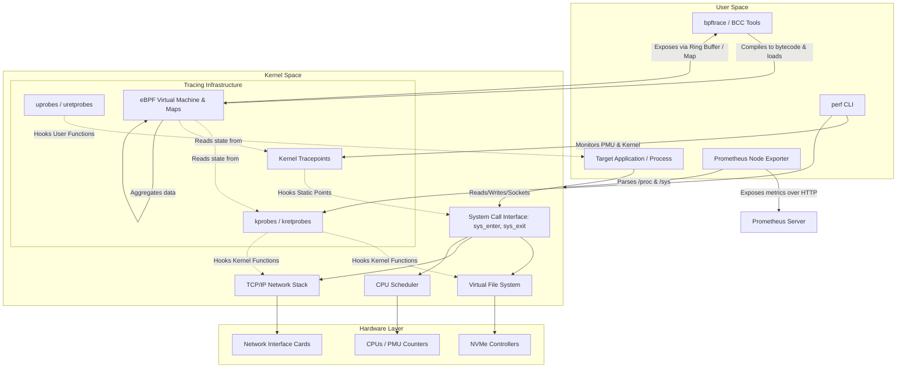

# Linux - Part 3 - Technical Study Guide & Notes

# DevOps and Cloud Study Guide: Linux (Part 3/3)
## Production SRE, Diagnostics, Troubleshooting, Custom Prometheus Alerting, & Incident Runbooks

---

## 1. Part Introduction and Scope

This guide covers advanced Linux systems engineering, kernel-level diagnostics, SRE troubleshooting methodologies, and observability engineering. Designed for engineers with over six years of experience, it moves beyond basic administration to focus on:

*   **Low-Level Kernel Tracing:** eBPF, `bpftrace`, `perf`, and system call auditing.
*   **System Diagnostics and Performance Tuning:** Memory reclamation, network stack latency, I/O bottlenecks, and CPU scheduling analysis.
*   **Observability Pipelines:** Designing high-throughput node metrics pipelines, developing custom Prometheus alerting rules, and writing production incident runbooks.
*   **Post-Mortem & RCA Engineering:** Analyzing real-world failures, understanding complex kernel behaviors, and implementing systemic fixes.

---

## 2. Linux Performance and HA Systems

In high-availability (HA) distributed systems, application performance is constrained by the underlying Linux kernel's handling of hardware resources. SREs must understand system calls, scheduling, memory management, and network packet processing.

```
+-----------------------------------------------------------------------+
|                       Application / User Space                        |
|   - JVM Garbage Collection Stalls      - Database Connection Pools    |
|   - High-throughput API Gateways      - Go Runtime Scheduler (G-M-P)  |
+-----------------------------------------------------------------------+
                                   |
                         System Calls (syscalls)
                                   v
+-----------------------------------------------------------------------+
|                         Linux Kernel Space                            |
|  +--------------------+  +--------------------+  +-----------------+  |
|  |   Memory Manager   |  |     VFS / I/O      |  | Network Stack   |  |
|  | - Direct Reclaim   |  | - Page Cache Dirty |  | - conntrack     |  |
|  | - cgroups v2 OOM   |  |   Writeback        |  | - backlog/NAPI  |  |
|  +--------------------+  +--------------------+  +-----------------+  |
+-----------------------------------------------------------------------+
                                   |
                           Hardware Interface
                                   v
+-----------------------------------------------------------------------+
|                           Physical Hardware                           |
|      [CPU / NUMA Nodes]        [NVMe Storage]        [NICs / Ring]    |
+-----------------------------------------------------------------------+
```

### The Cost of Kernel-Level Bottlenecks
*   **I/O Blockages & JVM Safepoints:** If a JVM process attempts to write to a log file or map memory using `mmap`, and the page cache is undergoing synchronous dirty page writeback, the write system call blocks. This can halt the JVM safepoint, stopping the application.
*   **Network Packet Drops via SoftIRQs:** When network interface cards (NICs) receive packets at line rate (e.g., 40Gbps+), if the kernel's Software Interrupt (SoftIRQ) daemon (`ksoftirqd`) cannot process packets fast enough, the ring buffers overrun, resulting in silent packet drops and TCP retransmissions.
*   **Memory Reclamation Latency:** When free memory drops below the low watermark (`watermark[low]`), the kernel triggers direct memory reclamation, pausing user-space threads to free memory synchronously. This turns microseconds of planned application runtime into milliseconds of latency.

---

## 3. Real-World Enterprise Use Cases

### Use Case 1: High-Throughput Apache Kafka Cluster Experiencing Tail Latencies (500ms+)
*   **The Scenario:** A Kafka cluster running on NVMe-backed instances experiences random, severe latency spikes in consumer fetch/produce cycles. Standard application metrics show no GC pauses, and CPU usage is below 40%.
*   **Underlying Issue:** The kernel's Page Cache dirty background writeback parameters are misconfigured. When Kafka writes data to segment files, it relies on the page cache. 
    
    If `vm.dirty_ratio` is reached, the process blocks while dirty pages are flushed to NVMe storage. High disk queue depths saturate the NVMe controller, leading to write operations blocking other read operations.
*   **SRE Resolution:** Tune the dirty ratios to begin background writebacks early and frequently. Bind NVMe interrupts to dedicated CPU cores, and configure `deadline` or `none` I/O schedulers to prevent queue starvation.

### Use Case 2: Kubernetes Worker Node Memory Starvation Leading to Pod Eviction Cascades
*   **The Scenario:** Under high traffic, a Kubernetes worker node begins terminating random Pods. The node's status shows `MemoryPressure`, and critical infrastructure daemons like `kubelet` and `sshd` become unresponsive.
*   **Underlying Issue:** The system's memory allocation is unmanaged, allowing containerized workloads to exhaust host memory. The host lacks swap configuration, and the kernel runs out of Slab memory (which allocates kernel objects like dentries and inodes). 
    
    The kernel's Out-Of-Memory (OOM) Killer triggers, but due to memory fragmentation, it cannot allocate small kernel-level structures, causing a kernel panic.
*   **SRE Resolution:** Implement strict cgroups v2 resource limits, partition system reserved memory using kubelet's `--system-reserved` and `--kube-reserved` flags, tune sysctl's memory reclaim threshold parameters (`vm.min_free_kbytes`), and deploy an eBPF daemon to monitor OOM events in real time.

---

## 4. Comprehensive Architecture Explanation

Modern SRE diagnostics require a deep understanding of the kernel subsystem interface, tracing instrumentation points, and metrics collection structures.

### Tracing and Diagnostics Architecture



### Core Architecture Components
1.  **System Call Interface (Syscall):** The boundary layer between user-space applications and the kernel. Instrumentation here (e.g., `sys_enter_write`) captures what operations applications request.
2.  **Kernel Probes (kprobes) & User Probes (uprobes):** Dynamically insert debug instructions at arbitrary kernel or user-space function boundaries without restarting processes.
3.  **Kernel Tracepoints:** Hardcoded static probe points compiled into key kernel subsystems (scheduler, networking, ext4 driver) that provide stable trace interfaces across kernel releases.
4.  **eBPF (Extended Berkeley Packet Filter) VM:** A sandboxed virtual machine inside the Linux kernel. It runs verified JIT-compiled bytecode in response to events (tracepoints, kprobes, packet arrival), collecting and aggregating performance data with minimal overhead.

---

## 5. Linux Subsystem Classifications

When diagnosing performance anomalies, categorize system bottlenecks into one of five functional core domains:

```
                  +-------------------------------------------------+
                  |          SRE Diagnosis Core Domains             |
                  +-------------------------------------------------+
                    /         |               |             \      \
                   /          |               |              \      \
                  v           v               v               v      v
            +-----------+ +-----------+ +-----------+ +-----------+ +-----------+
            |    CPU    | |  Memory   | |  Storage  | |  Network  | | Kernel /  |
            | Scheduling| |Management | |  and I/O  | |  Stack    | | Locks     |
            +-----------+ +-----------+ +-----------+ +-----------+ +-----------+
```

### 1. CPU Scheduling and Context Switching
*   **Run Queues:** Tracks the number of threads waiting for CPU execution time. High run queues indicate CPU saturation.
*   **Context Switching:** The process of storing and restoring CPU execution state. High rate of involuntary context switches indicates threads are constantly pre-empted, causing scheduler overhead.

### 2. Memory Management and Reclamation
*   **Slab Allocation:** Fast kernel memory allocator for structures like inodes and directory entries (`dentries`).
*   **Page Cache & Dirty Pages:** Filesystem reads/writes cached in RAM. Uncontrolled dirty pages lead to synchronous blockages when system writeback thresholds are reached.
*   **Direct Reclaim / Anonymous Scan:** The process where the OS searches for inactive pages to free. If forced to scan anonymous pages, it triggers swap operations, blocking execution.

### 3. Storage and I/O Latency
*   **I/O Schedulers:** Schedulers (e.g., `none`, `mq-deadline`, `bfq`) that prioritize read/write requests.
*   **Virtual File System (VFS):** The kernel layer providing unified file APIs. Latency here indicates underlying storage bottlenecks or lock contention.

### 4. Network Stack Optimization
*   **Socket Buffers (`rmem`/`wmem`):** Queues allocated per socket to buffer incoming and outgoing packets.
*   **Conntrack Table:** Tracks active connections for stateful firewalls (Netfilter). Saturation drops new incoming connection packets.

### 5. Kernel Lock Contention
*   **Mutexes & Spinlocks:** Mechanisms that serialize access to shared kernel resources. High contention on internal locks (e.g., network namespaces, page locks) degrades multi-core scalability.

---

## 6. Step-by-Step Production Implementation Guide

### Installing and Deploying an eBPF-Based SRE Diagnostics Pipeline

This guide details how to build a real-time, low-overhead kernel observability pipeline using eBPF, `bpftrace`, and Prometheus Node Exporter on Ubuntu 22.04 LTS (Kernel 5.15+).

#### Step 1: Install Enterprise Kernel Headers and Compilation Toolchain
Ensure kernel headers and compiler tooling are matching the running kernel version to compile dynamic BPF programs:

```bash
# Update repository index
sudo apt-get update

# Install dynamic tracing and compiler dependencies
sudo apt-get install -y \
    linux-headers-$(uname -r) \
    bpfcc-tools \
    bpftrace \
    llvm \
    clang \
    libbpf-dev \
    git \
    curl
```

#### Step 2: Configure System-Wide Kernel Tracing Parameters
Configure sysctl properties to allow the observability daemon to collect metrics without security restrictions:

```bash
# Write persistent kernel performance tuning parameters
sudo tee /etc/sysctl.d/98-sre-observability.conf <<EOF
# Allow SREs to read performance monitoring counters (non-root tracing helper)
kernel.perf_event_paranoid=1

# Disable unprivileged eBPF restriction to allow local tools access to kernel maps
kernel.unprivileged_bpf_disabled=0

# Increase maximum number of kprobes that can be registered simultaneously
debug.exception-trace=1
kernel.kptr_restrict=0
EOF

# Force apply configurations
sudo sysctl --system
```

#### Step 3: Set Up a Production bpftrace Metric Extraction Script
Create a background-running bpftrace script to monitor disk write latency and output the results as metrics:

```bash
sudo mkdir -p /var/log/sre_metrics

sudo tee /usr/local/bin/biolatency-exporter.bt <<'EOF'
#ifndef BPFTRACE_H
#include <linux/blkdev.h>
#endif

kprobe:blk_account_io_start
{
    @start[arg0] = nsecs;
}

kprobe:blk_account_io_done
/@start[arg0]/
{
    $latency_us = (nsecs - @start[arg0]) / 1000;
    @io_latency_us = hist($latency_us);
    
    // Log trace to diagnostic file if latency exceeds 50 milliseconds
    if ($latency_us > 50000) {
        time("%Y-%m-%d %H:%M:%S ");
        printf("WARN: High write latency detected: %d us on block_device state\n", $latency_us);
    }
    delete(@start[arg0]);
}

interval:s:10
{
    // Periodically print distributions to collector directory
    print(@io_latency_us);
}
EOF

# Make executable
sudo chmod +x /usr/local/bin/biolatency-exporter.bt
```

#### Step 4: Systemd Service Wrapper for continuous eBPF Monitoring
Create a systemd unit file to manage the eBPF metric collection process:

```bash
sudo tee /etc/systemd/system/ebpf-biolatency.service <<EOF
[Unit]
Description=eBPF Storage Latency Diagnostic Daemon
After=network.target

[Service]
Type=simple
ExecStart=/usr/bin/bpftrace /usr/local/bin/biolatency-exporter.bt
StandardOutput=append:/var/log/sre_metrics/biolatency.log
StandardError=inherit
Restart=always
RestartSec=5
LimitMEMLOCK=infinity

[Install]
WantedBy=multi-user.target
EOF

# Reload and enable service
sudo systemctl daemon-reload
sudo systemctl enable --now ebpf-biolatency.service
```

---

## 7. Standard CLI Commands with Flag Breakdowns

These diagnostic commands are essential for analyzing system performance under heavy load.

### 1. `perf record` / `perf report`
Monitors CPU Performance Monitoring Unit (PMU) cycles and maps user/kernel space stack traces.

```bash
sudo perf record -F 99 -g -p 12045 -- sleep 30
```
*   `-F 99`: Samples at a frequency of 99 Hz (99 times a second). This avoids synchronization anomalies with common application loop intervals (e.g., 100 Hz).
*   `-g`: Instructs perf to capture call-graphs (stack traces) for both user and kernel space.
*   `-p 12045`: Restricts monitoring to Process ID 12045.
*   `-- sleep 30`: Collects data for a duration of 30 seconds, then stops.

```bash
sudo perf report --stdio -n --max-stack=30
```
*   `--stdio`: Outputs directly to the terminal standard output, preventing the interactive text interface.
*   `-n`: Annotates each function trace with the exact number of samples matched to it.
*   `--max-stack=30`: Limits call chain stack trace depth to 30 frames to avoid memory bloat.

---

### 2. `strace`
Intercepts and records system calls made by a process.

```bash
sudo strace -T -tt -f -y -p 9445 -e trace=file,network,desc
```
*   `-T`: Prints the time spent in each system call in seconds. This is critical for identifying slow system operations.
*   `-tt`: Prints absolute timestamps at microsecond resolution for every system call.
*   `-f`: Trace child processes created by fork/clone (multi-threaded applications).
*   `-y`: Prints paths associated with file descriptor arguments (resolves raw socket/file descriptor IDs).
*   `-p 9445`: Targets Process ID 9445.
*   `-e trace=file,network,desc`: Filters tracing to display only file operations, network operations, and file descriptor management system calls.

---

### 3. `bpftrace`
Executes ad-hoc eBPF dynamic tracing commands.

```bash
sudo bpftrace -e 'kprobe:sys_enter_connect { printf("PID %d: IP Connect: %s\n", pid, comm); }'
```
*   `-e '...'`: Compiles and executes the enclosed program inline.
*   `kprobe:sys_enter_connect`: Attaches a dynamic probe to the kernel function executing network connections.
*   `printf(...)`: Prints runtime variables extracted from the kernel context (`pid` and `comm` represent process ID and command name).

---

### 4. `ss`
Utility to investigate socket statistics and connection queues.

```bash
ss -t -i -e -m -H
```
*   `-t`: Display TCP sockets only.
*   `-i`: Show internal TCP information (RTT, congestion window sizes, retransmission timeouts).
*   `-e`: Show detailed socket credentials and memory assignments.
*   `-m`: Show socket memory usage (sk_buff allocations for read/write queues).
*   `-H`: Omit header line for scripting ingestion compatibility.

---

### 5. `sar` (System Activity Reporter)
Collects, reports, and saves system activity information.

```bash
sar -q -B -r 1 5
```
*   `-q`: Reports queue length and load average statistics.
*   `-B`: Reports paging statistics (page-ins, pageouts, page faults).
*   `-r`: Reports memory utilization statistics (including slab and active/inactive page allocations).
*   `1 5`: Samples once per second for five iterations.

---

## 8. Production Configurations and Alerting Rules

### Production Sysctl Configuration: `/etc/sysctl.d/99-latency-optimized.conf`

This configuration optimizes the kernel network and memory settings for latency-sensitive, high-throughput cloud environments.

```ini
# ==============================================================================
# Linux SRE Production Sysctl Tuning Parameters (Latency Optimized)
# ==============================================================================

# --- Virtual Memory Configuration ---
# Force kswapd to run when memory is 10% free to avoid direct synchronous reclaim
vm.watermark_scale_factor = 100

# Keep 512MB of RAM reserved for atomic allocations (critical network packets)
vm.min_free_kbytes = 524288

# Reduce swappiness to favor reclaiming file cache over anonymous application pages
vm.swappiness = 10

# Allow file dirty page background flush to begin at 5% of memory allocation
vm.dirty_background_ratio = 5

# Force blocking write operations to disk when dirty pages reach 10%
vm.dirty_ratio = 10

# Increase maximum file descriptors system-wide (Prevents "Too many open files")
fs.file-max = 2097152

# --- TCP/IP Network Optimization ---
# Maximize socket receive/send queue limits across all TCP connections
net.core.rmem_max = 16777216
net.core.wmem_max = 16777216

# Configure dynamic buffer auto-tuning ranges (min, default, max in bytes)
net.ipv4.tcp_rmem = 4096 87380 16777216
net.ipv4.tcp_wmem = 4096 65536 16777216

# Maximize socket backlogs for high-concurrency connection spikes
net.core.somaxconn = 32768
net.ipv4.tcp_max_syn_backlog = 16384

# Prevent packet drop during bursty network processing
net.core.netdev_max_backlog = 10000

# Optimize Netfilter Conntrack limits for high-scale NAT/Routing architectures
net.netfilter.nf_conntrack_max = 1048576
net.netfilter.nf_conntrack_tcp_timeout_established = 600

# Protect against SYN flood attacks (SRE default)
net.ipv4.tcp_syncookies = 1

# Enable BBR TCP Congestion Control (requires modprobe tcp_bbr)
net.core.default_qdisc = fq
net.ipv4.tcp_congestion_control = bbr
```

---

### Production Alerting Rules: `prometheus-alerts.yml`

This ruleset monitors system performance and triggers alerts before system failures occur.

```yaml
groups:
  - name: LinuxSREPerformanceAlerts
    rules:
      - alert: LinuxHostSocketExhaustionAlert
        expr: (node_netstat_Tcp_CurrEstab / node_filefd_allocated) * 100 > 85
        for: 2m
        labels:
          severity: critical
          tier: infrastructure
        annotations:
          summary: "Extreme TCP socket utilization on {{ $labels.instance }}"
          description: "Active TCP sockets utilize {{ $value | printf \"%.2f\" }}% of all allocated file descriptors. Danger of port exhaustion."
          runbook_url: "https://wiki.internal.sre/runbooks/network-socket-exhaustion"

      - alert: LinuxConntrackTableSaturation
        expr: (node_nf_conntrack_entries / node_nf_conntrack_max) * 100 > 90
        for: 3m
        labels:
          severity: critical
          tier: infrastructure
        annotations:
          summary: "Netfilter Conntrack Table at {{ $value | printf \"%.2f\" }}% on {{ $labels.instance }}"
          description: "Conntrack table capacity is saturated. Incoming connections are being silently dropped by Netfilter."
          runbook_url: "https://wiki.internal.sre/runbooks/conntrack-exhaustion"

      - alert: LinuxMemoryDirectReclaimStalls
        expr: rate(node_vmstat_allocstall_directreclaim[1m]) > 5
        for: 1m
        labels:
          severity: page
          tier: infrastructure
        annotations:
          summary: "Direct Memory Reclaim Stall Rate High on {{ $labels.instance }}"
          description: "System threads are stalling ({{ $value }} stalls/sec) while synchronously scanning memory. Application latencies will spike."
          runbook_url: "https://wiki.internal.sre/runbooks/memory-thrashing"

      - alert: LinuxDiskQueueSaturated
        expr: rate(node_disk_io_time_seconds_total[1m]) > 0.95
        for: 5m
        labels:
          severity: warning
          tier: infrastructure
        annotations:
          summary: "Disk I/O Saturated on {{ $labels.device }} of {{ $labels.instance }}"
          description: "Storage device is busy executing reads/writes {{ $value | percent }} of the observed period. Risk of high write latencies."
          runbook_url: "https://wiki.internal.sre/runbooks/disk-io-saturation"

      - alert: LinuxKernelOOMKillsDetected
        expr: increase(node_vmstat_oom_kill[5m]) > 0
        for: 0m
        labels:
          severity: critical
          tier: infrastructure
        annotations:
          summary: "Kernel OOM Killer Invoked on {{ $labels.instance }}"
          description: "The Linux Out-Of-Memory Killer has terminated user-space tasks due to extreme memory starvation."
          runbook_url: "https://wiki.internal.sre/runbooks/oom-killer-response"
```

---

## 9. Security Considerations & Hardening Best Practices

Operating dynamic diagnostic utilities in production environments introduces security challenges. SREs must balance operational visibility with system hardening.

```
+--------------------------------------------------------------------------+
|                  Enterprise Linux Hardening Layers                       |
+--------------------------------------------------------------------------+
   [IAM / RBAC]     --> Strict sudo policies for dynamic tracing (perf)
   [Network Zoning] --> Enforce localhost binds for metrics scraping ports
   [Kernel Level]   --> Disable unprivileged eBPF & lock down tracefs/debugfs
   [Execution]      --> Enforce read-only containers with dropped capabilities
```

### 1. Hardening eBPF and Kernel Tracing Interfaces
By default, loading eBPF programs requires administrative privileges (`CAP_SYS_ADMIN` or `CAP_BPF`). To protect systems from kernel-level exploits:
*   **Disable Unprivileged BPF Execution:** Set `sysctl kernel.unprivileged_bpf_disabled=1` in production to prevent unprivileged users from using the `bpf()` system call.
*   **Restricting access to `tracefs` and `debugfs`:** Ensure the directories `/sys/kernel/tracing/` and `/sys/kernel/debug/` are mounted with restrictive permissions (`0700`) so they cannot be read by non-privileged accounts.

### 2. Monitoring Port and Daemon Security
*   **Secure Node Exporter Binding:** Never bind standard metrics collectors (like Prometheus `node_exporter` or custom eBPF exporters) to `0.0.0.0` without network-level authentication. Configure them to listen on `127.0.0.1` and proxy requests through a secure sidecar (e.g., Envoy with mutual TLS) or utilize network security groups (NSGs) to restrict access to trusted Prometheus scrapers.

### 3. Least Privilege & Capability Management in Containers
When running diagnostics within Kubernetes or container runtimes, avoid using the broad `--privileged` flag. Instead, grant only the specific capabilities required for SRE tooling:
```yaml
# Kubernetes Pod Security Context Snippet
securityContext:
  allowPrivilegeEscalation: false
  readOnlyRootFilesystem: true
  capabilities:
    add:
      - SYS_PTRACE   # Necessary for running strace / monitoring syscalls
      - NET_ADMIN    # Necessary for investigating interfaces and tc queues
      - BPF          # Necessary for loading eBPF tracing modules (Linux kernel 5.8+)
```

---

## 10. Observability & Monitoring Considerations

SREs require unified monitoring signals to proactively identify anomalies. The following dashboard matrix outlines key metrics, targets, and logging signals for Linux system observability.

### Metrics Matrix

| Metric Name | Source Subsystem | Recommended Sampling | Healthy Target | Action Threshold |
| :--- | :--- | :--- | :--- | :--- |
| `node_cpu_seconds_total{mode="system"}` | CPU Scheduling | 10s | $< 15\%$ | $> 35\%$ |
| `node_vmstat_allocstall` | Memory Manager | 10s | $0$ events | $> 5$ events/sec |
| `rate(node_disk_io_time_seconds_total[1m])` | VFS / Storage | 10s | $< 70\%$ | $> 95\%$ |
| `node_netstat_Tcp_RetransSegs` | TCP Stack | 10s | $< 0.1\%$ | $> 1\%$ |
| `node_nf_conntrack_entries` | Netfilter | 10s | $< 50\%$ | $> 85\%$ |

---

### Core Logs to Monitor
Monitor the system logs below for hardware, memory, or storage issues. Use a log collector (e.g., Vector or FluentBit) to search for these patterns:

```
+---------------------------------------------------------------------------------+
|                       System Log Monitoring Patterns                            |
+---------------------------------------------------------------------------------+
| System Log Source: dmesg / /var/log/kern.log                                    |
+---------------------------------------------------------------------------------+
| Pattern 1: Page Allocation Failures                                             |
|   "page allocation failure: order:.*, mode:.*"                                  |
|   * Indicates the kernel cannot find contiguous physical blocks of memory.       |
+---------------------------------------------------------------------------------+
| Pattern 2: Out-Of-Memory Interventions                                          |
|   "Out of memory: Killed process \d+ \(.*\)"                                    |
|   * Records kernel process terminations due to memory exhaustion.               |
+---------------------------------------------------------------------------------+
| Pattern 3: Filesystem Corruption / Mount Failures                               |
|   "EXT4-fs error \(device .*\): .*"                                             |
|   * Indicates disk read/write failures or physical media corruption.             |
+---------------------------------------------------------------------------------+
| Pattern 4: Network Dropouts & Link Flapping                                     |
|   "NIC Link is Down" or "excessive work at interrupt"                           |
|   * Identifies physical or virtual interface failure.                           |
+---------------------------------------------------------------------------------+
```

---

## 11. Troubleshooting Scenarios and Root Cause Analysis (RCA)

### Scenario A: High System CPU and Extreme Context Switching

```
[System CPU Spikes > 85%] ---> [Run "vmstat 1 10"] ---> [high "cs" (context switches) & "us" (user)]
                                                                  |
                                                                  v
                                                    [Identify threads with "pidstat -wt -p <PID>"]
                                                                  |
                                                                  v
                                                    [Collect call chains with "perf record -g"]
                                                                  |
                                                                  v
                                                    [Generate Flame Graph / Identify contention]
```

#### Step 1: Analyze CPU metrics with `vmstat`
```bash
vmstat 1 10
```
*   *Observation:* The `cs` (context switches) column shows values over 100,000 per second. The `sy` (system CPU) column matches this spike at 70% CPU usage. This indicates the processor is spending more time switching between execution threads than running application code.

#### Step 2: Identify the offending process and threads
```bash
pidstat -wt -p ALL 1 | awk '$4 > 5000 || $5 > 5000'
```
*   *Observation:* This command filters for processes with more than 5,000 voluntary context switches (`cswch/s`) or involuntary context switches (`nvcswch/s`). This isolates the issue to a multi-threaded application (e.g., a worker pool) configured with more execution threads than there are physical CPU cores.

#### Step 3: Run kernel-level profiling with `perf`
```bash
sudo perf record -e sched:sched_switch -a -g -- sleep 5
sudo perf report --hierarchy --stdio
```
*   *Observation:* The profiling report shows high activity on the `mutex_spin_on_owner` kernel function.
*   *RCA Summary:* A thread count misconfiguration is causing resource contention. The application is spending excessive CPU cycles on thread synchronization and scheduling lock overhead rather than processing user requests.
*   *Remediation:* Reduce the size of the application thread pool to match the physical CPU core allocation. Use non-blocking, asynchronous I/O architectures where possible.

---

### Scenario B: Ext4 Filesystem Remounting Read-Only under I/O Pressure

```
[Disk Operations Fail] ---> [Run "dmesg | grep EXT4-fs"] ---> ["EXT4-fs error ... Remounting filesystem read-only"]
                                                                                |
                                                                                v
                                                                 [Check storage path latency]
                                                                                |
                                                                                v
                                                               [Increase timeout limits in sysfs]
```

#### Step 1: Inspect system boot and error logs
```bash
dmesg -T | grep -E "EXT4-fs|I/O error|remount"
```
*   *Observation:* The kernel log displays the following error:
    `[Mon Oct 23 14:10:05 2023] EXT4-fs error (device nvme0n1p1): ext4_lookup: deleted inode referenced: 1823901`  
    `[Mon Oct 23 14:10:06 2023] Aborting journal on device nvme0n1p1-8.`  
    `[Mon Oct 23 14:10:07 2023] EXT4-fs (nvme0n1p1): Remounting filesystem read-only`

#### Step 2: Pinpoint storage device queue and I/O latency
```bash
iostat -xz 1 10
```
*   *Observation:* The column `await` (average I/O wait time) for `nvme0n1` exceeds 8,000 milliseconds (8 seconds). The percentage disk utilization (`%util`) remains at 100%.

#### Step 3: Trace dynamic kernel filesystem block requests
```bash
sudo bpftrace -e 'kprobe:vfs_read { @start[tid] = nsecs; } kretprobe:vfs_read /@start[tid]/ { @latency = stats((nsecs - @start[tid])/1000000); delete(@start[tid]); }'
```
*   *Observation:* The distribution shows several `vfs_read` operations taking longer than 15 seconds.
*   *RCA Summary:* The storage network interface or physical block controller experienced a hardware lockup under high I/O load. Ext4 is configured to run `errors=remount-ro` by default. When the storage subsystem failed to write to the journal within its timeout period, the filesystem remounted as read-only to protect against data corruption.
*   *Remediation:* Run `fsck` on the unmounted block device to recover data. To prevent false positives from transient storage timeouts on cloud block devices, update `/etc/fstab` mount options to include more resilient driver-level timeout limits. For NVMe disks, adjust the parameters in `/sys/block/nvme0n1/device/timeout`.

---

### Scenario C: Sudden Network Connection Drops (SYN Flooding vs. Conntrack Exhaustion)

```
[Client Connections Drop] ---> [Run "ss -s" / "netstat -s"] ---> [Identify SYN drop counts]
                                                                            |
                                                                            v
                                                          [Check conntrack usage via sysfs]
                                                                            |
                                                                            v
                                                       [Determine if drops are conntrack vs backlog]
```

#### Step 1: Check general socket queue statistics
```bash
ss -s
```
*   *Observation:* Active connections are high, but socket creations are failing. Run `netstat -s` to check for dropped packet counters:
```bash
netstat -s | grep -i "buffer"
```
*   *Observation:* The system reports a high rate of `SYNs to listen sockets dropped`.

#### Step 2: Differentiate between conntrack saturation and system TCP backlog exhaustion
```bash
sysctl net.netfilter.nf_conntrack_count net.netfilter.nf_conntrack_max
```
*   *Observation:* `nf_conntrack_count` equals `nf_conntrack_max` (both at 262,144). Check kernel drops with:
```bash
dmesg | grep -i "nf_conntrack: table full"
```
*   *Observation:* The kernel log confirms the issue:
    `[Mon Oct 23 15:40:12 2023] nf_conntrack: table full, dropping packet`

#### Step 3: Analyze network interface drops
```bash
ethtool -S eth0 | grep -E "rx_drops|rx_missed"
```
*   *Observation:* Values are stable at 0, confirming the physical ring buffers are not the bottleneck. The issue is restricted to Netfilter conntrack table saturation.
*   *RCA Summary:* A sharp increase in traffic saturated the Netfilter connection tracking table, causing the kernel to silently drop all new incoming SYN packets.
*   *Remediation:* Dynamically increase the conntrack limits with `sysctl -w net.netfilter.nf_conntrack_max=1048576`, and configure the conntrack hash size (`hashsize`) to match using the module parameter:
```bash
echo 262144 | sudo tee /sys/module/nf_conntrack/parameters/hashsize
```

---

## 12. Common SRE Mistakes and Prevention in Production

### Mistake 1: Running `strace` on High-Throughput Production Processes
*   **The Trap:** An SRE runs `strace -p <PID>` on a database process handling thousands of requests per second. The database process suddenly grinds to a halt, causing cascading timeouts in upstream applications.
*   **Why it happens:** `strace` relies on the `ptrace` system call. This mechanism forces the traced process to halt executing on *every* system call entry and exit so `strace` can read its state. This introduces significant overhead, slowing the target application down by up to 100x.
*   **SRE Prevention:** Never run `strace` on latency-sensitive production systems. Use eBPF-based alternatives like `bpftrace` or BCC's `trace` utility. These tools run tracing code directly inside the kernel, keeping application overhead minimal.

### Mistake 2: Over-allocating Host Memory Buffers Without Restricting Active Cgroups
*   **The Trap:** To support high network throughput, an SRE increases the system socket memory values (`net.ipv4.tcp_rmem` and `tcp_wmem`) to 64MB per connection, but leaves container cgroup limits unchanged. During a sudden traffic spike, the node runs out of memory and crashes.
*   **Why it happens:** The kernel allocates socket memory outside of standard application-level boundaries. If thousand of connections suddenly allocate 64MB each, the kernel exhausts the host's physical RAM, leading to an OOM panic before cgroup limits can intervene.
*   **SRE Prevention:** Calculate system socket memory allocations using a worst-case connection model. Ensure your configurations fit within the kernel memory allocation pools defined in cgroups v2.

### Mistake 3: Misconfiguring Swappiness and Triggering Memory Scans
*   **The Trap:** An SRE sets `vm.swappiness = 0` to prevent any system disk access from slowing down their application. Later, the system experiences memory pressure, and performance degrades significantly.
*   **Why it happens:** Setting swappiness to `0` tells the kernel to avoid swapping anonymous memory at all costs. This forces the page allocator to immediately run direct memory reclamation when memory runs low. The kernel must scan the active and inactive file caches, stalling application threads on filesystem reads instead of writing idle memory pages to swap.
*   **SRE Prevention:** Set `vm.swappiness` to `1` or `10`. This allows the kernel to swap out cold, unused process pages during memory pressure, saving high-value file caches and preventing direct reclamation stalls.

---

## 13. Enterprise-Level Recommendations and Performance Tuning

### 1. NUMA Pinning and CPU Core Binding
On multi-socket servers, memory access latency is non-uniform. Accessing memory located on a remote NUMA node takes longer than accessing local memory.

```
       NUMA Node 0                               NUMA Node 1
+-----------------------+                 +-----------------------+
|  CPUs (0-15)          |                 |  CPUs (16-31)         |
|  Local Memory (128G)  | <--- Interconnect ---> Local Memory (128G)  |
|  [App Thread Bind]    | (Inter-Node Latency) |                       |
+-----------------------+                 +-----------------------+
```

*   **Production Implementation:** Run high-performance, single-node services (like Redis or Cassandra) bound to a single NUMA domain. This eliminates the latency introduced by inter-node memory access:
```bash
numactl --cpunodebind=0 --membind=0 /usr/bin/redis-server /etc/redis/redis.conf
```

### 2. Tuning Transparent Huge Pages (THP)
Transparent Huge Pages (THP) automatically allocate 2MB or 1GB memory pages instead of the standard 4KB pages to reduce TLB (Translation Lookaside Buffer) cache misses.
*   **The SRE Reality:** Databases with sparse, non-contiguous memory access patterns (such as MongoDB, PostgreSQL, and JVM heaps) run poorly with dynamic THP. The kernel's defragmentation daemon (`khugepaged`) can lock memory pages dynamically, causing high tail latencies.
*   **Production Implementation:** Configure THP to `madvise` or disable it entirely for database workloads. Update your boot parameters or modify `/sys` dynamically:
```bash
echo madvise | sudo tee /sys/kernel/mm/transparent_hugepage/enabled
echo defer+madvise | sudo tee /sys/kernel/mm/transparent_hugepage/defrag
```

### 3. Using Tuned System Profiles
Rather than applying manual sysctl configurations on every server, manage your performance profiles using `tuned`. This service dynamically adapts system settings based on a chosen workload profile.
*   **Production Implementation:** Create an enterprise performance profile by inheriting from the low-latency baseline:
```ini
# /etc/tuned/sre-low-latency/tuned.conf
[main]
include=network-latency

[sysctl]
vm.dirty_ratio = 10
vm.dirty_background_ratio = 5
vm.swappiness = 10
```
Apply the custom profile:
```bash
tuned-adm profile sre-low-latency
```

---

## 14. Advanced Concepts: The Kernel Page Reclamation Pipeline

To keep applications running smoothly, SREs must understand how the kernel allocates and reclaims physical memory.

```
+-----------------------------------------------------------------------------------+
|                           The Memory Reclaim Pipeline                             |
+-----------------------------------------------------------------------------------+
 
       Free Memory Levels
       
       [ High Watermark ]  --> System operates normally (allocations are fast)
               |
               v           
       [ Low Watermark ]   --> Kernel wakes kswapd background daemon to reclaim memory
               |
               v           
       [ Min Watermark ]   --> SRE Alert Zone: Kernel triggers Direct Reclaim. 
                               Stalls user-space applications to scan pages.
               |
               v           
       [ Out of Memory ]   --> Kernel triggers the OOM Killer to terminate processes.
```

### Active and Inactive LRU Lists
The kernel organizes physical memory into Least Recently Used (LRU) page lists. Memory pages are split into two main lists:
1.  **Anonymous Pages:** Memory allocated directly by applications (such as heap, stack, and dynamic allocations). This memory has no corresponding file on disk.
2.  **File-backed Pages:** Files read from disk and cached in RAM (the Page Cache). When memory runs low, these pages can be freed immediately and re-read from disk later if needed.

The kernel monitors pages in these lists using dynamic reference bits:
*   **Active List:** Contains pages that have been accessed recently.
*   **Inactive List:** Contains pages that haven't been accessed in a while. These pages are candidates for reclamation.

When memory pressure increases, pages transition from the active to inactive lists.

### kswapd vs. Direct Reclaim
The kernel manages memory reclamation using watermark levels:
*   **`watermark[high]`**: The system operates normally.
*   **`watermark[low]`**: When free memory drops below this level, the kernel wakes the background swap daemon (`kswapd`). This daemon scans inactive lists and reclaims memory in the background, minimizing impact on running applications.
*   **`watermark[min]`**: If free memory drops below the minimum threshold, the kernel halts background reclamation and triggers **Direct Reclaim**. The kernel pauses the application thread making the memory request and forces it to free memory synchronously. This synchronous scanning introduces significant latency, causing application performance to spike.

---

### Network Receive Path Optimization: Ring Buffers, NAPI, and SoftIRQs

When high volumes of network packets arrive, they must transition from physical hardware to user-space application memory with minimal overhead.

```
+------------------+     [DMA Write]     +--------------------+
|   Physical NIC   | ==================> |  NIC Ring Buffer   |
+------------------+                     +--------------------+
         |                                         |
    [Hard IRQ]                                     | [NAPI Polling]
         |                                         v
         v                               +--------------------+
+------------------+   [Triggers]        |   SoftIRQ Daemon   |
|   CPU Core       | ------------------> |   (ksoftirqd)      |
+------------------+                     +--------------------+
                                                   |
                                                   v
                                         +--------------------+
                                         | Socket Buf (sk_buff)|
                                         +--------------------+
                                                   |
                                                   v
                                         +--------------------+
                                         |  Application Loop  |
                                         +--------------------+
```

1.  **NIC Ring Buffer (DMA):** Incoming network packets are written directly to system RAM by the Network Interface Card (NIC) using Direct Memory Access (DMA). This RAM is managed as a ring buffer.
2.  **Hard Interrupt (Hard IRQ):** Once the write is complete, the NIC triggers a physical hardware interrupt (Hard IRQ) on the CPU to signal that new data is available.
3.  **NAPI Polling:** To prevent CPU starvation from constant hardware interrupts under high packet rates, modern Linux drivers transition to **NAPI (New API)** polling mode. The kernel disables physical interrupts from the NIC and uses a polling routine to read packets from the ring buffer in batches.
4.  **SoftIRQ Daemon (`ksoftirqd`):** The driver delegates the work of processing packets to software interrupts (SoftIRQs), which are executed by the background `ksoftirqd` kernel threads. These threads unpack the raw ethernet frames, build socket buffer structures (`sk_buff`), pass them up the TCP/IP stack, and deliver the data to application sockets.
5.  **Performance Implications:** If `ksoftirqd` is pinned to a single CPU core, or if the ring buffers are too small, that core can saturate, causing incoming packets to be dropped at the NIC level.

To optimize high-traffic systems, increase the size of the NIC ring buffers:
```bash
# Check maximum limits and current settings
ethtool -g eth0

# Set ring buffers to maximum capacity
ethtool -G eth0 rx 4096 tx 4096
```

---

## 15. Integration with Other DevOps Tools

### 1. Terraform Infrastructure Provisioning
Provision an AWS EC2 instance pre-configured with low-latency kernel tuning options.

```hcl
# main.tf
provider "aws" {
  region = "us-east-1"
}

resource "aws_instance" "high_throughput_app" {
  ami           = "ami-0fc5d935ebf8bc3bc" # Ubuntu 22.04 LTS
  instance_type = "c6i.4xlarge"

  user_data = <<-EOF
              #!/bin/bash
              # Apply production-grade sysctl tunings immediately
              curl -s https://raw.githubusercontent.com/sre-core/configs/main/sysctl.conf -o /etc/sysctl.d/99-latency.conf
              sysctl --system
              
              # Install performance tools
              apt-get update && apt-get install -y bpfcc-tools bpftrace tuned
              tuned-adm profile network-latency
              EOF

  tags = {
    Role = "HighThroughputAPIGateway"
    Tier = "Production"
  }
}
```

---

### 2. Ansible Configuration Management
Automate the deployment and configuration of the low-latency system profile.

```yaml
# playbook-sre-tuning.yml
---
- name: Enterprise Linux SRE Kernel Tuning Playbook
  hosts: high_throughput_servers
  become: yes
  tasks:
    - name: Deploy optimized sysctl configuration template
      copy:
        dest: /etc/sysctl.d/90-sre-performance.conf
        content: |
          vm.swappiness = 10
          vm.dirty_background_ratio = 5
          vm.dirty_ratio = 10
          net.core.somaxconn = 65535
        owner: root
        group: root
        mode: '0644'
      notify: Reload Sysctl

    - name: Ensure Tuned daemon is installed and enabled
      apt:
        name: tuned
        state: present
        update_cache: yes

    - name: Apply latency-optimized tuned profile
      command: tuned-adm profile network-latency
      changed_when: false

  handlers:
    - name: Reload Sysctl
      command: sysctl --system
```

---

### 3. Kubernetes DaemonSet: Production-Grade eBPF Metric Collector
Deploy a system-wide eBPF collector across your Kubernetes nodes using a DaemonSet.

```yaml
# ebpf-collector-daemonset.yaml
apiVersion: apps/v1
kind: DaemonSet
metadata:
  name: ebpf-latency-collector
  namespace: monitoring
  labels:
    app: ebpf-collector
spec:
  selector:
    matchLabels:
      name: ebpf-collector
  template:
    metadata:
      labels:
        name: ebpf-collector
    spec:
      hostNetwork: true
      hostPID: true
      containers:
        - name: collector
          image: quay.io/sre-experts/ebpf-exporter:v1.2.0
          securityContext:
            privileged: false
            capabilities:
              add:
                - BPF          # Load and run eBPF bytecode
                - SYS_ADMIN    # Read system tables and run performance probes
                - SYS_PTRACE   # Inspect application tracepoints
          resources:
            limits:
              cpu: 200m
              memory: 256Mi
            requests:
              cpu: 50m
              memory: 64Mi
          volumeMounts:
            - name: sys-kernel-debug
              mountPath: /sys/kernel/debug
              readOnly: false
            - name: modules
              mountPath: /lib/modules
              readOnly: true
      volumes:
        - name: sys-kernel-debug
          hostPath:
            path: /sys/kernel/debug
        - name: modules
          hostPath:
            path: /lib/modules
```

---

## 16. Structural Comparison of Diagnostic Tools

The table below outlines the trade-offs of common Linux diagnostic and tracing tools.

| Diagnostic Tool | Target Subsystem | Overhead Level | Performance Impact | Recommended Env | Best Use Case | Primary Limitations |
| :--- | :--- | :--- | :--- | :--- | :--- | :--- |
| **`strace`** | System Calls | Very High | Direct application slowdown ($2\times$ to $100\times$) | Development & Testing only | Debugging initialization failures or file path permission errors | Cannot use under heavy production traffic due to application stalls. |
| **`perf`** | CPU / PMU Stack trace | Low | Minimal ($< 1\%$) | Production | Generating Flame Graphs to resolve lock contention and loop issues | Requires access to system debug symbols (`debuginfo`). |
| **`bpftrace`** | Kernel/User space (eBPF) | Extremely Low | Negligible ($< 0.1\%$) | Production | Ad-hoc dynamic tracing of network, filesystem, and scheduler latencies | Requires basic scripting knowledge and modern kernels (4.18+). |
| **`sysdig`** | System Events (syscall/disk/net) | Medium | Moderate ($2\%$ to $10\%$) | Staging & Non-Critical Production | Comprehensive troubleshooting and security monitoring | Requires installing out-of-tree kernel modules. |
| **`sar`** | Hardware Counters (historical) | Zero | None | Production | Reviewing historical resource usage trends and patterns | Does not support real-time application tracing. |

---

## 17. SRE Diagnostics Visual Cheat Sheet

Use the table below as a quick reference when investigating active performance issues.

| Symptom / Alert | Likely Kernel Root Cause | Diagnostic Utility | Key Metric / Output | Resolution Action |
| :--- | :--- | :--- | :--- | :--- |
| **High System CPU** | Lock contention or excessive thread context switching | `vmstat 1 5` / `perf` | `cs` values $> 100\text{k}$ and high activity on `mutex_spin` | Reduce application thread count limits in configurations. |
| **Memory Pressure & Drops** | Memory fragmentation triggering Direct Reclamation | `sar -B 1` | `pgscand/s` $> 100$ scans/sec | Tune dynamic memory thresholds (`vm.min_free_kbytes`). |
| **File write timeouts** | Page cache saturation forcing blocking disk writebacks | `bpftrace` / `iostat` | Device `await` $> 100\text{ms}$ and high `biolatency` | Tune `vm.dirty_background_ratio` to flush pages early. |
| **Silent packet drops** | Netfilter routing capacity limits reached | `sysctl` / `dmesg` | `nf_conntrack: table full` log messages | Increase conntrack limits (`net.netfilter.nf_conntrack_max`). |
| **High network latency** | ksoftirqd CPU saturation or ring buffer overruns | `ethtool -S` | `rx_fw_discards` or `rx_fifo_errors` count increases | Bind NIC interrupts to dedicated cores and increase queue sizes. |

---

## 18. Final Learning Summary

Developing a systematic approach to Linux diagnostics is essential for maintaining high-availability systems. 

1.  **Investigate baseline metrics:** Start by using high-level utilities like `vmstat`, `iostat`, and `ss` to identify the bound resource domain (CPU, Memory, Storage, or Network).
2.  **Pinpoint root causes with low-overhead tools:** Avoid running high-overhead tools like `strace` in production. Instead, use `perf` and `bpftrace` to profile system execution and trace bottlenecks dynamically in the kernel.
3.  **Implement systemic fixes:** Address performance issues at the source. Use tuned system configurations (`sysctl.d`), resource constraints (`cgroups`), and optimized kernel profiles (`tuned`) to prevent issues from recurring.
4.  **Incorporate diagnostics into automated workflows:** Build automated SRE pipelines by packaging custom eBPF rules, Prometheus alerts, and Terraform configurations into your standard deployment workflows.

### Q41. Diagnosing Silent Kernel Panics, Hard Lockups, and System Freezes
**Detailed Answer**:
When a Linux server freezes or crashes silently without writing anything to `/var/log/messages` or `/var/log/syslog`, it indicates a high-priority kernel-space failure (such as a hard lockup, soft lockup, or double fault) that has starved the user-space logging daemons (`rsyslogd`, `journald`) of CPU cycles. To diagnose these silent failures, an SRE must configure and leverage out-of-band diagnostics, kernel panic parameters, the Non-Maskable Interrupt (NMI) watchdog, and `kdump`.

A **soft lockup** occurs when a kernel bug causes a thread to loop in kernel space without yielding for more than 20 seconds (by default), preventing other threads from executing on that CPU core. A **hard lockup** occurs when a CPU core running in kernel space disables interrupts completely and hangs, preventing even timer interrupts from firing. 

To capture state during these events:
1. **NMI Watchdog**: Generates periodic non-maskable interrupts (which cannot be blocked by normal interrupt-disabling kernel code). If a CPU core fails to respond to these interrupts within a threshold (e.g., 10 seconds), the NMI watchdog triggers a kernel panic.
2. **Kdump / Kexec**: On panic, the current kernel does not attempt to write to disk (as filesystem structures may be corrupted). Instead, `kexec` boots a secondary, lightweight "crash kernel" pre-loaded into a reserved region of RAM (`crashkernel=auto` or `crashkernel=512M` in GRUB parameters). This crash kernel runs in an isolated memory space and copies the memory image (`vmcore`) of the crashed system to a local disk or a remote NFS/SSH target.
3. **Sysctl Tuning for Automated Recovery**:
   * `kernel.panic = 10`: Reboots the system 10 seconds after a kernel panic.
   * `kernel.panic_on_oops = 1`: Forces a panic on kernel oopses (critical software bugs) to prevent running in an unstable state.
   * `kernel.hung_task_panic = 1`: Triggers a panic if a process remains in Uninterruptible Sleep (`D` state) for more than `kernel.hung_task_timeout_secs` (default 120s).
   * `kernel.nmi_watchdog = 1`: Enables the NMI watchdog.

Once the `vmcore` is written, you use the `crash` tool to debug the core using the corresponding unstripped kernel image (`vmlinux`) and debug symbols (`kernel-debuginfo`):
```bash
crash /usr/lib/debug/lib/modules/$(uname -r)/vmlinux /var/crash/127.0.0.1-2023-10-24-12:00:00/vmcore
```
Inside the `crash` interactive shell, key diagnostic commands include:
* `bt -a`: Prints the backtrace of active tasks on all CPUs at the moment of the crash.
* `log`: Displays the kernel ring buffer leading up to the crash.
* `ps`: Lists all processes and their states.
* `files`: Displays open files for a specific process context.

**Production Scenario / Practical Example**:
An enterprise bare-metal database server running high-frequency trades suddenly freezes every few days. No application logs are generated during the freeze.

**Step 1: Configure Kernel Parameters via Sysctl**
Apply the following settings in `/etc/sysctl.d/99-panic-troubleshooting.conf`:
```ini
kernel.panic = 10
kernel.panic_on_oops = 1
kernel.softlockup_panic = 1
kernel.hardlockup_panic = 1
kernel.hung_task_panic = 1
kernel.hung_task_timeout_secs = 60
```
Apply immediately:
```bash
sudo sysctl --system
```

**Step 2: Configure `/etc/default/grub` and Enable Kdump**
Ensure the GRUB configuration reserves memory for the crash kernel:
```bash
GRUB_CMDLINE_LINUX="... crashkernel=512M"
```
Regenerate GRUB and enable the service:
```bash
sudo grub2-mkconfig -o /boot/grub2/grub.cfg
sudo systemctl enable --now kdump.service
```

**Step 3: Analyze the Captured Crash Dump**
After the next freeze and automatic reboot, open the captured core dump:
```bash
crash /usr/lib/debug/boot/vmlinux-$(uname -r) /var/crash/2023-10-24-14\:32\:11/vmcore
```
In the `crash>` prompt, execute:
```text
crash> bt -a
```
*Output snippet:*
```text
PID: 4122   TASK: ffff880854d9c300  CPU: 4   COMMAND: "nvme_poll_wq"
 #0 [ffff88085fc03df0] machine_kexec at ffffffff8105c317
 #1 [ffff88085fc03e50] __crash_kexec at ffffffff8111023d
 #2 [ffff88085fc03f20] panic at ffffffff8117a264
 #3 [ffff88085fc03fa0] watchdog_overflow_callback at ffffffff81120045 (NMI handler)
 #4 [ffff880a12e3fb10] nvme_poll_queue_work at ffffffffa012d4a2 [nvme]
```
*Analysis*: The stack trace shows the CPU was stuck in `nvme_poll_queue_work` inside the `nvme` kernel module, which blocked interrupts long enough for the NMI watchdog to fire, triggering a panic. The resolution involves updating the NVMe controller firmware and updating the kernel to a version containing a bugfix for this specific NVMe polling dead-lock.

---

### Q42. Diagnosing and Tuning Network Packet Loss at the Socket Buffer and Driver Layer
**Detailed Answer**:
Network packet drops on high-throughput Linux systems (such as ingress gateways or API routers) often happen silently before they ever reach application-space code. The ingress network path in Linux operates as follows:
1. The Network Interface Card (NIC) receives a packet and places it in its hardware Ring Buffer (RX ring).
2. The NIC fires a hard interrupt (IRQ) to a CPU core.
3. The CPU acknowledges the IRQ and schedules a SoftIRQ (Software Interrupt) via the `NAPI` (New API) framework.
4. The SoftIRQ driver pulls packets out of the RX ring buffer, wraps them in Socket Buffer (`sk_buff`) structures, and pushes them up to the network stack via the backlog queue (`netdev_max_backlog`).
5. The TCP/IP stack processes the packet and pushes it to the socket receive buffer (`rmem`).
6. The user-space application pulls data from the socket buffer via system calls (`recv`, `read`).

Drops can occur at any of these transitions due to misconfigured queue lengths or CPU scheduling delays:
* **NIC Ring Buffer Overflow**: The hardware buffer is too small, or the CPU is not processing SoftIRQs fast enough to empty the ring. Check with `ethtool -S <interface> | grep -i drop`.
* **SoftIRQ Budget Starvation**: If the system cannot process all packets in a single SoftIRQ execution cycle, packets are dropped. Controlled by `net.core.netdev_budget` and `net.core.netdev_budget_usecs`.
* **Backlog Queue Saturation**: The queue between the driver and the IP stack is full. Controlled by `net.core.netdev_max_backlog`. Check `/proc/net/softnet_stat` (specifically column 2, which tracks dropped packets due to full backlog).
* **Socket Buffer Exhaustion**: The socket-specific receive window is full because the user-space application is too slow. Tuned with `net.core.rmem_max` and `net.ipv4.tcp_rmem`. Check with `ss -tumi` (look for `rcv_space` and dropped counters).

**Production Scenario / Practical Example**:
An Nginx API gateway is dropping connections under a sudden burst of 150,000 requests per second. Customers experience HTTP 502/504 gateways errors, but Nginx reports low CPU and memory usage.

**Step 1: Collect Diagnostics**
Check `/proc/net/softnet_stat` to see if SoftIRQs are dropping packets:
```bash
cat /proc/net/softnet_stat
```
*Output snippet:*
```text
0001a2f2 00000412 000000a1 00000000 00000000 00000000 00000000 00000000
```
*   **Column 1 (`0001a2f2`)**: Packets processed (107,250 dec).
*   **Column 2 (`00000412`)**: Packets dropped because the `netdev_max_backlog` was exceeded (1,042 dec). This points to an issue between the network driver and the network stack.
*   **Column 3 (`000000a1`)**: Number of times the softirq handler ran out of budget (`netdev_budget`).

Check the current hardware ring buffer limits and active settings:
```bash
ethtool -g eth0
```
*Output:*
```text
Ring parameters for eth0:
Pre-set maximums:
RX:		4096
TX:		4096
Current hardware settings:
RX:		1024
TX:		1024
```

Check the active socket state and queue overflows using `ss`:
```bash
ss -lti
```
Look for `Send-Q` values greater than 0 on the listening port (e.g., 80/443), which indicates that the application cannot accept connections as fast as the TCP handshake completes.

**Step 2: Mitigate and Tune the System**
Write a runtime kernel tuning configuration to `/etc/sysctl.d/10-net-tuning.conf`:
```ini
# Increase the maximum number of packets in the flow queue
net.core.netdev_max_backlog = 10000

# Increase the budget for processing packets in a single SoftIRQ loop
net.core.netdev_budget = 600
net.core.netdev_budget_usecs = 8000

# Increase TCP maximum and default socket receive/send buffer sizes
net.core.rmem_max = 16777216
net.core.wmem_max = 16777216
net.ipv4.tcp_rmem = 4096 87380 16777216
net.ipv4.tcp_wmem = 4096 65536 16777216

# Increase maximum backlog for TCP handshakes (SYN queue size)
net.core.somaxconn = 8192
```
Apply the configurations:
```bash
sudo sysctl --system
```

Increase the physical driver ring buffer size to its maximum allowable hardware limits:
```bash
sudo ethtool -G eth0 rx 4096 tx 4096
```

**Step 3: Verify the Changes via a Prometheus Metric / Alert Rule**
Deploy a custom Prometheus Alerting Rule to watch for any future drop events at the driver level:
```yaml
groups:
  - name: network_alerts
    rules:
      - alert: NetworkSoftnetStatDrops
        expr: increase(node_netstat_PschedDrop[1m]) > 0
        for: 2m
        labels:
          severity: critical
        annotations:
          summary: "Network drops detected at the backlog layer"
          description: "Instance {{ $labels.instance }} is dropping packets due to softnet_stat queue exhaustion. Tune net.core.netdev_max_backlog."
```

---

### Q43. Debugging Intermittent Application Tail Latency Caused by CFS Bandwidth Throttling in Containers
**Detailed Answer**:
In Kubernetes and Docker containers, CPU resource limits are enforced using the Linux kernel's **Completely Fair Scheduler (CFS) bandwidth control** mechanism using cgroups (specifically, `cpu.cfs_quota_us` and `cpu.cfs_period_us`). 

A container engine sets limits using two files:
* `/sys/fs/cgroup/cpu/cpu.cfs_period_us`: The evaluation period (typically 100,000 microseconds, or 100ms).
* `/sys/fs/cgroup/cpu/cpu.cfs_quota_us`: The total allowed runtime for all threads combined within that period. For example, if a container has a 2-core CPU limit, the quota is set to 200,000 microseconds (200ms).

If a highly multi-threaded application (e.g., written in Java, Node.js, or Go) spawns dozens of threads, these threads can consume the 200ms quota in parallel within the first 15ms of a 100ms period. For example, 16 active threads running simultaneously on 16 cores will consume 240ms of CPU time in just 15ms ($16 \times 15\text{ms} = 240\text{ms}$, exceeding the 200ms quota). 

Once the quota is exhausted, the Linux kernel **throttles** all tasks inside that cgroup, parking them and rendering them completely inactive until the next period begins (the remaining 85ms). This causes extreme tail latency spikes ($p99$ and $p99.9$) and can result in timeouts, health check failures, and dropped requests.

Under **cgroups v2**, this behavior is still managed in `/sys/fs/cgroup/cpu.max`, but the kernel includes improvements such as burst control mechanisms and automated runtime shifting to reduce aggressive throttling.

**Production Scenario / Practical Example**:
A Go microservice running in Kubernetes has a CPU limit of `2000m` (2 cores). It processes 50 RPS with a median latency ($p50$) of 5ms, but the $p99$ latency intermittently jumps to over 100ms.

**Step 1: Check Throttling Diagnostics Inside the Container**
Exec into the pod and inspect the cgroup performance metrics:
```bash
# For cgroups v1:
cat /sys/fs/cgroup/cpu/cpu.stat

# For cgroups v2:
cat /sys/fs/cgroup/cpu.stat
```
*Output snippet:*
```text
nr_periods 10450
nr_throttled 3254
throttled_time 132450892031
```
*Analysis*: `nr_throttled / nr_periods` is over 31%. This container is actively throttled during nearly one-third of all scheduling periods, which explains the intermittent $p99$ spikes.

**Step 2: Track Down Threading and Limit Configuration Issues**
By default, the Go runtime sets `GOMAXPROCS` to the number of host CPUs (e.g., 64 cores), not the container limit. If Go attempts to run 64 concurrent threads, it will exhaust its 2-core cgroup quota almost instantly.

To fix this, ensure the runtime is aware of its containerized limits. In Go, use `uber-go/automaxprocs` or set the env variable:
```yaml
env:
  - name: GOMAXPROCS
    value: "2"
```

If using Java, ensure the version is container-aware (JDK 8u191+ or JDK 11+) which respects `-XX:ActiveProcessorCount=2`.

**Step 3: Tune Kubernetes Parameters & Leverage CPU Manager**
If changing the application is not enough, you can disable CFS quota enforcement entirely at the cluster level (if allowed by your cluster architecture) in `/var/lib/kubelet/config.yaml`:
```yaml
cpuCFSQuota: false
```
*Or*, use the Kubelet CPU Manager to allocate dedicated cores using the `static` CPU management policy:
```yaml
cpuManagerPolicy: static
```
This allocates isolated, exclusive CPUs to containers in the `Guaranteed` Quality of Service (QoS) class (where requests equal limits).

**Step 4: Configure Prometheus Alerting**
Monitor container throttling using the following PromQL alert query:
```yaml
groups:
  - name: kubernetes_cgroup_alerts
    rules:
      - alert: ContainerCPUThrottlingHigh
        expr: |
          sum(increase(container_cpu_cfs_throttled_periods_total[5m])) by (container, pod, namespace)
          /
          sum(increase(container_cpu_cfs_periods_total[5m])) by (container, pod, namespace) * 100 > 10
        for: 5m
        labels:
          severity: warning
        annotations:
          summary: "Container CPU throttling is high ({{ $value | printf \"%.2f\" }}%)"
          description: "Pod {{ $labels.pod }} in namespace {{ $labels.namespace }} is being throttled. Tail latency is degraded."
```

---

### Q44. Investigating Deep I/O Latency and Storage Bottlenecks
**Detailed Answer**:
Storage performance bottlenecks on Linux can bring down a cluster because when system processes wait for disk reads/writes, they fall into the **Uninterruptible Sleep (`D` state)**. This raises the CPU load average while leaving the actual CPU cores idling.

To diagnose deep I/O issues, we must analyze the path from the VFS down to the block device:
1. **Dirty Page Cache Writeback**: When an application writes, it writes to RAM first (Page Cache). If the dirty pages exceed kernel limits, the process blocks while dirty pages are actively flushed to physical disk.
   * `vm.dirty_background_ratio`: Target ratio of dirty pages where background kernel threads (`pdflush`/`bdi-writeback`) begin writing to disk (default 10%).
   * `vm.dirty_ratio`: Hard ceiling ratio of dirty pages where the writing application is forced to block and perform synchronous writes (default 20%).
2. **I/O Scheduler**: Standard schedulers (`mq-deadline`, `bfq`, `none`/`kyber`) determine how I/O requests are ordered. SSDs/NVMes should use `none` or `kyber` to bypass unnecessary CPU overhead.
3. **Queue Depth**: The capacity of the disk queue to handle concurrent operations.

To inspect deep metrics, use `iostat`:
```bash
iostat -xz 1 10
```
Key metrics to analyze:
* `%util`: Percentage of CPU time during which I/O requests were issued to the device. Note: On modern SSDs/NVMes that support highly parallel execution queues, `%util` can reach 100% even though the drive is only running at a fraction of its total aggregate bandwidth capability.
* `r_await` / `w_await`: The average time (in milliseconds) for read/write requests issued to the device to be served. Values over 5ms on enterprise SSDs indicate saturation.
* `aqu-sz`: Average queue length of requests sent to the device.
* `svctm`: Service time (deprecated; do not rely on this).

To pinpoint which process is triggering heavy disk writes, use `iotop -oPa` or `bcc-tools`/`bpftrace` scripts to trace filesystem latency.

**Production Scenario / Practical Example**:
An ElasticSearch node is reporting high response latency. CPU utilization is only 15%, but the load average is 24 on a 4-core machine.

**Step 1: Check Current Device Operations via `iostat`**
```bash
iostat -xz 1 5
```
*Output snippet:*
```text
Device:         rrqm/s   wrqm/s     r/s     w/s    rkB/s    wkB/s aqu-sz  await r_await w_await  svctm  %util
sdb               0.00    24.00  120.00  950.00  3212.00 48120.00  85.40  79.80   12.10   88.30   0.93 100.00
```
*Analysis*: Device `/dev/sdb` has an average queue size (`aqu-sz`) of `85.40` and average write wait (`w_await`) of `88.30ms`. This means any write operation is delayed by nearly 90ms.

**Step 2: Identify the Bottleneck Source Using `bpftrace`**
Verify if filesystem latency is localized to a specific write loop inside the app using the `fileslower` bpftrace script, which lists files taking more than 10ms to read/write:
```bash
sudo fileslower 10
```
*Output:*
```text
TIME     COMM           PID    D BYTES   LAT(ms) FILE
12:04:11 java           19241  W 4096      92.41 /var/lib/elasticsearch/nodes/0/indices/.../0/index/_0.fdt
```

**Step 3: Tune Kernel and Storage Settings**
Adjust the VM writeback thresholds in `/etc/sysctl.d/90-storage-perf.conf` so the kernel starts flushing pages earlier, preventing massive, block-inducing write bursts:
```ini
# Start background flushing at 5% dirty memory
vm.dirty_background_ratio = 5

# Block application writes at 10% dirty memory to force gradual writeback
vm.dirty_ratio = 10

# Increase maximum queued descriptors for the block layer
fs.file-max = 2097152
```
Apply the parameters:
```bash
sudo sysctl --system
```

Optimize the multi-queue I/O scheduler of the block device `/dev/sdb` for SSD performance:
```bash
echo "none" | sudo tee /sys/block/sdb/queue/scheduler
```

**Step 4: Configure Prometheus Alerting Rules**
```yaml
groups:
  - name: storage_alerts
    rules:
      - alert: DiskWriteLatencyCritical
        expr: rate(node_disk_write_time_seconds_total[5m]) / rate(node_disk_writes_completed_total[5m]) > 0.05
        for: 5m
        labels:
          severity: critical
        annotations:
          summary: "Disk write latency is extremely high on {{ $labels.device }}"
          description: "Device {{ $labels.device }} on {{ $labels.instance }} has a write latency greater than 50ms ({{ $value | printf \"%.3f\" }}s)."
```

---

### Q45. Resolving File Descriptor Leaks and Socket Exhaustion
**Detailed Answer**:
Every open network connection, log file, pipeline, and IPC socket on Linux is represented as a **File Descriptor (FD)**. FDs are bounded by three separate limits:
1. **System-wide max limits**: `fs.file-max` (absolute kernel ceiling).
2. **User-level ulimits**: Managed in `/etc/security/limits.conf` (soft and hard limits per user or group).
3. **Process-specific limits**: Defined via systemd unit configurations (`LimitNOFILE=`) or parent process definitions.

A **File Descriptor Leak** occurs when an application opens files or establishes connections but fails to invoke `close()` on the descriptor after the action is finished (often due to unhandled exceptions or failed error handling blocks). When the process hits its designated limit, it returns the error: `java.io.IOException: Too many open files`.

**Socket Exhaustion** is a subcategory of this issue. If an application generates high outbound request rates to external APIs, it can consume all available ephemeral ports. On Linux, when an outbound TCP socket closes, it enters the `TIME_WAIT` state for `2 * MSL` (Maximum Segment Lifetime, typically 60 seconds). During this interval, that local IP and port combination cannot be reused, eventually starving the application of available outbound ports.

To debug these limits and states:
* Find the system-wide limit: `cat /proc/sys/fs/file-max`
* Check system-wide allocated FDs: `cat /proc/sys/fs/file-nr` (Returns: `allocated_fds`, `unused_fds`, `max_fds`).
* Count active FDs of a specific process ID: `ls -1 /proc/<PID>/fd | wc -l`
* Determine Socket State distributions: `ss -s`

**Production Scenario / Practical Example**:
A Python-based payment broker process is periodically crashing. The error logs contain thousands of `OSError: [Errno 24] Too many open files` tracebacks.

**Step 1: Check Current File Descriptor and Port Usage**
Identify the process ID and check its open file limits:
```bash
PID=$(pgrep -f "payment_broker")
cat /proc/$PID/limits | grep "Max open files"
```
*Output:*
```text
Max open files            1024                 4096                 files
```
The soft limit is set to a low default of `1024`.

Count open FDs of the running process to see if it is approaching the limit:
```bash
ls -l /proc/$PID/fd | wc -l
```
*Output:*
```text
1021
```
The process is indeed idling within 3 file descriptors of its soft limit.

**Step 2: Identify the Leaked Resources**
Run `lsof` to determine what the open descriptors actually represent:
```bash
sudo lsof -p $PID
```
*Output snippet:*
```text
COMMAND   PID USER   FD   TYPE             DEVICE SIZE/OFF     NODE NAME
python  18120 root  3u  IPv4          412490150      0t0      TCP host-10-0-2-4:49152->api.stripe.com:443 (ESTABLISHED)
python  18120 root  4u  IPv4          412490158      0t0      TCP host-10-0-2-4:49154->api.stripe.com:443 (CLOSE_WAIT)
python  18120 root  5u  IPv4          412490162      0t0      TCP host-10-0-2-4:49156->api.stripe.com:443 (CLOSE_WAIT)
...
python  18120 root 1020u  IPv4          412498212      0t0      TCP host-10-0-2-4:52110->api.stripe.com:443 (CLOSE_WAIT)
```
*Analysis*: The output shows hundreds of sockets in the `CLOSE_WAIT` state. This means the remote server (Stripe API) closed the connection from their end, but the Python application failed to run `socket.close()` on its side, leaving the file descriptor locked in the OS kernel.

**Step 3: Mitigate via Systemd and Kernel TCP Tuning**
First, modify the Systemd unit file for the payment broker (`/etc/systemd/system/payment-broker.service`) to raise limits:
```ini
[Service]
...
LimitNOFILE=65536
```
Reload daemon and restart the service:
```bash
sudo systemctl daemon-reload
sudo systemctl restart payment-broker
```

Next, optimize local TCP reuse rules in `/etc/sysctl.d/95-tcp-reuse.conf` to handle high socket volumes:
```ini
# Allow reusing sockets in TIME_WAIT state for new connections
net.ipv4.tcp_tw_reuse = 1

# Adjust range of ephemeral ports allocated for outbound requests
net.ipv4.ip_local_port_range = 10240 65535

# Set system-wide maximum file descriptor allocation
fs.file-max = 2097152
```
Apply:
```bash
sudo sysctl --system
```

**Step 4: Configure Prometheus Alerting Rules**
```yaml
groups:
  - name: resource_limits
    rules:
      - alert: FileDescriptorsNearLimit
        expr: (node_filefd_allocated / node_filefd_maximum) * 100 > 80
        for: 5m
        labels:
          severity: warning
        annotations:
          summary: "System-wide File Descriptors nearing capacity"
          description: "System-wide FD allocation is at {{ $value | printf \"%.2f\" }}% on {{ $labels.instance }}."
```

---

### Q46. Resolving a "Zombie/Defunct" Process Storm Eating PID Space
**Detailed Answer**:
A **Zombie process** (denoted by `[defunct]` in `ps` output, or state `Z` in `top`) is a process that has completed execution but still has an entry in the OS process table. 

When a child process terminates, the kernel does not instantly clean up its metadata. It preserves the child's exit status, PID, and resource usage statistics so the parent process can read them using the `wait()` or `waitpid()` system calls. Once the parent executes `wait()`, the zombie is reaped and removed from memory.

A zombie process does not consume RAM or CPU resources. However, it **does consume a Process Identifier (PID)** from the global OS pool. Since Linux has a finite limit on the maximum number of PIDs (defined by `/proc/sys/kernel/pid_max`), a massive storm of zombie processes can exhaust the entire PID space. When this happens, the operating system cannot spawn *any* new processes, resulting in shell execution failures, cron job failures, and daemon crashes.

Because zombie processes are already terminated, they **cannot be killed** using `kill -9` (as there is no active process running to handle the signal). The only ways to clear zombie processes are:
1. Signal the parent process using `kill -CHLD <parent_pid>`, which forces the parent to run its child reaping routines.
2. Force-terminate the parent process itself. When the parent dies, the child zombies are re-parented to the system init process (PID 1 or `systemd`). PID 1 acts as a "subreaper" and executes the `wait()` system call to clean up all orphaned zombies.

**Production Scenario / Practical Example**:
An API gateway runs on a Linux node. The monitoring dashboard triggers alerts showing that new shell connections are failing with the error: `bash: fork: retry: No space left on device` or `Resource temporarily unavailable`.

**Step 1: Check Current PID Usage and Limits**
Check the kernel's process limit and compare it to the total process/thread count:
```bash
cat /proc/sys/kernel/pid_max
```
*Output:*
```text
32768
```

Count the active running tasks (processes and threads):
```bash
ps -eLf | wc -l
```
*Output:*
```text
32740
```
The OS has allocated nearly all available PIDs.

**Step 2: Find the Zombie Processes and their Parents**
Identify the zombie processes and output their PID, Parent PID (PPID), and command:
```bash
ps -eo pid,ppid,state,comm | grep -w Z
```
*Output snippet:*
```text
  PID  PPID S COMMAND
10252 10214 Z [worker-script] <defunct>
10253 10214 Z [worker-script] <defunct>
10254 10214 Z [worker-script] <defunct>
...
32115 10214 Z [worker-script] <defunct>
```
*Analysis*: We have thousands of zombies spawned by the parent process with PID `10214` (which belongs to a custom cron runner application). The parent process has failed to call `wait()` on its children.

**Step 3: Attempt Clean Recovery Without Killing the Parent**
Send a `SIGCHLD` signal to the parent to trigger reaping of the defunct processes:
```bash
sudo kill -17 10214
```
Wait 5 seconds and check if the zombie count drops. If the parent application has a broken signal handler loop, the zombies will remain.

**Step 4: Gracefully and Forcefully Terminate the Parent**
If the zombie count does not drop, terminate the parent process:
```bash
sudo kill -15 10214
```
If the parent is unresponsive, force-kill it:
```bash
sudo kill -9 10214
```
Immediately after the parent dies, PID 1 inherits the defunct processes, calls `wait()` on them, and the PID count drops back to normal.

**Step 5: Increase PID Limits to Prevent Future Outages**
To prevent minor leaks from crashing the system before alerting triggers, scale up the maximum PID limits in `/etc/sysctl.d/98-pid-max.conf`:
```ini
kernel.pid_max = 4194304
```
Apply:
```bash
sudo sysctl --system
```

Also, if you run workloads inside Kubernetes, configure `PodDisruptionBudgets` or configure the Kubelet parameter `--pod-max-pids` to isolate and restrict container-level PID leaks from exhausting host-level PID pools.

---

### Q47. Investigating Silent Process Kills: Out of Memory (OOM) Killer vs. Systemd-OOMD vs. Segment Faults
**Detailed Answer**:
When an enterprise service suddenly terminates without producing logs, SREs must distinguish between three distinct termination paths: the Linux kernel Out-Of-Memory (OOM) Killer, Systemd Out-Of-Memory Daemon (`systemd-oomd`), and segmentation faults (segfaults).

#### 1. Kernel OOM Killer
Occurs when the operating system's RAM and Swap pools are exhausted, and the kernel needs to free memory to maintain its own stability. 
* **Mechanism**: The kernel computes an `oom_score` for every process, which is calculated based on the percentage of system memory consumed, plus a bias configured via `/proc/<PID>/oom_score_adj`. The process with the highest score is targeted and terminated with `SIGKILL` (which cannot be caught or ignored).
* **cgroup OOM Killer**: If the memory limits of a container's cgroup (v1 or v2) are breached, the kernel invokes the OOM killer exclusively against processes *inside* that specific cgroup, leaving the host OS unaffected.

#### 2. `systemd-oomd`
An out-of-memory daemon introduced in newer Linux distributions (like Ubuntu 22.04+ and Fedora).
* **Mechanism**: Rather than waiting for the kernel to run completely out of memory, `systemd-oomd` monitors memory pressure metrics using **PSI (Pressure Stall Information)**. If a cgroup's pressure metrics (e.g., `some` memory pressure exceeds 60% for more than 20 seconds) are breached, `systemd-oomd` terminates the entire systemd slice or unit container before the system swap or RAM is fully exhausted.

#### 3. Segmentation Faults (Segfaults)
A crash caused by an application attempting to read or write to memory addresses outside its allocated virtual address space.
* **Mechanism**: The hardware MMU (Memory Management Unit) flags the illegal access, and the kernel sends a `SIGSEGV` signal to the process, which halts execution and optionally dumps core.

**Production Scenario / Practical Example**:
An asynchronous worker service (`celery_worker`) processing images terminates abruptly under load.

**Step 1: Check Kernel Buffers for Kernel OOM Kills**
Query the kernel ring buffer using `dmesg` or search system journals:
```bash
sudo dmesg -T | grep -i -E 'oom[-_]killer|killed'
```
*Output snippet:*
```text
[Tue Oct 24 15:32:10 2023] celery_worker invoked oom-killer: gfp_mask=0x100cca(GFP_HIGHUSER_MOVABLE), order=0, oom_score_adj=0
[Tue Oct 24 15:32:10 2023]  oom_kill_process.cold+0xb/0x10
[Tue Oct 24 15:32:10 2023] Killed process 14205 (celery_worker), pg_tol:1048576, oom_score: 852
```
This confirms a kernel-level OOM kill targeting the worker process because its `oom_score` was 852.

**Step 2: Check Systemd Journal for `systemd-oomd` Interventions**
If `dmesg` is empty, check `journalctl` for user-space OOM interventions:
```bash
journalctl -u systemd-oomd --since "1 hour ago"
```
*Output snippet:*
```text
systemd-oomd[612]: Killed /user.slice/user-1000.slice/user@1000.service/app.slice/celery.service due to memory pressure exceeding limits.
```

**Step 3: Investigate Potential Segmentation Faults**
If neither OOM mechanism was triggered, check if the process crashed due to an illegal memory access:
```bash
journalctl -f -t kernel | grep -i segfault
```
*Output snippet:*
```text
kernel: celery_worker[14205]: segfault at 0 ip 00007f31c2810a44 sp 00007ffe812c21c0 error 4 in libc-2.31.so[7f31c2780000+178000]
```
*Analysis*: "error 4" indicates a user-space read fault on a null pointer (address `0`), meaning the application crashed because of a software bug in a C-dependency of the Python worker, not resource starvation.

**Step 4: Configure Protective Alerting Rules**
For Kubernetes or Prometheus-monitored environments, deploy an alert to catch container OOM kills before they repeat:
```yaml
groups:
  - name: container_memory_alerts
    rules:
      - alert: ContainerOOMKilled
        expr: container_oom_events_total > 0
        for: 0m
        labels:
          severity: critical
        annotations:
          summary: "Container OOM Kill detected on {{ $labels.pod }}"
          description: "Pod {{ $labels.pod }} in namespace {{ $labels.namespace }} was terminated by the OOM killer."
```

---

### Q48. High Load Average with Low CPU and Memory Utilization (Uninterruptible Sleep State)
**Detailed Answer**:
On Linux, the **Load Average** metric (displayed by `uptime`, `top`, or `htop`) does not represent CPU utilization alone. It represents the average number of processes in the **Run Queue** plus the number of processes in the **Uninterruptible Sleep queue** over 1, 5, and 15-minute intervals.

A process enters **Uninterruptible Sleep (State `D`)** when it is blocked waiting for system resources—usually synchronous disk I/O, network file system (NFS) calls, hardware locking, or kernel system calls—and cannot handle incoming signals (including `kill -9`). If a system has 20 tasks stuck in a `D` state waiting on an unresponsive NFS mount, the 1-minute load average will rise by 20, even if CPU usage is at 0%.

To troubleshoot high load averages with low CPU utilization, SREs must find the processes in state `D` and trace their execution path in kernel space using:
1. `ps` or `top` filtered by state `D`.
2. `/proc/<PID>/wchan`: Tells you which specific kernel function the process is sleeping in.
3. `/proc/<PID>/stack`: Prints the complete kernel call stack of the blocked process.
4. `sysrq` triggers to output blocked tasks.

**Production Scenario / Practical Example**:
An application server has an active CPU utilization of 2%, but its load average is 45. APIs are timing out, and system operations are lagging.

**Step 1: Locate Processes in State `D`**
Filter the process list to find tasks in the uninterruptible sleep state:
```bash
ps -eo pid,user,state,wchan:30,comm | grep " D "
```
*Output:*
```text
  PID USER     S WCHAN                          COMMAND
 9214 apache   D rpc_wait_bit_killable          httpd
 9215 apache   D rpc_wait_bit_killable          httpd
 9216 apache   D rpc_wait_bit_killable          httpd
```
All active Apache processes are stuck in the kernel function `rpc_wait_bit_killable`.

**Step 2: Inspect the Kernel Call Stack of the Blocked Processes**
Print the raw kernel call stack for one of the blocked Apache processes:
```bash
sudo cat /proc/9214/stack
```
*Output:*
```text
[<0>] rpc_wait_bit_killable+0x24/0x90 [sunrpc]
[<0>] __rpc_execute+0x12d/0x390 [sunrpc]
[<0>] rpc_execute+0x5c/0x90 [sunrpc]
[<0>] nfs3_rpc_wrapper+0x38/0x90 [nfs]
[<0>] nfs3_proc_lookup+0x112/0x240 [nfs]
[<0>] nfs_lookup+0x13d/0x320 [nfs]
[<0>] path_openat+0x5c3/0x1410
[<0>] do_filp_open+0x91/0x100
[<0>] do_sys_openat2+0x21e/0x2f0
[<0>] __x64_sys_openat+0x54/0x90
[<0>] do_syscall_64+0x33/0x40
[<0>] entry_SYSCALL_64_after_hwframe+0x44/0xa9
```
*Analysis*: The stack trace shows the execution path: `sys_openat` -> `nfs_lookup` -> `rpc_wait_bit_killable`. This proves the Apache workers are blocking indefinitely while trying to open a file on a mounted NFS share because the NFS server is unresponsive or has dropped off the network.

**Step 3: Force Unmount and Recover**
Because processes in state `D` ignore `SIGKILL`, attempting to kill the Apache processes will not work. The underlying I/O block must be cleared first.
Attempt a lazy, force-unmount of the unresponsive NFS share:
```bash
sudo umount -f -l /mnt/nfs_share
```
*   `-f`: Forces the unmount (useful in case of unreachable NFS systems).
*   `-l`: Lazy unmount. Detaches the filesystem from the directory tree hierarchy immediately, and cleans up all active references to the filesystem once it is no longer busy.

As soon as the lazy unmount completes, the blocked RPC calls return error codes to the applications, the processes wake up from state `D`, and the system load average drops back to normal.

**Step 4: Configure Prometheus Alerting Rules**
Deploy an alert to watch for sustained blocked tasks:
```yaml
groups:
  - name: system_health
    rules:
      - alert: HighUninterruptibleProcesses
        expr: sum(node_sched_stat_waiting_total) by (instance) > 5 or sum(label_replace(node_processes_state{state="D"}, "instance", "$1", "instance", "(.*)")) by (instance) > 5
        for: 5m
        labels:
          severity: critical
        annotations:
          summary: "High number of processes in uninterruptible sleep"
          description: "There are {{ $value }} processes stuck in state D on {{ $labels.instance }}. Check NFS mounts and disk health."
```

---

### Q49. Troubleshooting DNS Resolution Failures inside Linux Containers under High QPS
**Detailed Answer**:
DNS resolution issues inside containerized Linux environments (like Kubernetes pods) under high Query Per Second (QPS) loads are typically caused by **conntrack table exhaustion** or the **Single-Request-RTT race condition** in the Linux kernel netfilter sub-system.

#### 1. Conntrack Table Exhaustion
Every outbound UDP packet (DNS queries are UDP by default) must be tracked by the kernel's connection tracking (`conntrack`) module to route the reply back to the correct container namespace. If a cluster experiences a massive surge in UDP queries, the `nf_conntrack` table can fill up. When this table is full, the kernel silently discards new outbound UDP connections, leading to sporadic DNS resolution timeouts.

#### 2. The Single-Request-RTT Race Condition
By default, the glibc resolver inside standard Linux containers sends both an `A` (IPv4) query and an `AAAA` (IPv6) query in parallel over the same UDP socket. 
When these parallel queries pass through the Linux DNAT (Destination Network Address Translation) layer (e.g., when routing queries to CoreDNS), a race condition occurs in the kernel:
1. Two packets are sent concurrently over the same socket.
2. The kernel's `conntrack` module attempts to create two connection tracking entries for the same source/destination IP and port.
3. Only one entry can win the insert race into the conntrack hash table. The second packet is discarded by the kernel, resulting in a 5-second timeout inside the container (which is glibc's default DNS query timeout).

To resolve these issues, you can:
* Configure **NodeLocal DNSCache** in Kubernetes to bypass DNAT/conntrack paths for DNS queries on the local node.
* Tune `/etc/resolv.conf` using options like `single-request-reopen` or `use-vc` (forces TCP instead of UDP).
* Increase the conntrack limits in the host kernel.

**Production Scenario / Practical Example**:
An API gateway pod scaled up to handle a traffic spike, but suddenly started throwing random connection timeouts: `dial tcp: lookup api.external.com on 10.96.0.10:53: read udp 10.244.2.14:52110->10.96.0.10:53: i/o timeout`.

**Step 1: Check Host Kernel Conntrack Saturation**
Log onto the Kubernetes host node running the pods and check the syslog for conntrack drop errors:
```bash
sudo dmesg -T | grep -i "nf_conntrack: table full"
```
If you see entries like:
```text
[Tue Oct 24 16:04:12 2023] nf_conntrack: table full, discarding packet
```
The conntrack table limits must be increased.

**Step 2: Increase Conntrack Limits**
Increase the maximum limits dynamically and save them in `/etc/sysctl.d/99-conntrack.conf`:
```ini
net.netfilter.nf_conntrack_max = 1048576
net.netfilter.nf_conntrack_tcp_timeout_established = 86400
```
Apply:
```bash
sudo sysctl --system
```

**Step 3: Mitigate the glibc Parallel Query Bug inside the Container**
If conntrack is not full, the issue is likely the glibc parallel `A` and `AAAA` lookup race.
In Kubernetes, modify the Pod's specification to add the `single-request-reopen` option, which forces the resolver to close the socket and open a new one before sending the second query:
```yaml
apiVersion: v1
kind: Pod
metadata:
  name: api-gateway
spec:
  containers:
  - name: gateway
    image: gateway:v2.1
  dnsConfig:
    options:
    - name: single-request-reopen
    - name: ndots
      value: "1"
```
*Note*: Reducing `ndots` to `1` prevents the resolver from traversing multiple internal search paths (like `.default.svc.cluster.local`) before querying the public address, which slashes the number of redundant DNS queries sent by 60%.

**Step 4: Configure a Prometheus Alerting Rule to Monitor DNS Latency**
```yaml
groups:
  - name: coredns_alerts
    rules:
      - alert: CoreDNSLatencyHigh
        expr: histogram_quantile(0.99, sum(rate(coredns_dns_request_duration_seconds_bucket[5m])) by (le)) > 0.05
        for: 2m
        labels:
          severity: warning
        annotations:
          summary: "CoreDNS 99th percentile latency is high"
          description: "CoreDNS 99th percentile response latency has reached {{ $value }}s. Container DNS performance is degraded."
```

---

### Q50. Incident Runbook & RCA: Resolving "Read-only file system" Errors on Stateful Workloads
**Detailed Answer**:
A **"Read-only file system"** error occurs when the Linux kernel detects disk errors, underlying hardware failures, or filesystem journal corruption. To prevent further data corruption, the kernel's Ext4 or XFS driver automatically changes the mount state of the block device to Read-Only (`ro`).

```text
+---------------------+      I/O Error       +--------------------+      Remount       +-------------------------+
|      App Write      | -------------------> |    Linux Kernel    | -----------------> | Filesystem Changed to   |
| (Fails with EROFS)  |                      | (Detects Corrupt)  |  (errors=remount-ro) | Read-Only (Safety Lock) |
+---------------------+                      +--------------------+                    +-------------------------+
```

This safety state is controlled by the mount option `errors=remount-ro` (the default configuration for most Linux filesystems). Common root causes include:
* Storage Area Network (SAN) or Cloud Block Store (e.g., AWS EBS, Azure Disk) transient network disconnects.
* Hard drive physical sector failures or controller lockups.
* Host virtualization crashes resulting in sudden, ungraceful disconnections of storage attachments.

#### Incident Runbook & Recovery Workflow
1. **Identify Affected Mounts**: Pinpoint which mount points are affected and confirm their current read-only flag state.
2. **Gracefully Stop Applications**: Stop any processes attempting to write to the corrupted path to prevent application-level memory exhaustion or lockups.
3. **Unmount the Volume**: Safely detach the device from the target directory path.
4. **Run Filesystem Check (fsck)**: Replay the filesystem transaction logs and repair metadata inconsistencies.
5. **Remount and Verify Integrity**: Reattach the filesystem as Read-Write (`rw`) and verify database/data health.

**Production Scenario / Practical Example**:
A stateful PostgreSQL pod running on a Kubernetes cluster suddenly crashes. The logs show: `PANIC: could not write to file "base/16384/11921": Read-only file system`.

#### Step 1: Diagnose the Error
SSH into the Kubernetes worker node hosting the stateful database.
Verify the mount parameters and check if the filesystem has been remounted as read-only:
```bash
mount | grep "/var/lib/postgresql"
```
*Output:*
```text
/dev/sdc on /var/lib/postgresql type ext4 (ro,relatime,errors=remount-ro)
```
Confirming `/dev/sdc` is indeed mounted as `ro` (Read-Only).

Inspect the kernel ring buffer to identify the exact cause and timestamps of the read-only transition:
```bash
sudo dmesg -T | grep -i -E "/dev/sdc|ext4_error"
```
*Output snippet:*
```text
[Tue Oct 24 17:15:21 2023] EXT4-fs error (device sdc): ext4_lookup:1709: deleted inode referenced: 1245082
[Tue Oct 24 17:15:21 2023] Aborting journal on device sdc-8.
[Tue Oct 24 17:15:22 2023] EXT4-fs (sdc): Remounting filesystem read-only
```
The kernel detected filesystem metadata corruption (referencing a deleted inode) and triggered the emergency `remount-ro` transition.

#### Step 2: Stop Workloads and Unmount
Scale down the PostgreSQL pod to stop write attempts:
```bash
kubectl scale statefulset postgres-db --replicas=0
```

Unmount the affected device on the host node:
```bash
sudo umount /dev/sdc
```
If the unmount command returns a `target is busy` error, find and terminate any remaining processes holding active open file descriptors on the volume:
```bash
sudo fuser -v -m /var/lib/postgresql
sudo fuser -k -9 -m /var/lib/postgresql
sudo umount /dev/sdc
```

#### Step 3: Repair the Filesystem Using `fsck`
Run a non-interactive filesystem repair utility on the unmounted block device:
```bash
sudo fsck.ext4 -y -f /dev/sdc
```
*   `-y`: Automatically answers "yes" to all repair and block reallocation prompts.
*   `-f`: Forces verification even if the clean flag is set on the superblock.

*Expected Output snippet:*
```text
Pass 1: Checking inodes, blocks, and sizes
Pass 2: Checking directory structure
Pass 3: Checking directory connectivity
Pass 4: Checking reference counts
Pass 5: Checking group summary information
/dev/sdc: ***** FILE SYSTEM WAS MODIFIED *****
/dev/sdc: 1245082/10485760 files (0.2% non-contiguous), 4521102/41943040 blocks
```

#### Step 4: Remount the Volume and Verify
Remount the block device explicitly with Read-Write permissions:
```bash
sudo mount -o rw,remount /dev/sdc /var/lib/postgresql
```
Test write availability on the restored path:
```bash
touch /var/lib/postgresql/write_test && rm /var/lib/postgresql/write_test
```
Scale the Kubernetes database deployment back up:
```bash
kubectl scale statefulset postgres-db --replicas=1
```

#### Step 5: Configure Prometheus Alerts to Catch Mount Changes
Deploy this custom Prometheus Alerting Rule to detect any production filesystem remounts to read-only before applications crash:
```yaml
groups:
  - name: storage_status_alerts
    rules:
      - alert: FilesystemReadOnly
        expr: node_filesystem_readonly{mountpoint!~"^/(dev|sys|run|proc).*"} == 1
        for: 0m
        labels:
          severity: critical
        annotations:
          summary: "Filesystem mounted as Read-Only"
          description: "The volume at mount point {{ $labels.mountpoint }} on instance {{ $labels.instance }} has transition to read-only state. Immediate SRE investigation is required."
```