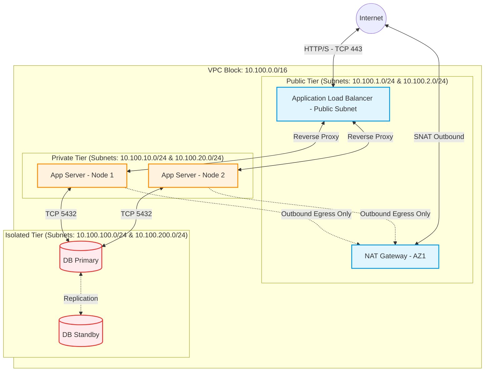

# Networking - Part 1 - Technical Study Guide & Notes

# Networking (Part 1/3): Core Foundations, Topologies, and Linux Network Stack

---

## 1. Part Introduction and Scope

This study guide focuses on the fundamental networking layers, core protocols, address allocation systems, Linux kernel-level networking implementations, and fundamental cloud topologies. This module bridges the gap between theoretical OSI networking and production-grade Cloud/SRE operations. 

```
                                  [ OSI & TCP/IP Stack ]
                                            │
               ┌────────────────────────────┴────────────────────────────┐
               ▼                                                         ▼
    [ Linux Kernel Network Stack ]                            [ Cloud & Overlay Topologies ]
  ┌───────────────────────────┐                             ┌─────────────────────────────┐
  │ • Socket Buffers & sysctl │                             │ • Multi-AZ VPC / Subnets    │
  │ • eBPF vs. iptables       │                             │ • Hub-and-Spoke (Transit GW)│
  │ • TCP State Machine Tuning│                             │ • VXLAN / Overlay (CNIs)    │
  └───────────────────────────┘                             └─────────────────────────────┘
```

### Scope of Coverage
*   **The Pragmatic TCP/IP Stack**: Deep dive into Layer 3 (IP, routing), Layer 4 (TCP congestion control, socket states), and Layer 7 (DNS resolution paths, HTTP/TCP interaction) from an SRE perspective.
*   **IP Address Management (IPAM) & Subnetting**: Enterprise-scale CIDR block design, RFC 1918/RFC 6598 planning, and collision prevention.
*   **Linux Networking Stack Internals**: The life of a packet inside the Linux kernel, socket ring buffers (`rx`/`tx`), `sysctl` kernel parameters, and the evolution from legacy `iptables` to `nftables` and eBPF.
*   **Fundamental Cloud Topologies**: Multi-AZ VPC architecture, Hub-and-Spoke topologies via Transit routing, and encapsulation overlays (VXLAN/GENEVE).

---

## 2. Why Core Networking is Critical for High-Availability Systems

At scale, application failures are rarely isolated to code. More often, they manifest as cascading failures rooted in network-level bottlenecks or misconfigurations.

### Connection Tracking (`conntrack`) Exhaustion
Firewalls and NAT Gateways rely on connection tracking to maintain stateful packet inspection. Every TCP connection, UDP stream, and ICMP request occupies a slot in the kernel’s `conntrack` table. When this table fills up, the Linux kernel drops incoming packets without notifying the sender. To an application, this appears as sudden, intermittent latency spikes or timeout errors (e.g., `Connection timed out` or `504 Gateway Timeout`).

### SNAT Port Exhaustion
When millions of microservice instances attempt to communicate with external APIs (or managed databases outside their private network) through a NAT Gateway or NAT instance, they must share a limited pool of source IPs. Each IP can support a maximum of 64,512 concurrent source port allocations per destination endpoint. Once this limit is reached, outbound connections fail with `Cannot assign requested address` errors. This represents a critical single point of failure in high-throughput architectures.

### DNS Latency and Resolution Failures
Unoptimized DNS architectures introduce significant latency. In microservice environments, resolving external or internal domains without localized caching can add 10ms to 100ms *per upstream hop*. If DNS queries fail due to rate-limiting on cloud-provided DNS resolvers (such as AWS Route 53's limit of 1024 packets per second per network interface), the entire application fabric can fail. 

### TCP Buffer Inefficiencies & Packet Retransmission
Misconfigured socket memory buffers (`rmem`/`wmem`) limit network throughput over high-bandwidth, high-latency paths (high Bandwidth-Delay Product - BDP). Under provisioned buffers cause packet drops at the OS receive queue, triggering TCP window size reductions and heavy retransmissions, stalling application delivery.

---

## 3. Real-World Enterprise Use Cases

### Use Case 1: Multi-Region Hub-and-Spoke Transit Network
An enterprise operates across multiple geographical regions with hundreds of VPCs (Spokes) that require secure inter-VPC communication, shared security inspections, and access to on-premises datacenters.

```
                  ┌──────────────────────────────────────────────┐
                  │                 Transit VPC                  │
                  │  ┌──────────────────┐  ┌──────────────────┐  │
                  │  │ Firewalls (FW)   │  │ Transit Gateway  │  │
                  │  └────────▲─────────┘  └────────▲─────────┘  │
                  └───────────┼─────────────────────┼────────────┘
                              │                     │
                ┌─────────────┴────────────┐        │
                │                          │        │
     ┌──────────▼──────────┐    ┌──────────▼────────▼─┐
     │      Spoke A        │    │      Spoke B        │
     │  (AWS Accounts-Prod)│    │  (AWS Accounts-Dev) │
     └─────────────────────┘    └─────────────────────┘
```

*   **Architecture Solution**: A centralized "Transit VPC" acts as the Hub. It leverages AWS Transit Gateway (TGW) or Azure Virtual WAN to interconnect Spokes.
*   **Traffic Routing Routing**: Route tables direct all inter-Spoke and outbound egress traffic through a security inspection VPC containing auto-scaled firewall appliances before routing back to destinations.
*   **CIDR Design**: Non-overlapping CIDR allocations across all global accounts, reserving specific blocks (such as `10.0.0.0/8` for internal networks, `100.64.0.0/10` for CGNAT/Kubernetes Pods).

### Use Case 2: High-Throughput Kubernetes Pod-to-Pod Networking Bypassing `iptables`
An enterprise platform runs thousands of microservices on Kubernetes, processing over 100,000 requests per second. The default `kube-proxy` in `IPVS` or `iptables` mode introduces extreme processing overhead because every packet must be evaluated against thousands of sequential firewall rules.

```
                           [ Incoming IP Packet ]
                                     │
                        ┌────────────┴────────────┐
                        │  eBPF Bypass Engine     │
                        │  (Direct map lookups)   │
                        └────────────┬────────────┘
                                     │
                   ┌─────────────────┴─────────────────┐
                   ▼                                   ▼
          [ Pod A NetNS ]                     [ Pod B NetNS ]
         (Direct Mem Copy)                   (Direct Mem Copy)
```

*   **Architecture Solution**: Deploy Cilium as the CNI (Container Network Interface) in eBPF (Extended Berkeley Packet Filter) mode.
*   **Implementation Details**: eBPF attaches directly to the Linux kernel socket layer (`sockmap`), bypassing the network stack's IP routing and firewall filters entirely when routing packets between pods on the same host. This reduces average latency from milliseconds to microseconds.

---

## 4. Comprehensive Architecture Explanation

Below is the design of a resilient multi-AZ network with public, private, and isolated network tiers. It includes an ingress path through an Application Load Balancer (ALB), private compute hosts utilizing a NAT Gateway for external access, and isolated database subnets with no path to the Internet.



### Flow and Component Breakdown

1.  **Public Tier**: Contains resources that must interact with the public internet directly. Ingress is handled by the AWS Application Load Balancer. Outbound internet connectivity for private instances is facilitated via the NAT Gateway, which has an Elastic IP assigned.
2.  **Private Tier**: Houses application workloads (Kubernetes workers, VM nodes). These nodes have private IPs and utilize Route Tables where the default route `0.0.0.0/0` points directly to the NAT Gateway in the Public Tier.
3.  **Isolated Tier**: Contains highly sensitive resources like database engines and internal caching layers. They are completely segmented; their associated Route Tables lack any entries for `0.0.0.0/0` (no NAT or IGW access allowed).

---

## 5. Network Types, Classifications, and Kernel Components

### Domain Name System (DNS) Components
Understanding the DNS resolution hierarchy is essential for SRE latency engineering.

```
                       [ Stub Resolver ]
                               │
                               ▼
                    [ Recursive Resolver ]
                     (e.g., 8.8.8.8, CoreDNS)
                               │
            ┌──────────────────┼──────────────────┐
            ▼                  ▼                  ▼
    [ Root Servers ]    [ TLD Servers ]     [ Authoritative ]
          ( . )             ( .com )         ( mydomain.com )
```

*   **Recursive Resolvers**: Intermediary servers (e.g., CoreDNS, systemd-resolved, Cloudflare `1.1.1.1`) that query DNS hierarchies on behalf of clients. They cache records to reduce latency.
*   **Authoritative Nameservers**: The final source of truth for a domain's DNS records. They do not resolve outside domains but return definitive IP assignments (A, AAAA, CNAME) for the domains they control.
*   **Split-Horizon DNS**: A mechanism where the same domain name resolves to different IPs depending on the source's network context. For example, `api.service.internal` resolves to private IPs inside the VPC and returns `NXDOMAIN` or public IPs from outside.

### CIDR Planning (Classless Inter-Domain Routing)
To avoid overlapping CIDRs in global clouds, engineers allocate network subnets using binary-aligned boundary ranges. 

$$\text{Hosts available in } /N \text{ subnet} = 2^{(32 - N)} - 5 \quad \text{(in cloud environments, e.g., AWS reserves 5 IPs)}$$

The reserved IPs in an AWS VPC `/24` subnet (256 - 5 = 251 usable IPs) are:
*   `10.0.0.0`: Network address.
*   `10.0.0.1`: VPC router address.
*   `10.0.0.2`: DNS mapping (Route 53 Resolver).
*   `10.0.0.3`: Future provisioning.
*   `10.0.0.255`: Network broadcast address.

### TCP Socket State Machine (Kernel View)
The life cycle of a TCP connection impacts SRE metrics like open file handles and memory.

```
   Client                                      Server
     │                                           │
     │ -------- SYN (seq=x) -------------------> │ [SYN_RECEIVED]
     │ <------- SYN-ACK (seq=y, ack=x+1) ------- │
     │ -------- ACK (ack=y+1) -----------------> │ [ESTABLISHED]
     │                                           │
     │               [ DATA FLOW ]               │
     │                                           │
     │ -------- FIN ---------------------------> │ [CLOSE_WAIT]
     │ <------- ACK ---------------------------- │
     │                                           │ (Server processing cleanup)
     │ <------- FIN ---------------------------- │ [LAST_ACK]
     │ -------- ACK ---------------------------> │ [CLOSED]
     ▼                                           ▼
[TIME_WAIT]
(2*MSL - Max Segment Lifetime)
```

*   **TIME_WAIT**: The state the connection-initiator enters after sending the final ACK. It prevents old, delayed packets from corrupting new connections. By default, this state lasts for 60 seconds. High connection rates can quickly exhaust source ports in this state unless optimized.
*   **CLOSE_WAIT**: The state an operating system enters when the remote peer initiates a close (FIN received) and sends an ACK, but the local application has not yet closed its socket. If sockets remain stuck in `CLOSE_WAIT`, it indicates a bug in the application code where resources are not being released.

---

## 6. Step-by-Step Production Implementation Guide

We will implement a secure, multi-AZ VPC architecture with Public, Private, and Isolated subnets across 2 Availability Zones using Terraform.

### Directory Structure
```text
terraform-network/
├── providers.tf
├── variables.tf
├── main.tf
└── outputs.tf
```

### `providers.tf`
```hcl
terraform {
  required_version = ">= 1.5.0"
  required_providers {
    aws = {
      source  = "hashicorp/aws"
      version = "~> 5.0"
    }
  }
}

provider "aws" {
  region = var.aws_region
}
```

### `variables.tf`
```hcl
variable "aws_region" {
  type        = string
  description = "Target deployment region"
  default     = "us-east-1"
}

variable "environment" {
  type        = string
  description = "Target execution environment"
  default     = "production"
}

variable "vpc_cidr" {
  type        = string
  description = "Root VPC CIDR allocation"
  default     = "10.200.0.0/16"
}

variable "availability_zones" {
  type        = list(string)
  description = "Target target deployment zones"
  default     = ["us-east-1a", "us-east-1b"]
}
```

### `main.tf`
```hcl
# 1. Base VPC Provisioning
resource "aws_vpc" "main" {
  cidr_block           = var.vpc_cidr
  enable_dns_hostnames = true
  enable_dns_support   = true

  tags = {
    Name        = "${var.environment}-vpc"
    Environment = var.environment
  }
}

# 2. Internet Gateway for Public Egress/Ingress
resource "aws_internet_gateway" "gw" {
  vpc_id = aws_vpc.main.id

  tags = {
    Name        = "${var.environment}-igw"
    Environment = var.environment
  }
}

# 3. Subnet Layouts (Deterministic Subnet Slicing)
# Public Subnets (For ALBs and NAT Gateways)
resource "aws_subnet" "public" {
  count                   = length(var.availability_zones)
  vpc_id                  = aws_vpc.main.id
  cidr_block              = cidrsubnet(var.vpc_cidr, 4, count.index) # 10.200.0.0/20, 10.200.16.0/20
  availability_zone       = var.availability_zones[count.index]
  map_public_ip_on_launch = true

  tags = {
    Name        = "${var.environment}-public-${var.availability_zones[count.index]}"
    Tier        = "Public"
    Environment = var.environment
  }
}

# Private Subnets (For Application Compute)
resource "aws_subnet" "private" {
  count             = length(var.availability_zones)
  vpc_id            = aws_vpc.main.id
  cidr_block        = cidrsubnet(var.vpc_cidr, 4, count.index + 4) # 10.200.64.0/20, 10.200.80.0/20
  availability_zone = var.availability_zones[count.index]

  tags = {
    Name        = "${var.environment}-private-${var.availability_zones[count.index]}"
    Tier        = "Private"
    Environment = var.environment
  }
}

# Isolated Subnets (For Databases)
resource "aws_subnet" "isolated" {
  count             = length(var.availability_zones)
  vpc_id            = aws_vpc.main.id
  cidr_block        = cidrsubnet(var.vpc_cidr, 4, count.index + 8) # 10.200.128.0/20, 10.200.144.0/20
  availability_zone = var.availability_zones[count.index]

  tags = {
    Name        = "${var.environment}-isolated-${var.availability_zones[count.index]}"
    Tier        = "Isolated"
    Environment = var.environment
  }
}

# 4. NAT Infrastructure for Private Subnets (Multi-AZ HA Setup)
resource "aws_eip" "nat" {
  count  = length(var.availability_zones)
  domain = "vpc"
  tags = {
    Name        = "${var.environment}-nat-eip-${var.availability_zones[count.index]}"
    Environment = var.environment
  }
}

resource "aws_nat_gateway" "nat" {
  count         = length(var.availability_zones)
  allocation_id = aws_eip.nat[count.index].id
  subnet_id     = aws_subnet.public[count.index].id

  tags = {
    Name        = "${var.environment}-nat-${var.availability_zones[count.index]}"
    Environment = var.environment
  }
  depends_on = [aws_internet_gateway.gw]
}

# 5. Route Tables
# Public Route Table (Points to Internet Gateway)
resource "aws_route_table" "public" {
  vpc_id = aws_vpc.main.id

  route {
    cidr_block = "0.0.0.0/0"
    gateway_id = aws_internet_gateway.gw.id
  }

  tags = {
    Name        = "${var.environment}-public-rt"
    Environment = var.environment
  }
}

# Private Route Tables (Points to respective NAT Gateway per AZ)
resource "aws_route_table" "private" {
  count  = length(var.availability_zones)
  vpc_id = aws_vpc.main.id

  route {
    cidr_block     = "0.0.0.0/0"
    nat_gateway_id = aws_nat_gateway.nat[count.index].id
  }

  tags = {
    Name        = "${var.environment}-private-rt-${var.availability_zones[count.index]}"
    Environment = var.environment
  }
}

# Isolated Route Table (No egress endpoints path to Internet)
resource "aws_route_table" "isolated" {
  vpc_id = aws_vpc.main.id

  tags = {
    Name        = "${var.environment}-isolated-rt"
    Environment = var.environment
  }
}

# 6. Route Table Associations
resource "aws_route_table_association" "public" {
  count          = length(var.availability_zones)
  subnet_id      = aws_subnet.public[count.index].id
  route_table_id = aws_route_table.public.id
}

resource "aws_route_table_association" "private" {
  count          = length(var.availability_zones)
  subnet_id      = aws_subnet.private[count.index].id
  route_table_id = aws_route_table.private[count.index].id
}

resource "aws_route_table_association" "isolated" {
  count          = length(var.availability_zones)
  subnet_id      = aws_subnet.isolated[count.index].id
  route_table_id = aws_route_table.isolated.id
}
```

### `outputs.tf`
```hcl
output "vpc_id" {
  value       = aws_vpc.main.id
  description = "The ID of the provisioned VPC"
}

output "public_subnet_ids" {
  value       = aws_subnet.public[*].id
  description = "List of IDs for the public subnets"
}

output "private_subnet_ids" {
  value       = aws_subnet.private[*].id
  description = "List of IDs for the private subnets"
}

output "isolated_subnet_ids" {
  value       = aws_subnet.isolated[*].id
  description = "List of IDs for the isolated database subnets"
}
```

---

## 7. Standard CLI Commands with Deep Technical Explanations

Here are the essential commands for engineers to diagnose network issues on Linux systems.

### 1. The `ip` Tool (Modern successor to `ifconfig` & `route`)
This tool manages interfaces, IP addresses, and routing tables inside the Linux kernel.

```bash
# View all physical/virtual interfaces and their configuration
ip -details addr show
```
*   **Use Cases**: Inspects interface statuses, MTU values, MAC addresses, and operational flags (e.g., `UP`, `LOWER_UP`).

```bash
# Query the kernel's active routing table
ip route show table main
```
*   **Use Cases**: Verifies default gateways and interface routing paths. Useful for diagnosing routing loops or missing default routes.

```bash
# Force route selection test through kernel matching simulation
ip route get 8.8.8.8
```
*   **Output Details**: Shows the exact outbound interface, source IP, and gateway IP the kernel will use to route packets to the specified destination.

---

### 2. The `ss` Tool (Modern successor to `netstat`)
Interrogates the kernel's socket subsystem, drawing directly from memory map structures via standard `netlink` APIs instead of slow `/proc` lookups.

```bash
ss -tiahmpn
```
*   **Flags Explanations**:
    *   `-t`: Display only TCP sockets.
    *   `-i`: Output internal TCP operational statistics (RTT, CWND, MSS, Window scale variables).
    *   `-a`: Show both listening and connected sockets.
    *   `-h`: Display help output.
    *   `-m`: Include memory allocation statistics per socket.
    *   `-p`: Output the process name/PID holding the open file descriptor.
    *   `-n`: Keep IP addresses/ports numerical (disables slow DNS resolution lookups).

---

### 3. The `dig` Utility
The standard DNS query utility for validating resolution paths and query latency.

```bash
dig @1.1.1.1 api.github.com +trace +stats
```
*   **Flags Explanations**:
    *   `@1.1.1.1`: Bypass local system name servers and query the specified DNS resolver directly.
    *   `+trace`: Enable tracing from root nameservers (`.`) down through authoritative servers to resolve the target domain.
    *   `+stats`: Output precise diagnostic metadata, including connection time, packet payload sizing, and server round-trip latency.

---

### 4. Advanced `tcpdump` Operations
The standard Linux command-line packet capture tool.

```bash
tcpdump -vvv -nn -S -i any 'tcp[tcpflags] & (tcp-syn|tcp-ack) != 0' -w syn_handshake.pcap
```
*   **Flags Explanations**:
    *   `-vvv`: Enable maximum verbosity, outputting detailed header decodes for layers 3 and 4.
    *   `-nn`: Prevent translation of IP addresses to hostnames and port numbers to service names.
    *   `-S`: Display absolute TCP sequence numbers instead of relative ones.
    *   `-i any`: Sniff on all network interfaces.
    *   `'tcp[tcpflags] & (tcp-syn|tcp-ack) != 0'`: Berkeley Packet Filter (BPF) syntax targeting only TCP connection initiations and confirmations (SYN and SYN-ACK).
    *   `-w file.pcap`: Write raw packets to a file for analysis in Wireshark instead of rendering raw ASCII to the terminal.

---

### 5. Managing Host Sysctls (`sysctl`)
Alters network subsystem behaviors within the running kernel memory space.

```bash
sysctl -a | grep net.ipv4.tcp_
```
*   **Usage**: Displays the state of all running TCP variables. Use `sysctl -w <param>=<val>` to modify settings on a live machine.

---

### 6. Managing Kernel Connection Tracking (`conntrack`)
Accesses state tables maintained by the Netfilter firewall engine.

```bash
conntrack -L --proto tcp --state ESTABLISHED -c
```
*   **Flags Explanations**:
    *   `-L`: List active state entries.
    *   `--proto tcp`: Target only TCP connection entries.
    *   `--state ESTABLISHED`: Limit listings to active established connections.
    *   `-c`: Return a numerical count rather than printing raw rows. Helpful for identifying connection exhaustion.

---

## 8. Production Configuration Examples

### Performance-Tuned Linux Kernel: `/etc/sysctl.d/99-latency-tuning.conf`
This configuration optimizes high-performance ingress endpoints, proxy gateways (like Nginx, Envoy), and database servers.

```ini
# Core Network Memory Allocations (Limits per page)
# Define max socket receive/send buffer sizes across all protocols
net.core.rmem_max = 16777216
net.core.wmem_max = 16777216

# Configure TCP Autotuning memory limits (min, default, max in bytes)
net.ipv4.tcp_rmem = 4096 87380 16777216
net.ipv4.tcp_wmem = 4096 65536 16777216

# Connection Backlogs and Queue Tuning
# Max number of packets queued on the input side when the interface receives packets faster than the kernel can process them
net.core.netdev_max_backlog = 100000

# Max number of connection requests queued waiting for an application to accept them (SYN backlog)
net.core.somaxconn = 65535
net.ipv4.tcp_max_syn_backlog = 3240000

# TCP State Reuse and Keepalives
# Reuse TIME_WAIT sockets for new connections when safe from a protocol perspective
net.ipv4.tcp_tw_reuse = 1

# TCP Keepalive timings: Probe every 15s after 60s of inactivity. Drop connection after 5 failed attempts.
net.ipv4.tcp_keepalive_time = 60
net.ipv4.tcp_keepalive_intvl = 15
net.ipv4.tcp_keepalive_probes = 5

# Orphaning & Conntrack Tuning
net.ipv4.tcp_max_orphans = 262144
net.netfilter.nf_conntrack_max = 1048576

# Congestion Control Algorithm selection (BBR provides superior throughput over lossy paths compared to Cubic)
net.core.default_qdisc = fq
net.ipv4.tcp_congestion_control = bbr
```

### Unbound Local Caching DNS Server: `/etc/unbound/unbound.conf`
Applying an optimized configuration for a local recursive caching resolver to minimize latency.

```yaml
server:
    verbosity: 1
    interface: 127.0.0.1
    port: 53
    do-ip4: yes
    do-udp: yes
    do-tcp: yes

    # Security Controls
    access-control: 127.0.0.0/8 allow
    access-control: 10.0.0.0/8 allow

    # Performance Tuning
    num-threads: 4 # Match physical CPU Core count
    msg-cache-slabs: 4
    rrset-cache-slabs: 4
    infra-cache-slabs: 4
    key-cache-slabs: 4

    # Memory Limits (Sizing for fast memory cache lookups)
    rrset-cache-size: 256m
    msg-cache-size: 128m

    # Security Hardening
    hide-identity: yes
    hide-version: yes
    harden-glue: yes
    harden-dnssec-stripped: yes
    use-caps-for-id: no # Set to no to avoid breaking non-RFC compliant networks
```

---

## 9. Security Considerations & Hardening Best Practices

### Network Segmentation & Default-Deny Policies
1.  **Strict Security Group isolation**: Security groups should default-deny all ingress and egress. Explicitly define paths for traffic.
2.  **Unidirectional Egress via NAT**: Never allow direct outbound connections to the internet from the app tier. All connections must pass through a NAT Gateway or egress proxy. This enables strict filtering on outbound target domains.
3.  **VPC Endpoint Enforcements**: Prevent data exfiltration by routing traffic to cloud services (e.g., S3, DynamoDB) through private VPC Endpoints (AWS PrivateLink) with attached IAM policies that restrict access to specific buckets or resources. This ensures traffic never traverses the public internet.

```
                  [ Private App Instance ]
                             │
            ┌────────────────┴────────────────┐
            ▼                                 ▼
   [ Route Table ]                   [ VPC Endpoint ]
  (Directs S3 queries)               (Local network path)
            │                                 │
            └───────────────┬─────────────────┘
                            ▼
                     [ Secure S3 Bucket ]
                 (Denies Access via Internet)
```

### OS-Level Network Security Tuning
*   **Disable IP Forwarding globally**: Unless the instance acts as a network router, virtual firewall, or NAT Gateway, disable IP packet forwarding inside the kernel.

```ini
net.ipv4.ip_forward = 0
net.ipv6.conf.all.forwarding = 0
```

*   **Reverse Path Filtering (RPF)**: Enable RPF to prevent IP spoofing attacks. This forces the kernel to drop incoming packets whose source IP does not match the interface route path.

```ini
net.ipv4.conf.all.rp_filter = 1
net.ipv4.conf.default.rp_filter = 1
```

*   **Ignore ICMP Broadcasts**: Avoid participation in Smurf-style denial-of-service reflection attacks.

```ini
net.ipv4.icmp_echo_ignore_broadcasts = 1
```

---

## 10. Observability and Monitoring Considerations

To maintain visibility into your network's health and performance, monitor these key telemetry sources.

### Key Prometheus Metrics (via `node_exporter` / system metrics)

| Metric Name | Type | Target Threshold | SRE Operational Assessment Action |
| :--- | :--- | :--- | :--- |
| `node_netstat_Tcp_RetransSegs` | Counter | $>2\%$ of total tx | Indicates network congestion, packet drops, or MTU mismatches. |
| `node_netstat_Tcp_ActiveOpens` | Counter | Upward spikes | Detects high connection churn rates or API calling loops. |
| `node_netstat_Tcp_CurrEstab` | Gauge | Saturation limits | Monitors connection tracking capacity and potential port exhaustion. |
| `node_netstat_Udp_RcvbufErrors` | Counter | $>0$ | Indicates the application cannot read UDP packets fast enough, filling buffers. |
| `node_netstat_Tcp_PassiveOpens` | Counter | Upward spikes | Tracks client connection rates on listener sockets. |

### Athena/Log Queries for VPC Flow Log Analysis
Use this AWS Athena query to analyze NAT Gateway egress patterns. It identifies which internal IPs are driving the most traffic to external destinations, helping you optimize data transfer costs and detect potential data exfiltration.

```sql
SELECT 
    srcaddr, 
    dstaddr, 
    dstport, 
    sum(packets) as total_packets, 
    sum(bytes) / (1024 * 1024) as total_mb_transferred
FROM "vpc_flow_logs"
WHERE 
    dstport != 443 
    AND action = 'ACCEPT'
    AND interface_id = 'eni-0example12345' -- Replace with NAT Gateway ENI
GROUP BY srcaddr, dstaddr, dstport
ORDER BY total_mb_transferred DESC
LIMIT 50;
```

---

## 11. Common Troubleshooting Scenarios with Root Cause Analysis (RCA)

### Scenario A: SNAT Port Exhaustion on cloud-managed NAT Gateway

#### Symptoms
Applications throw intermittent connection errors (`504 Gateway Timeout` or `Connection timed out`) when making outbound API calls to third-party providers.

#### RCA Step-by-Step Diagnostic Method
1.  Check CloudWatch metrics for the NAT Gateway: monitor `ErrorPortAllocation` and `ActiveConnections`.
2.  If `ErrorPortAllocation` is greater than 0, the NAT Gateway has exhausted its source ports.
3.  Execute `ss -s` on application nodes to check the total number of established connections.
4.  Run `ss -tan state established | awk '{print $4}' | cut -d: -f1 | sort | uniq -c` to identify which destination endpoints are receiving the most connections.

#### Prevention & Mitigation
*   Deploy additional public IPs to the NAT Gateway to scale the source port allocation pool.
*   Implement connection pooling in your application's HTTP/gRPC clients to reuse existing connections.
*   Enable TCP Keepalives and configure aggressive timeouts to close idle connections.

---

### Scenario B: DNS Queries Fail Intermittently Under Load

#### Symptoms
Application pods throw resolution errors like `getaddrinfo ENOTFOUND` or experience sudden 2-5 second latency spikes during traffic bursts.

#### RCA Step-by-Step Diagnostic Method
1.  Verify whether resolution failures affect only external domains or internal ones as well.
2.  Run `dig` repeatedly from inside the container to measure resolution times and check for timeouts:
    ```bash
    for i in {1..100}; do dig google.com | grep "Query time"; sleep 0.1; done
    ```
3.  Check the status of `coredns` (or your local resolver) pods. Monitor their CPU/memory usage and check for drops in their Prometheus metrics (`coredns_dns_responses_total` with response code `SERVFAIL`).
4.  Inspect the local `/etc/resolv.conf` on the node. Ensure search domains are kept to a minimum to avoid lookup amplification.
    ```text
    # Unoptimized resolv.conf with search domain overhead
    search prod.svc.cluster.local svc.cluster.local cluster.local ec2.internal
    nameserver 10.96.0.10
    options ndots:5
    ```

#### Prevention & Mitigation
*   Deploy NodeLocal DNSCache in Kubernetes. This runs a lightweight caching agent on each node, avoiding the round-trip overhead and `iptables` conntrack lookups associated with a centralized DNS service.
*   Optimize `ndots` configurations in Kubernetes pods. Set `ndots:1` to prevent the resolver from appending search domains to fully qualified domain names (FQDNs).

---

### Scenario C: Unexplained Packet Drops on VM nodes during traffic spikes

#### Symptoms
Systems experience micro-stalls and connection drops during traffic spikes, even though CPU and memory utilization remain low.

#### RCA Step-by-Step Diagnostic Method
1.  Inspect system message buffers using `dmesg` to look for kernel packet drops or buffer issues:
    ```bash
    dmesg -T | grep -i -E "drop|fail|overflow|conntrack"
    ```
    *Look for outputs like: `nf_conntrack: table full, dropping packet`.*
2.  Query the netdev statistics to see if packets are being dropped at the network interface queue:
    ```bash
    cat /proc/net/dev
    ```
    *Analyze the `errs` and `drop` columns for your primary network interfaces.*
3.  Identify if TCP socket backlogs are overflowing by running:
    ```bash
    ss -lnt
    ```
    *Compare the `Send-Q` (maximum backlog size) and `Recv-Q` (current backlog utilization) columns. If `Recv-Q` is larger than `Send-Q`, the application is too slow to handle incoming connections, causing the kernel to drop packets.*

#### Prevention & Mitigation
*   Increase the connection tracking limit (`sysctl -w net.netfilter.nf_conntrack_max=1048576`).
*   Increase the maximum backlog limit (`sysctl -w net.core.somaxconn=65535`).
*   Tune socket buffer sizes (`sysctl -w net.core.rmem_max=16777216`).

---

## 12. Common Mistakes and How to Avoid Them

### 1. Allocating Oversized VPC CIDRs (`/16` or larger per VPC) Unnecessarily
*   **The Mistake**: Assigning a large CIDR block (like `/16`) to a single VPC, causing IP address space exhaustion across the enterprise and preventing VPC peering due to overlapping CIDRs.
*   **Correction**: Use a hub-and-spoke model. Use small CIDR blocks (such as `/22` or `/20`) for standard application VPCs. Save larger spaces for shared resources or container networks (like Kubernetes pods) that require many IP addresses.

### 2. Placing Databases in Publicly Routed Subnets
*   **The Mistake**: Relying solely on security groups to secure databases while placing them in subnets with routes to an Internet Gateway (`0.0.0.0/0 -> igw`). This exposes database systems to the public internet if security group rules are accidentally misconfigured.
*   **Correction**: Always place databases in isolated subnets that do not have route entries for `0.0.0.0/0`. Administer access using Bastion Hosts or cloud-native SSM/IAP tunnels.

### 3. Ignoring MTU Size Mismatches
*   **The Mistake**: Setting the Maximum Transmission Unit (MTU) to 9001 bytes (Jumbo Frames) on application nodes while communicating with external systems or VPNs that only support a standard 1500-byte MTU. This mismatch can lead to silent packet loss when routers drop packets that exceed the path MTU (PMTUD failure).
*   **Correction**: Ensure path MTU discovery is functional, or explicitly lock virtual interface MTU configurations to 1500 bytes on systems that communicate over VPNs or WAN links.

```bash
# Force route interface MTU definition
ip link set dev eth0 mtu 1500
```

---

## 13. Enterprise-Level Recommendations

### 1. MTU Optimization (Jumbo Frames)
Within internal private VPC clouds, configure network nodes to use Jumbo Frames (9001 bytes on AWS). This reduces packet processing overhead on CPU nodes by grouping payloads into fewer, larger packets. 

*Caution: Ensure all paths between nodes—including transit routers and peering connections—support Jumbo Frames before enabling this setting.*

### 2. Caching & Connection Management
*   Enable aggressive local DNS caching using lightweight local resolvers (like `unbound` or `systemd-resolved`).
*   Enforce connection pooling at the application framework level (e.g., configuring HikariCP for Java, database-specific connection pools, or utilizing PgBouncer in front of PostgreSQL databases).

### 3. TCP Keepalive Strategies
Set responsive TCP keepalive configurations for applications that communicate over public networks or firewall boundaries. This helps detect dead connections quickly and prevents firewalls from silently dropping idle connection entries.

```python
import socket

s = socket.socket(socket.AF_INET, socket.SOCK_STREAM)
# Enable TCP Keepalive
s.setsockopt(socket.SOL_SOCKET, socket.SO_KEEPALIVE, 1)
# Start sending keepalives after 30 seconds of inactivity
s.setsockopt(socket.IPPROTO_TCP, socket.TCP_KEEPIDLE, 30)
# Send a keepalive packet every 5 seconds if unanswered
s.setsockopt(socket.IPPROTO_TCP, socket.TCP_KEEPINTVL, 5)
# Close connection if 5 consecutive keepalives fail
s.setsockopt(socket.IPPROTO_TCP, socket.TCP_KEEPCNT, 5)
```

---

## 14. Advanced Networking Concepts

### eBPF (Extended Berkeley Packet Filter) vs. `iptables`
Legacy container networks rely on `iptables` to route and process network traffic. This approach requires evaluating packets against ordered, sequential lists of routing rules.

```
Incoming Packet ──► [ iptables ] ──► [ Rule 1 ] ──► [ Rule 2 ] ──► ... ──► [ Rule N ] ──► Target Pod
                                        │             │                       │
                                        ▼             ▼                       ▼
                                      (Skip)        (Skip)                 (Match)
```

This linear lookup model creates significant performance bottlenecks in large Kubernetes clusters with thousands of active services.

```
Incoming Packet ──► [ eBPF Engine ] ──► Direct Memory Lookup Map ──► Target Pod
```

eBPF resolves this by running sandboxed code directly in the kernel space. When a network event occurs, the eBPF engine performs a fast hash table lookup to route packets, bypassing the standard kernel networking stack and `iptables` rules entirely. This approach provides:
*   **Constant-time routing ($O(1)$ complexity)**, regardless of the number of services or pods running in the cluster.
*   **Direct memory mapping** between container sockets, reducing the need for expensive context switches.
*   **System-wide visibility** into network events directly inside the kernel, enabling deep performance profiling and security monitoring.

### VXLAN and GENEVE Encapsulation
Overlay networks allow containers to communicate across physical hosts by encapsulating their Layer 2/3 traffic inside standard UDP packets.

```
┌────────────────────────────────────────────────────────┐
│               Standard UDP Outer Packet               │
│ ┌──────────────────────┬─────────────────────────────┐ │
│ │ Outer IP Header      │ UDP Header (Port 4789)       │ │
│ ├──────────────────────┴─────────────────────────────┤ │
│ │                  VXLAN Inner Header                │ │
│ │ ┌────────────────────────────────────────────────┐ │ │
│ │ │ Inner Original Payload (Pod IP Packet)        │ │ │
│ │ └────────────────────────────────────────────────┘ │ │
│ └────────────────────────────────────────────────────┘ │
└────────────────────────────────────────────────────────┘
```

*   **VXLAN (Virtual Extensible LAN)**: Encapsulates Layer 2 Ethernet frames inside Layer 4 UDP packets (destination port 4789 by default). This enables virtualized network segments to span across physical layer boundary domains.
*   **GENEVE (Generic Network Virtualization Encapsulation)**: Designed to replace VXLAN. It features a highly extensible header format that can carry metadata (such as security context, routing paths, or telemetry data) alongside the payload. This is the default encapsulation protocol used by modern Open Virtual Network (OVN) setups.

---

## 15. Integration with Other DevOps Tools

```
  ┌──────────────────────────────────────────────┐
  │                 Terraform                    │
  │     (Provisions Base Cloud VPC Networks)     │
  └──────────────────────┬───────────────────────┘
                         ▼
  ┌──────────────────────────────────────────────┐
  │                  Ansible                     │
  │     (Configures Linux Kernel / sysctl)       │
  └──────────────────────┬───────────────────────┘
                         ▼
  ┌──────────────────────────────────────────────┐
  │             Kubernetes / CNIs                │
  │ (Spins up Pod Network overlays: VXLAN/BGP)   │
  └──────────────────────────────────────────────┘
```

### 1. Terraform
Terraform automates the deployment of your primary network infrastructure, such as cloud-managed VPCs, subnet blocks, gateways, and routing tables. This establishes the foundation for your environments.

### 2. Ansible
Ansible configures the host operating systems on the VMs deployed by Terraform. It applies custom kernel values (such as `sysctl` settings), mounts network file systems, and deploys local caching DNS servers.

### 3. Kubernetes / CNIs
CNIs like Cilium or Calico manage networking *inside* your container platforms. They consume the private subnet ranges provisioned by Terraform to assign IPs to individual pods and establish high-speed overlays (such as VXLAN or BGP) across your nodes.

---

## 16. Structural Comparison of Network Technologies

### Container Network Interfaces (CNIs)

| CNI Name | Primary Routing Engine | Pros | Cons | Latency Profiles | Typical Use Cases |
| :--- | :--- | :--- | :--- | :--- | :--- |
| **Flannel** | VXLAN / host-gw | Simple setup, lightweight, reliable. | No network policy support. | High (due to VXLAN encapsulation overhead). | Small-scale development environments. |
| **Calico** | BGP Routing | Native IP routing (no overlay required), robust network policies. | Requires BGP support on local switches or cloud VPCs. | Low (uses direct IP routing). | Large-scale, security-focused enterprise clusters. |
| **Cilium** | eBPF Engine | Extremely fast, supports identity-aware security, deep observability. | Requires modern Linux kernels (v4.19+). | Lowest (bypasses TCP/IP stack lookup loops). | High-traffic microservices, low-latency API systems. |

### Enterprise Routing Components

| Routing Solution | Tech Level | Best Suited For | Key Advantages | Cost Profiles |
| :--- | :--- | :--- | :--- | :--- |
| **AWS Transit Gateway** | Managed Cloud Routing | Interconnecting hundreds of VPCs and on-premises networks. | High availability, simplifies complex routing topologies. | High (hourly attachment fees + per-GB data processing fees). |
| **FRRouting (FRR)** | Open Source Linux Routing | Software-defined WAN gateways, hybrid cloud routing via BGP. | Highly customizable, zero software licensing fees. | Low (only pay for underlying VM instance compute). |
| **Cloud Peering (VPC Peering)** | Native Cloud Peering | High-bandwidth connections between a small number of VPCs. | Low latency, high performance. | Medium (no hourly fee; pay standard cross-AZ data transfer fees). |

---

## 17. SRE Networking Cheat Sheet

```text
======================================================================================================================
                                          SRE NETWORKING CHEAT SHEET
======================================================================================================================

[ TCP LIFECYCLE TUNING KNIVES ]
┌───────────────────────────────┬─────────────────────────────────────────────────────────────┬──────────────────────┐
│ Sysctl Path                   │ Purpose / Tuning Action                                     │ High-Load Baseline   │
├───────────────────────────────┼─────────────────────────────────────────────────────────────┼──────────────────────┤
│ net.core.somaxconn            │ Max queued connections awaiting application 'accept()'      │ 65535                │
│ net.ipv4.tcp_max_syn_backlog  │ Max SYN requests queued before dropping incoming handshakes │ 3240000              │
│ net.ipv4.tcp_tw_reuse         │ Safely reuse sockets in TIME_WAIT state for outgoing calls  │ 1 (Enabled)          │
│ net.ipv4.tcp_congestion_ctrl  │ Select congestion control engine (bbr is faster than cubic) │ bbr                  │
└───────────────────────────────┴─────────────────────────────────────────────────────────────┴──────────────────────┘

[ THE EMERGENCY DIAGNOSTIC TOOLKIT ]
┌───────────────────────────────┬─────────────────────────────────────────────────────────────┬──────────────────────┐
│ Task                          │ Tool & Target Syntax                                        │ Primary Output Focus │
├───────────────────────────────┼─────────────────────────────────────────────────────────────┼──────────────────────┤
│ Find Socket State Leakage     │ ss -tiahmpn                                                 │ Socket Memory & CWND │
│ Capture TCP SYN Flags Only    │ tcpdump -i any 'tcp[tcpflags] & (tcp-syn) != 0'             │ Handshake Drop Debug │
│ Trace DNS Query Hierarchy     │ dig @1.1.1.1 domain.com +trace +stats                       │ Resolve Hops/Latency │
│ Trace Kernel Routing Path     │ ip route get <destination-ip>                               │ Active Outbound Dev  │
└───────────────────────────────┴─────────────────────────────────────────────────────────────┴──────────────────────┘

[ HIGH-AVAILABILITY CLOUD BASELINES ]
  * Multi-AZ Isolation  : Separate subnets into Public (ALB/NAT), Private (App), and Isolated (DB).
  * Outbound Paths      : Always route private traffic through a NAT Gateway or egress proxy (no direct internet routes).
  * Port Exhaustion     : Monitor 'ErrorPortAllocation' and implement connection pooling on backend nodes.
  * DNS Resolution      : Deploy NodeLocal DNSCache to run local resolvers on container nodes.
======================================================================================================================
```

---

## 18. Part 1 Comprehensive Learning Summary

### Core Takeaways
1.  **Network Architecture is a Core Component of Application Performance**: Issues that look like code bugs are often caused by resource constraints in the underlying network stack, such as connection tracking limit exhaustion, socket buffer constraints, or DNS rate limiting.
2.  **Kernel Optimization is Critical under Heavy Load**: Default Linux kernel network configurations are tuned for general-purpose workloads. High-throughput systems require manual optimization of connection backlogs, buffer sizes, and connection tracking tables.
3.  **Implement Defense-in-Depth Network Designs**: Structure networks into clearly defined public, private, and isolated tiers. Never place databases in subnets that have a route to an Internet Gateway. Use secure, private routing configurations to protect your backends.
4.  **Modern Tools Offer Deeper Visibility**: Traditional diagnostic utilities are being replaced by modern alternatives. Use `ss` instead of `netstat`, query through `netlink` instead of parsing `/proc` structures, and run eBPF-based CNIs to optimize container networks.

---

### Preview of What's Next: Networking (Part 2/3)

In the next module, we will explore intermediate and advanced networking configurations:
*   **Dynamic Routing & Enterprise Interconnections**: Setting up BGP routing, establishing secure IPSec VPN tunnels, and deploying AWS Direct Connect / Azure ExpressRoute architectures.
*   **Advanced Load Balancing & Traffic Control**: Global Server Load Balancing (GSLB), DNS-based routing policies, and implementing Anycast IP routing.
*   **Service Mesh & Ingress Controller Deep Dive**: Configuring service meshes (like Istio/Linkerd) and tuning ingress controllers (Nginx, Envoy) for high performance.
*   **Advanced Hybrid Cloud Routing**: Managing routing tables and traffic flows across complex multi-cloud and hybrid on-premises environments.

### Q1. Describe the lifecycle of an inbound packet in the Linux Network Stack, from the physical NIC to an application socket.

**Detailed Answer**:
The process begins when an Ethernet frame arrives at the physical network interface card (NIC). The NIC performs a cyclic redundancy check (CRC). If valid, the NIC uses Direct Memory Access (DMA) to write the packet payload directly into a pre-allocated ring buffer in host memory (the RX ring buffer, managed by the driver). 

1. **Hardware Interrupt (Hard IRQ)**: The NIC raises a hardware interrupt to the CPU indicating packet arrival. 
2. **NAPI (New API) Scheduling**: The CPU’s interrupt handler runs a minimal routine that disables further interrupts for the NIC (to prevent interrupt storms) and schedules a soft interrupt (softIRQ) by placing the device on the CPU's `poll_list`.
3. **Software Interrupt (SoftIRQ)**: The `ksoftirqd` daemon (or softIRQ subsystem) runs `net_rx_action()`, which polls the driver's ring buffer using NAPI. The driver wraps the raw packet data into an `sk_buff` (socket buffer) structure.
4. **Network Layer (IP)**: The packet is passed to `ip_rcv()`. The kernel checks the IP header checksum, validates the packet, handles IP options, and performs routing table lookup (`ip_route_input_noref()`). If the packet is destined for the local host, it is passed to the transport layer handler.
5. **Transport Layer (TCP/UDP)**: For a TCP packet, `tcp_v4_rcv()` finds the corresponding active socket using a 4-tuple lookup (Source IP, Source Port, Destination IP, Destination Port).
6. **Socket Queue & Process Wakeup**: The packet payload is placed into the socket’s receive queue (`sk_receive_queue`). The kernel then wakes up the user-space process blocked on a `read()`, `recv()`, or `epoll_wait()` system call.

```
+---------+     DMA     +------------+  Hard IRQ  +---------+  SoftIRQ  +---------------+
| Physical| ----------> | RX Ring    | ---------> | CPU     | --------> | net_rx_action |
| NIC     |             | Buffer     |            | Handler |           | (NAPI Poll)   |
+---------+             +------------+            +---------+           +---------------+
                                                                                |
+------------------+     Socket Queue     +------------+    sk_buff             |
| App (recv/epoll) | <------------------- | TCP Socket | <----------------------+
+------------------+                      +------------+
```

**Production Scenario / Practical Example**:
In high-throughput environments (e.g., 40GbE/100GbE processing millions of packets per second), packet drops can occur at the RX ring buffer if the softIRQ cannot clear the queue fast enough, or at the socket queue if the application is CPU-bound.

To diagnose and mitigate this:
1. **Check Ring Buffer Drops**:
   ```bash
   ethtool -S eth0 | grep -E "rx_fifo_errors|rx_dropped|rx_missed_errors"
   ```
2. **Increase RX Ring Buffer Size**:
   ```bash
   # View current and max configurations
   ethtool -g eth0
   # Increase to maximum allowed (e.g., 4096)
   ethtool -G eth0 rx 4096
   ```
3. **Tune NAPI Poll Budget & Backlog via Sysctl**:
   ```bash
   # Increase the maximum number of packets allowed in the input queue
   sysctl -w net.core.netdev_max_backlog=10000
   # Increase the softIRQ poll weight budget
   sysctl -w net.core.netdev_budget=600
   ```

---

### Q2. Explain the TCP 3-Way Handshake, detailing how the kernel manages connection backlogs and how to prevent SYN flood attacks.

**Detailed Answer**:
The TCP 3-way handshake establishes a reliable connection:
1. **SYN**: The client sends a segment with the `SYN` flag set and an Initial Sequence Number ($ISN_c$). The connection state on the client becomes `SYN_SENT`.
2. **SYN-ACK**: The server receives the `SYN`, transitions the socket to `SYN_RECV`, and responds with `SYN-ACK`. This packet contains the server's $ISN_s$ and acknowledges the client's sequence number ($ISN_c + 1$).
3. **ACK**: The client receives the `SYN-ACK`, transitions to `ESTABLISHED`, and sends an `ACK` ($ISN_s + 1$). Upon receipt, the server transitions its socket to `ESTABLISHED`.

```
Client                               Server
  |               SYN                 |  (Server allocates SYN Backlog slot)
  |---------------------------------->|  State: SYN_RECV
  |                                   |
  |             SYN-ACK               |
  |<----------------------------------|
  |                                   |
  |               ACK                 |  (Server moves connection to Accept Queue)
  |---------------------------------->|  State: ESTABLISHED
```

In the Linux kernel, two queues govern this process:
* **SYN Backlog (Incomplete Connection Queue)**: Stores connections in the `SYN_RECV` state (handshake not yet completed).
* **Accept Queue (Complete Connection Queue)**: Stores connections that have completed the handshake and are waiting for the application to invoke `accept()`.

**SYN Flood Vulnerability**: If an attacker sends a high volume of spoofed `SYN` packets without responding to the `SYN-ACK`s, they exhaust the SYN Backlog capacity. Valid clients are then dropped.

To mitigate this, **SYN Cookies** are used. When the SYN Backlog overflows, the kernel calculates a cryptographically secure sequence number ($ISN_s$) based on the client's IP/port, server IP/port, timestamp, and a secret key. The server does not allocate memory for the connection state immediately. If a valid `ACK` returns from the client, the kernel decodes the cookie to reconstruct the connection state and moves it directly to the Accept Queue.

**Production Scenario / Practical Example**:
In a high-concurrency production load-balancer (e.g., Nginx, HAProxy), you may notice clients failing to connect during traffic spikes, with syslog reporting `SYN flooding on port 80; Sending cookies`.

Verify and apply optimal production sysctl parameters to handle massive connection rates:
```bash
# Check if SYN cookies are enabled (1 = enabled)
sysctl net.ipv4.tcp_syncookies

# Ensure SYN Cookies are active under load
sysctl -w net.ipv4.tcp_syncookies=1

# Increase the maximum SYN backlog queue size (Incomplete connections)
sysctl -w net.ipv4.tcp_max_syn_backlog=16384

# Increase the accept queue limit (Complete connections waiting for accept())
sysctl -w net.core.somaxconn=16384

# Monitor current queue drops
ss -lnt
# Check for "Send-Q" (Listen backlog limit) vs "Recv-Q" (Unaccepted connections)
```

---

### Q3. How do you design and carve an IP subnetting strategy for a multi-availability-zone (AZ) cloud infrastructure with strict public/private/database separation?

**Detailed Answer**:
When designing high-availability cloud network topologies (such as AWS VPCs or Azure VNets), efficient, non-overlapping subnet allocations are critical. Let us design an enterprise VPC using a classless inter-domain routing (CIDR) block of `10.100.0.0/16` (providing $2^{16} = 65,536$ total IP addresses).

Our design goals require:
* Execution across **3 Availability Zones (AZ-A, AZ-B, AZ-C)**.
* **Tiered Architecture**: 
  1. **Public/DMZ Tier**: For Load Balancers, NAT Gateways ($3 \times \text{subnets}$).
  2. **Application (Private) Tier**: For internal application servers ($3 \times \text{subnets}$).
  3. **Database (Isolated) Tier**: For relational databases, caches ($3 \times \text{subnets}$).

To achieve optimal routing aggregation and prevent fragmentation, we split the master `/16` into logical `/19` blocks (8 blocks of 8,192 IPs each):
* `10.100.0.0/19` -> Dedicated to AZ-A (8,192 IPs)
* `10.100.32.0/19` -> Dedicated to AZ-B (8,192 IPs)
* `10.100.64.0/19` -> Dedicated to AZ-C (8,192 IPs)
* `10.100.96.0/19` to `10.100.224.0/19` -> Reserved for Future Scale / DR / EKS Clusters

Inside each AZ's `/19` block, we divide subnets as follows:
* **Public Subnet**: `/24` block (256 IPs - plenty for ALBs and NAT-GWs)
* **Application Subnet**: `/21` block (2,048 IPs - accommodating large auto-scaling groups)
* **Database Subnet**: `/22` block (1,024 IPs - static/dynamic DB replication groups)

**Production Scenario / Practical Example**:
Let's calculate the exact CIDR allocations for AZ-A:

```
VPC: 10.100.0.0/16
└── AZ-A Allocation: 10.100.0.0/19 (Range: 10.100.0.0 - 10.100.31.255)
    ├── Public Subnet (AZ-A):   10.100.0.0/24   (IPs: 10.100.0.0   - 10.100.0.255)
    ├── App Subnet (AZ-A):      10.100.8.0/21   (IPs: 10.100.8.0   - 10.100.15.255)
    └── DB Subnet (AZ-A):       10.100.16.0/22  (IPs: 10.100.16.0  - 10.100.19.255)
```

In AWS, the first four IP addresses and the last IP address of every subnet are reserved. For the Application Subnet (`10.100.8.0/21`), the unavailable IPs are:
* `10.100.8.0`: Network address.
* `10.100.8.1`: VPC Router interface.
* `10.100.8.2`: AWS DNS (Route 53 resolver: Network IP + 2).
* `10.100.8.3`: Reserved by AWS for future use.
* `10.100.15.255`: Broadcast address.

**Terraform Subnet Module Implementation Blueprint**:
```hcl
variable "vpc_cidr" { default = "10.100.0.0/16" }
variable "azs"      { default = ["us-east-1a", "us-east-1b", "us-east-1c"] }

resource "aws_subnet" "public" {
  count             = length(var.azs)
  vpc_id            = aws_vpc.main.id
  cidr_block        = "10.100.${count.index * 32}.0/24"
  availability_zone = var.azs[count.index]
  tags              = { Name = "pub-subnet-${var.azs[count.index]}" }
}

resource "aws_subnet" "app" {
  count             = length(var.azs)
  vpc_id            = aws_vpc.main.id
  cidr_block        = "10.100.${(count.index * 32) + 8}.0/21"
  availability_zone = var.azs[count.index]
  tags              = { Name = "app-subnet-${var.azs[count.index]}" }
}

resource "aws_subnet" "database" {
  count             = length(var.azs)
  vpc_id            = aws_vpc.main.id
  cidr_block        = "10.100.${(count.index * 32) + 16}.0/22"
  availability_zone = var.azs[count.index]
  tags              = { Name = "db-subnet-${var.azs[count.index]}" }
}
```

---

### Q4. Describe the interactions between MTU, MSS, PMTUD, and DF bits. How do overlay networks like VXLAN or IPsec impact packet size, and how is this resolved?

**Detailed Answer**:
* **MTU (Maximum Transmission Unit)**: The size of the largest protocol data unit (PDU) that can be passed onwards at the network layer (typically 1500 bytes for standard Ethernet).
* **MSS (Maximum Segment Size)**: The maximum amount of TCP user payload data a host is willing to receive in a single IP packet. By default, for an MTU of 1500:
  $$\text{MSS} = \text{MTU} - 20\text{ (IPv4 Header)} - 20\text{ (TCP Header)} = 1460 \text{ bytes}$$
* **DF (Don't Fragment) Bit**: A flag in the IPv4 header telling routers along the path *not* to fragment the packet.
* **PMTUD (Path MTU Discovery)**: A mechanism where a host sends packets with the DF bit set. If a router along the path has a lower MTU than the packet size, it drops the packet and returns an ICMP Type 3, Code 4 message ("Destination Unreachable; Fragmentation Needed and DF set"), specifying its smaller MTU. The sending host then dynamically shrinks its path MTU estimation.

**The Overlay Problem**:
Overlay technologies encapsulate original packets inside outer wrappers:
* **VXLAN** adds a 50-byte overhead (Outer IP + UDP + VXLAN + Outer Ethernet headers).
* **IPsec (ESP Tunnel Mode)** adds 50-70 bytes of overhead depending on the encryption algorithm used.

If the underlying physical network has a standard MTU of 1500, the available MTU inside a VXLAN tunnel drops to 1450. If an internal host sends a 1500-byte packet with DF set, the tunnel entry point must discard it. If firewalls along the path block incoming ICMP Type 3 Code 4 packets (a common but problematic configuration), **PMTUD breaks**, causing "black hole" connections where TCP handshakes succeed (small packets) but actual data transfer stalls indefinitely (large packets).

```
[ VM (MTU 1500) ] ---> [ VM sends 1500B Packet ]
                            |
                     [ Hypervisor (VXLAN encapsulation adds 50B) ]
                            | ---> Total packet size: 1550B
                            | ---> Physical Switch MTU is 1500B
                            v
                     [ Packet Dropped! ] ---> (If ICMP is blocked, sender never knows)
```

**Production Scenario / Practical Example**:
In a Kubernetes cluster using Calico (VXLAN overlay) or an AWS environment utilizing transit gateways with VPNs, you observe TCP connections freezing during file transfers or database queries.

1. **Test for PMTUD issues using `ping` with DF set**:
   ```bash
   # Linux syntax: -M do (set DF), -s (payload size)
   # Payload of 1472 + 28 bytes (IP+ICMP header) = 1500 bytes
   ping -M do -s 1472 10.100.8.4
   # If it fails, decrease payload size until ping succeeds to find the Path MTU
   ping -M do -s 1422 10.100.8.4
   ```
2. **Mitigate by clamping MSS in the network data path**:
   Force the gateway router, iptables firewall, or Kubernetes CNI to intercept TCP SYN packets and rewrite the MSS option to a safe size (e.g., 1410 for VXLAN/IPsec).
   ```bash
   # Apply iptables rule to clamp MSS to PMTU on forwarding traffic
   iptables -t mangle -A FORWARD -p tcp --tcp-flags SYN,RST SYN -j TCPMSS --clamp-mss-to-pmtu
   
   # Or explicitly set MSS to 1410
   iptables -t mangle -A FORWARD -p tcp --tcp-flags SYN,RST SYN -j TCPMSS --set-mss 1410
   ```

---

### Q5. How does the DNS resolution flow work in a Linux environment? Explain the parameters inside `/etc/resolv.conf` (specifically `ndots`, `timeout`, and `single-request-reopen`) and their architectural implications in Kubernetes.

**Detailed Answer**:
In Linux, name resolution is orchestrated by the GNU C Library (glibc) resolver. The configuration is primarily managed in `/etc/resolv.conf`. When an application calls `getaddrinfo()`, the system sequentially queries the name servers listed in `/etc/resolv.conf` based on configured search domains and options.

Key `/etc/resolv.conf` parameters:
* `nameserver`: IP address of the DNS resolver to query. Up to three can be specified. They are queried in the listed order unless `options rotate` is enabled.
* `search`: Search list for hostname lookup. If a hostname does not contain enough dots (defined by `ndots`), these domains are sequentially appended to the query.
* `options ndots:n`: Specifies the threshold number of dots in a query name. If the query name has *at least* `n` dots, it will be queried as an absolute name first (FQDN) before appending search domains. If it has *fewer* than `n` dots, it will search through the domains in `search` first.
* `options timeout:n`: The amount of time (in seconds) the resolver waits for a response from a remote name server before retrying on another server.
* `options single-request-reopen`: By default, glibc performs IPv4 (A) and IPv6 (AAAA) queries in parallel over the same socket. Some firewalls and DNS servers handle parallel queries poorly, dropping the second packet. This option closes the socket and opens a new one before sending the second query, preventing timeouts.

**Kubernetes DNS Architecture Implications**:
By default, Kubernetes pods have an `ndots:5` configuration. A typical pod's `/etc/resolv.conf` looks like this:

```ini
nameserver 10.96.0.10
search default.svc.cluster.local svc.cluster.local cluster.local
options ndots:5
```

If an application in a pod makes a call to an external address like `api.github.com` (which has 2 dots), the resolver calculates that $2 < 5$. It therefore appends the search path first, initiating a cascade of failed queries before resolving the actual address:
1. Query: `api.github.com.default.svc.cluster.local` (returns `NXDOMAIN`)
2. Query: `api.github.com.svc.cluster.local` (returns `NXDOMAIN`)
3. Query: `api.github.com.cluster.local` (returns `NXDOMAIN`)
4. Query: `api.github.com` (Succeeds)

This behavior quadruples DNS traffic to CoreDNS, causing performance degradation and high latency under heavy load.

**Production Scenario / Practical Example**:
To eliminate DNS lookup latencies and prevent CoreDNS overload in a high-throughput Kubernetes service:

1. **Configure Pod Spec Options**:
   If your application mainly communicates with external services, reduce `ndots` to `2` or append a trailing dot to the query inside your code (e.g., querying `api.github.com.` instead of `api.github.com` bypasses the search list entirely).

   ```yaml
   apiVersion: apps/v1
   kind: Deployment
   metadata:
     name: high-performance-worker
   spec:
     template:
       spec:
         dnsConfig:
           options:
             - name: ndots
               value: "2"
             - name: single-request-reopen
         containers:
         - name: worker
           image: worker:v1
   ```

2. **Monitor CoreDNS latency metrics**:
   ```bash
   # Check logs for latency and NXDOMAIN spikes
   kubectl logs -n kube-system -l k8s-app=kube-dns --tail=100
   ```

---

### Q6. Deep dive into the Netfilter/iptables architecture. Detail the processing sequence of the standard tables (Filter, NAT, Mangle, Raw, Security) across the major chains.

**Detailed Answer**:
Netfilter is the packet-filtering framework built into the Linux kernel, and `iptables` is the user-space utility used to configure its rule tables. 

**The Five Tables**:
1. **Raw**: Used for configuring exemptions from connection tracking (`notrack`).
2. **Mangle**: Used for packet alteration (altering IP headers, modifying TOS/DSCP bits, altering TTL).
3. **NAT**: Used for Network Address Translation (Source NAT, Destination NAT, Masquerading).
4. **Filter**: The default table. Handles packet filtering (allow/deny).
5. **Security**: Used for Mandatory Access Control (MAC) security markings (e.g., SELinux `SECMARK` targets).

**The Five Chains**:
* `PREROUTING`: For packets entering the network interface before routing decisions are made.
* `INPUT`: For packets destined for local sockets.
* `FORWARD`: For packets routed through the host (acting as a gateway).
* `OUTPUT`: For packets generated locally and sent out.
* `POSTROUTING`: For packets leaving the host after routing decisions have been made.

**Processing Sequence (Inbound Routing to Outbound)**:
When a packet enters the network card:
1. **PREROUTING Chain**: Evaluated in this order of tables: `Raw` -> `Mangle` -> `NAT (Destination NAT)`.
2. **Routing Decision**: The kernel decides if the packet is destined for the local system or needs to be forwarded.
3. If **Local Host (Inbound)**:
   * **INPUT Chain**: `Mangle` -> `Filter` -> `Security` -> Local Socket.
4. If **Forwarded (Transit)**:
   * **FORWARD Chain**: `Mangle` -> `Filter` -> `Security`.
   * **POSTROUTING Chain**: `Mangle` -> `NAT (Source NAT)`.
5. If **Locally Generated (Outbound)**:
   * **OUTPUT Chain**: `Raw` -> `Mangle` -> `NAT` (Local DNAT) -> `Filter` -> `Security`.
   * **Routing Decision**: Determine outgoing interface.
   * **POSTROUTING Chain**: `Mangle` -> `NAT (Source NAT)`.

```
                  +-----------------------------------+
                  |        Inbound Packet             |
                  +-----------------------------------+
                                    |
                                    v
                  +-----------------------------------+
                  | PREROUTING: Raw -> Mangle -> DNAT |
                  +-----------------------------------+
                                    |
                                    v
                           [Routing Decision]
                          /                  \
            (Destined for Local)        (Destined for Forward)
                        /                      \
                       v                        v
+------------------------------------+   +------------------------------------+
| INPUT: Mangle -> Filter -> Security|   | FORWARD: Mangle -> Filter -> Sec   |
+------------------------------------+   +------------------------------------+
                       |                        |
                       v                        |
               [Local Socket]                   |
                       |                        |
                       v                        |
            [Local App Generates]               |
                       |                        |
                       v                        v
+------------------------------------+   +------------------------------------+
| OUTPUT: Raw -> Mangle -> DNAT ->   |   | POSTROUTING: Mangle -> SNAT        |
|         Filter -> Security         |   +------------------------------------+
+------------------------------------+                  |
                       |                                |
                       v                                v
               [Routing Decision]              +------------------+
                       |                       |  Physical Medium |
                       +---------------------> |  (Outbound)      |
                                               +------------------+
```

**Production Scenario / Practical Example**:
In a Kubernetes node hosting pods, you need to troubleshoot why traffic originating from container namespaces isn't getting source-NAT'd (masqueraded) when talking to external resources.

1. **Verify rules inside the NAT table**:
   ```bash
   iptables -t nat -S POSTROUTING
   ```
2. **Add an explicit MASQUERADE rule for the pod subnet**:
   If the pod network is `10.244.0.0/16` and the egress interface is `eth0`:
   ```bash
   iptables -t nat -A POSTROUTING -s 10.244.0.0/16 -o eth0 -j MASQUERADE
   ```
3. **Trace packet traversal through Netfilter**:
   ```bash
   # Enable system logging for raw packet tracing
   iptables -t raw -A PREROUTING -p icmp -j TRACE
   # Look at logs to see which chains/tables are hit
   journalctl -k | grep "TRACE:"
   ```

---

### Q7. Explain BGP (Border Gateway Protocol) and distinguish between iBGP and eBGP. How do BGP path selection attributes (Local Preference, MED, AS-Path) operate in practice?

**Detailed Answer**:
BGP is the routing protocol of the global internet, operating as a Path-Vector routing protocol. It operates on TCP port 179. BGP connects independent routing domains called Autonomous Systems (AS), each designated by an Autonomous System Number (ASN).

* **eBGP (External BGP)**: Runs between BGP peers located in *different* Autonomous Systems. The administrative distance of eBGP routes is typically 20. Neighbors must be directly connected unless multi-hop is explicitly configured.
* **iBGP (Internal BGP)**: Runs between BGP peers located in the *same* Autonomous System. Used to distribute routing information internally. The administrative distance of iBGP is typically 200. iBGP requires a full-mesh topology or the use of Route Reflectors (RR) because BGP routers do not re-advertise routes learned via iBGP to other iBGP peers to prevent loops (the split-horizon rule).

**BGP Path Selection Decision Algorithm**:
When a router receives multiple paths to the same destination prefix, it evaluates them using the following strict priority list:
1. **Highest Weight**: (Proprietary to Cisco, local to the router).
2. **Highest Local Preference**: Local to the AS. Used to prefer an outbound path. (Default is 100).
3. **Locally Originated**: Prefer routes originated by this router.
4. **Shortest AS_Path**: Count of ASNs the route has traversed.
5. **Lowest Origin Type**: Prefer IGP over EGP.
6. **Lowest MED (Multi-Exit Discriminator)**: Advertised by neighboring ASes to influence inbound path selection to that AS.
7. **eBGP over iBGP**: Prefer eBGP paths over iBGP paths.
8. **Lowest IGP metric** to the BGP next hop.
9. **Lowest Router ID**.

```
    [ AS 100 (Your Network) ] 
       /                 \
Local_Pref: 200     Local_Pref: 100
     /                     \
[ ISP-A ]               [ ISP-B ]
     \                     /
    [ AS 500 (Destination) ]
```

**Production Scenario / Practical Example**:
In an on-premises Kubernetes cluster leveraging **MetalLB** or **Cilium** in BGP mode peered with top-of-rack (ToR) switches, you want to split traffic so that outgoing traffic prefers a high-speed ISP link, and inbound traffic is balanced.

1. **Configure Local Preference on ToR Switch (Outbound Path Control)**:
   Set the BGP route-map on the ToR to raise the local preference of prefixes received from your high-performance upstream link to `200` while leaving the backup link at the default `100`.
   
2. **Configure AS-Path Prepending (Inbound Path Control via BGP Peer Configuration)**:
   If you want to prevent external traffic from entering your network through a secondary backup link, you can artificially lengthen your AS-Path when advertising to that specific backup peer.
   
   Here is a BGP configuration example using a software router like FRRouting (FRR):
   ```config
   ! Define route map to prepend AS-Path twice
   route-map BACKUP-OUT permit 10
     set as-path prepend 65001 65001
   !
   router bgp 65001
     neighbor 192.168.12.2 remote-as 65002
     neighbor 192.168.12.2 route-map BACKUP-OUT out
   ```

---

### Q8. How do the Linux Kernel Routing Tables and Policy-Based Routing (PBR) operate? Show how to route traffic originating from a specific container subnet out of a secondary WAN interface.

**Detailed Answer**:
By default, the Linux kernel uses a single destination-based routing table (the `main` table, ID 254). When a packet is processed, the kernel performs a lookup based solely on the destination IP address.

**Policy-Based Routing (PBR)** breaks this paradigm by allowing routing decisions to be made based on arbitrary criteria, including source IP address, incoming interface, IP protocol, port numbers, or packet marks (set by iptables/nftables).

This is managed by the **FIB (Forwarding Information Base) Rules**:
* When a packet is routed, the kernel traverses the rules list in numerical order (configured via `ip rule`).
* When a rule matches the packet, the kernel is directed to look up a specific, custom-defined routing table instead of the standard `main` table.

```
Incoming Packet
      |
      v
[ ip rule check ]
   - Rule 0: local (table 255)
   - Rule 32765: from 10.244.2.0/24 lookup table 100 (Custom Table) -------> [ Table 100 ] ---> Route via eth1
   - Rule 32766: main (table 254) -----------------------------------------> [ Main Table ] ---> Route via eth0
   - Rule 32767: default (table 253)
```

**Production Scenario / Practical Example**:
Suppose you have a Kubernetes host with two network interfaces:
* `eth0` (Primary/Internal corporate network): Gateway `10.0.0.1`
* `eth1` (Secondary/Direct Public WAN link): Gateway `192.168.50.1`

You want to ensure that any traffic originating from a container subnet (`10.244.2.0/24`) is routed exclusively through the secondary WAN interface (`eth1`), bypassing the primary corporate gateway.

1. **Create a Custom Routing Table**:
   Register a custom routing table name by appending it to `/etc/iproute2/rt_tables` (optional but recommended for readability):
   ```bash
   echo "100 container_wan" >> /etc/iproute2/rt_tables
   ```
2. **Populate the Custom Routing Table**:
   Add a default gateway to your new routing table `container_wan` (ID 100) pointing to the WAN interface gateway:
   ```bash
   ip route add default via 192.168.50.1 dev eth1 table container_wan
   
   # Also add local link routes so the host can communicate directly within that subnet
   ip route add 192.168.50.0/24 dev eth1 src 192.168.50.10 table container_wan
   ```
3. **Configure the Routing Rule (PBR rule)**:
   Add a rule mapping source IPs belonging to the container subnet to use routing table `container_wan`:
   ```bash
   ip rule add from 10.244.2.0/24 lookup container_wan priority 1000
   ```
4. **Validate the Configuration**:
   ```bash
   # Check the rule table
   ip rule show
   # Trace which route the kernel would choose for an IP from the container subnet
   ip route get 8.8.8.8 from 10.244.2.15
   # Output should indicate: "8.8.8.8 from 10.244.2.15 dev eth1 table container_wan"
   ```

---

### Q9. Compare TCP Flow Control and TCP Congestion Control. Detail the operations of sliding windows, congestion windows, and modern congestion algorithms like Cubic and BBR.

**Detailed Answer**:
Though often confused, **Flow Control** and **Congestion Control** serve distinct purposes:

| Concept | Target | Mechanism |
| :--- | :--- | :--- |
| **Flow Control** | Prevent sender from overwhelming the **receiver's** buffer space. | Receiver advertises its available buffer space via the **Receiver Window (rwnd)** field in TCP headers. |
| **Congestion Control** | Prevent sender from overwhelming the **network transit path** (routers/switches). | Sender dynamically calculates a local **Congestion Window (cwnd)**. |

The sender can never send more bytes than the minimum of the two windows:
$$\text{Max Window Size} = \min(\text{cwnd}, \text{rwnd})$$

**Sliding Window Mechanism**:
The sender maintains sliding pointers over data: acknowledged data, sent-but-unacknowledged data, ready-to-send-but-unsent data, and blocked-unsent data. As ACKs arrive, the left edge of the window slides right, allowing more data to be dispatched.

```
       [ Acknowledged ] [ Sent, UnACKed ] [ Ready to Send ] [ Unusable / Blocked ]
      ------------------+-----------------+-----------------+----------------------
                        |<- - - - - Sliding Window - - - - >|
```

**Congestion Control Algorithms**:
Historically, TCP used loss-based congestion control (e.g., Tahoe, Reno, Cubic). 
* **Cubic (Standard default in Linux)**: Uses a cubic function based on the elapsed time since the last congestion event to scale `cwnd`. It assumes that packet loss equals network congestion. This causes a problem called **bufferbloat**: routers with deep buffers absorb packets without dropping them, artificially inflating latency (RTT) before dropping packets, which triggers a massive `cwnd` halving.
* **BBR (Bottleneck Bandwidth and RTT)**: Introduced by Google, BBR is a model-based algorithm. It ignores packet loss as a primary signal of congestion. Instead, it measures the bottleneck bandwidth (maximum transfer rate) and minimum round-trip time (RTprop) to build an active mathematical model of the path. It sends data at the calculated capacity to maximize throughput while keeping queue sizes at the routers near zero.

**Production Scenario / Practical Example**:
In high-latency, lossy networks (e.g., cross-region database replication, CDN edge delivery over cellular networks), standard Cubic drops throughput precipitously at the slightest packet loss. Switching to BBR can improve throughput by orders of magnitude.

To swap congestion control to BBR on your Linux host:
```bash
# Check available congestion control algorithms
sysctl net.ipv4.tcp_available_congestion_control

# Load the BBR kernel module
modprobe tcp_bbr

# Switch default queue discipline to FQ (Fair Queueing - mandatory prerequisite for BBR)
sysctl -w net.core.default_qdisc=fq

# Set default congestion control algorithm to BBR
sysctl -w net.ipv4.tcp_congestion_control=bbr

# Persist settings in sysctl.conf
echo "net.core.default_qdisc=fq" >> /etc/sysctl.conf
echo "net.ipv4.tcp_congestion_control=bbr" >> /etc/sysctl.conf
```

---

### Q10. What is ARP? Explain ARP tables, ARP caching, ARP flux in multi-homed hosts, and how sysctl parameters like `arp_ignore` and `arp_announce` mitigate network anomalies.

**Detailed Answer**:
**ARP (Address Resolution Protocol)** maps Layer 3 IPv4 addresses to Layer 2 MAC addresses on local-area network segments. When a host wants to communicate with an IP on its local subnet, it broadcasts an ARP request (`Who has IP X?`). The owner responds with a unicast ARP reply (`I have X, here is my MAC`). The host caches this mapping in its ARP table (`ip neigh` or `arp -n`) to avoid redundant broadcasts.

**The ARP Flux Problem**:
ARP flux occurs on multi-homed Linux hosts (hosts with multiple physical interfaces connected to the same network segment). By default, Linux uses the **Weak Host Model**: it considers IP addresses as belonging to the entire host machine rather than to specific physical interfaces. 

If an ARP request arrives on `eth1` querying the IP address assigned to `eth0`, the kernel will happily respond to that request from `eth1`, sending the MAC address of `eth1`. This causes switches to continuously update their MAC tables, leading to erratic routing, packet loss, and performance degradation.

```
                  [ Inbound ARP Request on eth1: "Who has IP of eth0?" ]
                                            |
                                            v
+-----------------------------------------------------------------------------------------+
| Linux Host                                                                              |
|  - IP of eth0: 10.0.0.10 (MAC: AA:AA:AA:AA:AA:AA)                                       |
|  - IP of eth1: 10.0.0.20 (MAC: BB:BB:BB:BB:BB:BB)                                       |
|                                                                                         |
|  * Default (Weak Host Model): Responded from eth1 with MAC BB:BB:BB:BB:BB:BB             |
|  * ARP Flux: Switch now maps 10.0.0.10 to BB:BB:BB:BB:BB:BB instead of AA:AA:AA:AA:AA:AA |
+-----------------------------------------------------------------------------------------+
```

**Mitigation via `arp_ignore` and `arp_announce`**:
We tune these parameters to enforce a **Strong Host Model** where IPs are strictly associated with their corresponding physical interfaces.

* **`arp_ignore`**: Controls how ARP requests are answered:
  * `0` (Default): Reply for any local IP address configured on any interface.
  * `1`: Reply only if the target IP address is configured on the incoming interface receiving the ARP request.

* **`arp_announce`**: Controls what IP address is advertised in ARP requests sent by the host:
  * `0` (Default): Use any local address on any interface.
  * `2`: Force the kernel to use the local address assigned to the outgoing physical interface.

**Production Scenario / Practical Example**:
In an active-passive clustering environment or a LVS (Linux Virtual Server) load-balancing setup using Direct Server Return (DSR), multiple nodes share virtual IPs (VIPs). If passive nodes respond to ARP requests, traffic routes to incorrect nodes.

Apply these sysctl settings on your multi-homed and DSR load-balanced hosts to enforce deterministic ARP behaviors:
```bash
# Apply to all interfaces
sysctl -w net.ipv4.conf.all.arp_ignore=1
sysctl -w net.ipv4.conf.all.arp_announce=2

# Apply to specific interface (e.g., eth1)
sysctl -w net.ipv4.conf.eth1.arp_ignore=1
sysctl -w net.ipv4.conf.eth1.arp_announce=2

# Persist configurations
cat <<EOF >> /etc/sysctl.d/90-arp-tuning.conf
net.ipv4.conf.all.arp_ignore = 1
net.ipv4.conf.all.arp_announce = 2
net.ipv4.conf.default.arp_ignore = 1
net.ipv4.conf.default.arp_announce = 2
EOF
sysctl -p /etc/sysctl.d/90-arp-tuning.conf
```

---

### Q11. Compare standard 802.1Q VLANs and VXLAN overlay tunnels. Provide a precise frame layout breakdown of a VXLAN packet.

**Detailed Answer**:
As modern data centers transitioned to virtualized environments and massive multi-tenant architectures, standard VLANs hit technological barriers that VXLAN solves:

| Capability | 802.1Q VLAN | VXLAN (Virtual Extensible LAN) |
| :--- | :--- | :--- |
| **Header Overhead** | 4-byte Tag in layer 2 frame | 50-byte UDP encapsulation |
| **Network Identifier ID** | 12-bit VLAN ID ($4,096$ segment limit) | 24-bit VNI ($16.7\text{ Million}$ segment limit) |
| **Transport Layer** | Layer 2 broadcast domain | Layer 3 IP routing fabric (UDP Port 4789) |
| **Multi-pathing** | Spanning Tree (STP) disables redundant loops | ECMP (Equal Cost Multi-Pathing) uses all links |

**VXLAN Encapsulation Structure**:
When Host-A sends a standard Ethernet frame to Host-B inside a VXLAN overlay:
1. The virtual interface intercepts the original Layer 2 frame.
2. The hypervisor/VTEP (VXLAN Tunnel End Point) wraps the frame inside a VXLAN header.
3. The package is nested inside standard UDP, IP, and physical outer Ethernet frames.

```
+-------------------------------------------------------------------------------------------+
| Outer Ethernet | Outer IP Header | Outer UDP Header | VXLAN Header | Inner L2 Ethernet Frame |
|   (L2 Header)  | (Source/Dest IP)| (Dest Port 4789) | (24-bit VNI) | (Original payload)      |
+-------------------------------------------------------------------------------------------+
```

**VXLAN Packet Byte Map**:
* **Outer Ethernet Header**: 14 bytes (DMAC, SMAC, EtherType)
* **Outer IP Header**: 20 bytes (Source/Dest VTEP IPs)
* **Outer UDP Header**: 8 bytes (Dest Port 4789, Source port dynamic hash of inner headers to enable ECMP)
* **VXLAN Header**: 8 bytes (Flags [1 byte], Reserved [3 bytes], VXLAN Network Identifier (VNI) [3 bytes], Reserved [1 byte])
* **Original Inner Ethernet Frame**: 14 bytes (Original MACs) + Payload (Original IP/TCP data)

**Production Scenario / Practical Example**:
Creating a point-to-point VXLAN tunnel between two Linux hosts to securely route private VM traffic over an untrusted physical LAN:

```
Host-A: Physical IP 10.0.0.100                               Host-B: Physical IP 10.0.0.200
  +--------------------+                                       +--------------------+
  |      vtep0         | <==== VXLAN Tunnel (VNI 100) ====>    |      vtep0         |
  |  (192.168.1.1/24)  |                                       |  (192.168.1.2/24)  |
  +--------------------+                                       +--------------------+
```

Execute on Host-A:
```bash
# Create the VXLAN interface
# vni 100: Set VXLAN Identifier to 100
# remote 10.0.0.200: Remote VTEP physical IP
# local 10.0.0.100: Local VTEP physical IP
# dstport 4789: Use standard IANA-assigned VXLAN UDP port
ip link add dev vtep0 type vxlan id 100 remote 10.0.0.200 local 10.0.0.100 dstport 4789

# Bring interface UP
ip link set dev vtep0 up

# Assign an IP within the virtual private subnet
ip addr add 192.168.1.1/24 dev vtep0
```

Execute on Host-B:
```bash
ip link add dev vtep0 type vxlan id 100 remote 10.0.0.100 local 10.0.0.200 dstport 4789
ip link set dev vtep0 up
ip addr add 192.168.1.2/24 dev vtep0
```

*Verification*: Ping `192.168.1.2` from Host-A. Observe that the traffic travels over physical interface encapsulated inside UDP Port 4789 via tcpdump:
```bash
tcpdump -i eth0 udp port 4789 -nnvv
```

---

### Q12. Explain NAT (Network Address Translation) mechanisms: SNAT, DNAT, and Masquerading. How do you identify, measure, and mitigate SNAT port exhaustion in a busy egress gateway?

**Detailed Answer**:
* **SNAT (Source NAT)**: Replaces the private source IP address of an outbound packet with a public IP address. It is typically used for outbound-only Internet access for internal machines. Requires a static outbound IP.
* **Masquerading**: A special case of SNAT used when the external IP address of the gateway is assigned dynamically (e.g., via DHCP). The kernel continuously looks up the IP currently bound to the egress physical interface.
* **DNAT (Destination NAT)**: Rewrites the destination IP (and optionally port) of an inbound packet. It is used to expose an internal service (e.g., a web server behind a single public IP) to the outside world.

**SNAT Port Exhaustion**:
When a client behind a NAT gateway initiates a connection to an external service, the NAT gateway must allocate a unique tuple:
$$\text{Gateway Outgoing IP} + \text{Ephemeral Source Port} + \text{Destination IP} + \text{Destination Port}$$

The maximum number of ephemeral ports available on an IP interface is limited by kernel defaults (usually around 28,000 to 64,000 ports, configured via `ip_local_port_range`). If your Kubernetes applications make millions of concurrent external API connections via a shared NAT gateway, the gateway will quickly run out of unique ports to associate with connections. New outbound connection requests will block, time out, or be dropped.

**Production Scenario / Practical Example**:
In AWS, you observe high latency and API connection failures from a large EKS cluster, accompanied by `Error: Connection Timeout`. Looking at CloudWatch, you see `ErrorPortAllocation` metrics spiking on your NAT Gateways.

To diagnose and resolve SNAT port exhaustion:

1. **Verify Connection Tracking Table Stats on Gateway Node**:
   ```bash
   # Check the current number of tracked connections
   sysctl net.netfilter.nf_conntrack_count
   # Check max limit
   sysctl net.netfilter.nf_conntrack_max
   # Increase the conntrack limit to prevent dropping connections
   sysctl -w net.netfilter.nf_conntrack_max=1048576
   ```
2. **Mitigate by Assigning Multiple IPs to SNAT Rule**:
   Instead of mapping thousands of instances to a single public IP, expand the SNAT range to cycle through an IP pool:
   ```bash
   # Masquerade traffic to run across a range of 4 distinct public IPs
   iptables -t nat -A POSTROUTING -o eth0 -s 10.100.0.0/16 -j SNAT --to-source 198.51.100.10-198.51.100.13
   ```
3. **Configure local socket reuse rules in application nodes**:
   ```bash
   # Allow reuse of TIME_WAIT sockets for new connections
   sysctl -w net.ipv4.tcp_tw_reuse=1
   # Expand ephemeral port range
   sysctl -w net.ipv4.ip_local_port_range="10240 65535"
   ```

---

### Q13. Detail the mechanics of Anycast routing. How does BGP route computation, convergence, and ECMP mapping operate to provide global resilience, and what are its challenges with TCP state preservation?

**Detailed Answer**:
In **Anycast Routing**, the same destination IP address is assigned to multiple physical servers located across different geographic regions (or top-of-rack switches within a datacenter). Each of these servers advertises this identical IP prefix via BGP to their upstream routers.

```
                  [ Global Anycast IP: 1.1.1.1 ]
                /               |              \
           (BGP AS 13335)  (BGP AS 13335)  (BGP AS 13335)
              /                 |                \
   [ POP Tokyo ]          [ POP Dallas ]     [ POP London ]
```

**BGP Convergence & Routing Path Selection**:
Routers globally propagate these advertisements. A client making a request to `1.1.1.1` will have their packets routed to the "closest" location according to standard BGP path metrics (primarily the shortest AS-Path). If POP Tokyo fails, its upstream router withdraws the BGP route. The global routing system then converges, and subsequent packets from clients near Tokyo are routed to the next-closest active location (e.g., Dallas).

**ECMP (Equal-Cost Multi-Pathing)**:
Within a region, routers use ECMP to distribute packets across multiple parallel paths or target hosts. The router hashes fields from the packet header—typically the 5-tuple: (Source IP, Source Port, Destination IP, Destination Port, Protocol)—to select one of the available next hops.

**The TCP State Preservation Challenge**:
Anycast works naturally with stateless protocols like UDP (DNS queries). However, with stateful protocols like TCP, it is highly sensitive to routing flaps:
* If a routing change or BGP convergence occurs mid-connection (e.g., a link flaps, changing the shortest path), the client's subsequent packets (e.g., a TCP ACK) will be routed to a *different* POP (e.g., Dallas instead of Tokyo).
* Because Dallas has no record of the TCP handshake state, it drops the packet or responds with a `RST` (Reset), severing the connection.

**Production Scenario / Practical Example**:
To build an Anycast CDN edge or high-availability DNS service:

1. **Implement Consistent Hashing on Edge Load Balancers**:
   If you have a pool of servers behind an Anycast IP, ensure the network routers use symmetric 4-tuple or 5-tuple hashing to pin client flows.
2. **Mitigate Routing Flaps via Server-Side Connection Tracking Sharing (Kernel eBPF / IPVS)**:
   Deploy an eBPF router layer or use **IPVS** with session synchronization enabled on the edge servers. If a packet lands on Server-B but was meant for Server-A, the load-balancer can encapsulation-tunnel (GRE/VXLAN) the packet to the correct server holding the TCP socket.
3. **Check routing stability via traceroute from external locations**:
   Ensure you can track the convergence of your advertised prefix using tools like RIPE Atlas or standard remote looking glass servers:
   ```bash
   # Run traceroute to observe path routing stability
   traceroute -I -q 5 1.1.1.1
   ```

---

### Q14. What are the Link Aggregation/Network Bonding modes in Linux? Detail the mechanisms of LACP (802.3ad) and the role of transmit hash policies.

**Detailed Answer**:
Network bonding (also known as link aggregation or NIC teaming) aggregates multiple physical interfaces (`eth0`, `eth1`) into a single logical interface (`bond0`) for redundancy, increased throughput, or both.

**The Seven Bonding Modes**:
* **Mode 0 (balance-rr)**: Round-robin load balancing. Packets are sent sequentially on each active physical slave. Requires switch support (static etherchannel). *Drawback*: Can cause out-of-order packet delivery, degrading TCP performance.
* **Mode 1 (active-backup)**: High-availability mode. Only one interface is active. If the active interface fails, the backup takes over. No special switch configuration required.
* **Mode 2 (balance-xor)**: Transmit based on Hash Policy. Matches same output interface for same client. Requires switch support.
* **Mode 3 (broadcast)**: Transmits everything on all interfaces. Highly specialized, rarely used.
* **Mode 4 (802.3ad - LACP)**: Dynamic Link Aggregation. Creates aggregation groups that share speed and duplex settings. Uses Link Aggregation Control Protocol (LACP) to dynamically negotiate physical link groupings between host and switch. *Provides fault tolerance and load balancing.* Requires switch LACP support.
* **Mode 5 (balance-tlb)**: Adaptive transmit load balancing. Outgoing traffic is distributed based on current load, incoming traffic is received on active interface. No switch configuration needed.
* **Mode 6 (balance-alb)**: Adaptive load balancing. Includes Mode 5 plus ARP negotiation-level load balancing for incoming traffic. No switch configuration needed.

**Transmit Hash Policies (For Mode 2 and 4)**:
When utilizing LACP, you must select how the kernel decides which physical interface to transmit a packet over:
* **`layer2`**: Uses MAC addresses:
  $$\text{Hash} = (\text{Source MAC} \oplus \text{Dest MAC}) \pmod{\text{Interface Count}}$$
  *Problem*: If traffic is going out to a gateway router, the Destination MAC is always the router's MAC. This results in only one physical link in the bond being utilized for all outbound traffic.
* **`layer2+3`**: Combines MAC and IP addresses:
  $$\text{Hash} = (\text{MAC Hash} \oplus \text{IP Hash}) \pmod{\text{Interface Count}}$$
  Provides better distribution when talking to multiple external IPs.
* **`layer3+4`**: Combines IP addresses and TCP/UDP ports. Most granular policy. It ensures that different connections to the same host can utilize different physical interfaces.

```
  +-------------------------------------------------------+
  | Application Data (TCP Connection 1)                   |
  +-------------------------------------------------------+
                     |
                     v
   [ Dynamic Hash Algorithm: Layer3+4 ] ---> Chooses Interface eth0
                     |
                     v
  +---------------------------------------+
  | Logical Interface: bond0 (Mode 4)     |
  |  - Interface 1: eth0 (Active)         |
  |  - Interface 2: eth1 (Active)         |
  +---------------------------------------+
```

**Production Scenario / Practical Example**:
Configuring a high-throughput, redundant storage node interface (`bond0`) on a hypervisor node requiring LACP with `layer3+4` hash distribution using systemd-networkd:

1. **Create Bond Configuration File** `/etc/systemd/network/10-bond0.netdev`:
   ```ini
   [NetDev]
   Name=bond0
   Kind=bond

   [Bond]
   Mode=802.3ad
   TransmitHashPolicy=layer3+4
   MIIMonitorSec=100ms
   LACPTransmitRate=fast
   ```
2. **Assign Physical Interfaces to Bond** `/etc/systemd/network/15-eth0.network`:
   ```ini
   [Match]
   Name=eth0

   [Network]
   Bond=bond0
   ```
   Do the same for `/etc/systemd/network/15-eth1.network` replacing matching name with `eth1`.
3. **Configure Network on Bond** `/etc/systemd/network/20-bond0.network`:
   ```ini
   [Match]
   Name=bond0

   [Network]
   Address=10.10.100.50/24
   Gateway=10.10.100.1
   DNS=1.1.1.1
   ```
4. **Restart systemd-networkd and verify status**:
   ```bash
   systemctl restart systemd-networkd
   cat /proc/net/bonding/bond0
   ```

---

### Q15. Deep dive into Socket Buffer allocation. Explain the kernel sysctl parameters `rmem`/`wmem` and how TCP Window Scaling dynamically calculates the BDP (Bandwidth Delay Product).

**Detailed Answer**:
Every TCP socket relies on kernel-allocated buffers to hold received data before the application reads it (`rmem`), and to cache sent data until the receiver acknowledges it (`wmem`). If these buffers are sized improperly, network throughput suffers.

**Bandwidth Delay Product (BDP)**:
BDP defines the maximum amount of data that can be in-flight at any given moment on a network path:
$$\text{BDP (bits)} = \text{Bandwidth (bits/sec)} \times \text{Round Trip Time (seconds)}$$

To fully utilize the network's capacity, the socket's sending and receiving buffers must be at least as large as the BDP:
$$\text{Buffer Size} \geq \frac{\text{BDP}}{8} \text{ bytes}$$

*Example*: On a 10 Gbps WAN link with a 50ms RTT:
$$\text{BDP} = 10,000,000,000 \times 0.05 = 500,000,000 \text{ bits} = 62.5 \text{ MB}$$

**TCP Window Scaling**:
The classic TCP header allocates only 16 bits for advertising the receiver's window size (`rwnd`), capping the window at $2^{16} - 1 = 65,535 \text{ bytes}$ (64 KB). This is insufficient for high-BDP networks.

**TCP Window Scaling (RFC 1323)** solves this. During the initial 3-way handshake, the hosts negotiate a scale factor (up to 14). If set to 14, the actual window size is left-shifted by 14, effectively expanding the maximum allowed window size to $65,535 \times 2^{14} \approx 1\text{ GB}$.

```
TCP Header (Classic)  : [ Window Size: 16-bits (Max 65k) ]
TCP Syn Negotiation   : [ Scale Factor Option: Shift by 14 (1 << 14) ]
Effective Window Size : [ Actual window capacity up to 1GB ]
```

**Kernel Buffer Autotuning**:
Modern Linux kernels autotune these buffers dynamically. The limits are controlled by these sysctl vectors:
* **`net.ipv4.tcp_rmem`**: Configured as three space-separated integers: `[min, default, max]`.
  * `min`: Minimal size of the receive buffer allocated for a socket.
  * `default`: The initial size of the receive buffer, overriding `net.core.rmem_default`.
  * `max`: Maximum size of the receive buffer, overriding `net.core.rmem_max`.
* **`net.ipv4.tcp_wmem`**: Configured similarly for send buffers: `[min, default, max]`.

**Production Scenario / Practical Example**:
On an SRE team, you are tasked with tuning database backup replication across continents. The link has a 10 Gbps capacity and 100ms latency. The default system limits restrict transfers to a maximum of 4 MB/s due to window limitations.

1. **Calculate the optimal maximum buffer size**:
   $$\text{BDP} = 10,000,000,000 \text{ bps} \times 0.1 \text{ s} = 1,000,000,000 \text{ bits} \approx 125 \text{ MB}$$
2. **Apply High-Performance Network Tuning Parameters**:
   Configure the host sysctls to allow window scaling up to 134 MB ($140,800,000 \text{ bytes}$):
   ```bash
   # Enable TCP Window Scaling
   sysctl -w net.ipv4.tcp_window_scaling=1

   # Tune TCP read buffers (min 4KB, default 87KB, max 134MB)
   sysctl -w net.ipv4.tcp_rmem="4096 87380 140800000"

   # Tune TCP write buffers (min 4KB, default 16KB, max 134MB)
   sysctl -w net.ipv4.tcp_wmem="4096 16384 140800000"

   # Increase core maximum socket buffer sizes
   sysctl -w net.core.rmem_max=140800000
   sysctl -w net.core.wmem_max=140800000
   ```

---

### Q16. Detail DNS Record types: A, AAAA, CNAME, ALIAS, TXT, MX, and SRV. What is CNAME Flattening and why is it essential for root domains?

**Detailed Answer**:
DNS utilizes structured resource records to resolve requests:
* **A Record**: Maps a hostname to an IPv4 address (e.g., `web.example.com. IN A 192.0.2.1`).
* **AAAA Record**: Maps a hostname to an IPv6 address (e.g., `web.example.com. IN AAAA 2001:db8::1`).
* **CNAME (Canonical Name) Record**: Maps an alias hostname to another canonical hostname (e.g., `www.example.com. IN CNAME web.example.com.`).
* **TXT Record**: Contains arbitrary human or machine-readable text. Often used for email sender validation (SPF, DKIM, DMARC) or domain ownership verification.
* **MX (Mail Exchanger) Record**: Directs email messages to the designated mail servers for the domain, containing a priority number.
* **SRV (Service) Record**: Defines the location (hostname and port number) of specific services (e.g., LDAP, SIP). Formatted as: `_service._proto.name. TTL class SRV priority weight port target.`
* **ALIAS Record**: A virtual record type provided by DNS hosts (like Route 53 or Cloudflare). It behaves like a CNAME but resolves internally to IP addresses, which are then returned directly as `A` records to the client.

**The Root Domain CNAME Problem**:
According to RFC 1034/1035, a CNAME record *cannot* coexist with other records for the same name. If a domain root (e.g., `example.com`, also called the zone apex) is configured with a CNAME record pointing to an external CDN or cloud load balancer:
* It can have no other records, meaning you cannot configure critical zone apex records like `MX` (mail exchange), `NS` (Name Servers), or `SOA` (Start of Authority).
* Doing so breaks standard internet mail routing and DNS zone resolution.

**CNAME Flattening (Zone Apex CNAME Support)**:
CNAME Flattening resolves this limitation. When a client queries the zone apex (`example.com`), the DNS authoritative server (e.g., Cloudflare) intercepts the request, internally follows the CNAME destination path, queries its active IP addresses (`A` / `AAAA` records), and returns those raw IP addresses directly to the client. 

To the client, the record appears to be a standard `A` record, complying with RFC constraints while allowing dynamic backend resolution.

```
                  [ Query: example.com (Zone Apex) ]
                                 |
                                 v
                     [ DNS Authoritative Nameserver ]
                       | (CNAME Flattening Active)
                       +---> Resolves backend: some-lb.elb.amazonaws.com
                       +---> Fetches IP: 54.210.12.34
                                 |
                                 v
                  [ Response: A Record -> 54.210.12.34 ] (Completely RFC Compliant!)
```

**Production Scenario / Practical Example**:
In AWS, you need to configure your zone apex root domain `my-company.com` to route traffic to an Application Load Balancer (ALB) without breaking email delivery (`MX` records).

Using Terraform, you define an `Alias` record (Route 53's term for CNAME flattening):

```hcl
resource "aws_route53_zone" "primary" {
  name = "my-company.com"
}

resource "aws_route53_record" "apex_alias" {
  zone_id = aws_route53_zone.primary.zone_id
  name    = "my-company.com" # Zone Apex
  type    = "A"

  alias {
    name                   = aws_lb.main.dns_name # ALB DNS Name
    zone_id                = aws_lb.main.zone_id # ALB Hosted Zone ID
    evaluate_target_health = true
  }
}
```

---

### Q17. How do Linux Network Namespaces (`netns`) work? Provide a complete, step-by-step CLI workflow to create two isolated namespaces, link them using a Virtual Ethernet (`veth`) pair, and establish bidirectional communication.

**Detailed Answer**:
Network Namespaces (`netns`) are a feature of the Linux kernel that isolates physical or virtual network devices, IP routing tables, firewall rules, and port bindings. They form the foundational network isolation layer used by modern container runtimes (such as Docker, containerd, and Kubernetes).

By default, the Linux OS runs in the global (root) network namespace (`default`). Container engines use the system call `clone()` with the flag `CLONE_NEWNET` to spin up isolated netns nodes.

To establish communication between two independent namespaces, we use a **veth (Virtual Ethernet) pair**. A `veth` pair acts like a bi-directional virtual patch cable: packets entering one end automatically exit the other.

```
+------------------------+                        +------------------------+
| Namespace: ns_blue     |                        | Namespace: ns_green    |
|                        |                        |                        |
|   Interface: veth_blue | <==== Veth Tunnel ====>|   Interface: veth_green|
|   IP: 10.200.0.1/24    |                        |   IP: 10.200.0.2/24    |
+------------------------+                        +------------------------+
```

**Production Scenario / Practical Example**:
Let's build a functional isolated network space step-by-step to demonstrate how containers establish connectivity:

1. **Create two network namespaces**:
   ```bash
   ip netns add ns_blue
   ip netns add ns_green
   ```
2. **Create the `veth` pair**:
   ```bash
   ip link add veth_blue type veth peer name veth_green
   ```
3. **Move the respective endpoints into their target namespaces**:
   ```bash
   ip link set veth_blue netns ns_blue
   ip link set veth_green netns ns_green
   ```
4. **Configure network properties inside `ns_blue`**:
   Execute commands inside the namespace using `ip netns exec`:
   ```bash
   # Bring up loopback
   ip netns exec ns_blue ip link set lo up
   # Bring up veth_blue
   ip netns exec ns_blue ip link set veth_blue up
   # Assign static IP
   ip netns exec ns_blue ip addr add 10.200.0.1/24 dev veth_blue
   ```
5. **Configure network properties inside `ns_green`**:
   ```bash
   ip netns exec ns_green ip link set lo up
   ip netns exec ns_green ip link set veth_green up
   ip netns exec ns_green ip addr add 10.200.0.2/24 dev veth_green
   ```
6. **Verify and test bidirectional communication**:
   Execute a ping from `ns_blue` to the IP allocated in `ns_green`:
   ```bash
   ip netns exec ns_blue ping -c 3 10.200.0.2
   ```
   *Output should show successful ICMP replies, confirming active data-plane routing between namespaces.*

---

### Q18. How does ICMP function at the packet level? Explain its Type/Code classification structure and explain how diagnostic utilities like Traceroute utilize incrementing TTLs and ICMP responses to map network hops.

**Detailed Answer**:
The **Internet Control Message Protocol (ICMP)** is a network-layer protocol used by network devices to send error messages and operational information (e.g., indicating that a requested service is unreachable or that a host cannot be contacted). Unlike TCP or UDP, ICMP does not establish stateful connections and does not use port numbers. It is encapsulated directly inside IPv4 packets with a Protocol ID of `1`.

**Packet Structure**:
An ICMP header is located directly after the IPv4 header and consists of:
* **Type (8 bits)**: Identifies the general category of the message.
* **Code (8 bits)**: Sub-category providing specific details.
* **Checksum (16 bits)**: Used to detect transmission errors.
* **Rest of Header / Data**: Varies depending on Type and Code.

**Common Type and Code Matrix**:

| Type | Code | Meaning |
| :--- | :--- | :--- |
| **0** | `0` | Echo Reply (used to answer `ping`) |
| **3** | `0` / `1` / `4` | Destination Unreachable / Host Unreachable / Fragmentation Needed |
| **8** | `0` | Echo Request (used to issue `ping`) |
| **11** | `0` | Time Exceeded (TTL expired in-transit) |

**Traceroute Mechanics**:
`traceroute` leverages the **Time To Live (TTL)** field inside IP headers to discover intermediate hops between a source and destination:
1. The client sends a packet (usually a UDP packet to an unlikely destination port, or an ICMP Echo Request) with **TTL = 1**.
2. The first router along the path decrements the TTL from 1 to 0. Since the TTL has expired, the router drops the packet and sends an **ICMP Type 11 Code 0 (Time Exceeded)** message back to the source. The source records this router's IP as Hop 1.
3. The client sends another packet with **TTL = 2**. It passes the first router (which decrements it to 1) and reaches the second router, which decrements it to 0. The second router drops it and returns another **ICMP Type 11** message.
4. This sequence continues, incrementing the TTL by 1 each time, until the packet reaches the target host. 
5. When the packet reaches the target host, the host returns an **ICMP Type 3 Code 3 (Port Unreachable)** message (if UDP was used) or an **ICMP Type 0 (Echo Reply)** (if ICMP was used), indicating the trace is complete.

```
Source                  Router 1                 Router 2                Destination
  |                        |                        |                        |
  |--- Packet (TTL=1) ---->| (TTL decremented to 0) |                        |
  |<-- ICMP Time Exceeded -|                        |                        |
  |                        |                        |                        |
  |--- Packet (TTL=2) ---->|------ Forwarded ------>| (TTL decremented to 0) |
  |<-- ICMP Time Exceeded --------------------------|                        |
  |                        |                        |                        |
  |--- Packet (TTL=3) ---->|------ Forwarded ------>|------ Forwarded ------>| (Reached Target)
  |<-- ICMP Echo Reply / Port Unreachable -----------------------------------|
```

**Production Scenario / Practical Example**:
In production, firewalls and routers are often configured to drop ICMP traffic. This causes `traceroute` outputs to display asterisks (`* * *`) for blocked hops.

To perform a TCP traceroute, which can bypass standard ICMP-blocking firewalls by mimicking web traffic:
```bash
# -T specifies TCP SYN packets on port 80
traceroute -T -p 80 my-api.production.com
```

To capture and inspect incoming ICMP packets to troubleshoot why path discovery is failing:
```bash
tcpdump -i any proto icmp -nnvv
```

---

### Q19. Compare HTTP/1.1, HTTP/2, and HTTP/3 (QUIC) from a networking transport perspective. Detail the solutions to Head-of-Line (HoL) blocking and transport connection setup latencies.

**Detailed Answer**:
The progression of the HTTP protocol has been driven by a continuous effort to optimize transport efficiency:

| Characteristic | HTTP/1.1 | HTTP/2 | HTTP/3 |
| :--- | :--- | :--- | :--- |
| **Transport Protocol** | TCP | TCP | UDP (via QUIC) |
| **Encryption** | Optional TLS | Optional (Mandatory in browsers) | Mandatory (Integrated TLS 1.3) |
| **Multiplexing** | No (Sequential pipelining) | Yes (Binary Streams over 1 TCP connection) | Yes (Independent streams over UDP) |
| **Connection Setup** | 1 RTT (TCP) + 1-2 RTT (TLS) | 1 RTT (TCP) + 1-2 RTT (TLS) | 0-1 RTT total (QUIC Handshake) |

**Solving Head-of-Line (HoL) Blocking**:
* **HTTP/1.1 HoL**: An HTTP/1.1 connection can only send one request at a time. Subsequent requests must wait in a queue until the active request completes.
* **HTTP/2 Solution**: HTTP/2 introduced **binary framing streams**, multiplexing multiple concurrent HTTP requests over a single TCP connection. However, it introduced a different kind of HoL blocking at the **TCP transport layer**. Because TCP guarantees in-order delivery, if a single packet is lost on the network, the TCP receiver buffer halts *all* multiplexed streams, waiting for the missing packet to be retransmitted, even if the other streams have already been received.
* **HTTP/3 Solution (QUIC)**: HTTP/3 moves from TCP to **QUIC over UDP**. QUIC implements its own stream-level reliability layer. Each stream is treated as independent. If a packet belonging to Stream A is lost, only Stream A pauses. Streams B and C continue processing and delivering data to the application layer. This eliminates TCP-level HoL blocking entirely.

```
HTTP/2 (TCP HoL Blocking):
[ Packet 1 (Stream A) ] [ Packet 2 (Stream B) - LOST ] [ Packet 3 (Stream C) ]
                                    |
          [ Receiver buffer blocks ALL streams until Packet 2 retransmits! ]

HTTP/3 (QUIC over UDP):
[ Packet 1 (Stream A) ] [ Packet 2 (Stream B) - LOST ] [ Packet 3 (Stream C) ]
                                    |
          [ Receiver buffer delivers Stream A and C immediately. Only B waits. ]
```

**Connection Establishment Optimization**:
Under HTTP/3, the connection handshake is optimized:
* In HTTP/1.1/2, a secure connection requires a **TCP 3-way handshake** (1 RTT) followed by a **TLS 1.3 handshake** (1 RTT), requiring 2 RTTs before data flows.
* QUIC combines transport and cryptographic handshakes into a single step, requiring only **1 RTT**. On subsequent reconnections, QUIC can achieve **0-RTT** by sending cryptographic session resumption tokens along with the initial data request.

**Production Scenario / Practical Example**:
In high-performance API gateways (e.g., Cloudflare, Envoy, Nginx), enabling HTTP/3 support dramatically reduces p99 latency for mobile clients suffering from poor or shifting cellular connectivity.

Below is an Nginx configuration snippet enabling HTTP/3:

```nginx
server {
    # Listen on UDP port 443 for HTTP/3
    listen 443 quic reuseport;
    listen 443 ssl; # Fallback HTTP/2 / HTTP/1.1

    ssl_protocols TLSv1.3; # QUIC requires TLSv1.3
    ssl_certificate /etc/letsencrypt/live/api.example.com/fullchain.pem;
    ssl_certificate_key /etc/letsencrypt/live/api.example.com/privkey.pem;

    # Advertise HTTP/3 to clients via the Alt-Svc header
    add_header Alt-Svc 'h3=":443"; ma=86400';

    location / {
        proxy_pass http://backend_api;
    }
}
```

---

### Q20. Detail the step-by-step process of designing non-overlapping network segments for AWS VPC or Azure VNet Peering. What architectural safeguards prevent routing conflicts during corporate mergers?

**Detailed Answer**:
Peering connects virtual private networks across cloud accounts or regions. Peering requirements dictate that connected networks **cannot have overlapping IP ranges (CIDRs)**. If VPC-A (`10.0.0.0/16`) peers with VPC-B (`10.0.0.0/16`), the routers cannot resolve where to send packets, and the cloud provider will reject the peering connection.

**Architectural Prevention Safeguards**:
1. **Centralized IP Address Management (IPAM)**:
   Avoid allowing teams to pick arbitrary subnets (like `10.0.0.0/24`). Deploy a cloud IPAM tool (AWS IPAM, Azure IPAM, or NetBox) that serves as the single source of truth. IPAM dynamically assigns non-overlapping IP blocks to new accounts.
2. **Deterministic Block Splitting**:
   For example, allocate specific ranges to regions:
   * `10.10.0.0/16` -> US-East-1
   * `10.20.0.0/16` -> US-West-2
   * `10.30.0.0/16` -> EU-West-1
3. **Double NAT / Private Link Architectures (The Corporate Merger Solution)**:
   During mergers, you often inherit networks with identical subnets (e.g., both companies use `10.0.0.0/16`). You cannot re-address thousands of live production servers overnight.
   To bypass this constraint, do not peer the networks directly. Instead, deploy **Private Link (Endpoint Services)** or **Reverse Proxies / NAT Gateways**:
   * Map services through a Private Link. This exposes individual services (e.g., a database on `10.0.1.15:5432`) as a local elastic network interface (ENI) in the peer VPC with an IP chosen from that VPC's local, non-overlapping subnet.

```
[ Company A (VPC: 10.0.0.0/16) ]                       [ Company B (VPC: 10.0.0.0/16) ]
  - App Server IP: 10.0.10.5                             - Database Server IP: 10.0.20.99
                                                               |
  [ Local Endpoint ENI ] <======== Private Link ========> [ NLB (AWS Service Provider) ]
   (IP: 10.0.99.100)                                       (Virtual mapping bypasses IP conflicts)
```

**Production Scenario / Practical Example**:
You need to peer a legacy acquired network (`10.0.0.0/16`) with your parent enterprise network (`10.0.0.0/16`). Direct VPC peering is rejected.

You configure AWS PrivateLink (VPC Endpoint Service) to securely expose Company B's Database to Company A:

1. **Company B creates a Network Load Balancer (NLB)** pointing to its internal database server:
   ```hcl
   resource "aws_lb" "db_nlb" {
     name               = "company-b-db-nlb"
     load_balancer_type = "network"
     subnets            = ["subnet-12345678"] # Company B Subnet
   }
   ```
2. **Company B creates an Endpoint Service** mapping to the NLB:
   ```hcl
   resource "aws_vpc_endpoint_service" "db_service" {
     acceptance_required        = true
     network_load_balancer_arns = [aws_lb.db_nlb.arn]
   }
   ```
3. **Company A creates a Interface VPC Endpoint** pointing to Company B's Endpoint Service name, placing a local IP within Company A's VPC space:
   ```hcl
   resource "aws_vpc_endpoint" "db_endpoint" {
     vpc_id              = "vpc-comp-a-id"
     service_name        = aws_vpc_endpoint_service.db_service.service_name
     vpc_endpoint_type   = "Interface"
     subnet_ids          = ["subnet-comp-a-1"] # Returns a local Comp-A IP
     security_group_ids  = ["sg-endpoint-sec"]
   }
   ```
   *Your application can now reach the database by querying the private DNS name generated by the VPC endpoint, bypassing the overlapping IP conflict.*