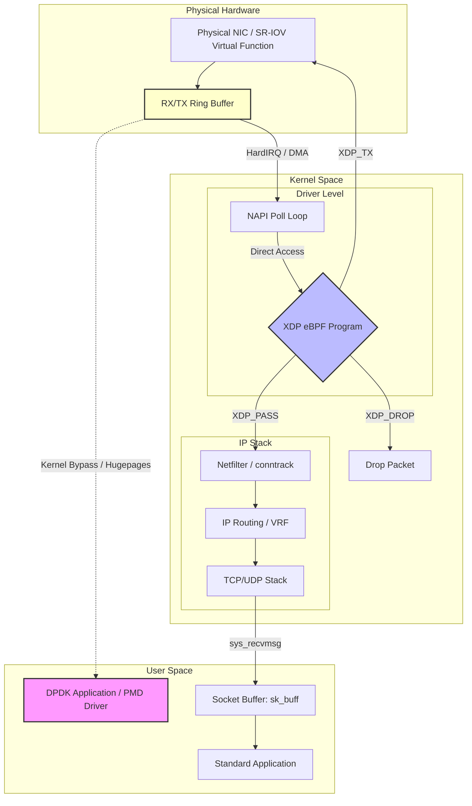

# Networking - Part 2 - Technical Study Guide & Notes

# DevOps & Cloud Study Guide
## Advanced Networking (Part 2/3): Performance, Security, Sandboxing, and Scale Boundaries

---

## 1. Part Introduction and Scope

This study guide focuses on the deep-tier architectural mechanics of modern networking. At scale, networking transitions from simple IP routing to a complex orchestration of kernel-level packet processing, virtualized data planes, and software-defined overlays. 

This guide covers:
*   **Linux Kernel Networking Optimization:** Driver-level packet processing, kernel bypass (DPDK/XDP), and sysctl tuning.
*   **Advanced Container & Kubernetes Networking:** eBPF-based data planes (Cilium), IPAM architectures, and high-performance container interfaces (SR-IOV, Multus).
*   **Network Sandboxing and Virtualization:** Network namespaces, Virtual Routing and Forwarding (VRF), overlay protocols (VXLAN, Geneve), and WireGuard mesh topologies.
*   **Cloud-Scale Hybrid Architectures:** High-throughput Transit Gateway topologies, PrivateLink architectures, and global BGP routing over Dedicated Interconnects.

---

## 2. Why These Concepts Are Critical for High-Availability Systems

In high-throughput, low-latency enterprise systems, the network is often the primary source of tail latency ($p99$ and $p99.9$ metrics) and system instability. 

```
[Client] ---> (Packet Drop / Retransmit) ---> [Load Balancer] ---> (Connection Queue Full) ---> [Application Pod]
```

### Tail Latency ($p99.9$) and Packet Processing Overhead
Standard Linux kernel packet processing relies on hardware interrupts. When a Network Interface Card (NIC) receives packets, it triggers a hardware interrupt (HardIRQ), forcing the CPU to suspend its current task to handle the packet. Under high packet-per-second (PPS) loads, this leads to **interrupt storms**, causing high CPU utilization in soft interrupt (softIRQ) context, CPU throttling, and increased latency.

### Connection Tracking (`nf_conntrack`) Exhaustion
Stateful firewalls and Kubernetes routing (via `iptables`) rely on the Netfilter connection tracking table (`nf_conntrack`). Under high-concurrency workloads (e.g., microservices handling millions of concurrent HTTP requests), this table can fill up. 

When the `nf_conntrack` table limits are exceeded, the kernel silently drops incoming packets, leading to connection timeouts, application retries, and eventual cascading failures across downstream services.

### Route Convergence Delays
In multi-region cloud environments, failure detection and route convergence times determine recovery speed. Relying on default BGP timers (e.g., 90-second hold time) can cause prolonged outages during fiber cuts or transit provider failures. 

Implementing **Bidirectional Forwarding Detection (BFD)** reduces link failure detection times to sub-second levels, triggering rapid BGP route convergence.

---

## 3. Real-World Enterprise Use Cases

### Use Case 1: Low-Latency Financial Data ingestion Engine
*   **The Problem:** A High-Frequency Trading (HFT) and market data ingestion engine must process millions of UDP multicast packets per second with sub-10-microsecond latency jitter. Standard Linux kernel TCP/IP processing introduces too much scheduling overhead and latency jitter.
*   **The Solution:** Deploy bare-metal worker nodes equipped with SR-IOV-enabled NICs. Utilize **DPDK (Data Plane Development Kit)** or **XDP (Express Data Path)** to bypass the kernel entirely, pulling packets directly from the NIC ring buffers into user-space memory buffers (hugepages).

### Use Case 2: Multi-Tenant Kubernetes SaaS Platform
*   **The Problem:** A SaaS provider hosts untrusted customer code across thousands of pods. They require strict network isolation (sandboxing), zero-trust mutual TLS (mTLS) without application-side sidecars, and the ability to handle 500,000 requests per second across services without experiencing `iptables` lock contention.
*   **The Solution:** Deploy **Cilium** as the CNI in **eBPF-replacement mode** (completely removing `kube-proxy`). Implement Cilium Network Policies that compile directly to eBPF bytecode executed within the kernel context. Enable eBPF-based WireGuard encryption for node-to-node transit and use Cilium's service-mesh-free mTLS.

---

## 4. Comprehensive Architecture Explanation

The diagram below illustrates the packet processing pathways within a high-performance Linux node. It highlights the differences between the **Standard Kernel Path**, the **eBPF/XDP Path** (which executes at the driver level), and the **Kernel Bypass Path (DPDK)**.



### Packet Flow Deep-Dive

#### 1. Standard Kernel Path (Slow Path)
*   The packet arrives at the NIC, which copies it via Direct Memory Access (DMA) into a descriptor in the RX Ring Buffer.
*   The NIC raises a hardware interrupt (HardIRQ). The CPU handles the interrupt, schedules a softIRQ, and hands control to the NAPI (New API) poll loop.
*   NAPI allocates a socket buffer structure (`sk_buff`) in system memory and copies the packet data.
*   The packet progresses through the Netfilter chain (checking `iptables` rules, updating `nf_conntrack` tables).
*   The routing engine determines the destination. The TCP/UDP stack processes the headers, handles windowing/reassembly, and places the payload into the socket's receive buffer.
*   The application wakes up via a system call (e.g., `epoll_wait`, `recv`), copying the data from kernel space to user space.

#### 2. eBPF/XDP Path (Fast Path)
*   An eBPF program is loaded into the network driver at the **XDP (Express Data Path)** layer.
*   As soon as the packet is DMA'd into the RX Ring Buffer, the XDP program executes directly on the packet raw data *before* any `sk_buff` allocation or memory copying occurs.
*   The XDP program can:
    *   `XDP_DROP`: Drop the packet immediately (ideal for DDoS mitigation).
    *   `XDP_TX`: Bounce the packet back out of the same interface.
    *   `XDP_REDIRECT`: Send the packet directly to another interface or a special user-space socket (`AF_XDP`), bypassing the TCP/IP stack.
    *   `XDP_PASS`: Pass the packet up to the standard Linux TCP/IP stack.

#### 3. Kernel Bypass Path (DPDK - Ultra-Fast Path)
*   The standard Linux kernel driver for the NIC is unbound and replaced with a DPDK-compatible Poll Mode Driver (PMD).
*   PMD runs in user space, continuously polling the NIC ring buffers without using interrupts.
*   Packets are copied directly into user-space memory allocated via **Hugepages** (2MB or 1GB physical memory pages, preventing Translation Lookaside Buffer (TLB) cache misses).
*   The kernel is completely bypassed, eliminating interrupt overhead, context switching, and `sk_buff` allocation latency.

---

## 5. Types, Classifications, and Components

### Container Network Interfaces (CNIs)

| Feature | iptables-based CNI (e.g., Flannel/Calico Default) | IPVS-based CNI (e.g., Calico IPVS) | eBPF-based CNI (e.g., Cilium) |
| :--- | :--- | :--- | :--- |
| **Routing Mechanism** | Sequential evaluation of `iptables` rules. | Hash-table lookup in kernel space. | Direct packet routing via eBPF maps. |
| **Scalability Limit** | Degrades significantly past 5,000 Services ($O(N)$ lookup). | Scalable to 20,000+ Services ($O(1)$ lookup). | Near-flat performance at extreme scale ($O(1)$ lookup). |
| **Network Policies** | Applied via complex chains of iptables rules. | Applied via ipset lists. | Compiled directly to kernel bytecode. |
| **Direct Server Return (DSR)**| No | Limited | Yes (fully supported). |

### Kernel Bypass Technologies

#### DPDK (Data Plane Development Kit)
Runs entirely in user space. Requires dedicated CPU cores pinned to 100% utilization to run the Poll Mode Drivers (PMDs). Ideal for network appliances (virtual firewalls, routers) but complex to integrate with standard socket-based Linux applications.

#### XDP (Express Data Path)
An in-kernel alternative. Allows high-performance packet processing while retaining the ability to fall back to the standard Linux kernel stack (`XDP_PASS`) for complex TCP handling. Does not require dedicated CPU pinning.

### Overlay vs. Underlay Network Architectures

*   **Underlay Network:** The physical or virtual network infrastructure (switches, routers, physical links) that routes packets using physical IP addresses (e.g., BGP-routed leaf-spine datacenter fabric).
*   **Overlay Network:** A virtual network encapsulated inside another network. 
    *   **VXLAN (Virtual Extensible LAN):** Encapsulates Layer 2 Ethernet frames inside Layer 3 UDP packets (destination port 4789). Uses a 24-bit Virtual Network Identifier (VNI), supporting up to 16 million isolated networks.
    *   **Geneve (Generic Network Virtualization Encapsulation):** Designed to overcome VXLAN limitations by introducing variable-length option fields, allowing metadata transmission (such as security contexts or telemetry) between endpoints.

---

## 6. Step-by-Step Production Implementation Guide

### Deploying Cilium CNI with eBPF Host Routing, Direct Server Return (DSR), and BGP Peering

This guide sets up a high-performance Kubernetes CNI configuration, replacing `kube-proxy` entirely with eBPF, enabling DSR to preserve client IPs and reduce latency, and configuring BGP to peer with top-of-rack (ToR) switches.

#### Step 1: Prepare Kernel Parameters on Kubernetes Nodes
Apply these settings to all control-plane and worker nodes:

```bash
# Enable IPv4 forwarding
sudo tee /etc/sysctl.d/99-kubernetes-cri.conf <<EOF
net.bridge.bridge-nf-call-iptables  = 1
net.bridge.bridge-nf-call-ip6tables = 1
net.ipv4.ip_forward                 = 1
EOF

sudo sysctl --system

# Mount the BPF filesystem (usually handled by systemd, but verify)
sudo mount bpffs /sys/fs/bpf -t bpf
```

#### Step 2: Install Cilium CLI
```bash
CILIUM_CLI_VERSION=$(curl -s https://api.github.com/repos/cilium/cilium-cli/releases/latest | grep -oP '"tag_name": "\K[^"]*')
CLI_ARCH=amd64
if [ "$(uname -m)" = "aarch64" ]; then CLI_ARCH=arm64; fi
curl -L --fail --remote-name-all https://github.com/cilium/cilium-cli/releases/download/${CILIUM_CLI_VERSION}/cilium-linux-${CLI_ARCH}.tar.gz{,.sha256sum}
sha256sum --check cilium-linux-${CLI_ARCH}.tar.gz.sha256sum
tar xzvfC cilium-linux-${CLI_ARCH}.tar.gz /usr/local/bin
rm cilium-linux-${CLI_ARCH}.tar.gz{,.sha256sum}
```

#### Step 3: Deploy Cilium via Helm with Optimized Parameters
Create a `values.yaml` file targeting high-performance parameters:

```yaml
# cilium-values.yaml
kubeProxyReplacement: "true"
k8sServiceHost: "10.0.0.10" # Replace with your API Server Load Balancer IP
k8sServicePort: "6443"

# Enable eBPF Host Routing (bypasses iptables entirely for pod-to-pod)
bpf:
  masquerade: true
  tproxy: true

# Enable Direct Server Return (DSR)
loadBalancer:
  mode: dsr
  algorithm: maglev # Consistent hashing algorithm for robust load balancing

# Enable WireGuard Encryption for Node-to-Node transit
encryption:
  enabled: true
  type: wireguard

# Enable Hubble for deep eBPF network observability
hubble:
  enabled: true
  metrics:
    enabled:
      - dns
      - drop
      - tcp
      - flow
      - port-distribution
  ui:
    enabled: true
```

Install Cilium using Helm:

```bash
helm repo add cilium https://helm.cilium.io/
helm install cilium cilium/cilium \
  --namespace kube-system \
  --values cilium-values.yaml
```

#### Step 4: Configure Cilium BGP Peering Policy
Apply a `CiliumBGPPeeringPolicy` to peer your Kubernetes nodes with physical leaf-spine switches.

```yaml
# bgp-policy.yaml
apiVersion: "cilium.io/v2alpha1"
kind: CiliumBGPPeeringPolicy
metadata:
  name: tor-bgp-peer
spec:
  nodeSelector:
    matchLabels:
      kubernetes.io/os: linux
  virtualRouters:
    - localASN: 65001
      exportPodCIDR: true
      neighbors:
        - peerAddress: "10.0.0.1/32" # IP of Leaf Switch A
          peerASN: 65000
          connectRetryTimeSeconds: 10
          holdTimeSeconds: 30
          keepAliveTimeSeconds: 10
        - peerAddress: "10.0.0.2/32" # IP of Leaf Switch B
          peerASN: 65000
          connectRetryTimeSeconds: 10
          holdTimeSeconds: 30
          keepAliveTimeSeconds: 10
```

Apply the policy:
```bash
kubectl apply -f bgp-policy.yaml
```

---

## 7. Standard CLI Commands with Deep Technical Explanations

### `ethtool` - Network Device Tuning
```bash
# Query the ring buffer sizes for interface eth0
ethtool -g eth0
```
*   **Explanation:** Shows the maximum and current RX (Receive) and TX (Transmit) ring buffer sizes. Small ring buffers lead to packet drops under microbursts.

```bash
# Set RX and TX ring buffer sizes to their maximum limits
ethtool -G eth0 rx 4096 tx 4096
```
*   **`-G`:** Modifies the generic ring buffer parameters of the specified network device.
*   **`rx 4096 tx 4096`:** Increases the descriptor count to 4096, allowing the driver to queue more incoming packets during periods of high CPU contention.

```bash
# Query offload capabilities of the NIC
ethtool -k eth0
```
*   **Explanation:** Shows features like TCP Segmentation Offload (TSO), Large Receive Offload (LRO), and Receive Side Scaling (RSS).

### `bpftool` - eBPF Program and Map Inspection
```bash
# List all loaded eBPF programs on the system
bpftool prog list
```
*   **Explanation:** Displays details of loaded eBPF programs, including their types (e.g., `xdp`, `sched_cls`), IDs, and associated helper functions.

```bash
# Inspect a specific BPF map to view routing or policy state
bpftool map dump id 42
```
*   **`id 42`:** Dumps the key-value pairs of the BPF map with ID 42. In Cilium, these maps hold the state for routing, load balancing, and network policies.

### `ss` - Advanced Socket Statistics
```bash
# Display detailed socket statistics, including TCP internal metrics and memory usage
ss -t -i -m -a
```
*   **`-t`:** Display TCP sockets.
*   **`-i`:** Show internal TCP information (RTT, congestion window `cwnd`, slow start threshold `ssthresh`).
*   **`-m`:** Show socket memory usage (read, write, and queue buffers in bytes).
*   **`-a`:** Show both listening and non-listening sockets.

---

## 8. Production Configuration Examples

### Hardened Linux Kernel Network Tuning (`/etc/sysctl.d/99-latency-perf.conf`)

This configuration is optimized for low latency, high throughput, and resilience against DDoS attacks (such as SYN floods).

```ini
# Maximize the read/write socket buffer sizes for high-bandwidth networks
net.core.rmem_max = 134217728
net.core.wmem_max = 134217728
net.ipv4.tcp_rmem = 4096 87380 67108864
net.ipv4.tcp_wmem = 4096 65536 67108864

# Increase the maximum number of open files and sockets
fs.file-max = 2097152

# Increase the maximum backlog queue of the kernel network stack
net.core.netdev_max_backlog = 100000

# Increase the maximum number of established connection tracking states
net.netfilter.nf_conntrack_max = 2097152
net.netfilter.nf_conntrack_tcp_timeout_established = 600

# Enable TCP BBR Congestion Control (requires Linux Kernel 4.9+)
net.core.default_qdisc = fq
net.ipv4.tcp_congestion_control = bbr

# TCP SYN Flood Protection
net.ipv4.tcp_syncookies = 1
net.ipv4.tcp_synack_retries = 2
net.ipv4.tcp_max_syn_backlog = 262144

# Disable TCP slow start after idle (keeps congestion window warm)
net.ipv4.tcp_slow_start_after_idle = 0

# Adjust local port range for high concurrency outbound connections
net.ipv4.ip_local_port_range = 10240 65535

# Enable TCP window scaling
net.ipv4.tcp_window_scaling = 1
```

---

## 9. Security Considerations & Hardening Best Practices

### DDoS Mitigation via XDP
To mitigate high-volume DDoS attacks (such as UDP amplification or SYN floods), rate-limiting or filtering must occur as early as possible in the packet processing path. 

Implementing filters at the XDP layer allows the system to drop malicious packets at the driver level, before the kernel allocates memory or cycles for them. This approach can handle orders of magnitude more packets per second than standard `iptables` rules.

```c
// Simplified C code for an XDP DDoS Mitigation Filter
#include <linux/bpf.h>
#include <bpf/bpf_helpers.h>
#include <linux/if_ether.h>
#include <linux/ip.h>

SEC("xdp")
int xdp_drop_malicious(struct xdp_md *ctx) {
    void *data_end = (void *)(long)ctx->data_end;
    void *data = (void *)(long)ctx->data;

    struct ethhdr *eth = data;
    if ((void *)(eth + 1) > data_end)
        return XDP_PASS;

    if (eth->h_proto == __constant_htons(ETH_P_IP)) {
        struct iphdr *iph = (void *)(eth + 1);
        if ((void *)(iph + 1) > data_end)
            return XDP_PASS;

        // Drop all traffic from a known malicious IP (e.g., 198.51.100.50)
        if (iph->saddr == __constant_htonl(0xC6336432)) { 
            return XDP_DROP;
        }
    }
    return XDP_PASS;
}

char _license[] SEC("license") = "GPL";
```

### Securing Cloud VPC Endpoints (PrivateLink)
When exposing internal microservices to other VPCs using PrivateLink, enforce the following security controls:
1.  **VPC Endpoint Policies:** Attach IAM policies to VPC Endpoints to restrict access to specific AWS actions or target resources (e.g., restrict S3 VPC Endpoint access to specific S3 buckets).
2.  **Private DNS Integration:** Enable Private DNS on VPC Endpoints to prevent DNS spoofing and ensure that internal requests resolve to the private endpoint IPs rather than public endpoints.
3.  **Strict Security Group Ingress:** Restrict Security Groups attached to the VPC Endpoint network interfaces (ENIs) to accept traffic only from authorized CIDRs or specific application security groups.

---

## 10. Observability & Monitoring Considerations

### Key Prometheus Metrics to Watch

*   **`node_netstat_TcpExt_ListenDrops`:** Non-zero values indicate that the application's connection backlog queue is full. This means the application cannot accept new connections fast enough, causing the kernel to drop incoming connection requests.
*   **`node_nf_conntrack_entries` vs `node_nf_conntrack_max`:** Measures the utilization of the connection tracking table. If utilization reaches 90%, alert immediately to prevent packet drops.
*   **`node_netstat_Tcp_RetransSegs`:** The rate of TCP segment retransmissions. High retransmission rates indicate packet drops along the network path or buffer bloat.
*   **`cilium_drop_count_total`:** Tracks packet drops executed by Cilium's eBPF programs, categorized by drop reason (e.g., `policy_denied`, `invalid_packet`).

### Log Aggregation and Flow Telemetry
Standard syslogs do not capture the granular flow details needed to debug complex microservice communication. Implement **eBPF-based flow logging** via Cilium Hubble:

```bash
# Stream real-time network flow logs filtered by a target namespace and output as JSON
hubble observe --namespace production -f -o json
```

This command streams detailed flow metadata, including source/destination identities, ports, protocols, TCP flags, and whether the traffic was allowed or blocked by a network policy.

---

## 11. Common Troubleshooting Scenarios with Root Cause Analysis (RCA)

### Scenario A: Packet Drops at the NIC Ring Buffer Level
*   **Symptoms:** Application experiences sudden latency spikes and connection timeouts under high load. `ifconfig` or `ip -s link show` reports high numbers of `rx_dropped` and `rx_missed_errors`.
*   **RCA Process:**
    1.  Run `ethtool -S eth0` to check hardware-level statistics. Notice that `rx_fifo_errors` or `rx_no_bufs` is incrementing.
    2.  Check CPU utilization across cores using `mpstat -P ALL 1`. Observe that Core 0 is running at 100% utilization in `%soft` (softIRQ processing context), while other cores are idle.
    3.  **Root Cause:** The NIC is routing all hardware interrupts to a single CPU core (Core 0), which cannot keep up with the incoming packet rate. This causes the RX ring buffer to overflow and drop packets before they reach the kernel.
    4.  **Resolution:** Enable **Receive Side Scaling (RSS)** or configure **Receive Packet Steering (RPS)** to distribute packet processing across multiple CPU cores. Increase the ring buffer size using `ethtool -G eth0 rx 4096`.

### Scenario B: Kubernetes Service Connection Timeouts under High Load
*   **Symptoms:** Pods report transient connection timeouts (e.g., `Connection reset by peer` or `i/o timeout`) when calling other internal services.
*   **RCA Process:**
    1.  Check kernel logs on the worker node hosting the source pod: `dmesg -T | grep -i conntrack`.
    2.  Find log entries stating: `nf_conntrack: table full, dropping packet`.
    3.  **Root Cause:** The system has exceeded the `net.netfilter.nf_conntrack_max` limit due to a high volume of short-lived concurrent TCP connections (e.g., microservices not using HTTP keep-alives).
    4.  **Resolution:** Increase the conntrack limits dynamically via sysctl (`sysctl -w net.netfilter.nf_conntrack_max=1048576`) and implement HTTP connection pooling in the application.

### Scenario C: MTU Mismatch over IPsec/VXLAN Tunnels
*   **Symptoms:** Small packets (such as ping or initial TCP handshakes) succeed, but large payloads (such as file transfers or large API responses) hang indefinitely and timeout.
*   **RCA Process:**
    1.  Run `tcpdump -i eth0 icmp` on the destination node.
    2.  Identify ICMP "Destination Unreachable, Fragmentation Needed and DF set" (Type 3, Code 4) packets being returned.
    3.  **Root Cause:** Overlay networks (VXLAN, Geneve, or IPsec) add encapsulation header overhead (e.g., VXLAN adds 50 bytes). If the physical underlay MTU is 1500 bytes, the overlay MTU must be set to 1450 bytes. If Path MTU Discovery (PMTUD) is blocked by firewalls dropping ICMP Type 3 Code 4 packets, the sender continues to transmit packets larger than the tunnel can handle, causing silent drops.
    4.  **Resolution:** Set the MTU of the virtual interfaces (CNI interfaces) to match the encapsulated limit (e.g., 1450). Alternatively, configure TCP MSS Clamping on the ingress/egress routers:
        ```bash
        iptables -t mangle -A POSTROUTING -p tcp --tcp-flags SYN,RST SYN -j TCPMSS --clamp-mss-to-pmtu
        ```

---

## 12. Common Mistakes and How to Avoid Them in Production

### 1. Ignoring MTU Overhead on Overlay Networks
*   **The Mistake:** Deploying a custom overlay network (VXLAN or Geneve) on VMs with default MTU configurations (1500 bytes) without adjusting VM or pod MTU settings.
*   **The Consequence:** Packet fragmentation, high CPU overhead, and connection drops during large payload transfers.
*   **The Fix:** Always calculate the encapsulation overhead and set the pod/overlay interface MTU accordingly. If using AWS with Jumbo Frames enabled, set the physical interface MTU to 9001 and the overlay to 8951.

### 2. Relying on Default `iptables`-based `kube-proxy` at Scale
*   **The Mistake:** Scaling a Kubernetes cluster beyond 1,000 services while using the default `kube-proxy` in `iptables` mode.
*   **The Consequence:** Every service addition or deletion requires a full rebuild of the node's `iptables` rules. Under continuous deployments, this causes high CPU usage, lock contention on `iptables`, and latency spikes.
*   **The Fix:** Migrate to an IPVS-based or eBPF-based CNI (like Cilium) before scaling beyond 500 services.

### 3. Misconfiguring VPC CIDR Blocks Leading to IP Exhaustion
*   **The Mistake:** Assigning small CIDR blocks (e.g., `/24`) to subnets hosting dynamic Kubernetes clusters or ECS tasks.
*   **The Consequence:** Rapid IP address exhaustion, preventing new pods or tasks from scaling up during traffic spikes.
*   **The Fix:** Use secondary CIDR blocks in AWS VPCs or implement CNIs that support custom IPAM configurations, such as allocating separate, non-routable overlays for pods while reserving host IPs.

---

## 13. Enterprise-Level Recommendations

### Tuning TCP BBR Congestion Control
The default TCP congestion control algorithm in many Linux distributions is Cubic, which is loss-based. On modern networks, packet loss does not always indicate congestion. 

**BBR (Bottleneck Bandwidth and RTT)** is a model-based congestion control algorithm developed by Google. It measures the maximum bottleneck bandwidth and minimum round-trip time, achieving higher throughput and lower latency over lossy, high-bandwidth links.

```bash
# Enable BBR congestion control
sysctl -w net.core.default_qdisc=fq
sysctl -w net.ipv4.tcp_congestion_control=bbr
```

### Kernel Bypass (DPDK) vs. eBPF (XDP) Decision Matrix
*   **Choose DPDK if:** You are building dedicated, high-performance network appliances (firewalls, load balancers, or CDN edge nodes) where you can dedicate specific CPU cores to continuous polling, and you do not need standard Linux kernel integration.
*   **Choose XDP/eBPF if:** You need high-performance packet filtering, routing, or load balancing, but still want to run standard Linux applications that require a fully functional TCP/IP stack.

### Connection Pooling and Keep-Alive Tuning
In microservice architectures, opening and closing a TCP connection for every API request introduces latency and uses up local ports.
*   **Keep-Alive Tuning:** Set `Keep-Alive` headers with long timeouts (e.g., 60 seconds) on internal HTTP clients and servers.
*   **TCP Keep-Alive Probes:** Configure aggressive TCP keep-alive probes to quickly detect and clean up dead connections:
    ```ini
    net.ipv4.tcp_keepalive_time = 300
    net.ipv4.tcp_keepalive_intvl = 15
    net.ipv4.tcp_keepalive_probes = 5
    ```

---

## 14. Advanced Concepts

### Direct Server Return (DSR)
In traditional load balancing architectures, returning traffic must pass back through the load balancer to rewrite the source IP. This makes the load balancer a bottleneck for outbound traffic.

```
Traditional:  [Client]  <--->  [Load Balancer]  <--->  [Backend Server]
DSR:          [Client]  --->   [Load Balancer]  --->   [Backend Server] ---> [Client] (Direct)
```

In **Direct Server Return (DSR)** mode, the load balancer forwards the incoming packet to the backend server without modifying the destination IP (it encapsulates the packet or uses MAC address routing). The backend server configures a local loopback interface with the Load Balancer's VIP. 

When the backend server responds, it sends the response packet directly to the client using the VIP as the source IP, bypassing the load balancer entirely. This drastically reduces load balancer CPU usage and latency.

### Single Root I/O Virtualization (SR-IOV)
SR-IOV is a hardware-level technology that allows a single physical PCIe device (like a physical NIC) to appear as multiple virtual devices (Virtual Functions, or VFs). 

```
[Physical NIC]
   |---> Physical Function (PF) - Hypervisor Management
   |---> Virtual Function 1 (VF1) ---> Direct PCIe Assignment ---> [VM 1]
   |---> Virtual Function 2 (VF2) ---> Direct PCIe Assignment ---> [VM 2]
```

By assigning a Virtual Function directly to a virtual machine or container namespace, the guest OS bypasses the hypervisor's virtual switch. This provides near-bare-metal network performance and low latency.

### Segment Routing over IPv6 (SRv6)
SRv6 is an advanced source routing paradigm. The source node encodes a list of instructions (segments) directly into the IPv6 packet header extension. These segments guide the packet along a specific path through the network, enabling Traffic Engineering (TE), service chaining, and network slicing without relying on complex label protocols like MPLS.

---

## 15. Integration with Other DevOps Tools

### Terraform: AWS Transit Gateway Hub-and-Spoke Topology

This configuration deploys a central Transit Gateway (TGW) to connect two VPCs (Application and Shared Services) while enforcing routing isolation.

```hcl
# main.tf

provider "aws" {
  region = "us-east-1"
}

# Create AWS Transit Gateway
resource "aws_ec2_transit_gateway" "tgw" {
  description                     = "Production Hub-and-Spoke Transit Gateway"
  default_route_table_association = "disable"
  default_route_table_propagation = "disable"
  dns_support                     = "enable"

  tags = {
    Name = "prod-tgw"
  }
}

# VPC A: Application VPC
module "vpc_a" {
  source  = "terraform-aws-modules/vpc/aws"
  version = "5.0.0"
  name    = "vpc-application"
  cidr    = "10.1.0.0/16"
  azs     = ["us-east-1a", "us-east-1b"]
  private_subnets = ["10.1.1.0/24", "10.1.2.0/24"]
}

# VPC B: Shared Services VPC
module "vpc_b" {
  source  = "terraform-aws-modules/vpc/aws"
  version = "5.0.0"
  name    = "vpc-shared-services"
  cidr    = "10.2.0.0/16"
  azs     = ["us-east-1a", "us-east-1b"]
  private_subnets = ["10.2.1.0/24", "10.2.2.0/24"]
}

# Attach VPC A to TGW
resource "aws_ec2_transit_gateway_vpc_attachment" "tgw_attach_vpc_a" {
  transit_gateway_id = aws_ec2_transit_gateway.tgw.id
  vpc_id             = module.vpc_a.vpc_id
  subnet_ids         = module.vpc_a.private_subnets
}

# Attach VPC B to TGW
resource "aws_ec2_transit_gateway_vpc_attachment" "tgw_attach_vpc_b" {
  transit_gateway_id = aws_ec2_transit_gateway.tgw.id
  vpc_id             = module.vpc_b.vpc_id
  subnet_ids         = module.vpc_b.private_subnets
}

# Transit Gateway Route Table
resource "aws_ec2_transit_gateway_route_table" "tgw_rt" {
  transit_gateway_id = aws_ec2_transit_gateway.tgw.id
  tags = {
    Name = "tgw-main-route-table"
  }
}

# Associate VPC A & B Attachments to Route Table
resource "aws_ec2_transit_gateway_route_table_association" "assoc_a" {
  transit_gateway_attachment_id = aws_ec2_transit_gateway_vpc_attachment.tgw_attach_vpc_a.id
  transit_gateway_route_table_id = aws_ec2_transit_gateway_route_table.tgw_rt.id
}

resource "aws_ec2_transit_gateway_route_table_association" "assoc_b" {
  transit_gateway_attachment_id = aws_ec2_transit_gateway_vpc_attachment.tgw_attach_vpc_b.id
  transit_gateway_route_table_id = aws_ec2_transit_gateway_route_table.tgw_rt.id
}

# Propagate Routes from VPC A & B into Route Table
resource "aws_ec2_transit_gateway_route_table_propagation" "prop_a" {
  transit_gateway_attachment_id = aws_ec2_transit_gateway_vpc_attachment.tgw_attach_vpc_a.id
  transit_gateway_route_table_id = aws_ec2_transit_gateway_route_table.tgw_rt.id
}

resource "aws_ec2_transit_gateway_route_table_propagation" "prop_b" {
  transit_gateway_attachment_id = aws_ec2_transit_gateway_vpc_attachment.tgw_attach_vpc_b.id
  transit_gateway_route_table_id = aws_ec2_transit_gateway_route_table.tgw_rt.id
}
```

### Ansible: Automated Kernel Sysctl and Driver Tuning Playbook

This playbook configures sysctl parameters and sets NIC ring buffers across target nodes.

```yaml
---
# playbooks/tune_network.yml
- name: Advanced Network Optimization and Driver Tuning
  hosts: kubernetes_nodes
  become: true
  tasks:
    - name: Apply System-wide Sysctl Performance Parameters
      ansible.posix.sysctl:
        name: "{{ item.key }}"
        value: "{{ item.value }}"
        state: present
        sysctl_file: /etc/sysctl.d/99-performance-networking.conf
        reload: true
      loop:
        - { key: 'net.core.rmem_max', value: '134217728' }
        - { key: 'net.core.wmem_max', value: '134217728' }
        - { key: 'net.core.netdev_max_backlog', value: '100000' }
        - { key: 'net.netfilter.nf_conntrack_max', value: '2097152' }
        - { key: 'net.core.default_qdisc', value: 'fq' }
        - { key: 'net.ipv4.tcp_congestion_control', value: 'bbr' }

    - name: Install ethtool for driver tuning
      ansible.builtin.package:
        name: ethtool
        state: present

    - name: Configure Network Interface Ring Buffers
      ansible.builtin.command:
        cmd: ethtool -G eth0 rx 4096 tx 4096
      register: ethtool_output
      changed_when: "'No change' not in ethtool_output.stderr"
      failed_when: false
```

---

## 16. Comparison Tables with Competing Tools

### Kubernetes Container Network Interfaces (CNIs)

| Feature / Criteria | Flannel (Host-Gateway) | Calico (IPVS Mode) | Cilium (eBPF Mode) |
| :--- | :--- | :--- | :--- |
| **Data Plane Technology** | Kernel Routing / vxlan | IPVS / iptables / ipset | eBPF (Extended Berkeley Packet Filter) |
| **Network Policy Support**| None | Comprehensive (L3/L4) | Advanced (L3/L4/L7 with Envoy integration) |
| **Latency (Pod-to-Pod)**  | Low (No encapsulation in host-gw) | Low | Ultra-Low (Bypasses Netfilter entirely) |
| **CPU Overhead**          | Low | Medium (At scale due to rules) | Very Low (Flat $O(1)$ lookup performance) |
| **Encryption Support**    | IPSec (Experimental) | WireGuard / IPSec | WireGuard / IPSec (Native eBPF) |
| **Service Mesh Integration**| External (Istio/Linkerd) | External | Built-in Service Mesh (No-sidecar option) |
| **Ideal Use Case**        | Small, low-complexity clusters. | Enterprise clusters with standard policies. | Large-scale, high-concurrency, multi-tenant. |

### Hybrid Network Connectivity

| Feature / Criteria | AWS Transit Gateway | AWS VPC Peering | AWS Cloud WAN |
| :--- | :--- | :--- | :--- |
| **Topology**              | Hub-and-Spoke | Full Mesh | Global Segmented Network |
| **Routing Management**    | Centralized Route Tables | Decentralized (Each VPC) | Policy-Driven (Central Core Network Policy) |
| **Inter-Region Support**  | Yes (Via Peering TGWs) | Yes | Yes (Native multi-region routing) |
| **Bandwidth Limits**      | Up to 50 Gbps per VPC attachment | No limit (Full line rate) | Up to 100+ Gbps |
| **Latency**               | Low (+ ~1-2ms hops) | Direct (No intermediate hops) | Low (+ global backbone latency) |
| **Cost Structure**        | Hourly charge + Data processing fee. | Data transfer fee only. | Hourly segment charge + Data processing fee. |
| **Ideal Use Case**        | Mid-to-Large scale multi-VPC networks. | Point-to-point high-throughput VPCs. | Enterprise global multi-region networks. |

---

## 17. Visual Cheat Sheet

The following cheat sheet maps common networking bottlenecks and production requirements to their specific kernel parameters, tool configurations, and diagnostics:

| Bottleneck / Goal | Primary Metric / Symptom | Kernel Parameter / Tool Settings | Diagnostic Tool |
| :--- | :--- | :--- | :--- |
| **SYN Flood Protection** | High CPU, dropped half-open connections. | `net.ipv4.tcp_syncookies = 1`<br>`net.ipv4.tcp_max_syn_backlog = 262144` | `netstat -s \| grep "SYNs to LISTEN"` |
| **Network Buffer Sizing** | Slow WAN transfers, high RTT. | `net.core.rmem_max = 134217728`<br>`net.ipv4.tcp_rmem = 4096 87380 67108864` | `ss -ti` (Monitor `cwnd` and `ssthresh`) |
| **Connection Tracking Overflow**| Packet drops under high concurrency. | `net.netfilter.nf_conntrack_max = 2097152` | `dmesg -T \| grep "conntrack"` |
| **NIC Ring Buffer Overflow** | `rx_dropped` and `rx_missed_errors` incrementing. | `ethtool -G eth0 rx 4096 tx 4096` | `ethtool -S eth0` |
| **CPU SoftIRQ Imbalances** | Single CPU core pinned at 100% in `%soft`. | Enable RPS/RFS in `/sys/class/net/eth0/device/rps_cpus` | `mpstat -P ALL 1` |
| **MTU Mismatch Drops** | Handshakes succeed, payload transfers hang. | Adjust MTU on overlay interfaces (e.g., 1450 for VXLAN) | `ping -M do -s 1472 <destination_ip>` |
| **Pod-to-Pod Latency** | High latency under iptables rule evaluation. | Deploy Cilium with `kubeProxyReplacement="true"` | `cilium monitor` / `hubble observe` |

---

## 18. Comprehensive Final Learning Summary

To master enterprise DevOps and Cloud networking at an expert level, keep these core principles in mind:

1.  **Kernel Bypass is King for Extreme Performance:** When designing systems that process millions of packets per second (e.g., real-time streaming, HFT, or ad-tech), the standard Linux kernel TCP/IP stack becomes a bottleneck. Technologies like DPDK and XDP/eBPF are essential for keeping latency low.
2.  **eBPF is Replacing Legacy Netfilter/iptables:** In modern Kubernetes environments, legacy `iptables` rules do not scale. Transitioning to eBPF-based CNIs (like Cilium) replaces sequential rule evaluation with $O(1)$ hash table lookups, reducing latency and scaling to thousands of services.
3.  **Always Account for MTU Overhead:** Encapsulation protocols (VXLAN, Geneve, IPsec) add extra headers to packets. If you do not adjust your MTU settings across virtual interfaces, packet fragmentation and silent drops will impact system performance.
4.  **Monitor Connection Tracking and Buffers:** High-availability systems require proactive monitoring of network queues and tables. Keep a close eye on `nf_conntrack` utilization, NIC ring buffers, and TCP retransmissions to detect and resolve network bottlenecks before they cause outages.

### Q21. eBPF vs. IPTables in Kubernetes CNI: Architectural Mechanics, Performance at Scale, and Kernel-Space Execution

**Detailed Answer**:
Traditional Kubernetes CNIs (like standard Calico or Flannel) historically relied on `iptables` or IPVS (IP Virtual Server) to route traffic and enforce network policies. `iptables` relies on sequential rule evaluation. For every packet entering or leaving a node, the Linux kernel must traverse a linked list of rules ($O(N)$ complexity). At scale—with thousands of Services and NetworkPolicies—this linear search causes severe CPU utilization spikes, packet processing latency, and slow updates (since the entire rule set must be replaced atomically via `iptables-restore`). IPVS improves on this by using hash tables ($O(1)$ lookup complexity) for load balancing, but it still relies on `iptables` for packet filtering and NetworkPolicy execution, meaning the sequential traversal bottleneck remains for security policy evaluation.

Extended Berkeley Packet Filter (eBPF) revolutionizes this by running sandboxed programs directly inside the Linux kernel in response to specific system events (e.g., network packets hitting the network driver's RX ring buffer). CNIs like Cilium leverage eBPF to bypass the entire TCP/IP and `iptables` stack when possible. eBPF programs are compiled into bytecode, verified for safety by the kernel verifier, and JIT-compiled into native CPU instructions. 

By attaching eBPF programs to the eXpress Data Path (XDP) or Traffic Control (tc) layers, Cilium processes packets at the lowest possible level of the network stack. Instead of traversing sequential rules, Cilium performs $O(1)$ lookups in highly efficient kernel BGP/IP maps (hash tables, LPM trie) to determine routing, NAT, and security policy enforcement. This results in minimal CPU overhead, near-wire-speed throughput, and sub-millisecond packet processing latency, even with tens of thousands of active endpoints and complex security rules.

```
[ Traditional Path ]
Packet -> NIC -> Driver -> IP Stack -> conntrack -> iptables (Sequential rules) -> Pod veth

[ Cilium eBPF Path ]
Packet -> NIC -> Driver -> XDP/TC (eBPF Map Lookup O(1)) -> Direct to Pod veth (Bypasses IP stack)
```

**Production Scenario / Practical Example**:
In a 2,000-node Kubernetes cluster running a microservices architecture with frequent deployments, updating an `iptables` rule set with 50,000 rules causes 100% CPU spikes on the host's `systemd-udevd` and `kube-proxy` threads, introducing a 5-second latency tail ($p99.9$) on inter-pod communications.

To transition to Cilium in eBPF mode and completely replace `kube-proxy`, apply the following Helm configuration:

```yaml
# cilium-values.yaml
kubeProxyReplacement: "true"
k8sServiceHost: "10.0.0.10" # Control plane load balancer IP
k8sServicePort: "6443"
bpf:
  masquerade: true
  tproxy: true
localRedirectPolicy: true
operator:
  prometheus:
    enabled: true
prometheus:
  enabled: true
```

Deploy the configuration:
```bash
helm repo add cilium https://helm.cilium.io/
helm install cilium cilium/cilium --namespace kube-system -f cilium-values.yaml
```

Verify the eBPF map state and verify that no `iptables` rules are generated for Kubernetes Services:
```bash
# Exec into a Cilium agent pod
kubectl exec -n kube-system daemonset/cilium -c cilium-agent -- cilium status --verbose

# Inspect the active eBPF load-balancing map
kubectl exec -n kube-system daemonset/cilium -c cilium-agent -- bpftool map dump name cilium_lb4_services
```

---

### Q22. BGP Peering with Top-of-Rack (ToR) Switches in Calico/Cilium: Route Reflectors, ECMP, and Scale Boundaries

**Detailed Answer**:
In large-scale, bare-metal Kubernetes deployments, overlay networks (like VXLAN or Geneve) introduce encapsulation overhead (typically 50 bytes per packet), increase CPU utilization due to packet encapsulation/decapsulation, and obscure physical network visibility. To avoid this, CNIs like Calico and Cilium support native routing via Border Gateway Protocol (BGP). Under this architecture, each Kubernetes node acts as a BGP router (using software like Bird or GoBGP) and advertises Pod IP blocks (`/26` or `/24` CIDRs) directly to the physical Top-of-Rack (ToR) switches.

There are two primary BGP topologies at scale:
1.  **Full-Mesh BGP**: Every node peers with every other node. This is simple but does not scale beyond 100-200 nodes, as the number of BGP connections grows quadratically ($N(N-1)/2$).
2.  **Route Reflectors (RR)**: Nodes peer only with a designated set of Route Reflectors (which can be centralized high-capacity software nodes or the physical ToR switches themselves). The RRs receive routes and reflect them to all other peers, reducing the connection complexity to $O(N)$.

To achieve high availability and horizontal scaling, **Equal-Cost Multi-Path (ECMP)** routing is enabled on the physical switches. When a service is exposed via an external IP or LoadBalancer, the BGP daemon on multiple Kubernetes nodes advertises the same service IP to the ToR switch. The switch distributes incoming traffic across these nodes using a hashing algorithm (typically a 5-tuple hash: Source IP, Source Port, Destination IP, Destination Port, Protocol).

Scale boundaries to consider:
*   **ToR Switch Route Table Limits**: Low-end or older ASIC switches may only support 1,000 to 4,000 IPv4 routes. If a cluster has 2,000 nodes, each with its own Pod CIDR, the switch's Forwarding Information Base (FIB) can overflow, causing packets to be dropped or routed via software (slow path).
*   **BGP Convergence Time**: During a node failure or rolling update, BGP sessions must teardown and routes must converge. If BGP timers are left at defaults (Keepalive: 30s, Hold-time: 90s), traffic may be blackholed for up to 90 seconds. These must be tuned to aggressive sub-second values using Bidirectional Forwarding Detection (BFD).

**Production Scenario / Practical Example**:
An enterprise bare-metal cluster with 500 nodes needs to peer with Cisco Nexus 9300 ToR switches using Calico BGP with BFD enabled for sub-second failover.

Configure the Calico `BGPConfiguration` and `BGPPeer` custom resources:

```yaml
apiVersion: projectcalico.org/v3
kind: BGPConfiguration
metadata:
  name: default
spec:
  logSeverityScreen: Info
  nodeToNodeMeshEnabled: false # Disable full-mesh
  asNumber: 64512
  serviceClusterIPs:
  - cidr: 10.96.0.0/16
---
apiVersion: projectcalico.org/v3
kind: BGPPeer
metadata:
  name: tor-switch-rack1-a
spec:
  peerIP: 192.168.10.254
  asNumber: 64511
  nodeSelector: rack == "rack1"
---
apiVersion: projectcalico.org/v3
kind: BGPPeer
metadata:
  name: tor-switch-rack1-b
spec:
  peerIP: 192.168.10.253
  asNumber: 64511
  nodeSelector: rack == "rack1"
```

To enable sub-second link failure detection, define a BFD profile and associate it with the peer:

```yaml
apiVersion: projectcalico.org/v3
kind: BFDConfig
metadata:
  name: fast-failover
spec:
  minRxInterval: 250ms
  minTxInterval: 250ms
  multiplier: 3
```

Apply these manifests using `calicoctl`:
```bash
export KUBECONFIG=/etc/kubernetes/admin.conf
calicoctl apply -f calico-bgp-config.yaml

# Check the BGP peer status from a node
calicoctl node status
```

---

### Q23. High-Performance Networking: SR-IOV and DPDK in Kubernetes

**Detailed Answer**:
Standard container networking relies on virtual ethernet (`veth`) pairs. When a packet arrives at the physical network interface card (NIC), the kernel processes an interrupt, copies the packet buffer (`sk_buff`) into kernel memory, processes it through the TCP/IP stack (including routing, firewalling, and NAT), and then copies it again across the user-kernel boundary into the container's memory space. This path introduces context switches, CPU interrupts, and memory-copy overheads, limiting performance to roughly 10-15 Gbps per CPU core, with substantial latency jitter.

For ultra-low latency and line-rate performance (e.g., 100 Gbps+ for telco VNFs, 5G UPF, or high-frequency trading platforms), two technologies are used:

1.  **SR-IOV (Single Root I/O Virtualization)**: A hardware-level technology that allows a single physical PCIe device (Physical Function - PF) to present itself as multiple separate virtual PCIe devices (Virtual Functions - VF). Each VF acts as an independent PCIe network card with its own MAC address. Using the SR-IOV CNI, a VF can be passed directly into a Pod's network namespace using PCI passthrough (bypassing the host's kernel network stack entirely).
2.  **DPDK (Data Plane Development Kit)**: A set of libraries and drivers that run entirely in **user space**. DPDK bypasses the Linux kernel completely. Instead of relying on interrupts, DPDK applications use a PMD (Poll Mode Driver) that continuously polls the RX/TX rings on the SR-IOV VF. It maps the physical card's memory directly into the user-space application's memory using hugepages (Uio/VFIO kernel drivers), achieving zero-copy packet processing.

```
[ Standard veth ]
NIC -> Kernel Interrupt -> sk_buff -> IP Stack -> Namespace veth -> App (Multiple Copies)

[ SR-IOV + DPDK ]
NIC (VF) -> Direct PCI Passthrough -> Hugepages (User Space Memory) -> DPDK App (Zero-Copy, Poll Mode)
```

Trade-offs of this architecture:
*   **Loss of Kubernetes Abstractions**: Pods using SR-IOV cannot use standard Kubernetes Services, `kube-proxy` load balancing, or standard CNIs/NetworkPolicies because traffic bypasses the host kernel.
*   **CPU Pinning**: DPDK Poll Mode Drivers require 100% utilization of the assigned CPU cores to constantly poll the NIC. These cores must be isolated (`isolcpus`) from the OS scheduler.
*   **No Live Migration / Pod Rescheduling flexibility**: Pods are bound to specific hardware nodes.

**Production Scenario / Practical Example**:
An SRE needs to deploy a real-time media streaming engine that requires SR-IOV interfaces and DPDK-enabled zero-copy packet processing.

First, enable hugepages on the Kubernetes worker node via GRUB:
```bash
# Append to /etc/default/grub
GRUB_CMDLINE_LINUX_DEFAULT="... default_hugepagesz=1G hugepagesz=1G hugepages=16 intel_iommu=on iommu=pt"
update-grub && reboot
```

Configure the SR-IOV Network Device Plugin on the cluster. Create an `SriovNetworkNodePolicy` to partition an Intel X710 NIC (`ens1f0`) into 8 Virtual Functions:

```yaml
apiVersion: sriovnetwork.openshift.io/v1
kind: SriovNetworkNodePolicy
metadata:
  name: dpdk-policy
  namespace: openshift-sriov-network-operator
spec:
  resourceName: intel_sriov_dpdk
  nodeSelector:
    feature.node.kubernetes.io/network-sriov.capable: "true"
  priority: 99
  numVfs: 8
  nicSelector:
    pfNames: ["ens1f0"]
  deviceType: vfio-pci # Use VFIO driver for DPDK compatibility
```

Define the network attachment using Multus CNI:

```yaml
apiVersion: sriovnetwork.openshift.io/v1
kind: SriovNetwork
metadata:
  name: sriov-dpdk-network
  namespace: openshift-sriov-network-operator
spec:
  resourceName: intel_sriov_dpdk
  networkNamespace: default
  ipam: |
    {
      "type": "static",
      "addresses": [
        {
          "address": "10.100.1.10/24"
        }
      ]
    }
```

Deploy a Pod that consumes the SR-IOV resource, requests 1GB hugepages, and runs a DPDK-based application:

```yaml
apiVersion: v1
kind: Pod
metadata:
  name: dpdk-app
  annotations:
    k8s.v1.cni.cncf.io/networks: sriov-dpdk-network
spec:
  containers:
  - name: testpmd
    image: sdnvols/dpdk-app-testpmd:v20.11
    securityContext:
      privileged: true # Required for direct memory access
      capabilities:
        add: ["NET_RAW", "SYS_RAWIO"]
    resources:
      requests:
        memory: 2Gi
        cpu: "4"
        intel.com/intel_sriov_dpdk: "1"
        hugepages-1Gi: 2Gi
      limits:
        memory: 2Gi
        cpu: "4"
        intel.com/intel_sriov_dpdk: "1"
        hugepages-1Gi: 2Gi
    volumeMounts:
    - mountPath: /dev/hugepages
      name: hugepage
  volumes:
  - name: hugepage
    emptyDir:
      medium: HugePages
```

---

### Q24. MTU Mismatch Troubleshooting and Optimization in Overlay Networks

**Detailed Answer**:
Maximum Transmission Unit (MTU) defines the largest size packet (in bytes) that a network interface can accept without fragmenting it. For standard Ethernet, the default MTU is 1500 bytes.

When using overlay networks (VXLAN, Geneve, IP-in-IP), the CNI encapsulates the original Ethernet frame inside an outer IP/UDP header. This encapsulation adds overhead:
*   **VXLAN**: 50 bytes (IP header: 20B + UDP header: 8B + VXLAN header: 8B + Inner Ethernet: 14B).
*   **Geneve**: Variable, but typically 50 bytes.
*   **IP-in-IP**: 20 bytes.

If the physical network MTU is 1500, and the virtual interface (e.g., `cali+` or `flannel.1`) inside the container is also configured for 1500, any packet larger than 1450 bytes (for VXLAN) will exceed the physical interface's capacity once encapsulated. 

This triggers one of two scenarios:
1.  **IP Fragmentation**: The host kernel splits the outer IP packet into multiple fragments. This severely degrades performance because the receiving CPU must buffer and reassemble the fragments.
2.  **Silent Packet Drops (Blackholing)**: If the application sets the "Don't Fragment" (DF) flag in the IP header (standard for TCP Path MTU Discovery), and a router or switch along the path cannot forward the packet because it exceeds the MTU, it drops the packet and is *supposed* to return an ICMP "Destination Unreachable / Fragmentation Needed" (Type 3, Code 4) message back to the sender. If firewalls or security groups block this ICMP traffic, the sender never knows to reduce its packet size. The TCP handshake (using small packets) succeeds, but as soon as the application attempts to transmit data (e.g., an HTTP response containing a TLS handshake), the connection hangs indefinitely.

```
[ Application Payload: 1460B ] 
     + TCP/IP Headers (40B) = 1500B
[ CNI Encapsulation (VXLAN: +50B) ] 
     = 1550B -> Exceeds Physical NIC MTU (1500B) -> Packet Dropped / Fragmented
```

To prevent this, the CNI's MTU must be set to at least 50 bytes *less* than the physical network's MTU (e.g., 1450 on a 1500 network). Conversely, if the physical network supports Jumbo Frames (MTU 9000), the CNI MTU should be tuned to 8950 to maximize throughput and minimize CPU overhead from packet processing.

**Production Scenario / Practical Example**:
An application deployed on AWS EKS with an overlay CNI (e.g., Calico VXLAN) experiences sporadic timeouts during large API payload transfers. The physical AWS VPC network has an MTU of 9001 (Jumbo Frames), but the Calico virtual interfaces are misconfigured at 1450.

To diagnose the MTU mismatch, run a ping test with the Don't Fragment flag from inside the client container:
```bash
# Ping the target service with a 1472-byte payload + 28-byte IP/ICMP header = 1500 bytes
ping -M do -s 1472 10.244.15.23
# If it fails with "frag needed and DF set", there is an MTU mismatch along the path.
```

To optimize the Calico CNI to utilize EKS's 9001 MTU, update the Calico `FelixConfiguration`:

```yaml
apiVersion: projectcalico.org/v3
kind: FelixConfiguration
metadata:
  name: default
spec:
  # 9001 (AWS VPC MTU) - 50 (VXLAN overhead) = 8951
  vxlantmtu: 8951
```

Apply the configuration and trigger a rolling restart of the Calico node daemonset:
```bash
calicoctl apply -f felix-config.yaml
kubectl rollout restart daemonset/calico-node -n kube-system
```

Verify that the runtime interface MTUs on the hosts have updated:
```bash
# Run on a worker node
ip link show | grep vxlan
# Output should show: vxlan.calico: <...,MTU 8951,...>
```

---

### Q25. TCP BBR Congestion Control vs. Cubic in Cloud-Native Workloads

**Detailed Answer**:
TCP Cubic is the default congestion control algorithm in most Linux distributions. It is a loss-based algorithm, meaning it detects network congestion by looking for dropped packets. Cubic aggressively increases its congestion window ($cwnd$) until a packet drop occurs, at which point it assumes congestion has occurred and cuts its window size by roughly 30%. This approach works well in low-latency, highly stable local networks, but performs poorly on modern, high-bandwidth, high-latency WAN links (such as cross-region cloud traffic or edge-to-cloud connections). In these environments, packet loss is often random (due to transient radio interference or router buffer tail-drops) and does not necessarily indicate a saturated link. This causes Cubic to prematurely throttle its throughput, leading to the "Bufferbloat" phenomenon where network buffers are kept perpetually full, driving up latency without increasing throughput.

BBR (Bottleneck Bandwidth and Round-trip propagation time) is a model-based congestion control algorithm developed by Google. Instead of reacting to packet loss, BBR continuously measures:
1.  **RTprop**: The minimum Round-Trip Time (RTT) over a moving window (the physical propagation delay of the path).
2.  **BtlBw**: The maximum delivery rate (the bottleneck bandwidth of the path).

Using these two metrics, BBR constructs a real-time model of the network path. It maintains the volume of in-flight data equal to the Bandwidth-Delay Product ($\text{BDP} = \text{BtlBw} \times \text{RTprop}$). By keeping the inflight data strictly bounded, BBR maximizes throughput while keeping queueing delay at the bottleneck router close to zero. Even in networks with up to 20% random packet loss, BBR maintains near-line-rate throughput, whereas Cubic's throughput drops to near zero.

```
[ Cubic ] -> Sends packets until buffer overflows -> Packet Loss -> Drastic Window Cut -> High Jitter
[ BBR ]   -> Calculates Bottleneck Bandwidth & RTT -> Sends at exact rate -> No Buffer Overflow -> Stable Latency
```

For cloud-native workloads, migrating API Gateways, CDN edge nodes, or database replication engines (e.g., cross-region PostgreSQL replica traffic) to BBR results in lower $p99$ response times and higher throughput.

**Production Scenario / Practical Example**:
An API gateway deployed in AWS `us-east-1` serves clients globally, encountering high latency and connection instability. The SRE team decides to enable TCP BBR on the host nodes.

Verify the current congestion control algorithm on the host:
```bash
sysctl net.ipv4.tcp_congestion_control
# Output: net.ipv4.tcp_congestion_control = cubic
```

To enable BBR, the kernel's queuing discipline (`qdisc`) must be switched to `fq` (Fair Queueing), which is a prerequisite for BBR's pacing mechanism.

Create a kernel configuration file `/etc/sysctl.d/99-bbr.conf`:
```ini
# Enable Fair Queueing (FQ) system-wide
net.core.default_qdisc = fq

# Set TCP congestion control to BBR
net.ipv4.tcp_congestion_control = bbr

# Increase max buffer sizes to support high BDP paths
net.core.rmem_max = 134217728
net.core.wmem_max = 134217728
net.ipv4.tcp_rmem = 4096 87380 67108864
net.ipv4.tcp_wmem = 4096 65536 67108864
```

Load the new sysctl parameters:
```bash
sudo sysctl --system
```

Verify that BBR is active:
```bash
sysctl net.ipv4.tcp_congestion_control
# Output: net.ipv4.tcp_congestion_control = bbr

# Confirm the BBR kernel module is loaded
lsmod | grep bbr
```

---

### Q26. Mutual TLS (mTLS) Performance Overhead in Service Meshes and Mitigation Strategies

**Detailed Answer**:
Mutual TLS (mTLS) ensures cryptographically verified identity and encryption in transit between microservices. However, introducing mTLS at scale via service meshes (like Istio/Envoy or Linkerd) imposes significant performance overhead along three vectors:

1.  **Connection Handshake Latency**: A standard TLS 1.3 handshake requires 1 round-trip (RTT) to exchange keys, certificates, and establish a session. If microservices frequently open and close connections instead of reusing them, this handshake adds milliseconds of latency to every request.
2.  **Cryptographic CPU Overhead**: Symmetric encryption/decryption (typically AES-GCM or ChaCha20-Poly1305) of the payload must be performed on both the egress proxy (client-side) and ingress proxy (server-side). For high-throughput services (e.g., database queries, caching layers), this can consume up to 20-30% of allocated CPU resources.
3.  **Proxy Memory and Routing Overhead**: The sidecar proxy must parse the protocol layers (L7 HTTP parsing) to apply routing and security rules.

```
Without Service Mesh:
[Pod A App] --------------------------------------------------------------------> [Pod B App]

With Service Mesh mTLS:
[Pod A App] -> (L4 Loopback) -> [Envoy Egress Proxy] -> (mTLS WAN) -> [Envoy Ingress Proxy] -> (L4 Loopback) -> [Pod B App]
```

To mitigate these overheads, SREs employ several strategies:
*   **Session Resumption (TLS Session Tickets / Session IDs)**: Allows clients and servers to reuse previously negotiated cryptographic keys for subsequent connections, reducing the handshake to 0-RTT.
*   **Hardware Acceleration (Intel AVX-512 / QAT)**: Leveraging CPU instruction sets like AVX-512 or dedicated QuickAssist Technology (QAT) to offload cryptographic operations from standard CPU cycles.
*   **ALPN (Application-Layer Protocol Negotiation)**: Ensuring HTTP/2 or gRPC is negotiated over mTLS to multiplex multiple requests over a single, long-lived TCP connection, amortizing the handshake cost to near zero.
*   **eBPF-based Sidecar Bypass**: Using eBPF (via Cilium) to copy bytes directly socket-to-socket within the same host, bypassing the TCP/IP stack when Pod A and Pod B reside on the same node.

**Production Scenario / Practical Example**:
An SRE observes that an Istio-enabled cluster suffers from a 15% increase in latency and a massive spike in proxy CPU utilization. Investigation reveals that the application does not reuse connections, causing continuous TLS handshakes.

To optimize, configure Istio's `DestinationRule` to enforce connection pooling, keep-alive settings, and enable TLS Session Resumption:

```yaml
apiVersion: networking.istio.io/v1alpha3
kind: DestinationRule
metadata:
  name: payment-service-opt
  namespace: production
spec:
  host: payment-service.production.svc.cluster.local
  trafficPolicy:
    connectionPool:
      tcp:
        maxConnections: 1024
        connectTimeout: 30ms
      http:
        http1MaxPendingRequests: 100
        maxRequestsPerConnection: 1000 # Force reuse of TCP connections
        idleTimeout: 90s
    tls:
      mode: ISTIO_MUTUAL
```

To enable hardware-accelerated crypto (AES-NI) on the Envoy sidecars, patch the Istio sidecar injector to use optimized cryptographic libraries by targeting nodes with modern CPU instruction sets:

```yaml
apiVersion: apps/v1
kind: Deployment
metadata:
  name: payment-processor
  namespace: production
spec:
  template:
    metadata:
      annotations:
        # Instruct Envoy to use optimized cipher suites
        sidecar.istio.io/controlPlaneAuthPolicy: MUTUAL_TLS
        sidecar.istio.io/bootstrapOverride: "custom-envoy-bootstrap"
    spec:
      affinity:
        nodeAffinity:
          requiredDuringSchedulingIgnoredDuringExecution:
            nodeSelectorTerms:
            - matchExpressions:
              - key: lscpu.aesni
                operator: In
                values: ["true"]
      containers:
      - name: payment-processor
        image: payment:v2.1
```

---

### Q27. Network Policies Scale Boundaries: IPSet vs. IPTables/NFTables under High Churn

**Detailed Answer**:
In Kubernetes, Network Policies define how groups of pods are allowed to communicate with each other and other network endpoints. The enforcement of these policies is delegated to the CNI. How the CNI implements these policies under the hood determines its scalability boundaries:

1.  **IPTables-based Enforcement (Legacy Calico/Flannel)**: Each Network Policy is translated into a set of `iptables` rules. If a policy allows traffic from a specific namespace with 500 pods, the CNI may generate 500 individual `iptables` rules (one for each IP). In high-churn environments (where pods are constantly created, destroyed, or rescheduled), the CNI daemon must constantly rebuild the entire rule set and invoke `iptables-restore`. During this atomic reload, the host kernel locks the `iptables` table, blocking other network operations and causing latency spikes.
2.  **IPSet-based Enforcement (Optimized Calico/Kube-Router)**: Instead of creating a separate rule for every IP address, the CNI creates an `IPSet` (a kernel-space hash table designed for fast IP lookups). The `iptables` rule then references the IPSet (e.g., `-m set --match-set allowed-pods src`). When pods are added or removed, the CNI only updates the IPSet in memory ($O(1)$ complexity) instead of regenerating the entire `iptables` chain ($O(N)$ complexity). This significantly reduces CPU utilization and deployment latency under high churn.
3.  **NFTables (Modern Linux Firewalls)**: The successor to `iptables`, `nftables` uses a lightweight virtual machine inside the kernel that executes bytecode. It natively supports sets, maps, and concatenated keys, providing much higher performance and cleaner state updates than `iptables`.
4.  **eBPF Maps (Cilium)**: Bypasses firewalls altogether. Policy rules are compiled into eBPF hash maps. When a packet arrives, the eBPF program performs a direct lookup in the map using the source/destination IP as the key. If the lookup fails or evaluates to "deny", the packet is dropped immediately in the kernel driver layer.

```
[ IPTables ] -> Linear Scan (Rule 1 -> Rule 2 -> ... -> Rule 10000) -> High CPU, Slow Updates
[ IPSet ]    -> Hash Lookup (Match IP in Set) -> Fast, Low CPU
[ eBPF Map ] -> O(1) Map Lookup in Kernel Driver -> Near-Zero Latency, Instant Updates
```

**Production Scenario / Practical Example**:
A large-scale batch-processing cluster runs 10,000 short-lived pods per hour. The SRE team observes that during batch starts, node CPU usage spikes to 100% due to `calico-node` and `kube-proxy` attempting to rewrite thousands of `iptables` rules, leading to inter-pod connection timeouts.

To diagnose the size and churn of `iptables` and `ipset` on a compromised node:
```bash
# Count the number of iptables rules
iptables-save | wc -l

# Check the active IPSets and their member counts
ipset list | head -n 50
```

To resolve this scale boundary, migrate the Calico CNI configuration to utilize IPSet optimization and ensure Felix (Calico's agent) is tuned for high-churn workloads:

```yaml
apiVersion: projectcalico.org/v3
kind: FelixConfiguration
metadata:
  name: default
spec:
  # Enable aggressive IPSet usage
  maxIpsets: 10000
  # Reduce the interval for syncing rules to kernel to prevent CPU thrashing
  iptablesSyncPeriod: "5s"
  # Optimize the size of IPSets
  ipsetMinSize: 128
  # Enable eBPF dataplane if the kernel supports it (fully bypassing iptables)
  bpfEnabled: true
```

Apply this optimization:
```bash
calicoctl apply -f optimized-felix.yaml
```

---

### Q28. DNS Latency and Scaling in Kubernetes: CoreDNS Tuning, NodeLocal DNSCache, and Ndots

**Detailed Answer**:
DNS resolution is the foundation of service discovery in Kubernetes. By default, every service resolution (e.g., `payment.production.svc.cluster.local`) is processed by the centralized CoreDNS deployment. At scale, this architecture introduces major latency and reliability issues due to three key factors:

1.  **Ndots Configuration**: The default `/etc/resolv.conf` in a Kubernetes pod is configured with `ndots:5`. This means that if a domain name contains fewer than 5 dots (which is true for almost all external domains like `api.stripe.com` and internal services like `payment`), the guest OS resolver will sequentially append the search domains listed in `/etc/resolv.conf` before attempting to resolve the absolute name:
    *   `api.stripe.com.production.svc.cluster.local` (NXDOMAIN)
    *   `api.stripe.com.svc.cluster.local` (NXDOMAIN)
    *   `api.stripe.com.cluster.local` (NXDOMAIN)
    *   `api.stripe.com` (SUCCESS)
    This results in 3 useless queries sent to CoreDNS for every single external DNS lookup, quadrupling the DNS load on the cluster.
2.  **UDP Conntrack Exhaustion**: DNS queries use UDP by default. UDP is stateless, so the Linux kernel's Netfilter conntrack module must create a pseudo-state entry to track the response. Under high DNS query rates, the conntrack table (`nf_conntrack_max`) can overflow, causing random packet drops and a 5-second timeout (due to standard glibc resolver behavior).
3.  **NodeLocal DNSCache**: To mitigate conntrack exhaustion and reduce latency, NodeLocal DNSCache runs a DNS caching agent on every node as a DaemonSet. It intercepts DNS queries from local pods via a loopback interface (`169.254.20.10`), resolving cached queries locally and upgrading external queries to TCP to bypass UDP conntrack tracking.

```
[ Pod ] -> (UDP, ndots:5) -> [ NodeLocal DNSCache (169.254.20.10) ]
                                 | (Cache Hit) -> Return IP
                                 | (Cache Miss) -> (TCP) -> [ CoreDNS Service ] -> Upstream DNS
```

**Production Scenario / Practical Example**:
An application experiences intermittent 5-second connection delays when calling external APIs. SRE logs show `nf_conntrack: table full, dropping packet` errors on the host nodes.

Step 1: Deploy NodeLocal DNSCache to the cluster. Save the standard manifest from the Kubernetes repository and apply it:
```bash
kubectl apply -f https://raw.githubusercontent.com/kubernetes/kubernetes/master/cluster/addons/dns/nodelocaldns/nodelocaldns.yaml
```

Step 2: Optimize CoreDNS performance by tuning its `Corefile` ConfigMap to enable aggressive caching and autopath:

```yaml
apiVersion: v1
kind: ConfigMap
metadata:
  name: coredns
  namespace: kube-system
data:
  Corefile: |
    .:53 {
        errors
        health {
           lameduck 5s
        }
        ready
        kubernetes cluster.local in-addr.arpa ip6.arpa {
           pods verified
           fallthrough in-addr.arpa ip6.arpa
           ttl 30
        }
        prometheus :9153
        forward . /etc/resolv.conf {
           max_concurrent 1000
        }
        cache 30 {
           success 9984 # Max cache size for successful queries
           denial 9984  # Max cache size for NXDOMAIN queries
           prefetch 10 1m 10% # Prefetch entries before expiration
        }
        loop
        reload
        loadbalance
    }
```

Step 3: Optimize the application's Pod specification to set `ndots:2` if the app primarily accesses external APIs, or use absolute domain names (ending with a dot: `api.stripe.com.`) in code to bypass the search path entirely:

```yaml
apiVersion: apps/v1
kind: Deployment
metadata:
  name: api-client
spec:
  template:
    spec:
      dnsConfig:
        options:
        - name: ndots
          value: "2"
        - name: timeout
          value: "1"
        - name: attempts
          value: "2"
      containers:
      - name: client
        image: client-app:v1.0
```

---

### Q29. Multi-Homed Pods with Multus CNI: Architecture, Use Cases, and Configuration

**Detailed Answer**:
By default, Kubernetes assigns exactly one network interface (`eth0`) to each Pod, managed by the primary CNI. While this simplifies routing, it is highly restrictive for specialized workloads that require physical network separation, high-performance data planes, or administrative isolation.

**Multus CNI** is a meta-CNI (or "CNI multiplexer"). It does not implement networking itself; instead, it acts as an orchestrator that calls multiple other CNIs sequentially during Pod creation. Under a Multus-managed architecture:
*   **Primary Interface (`eth0`)**: Typically connected to a standard overlay or routing CNI (like Calico or Flannel). This interface handles standard Kubernetes control plane traffic, readiness/liveness probes, and internal service discovery.
*   **Secondary Interfaces (`net1`, `net2`, etc.)**: Connected to specialized CNIs (like SR-IOV, Macvlan, Host-device, or standard bridge CNIs). These interfaces route high-performance data plane traffic, connect to isolated storage networks (e.g., SAN, iSCSI), or interface directly with legacy physical subnets.

```
                  +-----------------------+
                  |         Pod           |
                  |  +------+   +------+  |
                  |  | eth0 |   | net1 |  |
                  +--+--+---+---+--+---+--+
                        |          |
         [Primary CNI] -+          +- [Secondary CNI (SR-IOV)]
                        |          |
                 (K8s Network)   (High-Speed Storage/Data Plane)
```

Key architectural use cases:
1.  **Telco VNFs (Virtual Network Functions)**: Splitting control, user, and management planes across different physical networks.
2.  **Storage Isolation**: Dedicating a physical NIC on worker nodes strictly for Ceph, GlusterFS, or NFS storage traffic, ensuring application traffic cannot saturate storage bandwidth.
3.  **Security Demilitarized Zones (DMZs)**: Routing a container directly to an external VLAN for public ingress, while keeping its control plane secure on an internal private subnet.

**Production Scenario / Practical Example**:
An SRE needs to configure a database pod that requires standard Kubernetes access via `eth0` (Calico), but must read/write to an isolated high-speed storage network via `net1` using a physical network interface (`ens2f1`) via the Macvlan CNI.

First, ensure Multus is installed in the cluster:
```bash
kubectl apply -f https://raw.githubusercontent.com/k8snetworkplumbingwg/multus-cni/master/deployments/multus-daemonset.yml
```

Define a `NetworkAttachmentDefinition` (NAD) for the secondary Macvlan interface:

```yaml
apiVersion: "k8s.cni.cncf.io/v1"
kind: NetworkAttachmentDefinition
metadata:
  name: storage-macvlan
  namespace: default
spec:
  config: '{
      "cniVersion": "0.3.1",
      "type": "macvlan",
      "master": "ens2f1",
      "mode": "bridge",
      "ipam": {
        "type": "host-local",
        "subnet": "192.168.100.0/24",
        "rangeStart": "192.168.100.50",
        "rangeEnd": "192.168.100.150",
        "routes": [
          { "dst": "192.168.100.0/24" }
        ],
        "gateway": "192.168.100.1"
      }
    }'
```

Deploy a Pod that requests this network attachment via annotations:

```yaml
apiVersion: v1
kind: Pod
metadata:
  name: database-pod
  annotations:
    k8s.v1.cni.cncf.io/networks: storage-macvlan
spec:
  containers:
  - name: db-engine
    image: postgres:15
    resources:
      limits:
        memory: 4Gi
        cpu: "2"
```

Verify that the Pod has both interfaces:
```bash
kubectl exec -it database-pod -- ip addr
# Output should show:
# eth0: standard pod network IP (e.g., 10.244.x.x)
# net1: macvlan storage network IP (e.g., 192.168.100.50)
```

---

### Q30. AWS VPC CNI Prefix Delegation vs. Secondary IP Mode: Scaling Pod Density

**Detailed Answer**:
By default, the AWS VPC CNI allocates IP addresses to Pods directly from the VPC's CIDR block. It does this by attaching Elastic Network Interfaces (ENIs) to the EC2 worker nodes and assigning private secondary IPv4 addresses to those ENIs. 

This model introduces a significant **Pod Density Bottleneck**. Every EC2 instance type has a hard limit on the number of ENIs it can support, and the number of secondary IP addresses per ENI. The maximum number of Pods per node is calculated as:
$$\text{Max Pods} = (\text{Number of ENIs} \times (\text{IPv4 Addresses per ENI} - 1)) + 2$$
For example, a `t3.medium` instance supports a maximum of 3 ENIs and 6 IPs per ENI. This limits the node to a maximum of 17 Pods. If you deploy lightweight microservices, the node's CPU and memory resources may be mostly idle, but the node cannot schedule any more Pods because it has run out of IP addresses.

To overcome this scale boundary, AWS introduced **Prefix Delegation**. Instead of allocating individual `/32` secondary IP addresses, the VPC CNI allocates entire `/28` IPv4 address prefixes (blocks of 16 IPs) to each ENI slot. This exponentially increases the available IP addresses per ENI. For a `t3.medium`, prefix delegation increases the theoretical maximum to 110 Pods (which is the maximum pod limit enforced by EKS for that instance size to prevent resource starvation).

```
[ Secondary IP Mode ]
ENI 1 -> [IP 1 (Host)] [IP 2 (Pod A)] [IP 3 (Pod B)] [IP 4 (Pod C)] -> Max 4 Pods

[ Prefix Delegation Mode ]
ENI 1 -> [Prefix 1 (/28 - 16 IPs)] [Prefix 2 (/28 - 16 IPs)] -> Max 32 Pods
```

Key considerations when enabling Prefix Delegation:
*   **IP Exhaustion in Subnets**: Since each node pre-allocates blocks of 16 IPs, a subnet can run out of IPs very quickly if many small nodes are launched, even if the pods are not actually using those IPs. This requires careful tuning of the warm target parameters (`WARM_PREFIX_TARGET`, `WARM_IP_TARGET`).
*   **Subnet Fragmentation**: Large contiguous blocks of 16 IPs are required. If a subnet is highly fragmented, ENI allocation will fail.

**Production Scenario / Practical Example**:
An SRE is running out of IP addresses on an EKS cluster with `m5.large` instances. The instances are under-utilized, but Kubernetes cannot schedule more pods due to the ENI IP limit.

To transition the AWS VPC CNI to Prefix Delegation, configure the `aws-node` DaemonSet environment variables:

```bash
# Enable prefix delegation
kubectl set env daemonset/aws-node -n kube-system AWS_VPC_K8S_CNI_CUSTOM_NETWORK_CFG=true
kubectl set env daemonset/aws-node -n kube-system ENABLE_PREFIX_DELEGATION=true

# Tune warm targets to prevent aggressive IP pre-allocation (saves VPC subnet IPs)
kubectl set env daemonset/aws-node -n kube-system WARM_PREFIX_TARGET=1
kubectl set env daemonset/aws-node -n kube-system WARM_IP_TARGET=5
```

For the changes to take effect on existing worker nodes, the nodes must be recycled or their `kubelet` configuration must be updated to support the new max-pods calculation. Update the user data script in your Launch Template to recalculate max-pods:

```bash
#!/bin/bash
/etc/eks/bootstrap.sh my-cluster-name \
  --use-max-pods false \
  --kubelet-extra-args '--max-pods=110'
```

Verify that the node capacity has updated:
```bash
kubectl get nodes -o custom-columns=NAME:.metadata.name,PODS:.status.allocatable.pods
# Output should show the allocatable pods limit has increased to 110
```

---

### Q31. Kernel Network Stack Tuning (`sysctl`) for High-Throughput, Low-Latency API Gateways

**Detailed Answer**:
Out-of-the-box Linux kernel parameters are optimized for general-purpose server workloads, not for high-throughput, low-latency API gateways (e.g., Kong, Envoy, Nginx) handling hundreds of thousands of concurrent TCP connections. Under extreme load, a default kernel will suffer from dropped connections, high tail latency, and socket allocation failures.

To optimize the Linux kernel network stack, several layers must be tuned via `sysctl`:

1.  **Connection Backlog (`somaxconn` & `tcp_max_syn_backlog`)**:
    *   `net.core.somaxconn`: The maximum backlog of established connections waiting to be accepted by the application (via the `accept()` system call). If the application is temporarily blocked, this queue fills up, and the kernel starts dropping incoming connections.
    *   `net.ipv4.tcp_max_syn_backlog`: The maximum number of half-open connections (SYN received, SYN-ACK sent, waiting for the final ACK). Essential for surviving connection spikes and SYN flood attacks.
2.  **TCP Window and Buffer Sizes (`rmem`/`wmem`)**:
    *   `net.ipv4.tcp_rmem` and `net.ipv4.tcp_wmem`: Define the minimum, default, and maximum memory allocated for TCP receive and send buffers. Larger buffers allow the TCP window size to scale up, which is crucial for maximizing throughput on high-bandwidth links.
3.  **Socket Reuse and Timeouts (`tw_reuse` & `fin_timeout`)**:
    *   When a connection closes, the socket enters the `TIME_WAIT` state for $2 \times \text{MSL}$ (Maximum Segment Lifetime, typically 60 seconds) to ensure delayed packets are received.
    *   `net.ipv4.tcp_tw_reuse`: Allows the kernel to safely recycle `TIME_WAIT` sockets for outgoing connections if it is safe from a protocol standpoint, preventing local port exhaustion.
4.  **Local Port Range (`ip_local_port_range`)**:
    *   Defines the range of ephemeral ports used for outbound connections (e.g., from the API Gateway to upstream microservices).

```
[ Incoming SYN ] -> [ tcp_max_syn_backlog Queue ] -> [ somaxconn Queue ] -> [ App accept() ]
```

**Production Scenario / Practical Example**:
An API Gateway experiences random connection timeouts during traffic spikes. The SRE observes thousands of connections stuck in `TIME_WAIT` and kernel logs indicating `TCP: request_sock_TCP: Possible SYN flooding on port 80. Sending cookies.`

To optimize the kernel parameters on the API Gateway host nodes, apply the following configuration to `/etc/sysctl.d/99-api-gateway.conf`:

```ini
# Increase the maximum number of open files and file descriptors
fs.file-max = 2097152

# Increase max connection backlog queues
net.core.somaxconn = 65535
net.ipv4.tcp_max_syn_backlog = 65535

# Set ephemeral port range to maximize outbound capacity
net.ipv4.ip_local_port_range = 1024 65535

# Enable quick recycling of TIME_WAIT sockets
net.ipv4.tcp_tw_reuse = 1
net.ipv4.tcp_fin_timeout = 15

# Disable slow start after idle to maintain high speeds
net.ipv4.tcp_slow_start_after_idle = 0

# Optimize TCP buffer sizes (values in bytes: min, default, max)
net.core.rmem_max = 16777216
net.core.wmem_max = 16777216
net.ipv4.tcp_rmem = 4096 87380 16777216
net.ipv4.tcp_wmem = 4096 65536 16777216

# Increase the maximum size of the network card RX queue
net.core.netdev_max_backlog = 100000
```

Load the configuration:
```bash
sudo sysctl --system
```

Verify that the application's listen backlog is configured to utilize the new kernel limits (e.g., in Nginx config):
```nginx
# nginx.conf
server {
    listen 80 backlog=65535;
    ...
}
```

---

### Q32. Service Mesh Bypass with Cilium eBPF: Sockmap / Socket Operations

**Detailed Answer**:
In a standard Service Mesh architecture (e.g., Istio or Linkerd), a sidecar proxy (Envoy) is injected into the Pod's network namespace. When the application container communicates with another microservice, the traffic path is highly inefficient:

1.  The application writes bytes to its TCP socket.
2.  The packet travels down the application's local TCP/IP stack in the kernel.
3.  `iptables` rules intercept the packet and redirect it to the loopback interface (`lo`) on port 15001/15006 (Envoy's listener).
4.  The packet travels back up the kernel TCP/IP stack to the Envoy proxy.
5.  Envoy processes the L7 headers, determines routing, and writes the bytes to a new socket.
6.  The packet travels down Envoy's TCP/IP stack, through the physical NIC, and onto the network.

This loopback traversal occurs twice on the sending host and twice on the receiving host, costing substantial CPU cycles and adding latency.

Cilium overcomes this by using **eBPF Sockmap (Socket Map)** and socket operations (`sockops`) programs. When two containers on the same host (or an application and its sidecar proxy in the same Pod) communicate, Cilium's eBPF program intercepts the socket system calls (`write`, `sendmsg`) at the system call interface. 

Instead of converting the data into TCP segments, IP packets, and traversing the loopback network stack, the eBPF program copies the data packets **directly from the write buffer of the sender's socket to the read buffer of the receiver's socket** in kernel space. This completely bypasses the entire TCP/IP engine, routing tables, and firewall layers.

```
[ Standard Path ]
App Socket -> TCP/IP -> Loopback -> TCP/IP -> Envoy Socket (Multiple traversals)

[ Cilium eBPF Sockmap Bypass ]
App Socket ----------------- (Direct Kernel Memory Copy) -----------------> Envoy Socket
```

**Production Scenario / Practical Example**:
An SRE wants to reduce the latency overhead introduced by Istio sidecars for co-located microservices.

To enable Cilium's socket-layer bypass, the cluster must run Cilium with the `sockops` feature enabled. Ensure your Cilium Helm configuration contains:

```yaml
# cilium-values.yaml
cgroup:
  autoMount:
    enabled: true
sockops:
  enabled: true
```

Upgrade the Cilium installation:
```bash
helm upgrade cilium cilium/cilium --namespace kube-system -f cilium-values.yaml
```

To verify that the eBPF socket maps are active and capturing socket connections, inspect the active BPF maps on a node:
```bash
# Exec into a Cilium agent pod
kubectl exec -n kube-system daemonset/cilium -c cilium-agent -- bpftool map show name cilium_sock_ops

# Dump the contents of the socket map to see tracked socket connections
kubectl exec -n kube-system daemonset/cilium -c cilium-agent -- bpftool map dump name cilium_sock_ops
```

Once active, any TCP traffic between the application container and its Envoy sidecar (or any other container on the same node) bypasses the TCP/IP stack, cutting local communication latency by up to 50%.

---

### Q33. Anycast Routing in Cloud Networks: Globally Distributed, Low-Latency Ingress

**Detailed Answer**:
Anycast is a network addressing and routing technique where multiple physical servers (located in different geographic regions) share the exact same IP address. 

When a client sends a packet to an Anycast IP address, routers along the path use Border Gateway Protocol (BGP) to route the packet to the "closest" physical destination. In this context, "closest" is defined by the BGP path vector metric (typically the fewest Autonomous System hops), which generally correlates with physical geographic proximity and low latency.

```
                  +-----------------------+
                  |       Client          |
                  +-----------+-----------+
                              |
                     [ Internet Routers ]
                     /                 \ (BGP Shortest Path)
                    /                   \
        +----------v----------+       +--v------------------+
        |   Edge Router US    |       |   Edge Router EU    |
        |    IP: 1.1.1.1      |       |    IP: 1.1.1.1      |
        +---------------------+       +---------------------+
```

Benefits of Anycast in Cloud-Native Ingress:
1.  **Low Latency**: Clients are automatically routed to the nearest Edge Point of Presence (PoP), where the TCP handshake is terminated immediately.
2.  **DDoS Mitigation**: Distributed Denial of Service (DDoS) traffic is naturally dispersed across all globally distributed PoPs. A single PoP can be overwhelmed and taken offline (or scrubbed) without impacting traffic to other regions, preventing a global outage.
3.  **Instant Failover**: If a regional data center goes offline, the local BGP router withdraws the Anycast IP advertisement. The global BGP tables converge, and subsequent client packets are automatically routed to the next closest active PoP.

Implementation in Cloud Providers:
*   **AWS Global Accelerator**: Uses Anycast IPs to ingest traffic into the AWS edge network close to the user, then routes it over AWS's private, congestion-free fiber backbone to the application load balancer (ALB) in the target region.
*   **Cloudflare / Google Cloud Load Balancing (GCLB)**: Uses a single global Anycast IP address to terminate SSL/TLS connections at the edge, caching static content and proxying dynamic requests.

**Production Scenario / Practical Example**:
An SRE needs to configure a globally distributed API with deployments in `us-east-1` and `eu-west-1` to use AWS Global Accelerator to minimize latency and ensure automatic regional failover.

Create an AWS Global Accelerator using the AWS CLI:

```bash
# Create the Accelerator (this generates 2 static Anycast IPs)
aws globalaccelerator create-accelerator \
  --name global-api-accelerator \
  --ip-address-type IPV4 \
  --enabled

# Note the Accelerator ARN from the output:
# arn:aws:globalaccelerator::123456789012:accelerator/a1b2c3d4-e5f6...
```

Create a Listener for TCP port 443:
```bash
aws globalaccelerator create-listener \
  --accelerator-arn arn:aws:globalaccelerator::123456789012:accelerator/a1b2c3d4-e5f6... \
  --port-ranges FromPort=443,ToPort=443 \
  --protocol TCP \
  --client-affinity NONE
```

Create Endpoint Groups for both the US and EU regions, attaching the respective regional Application Load Balancers (ALBs):

```bash
# US Endpoint Group
aws globalaccelerator create-endpoint-group \
  --listener-arn arn:aws:globalaccelerator::123456789012:listener/l1m2n3... \
  --endpoint-group-region us-east-1 \
  --endpoint-configurations EndpointId=arn:aws:elasticloadbalancing:us-east-1:123456789012:loadbalancer/app/us-alb/... Weight=128 ClientIPPreservationEnabled=true

# EU Endpoint Group
aws globalaccelerator create-endpoint-group \
  --listener-arn arn:aws:globalaccelerator::123456789012:listener/l1m2n3... \
  --endpoint-group-region eu-west-1 \
  --endpoint-configurations EndpointId=arn:aws:elasticloadbalancing:eu-west-1:123456789012:loadbalancer/app/eu-alb/... Weight=128 ClientIPPreservationEnabled=true
```

Configure DNS: Update your public DNS zone (e.g., Route53) to map `api.mycompany.com` to the two Anycast IP addresses provided by the Global Accelerator.

---

### Q34. Network Sandboxing: gVisor (runsc) vs. Kata Containers Network Virtualization

**Detailed Answer**:
Standard containers share the host's Linux kernel. If an attacker escapes a container (e.g., via a kernel exploit like Dirty COW), they gain root access to the entire host. To run untrusted code safely, SREs implement **Network Sandboxing** using runtimes like gVisor or Kata Containers. However, these runtimes take fundamentally different approaches to network virtualization, resulting in distinct performance and architectural profiles:

#### 1. gVisor (`runsc`)
gVisor is a user-space kernel written in Go. It implements a virtual kernel interface (`Sentry`) that intercepts and handles all system calls made by the application container. 

To isolate networking, gVisor implements its own network stack called **Netstack** (written entirely in Go). The Sentry does not allow the container to make direct socket system calls to the host kernel. Instead, all socket calls are processed inside Netstack. Netstack communicates with the host network via a virtual raw socket or a `tun` tap device. 

*   **Security**: Extremely high. The host kernel's network stack is completely hidden from the application.
*   **Performance**: Poor. Every packet must be copied across multiple user-kernel boundaries (Application -> Sentry -> Netstack -> Host Kernel -> Physical NIC), resulting in high latency and limited throughput.

#### 2. Kata Containers
Kata Containers runs each Pod inside a dedicated, lightweight Virtual Machine (microVM) using hypervisors like QEMU or Firecracker. Each VM has its own isolated Linux kernel.

To connect the microVM to the Kubernetes network, Kata uses a virtual ethernet device (`veth`) on the host, which is bridged to a virtual PCI network card (using `virtio-net` or `macvtap`) inside the VM.

*   **Security**: High. Isolation is enforced at the hardware level by the CPU's VT-x/AMD-V extensions.
*   **Performance**: Much higher than gVisor. Because the microVM runs a real Linux kernel, it can use the standard, highly optimized Linux network stack. Using technologies like `vhost-net`, packet processing is offloaded to the host kernel, achieving near-native throughput.

```
[ Standard Container ]  App -> Host Kernel Network Stack (Shared)
[ gVisor Sandbox ]      App -> Sentry (Go Netstack) -> Host Kernel (TUN/TAP) -> NIC
[ Kata Container ]      App -> Guest Kernel Stack -> virtio-net -> Host Kernel (vhost-net) -> NIC
```

**Production Scenario / Practical Example**:
An SRE needs to run a third-party Python script execution engine in a multi-tenant cluster. Due to the risk of untrusted code execution, the SRE must choose and configure the appropriate sandbox runtime.

To configure Kata Containers with Firecracker in Kubernetes, register the `RuntimeClass`:

```yaml
apiVersion: node.k8s.io/v1
kind: RuntimeClass
metadata:
  name: kata-fc
handler: kata-fc # Must match the handler configured in containerd's config.toml
```

Configure `containerd` on the worker nodes (`/etc/containerd/config.toml`) to define the network virtualization configuration for Kata:

```toml
[plugins."io.containerd.grpc.v1.cri".containerd.runtimes.kata-fc]
  runtime_type = "io.containerd.kata-fc.v2"
  [plugins."io.containerd.grpc.v1.cri".containerd.runtimes.kata-fc.options]
    ConfigPath = "/etc/kata-containers/configuration-fc.toml"
```

In the Kata configuration file `/etc/kata-containers/configuration-fc.toml`, optimize the network driver:

```ini
[netmon]
# Use virtio-net for high-performance network virtualization
internetworking_model="tcfilter"

[runtime]
# Enable vhost-net to offload packet processing to the host kernel
enable_vhost=true
```

Deploy the untrusted workload using the `kata-fc` RuntimeClass:

```yaml
apiVersion: apps/v1
kind: Deployment
metadata:
  name: untrusted-executor
spec:
  template:
    spec:
      runtimeClassName: kata-fc
      containers:
      - name: python-sandbox
        image: python:3.11-slim
        command: ["python3", "-m", "http.server", "8080"]
```

---

### Q35. Envoy Proxy Connection Pooling and Keep-Alive Tuning

**Detailed Answer**:
In high-traffic cloud environments, microservices frequently communicate via HTTP/1.1 or HTTP/2. If the proxies (Envoy/Istio) are not configured with correct connection pooling and keep-alive settings, the system will suffer from resource exhaustion, connection storms, and latent requests.

#### Connection Storms and Port Exhaustion
By default, if HTTP/1.1 is used without Keep-Alive, a new TCP connection (SYN, SYN-ACK, ACK) is established for *every single request* and torn down immediately after. 

This causes:
1.  **High Latency**: Every request pays the penalty of a 3-way handshake.
2.  **Port Exhaustion**: The host's ephemeral port range (typically ~32,000 ports) is quickly exhausted because closed sockets remain in the `TIME_WAIT` state for 60 seconds.

#### HTTP/2 Multiplexing and Head-of-Line Blocking
HTTP/2 allows multiplexing hundreds of concurrent requests over a single TCP connection. While this solves the port exhaustion problem, it introduces **TCP Head-of-Line (HoL) Blocking**. If a single packet is dropped on the physical network, the TCP stack blocks *all* multiplexed HTTP/2 streams on that connection until the missing packet is retransmitted, causing global latency spikes.

#### Envoy Connection Pool Configuration
To balance these trade-offs, Envoy's connection pool must be meticulously tuned:
*   `max_connections`: The maximum number of active TCP connections Envoy will open to an upstream cluster. For HTTP/1.1, this should be high. For HTTP/2, this should be low (often 1 or 2 per host is sufficient due to multiplexing).
*   `max_requests_per_connection`: Limits the lifetime of a single connection. Periodically recycling connections ensures traffic is evenly distributed across upstream instances behind a load balancer and prevents memory leaks.
*   `idle_timeout`: The time after which an inactive connection is closed. Must be tuned to match the upstream application's idle timeout to prevent "race conditions" where Envoy sends a request just as the upstream app closes the connection, resulting in `503 UC` (Upstream Connection) errors.

```
[ App ] -> (Multiplexed Streams) -> [ Envoy Proxy ] -> (Tuned Connection Pool) -> [ Upstream Pods ]
```

**Production Scenario / Practical Example**:
An SRE notices that an API Gateway proxying traffic to a backend service experiences a high volume of `503 UC` errors and latency spikes during peak hours.

To resolve this, apply an Istio `EnvoyFilter` to tune the connection pooling, keep-alive, and idle timeouts for the upstream backend service:

```yaml
apiVersion: networking.istio.io/v1alpha3
kind: EnvoyFilter
metadata:
  name: backend-connection-tuning
  namespace: production
spec:
  configPatches:
  - applyTo: CLUSTER
    match:
      context: OUTBOUND
      cluster:
        service: backend-service.production.svc.cluster.local
    patch:
      operation: MERGE
      value:
        # Enable TCP Keep-Alive at the OS socket level
        upstream_connection_options:
          tcp_keepalive:
            keepalive_probes: 3      # Number of unacknowledged probes before dropping
            keepalive_time: 30       # Seconds of idle time before sending probes
            keepalive_interval: 10   # Seconds between probes
        # Tune connection pooling parameters
        common_http_protocol_options:
          idle_timeout: 60s          # Keep connections alive for 60s of inactivity
          max_connection_duration: 300s # Recycle connections after 5 minutes
        http2_protocol_options:
          max_concurrent_streams: 100 # Limit concurrent streams per connection
```

Apply the EnvoyFilter:
```bash
kubectl apply -f envoy-filter-tuning.yaml
```

Verify the connection state and metrics via the Envoy admin interface:
```bash
# Forward Envoy admin port
kubectl port-forward pod/api-gateway-xxxx-xxxx 15000:15000 -n production

# Query cluster connection pool metrics
curl -s http://localhost:15000/stats | grep "cluster.outbound.backend-service" | grep -E "upstream_cx|upstream_rq"
```

---

### Q36. IPv4/IPv6 Dual-Stack in Kubernetes: Routing Architecture and Translation Boundaries

**Detailed Answer**:
As public IPv4 addresses become increasingly scarce and expensive, modern enterprise architectures are adopting **IPv4/IPv6 Dual-Stack** networking. Under a dual-stack architecture, every Pod and Service is allocated both an IPv4 and an IPv6 address, allowing seamless communication across both protocol families.

#### Routing Architecture
In a dual-stack Kubernetes cluster:
1.  **Pod IP Allocation**: The CNI (e.g., Calico or Cilium) must support dual-stack IPAM (IP Address Management). It provisions two CIDR blocks: an IPv4 block (e.g., `10.244.0.0/16`) and an IPv6 block (e.g., `fd00:10:244::/64`).
2.  **Service Allocation**: The control plane allocates both an IPv4 ClusterIP and an IPv6 ClusterIP to each Service.
3.  **Routing Tables**: The host kernel maintains separate routing tables for IPv4 (`ip route`) and IPv6 (`ip -6 route`).

```
[ Pod (Dual IP: 10.244.1.5 / fd00:10:244::5) ]
       |
       +---> [ IPv4 Route Table ] ---> Gateway: 10.244.1.1
       +---> [ IPv6 Route Table ] ---> Gateway: fd00:10:244::1
```

#### Translation and Scale Boundaries
*   **NAT64/DNS64**: If an internal IPv6-only Pod needs to communicate with an external IPv4-only API (e.g., a legacy database), translation is required.
    *   **DNS64**: Intercepts DNS queries. If only an IPv4 `A` record exists, it synthesizes an IPv6 `AAAA` record by prefixing the IPv4 address with a well-known IPv6 translation prefix (e.g., `64:ff9b::/96`).
    *   **NAT64**: A gateway router intercepts the synthesized IPv6 packet, extracts the embedded IPv4 address, translates the headers, and routes it to the IPv4 internet.
*   **Conntrack Table Scaling**: Running dual-stack doubles the number of connection tracking entries in the host's conntrack table. SREs must double `nf_conntrack_max` to prevent packet drops.
*   **MTU Considerations**: IPv6 headers are 40 bytes (twice the size of IPv4's 20-byte headers). This reduces the available payload size inside encapsulated overlay networks, requiring an additional 20-byte reduction in CNI MTU compared to IPv4-only overlays.

**Production Scenario / Practical Example**:
An SRE needs to provision a dual-stack Kubernetes cluster using kubeadm and configure a dual-stack Nginx Service.

Step 1: Configure the `Kubeadm` ClusterConfiguration to define both IPv4 and IPv6 CIDRs:

```yaml
apiVersion: kubeadm.k8s.io/v1beta3
kind: ClusterConfiguration
networking:
  podSubnet: "10.244.0.0/16,2001:db8:42:1::/64"
  serviceSubnet: "10.96.0.0/16,2001:db8:42:2::/112"
```

Initialize the cluster:
```bash
kubeadm init --config kubeadm-config.yaml
```

Step 2: Deploy a Dual-Stack Nginx Deployment and Service:

```yaml
apiVersion: apps/v1
kind: Deployment
metadata:
  name: dualstack-nginx
  namespace: default
spec:
  replicas: 2
  selector:
    matchLabels:
      app: dualstack-nginx
  template:
    metadata:
      labels:
        app: dualstack-nginx
    spec:
      containers:
      - name: nginx
        image: nginx:1.25
        ports:
        - containerPort: 80
---
apiVersion: v1
kind: Service
metadata:
  name: dualstack-nginx-svc
  namespace: default
spec:
  selector:
    app: dualstack-nginx
  ports:
  - protocol: TCP
    port: 80
    targetPort: 80
  # Configure dual-stack behavior
  ipFamilyPolicy: RequireDualStack
  ipFamilies:
  - IPv4
  - IPv6
```

Verify the dual-stack configuration:
```bash
# Inspect the Service IPs
kubectl get svc dualstack-nginx-svc

# Output should show:
# TYPE        CLUSTER-IP       EXTERNAL-IP   PORT(S)   AGE
# ClusterIP   10.96.15.200     <none>        80/TCP    10s
#             2001:db8:42:2::c8

# Verify the Pod IPs
kubectl get pods -o wide
# Output should show both IPv4 and IPv6 addresses assigned to the pods
```

---

### Q37. Underlay vs. Overlay Networking: Architectural Trade-Offs of VXLAN, Geneve, and IP-in-IP

**Detailed Answer**:
In cloud-native networking, SREs must architect the network using either an **Overlay** or an **Underlay** model.

#### Underlay Networking (Direct Routing)
In an underlay network, Pods are assigned IP addresses that are directly routable on the physical network. The physical routers and switches are fully aware of the Pod IPs.
*   **CNIs**: Calico (BGP mode), AWS VPC CNI, Azure CNI.
*   **Pros**: Near-native network performance (zero encapsulation overhead), easier physical network troubleshooting, compatibility with physical firewalls and network monitoring tools.
*   **Cons**: Consumes massive amounts of IP addresses from the physical subnet. Hard limit on scale based on physical router ARP/FIB table capacities.

#### Overlay Networking (Encapsulated)
An overlay network runs a virtual network on top of the physical underlay. Packets generated by Pods are encapsulated inside outer headers by the host CNI before being transmitted over the physical network.

| Encapsulation Protocol | Overhead | Key Features | Use Cases |
| :--- | :--- | :--- | :--- |
| **IP-in-IP** | 20 Bytes | Simplest encapsulation. Wraps the inner IP packet directly in an outer IP packet. No L4 port variation. | Legacy Linux environments. Poor ECMP load balancing because switches see the same outer IP protocol (94). |
| **VXLAN (Virtual Extensible LAN)** | 50 Bytes | Encapsulates MAC-in-UDP. Uses a 24-bit VXLAN Network Identifier (VNI) supporting 16 million isolated virtual networks. | Standard multi-tenant Kubernetes clusters. Excellent ECMP support because the outer source UDP port is hashed based on the inner payload. |
| **Geneve (Generic Network Virtualization Encapsulation)** | Variable (typically 50-58 Bytes) | Highly flexible. Supports metadata options in TLV (Type-Length-Value) format inside the header. | Advanced CNIs (like OVN-Kubernetes or Cilium) to pass security context or routing metadata along with the packet. |

```
[ IP-in-IP Packet ]  [ Outer IP Header (20B) ] [ Inner IP Header ] [ Payload ]
[ VXLAN Packet ]     [ Outer IP (20B) ] [ UDP (8B) ] [ VXLAN (8B) ] [ Inner MAC ] [ Inner IP ] [ Payload ]
```

**Production Scenario / Practical Example**:
An SRE is designing a cluster on a physical network where the switches are managed by an external team and cannot be configured for BGP. The SRE chooses Cilium with Geneve overlay encapsulation to support passing security identities between nodes.

To install Cilium in Geneve encapsulation mode, configure the following Helm values:

```yaml
# cilium-geneve-values.yaml
tunnelMode: "geneve"
# Geneve port is 6081 by default
tunnelPort: 6081
# Ensure MTU is adjusted for the 50+ byte Geneve overhead
# 1500 (Standard Physical MTU) - 50 = 1450
mtu: 1450
bpf:
  masquerade: true
```

Apply the configuration:
```bash
helm install cilium cilium/cilium --namespace kube-system -f cilium-geneve-values.yaml
```

To verify that Geneve encapsulation is active, run a packet capture on a host interface (`eth0`) while sending traffic between pods on different nodes:
```bash
# Capture Geneve traffic (Port 6081)
sudo tcpdump -i eth0 -n "udp port 6081" -vv
```
The output will show outer UDP packets destined to port 6081, with the inner Pod-to-Pod IP communication nested inside.

---

### Q38. HTTP/2 and gRPC Multiplexing over TCP: Head-of-Line Blocking, ALPN, and Keep-Alive Optimization

**Detailed Answer**:
gRPC relies on HTTP/2 as its transport protocol. Unlike HTTP/1.1, which requires a separate TCP connection for each concurrent request (or serializes them over a single connection), HTTP/2 uses **Multiplexing**. This allows multiple concurrent request/response streams to be interleaved over a single, long-lived TCP connection.

#### Head-of-Line (HoL) Blocking: TCP vs. HTTP/2
In HTTP/1.1, HoL blocking occurs at the **application layer**. If the first request on a connection is slow, subsequent requests are blocked behind it. 

HTTP/2 solves application-layer HoL blocking by introducing binary framing, allowing streams to be interleaved. However, it introduces **TCP-layer HoL blocking**. TCP is a reliable, ordered-delivery protocol. If a single packet containing data for Stream A is lost on the physical network:
1.  The receiver's kernel TCP stack buffers all subsequent packets (including those for Stream B, C, and D) in its receive queue.
2.  The kernel refuses to release any data to the user-space application until the lost packet is retransmitted and acknowledged.
3.  As a result, a single packet drop stalls *all* concurrent gRPC streams on that connection.

#### ALPN (Application-Layer Protocol Negotiation)
During the TLS handshake, the client and server must agree on the application protocol to use (HTTP/1.1 vs HTTP/2). ALPN is a TLS extension that allows this negotiation to happen securely within the ClientHello/ServerHello exchange, avoiding an extra round-trip. If ALPN is misconfigured, the connection will default to HTTP/1.1, disabling gRPC's multiplexing capabilities.

```
[ TLS ClientHello + ALPN (h2, http/1.1) ] ---------------------------------> [ Server ]
[ TLS ServerHello + ALPN (h2 negotiated) ] <-------------------------------- [ Server ]
```

#### Keep-Alive and Connection Management
Because gRPC connections are long-lived, standard L4 load balancers (like AWS NLB or IPVS) cannot distribute traffic evenly. Once a connection is established between Pod A and Pod B, it remains open indefinitely. If Pod B autoscales up, no traffic will go to the new pods unless existing connections are periodically closed or L7 load balancing (via Envoy) is implemented.

**Production Scenario / Practical Example**:
A gRPC-based microservices architecture suffers from severe latency spikes during network jitter, and new replicas of the backend service receive zero traffic.

To resolve the load balancing and connection reuse issues, configure the gRPC client's keep-alive and connection parameters. In Go:

```go
package main

import (
	"context"
	"time"

	"google.golang.org/grpc"
	"google.golang.org/grpc/keepalive"
)

func main() {
	// Configure aggressive keep-alive and connection parameters
	kacp := keepalive.ClientParameters{
		Time:                10 * time.Second, // Send ping if connection is idle for 10s
		Timeout:             3 * time.Second,  // Wait 3s for ping ACK before closing
		PermitWithoutStream: true,             // Send pings even without active streams
	}

	conn, err := grpc.Dial(
		"backend-service.production.svc.cluster.local:50051",
		grpc.WithInsecure(),
		grpc.WithKeepaliveParams(kacp),
		// Enable round-robin client-side load balancing via DNS
		grpc.WithDefaultServiceConfig(`{"loadBalancingConfig": [{"round_robin":{}}]}`),
	)
	if err != nil {
		panic(err)
	}
	defer conn.Close()
	
	// Use the connection...
}
```

On the Envoy/Istio Sidecar Proxy, configure the `DestinationRule` to enforce maximum connection lifetimes to force client-side re-balancing:

```yaml
apiVersion: networking.istio.io/v1alpha3
kind: DestinationRule
metadata:
  name: grpc-backend-tuning
  namespace: production
spec:
  host: backend-service.production.svc.cluster.local
  trafficPolicy:
    connectionPool:
      http:
        # Recycle connections to force re-balancing across new replicas
        maxRequestsPerConnection: 5000
        idleTimeout: 30s
```

---

### Q39. AWS Transit Gateway (TGW) vs. VPC Peering: Architecture, Routing Domains, and Scale Boundaries

**Detailed Answer**:
When designing multi-VPC cloud architectures, SREs must choose between **VPC Peering** and **AWS Transit Gateway (TGW)**.

#### VPC Peering
VPC Peering creates a direct, point-to-point network connection between two VPCs. Traffic routes over AWS's private network using the physical underlay, with no intermediate devices.
*   **Routing**: Non-transitive. If VPC A is peered with VPC B, and VPC B is peered with VPC C, VPC A *cannot* communicate with VPC C through VPC B. To connect them, a direct peer between A and C is required.
*   **Scale Complexity**: As the number of VPCs ($N$) grows, the number of peering connections required for a full mesh grows quadratically: $N(N-1)/2$. Managing routing tables across 50 VPCs requires 1,225 peering connections.
*   **Performance**: Excellent. No bandwidth limits, no packet-per-second (PPS) limits, and zero added latency.
*   **Cost**: Free (only standard cross-AZ data transfer fees apply).

#### AWS Transit Gateway (TGW)
TGW acts as a cloud router, connecting multiple VPCs, on-premises networks (Direct Connect), and VPNs to a single central hub.
*   **Routing**: Transitive. All VPCs attach to the TGW, which manages routing centrally using Transit Gateway Route Tables.
*   **Scale Complexity**: $O(N)$. Connecting 50 VPCs requires only 50 attachments to the central TGW.
*   **Performance Boundaries**: Hard limits. Each VPC attachment to a TGW supports a maximum of **50 Gbps** of bandwidth. Additionally, single-flow (single TCP connection) performance is capped at **10 Gbps** due to internal ECMP hashing across TGW paths.
*   **Cost**: Expensive. You pay a flat hourly fee per attachment plus a processing fee per gigabyte of data processed.

```
[ VPC Peering (Full Mesh) ]
   VPC A <----> VPC B
     ^          ^
      \        /
       v      v
        VPC C

[ Transit Gateway (Hub-and-Spoke) ]
   VPC A ---\
   VPC B ----+--> [ Transit Gateway ] <---> VPN / On-Prem
   VPC C ---/
```

| Feature | VPC Peering | Transit Gateway (TGW) |
| :--- | :--- | :--- |
| **Topology** | Mesh (Point-to-Point) | Hub-and-Spoke (Centralized) |
| **Transitive Routing** | No | Yes |
| **Max Bandwidth** | Uncapped (Line Rate) | 50 Gbps per VPC attachment |
| **Scale Limit** | 125 Peers per VPC | 5000 Attachments per TGW |
| **Administrative Overhead** | High (at scale) | Low (Centralized Routing) |

**Production Scenario / Practical Example**:
An enterprise with 40 VPCs needs to establish connectivity between all VPCs and a shared security/monitoring VPC, while maintaining strict isolation between development and production environments.

To implement this with Transit Gateway, create the TGW and configure separate Route Tables to isolate Dev and Prod environments (routing domains):

```bash
# Create the Transit Gateway
tgw_id=$(aws ec2 create-transit-gateway \
  --description "Enterprise-Hub" \
  --query 'TransitGateway.TransitGatewayId' --output text)

# Create Route Tables for Isolation
prod_rt_id=$(aws ec2 create-transit-gateway-route-table \
  --transit-gateway-id $tgw_id \
  --query 'TransitGatewayRouteTable.TransitGatewayRouteTableId' --output text)

dev_rt_id=$(aws ec2 create-transit-gateway-route-table \
  --transit-gateway-id $tgw_id \
  --query 'TransitGatewayRouteTable.TransitGatewayRouteTableId' --output text)
```

Attach a Production VPC (`vpc-01234567`) to the TGW:
```bash
attachment_id=$(aws ec2 create-transit-gateway-vpc-attachment \
  --transit-gateway-id $tgw_id \
  --vpc-id vpc-01234567 \
  --subnet-ids subnet-aaaaaa subnet-bbbbbb \
  --query 'TransitGatewayVpcAttachment.TransitGatewayVpcAttachmentId' --output text)
```

Associate the attachment with the Production Route Table and enable route propagation:
```bash
# Associate
aws ec2 associate-transit-gateway-route-table \
  --transit-gateway-route-table-id $prod_rt_id \
  --transit-gateway-attachment-id $attachment_id

# Propagate routes (automatically learns VPC CIDRs)
aws ec2 enable-transit-gateway-route-propagation \
  --transit-gateway-route-table-id $prod_rt_id \
  --transit-gateway-attachment-id $attachment_id
```

---

### Q40. Linux Network Namespace Isolation: Deep Dive into Veth Pairs, Bridges, and Packet Routing

**Detailed Answer**:
In Linux, containers are not physical entities; they are standard processes isolated using kernel features called **Namespaces**. The **Network Namespace (`netns`)** provides complete isolation of the network stack, giving each container its own private routing tables, firewall rules (`iptables`), IP addresses, and physical/virtual network devices.

When a new network namespace is created, it is completely isolated and only has a loopback interface (`lo`), which is offline. To connect this isolated namespace to the physical network, the host kernel uses virtual networking constructs:

#### 1. Virtual Ethernet (`veth`) Pairs
A `veth` pair is a bidirectional virtual wire. It always consists of exactly two connected interfaces (e.g., `veth-host` and `veth-container`). 
*   One end of the pair is placed inside the container's network namespace (renamed to `eth0`).
*   The other end remains in the host's default network namespace.
*   Any packet entering `veth-container` immediately emerges from `veth-host` in the host namespace, and vice versa.

#### 2. Linux Bridge (`cni0` or `docker0`)
To allow multiple containers on the same host to communicate, the host-side ends of the `veth` pairs are attached to a virtual L2 switch called a **Linux Bridge** (e.g., `cni0`). The bridge acts as a software switch, learning MAC addresses and forwarding frames between local containers.

#### Packet Routing Path: Container to External Network
1.  **Application Write**: The application inside the container writes data to a socket (e.g., sending an HTTP request to `8.8.8.8`).
2.  **Container Routing Decision**: The container's kernel stack checks its routing table. The destination `8.8.8.8` does not match any local subnet, so the packet is forwarded to the default gateway (which is the IP of the host bridge, e.g., `10.244.0.1`, assigned to `eth0`).
3.  **Veth Traversal**: The packet is transmitted out of the container's `eth0` interface, travels through the `veth` wire, and emerges from the corresponding `veth` interface on the host.
4.  **Bridge Ingestion**: The host-side `veth` interface is attached to the bridge (`cni0`). The bridge receives the packet.
5.  **Host Routing Decision**: The host kernel receives the packet from the bridge interface. It checks the host's routing table (`ip route`). It sees that `8.8.8.8` should be routed via the host's physical network interface (`eth0`).
6.  **SNAT (Masquerading)**: Before the packet leaves the host, the host's `iptables` rules (specifically the `POSTROUTING` chain in the `nat` table) perform Source Network Address Translation (SNAT). It replaces the private container IP (e.g., `10.244.1.5`) with the host's public/VPC IP to ensure the destination can route the response back.
7.  **Physical Transmission**: The packet is transmitted out of the host's physical NIC.

```
[ Container Namespace ]
  App -> Socket -> eth0 (10.244.1.5)
                     |
=====================| (Veth Pair Link) =====================
                     v
[ Host Namespace ]
  veth-host -> Bridge (cni0: 10.244.1.1) -> Host Routing -> iptables (SNAT) -> Physical NIC (eth0)
```

**Production Scenario / Practical Example**:
An SRE needs to manually debug a network connectivity issue in a broken container by bypassing the Docker/Kubernetes CLI and interacting directly with the Linux network namespaces.

Identify the Process ID (PID) of the container:
```bash
container_id=$(docker ps -q --filter "name=broken-app")
container_pid=$(docker inspect --format '{{.State.Pid}}' $container_id)
```

Link the container's network namespace to the standard system directory so it can be managed using the `ip netns` command:
```bash
sudo mkdir -p /var/run/netns
sudo ln -sfT /proc/$container_pid/ns/net /var/run/netns/broken-app-netns
```

Execute commands inside the container's isolated network namespace:
```bash
# View the container's interfaces and IP addresses
ip netns exec broken-app-netns ip addr

# View the container's internal routing table
ip netns exec broken-app-netns ip route
# Output should show: default via 10.244.1.1 dev eth0

# Trace the path of packets leaving the container
ip netns exec broken-app-netns traceroute 8.8.8.8
```

Clean up the namespace link after debugging:
```bash
sudo rm /var/run/netns/broken-app-netns
```