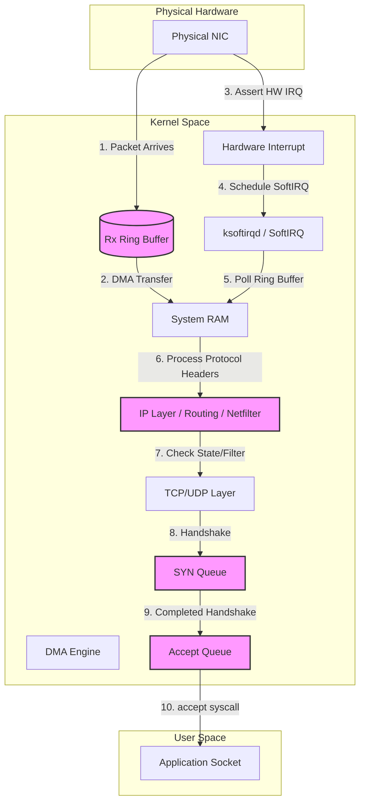

# Networking - Part 3 - Technical Study Guide & Notes

# Networking (Part 3/3): Production Diagnostics, SRE Observability, and Incident Response

---

## 1. Part Introduction and Scope

This guide is dedicated to **Day-2 Networking Operations, Low-Level Kernel Telemetry, eBPF Diagnostics, and Incident Response**. 

In high-concurrency, distributed systems, application failures are frequently symptoms of underlying network anomalies, resource exhaustion, or kernel misconfigurations. This guide bridges the gap between application performance and kernel-level network behavior.

```
+---------------------------------------------------------------------------------+
|                                  STUDY SCOPE                                    |
+---------------------------------------------------------------------------------+
|                                                                                 |
|  * Linux Kernel Network Stack Diagnostics & Socket Buffer Tuning                |
|  * Advanced Packet Analysis (BPF filters, tcpdump, tshark, eBPF pwru)           |
|  * SRE Observability: Production PromQL Alerts & CoreDNS/Conntrack Telemetry    |
|  * Incident Runbooks & RCAs for Real-World Outages (MTU, Conntrack, ndots:5)    |
|  * High-Performance Tuning (BBR, RSS, RPS, NIC Ring Buffers, DPDK)              |
|                                                                                 |
+---------------------------------------------------------------------------------+
```

---

## 2. Why Diagnostics & SRE Networking are Critical for High-Availability Systems

At scale, networking ceases to be a static utility and becomes a dynamic, resource-constrained subsystem. The cost of failing to master this domain includes:

*   **Tail Latency Amplification (The "99th Percentile" Problem):** A single dropped packet causing a TCP retransmission can turn a 5ms database query into a 205ms user-facing delay (due to the minimum TCP Retransmission Timeout, or min RTO, defaulting to 200ms on Linux).
*   **Silent Packet Loss:** State tables, ring buffers, and socket queues drop packets silently when saturated. Without deep kernel-level observability, systems engineers waste hours debugging application code when the actual bottleneck is a saturated `netdev_max_backlog`.
*   **Cascading Failures:** When a stateful firewall or NAT gateway runs out of connection tracking states (`conntrack`), it drops new connection requests. This causes upstream microservices to retry aggressively, triggering a self-inflicted Distributed Denial of Service (DDoS) across the entire service mesh.

---

## 3. Real-World Enterprise Use Cases

### Use Case 1: The Microservice "502 Bad Gateway" Storm
*   **Context:** An e-commerce platform experiences a sudden traffic spike during a flash sale. Upstream Nginx reverse proxies begin returning sporadic `502 Bad Gateway` and `504 Gateway Timeout` errors.
*   **Underlying Issue:** The downstream API gateway's Linux kernel has its listen backlog (`net.core.somaxconn`) set to the default value of `128` or `4096`. Under high concurrency, the TCP SYN queue and Accept queue saturate, causing the kernel to silently ignore incoming SYN packets or send TCP resets (RST) to the Nginx proxies.
*   **Resolution:** Tune `somaxconn` and `tcp_max_syn_backlog` alongside application server listen backlogs, and implement TCP SYN cookies to survive connection floods.

### Use Case 2: Cross-Region VPN/DirectConnect Throughput Degradation
*   **Context:** A hybrid-cloud data pipeline syncing database replicas from an on-premises SAN to AWS S3 over an IPSec VPN tunnel experiences a sudden drop in throughput from 1 Gbps to 10 Mbps.
*   **Underlying Issue:** The IPSec encapsulation adds overhead to each packet, pushing the packet size past the path's Maximum Transmission Unit (MTU) of 1500 bytes. Intermediate routers drop these oversized packets because the "Don't Fragment" (DF) bit is set, but they fail to return the required ICMP Type 3 Code 4 ("Destination Unreachable, Fragmentation Needed") packet due to aggressive firewall blocking. This creates an **MTU Black Hole**.
*   **Resolution:** Implement TCP MSS (Maximum Segment Size) Clamping on transit gateways and routers to force TCP endpoints to negotiate smaller segments.

---

## 4. Comprehensive Architecture Explanation

To diagnose network issues effectively, we must trace how a packet moves through the Linux kernel's network subsystem.



### The Ingress Packet Path & Failure Points

1.  **Physical NIC to RX Ring Buffer:** The physical Network Interface Card (NIC) receives the electrical or optical signal and writes the packet into the Rx (Receive) Ring Buffer in host memory (RAM) via Direct Memory Access (DMA).
    *   *Failure Point:* If the Rx Ring Buffer fills up faster than the kernel can process packets, the NIC drops packets at the physical layer.
    *   *Metric:* `rx_fifo_errors` or `rx_dropped` in `ethtool -S <interface>`.
2.  **Hardware Interrupt (IRQ) and SoftIRQ:** The NIC asserts a hardware interrupt (IRQ) to the CPU. The CPU suspends its current task, runs the NIC's Interrupt Service Routine (ISR), and schedules a Software Interrupt (SoftIRQ) via `ksoftirqd` to process the packet asynchronously.
    *   *Failure Point:* If CPU cores are pinned at 100% processing application code or other interrupts, `ksoftirqd` cannot get scheduled fast enough.
    *   *Metric:* High CPU usage on software interrupts (`%soft` in `mpstat`).
3.  **IP Layer & Netfilter:** The kernel processes the IP header, performs routing lookups, and passes the packet through the Netfilter (iptables/nftables) hooks.
    *   *Failure Point:* If connection tracking (`conntrack`) is full, stateful firewall rules cannot be evaluated, and the packet is dropped.
    *   *Metric:* `net.netfilter.nf_conntrack_count` approaching `net.netfilter.nf_conntrack_max`.
4.  **TCP Layer (SYN & Accept Queues):**
    *   **SYN Queue:** When a TCP SYN packet arrives, the kernel responds with a SYN-ACK and places the half-open connection into the SYN Queue.
    *   **Accept Queue:** Once the client responds with an ACK, the three-way handshake is complete. The kernel moves the connection to the Accept Queue, where it waits for the application to invoke the `accept()` system call.
    *   *Failure Point:* If the application is slow to process requests, the Accept Queue fills up, and incoming connections are dropped or reset.

---

## 5. Classifications of Network Diagnostics & Observability

```
+-------------------------------------------------------------------------------------------------------+
|                                    NETWORK DIAGNOSTIC TOOLCHAIN                                       |
+-------------------------------------------------------------------------------------------------------+
|  Layer 2/3 (Data Link / Network)    |  Layer 4 (Transport)                |  Layer 7 (Application)    |
|  ---------------------------------  |  ---------------------------------  |  -----------------------  |
|  * ip link / ip addr                |  * ss (Socket Statistics)           |  * curl / httpstat        |
|  * arp / ndp                        |  * netstat / conntrack              |  * dig / nslookup / host  |
|  * ethtool                          |  * tcpdump / tshark                 |  * openssl s_client       |
|  * ping / mtr                       |  * nc (netcat) / telnet             |  * gRPCurl                |
+-------------------------------------------------------------------------------------------------------+
```

### Diagnostic Frameworks: Traditional vs. Modern eBPF

*   **Traditional (Pull/Push):** Tools like `node_exporter` poll `/proc/net/dev` and `/proc/net/netstat` at regular intervals (e.g., every 10 seconds). They provide excellent historical trends but miss transient micro-bursts of packet drops.
*   **Modern eBPF (Extended Berkeley Packet Filter):** eBPF instruments the kernel dynamically. Tools like `pwru` (Packet, Where Are You) or `tcplife` attach to kernel tracepoints (e.g., `tcp_retransmit_skb`). They capture and stream exact kernel events with zero copying and negligible performance overhead, allowing real-time tracing of individual packet lifecycles.

---

## 6. Step-by-Step Production Implementation Guide

### Setting up an Enterprise Network Diagnostic & Telemetry Node / DaemonSet

In Kubernetes, we often need to debug network issues directly from the node's namespace. We will deploy a privileged administrative "debug" pod that has access to the host's network namespace, IPC namespace, and PID namespace, pre-loaded with diagnostic utilities and eBPF runtimes.

#### Step 1: Create the Security Hardened (yet Privileged) Debug Pod Specification
Save this file as `net-debug-pod.yaml`. This pod is configured to bypass container network namespaces, attaching directly to the host's network interfaces.

```yaml
apiVersion: v1
kind: Pod
metadata:
  name: net-debug-agent
  namespace: kube-system
  labels:
    app: net-debug-agent
spec:
  hostNetwork: true
  hostPID: true
  hostIPC: true
  containers:
  - name: toolkit
    image: nicolaka/netshoot:latest
    securityContext:
      privileged: true
      capabilities:
        add:
        - NET_ADMIN
        - NET_RAW
        - SYS_PTRACE
        - SYS_ADMIN
    resources:
      limits:
        cpu: "1"
        memory: "1Gi"
      requests:
        cpu: "100m"
        memory: "256Mi"
    volumeMounts:
    - name: sys
      mountPath: /sys
      readOnly: true
    - name: modules
      mountPath: /lib/modules
      readOnly: true
    - name: usr-src
      mountPath: /usr/src
      readOnly: true
  volumes:
  - name: sys
    hostPath:
      path: /sys
  - name: modules
    hostPath:
      path: /lib/modules
  - name: usr-src
    hostPath:
      path: /usr/src
  restartPolicy: Never
```

#### Step 2: Apply and Exec into the Pod
```bash
kubectl apply -f net-debug-pod.yaml
# Wait for the pod to be running
kubectl wait --for=condition=Ready pod/net-debug-agent -n kube-system --timeout=60s
# Exec into the container
kubectl exec -it net-debug-agent -n kube-system -- /bin/bash
```

#### Step 3: Verify Host Network Interface Access from Inside the Pod
Once inside the pod, verify that you are seeing the host's interface controllers (e.g., `eth0`, `bond0`, or `enp1s0f0`) rather than a containerized loopback:
```bash
ip -br link
```

---

## 7. Standard CLI Commands with Deep Technical Explanations

### 1. `tcpdump` (Packet Capture)
Captures raw frames traversing network interfaces.

```bash
tcpdump -i eth0 -nn -vvv -s0 -w /tmp/capture.pcap 'tcp port 443 and (tcp[tcpflags] & (tcp-syn|tcp-ack) == tcp-syn)'
```
*   `-i eth0`: Listen on interface `eth0`.
*   `-nn`: Do not resolve hostnames or port names (prevents slow, blocking DNS queries during packet capture).
*   `-vvv`: Output highly verbose packet parsing details (TTL, ID, length, options).
*   `-s0`: Set packet snaplen to unlimited. Captures the entire packet rather than just the headers.
*   `-w /tmp/capture.pcap`: Write raw packets to a file for offline analysis in Wireshark instead of printing parsed text to stdout.
*   `'tcp port 443 and (tcp[tcpflags] & (tcp-syn|tcp-ack) == tcp-syn)'`: A BPF (Berkeley Packet Filter) expression that captures **only** TCP SYN packets (the first step of the 3-way handshake) on port 443.

### 2. `ss` (Socket Statistics)
Replaces the legacy `netstat` utility. It queries the kernel directly via netlink sockets, which is orders of magnitude faster.

```bash
ss -t -u -a -n -p -i -e
```
*   `-t`: Display TCP sockets.
*   `-u`: Display UDP sockets.
*   `-a`: Show both listening and non-listening (established) sockets.
*   `-n`: Do not resolve service names (show port numbers).
*   `-p`: Show the process identifier (PID) and process name owning the socket.
*   `-i`: Show internal TCP information. This is the **most critical flag for SREs**. It outputs the Round Trip Time (`rtt`), congestion window size (`cwnd`), slow start threshold (`ssthresh`), and retransmission count (`retrans`).
*   `-e`: Show detailed socket info (inode, uid).

### 3. `conntrack` (Connection Tracking Table)
Interacts with the Netfilter connection tracking state table.

```bash
conntrack -S
```
*   `-S`: Show statistics about the connection tracking table (total entries, inserts, deletes, searched, found, and insert failures). If `insert_failed` is incrementing, your conntrack table is full, and the kernel is dropping incoming connections.

### 4. `dig` (Domain Information Groper)
The standard tool for querying DNS name servers.

```bash
dig +trace +dnssec +multiline @1.1.1.1 google.com
```
*   `+trace`: Enable tracing from the root name servers down to the authoritative name servers for the domain, revealing exactly where a resolution path fails.
*   `+dnssec`: Request DNSSEC records to verify the cryptographic signatures of the returned records.
*   `+multiline`: Format the output (like SOA records) in a highly readable, multi-line format.
*   `@1.1.1.1`: Direct the query to a specific DNS resolver (Cloudflare) instead of the system's default resolver.

### 5. `sysctl` (Modify Kernel Parameters at Runtime)
Configures kernel variables under `/proc/sys/`.

```bash
sysctl -a | grep net.ipv4.tcp_congestion_control
```
*   `-a`: List all current kernel variables.
*   `net.ipv4.tcp_congestion_control`: Queries the active TCP congestion control algorithm (e.g., `cubic` or `bbr`).

---

## 8. Production Configuration Examples

### Security-Hardened, High-Performance Kernel Tuning
Place these settings in `/etc/sysctl.d/99-latency-optimized.conf` on your production Linux nodes (Kubernetes workers, database servers, API gateways) to prevent resource exhaustion and mitigate common network-based attacks.

```ini
# ====================================================================
# High-Performance & Hardened Network Kernel Configuration
# Location: /etc/sysctl.d/99-latency-optimized.conf
# ====================================================================

# --------------------------------------------------------------------
# 1. TCP Memory and Buffer Tuning (Optimized for 10GbE/40GbE NICs)
# --------------------------------------------------------------------
# Set max OS receive socket buffer size for all protocols (16MB)
net.core.rmem_max = 16777216
# Set max OS send socket buffer size for all protocols (16MB)
net.core.wmem_max = 16777216

# Minimum, default, and max TCP receive buffer sizes (4KB, 87KB, 16MB)
net.ipv4.tcp_rmem = 4096 87380 16777216
# Minimum, default, and max TCP send buffer sizes (4KB, 64KB, 16MB)
net.ipv4.tcp_wmem = 4096 65536 16777216

# Max number of packets queued on the input side when an interface receives packets faster than the kernel can process them
net.core.netdev_max_backlog = 10000

# Max number of outstanding connection requests (TCP listen backlog)
net.core.somaxconn = 65535

# Max number of half-open connections (SYN queue limit)
net.ipv4.tcp_max_syn_backlog = 16384

# --------------------------------------------------------------------
# 2. Connection Tracking (Conntrack) Tuning
# --------------------------------------------------------------------
# Max number of tracked connections (prevent table exhaustion)
net.netfilter.nf_conntrack_max = 1048576
# Reduce the timeout for established TCP connections (default is 5 days, reduce to 6 hours)
net.netfilter.nf_conntrack_tcp_timeout_established = 21600
# Reduce generic UDP timeout (default 30s, reduce to 10s)
net.netfilter.nf_conntrack_udp_timeout = 10

# --------------------------------------------------------------------
# 3. TCP Keepalive & Resource Reclaim Tuning
# --------------------------------------------------------------------
# Reuse TIME_WAIT sockets for new connections when safe from a protocol viewpoint
net.ipv4.tcp_tw_reuse = 1

# Time (seconds) that a connection must be idle before sending keepalive probes
net.ipv4.tcp_keepalive_time = 300
# Interval (seconds) between individual keepalive probes
net.ipv4.tcp_keepalive_intvl = 15
# Number of keepalive probes to send before dropping the connection
net.ipv4.tcp_keepalive_probes = 5

# --------------------------------------------------------------------
# 4. Security Hardening
# --------------------------------------------------------------------
# Enable SYN Cookies to defend against SYN flood attacks
net.ipv4.tcp_syncookies = 1

# Protect against IP spoofing by enabling Reverse Path Filtering (Strict Mode)
net.ipv4.conf.all.rp_filter = 1
net.ipv4.conf.default.rp_filter = 1

# Disable ICMP redirect acceptance to prevent man-in-the-middle attacks
net.ipv4.conf.all.accept_redirects = 0
net.ipv4.conf.default.accept_redirects = 0
net.ipv6.conf.all.accept_redirects = 0
net.ipv6.conf.default.accept_redirects = 0

# Disable source routing (prevents attackers from routing packets through arbitrary hops)
net.ipv4.conf.all.accept_source_route = 0
net.ipv4.conf.default.accept_source_route = 0

# --------------------------------------------------------------------
# 5. Congestion Control Algorithm
# --------------------------------------------------------------------
# Enable BBR (Bottleneck Bandwidth and RTT) Congestion Control (Requires kernel >= 4.9)
net.core.default_qdisc = fq
net.ipv4.tcp_congestion_control = bbr
```

To apply these changes immediately without rebooting:
```bash
sudo sysctl --system
```

---

## 9. Security Considerations & Hardening Best Practices

### 1. Hardening Against SYN Flood Attacks
A SYN flood is an exploitation of the TCP three-way handshake where an attacker sends a flood of SYN packets but never responds with the final ACK. This fills up the host's SYN Queue, preventing legitimate connections.
*   **Mitigation:** Enable `net.ipv4.tcp_syncookies = 1`. When the SYN queue overflows, the kernel bypasses the queue entirely. Instead of allocating state in memory, it crafts a cryptographically signed sequence number (cookie) and sends it in the SYN-ACK. When the legitimate client sends back the ACK, the kernel validates the cookie mathematically and opens the socket, preventing state table exhaustion.

### 2. Reverse Path Filtering (rp_filter)
Attackers can spoof the source IP address of packets to bypass access controls or execute reflection attacks.
*   **Mitigation:** Set `net.ipv4.conf.all.rp_filter = 1` (Strict Mode). The kernel will check if a packet arriving on interface `X` has a source IP that is routable back through interface `X` according to the system routing table. If the route back is through a different interface, the packet is silently dropped.

### 3. Restricting Diagnostic Capabilities in Production (Least Privilege)
While tools like `tcpdump` and `pwru` are invaluable for troubleshooting, they require raw socket access (`CAP_NET_RAW` and `CAP_NET_ADMIN`), which can be exploited by an attacker to sniff sensitive data traversing the host.
*   **Mitigation:**
    *   Never run diagnostic containers with `privileged: true` by default in production.
    *   Utilize Kubernetes Ephemeral Debug Containers (`kubectl debug`) which only exist for the duration of the troubleshooting session.
    *   Enforce Pod Security Standards (PSS) to restrict host network access to specific, audit-logged administrative namespaces.

---

## 10. Observability & Monitoring Considerations

### Custom Prometheus Alerting Rules (`alerting_rules.yml`)

These production-grade PromQL alert definitions target early-warning indicators of networking degradation.

```yaml
groups:
  - name: networking_sre_alerts
    rules:
    
    # Alert 1: TCP Retransmission Rate Spike
    # Indicates packet loss, congestion, or bad routing in the network fabric.
    - alert: HighTCPRetransmissionRate
      expr: |
        (rate(node_netstat_Tcp_RetransSegs[5m]) / rate(node_netstat_Tcp_OutSegs[5m])) * 100 > 2.0
      for: 5m
      labels:
        severity: warning
        tier: infrastructure
      annotations:
        summary: "High TCP Retransmission Rate on host {{ $labels.instance }}"
        description: "The rate of TCP segment retransmissions on {{ $labels.instance }} is {{ $value | printf \"%.2f\" }}%, exceeding the threshold of 2%. This indicates potential packet loss or network congestion."

    # Alert 2: Conntrack Table Saturation Warning
    # Predicts incoming connection drops before they occur.
    - alert: ConntrackTableSaturationPredictive
      expr: |
        (node_nf_conntrack_entries / node_nf_conntrack_entries_limit) * 100 > 85
      for: 2m
      labels:
        severity: critical
        tier: infrastructure
      annotations:
        summary: "Conntrack Table near saturation on {{ $labels.instance }}"
        description: "The Netfilter connection tracking table is {{ $value | printf \"%.2f\" }}% full. If it reaches 100%, the host will silently drop all new incoming connections."

    # Alert 3: Network Interface Packet Drops
    # Identifies hardware or ring-buffer saturation issues.
    - alert: InterfacePacketDrops
      expr: |
        rate(node_network_receive_drop_total[5m]) > 10 
        or 
        rate(node_network_transmit_drop_total[5m]) > 10
      for: 3m
      labels:
        severity: warning
        tier: infrastructure
      annotations:
        summary: "Network interface dropping packets on {{ $labels.instance }}"
        description: "Interface {{ $labels.device }} is dropping {{ $value | printf \"%.2f\" }} packets/sec. This suggests ring buffer saturation or driver/hardware issues."

    # Alert 4: CoreDNS Latency Spike
    # Core DNS latency directly impacts downstream microservice response times.
    - alert: CoreDNSQueryLatencyHigh
      expr: |
        histogram_quantile(0.99, sum(rate(coredns_dns_request_duration_seconds_bucket[5m])) by (le)) > 0.05
      for: 2m
      labels:
        severity: critical
        tier: platform
      annotations:
        summary: "CoreDNS 99th percentile query latency exceeded 50ms"
        description: "CoreDNS 99th percentile resolution latency is {{ $value | printf \"%.4f\" }}s. Downstream services may experience severe timeouts."
```

### Log Aggregation Strategies & Key Patterns
To catch silent network failures, your log forwarding agents (e.g., FluentBit, Vector) must parse host kernel logs (`dmesg` or `/var/log/kern.log`) and flag the following patterns:

*   `nf_conntrack: table full, dropping packet`: Indicates the connection tracking table is exhausted. Immediate action required: increase `nf_conntrack_max`.
*   `TCP: request_sock_TCP: Possible SYN flood coalescing. Sending cookies.`: Indicates the SYN queue is full and SYN cookies have activated.
*   `out of socket memory`: The kernel has run out of allocated memory pages for TCP buffers.

---

## 11. Common Troubleshooting Scenarios with RCA (Root Cause Analysis) Steps

### Scenario A: The Silent Black Hole (MTU/MSS Mismatch over IPSec/VPN)

```
[ Client ] -- (MTU 1500) --> [ VPN Gateway ] -- (IPSec Encapsulation) --> [ Remote Server ]
                                 |
                          [ Drops Packet ] <-- (Oversized Packet, DF set)
```

*   **Symptom:** Clients can establish a connection to a remote database (3-way handshake completes successfully, small ping packets succeed), but as soon as they run a large query (`SELECT *`), the connection hangs indefinitely and times out.
*   **Diagnostic Steps:**
    1.  Perform a ping with the "Don't Fragment" (DF) bit set and vary the packet size to find the exact Path MTU:
        ```bash
        ping -M do -s 1472 <remote_ip>   # 1472 payload + 28 IP/ICMP headers = 1500 bytes
        ```
        If this returns `ping: local error: Message too long, mtu=1400`, the path cannot handle 1500-byte packets.
    2.  Capture packet traces using `tcpdump` on the server interface:
        ```bash
        tcpdump -i any 'tcp and (ip[6] & 0x40 != 0)' # Look for TCP with DF bit set
        ```
    3.  Check if the server is receiving ICMP Type 3 Code 4 packets ("Fragmentation Needed but DF set"). If these are missing, a firewall upstream is dropping them, preventing PMTUD (Path MTU Discovery) from working.
*   **Root Cause:** The path MTU is reduced due to VPN/IPSec encapsulation overhead (which adds up to 50-80 bytes to the packet). The application sets the DF (Don't Fragment) bit. Intermediate routers drop the packet because it exceeds the MTU, but they fail to inform the sender because they block outgoing ICMP packets.
*   **Remediation:** Apply **MSS Clamping** on your gateway/router. This intercepts the TCP SYN packets and rewrites the negotiated Maximum Segment Size (MSS) option to fit within the lower MTU:
    ```bash
    # For iptables-based routers:
    iptables -t mangle -A POSTROUTING -p tcp --tcp-flags SYN,RST SYN -j TCPMSS --clamp-mss-to-pmtu
    ```

---

### Scenario B: Kubernetes Pod-to-Pod sporadic connection timeouts (Conntrack Table Exhaustion)
*   **Symptom:** Microservices running on a specific Kubernetes node experience connection timeouts when attempting to reach external APIs or other pods. The error is transient and resolves on retry.
*   **Diagnostic Steps:**
    1.  SSH into the affected Kubernetes worker node.
    2.  Check the current conntrack occupancy:
        ```bash
        sysctl net.netfilter.nf_conntrack_count
        sysctl net.netfilter.nf_conntrack_max
        ```
    3.  Check system kernel logs for drop messages:
        ```bash
        sudo dmesg -T | grep -i "conntrack"
        ```
        If you see `nf_conntrack: table full, dropping packet`, you have confirmed the issue.
*   **Root Cause:** The node has a large number of short-lived connections (e.g., microservices making un-pooled HTTP requests or rapid DNS queries) which fill up the Netfilter connection tracking table. Once the table limit is reached, Netfilter drops all new incoming and outgoing connection tracking attempts.
*   **Remediation:**
    1.  Temporarily increase the conntrack limit immediately:
        ```bash
        sudo sysctl -w net.netfilter.nf_conntrack_max=1048576
        ```
    2.  Configure your microservices to use HTTP connection pooling (keep-alive) to reuse sockets.
    3.  Deploy a local DNS cache (like NodeLocal DNSCache in Kubernetes) to reduce short-lived UDP conntrack states.

---

### Scenario C: DNS Resolution Intermittent 5-Second Delays in Kubernetes
*   **Symptom:** Pods sporadically take exactly 5.00x seconds to resolve DNS queries.
*   **Diagnostic Steps:**
    1.  Run a loop of DNS resolutions inside the container:
        ```bash
        for i in {1..100}; do time dig +short google.com; sleep 0.5; done
        ```
        Observe that most take <5ms, but occasionally a query takes exactly `5.005s`.
    2.  Examine `/etc/resolv.conf` inside the pod:
        ```
        nameserver 10.96.0.10
        search default.svc.cluster.local svc.cluster.local cluster.local
        options ndots:5
        ```
*   **Root Cause:**
    *   `ndots:5` forces the DNS resolver (glibc) to search all search domains sequentially if a hostname has fewer than 5 dots (e.g., `google.com` has 1 dot).
    *   For `google.com`, glibc queries `google.com.default.svc.cluster.local`, then `google.com.svc.cluster.local`, etc., before querying the external domain.
    *   Due to a known Linux kernel bug involving UDP connection tracking and race conditions under multi-threaded environments, two concurrent UDP DNS queries (A and AAAA records sent simultaneously) can cause one of the packets to be dropped by the kernel's conntrack module. The client waits for the response, times out, and retries after the default glibc timeout of **5 seconds**.
*   **Remediation:**
    1.  Deploy **NodeLocal DNSCache** in your Kubernetes cluster. This runs a DNS caching daemon on every node as a DaemonSet, bypassing the conntrack path for DNS queries by routing them over a local loopback IP.
    2.  Alternatively, configure the pod's DNS options to use `single-request-reopen` or reduce `ndots`:
        ```yaml
        spec:
          dnsConfig:
            options:
              - name: ndots
                value: "2"
              - name: single-request-reopen
        ```

---

## 12. Common Mistakes and How to Avoid Them in Production

### Mistake 1: Relying on `ping` (ICMP) to Measure Application Latency
*   **Why it's bad:** ICMP traffic is processed in the kernel's slow path or heavily rate-limited/deprioritized by modern network routers and firewalls. A low ping latency does not guarantee that TCP traffic on port 443 is not experiencing high tail latencies due to TCP queuing or application-layer blocking.
*   **How to avoid:** Use application-level latency probes (e.g., `httpstat` or `curl -w`) that measure the complete TCP handshake, TLS negotiation, and Time to First Byte (TTFB).

### Mistake 2: Leaving TCP Keepalives Disabled on Long-Lived Connections
*   **Why it's bad:** Stateful firewalls, cloud NAT gateways (like AWS NAT Gateway), and Load Balancers track active connections. If a TCP connection stays silent (idle) for too long (e.g., AWS NAT Gateway idle timeout is 350 seconds), the gateway drops the state from its table without notifying either endpoint. The next time the application attempts to write to the socket, it experiences a timeout or receives a TCP Reset (RST).
*   **How to avoid:** Enable TCP Keepalives at the OS level (see Section 8) and configure your database clients (e.g., JDBC, pg, gRPC) to send keepalive probes every 60 seconds.

### Mistake 3: Blindly Copying "Latency Tuning" Guides
*   **Why it's bad:** Many guides recommend disabling the Nagle algorithm (`TCP_NODELAY`) everywhere. While this reduces latency for small, interactive payloads, it can cause severe packet fragmentation and decrease throughput for bulk data transfers (like database migrations or file uploads) by generating thousands of tiny, under-filled packets.
*   **How to avoid:** Enable `TCP_NODELAY` for real-time APIs and interactive services, but keep it disabled or use TCP buffering for throughput-intensive bulk operations.

---

## 13. Enterprise-Level Recommendations

### 1. TCP BBR vs. Cubic Congestion Control
Traditional TCP congestion control algorithms like **Cubic** rely on **packet loss** as the signal of network congestion. They aggressively scale back their transmission speed (congestion window size) by 30-50% whenever a packet is dropped. On modern networks (especially long-distance WANs or wireless networks), packet loss is often transient and not caused by actual congestion.

**BBR (Bottleneck Bandwidth and RTT)**, developed by Google, models the network path dynamically by measuring the maximum bandwidth and minimum round-trip time.
*   **Benefits of BBR:**
    *   Maintains high throughput even on lossy links (up to 15-20% packet loss has minimal impact on throughput).
    *   Prevents **Bufferbloat**: BBR does not overfill intermediate router queues, keeping latency low.
*   **Recommendation:** Enable BBR on all egress-heavy servers (e.g., video streaming, CDN origins, APIs serving large payloads).

### 2. NIC Tuning: RSS, RPS, and Ring Buffers
In high-throughput environments (10Gbps+), a single CPU core can become saturated processing network interrupts (SoftIRQs), leading to packet drops even when overall system CPU usage is low.

*   **Receive Side Scaling (RSS):** A hardware-based mechanism where the NIC uses a hash of the packet's IP/port to distribute incoming packets across multiple hardware queues, allowing different CPU cores to process interrupts in parallel.
    *   *Action:* Ensure RSS is enabled in your NIC driver.
*   **Receive Packet Steering (RPS):** A software implementation of RSS. If the NIC does not support multiple hardware queues, RPS distributes the packet processing load across CPUs at the kernel level.
*   **Increasing NIC Ring Buffer Sizes:**
    *   By default, NICs are often configured with conservative ring buffer sizes (e.g., 256 or 512 descriptors).
    *   *Action:* Increase the ring buffer size to its hardware maximum (usually 4096) to absorb micro-bursts of traffic:
        ```bash
        # Query current and max ring buffer sizes
        ethtool -g eth0
        # Set to maximum
        sudo ethtool -G eth0 rx 4096 tx 4096
        ```

---

## 14. Advanced Concepts

### 1. eBPF (Extended Berkeley Packet Filter) in Action
eBPF allows running sandboxed programs inside the Linux kernel without modifying the kernel source or loading kernel modules. For networking, it bypasses the slow Netfilter path entirely.

```
Traditional Path: NIC -> Driver -> Netfilter (iptables) -> TCP Stack -> Socket -> App
eBPF (XDP) Path:  NIC -> Driver -> eBPF Program (Drops/Redirects) -> Bypass Stack!
```

*   **XDP (eXpress Data Path):** A framework within eBPF that allows executing code directly at the network driver level, *before* allocating the socket buffer (`sk_buff`) structure. This enables dropping DDoS attack traffic at wire speed (millions of packets per second per core) with almost zero CPU overhead.

### 2. SR-IOV (Single Root I/O Virtualization)
In virtualized cloud environments (e.g., AWS EC2, VMware), VM network traffic must pass through a hypervisor-managed virtual switch. This virtualization layer introduces latency and jitter.
*   **How it works:** SR-IOV allows a physical PCIe device (the NIC) to present itself as multiple separate virtual PCIe devices (Virtual Functions, or VFs). These VFs can be mapped directly to guest VMs.
*   **Result:** The guest VM bypasses the hypervisor's virtual switch and talks directly to the physical NIC hardware, achieving near-bare-metal latency and throughput.

### 3. DPDK (Data Plane Development Kit)
For ultra-low latency applications (e.g., high-frequency trading, telecom 5G core networks), even the Linux kernel's network stack is too slow.
*   **How it works:** DPDK completely bypasses the Linux kernel. It runs in user space, taking direct control of the physical NIC. It disables kernel interrupts entirely, utilizing a **poll-mode driver** where dedicated user-space threads constantly poll the NIC for new packets.
*   **Trade-off:** 100% CPU utilization on the polling cores, and the loss of standard Linux network tools (iptables, routing tables, standard sockets).

---

## 15. Integration with Other DevOps Tools

### 1. Infrastructure as Code (Terraform)
Automating the deployment of optimized network diagnostic environments. Here is a Terraform snippet to provision an AWS EC2 instance with enhanced networking (ENA) and optimized system configurations passed via user data.

```hcl
resource "aws_instance" "high_perf_node" {
  ami           = "ami-0c55b159cbfafe1f0" # Ubuntu 22.04 LTS
  instance_type = "c6i.2xlarge"           # Supports up to 12.5 Gbps network

  # Enable Elastic Network Adapter (ENA) for enhanced networking
  ena_support = true

  user_data = <<-EOF
              #!/bin/bash
              # Apply optimized kernel networking settings
              cat << 'OUTER' > /etc/sysctl.d/99-performance.conf
              net.core.somaxconn = 65535
              net.ipv4.tcp_max_syn_backlog = 16384
              net.core.rmem_max = 16777216
              net.core.wmem_max = 16777216
              net.ipv4.tcp_rmem = 4096 87380 16777216
              net.ipv4.tcp_wmem = 4096 65536 16777216
              net.core.default_qdisc = fq
              net.ipv4.tcp_congestion_control = bbr
              OUTER
              sysctl --system

              # Maximize NIC ring buffers
              ethtool -G eth0 rx 4096 tx 4096
              EOF

  tags = {
    Name = "high-performance-api-node"
  }
}
```

### 2. Configuration Management (Ansible)
An Ansible playbook to roll out optimized `sysctl` settings across your entire fleet.

```yaml
---
- name: Optimize Linux Network Stack for Production
  hosts: all
  become: true
  tasks:
    - name: Copy sysctl optimization config
      ansible.builtin.copy:
        dest: /etc/sysctl.d/99-latency-optimized.conf
        content: |
          net.core.somaxconn = 65535
          net.ipv4.tcp_max_syn_backlog = 16384
          net.netfilter.nf_conntrack_max = 1048576
          net.core.default_qdisc = fq
          net.ipv4.tcp_congestion_control = bbr
        owner: root
        group: root
        mode: '0644'
      notify: Reload sysctl

  handlers:
    - name: Reload sysctl
      ansible.builtin.command: sysctl --system
```

---

## 16. Comparison Tables with Competing Tools

### Diagnostic & Packet Analysis Tools

| Tool | Focus Layer | Overhead | Real-time Analysis | Best Use Case | Limitations |
| :--- | :--- | :--- | :--- | :--- | :--- |
| **`tcpdump`** | L2 - L4 | Medium (scales with traffic volume) | Low (requires pcap analysis) | Capturing raw packets for offline Wireshark debugging. | High CPU overhead under multi-gigabit traffic; drops packets if disk write is slow. |
| **`tshark`** | L2 - L7 | High | Medium | Command-line deep packet inspection (DPI) of complex protocols (e.g., HTTP/2, TLS). | Extremely resource-intensive; not suitable for running on busy production nodes. |
| **`pwru` (eBPF)** | Kernel Internal | Very Low | High | Tracing exactly where in the Linux kernel a packet is dropped (which kfree_skb call). | Requires modern kernel (5.3+) and BTF support enabled. |
| **`sysdig`** | System + Network | Medium | High | Correlating system calls (disk, process) with network activity in containers. | Requires loading a kernel module or eBPF probe; can be complex to parse. |

### TCP Congestion Control Algorithms

| Algorithm | Primary Metric Used | Reaction to Packet Loss | Latency Profile | Best Use Case |
| :--- | :--- | :--- | :--- | :--- |
| **Cubic** | Packet Loss | Aggressively cuts bandwidth by 30-50%. | High (prone to bufferbloat) | Stable, low-loss local area networks (LANs). | Performs poorly on long-fat networks (LFNs) with high latency and transient packet loss. |
| **BBR** | Bottleneck Bandwidth & RTT | Ignores random packet loss up to ~20%. | Low (actively prevents bufferbloat) | Long-distance WAN connections, public internet, CDN origins. | Can be aggressive and starve out concurrent Cubic streams on narrow bandwidth links. |

---

## 17. SRE Visual Cheat Sheet: Symptoms, Tools, and Kernel Metrics

```
+--------------------------------------------------------------------------------------------------------+
|                                    SRE NETWORK DIAGNOSTICS CHEAT SHEET                                 |
+--------------------------------------------------------------------------------------------------------+
| Symptom                     | Primary Tool         | Key Kernel Metric / File       | Root Cause / Action               |
| --------------------------- | -------------------- | ------------------------------ | --------------------------------- |
| Sporadic 502/504 Errors     | ss -lnt              | Send-Q > Recv-Q                | Accept Queue overflow. Increase   |
|                             |                      |                                | net.core.somaxconn & app backlog. |
| --------------------------- | -------------------- | ------------------------------ | --------------------------------- |
| Connection Timeouts         | conntrack -S         | insert_failed > 0              | Conntrack table full. Increase    |
|                             |                      |                                | net.netfilter.nf_conntrack_max.   |
| --------------------------- | -------------------- | ------------------------------ | --------------------------------- |
| High Tail Latency (p99)     | ss -ti               | rtt / retrans                  | Packet loss or bufferbloat.       |
|                             |                      |                                | Enable BBR and tune ring buffers. |
| --------------------------- | -------------------- | ------------------------------ | --------------------------------- |
| Large HTTP Requests Hang    | ping -M do -s        | Path MTU < Local MTU           | MTU Blackhole. Enable MSS         |
|                             |                      |                                | Clamping on routers/gateways.     |
| --------------------------- | -------------------- | ------------------------------ | --------------------------------- |
| Intermittent 5s DNS Delay   | dig / tcpdump        | ndots in /etc/resolv.conf      | Conntrack race condition on UDP.  |
|                             |                      |                                | Deploy NodeLocal DNSCache.        |
+--------------------------------------------------------------------------------------------------------+
```

---

## 18. Comprehensive Final Learning Summary

Mastering Day-2 cloud networking operations requires moving past abstract concepts and looking directly at kernel-level execution. 

A high-performance, resilient architecture relies on key operational principles:
*   **The network stack is a system of queues.** Saturated queues silently drop packets, causing application-level timeouts that look like software bugs. Monitor your socket state queues and conntrack tables closely.
*   **Default kernel settings are optimized for desktop systems, not high-concurrency cloud nodes.** Production systems require tuning buffer allocations, backlog limits, and congestion control algorithms like BBR to handle high throughput and minimize latency.
*   **Use modern diagnostic tools.** Traditional monitoring can miss brief performance drops. Use modern eBPF-based tools like `pwru` alongside traditional packet capture utilities to diagnose transient issues without impacting production performance.
*   **Implement defensive networking configurations.** Protect your nodes from resource exhaustion and common network-level attacks by securing connection-handling systems (such as using SYN cookies), limiting raw packet access, and setting up precise, proactive alerts.

### Q41. How do you diagnose and mitigate silent packet drops caused by Netfilter conntrack table exhaustion in a high-throughput Kubernetes cluster?

**Detailed Answer**:  
The Netfilter connection tracking (`conntrack`) subsystem in the Linux kernel keeps track of all stateful network connections on a host. In a high-throughput Kubernetes cluster—especially one utilizing IPVS-based `kube-proxy` or Cilium/Calico with stateful firewalls—every network connection (TCP, UDP, ICMP) consumes an entry in the conntrack table. When the number of active connections exceeds the kernel limit defined by `nf_conntrack_max`, the kernel silently drops incoming packets (typically SYN packets). This manifests as sudden connection timeouts, high latency, and intermittent DNS resolution failures, often without any resource saturation (CPU/Memory) on the affected node.

To diagnose this issue, you must inspect the kernel ring buffer and conntrack metrics. The kernel logs conntrack table overflows to dmesg as: `nf_conntrack: table full, dropping packet`. 

To prevent and mitigate this in production:
1. **Monitor Conntrack Usage**: Track the ratio of active conntrack entries to the maximum limit.
2. **Tune Kernel Parameters**: Increase `nf_conntrack_max` and `nf_conntrack_buckets` (hash table size). The recommended ratio is `nf_conntrack_max = nf_conntrack_buckets * 4`.
3. **Optimize Timeouts**: Reduce generic conntrack timeouts (e.g., UDP and TCP TIME_WAIT timeouts) to reclaim table space faster.

**Production Scenario / Practical Example**:  
During a traffic spike on a Kubernetes node hosting an ingress controller, API calls began failing with `Connection timeout`.

*Step 1: Diagnostic Commands on the Host*
```bash
# Check if the conntrack table is full
sysctl net.netfilter.nf_conntrack_count
sysctl net.netfilter.nf_conntrack_max

# Search kernel logs for drops
dmesg -T | grep -i "conntrack"
# Output: [SRE-Log] nf_conntrack: table full, dropping packet

# Check current hash table size (buckets)
cat /sys/module/nf_conntrack/parameters/hashsize
```

*Step 2: Custom Prometheus Alerting Rule*
Deploy this Prometheus rule to alert SREs when conntrack utilization exceeds 85%:
```yaml
groups:
  - name: kubernetes-conntrack-alerts
    rules:
      - alert: HostConntrackTableNearlyFull
        expr: node_nf_conntrack_entries / node_nf_conntrack_entries_limit > 0.85
        for: 2m
        labels:
          severity: critical
          tier: platform
        annotations:
          summary: "Host conntrack table nearly full on {{ $labels.instance }}"
          description: "Conntrack table usage is at {{ printf \"%.2f\" $value }}% of the limit ({{ $labels.instance }}). Packets will be silently dropped if it reaches 100%."
```

*Step 3: Runbook Mitigation*
To immediately resolve the drop, increase the limits dynamically without rebooting:
```bash
# Double the conntrack limit
sudo sysctl -w net.netfilter.nf_conntrack_max=1048576

# Adjust the hash table size to maintain performance (4:1 ratio)
# Note: hashsize is a module parameter, write directly to sysfs
echo 262144 | sudo tee /sys/module/nf_conntrack/parameters/hashsize

# Reduce TIME_WAIT and UDP timeouts to reclaim entries faster
sudo sysctl -w net.netfilter.nf_conntrack_tcp_timeout_time_wait=30
sudo sysctl -w net.netfilter.nf_conntrack_udp_timeout_stream=120
```
To persist these changes, write them to `/etc/sysctl.d/99-conntrack-tuning.conf` and `/etc/modprobe.d/conntrack.conf`.

---

### Q42. How do you debug "Connection Reset by Peer" (TCP RST) errors occurring between microservices inside an Istio/Envoy service mesh?

**Detailed Answer**:  
A `Connection Reset by Peer` (TCP RST) in an Istio service mesh indicates that one side of the TCP connection received a packet for a connection that it has already closed, or it abruptly terminated the connection. In Envoy-enabled meshes, this usually happens due to:
1. **Keep-Alive and Idle Timeout Mismatches**: The upstream application closes an idle connection without Envoy's knowledge, or Envoy's upstream idle timeout is longer than the application's native keep-alive timeout.
2. **Circuit Breaking / Outlier Detection**: Envoy trips a circuit breaker and actively resets downstream connections.
3. **Mutual TLS (mTLS) Handshake Failures**: A cipher suite mismatch, expired certificate, or trust-domain mismatch causes Envoy to reset the connection during the TLS handshake.

To diagnose this, you must analyze Envoy's access logs and downstream/upstream metrics. Envoy uses specific **Response Flags** to denote why a connection was terminated:
* `UC`: Upstream connection termination (e.g., upstream application reset the connection).
* `NR`: No route configured.
* `UO`: Upstream overflow (circuit breaker tripped).
* `DC`: Downstream connection termination.

**Production Scenario / Practical Example**:  
Service A (Go) calls Service B (Java/Spring Boot) via Envoy sidecars. Service A intermittently receives `read: connection reset by peer`.

*Step 1: Check Envoy Access Logs on Service A's Sidecar*
Configure Istio to output JSON access logs and view the log for failed requests:
```bash
kubectl logs deployment/service-a -c istio-proxy --tail=100 | grep -E "RST|connection_reset"
```
*Identified Log Entry:*
```json
{
  "start_time": "2023-10-24T12:00:01.123Z",
  "upstream_cluster": "outbound|8080||service-b.prod.svc.cluster.local",
  "response_flags": "UC",
  "upstream_host": "10.244.3.45:8080",
  "duration": 2,
  "response_code": 503
}
```
The response flag `UC` indicates that the upstream (Service B's pod or its sidecar) terminated the connection.

*Step 2: Capture TCP Handshake and Reset using tcpdump on Service B*
Inject an ephemeral debug container or run `tcpdump` directly inside the network namespace of Service B's pod to capture RST packets:
```bash
# Find the container runtime ID of Service B
export POD_IP=$(kubectl get pod service-b-xxxxx -o jsonpath='{.status.podIP}')
# Run tcpdump on the node interface or inside pod network namespace
nsenter -t $(docker inspect --format '{{.State.Pid}}' $(kubectl get pod service-b-xxxxx -o jsonpath='{.status.containerStatuses[0].containerID}' | sed 's/docker:\/\///')) -n tcpdump -vnni any 'tcp[tcpflags] & (tcp-rst|tcp-syn) != 0'
```
This output reveals that Service B's JVM application container sent a `RST` to its local Envoy proxy because the JVM's `keepAliveTimeout` was reached, but Envoy tried to reuse the connection.

*Step 3: Custom Prometheus Alerting Rule*
Alert on elevated rates of upstream connection resets:
```yaml
groups:
  - name: envoy-mesh-alerts
    rules:
      - alert: EnvoyUpstreamConnectionResets
        expr: sum(rate(envoy_cluster_upstream_cx_destroy_local_with_active_request[5m])) by (cluster_name) > 5
        for: 1m
        labels:
          severity: warning
        annotations:
          summary: "High rate of Envoy local connection resets on cluster {{ $labels.cluster_name }}"
          description: "Envoy is tearing down active connections to {{ $labels.cluster_name }} due to upstream anomalies."
```

*Step 4: Mitigation Runbook*
Align the application's idle timeout to be *longer* than Envoy's connection idle timeout, or configure Envoy's `connection_keepalive` in the `DestinationRule`:
```yaml
apiVersion: networking.istio.io/v1alpha3
kind: DestinationRule
metadata:
  name: service-b-db-rule
spec:
  host: service-b.prod.svc.cluster.local
  trafficPolicy:
    connectionPool:
      tcp:
        maxConnections: 1024
        connectTimeout: 30ms
        tcpKeepalive:
          time: 60s
          interval: 10s
          probes: 3
```

---

### Q43. How do you troubleshoot and resolve DNS resolution latency and NXDOMAIN spikes in a highly dynamic, large-scale Kubernetes cluster using CoreDNS?

**Detailed Answer**:  
DNS resolution failures (timeouts or `NXDOMAIN` responses) in Kubernetes often stem from the interaction between the application's DNS client library and CoreDNS. 
1. **The `ndots:5` Issue**: By default, `/etc/resolv.conf` in Kubernetes pods defines `ndots:5`. This means any DNS query containing fewer than 5 dots (e.g., `api.external-service.com`) is treated as an internal domain first. The resolver sequentially queries:
   * `api.external-service.com.default.svc.cluster.local` -> returns `NXDOMAIN`
   * `api.external-service.com.svc.cluster.local` -> returns `NXDOMAIN`
   * `api.external-service.com.cluster.local` -> returns `NXDOMAIN`
   * Finally, `api.external-service.com` -> returns `NOERROR`
   This generates 4 queries for every single external lookup, overwhelming CoreDNS.
2. **CoreDNS Socket Buffer Saturation**: High concurrent UDP traffic saturates the Linux UDP receive buffer, leading to silent packet drops.
3. **CoreDNS Upstream Latency**: CoreDNS forwards external queries to upstream resolvers (e.g., AWS VPC DNS at `169.254.169.253`). If the upstream rate-limits the node, CoreDNS stalls.

**Production Scenario / Practical Example**:  
An application experiences intermittent `java.net.UnknownHostException` errors during autoscaling events.

*Step 1: Diagnose CoreDNS Performance*
Run a query latency check against CoreDNS metrics using `kubectl port-forward`:
```bash
kubectl port-forward -n kube-system deployment/coredns 9153:9153 &
curl -s http://localhost:9153/metrics | grep coredns_dns_request_duration_seconds_bucket
```

*Step 2: Custom Prometheus Alerting Rule*
Alert on elevated CoreDNS panic rates or upstream forwarding latency:
```yaml
groups:
  - name: coredns-sre-alerts
    rules:
      - alert: CoreDNSForwardLatencyHigh
        expr: histogram_quantile(0.99, sum(rate(coredns_forward_request_duration_seconds_bucket[5m])) by (le)) > 0.1
        for: 2m
        labels:
          severity: critical
        annotations:
          summary: "CoreDNS 99th percentile upstream latency is high"
          description: "CoreDNS upstream resolver latency has exceeded 100ms (current: {{ $value }}s) for more than 2 minutes."
```

*Step 3: Mitigation and Resolution Runbook*
To resolve the `ndots:5` query amplification, modify the application Deployment's `dnsConfig` to set `ndots:1` if the pod only queries fully qualified external domains:
```yaml
apiVersion: apps/v1
kind: Deployment
metadata:
  name: api-worker
spec:
  template:
    spec:
      containers:
      - name: worker
        image: worker:v2.1
      dnsConfig:
        options:
        - name: ndots
          value: "1"
```

To handle UDP packet drops, deploy **NodeLocal DNSCache**. This runs a lightweight DNS caching agent as a DaemonSet on every node, intercepting DNS queries locally via an IPVS/iptables loopback interface, bypassing CoreDNS for cached lookups and converting UDP queries to TCP for upstream CoreDNS communication.

*Step 4: Verify NodeLocal DNSCache*
Ensure NodeLocal DNS is active and verify its local cache performance:
```bash
kubectl get daemonset node-local-dns -n kube-system
# Query local cache directly from inside a pod
kubectl exec -it api-worker-xxxxx -- nslookup -debug api.external-service.com 169.254.25.10
```

---

### Q44. How do you diagnose and mitigate a TCP SYN flood attack or Listen Backlog overflow on an enterprise Linux Nginx web server?

**Detailed Answer**:  
When a client initiates a TCP connection, the Linux kernel uses two queues:
1. **SYN Queue (Half-Open Connections)**: Stores connections that have sent a `SYN` and received a `SYN-ACK`, waiting for the final `ACK`. The size is governed by `net.ipv4.tcp_max_syn_backlog`.
2. **Accept Queue (Fully Established Connections)**: Stores connections that have completed the 3-way handshake and are waiting for the application (e.g., Nginx) to call `accept()`. The size is governed by the minimum of `net.core.somaxconn` and Nginx's `backlog` parameter in the `listen` directive.

If the Accept Queue overflows because Nginx is CPU-starved or blocked on disk I/O, the kernel either drops the incoming ACK packets or sends a `RST` (if `net.ipv4.tcp_abort_on_overflow` is set to `1`). If a SYN flood attack occurs, the SYN queue saturates, preventing legitimate users from connecting.

**Production Scenario / Practical Example**:  
An Nginx-based API Gateway begins dropping connections. Clients report `Connection refused` and timeouts.

*Step 1: Inspect the Connection Queues*
Run the `ss` utility on the Nginx host to inspect the Accept Queue:
```bash
# View active listening TCP sockets
ss -lnt
```
*Output Interpretation:*
```text
State      Recv-Q Send-Q  Local Address:Port  Peer Address:Port
LISTEN     1001   1000    *:443               *:*
```
*   `Send-Q`: The maximum backlog limit (`somaxconn` or application-defined). Here it is `1000`.
*   `Recv-Q`: The number of connections currently in the Accept Queue waiting to be accepted. Here it is `1001`. Because `Recv-Q > Send-Q`, the queue has overflowed.

Check kernel statistics for overflows:
```bash
netstat -s | grep -i "lost"
# Output: 45293 SYNs to LISTEN sockets dropped
# Output: 1284 times the listen queue of a socket overflowed
```

*Step 2: Custom Prometheus Alerting Rule*
Alert when the kernel starts dropping connections due to a full listen queue:
```yaml
groups:
  - name: system-network-alerts
    rules:
      - alert: TCPAcceptQueueOverflowing
        expr: rate(node_netstat_TcpExt_ListenDrops[1m]) > 0
        for: 1m
        labels:
          severity: critical
        annotations:
          summary: "Kernel is dropping TCP connections on {{ $labels.instance }}"
          description: "The Accept Queue of a listening socket is full. Rate of drops: {{ $value }}/sec."
```

*Step 3: Mitigation Runbook*
1. **Enable TCP SYN Cookies**: Protects against SYN flood attacks by encoding connection state in the TCP sequence number, eliminating the need to allocate memory in the SYN queue.
2. **Increase Queue Limits**: Tune both kernel parameters and Nginx configurations.

*Execute Tuning Commands:*
```bash
# Enable SYN cookies
sudo sysctl -w net.ipv4.tcp_syncookies=1

# Increase system-wide max backlog size
sudo sysctl -w net.core.somaxconn=4096
sudo sysctl -w net.ipv4.tcp_max_syn_backlog=4096

# Apply changes to sysctl config
echo "net.core.somaxconn = 4096" | sudo tee -a /etc/sysctl.d/99-networking.conf
echo "net.ipv4.tcp_max_syn_backlog = 4096" | sudo tee -a /etc/sysctl.d/99-networking.conf
sudo sysctl -p /etc/sysctl.d/99-networking.conf
```

*Update Nginx Configuration (`/etc/nginx/nginx.conf`):*
```nginx
server {
    listen 443 ssl default_server backlog=4096;
    server_name api.company.com;
    
    # Optimize worker connections
    worker_connections 8192;
}
```
Reload Nginx: `sudo nginx -s reload`.

---

### Q45. How do you diagnose and resolve routing failures caused by Reverse Path Filtering (rp_filter) in multi-homed Linux instances or hybrid cloud environments?

**Detailed Answer**:  
Reverse Path Filtering (`rp_filter`) is a security mechanism in the Linux kernel designed to prevent IP spoofing. When a packet arrives on a specific network interface (e.g., `eth1`), the kernel performs a reverse-route lookup: it checks if the source IP of the incoming packet would be reachable via the *same* interface (`eth1`) according to its local routing table. 

There are three modes for `rp_filter` (configured via `net.ipv4.conf.<interface>.rp_filter`):
* `0` (No Source Validation): No checks are performed.
* `1` (Strict Mode): The packet is silently dropped if the best reverse path does not match the incoming interface.
* `2` (Loose Mode): The packet is accepted if it is reachable via *any* interface on the system, even if it is not the incoming interface.

In multi-homed instances (e.g., VMs with multiple ENIs/NICs) or hybrid setups with VPNs and Direct Connects, asymmetric routing is common: packets arrive on `eth1` but the default route points out of `eth0`. Under Strict Mode (`1`), the kernel will silently drop these incoming packets.

**Production Scenario / Practical Example**:  
An admin server has two network interfaces: `eth0` (management network, default route) and `eth1` (secure database network). Clients on the database network can ping the server, but cannot establish TCP database connections.

*Step 1: Check rp_filter Settings*
```bash
# Check rp_filter for all interfaces
sysctl -a | grep "\.rp_filter"
```
*Output:*
```text
net.ipv4.conf.all.rp_filter = 1
net.ipv4.conf.eth1.rp_filter = 1
```
Strict mode is enabled globally and on `eth1`.

*Step 2: Diagnose Dropped Packets*
Use `tcpdump` to verify that packets are arriving on `eth1`, but no response is generated:
```bash
sudo tcpdump -v -i eth1 port 5432
```
*Output:*
```text
12:00:05.123 IP client-db.12345 > admin-server.5432: Flags [S], seq 100234
# Notice: No SYN-ACK is sent back by the host.
```
Check kernel drop counters:
```bash
nstat -az | grep -i "IPReversePathFilter"
# Output: IPReversePathFilter  128  0.0
```
The non-zero value confirms that the kernel is actively dropping packets due to reverse path validation failures.

*Step 3: Custom Prometheus Alerting Rule*
Monitor host-level RP filter drops:
```yaml
groups:
  - name: routing-alerts
    rules:
      - alert: ReversePathFilterDropsDetected
        expr: rate(node_netstat_IpExt_IPReversePathFilter[5m]) > 0
        for: 1m
        labels:
          severity: warning
        annotations:
          summary: "Asymmetric routing drops detected on {{ $labels.instance }}"
          description: "The Linux kernel is dropping packets due to strict rp_filter checks. Current rate: {{ $value }}/sec."
```

*Step 4: Mitigation Runbook*
Switch the reverse path filter to Loose Mode (`2`) for the affected interfaces. This permits asymmetric routing while still protecting against completely spoofed IPs.
```bash
# Change temporarily
sudo sysctl -w net.ipv4.conf.all.rp_filter=2
sudo sysctl -w net.ipv4.conf.eth1.rp_filter=2

# Persist changes in sysctl
cat <<EOF | sudo tee /etc/sysctl.d/60-routing-rp-filter.conf
net.ipv4.conf.all.rp_filter = 2
net.ipv4.conf.default.rp_filter = 2
net.ipv4.conf.eth1.rp_filter = 2
EOF
sudo sysctl -p /etc/sysctl.d/60-routing-rp-filter.conf
```

---

### Q46. How do you identify and mitigate Path MTU Discovery (PMTUD) failures across VXLAN or IPsec overlay networks?

**Detailed Answer**:  
Overlay networks (like VXLAN in Kubernetes or IPsec VPNs) encapsulate original IP packets inside another transport packet. This encapsulation adds overhead:
* Standard Ethernet MTU = 1500 bytes.
* VXLAN overhead = 50 bytes (Ethernet + IP + UDP + VXLAN headers).
* Maximum payload size inside VXLAN without fragmentation = 1450 bytes.

If a client sends a 1500-byte packet with the **Don't Fragment (DF)** flag set in the IP header, and it reaches a router/node entering an overlay tunnel, the packet must be dropped because it exceeds the tunnel MTU. 

Normally, Path MTU Discovery (PMTUD) handles this: the router drops the packet and sends back an ICMP Type 3 Code 4 packet (`Destination Unreachable, Fragmentation Needed and DF set`), specifying the acceptable MTU (e.g., 1450). The client then shrinks its TCP Maximum Segment Size (MSS) and retransmits.

If firewalls or security groups along the path block ICMP Type 3 Code 4 packets, PMTUD fails. This creates a **PMTUD Black Hole**: small packets (like TCP handshakes) succeed, but large packets (like data transfers) are silently dropped, causing connections to hang indefinitely.

**Production Scenario / Practical Example**:  
An application deployed in a Kubernetes cluster using Calico (VXLAN) can authenticate with an external API, but any API call returning a payload larger than ~1400 bytes times out.

*Step 1: Test PMTUD with Manual Ping Sweeps*
From inside the application container, ping the destination with the DF flag set and vary the payload size:
```bash
# Ping with 1472 bytes payload (1472 + 8 ICMP + 20 IP = 1500 bytes)
ping -M do -s 1472 -c 3 api.external.com
# Output: ping: local error: Message too long, mtu=1450

# Ping with 1422 bytes payload (1422 + 8 ICMP + 20 IP = 1450 bytes)
ping -M do -s 1422 -c 3 api.external.com
# Output: Hangs or packet loss if ICMP Type 3 Code 4 is blocked downstream.
```

*Step 2: Custom Prometheus Alerting Rule*
Alert on high TCP retransmission rates on the node, which is a key symptom of MTU black holes:
```yaml
groups:
  - name: mtu-alerts
    rules:
      - alert: HighTCPRetransmissionRate
        expr: (rate(node_netstat_Tcp_RetransSegs[5m]) / rate(node_netstat_Tcp_OutSegs[5m])) * 100 > 5
        for: 5m
        labels:
          severity: warning
        annotations:
          summary: "High TCP Retransmission Rate on {{ $labels.instance }}"
          description: "TCP retransmissions are at {{ printf \"%.2f\" $value }}%, which may indicate PMTUD issues or MTU mismatches."
```

*Step 3: Mitigation Runbook (MSS Clamping)*
If you cannot unblock ICMP Type 3 Code 4 in downstream firewalls, the standard mitigation is **TCP MSS Clamping**. This forces the firewall or host to intercept TCP SYN packets and rewrite the requested MSS value to match the overlay MTU.

*Apply iptables rule on Kubernetes Nodes or Router:*
```bash
# Clamp MSS to PMTU automatically for all forwarded TCP SYN packets
sudo iptables -t mangle -A POSTROUTING -p tcp --tcp-flags SYN,RST SYN -j TCPMSS --clamp-mss-to-pmtu

# Alternatively, clamp to a fixed safe size (e.g., 1400 bytes)
sudo iptables -t mangle -A POSTROUTING -p tcp --tcp-flags SYN,RST SYN -j TCPMSS --set-mss 1400
```

*Verify the rule is active:*
```bash
sudo iptables -t mangle -L POSTROUTING -v -n
```

---

### Q47. How do you troubleshoot and resolve flapping health checks on AWS Application Load Balancers (ALB) caused by TCP keep-alive and connection reuse mismatches?

**Detailed Answer**:  
AWS Application Load Balancers (ALBs) reuse back-end TCP connections to minimize latency and overhead. This means the ALB maintains a pool of established HTTP/1.1 or HTTP/2 connections to target instances.

A common outage vector occurs when the **Keep-Alive Timeout** configured on the back-end application server (e.g., Nginx, Apache, Node.js, Tomcat) is *shorter* than the **Idle Timeout** configured on the ALB (default is 60 seconds). 

When this happens, a race condition occurs:
1. The application server decides to close an idle connection and sends a `FIN` packet to the ALB.
2. At the exact same microsecond, the ALB forwards a client's HTTP request over that same TCP connection.
3. The ALB receives a `RST` from the back-end server because the connection was already closing.
4. The client receives an HTTP `502 Bad Gateway` error.
5. If this happens during an active ALB health check request, the ALB marks the target as unhealthy, triggering target group flapping and cascading capacity failures.

**Production Scenario / Practical Example**:  
An Nginx-backed web application behind an AWS ALB experiences sudden spikes in `502 Bad Gateway` errors, accompanied by instances being marked `Unhealthy` in AWS Target Groups.

*Step 1: Check Target Group Health Status via AWS CLI*
```bash
aws elbv2 describe-target-health \
    --target-group-arn arn:aws:elasticloadbalancing:us-east-1:123456789:targetgroup/prod-api/abcdef \
    --query 'TargetHealthDescriptions[*].[Target.Id,Target.Port,TargetHealth.State,TargetHealth.Description]'
```
*Output:*
```text
[
    ["i-0123456789abcdef0", 80, "UNHEALTHY", "Target.Timeout"]
]
```

*Step 2: Analyze Nginx Error Logs and Compare Timeouts*
Check ALB configuration: Idle timeout is set to `60 seconds`.
Check Nginx configuration (`/etc/nginx/nginx.conf`):
```nginx
keepalive_timeout 5s; # This is too low compared to the ALB's 60s
```

*Step 3: Custom Prometheus Alerting Rule*
Alert on target-level connection errors reported by the ALB (using CloudWatch Exporter):
```yaml
groups:
  - name: alb-health-alerts
    rules:
      - alert: ALBTargetConnectionErrorsHigh
        expr: sum(rate(aws_elbv2_target_connection_error_count_average[5m])) by (load_balancer) > 10
        for: 2m
        labels:
          severity: critical
        annotations:
          summary: "ALB {{ $labels.load_balancer }} target connection errors are elevated"
          description: "The ALB is failing to establish or maintain TCP connections with targets, indicating timeout mismatches or target crashes."
```

*Step 4: Runbook Mitigation*
To resolve the race condition, **always set the back-end application's keep-alive timeout to be at least 5-10 seconds HIGHER than the ALB's idle timeout**.

Modify Nginx configuration:
```nginx
# Ensure Nginx keeps connections open longer than the ALB (60s)
keepalive_timeout 65s;
keepalive_requests 10000; # Prevent premature connection closure under high load
```
Modify Node.js Server configuration (if applicable):
```javascript
const server = app.listen(3000);
server.keepAliveTimeout = 65000; // 65 seconds
server.headersTimeout = 66000; // Must be larger than keepAliveTimeout
```
Reload Nginx: `sudo systemctl reload nginx`.

---

### Q48. How do you diagnose and resolve high latency and packet retransmissions in cross-region traffic by tuning the Linux TCP congestion control algorithm (BBR vs. CUBIC)?

**Detailed Answer**:  
Standard Linux kernels use **CUBIC** as their default TCP congestion control algorithm. CUBIC is a loss-based congestion control algorithm: it detects network congestion by looking for packet drops. When it detects a packet drop, CUBIC aggressively cuts its congestion window size (CWND) by up to 30%, assuming the drop was due to a saturated link buffer.

In high-bandwidth, high-latency networks (such as cross-region cloud traffic or hybrid cloud links with high Round Trip Times - RTT), packet loss is often *random* (due to media errors, optical routing, or transient glitches) rather than a sign of link congestion. CUBIC's loss-based approach causes its throughput to collapse on these links even with minor packet loss (e.g., 1% loss can reduce CUBIC throughput by 90%).

**BBR (Bottleneck Bandwidth and RTT)** is a model-based congestion control algorithm developed by Google. BBR does not react to packet drops. Instead, it measures the actual bottleneck bandwidth and the minimum RTT to build an internal model of the network path. It transmits data at the speed of the bottleneck link, maintaining high throughput even on lossy (up to 20% packet loss) and high-latency links.

**Production Scenario / Practical Example**:  
Database replication between AWS `us-east-1` (Virginia) and `eu-west-1` (Ireland) is lagging. The link has an RTT of 75ms and a random packet loss rate of 0.5%.

*Step 1: Check Current Congestion Control and TCP Window Metrics*
Run `ss` on the sending database host to check the current algorithm and connection states:
```bash
# Check loaded congestion control modules
sysctl net.ipv4.tcp_congestion_control

# Inspect active socket state
ss -i -t -e | grep -A 1 "us-east-1"
```
*Output:*
```text
cubic wscale:7,7 rto:275 rtt:75.2/0.4 ato:40 mss:1440 rcvspace:14600 ssthresh:12 cwnd:10 ssthresh:12
```
Notice `cwnd:10` (congestion window size is very low) and the algorithm is `cubic`.

*Step 2: Custom Prometheus Alerting Rule*
Alert on high TCP retransmission ratios on database replication nodes:
```yaml
groups:
  - name: replication-alerts
    rules:
      - alert: HighTCPRetransmissionRatio
        expr: (rate(node_netstat_Tcp_RetransSegs[5m]) / rate(node_netstat_Tcp_OutSegs[5m])) * 100 > 2
        for: 5m
        labels:
          severity: warning
        annotations:
          summary: "High TCP Retransmission Ratio on replication node {{ $labels.instance }}"
          description: "Retransmission ratio is {{ printf \"%.2f\" $value }}%, leading to potential throughput collapse under CUBIC."
```

*Step 3: Runbook Mitigation (Switch to BBR)*
BBR requires the `fq` (Fair Queueing) traffic control queuing discipline to pace packets correctly.

```bash
# Verify kernel support for BBR (requires Linux Kernel 4.9+)
uname -r

# Load the BBR module
sudo modprobe tcp_bbr

# Set the default queuing discipline to fq
sudo sysctl -w net.core.default_qdisc=fq

# Set the congestion control algorithm to bbr
sudo sysctl -w net.ipv4.tcp_congestion_control=bbr

# Persist settings
cat <<EOF | sudo tee /etc/sysctl.d/99-bbr.conf
net.core.default_qdisc = fq
net.ipv4.tcp_congestion_control = bbr
EOF
sudo sysctl -p /etc/sysctl.d/99-bbr.conf
```

*Step 4: Verify the Change*
Verify that BBR is active on the socket:
```bash
ss -i -t -e
# Output should now show: bbr cwnd:120 ... (notice the significantly larger congestion window)
```

---

### Q49. How do you diagnose and architecturally mitigate SNAT port exhaustion on cloud-native egress gateways?

**Detailed Answer**:  
When microservices inside a private subnet make outbound connections to external APIs, they pass through a Network Address Translation (NAT) Gateway. The NAT Gateway performs Source NAT (SNAT): it translates the private IP of the VM/Pod to its own public IP and maps the source port of the connection to one of its own ephemeral ports (typically in the range 1024–65535, providing ~64,000 unique ports).

An individual NAT Gateway public IP can establish a maximum of ~64,000 concurrent connections to a *single destination IP and Port combination* (e.g., `api.stripe.com:443`). 

If microservices establish thousands of transient outbound connections without connection pooling (e.g., opening and closing a new TCP connection for every API call), those connections linger in the kernel's `TIME_WAIT` state for 120 seconds. This quickly exhausts the available SNAT ports on the NAT Gateway, resulting in outbound connection timeouts, DNS lookup failures, and high latency for egress traffic.

**Production Scenario / Practical Example**:  
An e-commerce application experiences sudden, catastrophic timeouts when processing payments during a flash sale. The application logs show: `Dial tcp: i/o timeout` to external payment gateways.

*Step 1: Diagnose SNAT Port Exhaustion in CloudWatch / Azure Metrics*
If running in AWS, inspect the NAT Gateway metrics:
```bash
aws cloudwatch get-metric-statistics \
    --namespace AWS/NATGateway \
    --metric-name ErrorPortAllocation \
    --dimensions Name=NatGatewayId,Value=nat-0123456789abcdef0 \
    --start-time $(date -u -d '1 hour ago' +%Y-%m-%dT%H:%M:%SZ) \
    --end-time $(date -u +%Y-%m-%dT%H:%M:%SZ) \
    --period 60 \
    --statistics Sum
```
A non-zero value for `ErrorPortAllocation` confirms SNAT port exhaustion.

*Step 2: Custom Prometheus Alerting Rule*
If using the Prometheus CloudWatch Exporter, configure this alert:
```yaml
groups:
  - name: nat-gateway-alerts
    rules:
      - alert: NATGatewaySNATPortExhaustion
        expr: sum(rate(aws_natgateway_error_port_allocation_sum[1m])) > 0
        for: 1m
        labels:
          severity: critical
        annotations:
          summary: "NAT Gateway SNAT port allocation errors detected"
          description: "NAT Gateway {{ $labels.nat_gateway_id }} is failing to allocate ephemeral ports for outbound traffic. Outbound connections are dropping."
```

*Step 3: Mitigation Runbook*
To resolve this issue, apply both architectural and application-level mitigations:

1. **Application Level (Connection Pooling)**: Ensure your HTTP client reuse connections.
   *Example Go HTTP Client Configuration:*
   ```go
   var httpClient = &http.Client{
       Transport: &http.Transport{
           MaxIdleConns:        500,
           MaxIdleConnsPerHost: 100,
           IdleConnTimeout:     90 * time.Second,
       },
       Timeout: 10 * time.Second,
   }
   ```

2. **Network Level (Multi-IP NAT Gateway)**: Associate multiple Elastic IP addresses with the NAT Gateway. Each added IP adds another 64,000 ephemeral ports.
   ```bash
   # Allocate a new Elastic IP
   EIP_ALLOC_ID=$(aws ec2 allocate-address --domain vpc --query 'AllocationId' --output text)
   
   # Associate the secondary IP with the existing NAT Gateway
   aws ec2 associate-nat-gateway-address \
       --nat-gateway-id nat-0123456789abcdef0 \
       --allocation-ids $EIP_ALLOC_ID
   ```

3. **VPC Endpoints**: For AWS services (S3, DynamoDB), configure VPC Gateway Endpoints to route traffic internally, completely bypassing the NAT Gateway.

---

### Q50. How do you troubleshoot and resolve gRPC connection hotspotting and connection leakage in a microservices architecture behind an L4 Load Balancer?

**Detailed Answer**:  
gRPC uses **HTTP/2** as its transport protocol. Unlike HTTP/1.1, which opens a new TCP connection or reuses one sequentially, HTTP/2 multiplexes hundreds of concurrent requests over a **single, long-lived TCP connection**.

This creates a major challenge when using Layer 4 (L4) Load Balancers (such as AWS NLB or classic TCP load balancers):
1. An L4 load balancer operates at the transport layer (TCP). It routes connections, not individual HTTP/2 requests.
2. When a gRPC client starts, it establishes a single TCP connection to the load balancer, which routes it to Pod A.
3. All subsequent gRPC requests from that client are multiplexed over that single TCP connection to Pod A.
4. Even if you scale your back-end deployment to 50 pods, Pod A will handle 100% of the traffic from that client, while the other 49 pods remain completely idle. This is known as **gRPC Connection Hotspotting**.

Conversely, if client libraries are misconfigured to open a new connection per request to bypass this, they will leak TCP connections, eventually exhausting file descriptors on both client and server nodes.

**Production Scenario / Practical Example**:  
You scale your gRPC billing service from 2 to 10 replicas to handle load, but CPU utilization remains at 95% on the original 2 pods, while the 8 new pods show 0% CPU utilization.

*Step 1: Check Connection Distribution on Back-end Pods*
Run `netstat` or `ss` inside the back-end containers to verify connection distribution:
```bash
# Run on each pod to count active established TCP connections on gRPC port 50051
kubectl exec -it billing-service-xxxxx -c service -- ss -nt state established sport = :50051 | wc -l
```
*Result:*
*   Pod 1: `45` connections
*   Pod 2: `42` connections
*   Pod 3 (New): `0` connections
*   Pod 4 (New): `0` connections

*Step 2: Custom Prometheus Alerting Rule*
Alert on extreme imbalance in gRPC request distribution:
```yaml
groups:
  - name: grpc-load-alerts
    rules:
      - alert: GRPCRequestImbalance
        expr: stddev(rate(grpc_server_handled_total[5m])) by (app) / avg(rate(grpc_server_handled_total[5m])) by (app) > 0.5
        for: 5m
        labels:
          severity: warning
        annotations:
          summary: "gRPC Request Imbalance detected on {{ $labels.app }}"
          description: "The standard deviation of gRPC request rates across pods is too high. This indicates L4 load balancing hotspotting."
```

*Step 3: Runbook Mitigation*
To resolve gRPC hotspotting, choose one of the following architectural patterns:

#### Option A: Deploy a Layer 7 (L7) Load Balancer (Envoy / Ingress-Nginx)
An L7 proxy understands HTTP/2 frames and can load balance individual gRPC requests over its own pool of back-end TCP connections.

#### Option B: Configure Client-Side Load Balancing with DNS Round-Robin
Configure the gRPC client to perform load balancing directly by resolving the headless Kubernetes service IP addresses and establishing a connection to *every* back-end pod.

*Example Go gRPC Client Configuration:*
```go
import (
    "google.golang.org/grpc"
    "google.golang.org/grpc/balancer/roundrobin"
)

func main() {
    // Note the "dns:///" prefix and the use of the round_robin balancer
    conn, err := grpc.Dial(
        "dns:///billing-service.prod.svc.cluster.local:50051",
        grpc.WithDefaultServiceConfig(`{"loadBalancingConfig": [{"round_robin":{}}]}`),
        grpc.WithInsecure(),
    )
    if err != nil {
        log.Fatalf("did not connect: %v", err)
    }
    defer conn.Close()
}
```

#### Option C: Implement Connection Graceful Retirement (Max Connection Age)
Configure the gRPC server to limit the lifetime of any single TCP connection. This forces clients to gracefully disconnect and reconnect, redistributing connections across the scaled back-ends.

*Example Go gRPC Server Configuration:*
```go
import (
    "time"
    "google.golang.org/grpc"
    "google.golang.org/grpc/keepalive"
)

func main() {
    grpcServer := grpc.NewServer(
        grpc.KeepaliveParams(keepalive.ServerParameters{
            MaxConnectionAge:      5 * time.Minute,  // Force reconnection every 5m
            MaxConnectionAgeGrace: 30 * time.Second, // Allow 30s to finish active streams
            Time:                  2 * time.Hour,
            Timeout:               20 * time.Second,
        }),
    )
    // Register services and serve...
}
```