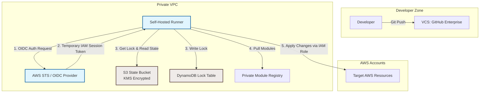

# Terraform - Part 2 - Technical Study Guide & Notes

# Production-Grade DevOps and Cloud Study Guide
## Terraform (Part 2 of 3): Advanced Configurations, Performance Tuning, Security Capabilities, Sandboxing, and Scale Boundaries

---

## 1. Part Introduction and Scope

This study guide focuses on the advanced mechanics of HashiCorp Terraform (and its open-source alternative, OpenTofu). It is designed for engineers with over 6 years of experience who aim to master large-scale infrastructure-as-code (IaC) architectures. 

### Scope of This Guide
```
[Advanced Configurations] ──> [Performance Tuning] ──> [Security & Sandboxing] ──> [Scale Boundaries]
       │                              │                          │                         │
       ├─ Meta-arguments              ├─ Provider Caching        ├─ OIDC Authentication    ├─ Blast Radius
       ├─ Dynamic blocks              ├─ Parallelism Tuning      ├─ Sentinel / OPA         ├─ Monolith to Micro-state
       └─ Custom Providers            └─ Graph Optimization      └─ State Encryption       └─ Memory & API Limits
```

*   **Advanced Configurations:** Deep dive into meta-arguments, dynamic blocks, custom provider development, and complex variable structures.
*   **Performance Tuning:** Optimization of execution graphs, provider caching, concurrency tuning, and state optimization.
*   **Security Capabilities:** Zero-trust state management, OIDC authentication, Policy-as-Code (Sentinel/OPA), and secret handling.
*   **Sandboxing & Isolation:** Multi-tenant directory structures, workspaces, and local execution sandboxing.
*   **Scale Boundaries:** Managing thousands of resources, mitigating API rate limiting, and splitting monolithic states into micro-states.

---

## 2. Why These Concepts are Critical for High-Availability Systems

In a high-availability (HA) enterprise environment, minor IaC misconfigurations can cause cascading outages. Understanding advanced Terraform concepts is critical for the following reasons:

```
┌──────────────────────────────────────────────┐
│        Enterprise Scale Failures             │
└──────────────────────┬───────────────────────┘
                       │
         ┌─────────────┴─────────────┐
         ▼                           ▼
┌──────────────────┐       ┌──────────────────┐
│  State Lock      │       │  API Throttling  │
│  Contention      │       │  & Rate Limits   │
└────────┬─────────┘       └────────┬─────────┘
         │                           │
         ▼                           ▼
┌──────────────────┐       ┌──────────────────┐
│ Overlapping runs │       │ Split-Brain &    │
│ block deployments│       │ Drift Outages    │
└──────────────────┘       └──────────────────┘
```

### State Corruption and Concurrency Risks
In systems with continuous deployment pipelines, multiple runners may attempt to write to the state file simultaneously. Without robust **State Locking** (e.g., DynamoDB or Consul locks) and a deep understanding of state serials, pipelines can suffer from "split-brain" scenarios. This can lead to state corruption and the accidental destruction of active resources.

### API Rate Limiting (Throttling)
When managing more than 1,000 resources within a single state file, a standard `terraform plan` or `terraform apply` queries cloud provider APIs for every single resource. This can trigger aggressive API rate limiting (e.g., AWS `RequestLimitExceeded` or Azure `429 Too Many Requests`), which halts deployment pipelines and blocks urgent hotfixes.

### Blast Radius Mitigation
A single monolithic state file containing both core network infrastructure (VPCs, Transit Gateways) and ephemeral application workloads (ECS tasks, Kubernetes namespaces) represents a major single point of failure. A typo or logic error in an application module can trigger the accidental destruction of core networking components. 

### Secret Leakage in State Files
Terraform state files store all resource attributes in plain text, including sensitive values like database passwords, private keys, and API tokens. Without proper encryption at rest (using customer-managed KMS keys) and strict access controls, this state file becomes a high-value target for attackers.

---

## 3. Real-World Enterprise Use Cases

### Use Case 1: Multi-Region, Multi-Account Landing Zone with Automated Guardrails
An enterprise needs to deploy a standardized landing zone across 50+ AWS accounts in 4 geographical regions. The infrastructure must enforce security guardrails (e.g., disabling public S3 buckets and enforcing EBS encryption) while allowing application teams to provision self-service resources.

```
                  [ AWS Organizations parent account ]
                                   │
         ┌─────────────────────────┼─────────────────────────┐
         ▼                         ▼                         ▼
┌─────────────────┐       ┌─────────────────┐       ┌─────────────────┐
│   Dev Account   │       │  Staging Acct   │       │  Prod Account   │
│  (OIDC Assume)  │       │  (OIDC Assume)  │       │  (OIDC Assume)  │
└────────┬────────┘       └────────┬────────┘       └────────┬────────┘
         │                         │                         │
         ├─ VPC (Region 1)         ├─ VPC (Region 1)         ├─ VPC (Region 1)
         └─ VPC (Region 2)         └─ VPC (Region 2)         └─ VPC (Region 2)
```

*   **Solution:** Use Terraform with **multi-provider aliases** configured dynamically via OIDC role assumption. Implement **Open Policy Agent (OPA)** in the CI/CD pipeline to evaluate the JSON plan output before execution. This blocks any deployment that violates security policies.

### Use Case 2: Zero-Trust Transit Gateway and Service Mesh Provisioning
A financial institution requires dedicated, dynamically routed network paths between isolated VPCs using AWS Transit Gateway (TGW) and HashiCorp Consul Service Mesh.

```
  [ VPC A (Application) ]                  [ VPC B (Database) ]
     │                                        │
     ▼                                        ▼
  [ TGW Attachment A ]                     [ TGW Attachment B ]
     │                                        │
     └───────────────► [ Transit Gateway ] ◄──┘
                              ▲
                              │ (Dynamic Route Propagation)
                     [ Route Tables & Rules ]
```

*   **Solution:** Use advanced Terraform configurations with `for_each` loops over complex map objects containing VPC CIDRs, peering rules, and route tables. 
*   Use `lifecycle { replace_triggered_by = [...] }` to automatically redeploy TGW attachments and update routing tables whenever VPC CIDR blocks are modified, preventing routing black holes.

---

## 4. Comprehensive Architecture Explanation

An enterprise-grade, secure Terraform execution architecture uses self-hosted ephemeral runners, OpenID Connect (OIDC) for passwordless authentication, and isolated state backends with customer-managed encryption keys.

### Secure Terraform Pipeline Architecture



### Architectural Component Walkthrough

1.  **OpenID Connect (OIDC) Trust:** The self-hosted runner does not store long-lived cloud credentials. Instead, it exchanges a short-lived GitHub Actions JWT (JSON Web Token) or GitLab CI OIDC token for a temporary AWS IAM session token via AWS Security Token Service (STS).
2.  **State Backend Isolation:** The state file is stored in an S3 bucket configured with:
    *   **Default Encryption:** Using a Customer Managed Key (CMK) in AWS KMS to ensure that even read-access to the raw S3 object cannot expose secrets without KMS decryption permissions.
    *   **Bucket Policies:** Restricting access strictly to the IAM execution roles assumed by the runners.
    *   **Object Versioning:** Enabled to recover from accidental deletion or corruption.
3.  **State Locking Mechanism:** A DynamoDB table with a primary key of `LockID` is used to prevent concurrent executions. Any process attempting to modify the state must acquire this lock; otherwise, execution halts immediately.
4.  **Private Module Registry:** Standardized, hardened modules are sourced from a private registry, ensuring developers only deploy pre-approved, compliant infrastructure configurations.

---

## 5. Types, Classifications, and Components

### State Backends Comparison

| Backend Type | Locking Support | State Encryption | Latency | Complexity | Best Use Case |
| :--- | :--- | :--- | :--- | :--- | :--- |
| **S3 + DynamoDB** | Yes (DynamoDB) | Yes (KMS CMK) | Low | Medium | Standard AWS Multi-Account |
| **Consul** | Yes (Native) | Yes (Consul Vault) | Ultra-Low | High | Multi-Cloud, HashiCorp Native |
| **GCS** | Yes (Native) | Yes (KMS CMK) | Low | Low | Google Cloud Deployments |
| **Terraform Cloud/Enterprise** | Yes (Native) | Yes (Automatic) | Medium | Low | Managed SaaS / Enterprise Platform |

### Meta-Arguments Deep Dive

*   **`depends_on`**: Explicitly defines resource dependencies when Terraform cannot automatically infer them from resource attributes.
    *   *Warning:* Use only as a last resort. It forces sequential execution and can break parallelization.
*   **`count`**: Conditionally provisions resources based on a boolean or integer.
    *   *Warning:* If you modify an list of items managed by `count`, modifying any index other than the last one forces the recreation of all subsequent resources.
*   **`for_each`**: Maps a set or map of strings to resources. This is preferred over `count` because it creates resources keyed by their map key, preventing index-shift destruction issues.
*   **`lifecycle`**:
    *   `create_before_destroy` (bool): Reverses the default behavior of destroying a resource before creating its replacement. Essential for zero-downtime upgrades of ASGs, Launch Templates, and DNS records.
    *   `prevent_destroy` (bool): Prevents accidental deletion of critical resources (e.g., production databases).
    *   `ignore_changes` (list): Ignores changes to specific resource attributes made out-of-band (e.g., auto-scaled capacity, external tag managers).
    *   `replace_triggered_by` (list): Triggers a resource replacement when referenced attributes or resources change (introduced in TF 1.2+).

---

## 6. Step-by-Step Production Implementation Guide

This guide sets up a high-performance, secure AWS S3/DynamoDB backend with cross-account IAM OIDC roles, provider caching, and custom provider configurations.

### Step 1: Bootstrap the Secure Backend Infrastructure
Run this bootstrap configuration once to create the secure S3 bucket, DynamoDB table, and KMS key.

```hcl
# bootstrap/main.tf
provider "aws" {
  region = "us-east-1"
}

resource "aws_kms_key" "terraform_state_key" {
  description             = "KMS Key for encrypting Terraform remote state files"
  deletion_window_in_days = 30
  enable_key_rotation     = true

  policy = jsonencode({
    Version = "2012-10-17"
    Statement = [
      {
        Sid    = "Enable IAM User Permissions"
        Effect = "Allow"
        Principal = {
          AWS = "arn:aws:iam::${data.aws_caller_identity.current.account_id}:root"
        }
        Action   = "kms:*"
        Resource = "*"
      }
    ]
  })
}

data "aws_caller_identity" "current" {}

resource "aws_s3_bucket" "state_bucket" {
  bucket        = "enterprise-tf-state-${data.aws_caller_identity.current.account_id}"
  force_destroy = false

  lifecycle {
    prevent_destroy = true
  }
}

resource "aws_s3_bucket_versioning" "state_versioning" {
  bucket = aws_s3_bucket.state_bucket.id
  versioning_configuration {
    status = "Enabled"
  }
}

resource "aws_s3_bucket_server_side_encryption_configuration" "state_encryption" {
  bucket = aws_s3_bucket.state_bucket.id

  rule {
    apply_server_side_encryption_by_default {
      kms_master_key_id = aws_kms_key.terraform_state_key.arn
      sse_algorithm     = "aws:kms"
    }
  }
}

resource "aws_s3_bucket_public_access_block" "state_private_block" {
  bucket = aws_s3_bucket.state_bucket.id

  block_public_acls       = true
  block_public_policy     = true
  ignore_public_acls      = true
  restrict_public_buckets = true
}

resource "aws_dynamodb_table" "state_locks" {
  name         = "enterprise-tf-locks"
  billing_mode = "PAY_PER_REQUEST"
  hash_key     = "LockID"

  attribute {
    name = "LockID"
    type = "S"
  }

  point_in_time_recovery {
    enabled = true
  }
}
```

### Step 2: Configure Provider Caching on the Runner
To accelerate pipeline runs and avoid hitting GitHub/HashiCorp registry rate limits, configure the local plugin cache on your CI/CD runner.

Create or update the CLI configuration file:
*   Linux/macOS: `~/.terraformrc`
*   Windows: `%APPDATA%/terraform.rc`

```hcl
# ~/.terraformrc
plugin_cache_dir = "$HOME/.terraform.d/plugin-cache"
disable_checkpoint = true
```

*Create the directory on the runner:*
```bash
mkdir -p $HOME/.terraform.d/plugin-cache
```

### Step 3: Configure the Main Terraform Project to Use the Backend
Initialize your workspace using the newly created backend.

```hcl
# project/backend.tf
terraform {
  required_version = ">= 1.5.0"

  backend "s3" {
    bucket         = "enterprise-tf-state-123456789012" # Replace with bootstrapped account ID
    key            = "workloads/production/networking.tfstate"
    region         = "us-east-1"
    dynamodb_table = "enterprise-tf-locks"
    encrypt        = true
    kms_key_id     = "arn:aws:kms:us-east-1:123456789012:key/your-kms-key-uuid"
  }

  required_providers {
    aws = {
      source  = "hashicorp/aws"
      version = "~> 5.0"
    }
  }
}
```

---

## 7. Standard CLI Commands with Deep Technical Explanations

### `terraform init`
Initializes the working directory, downloads providers, and configures the backend.

```bash
terraform init \
  -backend-config="bucket=enterprise-tf-state-123456789012" \
  -backend-config="key=env/prod.tfstate" \
  -plugin-dir=/opt/tf-plugins \
  -get-plugins=true \
  -upgrade
```

*   `-backend-config="key=..."`: Dynamically injects backend configuration parameters, enabling reusable root modules across environments.
*   `-plugin-dir=/opt/tf-plugins`: Forces Terraform to load plugins exclusively from a pre-populated local directory. This is useful for air-gapped, high-security CI/CD environments.
*   `-upgrade`: Forces Terraform to ignore local lockfiles (`.terraform.lock.hcl`) and fetch the newest provider versions matching the constraints.

---

### `terraform plan`
Generates an execution plan by comparing the current state with the declared configuration.

```bash
terraform plan \
  -out=tfplan.binary \
  -detailed-exitcode \
  -refresh-only \
  -lock=true \
  -lock-timeout=30s
```

*   `-out=tfplan.binary`: Saves the generated execution plan to a file. This ensures that the exact changes reviewed during the plan phase are applied during the apply phase, preventing race conditions.
*   `-detailed-exitcode`: Returns specific exit codes:
    *   `0`: Succeeded, no changes.
    *   `1`: Erred.
    *   `2`: Succeeded, changes present. Excellent for CI pipeline automation.
*   `-refresh-only`: Inspects and updates the state file to match real-world infrastructure without planning modifications or destructions.
*   `-lock-timeout=30s`: Instructs Terraform to retry acquiring the state lock for up to 30 seconds before failing, rather than failing immediately.

---

### `terraform apply`
Applies the changes required to reach the desired state.

```bash
terraform apply \
  -parallelism=30 \
  -compact-warnings \
  -auto-approve \
  tfplan.binary
```

*   `-parallelism=30`: Increases the number of concurrent operations on the dependency graph from the default of 10 to 30. This speeds up large deployments but increases the risk of API rate limiting.
*   `tfplan.binary`: Executes the plan saved in the previous step. Using a pre-generated plan file disables the `-var` and `-var-file` flags, ensuring consistency between planning and execution.

---

### `terraform state`
Manipulates the state file directly. This is useful for refactoring or fixing drift.

```bash
# Move a resource to a new module address without recreating it
terraform state mv aws_instance.web module.compute.aws_instance.web

# Remove a resource from state so Terraform stops managing it
terraform state rm aws_security_group_rule.ingress_rules[0]

# Pull the current state directly to stdout
terraform state pull > local_copy.tfstate
```

---

## 8. Production Configuration Examples

This example shows a production-grade configuration that uses dynamic blocks, strict input validation, lifecycle policies, and secure provider configurations.

```hcl
# project/variables.tf
variable "environment" {
  type        = string
  description = "Target deployment environment"
  default     = "production"

  validation {
    condition     = contains(["development", "staging", "production"], var.environment)
    error_message = "The environment variable must be one of: development, staging, production."
  }
}

variable "vpc_cidr" {
  type        = string
  description = "The CIDR block for the VPC"

  validation {
    condition     = can(regex("^([0-9]{1,3}\\.){3}[0-9]{1,3}/(16|24|22)$", var.vpc_cidr))
    error_message = "The VPC CIDR must be a valid IPv4 address with a /16, /22, or /24 prefix."
  }
}

variable "security_rules" {
  type = list(object({
    port        = number
    protocol    = string
    cidr_blocks = list(string)
    description = string
  }))
  description = "List of ingress rules to apply to the security group"
}

# project/main.tf
resource "aws_vpc" "main" {
  cidr_block           = var.vpc_cidr
  enable_dns_hostnames = true
  enable_dns_support   = true

  tags = {
    Name        = "vpc-${var.environment}"
    Environment = var.environment
    ManagedBy   = "Terraform"
  }
}

resource "aws_security_group" "dynamic_sg" {
  name        = "sg-application-${var.environment}"
  description = "Application security group managed dynamically"
  vpc_id      = aws_vpc.main.id

  # Dynamic Block implementation
  dynamic "ingress" {
    for_each = var.security_rules
    content {
      description = ingress.value.description
      from_port   = ingress.value.port
      to_port     = ingress.value.port
      protocol    = ingress.value.protocol
      cidr_blocks = ingress.value.cidr_blocks
    }
  }

  egress {
    from_port        = 0
    to_port          = 0
    protocol         = "-1"
    cidr_blocks      = ["0.0.0.0/0"]
    ipv6_cidr_blocks = ["::/0"]
  }

  lifecycle {
    # Ensure zero downtime when security group rules are updated
    create_before_destroy = true
    
    # Prevent accidental destruction of production security groups
    prevent_destroy = false 
  }
}

resource "aws_kms_key" "db_key" {
  description             = "Database Encryption Key"
  deletion_window_in_days = 7
  enable_key_rotation     = true
}

resource "aws_db_instance" "production_db" {
  allocated_storage      = 100
  max_allocated_storage  = 1000 # Auto-scaling threshold
  engine                 = "postgres"
  engine_version         = "15.4"
  instance_class         = "db.m6i.xlarge"
  db_name                = "appdb${var.environment}"
  username               = "db_admin"
  password               = var.db_password # Marked as sensitive in variables
  kms_key_id             = aws_kms_key.db_key.arn
  storage_encrypted      = true
  skip_final_snapshot    = var.environment == "production" ? false : true
  final_snapshot_identifier = "db-final-snapshot-${var.environment}"

  lifecycle {
    # Prevent database destruction via standard terraform apply steps
    prevent_destroy = true

    # Ignore storage auto-scaling changes made by AWS out-of-band
    ignore_changes = [
      allocated_storage,
    ]
  }
}

variable "db_password" {
  type        = string
  sensitive   = true
  description = "The database administrator password"
}
```

---

## 9. Security Considerations & Hardening Best Practices

### State Security and Encryption
*   **KMS Key Access Policies:** Restrict the KMS key used to encrypt the state bucket. Only the CI/CD runner's execution role should have `kms:Decrypt` and `kms:Encrypt` permissions.
*   **Force SSL:** Apply an S3 bucket policy that denies any non-HTTPS requests (`aws:SecureTransport: false`).

```json
{
  "Version": "2012-10-17",
  "Statement": [
    {
      "Sid": "EnforceSSLOnlyRequests",
      "Effect": "Deny",
      "Principal": "*",
      "Action": "s3:*",
      "Resource": [
        "arn:aws:s3:::enterprise-tf-state-123456789012",
        "arn:aws:s3:::enterprise-tf-state-123456789012/*"
      ],
      "Condition": {
        "Bool": {
          "aws:SecureTransport": "false"
        }
      }
    }
  ]
}
```

### Vault Integration for Dynamic Credentials
Avoid using static AWS IAM user access keys. Instead, use HashiCorp Vault to generate dynamic, short-lived credentials for the Terraform run.

```hcl
provider "vault" {
  address = "https://vault.enterprise.internal:8200"
}

data "vault_aws_access_credentials" "creds" {
  backend = "aws"
  role    = "terraform-executor-role"
}

provider "aws" {
  region     = "us-east-1"
  access_key = data.vault_aws_access_credentials.creds.access_key
  secret_key = data.vault_aws_access_credentials.creds.secret_key
  token      = data.vault_aws_access_credentials.creds.security_token
}
```

### Policy-as-Code Integration
Integrate Open Policy Agent (OPA) into your CI/CD pipeline to analyze the JSON representation of the plan before running `terraform apply`.

*Rego Policy Example (`policy/tags.rego`):*
```rego
package terraform.analysis

default allow = false

# Check that all resources have an 'Environment' tag
allow {
    count(violation) == 0
}

violation[msg] {
    resource := input.resource_changes[_]
    resource.mode == "managed"
    tags := resource.change.after.tags
    not tags.Environment
    msg := sprintf("Resource '%v' is missing the mandatory 'Environment' tag.", [resource.address])
}
```

---

## 10. Observability & Monitoring Considerations

To monitor your Terraform pipelines and infrastructure drift, track key metrics from your runners and backend systems.

```
       [ Terraform Run / CI Runner ]
                     │
         ┌───────────┴───────────┐
         ▼                       ▼
┌──────────────────┐   ┌──────────────────┐
│  TF_LOG Tracing  │   │ Prometheus Push  │
│  (OTel / JSON)   │   │ (Run Durations)  │
└──────────────────┘   └──────────────────┘
         │                       │
         ▼                       ▼
┌──────────────────┐   ┌──────────────────┐
│  Log Aggregator  │   │ Grafana Dash     │
│  (Datadog/Loki)  │   │ (Queue/Failures) │
└──────────────────┘   └──────────────────┘
```

### Prometheus Metrics to Watch
If you use self-hosted runners (e.g., GitHub Runner, GitLab Runner, or Terraform Enterprise), export the following metrics:

*   `terraform_run_duration_seconds`: Monitors execution times to identify performance degradation.
*   `terraform_run_failed_total`: Tracks failed plan or apply phases to catch bad code or API rate limits.
*   `aws_dynamodb_successful_request_latency_average`: Monitors lock table performance to detect backend latency issues.
*   `aws_s3_api_call_rate_limit_exceeded`: Tracks API throttling during state reads and writes.

### Log Aggregation and Tracing
Configure the `TF_LOG` environment variable on your runners to capture detailed diagnostic logs.

*   `TF_LOG=TRACE`: Captures raw HTTP requests and responses to cloud provider APIs. (Warning: This may expose sensitive data in your runner logs).
*   `TF_LOG_PATH=/var/log/terraform/run.log`: Redirects execution logs to a file for ingestion by log agents like FluentBit or Datadog Agent.
*   **OpenTelemetry Integration:** Modern Terraform versions (v1.6+) support native OpenTelemetry tracing. Export traces by setting `OTEL_EXPORTER_OTLP_ENDPOINT`:

```bash
export OTEL_EXPORTER_OTLP_ENDPOINT="http://otel-collector.monitoring.svc:4317"
export TF_LOG="INFO"
terraform apply -auto-approve
```

---

## 11. Common Troubleshooting Scenarios with Root Cause Analysis (RCA)

### Scenario 1: State Lock Acquisition Timeout
*   **Symptom:** Run fails with the error: `Error: Error acquiring the state lock: ConditionalCheckFailedException: The conditional request failed`.
*   **Root Cause:** A previous Terraform execution crashed or was terminated abruptly (e.g., a CI/CD runner timed out or was preempted) before it could release the DynamoDB lock.
*   **RCA & Resolution Steps:**
    1. Identify the lock holder and the Lock Info ID from the CLI error output.
    2. Verify that no other pipeline or team member is currently running an apply for this state.
    3. Forcefully release the lock using the lock ID:
       ```bash
       terraform force-unlock <LOCK-ID>
       ```

---

### Scenario 2: AWS API Rate Limiting (`RequestLimitExceeded`)
*   **Symptom:** During a large plan or apply, multiple resources fail to initialize with `RequestLimitExceeded` or `403 Throttling` errors.
*   **Root Cause:** The state file contains too many resources (500+). During the refresh phase, Terraform queries the cloud provider API for every resource in parallel, triggering API rate limits.
*   **RCA & Resolution Steps:**
    1. Temporarily run plans with the `-refresh=false` flag to bypass API queries, or use target operations for urgent fixes:
       ```bash
       terraform plan -refresh=false
       ```
    2. Reduce parallelism to lower the rate of API requests:
       ```bash
       terraform apply -parallelism=5
       ```
    3. **Long-Term Fix:** Split the monolithic state file into smaller, independent state files using data sources or `terraform_remote_state` to share information.

---

### Scenario 3: Cyclic Dependency Detection
*   **Symptom:** `Error: Cycle: aws_security_group.a, aws_security_group.b`
*   **Root Cause:** Resource A references Resource B, and Resource B simultaneously references Resource A, creating a closed loop in Terraform's Directed Acyclic Graph (DAG).
*   **RCA & Resolution Steps:**
    1. Generate the visual graph to trace the loop:
       ```bash
       terraform graph | dot -Tpng > graph.png
       ```
    2. Identify the circular dependency (e.g., Security Group A allowing ingress from Security Group B, and Security Group B allowing ingress from Security Group A).
    3. **Resolution:** Break the loop by creating independent sub-resources. For example, define the security groups without inline rules, and use separate `aws_security_group_rule` resources to establish the cross-references.

---

## 12. Common Mistakes and How to Avoid Them in Production

### 1. Using `count` for Resource Lists
*   **The Mistake:** Using `count = length(var.subnet_ids)` to provision subnets.
*   **The Consequence:** If you delete an item from the middle of the `var.subnet_ids` list, Terraform shifts all subsequent resource indexes down. This causes Terraform to destroy and recreate resources that should not have been modified.
*   **How to Avoid:** Use `for_each` instead. This keys each resource to its unique string value rather than an array index.

```hcl
# AVOID THIS:
resource "aws_subnet" "bad" {
  count             = length(var.subnets)
  cidr_block        = var.subnets[count.index]
}

# DO THIS INSTEAD:
resource "aws_subnet" "good" {
  for_each          = toset(var.subnets)
  cidr_block        = each.value
}
```

### 2. Hardcoding Provider Credentials
*   **The Mistake:** Writing AWS access keys directly into the provider block or using local shared credentials files in shared environments.
*   **The Consequence:** Exposed credentials in version control systems or unauthorized local access.
*   **How to Avoid:** Always use OIDC role assumption in CI/CD pipelines, or use environment variables (`AWS_ACCESS_KEY_ID`, `AWS_SECRET_ACCESS_KEY`) managed by a secret manager.

---

## 13. Enterprise-Level Recommendations

### Provider Plugin Caching
Enable provider caching on your runners to avoid downloading binary packages for every run. This can save gigabytes of bandwidth and reduce CI/CD runtimes by up to 80%.

```bash
# Set this environment variable in your CI/CD runner container image
export TF_PLUGIN_CACHE_DIR="/opt/terraform/plugin-cache"
```

### Scale Boundaries: Monolithic State to Micro-State Migration
When a state file grows beyond 500 resources, plan execution slows down and risk increases. Split your monolithic configuration into functional layers:

```
┌────────────────────────────────────────────────────────┐
│               Layered Micro-States                     │
└────────────────────────────────────────────────────────┘
                           ▲
                           │ (Read-only reference)
┌────────────────────────────────────────────────────────┐
│ Layer 3: Application Workloads (ECS, EKS, RDS)          │
└──────────────────────────┬─────────────────────────────┘
                           │
                           ▼ (Read-only reference)
┌────────────────────────────────────────────────────────┐
│ Layer 2: Shared Services (Consul, Vault, Bastions)     │
└──────────────────────────┬─────────────────────────────┘
                           │
                           ▼
┌────────────────────────────────────────────────────────┐
│ Layer 1: Core Network Infrastructure (VPC, TGW, DNS)   │
└────────────────────────────────────────────────────────┘
```

Use `terraform_remote_state` data sources to read outputs from lower layers without allowing the upper layers to modify them:

```hcl
# workloads/ecs/main.tf
data "terraform_remote_state" "network" {
  backend = "s3"
  config = {
    bucket = "enterprise-tf-state-123456789012"
    key    = "networking/vpc.tfstate"
    region = "us-east-1"
  }
}

resource "aws_ecs_service" "app" {
  # ...
  subnets = data.terraform_remote_state.network.outputs.private_subnets
}
```

---

## 14. Advanced Concepts

### Custom Provider Development (Go SDK Architecture)
When public providers do not support an internal API, you can build a custom Terraform provider using the **Terraform Plugin Framework** (Go).

```
┌─────────────────┐             gRPC             ┌─────────────────┐
│                 │  ◄────────────────────────►  │                 │
│    Terraform    │                              │ Custom Provider │
│    CLI Core     │  ◄────────────────────────►  │  Daemon (Go)    │
│                 │        (Protobuf v6)         │                 │
└─────────────────┘                              └─────────────────┘
```

*   **Communication Protocol:** Terraform Core communicates with provider plugins over gRPC using protocol buffers.
*   **Schema Definition:** The custom provider defines schemas, resource models, and CRUD operations:

```go
// Example resource definition in Go
func (r *OrderResource) Schema(ctx context.Context, req resource.SchemaRequest, resp *resource.SchemaResponse) {
    resp.Schema = schema.Schema{
        Attributes: map[string]schema.Attribute{
            "id": schema.StringAttribute{
                Computed: true,
            },
            "item": schema.StringAttribute{
                Required: true,
            },
        },
    }
}
```

### Anatomy of a State File
A `.tfstate` file is structured JSON that maps real-world infrastructure properties back to your declared HCL configuration.

```json
{
  "version": 4,
  "terraform_version": "1.5.5",
  "serial": 42,
  "lineage": "a1b2c3d4-e5f6-7a8b-9c0d-1e2f3a4b5c6d",
  "resources": [
    {
      "mode": "managed",
      "type": "aws_instance",
      "name": "web",
      "provider": "provider[\"registry.terraform.io/hashicorp/aws\"]",
      "instances": [
        {
          "schema_version": 1,
          "attributes": {
            "id": "i-0123456789abcdef0",
            "ami": "ami-0c55b159cbfafe1f0",
            "private_ip": "10.0.1.15"
          }
        }
      ]
    }
  ]
}
```

*   **`serial`**: An auto-incrementing integer. If you try to write state with a lower or equal serial than what is stored in the backend, the write fails, preventing concurrency issues.
*   **`lineage`**: A unique ID generated when the state file is created. It stays the same throughout the lifecycle of the state, ensuring you don't overwrite the state with an entirely different project's state.

---

## 15. Integration with Other DevOps Tools

### CI/CD Pipeline Integration (GitHub Actions with OIDC)
This pipeline securely plans and applies changes using OIDC role assumption and PR comments.

```yaml
# .github/workflows/terraform.yml
name: Terraform Production Pipeline
on:
  push:
    branches: [ main ]
  pull_request:
    branches: [ main ]

permissions:
  id-token: write
  contents: read
  pull-requests: write

jobs:
  terraform:
    runs-on: ubuntu-latest
    steps:
      - name: Checkout Code
        uses: actions/checkout@v3

      - name: Configure AWS Credentials (OIDC)
        uses: aws-actions/configure-aws-credentials@v2
        with:
          role-to-assume: arn:aws:iam::123456789012:role/github-actions-terraform-executor
          aws-region: us-east-1

      - name: Setup Terraform
        uses: hashicorp/setup-terraform@v2
        with:
          terraform_version: 1.5.5

      - name: Terraform Init
        run: terraform init

      - name: Terraform Plan
        id: plan
        run: terraform plan -no-color -out=tfplan
        continue-on-error: false

      - name: Terraform Apply
        if: github.ref == 'refs/heads/main' && github.event_name == 'push'
        run: terraform apply -auto-approve tfplan
```

### Kubernetes Integration: Crossplane vs. Terraform Operator
*   **Terraform Controller / Operator:** Runs inside Kubernetes and executes standard Terraform runs (`init`, `plan`, `apply`) inside short-lived pods when custom resources (CRDs) change. This is ideal for teams migrating legacy Terraform workloads to Kubernetes.
*   **Crossplane:** A Kubernetes-native control plane that replaces Terraform. It continuously reconciles infrastructure state directly against cloud APIs using the Kubernetes ETCD database as the source of truth, eliminating the need for state files.

---

## 16. Comparison Tables with Competing Tools

| Dimension | Terraform (v1.5+) | OpenTofu (v1.6+) | Pulumi | AWS CloudFormation |
| :--- | :--- | :--- | :--- | :--- |
| **License** | BUSL (Business Source License) | MPL 2.0 (Open Source) | Apache 2.0 | Proprietary (AWS Free) |
| **Language Support** | HCL, JSON | HCL, JSON | TS, JS, Python, Go, C# | YAML, JSON |
| **State Management** | Remote State File (S3, GCS, etc.) | Remote State File (Fully compatible with TF) | Managed SaaS (Default) or Self-managed S3 | Managed natively by AWS |
| **Execution Latency** | Low to Medium (Go-based engine) | Low to Medium (Fork of TF) | Medium (Language runtime overhead) | High (AWS engine queue times) |
| **Ecosystem Size** | Massive (Industry Standard) | Growing rapidly (Linux Foundation) | Medium (Developer-centric) | Limited (AWS Only) |
| **Best Use Case** | Enterprise Multi-Cloud Standard | Open-source standard multi-cloud | Developer-led IaC with programming logic | Pure AWS-only environments |

---

## 17. Visual Cheat Sheet

### Lifecycle Rules Cheat Sheet
```
┌────────────────────────────────────────────────────────────────────────┐
│                      LIFECYCLE RULES                                   │
├───────────────────────┬────────────────────────────────────────────────┤
│ create_before_destroy │ Creates new resource BEFORE destroying old     │
│                       │ (Essential for zero-downtime upgrades)         │
├───────────────────────┼────────────────────────────────────────────────┤
│ prevent_destroy       │ Blocks execution if plan requests destruction  │
│                       │ (Use for DBs, DNS zones, production state)     │
├───────────────────────┼────────────────────────────────────────────────┤
│ ignore_changes        │ Ignores specified attributes updated by        │
│                       │ outside processes (e.g., tags, auto-scaling)   │
├───────────────────────┼────────────────────────────────────────────────┤
│ replace_triggered_by  │ Forces recreation if referenced resource       │
│                       │ attributes change                              │
└───────────────────────┴────────────────────────────────────────────────┘
```

### Critical Environment Variables
*   `TF_LOG`: Level of logging (`TRACE`, `DEBUG`, `INFO`, `WARN`, `ERROR`).
*   `TF_LOG_PATH`: File path to write logs to.
*   `TF_VAR_name`: Sets the value of a Terraform variable named `name`.
*   `TF_CLI_ARGS`: Appends arguments to all Terraform command executions.
*   `TF_DATA_DIR`: Changes where local state and downloaded plugins are cached (defaults to `.terraform/`).

---

## 18. Comprehensive Final Learning Summary

To master Terraform at an enterprise scale, focus on these five core principles:

1.  **Strict State Isolation:** Never use a single state file for your entire infrastructure. Group resources by lifecycle and blast radius, and link them using read-only data sources.
2.  **Passwordless Pipelines:** Avoid long-lived credentials. Use OIDC identity federation between your CI/CD runners and cloud providers.
3.  **Optimize for Scale:** Use provider caching (`plugin_cache_dir`) to speed up runs, and use `for_each` instead of `count` to prevent resource recreation issues.
4.  **Enforce Guardrails early:** Use Policy-as-Code (OPA or Sentinel) to scan plans in your CI/CD pipeline before they are applied, catching security violations early.
5.  **Design for Zero Downtime:** Use lifecycle rules like `create_before_destroy` and `replace_triggered_by` to ensure updates to critical infrastructure do not disrupt your applications.

### Q21. Terraform State Locking Mechanics (Consul vs. S3/DynamoDB) & Handling Stale Locks

**Detailed Answer**:
State locking is a critical safety feature in Terraform that prevents concurrent executions from writing to the same state file, which would otherwise result in race conditions, state corruption, and resource duplication. Different backends implement state locking using different distributed systems primitives:

1. **AWS S3 + DynamoDB**: S3 does not natively support locking with arbitrary write operations. To compensate, Terraform uses a DynamoDB table as a lock manager. The lock table must have a primary partition key named `LockID` (type String). When a write operation begins (e.g., during `terraform plan` or `terraform apply`), Terraform creates an item in this table with a unique UUID representing the lock. If another process tries to write to the state, it attempts to write an item with the same `LockID`. DynamoDB's strongly consistent reads and conditional writes ensure that only one process can successfully hold the lock.
2. **HashiCorp Consul**: Consul uses sessions and Key/Value store locking. Terraform creates a session with a Time-To-Live (TTL) and attempts to acquire a lock on the state path using Consul's KV lock acquisition API (utilizing Raft consensus). If the Consul node holding the session fails, the session expires after the TTL, releasing the lock automatically.

**Stale Lock Resolution**:
If a CI/CD runner crashes, loses network connectivity, or is forcefully terminated (e.g., SIGKILL) mid-apply, the lock remains active in the backend database. Any subsequent plans or applies will fail with a `ResourceLocked` or `AcquisitionFailed` error, displaying the lock info (including the Lock ID/UUID, Path, Operation, Creator, and Created time). 

To resolve this safely:
1. Verify that no actual pipeline or operator is currently running the deployment.
2. Run `terraform force-unlock <LOCK_ID>` using the unique Lock ID provided in the error output. This imperatively deletes the lock item from DynamoDB or releases the Consul session.
3. If the lock cannot be cleared via CLI due to IAM/permission issues, you can manually delete the item with the corresponding `LockID` partition key directly from the DynamoDB table via AWS CLI or Console.

**Production Scenario / Practical Example**:
A Jenkins agent running a Terraform deployment was terminated due to a Kubernetes node eviction. The subsequent pipeline run failed with:

```text
Error: Error acquiring the state lock
Error info:
  ID:        8a7b3c2d-1e4f-5a6b-7c8d-9e0f1a2b3c4d
  Path:      my-infra-prod/terraform.tfstate
  Who:       jenkins@jenkins-worker-7f4b8d9c
  Version:   1.5.7
  Created:   2023-10-24 14:22:01.123456 +0000 UTC
  Info:      
```

To release the lock safely without affecting the underlying infrastructure:

```bash
# 1. Verify the state lock details using AWS CLI (if DynamoDB is used)
aws dynamodb get-item \
    --table-name terraform-lock-table \
    --key '{"LockID": {"S": "my-infra-prod/terraform.tfstate-md5"}}' \
    --region us-east-1

# 2. Release the lock using the Terraform CLI
terraform force-unlock 8a7b3c2d-1e4f-5a6b-7c8d-9e0f1a2b3c4d

# 3. If force-unlock fails due to configuration issues, manually delete the lock item
aws dynamodb delete-item \
    --table-name terraform-lock-table \
    --key '{"LockID": {"S": "my-infra-prod/terraform.tfstate-md5"}}' \
    --region us-east-1
```

---

### Q22. Enterprise-grade Monorepo vs. Multi-repo Structures & State Separation Strategies

**Detailed Answer**:
When scaling Terraform across thousands of resources and multiple business units, choosing the right repository structure and state separation strategy is critical to managing blast radius, build times, and team autonomy.

| Dimension | Monorepo (Directory-Separated / Terragrunt) | Multi-repo (Component / Team-Separated) |
| :--- | :--- | :--- |
| **Blast Radius** | Medium to High (errors can impact other directories if pathing/dependencies are coupled). | Low (repositories are completely isolated). |
| **CI/CD Complexity** | High (requires advanced path-filtering, sparse checkouts, and orchestration engines like Atlantis/Terragrunt). | Low (standard, linear pipelines per repository). |
| **Code Reusability** | High (local module references are trivial, fast feedback loops for changes). | Medium (requires versioned semantic releases of modules to a registry). |
| **State Separation** | Workspaces or Directory-based state files. | Decoupled state files per repository. |

**State Separation Strategies**:
1. **Directory-based separation (Recommended for enterprise Monorepos)**: Each environment and component has its own directory containing its own backend configuration. This keeps state files small and limits the blast radius of a `terraform apply`.
2. **Terragrunt**: A thin wrapper that enforces DRY (Don't Repeat Yourself) configurations. It allows you to define backend configurations and provider configurations once at the root level, and dynamically inherit them in child directories, automating state isolation.
3. **Terraform Native Workspaces**: Useful for deploying identical copies of infrastructure (e.g., ephemeral feature branches). However, they are **not recommended** for separating distinct environments (e.g., Dev vs. Prod) because the backend configuration remains identical, increasing the risk of accidental state overwrites.

**Production Scenario / Practical Example**:
An enterprise directory structure utilizing a Monorepo with directory-based state separation and remote state references:

```text
├── modules/
│   ├── eks/
│   │   ├── main.tf
│   │   └── variables.tf
│   └── vpc/
│       ├── main.tf
│       └── variables.tf
└── environments/
    ├── global/
    │   └── route53/
    │       └── terragrunt.hcl (or backend.tf + main.tf)
    ├── dev/
    │   ├── vpc/
    │   │   ├── backend.tf  # State: s3://my-bucket/dev/vpc/terraform.tfstate
    │   │   └── main.tf
    │   └── eks/
    │       ├── backend.tf  # State: s3://my-bucket/dev/eks/terraform.tfstate
    │       └── main.tf     # Reads VPC outputs via terraform_remote_state
    └── prod/
        ├── vpc/
        └── eks/
```

To reference the VPC output in the EKS component securely using `terraform_remote_state`:

```hcl
# environments/dev/eks/main.tf
data "terraform_remote_state" "vpc" {
  backend = "s3"
  config = {
    bucket = "my-company-terraform-state"
    key    = "dev/vpc/terraform.tfstate"
    region = "us-east-1"
  }
}

module "eks" {
  source     = "../../../modules/eks"
  vpc_id     = data.terraform_remote_state.vpc.outputs.vpc_id
  subnet_ids = data.terraform_remote_state.vpc.outputs.private_subnet_ids
}
```

---

### Q23. Performance Tuning: Parallelism, Fast-tracking Plans, and Mitigating Provider API Rate Limits

**Detailed Answer**:
As Terraform state grows, operations like `terraform plan` and `terraform apply` can slow down significantly. This is primarily caused by:
1. **Serialized Cloud Provider API Calls**: Terraform's graph engine resolves dependencies sequentially. By default, Terraform performs up to 10 concurrent resource operations (`-parallelism=10`).
2. **Rate Limiting / Throttling**: Cloud providers (such as AWS, GCP, Azure) enforce API rate limits (e.g., AWS IAM or EC2 API request limits). When Terraform queries the cloud to refresh the state of hundreds of resources, it can trigger rate-limiting errors (`RequestLimitExceeded` or `429 Too Many Requests`).

**Tuning Techniques**:
* **Adjusting Parallelism**: Increase the concurrency limit using the `-parallelism=N` flag. For large, non-interdependent infrastructures (e.g., spinning up 100 independent S3 buckets), increasing parallelism to `30` or `50` can reduce execution times. *Warning*: Setting this too high can cause immediate API throttling.
* **Skipping Refresh (`-refresh=false`)**: During rapid debugging cycles, you can skip the state refresh phase. Terraform will plan against the local state file rather than querying the live cloud APIs. **Never use this in production pipelines**, as it ignores out-of-band drifts.
* **Targeted Operations (`-target`)**: Allows planning or applying changes to a specific resource or module. **Use with extreme caution**; it breaks dependency graphs and can leave your state in an inconsistent or partially updated form.
* **API Rate-Limit Backoff**: Configure provider-level retry settings. Most modern providers allow configuring custom retry counts and backoff intervals directly in the provider block.

**Production Scenario / Practical Example**:
Optimizing a Jenkins pipeline running a large AWS infrastructure deployment containing over 800 resources to prevent AWS API throttling and speed up execution:

```hcl
# provider.tf
provider "aws" {
  region = "us-west-2"

  # Configure the AWS SDK to retry throttled requests aggressively
  max_retries = 15
}
```

Execution commands used in the Jenkinsfile pipeline stage:

```bash
# Increase parallelism to 30 to accelerate resource creation
# and write the plan to an execution file to ensure consistency
terraform plan \
    -parallelism=30 \
    -out=tfplan.binary \
    -detailed-exitcode

# Apply the plan file directly. Concurrency is read from the plan file or can be overridden
terraform apply \
    -parallelism=30 \
    tfplan.binary
```

If troubleshooting a localized issue in staging and wanting to bypass live AWS API queries to verify syntax and dependency resolution quickly:

```bash
terraform plan -refresh=false -parallelism=50
```

---

### Q24. Deep Dive into Terraform Providers: Schema, CRUD Lifecycle, and Custom Go Provider Development

**Detailed Answer**:
Terraform is a gRPC-based client-server application. The Terraform CLI (Core) is the client, and Providers are standalone plugins (written in Go, typically using the `terraform-plugin-sdk/v2` or the newer `terraform-plugin-framework`). They communicate over local gRPC sockets.

**The CRUD Lifecycle**:
The core engine manages a Directed Acyclic Graph (DAG) of resources. When executing operations, Core calls the provider over gRPC, passing the current state and config. The provider executes the corresponding CRUD function:
1. **Create**: Called when a resource exists in configuration but not in state. The provider calls the upstream API, retrieves the unique ID of the created resource, and writes it to the state.
2. **Read**: Called during `terraform plan` or `apply` (refresh phase). The provider queries the upstream API using the ID stored in the state. If the API returns a `404 Not Found`, the provider removes the resource from the state (marking it for recreation).
3. **Update**: Called when there is a diff between the configuration and the state for a mutable attribute. The provider calls the update API of the service.
4. **Delete**: Called when a resource is removed from the configuration. The provider calls the deletion API of the service and removes the resource from the state.

**Production Scenario / Practical Example**:
Below is a simplified implementation of a custom Terraform provider in Go using the modern `terraform-plugin-framework` to manage an internal REST API resource ("Internal Virtual Host").

```go
package main

import (
	"context"
	"github.com/hashicorp/terraform-plugin-framework/datasource"
	"github.com/hashicorp/terraform-plugin-framework/provider"
	"github.com/hashicorp/terraform-plugin-framework/provider/schema"
	"github.com/hashicorp/terraform-plugin-framework/resource"
	"github.com/hashicorp/terraform-plugin-framework/types"
)

// Ensure the provider satisfies the interface
var _ provider.Provider = &InternalApiProvider{}

type InternalApiProvider struct{}

func New() provider.Provider {
	return &InternalApiProvider{}
}

func (p *InternalApiProvider) Metadata(_ context.Context, _ provider.MetadataRequest, resp *provider.MetadataResponse) {
	resp.TypeName = "internalapi"
}

func (p *InternalApiProvider) Schema(_ context.Context, _ provider.SchemaRequest, resp *provider.SchemaResponse) {
	resp.Schema = schema.Schema{
		Attributes: map[string]schema.Attribute{
			"endpoint": schema.StringAttribute{
				Required:            true,
				MarkdownDescription: "The base URL of the internal API.",
			},
		},
	}
}

func (p *InternalApiProvider) Configure(ctx context.Context, req provider.ConfigureRequest, resp *provider.ConfigureResponse) {
    // Extract configuration values and initialize the API client...
}

func (p *InternalApiProvider) Resources(_ context.Context) []func() resource.Resource {
	return []func() resource.Resource{
		NewVirtualHostResource,
	}
}

func (p *InternalApiProvider) DataSources(_ context.Context) []func() datasource.DataSource {
	return nil
}

// Define the Resource struct and methods (Create, Read, Update, Delete)
type VirtualHostResource struct{}

func NewVirtualHostResource() resource.Resource {
	return &VirtualHostResource{}
}

// Implement resource interface methods...
```

---

### Q25. Advanced State Manipulation: Declarative `import` Blocks vs. Imperative CLI, and `removed` Blocks

**Detailed Answer**:
Historically, importing existing infrastructure into Terraform required imperative, state-modifying CLI commands like `terraform import <address> <id>`. This approach was risky because it bypassed peer review, did not automatically generate the corresponding HCL code, and could lead to state corruption if executed with incorrect arguments.

**Declarative `import` Blocks (Terraform 1.5+)**:
Terraform 1.5 introduced the declarative `import` block. This allows engineers to define imports directly in the HCL code, enabling them to be code-reviewed, planned, and integrated into GitOps pipelines.
* **Code Generation**: You can use the `-generate-config-out=<file>` flag during a plan to automatically generate the required HCL code for the imported resources.
* **Idempotency**: Once applied, the import block can safely remain in the codebase, or it can be deleted since the resource is now tracked in the state file.

**Declarative `removed` Blocks (Terraform 1.7+)**:
When you want to stop managing a resource with Terraform without actually destroying it in the cloud (equivalent to `terraform state rm`), you can use the `removed` block. This informs Terraform that the resource should be removed from the state file during the next apply operation, while leaving the physical infrastructure intact.

**Production Scenario / Practical Example**:
An SRE team needs to import a legacy AWS S3 bucket named `legacy-production-assets` and simultaneously stop managing an existing EC2 instance without destroying it.

```hcl
# main.tf

# 1. Declarative Import of the S3 Bucket
import {
  to = aws_s3_bucket.imported_assets
  id = "legacy-production-assets"
}

# 2. Declarative Removal of an EC2 instance from the State (without destroying it)
removed {
  from = aws_instance.legacy_bastion

  lifecycle {
    destroy = false
  }
}
```

**Execution Steps**:
1. Run the plan command with code generation enabled:
   ```bash
   terraform plan -generate-config-out=generated_resources.tf
   ```
2. Review the automatically generated HCL file (`generated_resources.tf`):
   ```hcl
   # generated_resources.tf
   resource "aws_s3_bucket" "imported_assets" {
     bucket        = "legacy-production-assets"
     force_destroy = false
     # (other properties auto-discovered from the S3 API)
   }
   ```
3. Apply the changes to safely update the state file:
   ```bash
   terraform apply
   ```

---

### Q26. Securing Sensitive Data in State: Encryption-at-Rest, Masking, and KMS Integration

**Detailed Answer**:
Terraform state files contain a wealth of sensitive information, including database passwords, private keys, and API tokens in plaintext. Securing this data requires a defense-in-depth approach.

1. **State File Encryption-at-Rest (Backend Level)**:
   When using backends like AWS S3, you must enforce server-side encryption (SSE-KMS) using a Customer Managed Key (CMK) rather than the default managed key. This allows you to audit state access via KMS CloudTrail logs and restrict access using granular KMS key policies.
2. **Native State Encryption (Terraform 1.6+)**:
   Modern versions of Terraform support encrypting the state file *before* it is sent to the backend. This is configured in the `terraform` block, ensuring that even if the remote bucket is compromised, the state payload remains encrypted.
3. **Sensitive Outputs & Variables**:
   Marking a variable or output as `sensitive = true` prevents Terraform from printing its value to the CLI stdout during plans and applies. However, **this is only a UI-level masking feature**. The sensitive value is still written in plaintext inside the JSON state file.
4. **Access Control (IAM & RBAC)**:
   Restrict read access to the state storage backend. Pipelines should run with minimal privilege, and human operators should rarely have direct read access to production state files.

**Production Scenario / Practical Example**:
Configuring a secure S3 backend with KMS Customer Managed Key encryption, bucket policies, and native state encryption:

```hcl
# backend.tf
terraform {
  required_version = ">= 1.6.0"

  backend "s3" {
    bucket         = "enterprise-production-tfstate"
    key            = "core-infra/terraform.tfstate"
    region         = "us-east-1"
    encrypt        = true
    kms_key_id     = "arn:aws:kms:us-east-1:111122223333:key/a1b2c3d4-e5f6-7a8b-9c0d-1e2f3a4b5c6d"
    dynamodb_table = "terraform-locks"
  }

  # Native state encryption configuration (Terraform 1.6+)
  encryption {
    key_provider "aws_kms" "prod_kms" {
      kms_key_id = "arn:aws:kms:us-east-1:111122223333:key/a1b2c3d4-e5f6-7a8b-9c0d-1e2f3a4b5c6d"
      region     = "us-east-1"
    }

    method "aes_gcm" "prod_encryption" {
      keys = key_provider.aws_kms.prod_kms
    }

    state {
      method = method.aes_gcm.prod_encryption
    }
  }
}

# Example of sensitive variable masking
variable "database_password" {
  type      = string
  sensitive = true
}

resource "aws_db_instance" "database" {
  allocated_storage   = 20
  engine              = "postgres"
  instance_class      = "db.t3.micro"
  username            = "db_admin"
  password            = var.database_password
  skip_final_snapshot = true
}
```

---

### Q27. Policy-as-Code Integration: Open Policy Agent (OPA) / Rego vs. Sentinel in Terraform Pipelines

**Detailed Answer**:
Policy-as-Code (PaC) ensures that infrastructure meets security, compliance, and cost standards before resources are provisioned. The two primary frameworks used with Terraform are:

1. **HashiCorp Sentinel**:
   * Prototypical to HashiCorp's ecosystem (Terraform Cloud/Enterprise).
   * Fine-grained access to configuration, plan, state, and run-time context.
   * Uses a proprietary, declarative language designed specifically for policy enforcement.
2. **Open Policy Agent (OPA) / Rego**:
   * Open-source, CNCF-graduated, and cloud-agnostic.
   * Evaluates JSON inputs. To use OPA with Terraform, you must convert the plan file into a JSON representation using `terraform show -json tfplan.binary`.
   * Highly portable; the same policy engine can secure Kubernetes, Envoy, and cloud infrastructure.

**Integration in CI/CD**:
The pipeline executes a plan, exports it to JSON, passes the JSON to the policy engine, and blocks the deployment if any rules are violated.

```text
[TF Plan] -> [Export to JSON] -> [OPA Engine evaluates Rego] -> [Pass / Fail Pipeline]
```

**Production Scenario / Practical Example**:
An OPA policy written in Rego that blocks the creation of any AWS EBS volume that is not encrypted.

```rego
# policy/ebs_encryption.rego
package terraform.security

default allow = false

# Helper to capture all resource changes in the plan
resource_changes[change] {
    change := input.resource_changes[_]
}

# Filter for EBS volumes being created or updated
ebs_volumes[volume] {
    resource := resource_changes[volume]
    resource.type == "aws_ebs_volume"
    actions := resource.change.actions[_]
    valid_actions := ["create", "update"]
    actions == valid_actions[_]
}

# Deny if encryption is missing or false
deny[msg] {
    volume := ebs_volumes[_]
    volume_address := volume.address
    
    # Check if 'encrypted' attribute is undefined or false
    not volume.change.after.encrypted
    msg := sprintf("COMPLIANCE FAILURE: EBS Volume '%v' must have encryption enabled.", [volume_address])
}

# Allow if there are no violations
allow {
    count(deny) == 0
}
```

**CI/CD Integration Script**:

```bash
#!/usr/bin/env bash
set -euo pipefail

# 1. Generate plan binary
terraform plan -out=tfplan.binary

# 2. Convert plan to JSON
terraform show -json tfplan.binary > tfplan.json

# 3. Run OPA evaluation
opa eval --data policy/ebs_encryption.rego --input tfplan.json "data.terraform.security.deny" > opa_result.json

# 4. Check results and exit with error if violations exist
violations=$(jq '.result[0].expressions[0].value | length' opa_result.json)

if [ "$violations" -gt 0 ]; then
  echo "Policy violations detected:"
  jq '.result[0].expressions[0].value' opa_result.json
  exit 1
else
  echo "All policies passed successfully."
fi
```

---

### Q28. Dynamic Provider Configurations: Multi-Region/Multi-Account Deployments with Aliases

**Detailed Answer**:
By default, Terraform resources inherit the default provider configuration for their platform. However, enterprise architectures often require deploying resources across multiple regions (e.g., primary region and failover region) or multiple AWS accounts (e.g., hub-and-spoke networking) within a single Terraform module.

To support this, you can configure provider instances with an `alias`.

**Provider Inheritance Rules**:
* Child modules can either inherit the parent's default provider or receive specific aliased providers explicitly via the `providers` map.
* If a child module does not specify a `providers` map, it will inherit the default (unaliased) provider for each resource type.
* To pass an aliased provider to a module, you must map the child module's expected provider name to the parent's aliased provider.

**Production Scenario / Practical Example**:
Deploying a global network infrastructure where a Transit Gateway is created in the primary region (`us-west-2`), and a Transit Gateway Peering Attachment is established in a secondary region (`us-east-1`), using a child module.

```hcl
# main.tf (Parent Module)

# Default Provider for Primary Region
provider "aws" {
  region = "us-west-2"
}

# Aliased Provider for Secondary Region
provider "aws" {
  alias  = "us_east_1"
  region = "us-east-1"
}

# Child Module invocation requiring both regions
module "multi_region_network" {
  source = "./modules/cross-region-tgw"

  # Map parent providers to child module expected provider configurations
  providers = {
    aws.primary   = aws
    aws.secondary = aws.us_east_1
  }

  tgw_name = "production-backbone"
}
```

```hcl
# modules/cross-region-tgw/providers.tf (Child Module)
terraform {
  required_providers {
    aws = {
      source  = "hashicorp/aws"
      configuration_aliases = [ aws.primary, aws.secondary ]
    }
  }
}
```

```hcl
# modules/cross-region-tgw/main.tf (Child Module)
resource "aws_ec2_transit_gateway" "primary_tgw" {
  provider    = aws.primary
  description = "Primary Region TGW"
}

resource "aws_ec2_transit_gateway" "secondary_tgw" {
  provider    = aws.secondary
  description = "Secondary Region TGW"
}

resource "aws_ec2_transit_gateway_peering_attachment" "peer" {
  provider                = aws.primary
  peer_region             = "us-east-1"
  peer_transit_gateway_id = aws_ec2_transit_gateway.secondary_tgw.id
  transit_gateway_id      = aws_ec2_transit_gateway.primary_tgw.id
}
```

---

### Q29. Terraform Graph Engine: Directed Acyclic Graphs (DAG), Cycle Detection, and Resolving Dependency Loops

**Detailed Answer**:
Terraform builds a Directed Acyclic Graph (DAG) to represent the relationships between resources. Nodes in the graph represent resources, variables, and outputs, while edges represent dependencies (either implicit, via interpolation, or explicit, via `depends_on`).

**Cycle Detection**:
A cycle occurs when Resource A depends on Resource B, and Resource B depends on Resource A (directly or transitively). Because the graph must be *acyclic* to determine an execution order, Terraform will fail validation with a `Cycle` error.

**Common Architectural Dependency Loops**:
* **Security Group Rules**: Security Group A needs to allow traffic from Security Group B, and Security Group B needs to allow traffic from Security Group A. If you define these rules inline using the `ingress` block inside the `aws_security_group` resources, you create a circular dependency.
* **DNS and SSL Validation**: A DNS record is needed to validate an SSL certificate, but the SSL certificate configuration needs to know the DNS record details.

**Resolving Dependency Loops**:
To break a cycle, you must decouple the resources by splitting the circular dependency into a third, independent resource. For security groups, this means extracting the rules into separate `aws_security_group_rule` resources.

**Production Scenario / Practical Example**:
Below is an invalid configuration that causes a cycle, followed by the corrected, decoupled configuration.

**The Problem (Causes Cycle Error)**:
```hcl
# INVALID CONFIGURATION - WILL FAIL
resource "aws_security_group" "app" {
  name = "app-sg"
  ingress {
    from_port       = 80
    to_port         = 80
    protocol        = "tcp"
    security_groups = [aws_security_group.db.id] # App depends on DB
  }
}

resource "aws_security_group" "db" {
  name = "db-sg"
  ingress {
    from_port       = 5432
    to_port         = 5432
    protocol        = "tcp"
    security_groups = [aws_security_group.app.id] # DB depends on App
  }
}
```

**The Solution (Decoupled with Independent Rule Resources)**:
```hcl
# 1. Define independent Security Groups (No inline ingress/egress referencing each other)
resource "aws_security_group" "app" {
  name        = "app-sg"
  vpc_id      = var.vpc_id
  description = "App tier security group"
}

resource "aws_security_group" "db" {
  name        = "db-sg"
  vpc_id      = var.vpc_id
  description = "Database tier security group"
}

# 2. Add rules as independent resources to break the cycle
resource "aws_security_group_rule" "allow_app_to_db" {
  type                     = "ingress"
  from_port                = 5432
  to_port                  = 5432
  protocol                 = "tcp"
  security_group_id        = aws_security_group.db.id
  source_security_group_id = aws_security_group.app.id
}

resource "aws_security_group_rule" "allow_db_to_app_callback" {
  type                     = "ingress"
  from_port                = 80
  to_port                  = 80
  protocol                 = "tcp"
  security_group_id        = aws_security_group.app.id
  source_security_group_id = aws_security_group.db.id
}
```

---

### Q30. Blue/Green and Canary Infrastructure Deployments using Terraform and Traffic Shifting

**Detailed Answer**:
Executing blue/green or canary updates at the infrastructure level requires managing state such that two distinct versions of the environment exist simultaneously, allowing you to shift traffic between them before decommissioning the older version.

**Strategies**:
1. **Workspace/Directory Separation**: Deploying two identical copies of the infrastructure in separate state files (e.g., `prod-blue` and `prod-green`). Traffic shifting is managed by a top-level DNS or Global Accelerator configuration.
2. **Dynamic Resource Sets (Weighted Map Strategy)**: Managing both sets of resources within a single state file using variables to scale up/down and adjust routing weights dynamically.

**Traffic Shifting Mechanics**:
We can use AWS Route 53 weighted routing records. During a deployment, the green environment is provisioned, its health checks are verified, and the DNS weights are shifted (e.g., 90/10 -> 50/50 -> 0/100). Once the green environment is handling 100% of the traffic safely, the blue environment is scaled down or destroyed.

**Production Scenario / Practical Example**:
A single-state Terraform configuration managing Blue and Green Application Load Balancers (ALBs) with Route 53 Weighted Records to manage a zero-downtime cutover.

```hcl
# variables.tf
variable "blue_weight" {
  type        = number
  description = "Traffic weight routed to the Blue environment"
  default     = 100
}

variable "green_weight" {
  type        = number
  description = "Traffic weight routed to the Green environment"
  default     = 0
}

# Route53 Zone
data "aws_route53_zone" "primary" {
  name = "example.com"
}

# Blue Infrastructure
module "app_blue" {
  source      = "./modules/app_cluster"
  environment = "blue"
  image_tag   = "v1.2.0"
}

# Green Infrastructure
module "app_green" {
  source      = "./modules/app_cluster"
  environment = "green"
  image_tag   = "v1.3.0"
}

# DNS Routing - Blue Record
resource "aws_route53_record" "app_blue" {
  zone_id = data.aws_route53_zone.primary.zone_id
  name    = "api.example.com"
  type    = "A"

  weighted_routing_policy {
    weight = var.blue_weight
  }

  set_identifier = "blue-endpoint"

  alias {
    name                   = module.app_blue.alb_dns_name
    zone_id                = module.app_blue.alb_zone_id
    evaluate_target_health = true
  }
}

# DNS Routing - Green Record
resource "aws_route53_record" "app_green" {
  zone_id = data.aws_route53_zone.primary.zone_id
  name    = "api.example.com"
  type    = "A"

  weighted_routing_policy {
    weight = var.green_weight
  }

  set_identifier = "green-endpoint"

  alias {
    name                   = module.app_green.alb_dns_name
    zone_id                = module.app_green.alb_zone_id
    evaluate_target_health = true
  }
}
```

To execute a 10% canary traffic shift to Green:
```bash
terraform apply -var="blue_weight=90" -var="green_weight=10"
```
To complete the cutover:
```bash
terraform apply -var="blue_weight=0" -var="green_weight=100"
```

---

### Q31. Automated Drift Detection, Reconciliation, and Dynamic `ignore_changes`

**Detailed Answer**:
Drift occurs when the real-world state of your cloud infrastructure diverges from the state file (e.g., due to manual changes in the AWS console or automated scaling events).

**Drift Detection**:
* Running `terraform plan -detailed-exitcode` in a daily cron job or CI/CD schedule. An exit code of `0` means no drift, `2` means drift/changes detected, and `1` means execution error.
* Using specialized tools like `driftctl` or Terraform Cloud's Continuous Verification engine to continuously scan cloud APIs and compare them to the latest state.

**Handling Dynamic Changes with `lifecycle`**:
Some resource attributes are modified dynamically by cloud platform systems (e.g., the replica count of an Auto Scaling Group, or tags applied by enterprise compliance agents). We use the `lifecycle { ignore_changes = [...] }` block to prevent Terraform from reverting these dynamic changes on subsequent applies.
* *Limitation*: You cannot pass variables or dynamic expressions directly into the `ignore_changes` list; it must be a static list of resource attribute paths.
* *Solution*: If attributes need to be ignored conditionally, you can structure your resources to use dynamic blocks, separate resources, or default values that align with the platform's changes.

**Production Scenario / Practical Example**:
An Autoscaling Group where the instance count is scaled dynamically by AWS Auto Scaling policies, and an SQS queue that has tags appended dynamically by a third-party security agent.

```hcl
resource "aws_autoscaling_group" "app_asg" {
  name                = "production-app-asg"
  vpc_zone_identifier = ["subnet-12345678"]
  min_size            = 2
  max_size            = 10
  desired_capacity    = 2 # This will be modified by ASG scaling policies

  launch_template {
    id      = aws_launch_template.app.id
    version = "$Latest"
  }

  lifecycle {
    # Ignore changes to desired_capacity so scaling actions are not reverted
    ignore_changes = [
      desired_capacity,
    ]
  }
}

resource "aws_sqs_queue" "jobs_queue" {
  name = "production-jobs-queue"

  tags = {
    Environment = "production"
    ManagedBy   = "terraform"
  }

  lifecycle {
    # Ignore changes to tags if an external enterprise tool (e.g., Cloud Custodian)
    # dynamically appends compliance tags.
    ignore_changes = [
      tags["ComplianceStatus"],
      tags["OwnerEmail"]
    ]
  }
}
```

---

### Q32. Refactoring State Seamlessly: Deep Dive into `moved` Blocks (Terraform 1.1+)

**Detailed Answer**:
Before Terraform 1.1, renaming a resource or moving it into a module was a highly disruptive operation. During the next apply, Terraform would plan to destroy the old resource address and create a new one, causing data loss and downtime. To prevent this, SREs had to run manual, error-prone `terraform state mv` commands across all environments.

**`moved` Blocks (Terraform 1.1+)**:
`moved` blocks allow you to record refactoring decisions directly in the HCL code. When Terraform runs, it reads these blocks, updates the state file automatically during the planning phase, and presents a plan showing that the resource has been renamed or relocated without destroying it.

**Key Mechanics**:
* The `moved` block requires a `from` and `to` parameter.
* It can move resources, modules, or individual instances within a resource that uses `count` or `for_each`.
* Once the state migration is applied across all environments, the `moved` blocks can be safely removed, though leaving them in the codebase is recommended to support downstream configurations or long-lived feature branches.

**Production Scenario / Practical Example**:
Refactoring a codebase to move a monolithic database instance into a dedicated module, and converting a single S3 bucket into a `for_each` map.

```hcl
# BEFORE REFACTORING:
# resource "aws_db_instance" "primary" { ... }
# resource "aws_s3_bucket" "assets" { ... }

# AFTER REFACTORING:

# 1. Move the DB instance into a module
moved {
  from = aws_db_instance.primary
  to   = module.database.aws_db_instance.primary
}

module "database" {
  source = "./modules/db"
  # inputs...
}

# 2. Refactor a single S3 bucket into a map of buckets (for_each)
moved {
  from = aws_s3_bucket.assets
  to   = aws_s3_bucket.assets["default"]
}

resource "aws_s3_bucket" "assets" {
  for_each = toset(["default", "backups", "logs"])
  bucket   = "my-company-assets-${each.key}"
}
```

Running `terraform plan` will output:
```text
Terraform will perform the following actions:

  # aws_s3_bucket.assets["default"] has been moved from aws_s3_bucket.assets
    ~ update in-place

  # module.database.aws_db_instance.primary has been moved from aws_db_instance.primary
    ~ update in-place

Plan: 2 to add (the new 'backups' and 'logs' buckets), 2 to change (moved resources), 0 to destroy.
```

---

### Q33. Shared State Architectures: `terraform_remote_state` vs. External State Brokers (Vault / SSM Parameter Store)

**Detailed Answer**:
When separating infrastructure into decoupled layers (e.g., Core Networking -> Kubernetes Cluster -> Application Deployments), child layers must read outputs from parent layers.

**Option 1: `terraform_remote_state` Data Source**:
* *How it works*: Reads the entire raw state file of another Terraform deployment directly from the backend.
* *Pros*: Native, easy to configure.
* *Cons*: **Tight Coupling & Security Risks**. To read a single public VPC subnet ID, the child pipeline must have read access to the entire parent state file, which may contain sensitive secrets (database passwords, IAM keys).

**Option 2: State Brokers (SSM Parameter Store / HashiCorp Vault)**:
* *How it works*: The parent layer writes only its public output values to a key-value store (like AWS SSM Parameter Store, Consul, or Vault) as a final step. The child layer retrieves these values using standard data sources.
* *Pros*: **Loose Coupling & Strict Least Privilege**. The child pipeline only has access to the specific keys it needs, with no access to the parent's state file.
* *Cons*: Requires managing additional resources and ensuring that the parameters are kept in sync with the infrastructure's lifecycle.

**Production Scenario / Practical Example**:
Replacing a coupled `terraform_remote_state` configuration with a secure, loosely coupled AWS SSM Parameter Store broker pattern.

**Parent Team (Network Team - Writes to SSM)**:
```hcl
# network-layer/main.tf
resource "aws_vpc" "prod" {
  cidr_block = "10.0.0.0/16"
}

resource "aws_subnet" "public" {
  vpc_id     = aws_vpc.prod.id
  cidr_block = "10.0.1.0/24"
}

# Publish outputs to SSM Parameter Store instead of exposing the state file
resource "aws_ssm_parameter" "vpc_id" {
  name        = "/infra/prod/vpc_id"
  type        = "String"
  value       = aws_vpc.prod.id
  description = "Production VPC ID"
}

resource "aws_ssm_parameter" "public_subnet_id" {
  name        = "/infra/prod/public_subnet_id"
  type        = "String"
  value       = aws_subnet.public.id
  description = "Production Public Subnet ID"
}
```

**Child Team (EKS Team - Reads from SSM)**:
```hcl
# eks-layer/main.tf
# No access to network-layer's S3 state bucket is required

data "aws_ssm_parameter" "vpc_id" {
  name = "/infra/prod/vpc_id"
}

data "aws_ssm_parameter" "public_subnet_id" {
  name = "/infra/prod/public_subnet_id"
}

resource "aws_eks_cluster" "prod_eks" {
  name     = "prod-eks"
  role_arn = aws_iam_role.eks.arn

  vpc_config {
    subnet_ids = [data.aws_ssm_parameter.public_subnet_id.value]
  }
}
```

---

### Q34. Scaling Limits: Managing "Megastates" & Strategies for Splitting State Files Safely

**Detailed Answer**:
A "Megastate" is an anti-pattern where thousands of resources across different environments or layers are managed within a single state file.

**Problems with Megastates**:
1. **Slow Performance**: Every `terraform plan` must query the cloud APIs for every resource in the state. This can take 30+ minutes, causing API throttling and blocking deployments.
2. **High Blast Radius**: A simple syntax error, network failure, or accidental deletion can corrupt the entire state file, bringing down all company infrastructure.
3. **Locking Bottlenecks**: Only one developer or pipeline can run an apply at a time, creating a bottleneck for the entire engineering organization.

**Migration Strategy for Splitting State Safely**:
1. **Identify logical boundaries** (e.g., separate global DNS, network VPC, databases, and application runtimes).
2. **Create new configurations** for the split components.
3. **Migrate state targets** using declarative `moved` blocks or imperative CLI commands.
4. **Configure remote state references** or state brokers (like SSM) to maintain cross-component communication.

**Production Scenario / Practical Example**:
Splitting an existing monolith state file that contains both a VPC and an ECS cluster into two separate state files: `network.tfstate` and `ecs.tfstate`.

```text
Monolith State File (s3://my-bucket/monolith.tfstate)
  ├── aws_vpc.vpc_network
  └── aws_ecs_cluster.app_cluster
```

**Step 1: Back up the current state file**
```bash
aws s3 cp s3://my-bucket/monolith.tfstate ./monolith.tfstate.bak
```

**Step 2: Pull the state locally**
```bash
terraform state pull > monolith.tfstate
```

**Step 3: Extract the ECS Cluster to the new state file**
We will create a new directory for the ECS configuration, configure its backend to `s3://my-bucket/ecs.tfstate`, and run the following command to move the state item:

```bash
# Move the state representation from the monolith state to the new ecs state
terraform state mv \
  -state=monolith.tfstate \
  -state-out=../ecs-layer/ecs.tfstate \
  aws_ecs_cluster.app_cluster \
  aws_ecs_cluster.app_cluster
```

**Step 4: Push the updated state files back to their respective remote backends**
```bash
# From the Network directory (now containing only VPC resources)
terraform state push monolith.tfstate

# From the ECS directory (now containing only ECS resources)
cd ../ecs-layer
terraform state push ecs.tfstate
```

---

### Q35. Enterprise Multi-Tenant Architecture: Private Module Registry, VCS Integration, and RBAC

**Detailed Answer**:
Designing a multi-tenant Terraform environment for an enterprise requires balancing developer autonomy with centralized security compliance. This is achieved using Terraform Cloud/Enterprise (TFC/TFE) or open-source alternatives like Scalr, Spacelift, or Atlantis.

```text
[Developer VCS Push] -> [Webhook Trigger] -> [TFC Workspace (RBAC Check)] -> [Policy (OPA/Sentinel)] -> [Apply]
                                                    ^
                                                    | (Fetches Versioned Modules)
                                        [Private Module Registry]
```

**Key Architectural Pillars**:
1. **Organization vs. Project workspaces**: Group workspaces into logical Projects (e.g., Team-Billing, Team-Core-Platform) to isolate state and limit access.
2. **Private Module Registry (PMR)**: Centralized repository for company-approved, hardened modules. Modules are versioned using semantic versioning (`v1.2.0`) and linked directly to VCS repositories. Developers consume these modules instead of writing raw resources.
3. **VCS-Driven Workflows**: Workspaces are mapped directly to git repositories and branches. A commit to `main` triggers a plan, which must be approved by a senior engineer or pass an automated validation gate before applying.
4. **Role-Based Access Control (RBAC)**:
   * *Platform Admins*: Full control over providers, registries, and global VCS connections.
   * *Team Lead*: Can approve and execute plans in their team's project workspace.
   * *Developers*: Can trigger plans and write code, but cannot apply changes to production workspaces directly.

**Production Scenario / Practical Example**:
Configuring a secure, multi-tenant enterprise architecture using Terraform to manage Terraform Cloud workspaces, VCS integrations, and RBAC policies.

```hcl
# admin-layer/tfc_management.tf
terraform {
  required_providers {
    tfe = {
      source  = "hashicorp/tfe"
      version = "~> 0.50.0"
    }
  }
}

provider "tfe" {
  hostname = "app.terraform.io" # Or private TFE instance URL
}

# 1. Create an Enterprise Organization
resource "tfe_organization" "enterprise" {
  name  = "enterprise-global-corp"
  email = "cloud-platform-admin@company.com"
}

# 2. Create a Project for the Payment Team
resource "tfe_project" "payments" {
  organization = tfe_organization.enterprise.name
  name         = "Payments-Platform-Project"
}

# 3. Create a Team for Payments Developers
resource "tfe_team" "payments_dev" {
  name         = "payments-developers"
  organization = tfe_organization.enterprise.name
}

# 4. Assign Team Permissions (RBAC) to the Payments Project
resource "tfe_team_project_access" "payments_access" {
  access       = "write" # Allows planning and applying, but no admin settings
  team_id      = tfe_team.payments_dev.id
  project_id   = tfe_project.payments.id
}

# 5. Create a VCS-backed Workspace within the Payments Project
resource "tfe_workspace" "payments_prod" {
  name         = "payments-production-infra"
  organization = tfe_organization.enterprise.name
  project_id   = tfe_project.payments.id
  
  vcs_repo {
    identifier         = "github-org/payments-infra-repo"
    branch             = "main"
    oauth_token_id     = "ot-auth12345678"
  }

  queue_all_runs = false
}
```

---

### Q36. Unit and Integration Testing in Terraform using the Native Testing Framework

**Detailed Answer**:
Terraform 1.6 introduced a native testing framework (`terraform test`) that allows you to write unit and integration tests using HCL, replacing external tools like `Terratest` (which required writing tests in Go).

**How it works**:
* Tests are stored in `.tftest.hcl` files.
* Each test file contains one or more `run` blocks.
* Each `run` block executes a standard lifecycle step (usually `plan` or `apply`) with a set of variables, and then evaluates assertions to verify that the output resources match your expectations.
* You can mock variables, providers, and modules to isolate the unit of code under test.

**Unit vs. Integration Tests**:
* **Unit Tests (`command = plan`)**: Verifies that the HCL logic, variable inputs, validations, and local values generate the expected output configurations without actually provisioning resources in the cloud.
* **Integration Tests (`command = apply`)**: Actually provisions resources in a sandbox environment, asserts their real-world configurations, and automatically destroys them when the test completes.

**Production Scenario / Practical Example**:
Writing a native unit test to verify that a VPC module calculates subnet CIDRs correctly and rejects invalid VPC CIDR sizes.

```hcl
# modules/vpc/main.tf
variable "vpc_cidr" {
  type = string
  validation {
    condition     = can(regex("^10\\.", var.vpc_cidr))
    error_message = "The VPC CIDR must be within the 10.0.0.0/8 range."
  }
}

output "vpc_cidr_output" {
  value = var.vpc_cidr
}
```

```hcl
# tests/vpc_unit_test.tftest.hcl

# 1. First Test Run: Verify valid input generates the correct configuration
run "verify_valid_cidr" {
  command = plan # Unit test (does not provision real infrastructure)

  variables = {
    vpc_cidr = "10.100.0.0/16"
  }

  # Assert that the output matches the input variable
  assert {
    condition     = output.vpc_cidr_output == "10.100.0.0/16"
    error_message = "The VPC module failed to output the correct CIDR block."
  }
}

# 2. Second Test Run: Verify that validation rules block invalid inputs
run "expect_failure_on_invalid_cidr" {
  command = plan

  variables = {
    vpc_cidr = "192.168.1.0/24" # Should trigger validation failure
  }

  # Expect validation to fail
  expect_failures = [
    var.vpc_cidr
  ]
}
```

To run the test suite in your CI/CD pipeline:
```bash
terraform test
```

---

### Q37. Advanced Validation: Custom Resource Rules with `precondition` and `postcondition` Blocks

**Detailed Answer**:
While variable `validation` blocks check input syntax before execution, they cannot validate the real-world state of your infrastructure or external dependencies. To address this, Terraform 1.2 introduced `precondition` and `postcondition` blocks.

* **`precondition`**: Evaluated *before* a resource or data source is evaluated. It is typically used to verify that prerequisite resources exist or meet specific requirements.
* **`postcondition`**: Evaluated *after* a resource is created or updated, or after a data source is read. It validates that the returned state meets your expectations (e.g., checking that an AMI has the correct architecture or that a certificate is active).

If a precondition or postcondition fails, Terraform stops execution immediately, preventing misconfigured resources from being deployed and protecting your environment from invalid states.

```text
[Evaluate Precondition] -> [Provision Resource] -> [Evaluate Postcondition]
        |                                                 |
     (Fails)                                           (Fails)
        v                                                 v
 [Halt Execution]                                  [Rollback / Fail Run]
```

**Production Scenario / Practical Example**:
Using a `postcondition` to verify that a selected AMI is built on the 64-bit ARM architecture (`arm64`), and a `precondition` to ensure an EC2 instance is deployed only to an encrypted EBS volume.

```hcl
# main.tf

data "aws_ami" "ubuntu" {
  most_recent = true
  owners      = ["099720109477"] # Canonical

  filter {
    name   = "name"
    values = ["ubuntu/images/hvm-ssd/ubuntu-jammy-22.04-*"]
  }

  # Postcondition: Ensure the AMI is arm64 before allowing compilation/deployment
  lifecycle {
    postcondition {
      condition     = self.architecture == "arm64"
      error_message = "The selected Ubuntu AMI must be built on the 'arm64' architecture."
    }
  }
}

resource "aws_instance" "app_server" {
  ami           = data.aws_ami.ubuntu.id
  instance_type = "t4g.medium" # ARM-based instance type

  root_block_device {
    volume_size = 50
    encrypted   = true
  }

  # Precondition: Ensure the root volume is encrypted before provisioning the instance
  lifecycle {
    precondition {
      condition     = self.root_block_device[0].encrypted == true
      error_message = "CRITICAL SECURITY VIOLATION: The root block device must be encrypted."
    }
  }
}
```

---

### Q38. Complex Data Transformations: Advanced Dynamic Blocks, `flatten`, and Map Manipulations

**Detailed Answer**:
When building reusable enterprise modules, you often need to transform complex nested inputs (such as a map of VPCs with nested subnets) into a flat list of resource instances that can be consumed by `for_each` loops.

**Key Transformation Functions**:
* **`flatten`**: Flattens nested lists into a single, flat list. This is essential when working with nested structures like subnets inside VPCs, or rules inside security groups.
* **`for` expressions**: Iterates over maps and lists to filter, transform, and construct new data structures.
* **`zipmap`**: Combines two lists of equal length into a single map, where the first list provides the keys and the second provides the values.

**Dynamic Blocks**:
`dynamic` blocks allow you to generate nested configuration blocks (like `ingress` rules or `subnet` definitions) dynamically based on an input list or map.

**Production Scenario / Practical Example**:
An enterprise networking module receives a complex map of subnets grouped by environment. The module must flatten this configuration to provision individual subnets, and then dynamically generate routing table associations.

```hcl
# variables.tf
variable "network_layout" {
  type = map(object({
    vpc_cidr = string
    subnets  = map(string) # subnet_name => cidr
  }))
  default = {
    prod = {
      vpc_cidr = "10.0.0.0/16"
      subnets = {
        app-a = "10.0.1.0/24"
        app-b = "10.0.2.0/24"
      }
    }
    staging = {
      vpc_cidr = "10.1.0.0/16"
      subnets = {
        app-a = "10.1.1.0/24"
      }
    }
  }
}

# 1. Transform the nested map into a flat list of subnets using a for expression and flatten
locals {
  flat_subnets = flatten([
    for env, vpc_data in var.network_layout : [
      for subnet_name, cidr in vpc_data.subnets : {
        env         = env
        subnet_name = subnet_name
        cidr        = cidr
      }
    ]
  ])

  # Convert the flat list into a map suitable for for_each
  subnet_map = {
    for item in local.flat_subnets : "${item.env}-${item.subnet_name}" => item
  }
}

# 2. Deploy the VPCs
resource "aws_vpc" "vpcs" {
  for_each   = var.network_layout
  cidr_block = each.value.vpc_cidr
  tags = {
    Name = "vpc-${each.key}"
  }
}

# 3. Deploy the flattened subnets
resource "aws_subnet" "subnets" {
  for_each = local.subnet_map

  # Reference the correct VPC dynamically
  vpc_id            = aws_vpc.vpcs[each.value.env].id
  cidr_block        = each.value.cidr
  availability_zone = "us-east-1a"

  tags = {
    Name = "subnet-${each.key}"
  }
}
```

---

### Q39. Vault Integration: Dynamic Secrets Generation and Temporary IAM Credentials (STS)

**Detailed Answer**:
Hardcoding static AWS credentials (`AWS_ACCESS_KEY_ID` and `AWS_SECRET_ACCESS_KEY`) in CI/CD environments is a significant security risk. A more secure approach is to integrate Terraform with **HashiCorp Vault** to generate dynamic, short-lived AWS credentials on the fly using AWS STS (Security Token Service).

**How it works**:
1. The CI/CD pipeline authenticates with Vault (e.g., using JWT/OIDC authentication with GitHub Actions or GitLab CI).
2. The Terraform provider for Vault requests temporary AWS credentials from a specific Vault role.
3. Vault contacts AWS STS, generates dynamic credentials with a short TTL (e.g., 30 minutes), and returns them to Terraform.
4. The AWS provider uses these temporary credentials to provision the infrastructure.
5. Once the run completes, the credentials expire automatically, eliminating the risk of credential leakage.

```text
[CI/CD Pipeline] -> (OIDC Auth) -> [Vault Server] -> (STS Request) -> [AWS API]
                                         |                                |
                                  (Temp AWS Keys) <-----------------(Temp Credentials)
                                         v
                             [Terraform AWS Provider]
```

**Production Scenario / Practical Example**:
Configuring a Terraform deployment that authenticates with HashiCorp Vault to retrieve dynamic AWS credentials.

```hcl
# providers.tf

# 1. Configure the Vault Provider
provider "vault" {
  # Vault address and token are typically read from VAULT_ADDR and VAULT_TOKEN env variables
}

# 2. Retrieve dynamic, temporary AWS credentials from Vault
data "vault_aws_access_credentials" "aws_temp_creds" {
  backend = "aws-production-secrets"
  role    = "terraform-provisioner-role"
}

# 3. Configure the AWS Provider to use the temporary credentials
provider "aws" {
  region     = "us-east-1"
  access_key = data.vault_aws_access_credentials.aws_temp_creds.access_key
  secret_key = data.vault_aws_access_credentials.aws_temp_creds.secret_key
  token      = data.vault_aws_access_credentials.aws_temp_creds.security_token # Required for STS
}

# 4. Provision resources securely
resource "aws_s3_bucket" "secure_bucket" {
  bucket        = "company-highly-secure-records-bucket"
  force_destroy = false
}
```

---

### Q40. Provider Cache Tuning: Speeding up Pipelines and Offline Execution in Shared CI/CD Environments

**Detailed Answer**:
By default, running `terraform init` downloads all required providers from the HashiCorp Registry to the local `.terraform/providers` directory. In shared CI/CD environments (such as Jenkins agents or GitLab CI runners), this behavior can introduce significant inefficiencies:
1. **Slow Pipeline Run Times**: Downloading hundreds of megabytes of provider binaries on every run wastes time and bandwidth.
2. **Registry Rate Limits**: Making frequent requests to the HashiCorp Registry can trigger rate limits or fail during registry outages.
3. **High Network Costs**: Downloading the same binaries repeatedly across thousands of pipeline runs increases data transfer costs.

**The Solution: Plugin Cache Directory**:
You can configure a global plugin cache directory using the `TF_PLUGIN_CACHE_DIR` environment variable or the `.terraformrc` configuration file. When enabled, Terraform checks the cache directory first. If the required provider version is already present, it creates a symbolic link to the cached binary instead of downloading it again.

**Handling Concurrent Writes**:
In highly parallel CI/CD environments where multiple runners share a single mounted volume (e.g., an NFS share or a shared Kubernetes Persistent Volume), concurrent `terraform init` runs can attempt to write to the same cache location simultaneously, causing cache corruption.
* *Solution*: Configure a local, dedicated cache directory per runner using ephemeral SSD storage (e.g., `/tmp/tf-cache`), or use pre-baked runner images (like Docker images) that contain the required provider binaries pre-installed in the local plugin directory.

**Production Scenario / Practical Example**:
Optimizing a high-scale GitLab CI runner environment using a shared, concurrency-safe provider cache.

**Step 1: Configure the global `.terraformrc` file on the runner**
```hcl
# /home/gitlab-runner/.terraformrc
# Configure the global provider cache directory
plugin_cache_dir = "/var/cache/terraform-providers"
```

**Step 2: Configure the GitLab CI pipeline configuration**
To ensure that concurrent jobs do not corrupt the cache, we can use a combination of pre-baked runner images and environment variables to isolate the cache directory while retaining performance benefits:

```yaml
# .gitlab-ci.yml
image: hashicorp/terraform:1.6.0

variables:
  # Instruct Terraform to use a specific cache directory
  TF_PLUGIN_CACHE_DIR: "$CI_PROJECT_DIR/.terraform-cache"

cache:
  key: terraform-provider-cache
  paths:
    - .terraform-cache/

before_script:
  # Create the cache directory if it does not exist
  mkdir -p .terraform-cache
  terraform -version

stages:
  - validate
  - plan

validate_job:
  stage: validate
  script:
    - terraform init
    - terraform validate
```