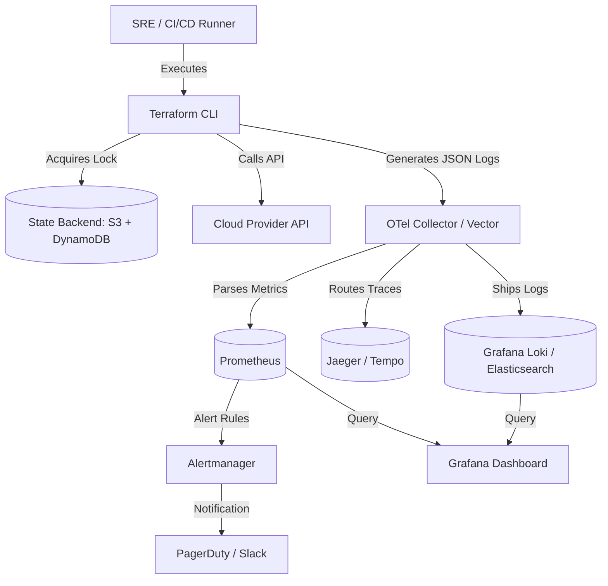

# Terraform - Part 3 - Technical Study Guide & Notes

# Terraform Production SRE, Diagnostics, & Incident Response (Part 3/3)

---

## 1. Part Introduction and Scope

This guide is designed for Senior Site Reliability Engineers (SREs), DevOps Leads, and Cloud Architects managing large-scale, mission-critical cloud infrastructure. While Parts 1 and 2 focused on syntax, module design, and pipeline construction, **Part 3** shifts entirely to **Day-2 operations, system diagnostics, incident response, and observability**.

### Scope of this Guide
* **Production SRE Diagnostics**: Advanced state recovery, debugging provider panics, and mitigating API rate limiting.
* **Observability & Monitoring**: Prometheus metric collection, custom alerting rules, OpenTelemetry tracing for Terraform runs, and structured log parsing.
* **Incident Runbooks & RCAs**: Step-by-step instructions for recovering from state lock deadlocks, corrupted state files, and partial applies.
* **Advanced Mechanics**: State surgery via JSON patching, custom provider debugging with `TF_REATTACH`, and high-scale performance tuning.

---

## 2. Importance of SRE & Diagnostics in High-Availability Systems

In a mature cloud ecosystem, Infrastructure as Code (IaC) is not merely a deployment tool; it is the **runtime engine of the platform**. If the IaC pipeline fails, degrades, or corrupts, the entire organization loses its ability to scale, self-heal, or patch security vulnerabilities.

```
┌──────────────────────────────────────────────────────────────────────────┐
│                      The Blast Radius of IaC Failures                    │
└──────────────────────────────────────────────────────────────────────────┘
                                     │
         ┌───────────────────────────┴───────────────────────────┐
         ▼                                                       ▼
┌─────────────────────────────────┐                     ┌─────────────────────────────────┐
│     State File Corruption       │                     │    API Rate Limiting (429)      │
├─────────────────────────────────┤                     ├─────────────────────────────────┤
│ • Split-brain infrastructure    │                     │ • Starvation of autoscale events│
│ • Orphaned resources            │                     │ • Blocked security hotfixes     │
│ • Accidental resource deletion  │                     │ • CI/CD pipeline queue backups  │
└─────────────────────────────────┘                     └─────────────────────────────────┘
```

### Why SRE Practices are Critical for Terraform

1. **Preventing "Split-Brain" Infrastructure**: If a Terraform run is interrupted (e.g., runner OOM, network partition), the actual state of the cloud and the state recorded in the state file diverge. Without SRE diagnostic patterns, subsequent runs can lead to catastrophic, unintended destructions of production databases or network routes.
2. **Minimizing Mean Time to Resolution (MTTR)**: When a production incident occurs, SREs must quickly determine if the issue was caused by an application deploy or an underlying infrastructure drift managed by Terraform. Observability into Terraform executions reduces MTTR from hours to minutes.
3. **Ensuring Deployment Velocity**: In microservice architectures with hundreds of state files, API rate limiting (HTTP 429) from cloud providers can stall deployments. Advanced tuning and caching prevent pipeline starvation.

---

## 3. Real-World Enterprise Use Cases

### Use Case 1: Multi-Region DynamoDB Lock Deadlock during Active Incident
* **Context**: A global financial services platform experiences a network partition during an emergency scale-up. The CI/CD runner is killed mid-apply, leaving a write-lock on the DynamoDB lock table.
* **Problem**: Subsequent emergency hotfixes are blocked by the active lock. SREs cannot apply changes to restore service.
* **SRE Solution**: Immediate execution of a cryptographic lock-ID verification and safe force-unlock protocol, followed by automated state validation.

### Use Case 2: Cloud Provider API Rate Limiting (HTTP 429) in Large-Scale Microservices
* **Context**: An e-commerce platform runs 1,200 microservices, each managed by a separate Terraform state file. During a peak traffic event (Black Friday), multiple autoscaling events trigger concurrent Terraform plans.
* **Problem**: AWS/Azure APIs return `HTTP 429 Too Many Requests`. Critical scaling operations are blocked.
* **SRE Solution**: Implementing provider-level concurrency throttling, dynamic backoff/retry configurations, and transitioning to a decentralized, decoupled state architecture.

### Use Case 3: State Corruption Recovery after Runner OOM (Out of Memory)
* **Context**: A massive Kubernetes cluster deployment state file (50MB+) is being updated when the self-hosted Kubernetes runner runs out of memory and is terminated by the Linux OOM Killer.
* **Problem**: The state file is left in a partially written, invalid JSON state on S3, blocking all future operations.
* **SRE Solution**: State surgery using local backups, verifying state lineage, reconstructing the state JSON, and executing a safe state push.

---

## 4. Comprehensive Architecture Explanation

An enterprise-grade, observable Terraform execution pipeline requires a decoupled architecture where execution, state management, and observability are separated.

### Observability and Execution Architecture



### Component Breakdown
* **Terraform CLI (with OpenTelemetry)**: The execution engine configured to output structured JSON logs (`TF_LOG_JSON=1`) and trace spans via OpenTelemetry protocol (OTLP).
* **State Backend**: High-availability storage (e.g., AWS S3, Azure Blob) combined with a distributed locking mechanism (e.g., DynamoDB, CosmosDB) using strong consistency.
* **OTel Collector / Vector Agent**: Ingests raw stdout/stderr from the runner, parses JSON-formatted logs, extracts execution metrics, and forwards them to downstream TSDBs (Time Series Databases).
* **Prometheus & Alertmanager**: Stores execution metrics (e.g., run duration, API call failures, lock age) and triggers alerts based on SRE SLOs (Service Level Objectives).

---

## 5. Types, Classifications, and Failure Domains

To diagnose issues effectively, an SRE must classify failures into distinct domains:

```
┌─────────────────────────────────────────────────────────────────────────────────────────────────┐
│                                    Terraform Failure Domains                                    │
└─────────────────────────────────────────────────────────────────────────────────────────────────┘
                                                 │
      ┌───────────────────┬──────────────────────┼──────────────────────┬───────────────────┐
      ▼                   ▼                      ▼                      ▼                   ▼
┌───────────┐       ┌───────────┐          ┌───────────┐          ┌───────────┐       ┌───────────┐
│State Locks│       │  Backend  │          │ Provider  │          │ Execution │       │  Logic &  │
│           │       │           │          │   APIs    │          │  Engine   │       │   Drift   │
└───────────┘       └───────────┘          └───────────┘          └───────────┘       └───────────┘
```

### 1. State Lock Failures
* **Stale Lock**: Lock held by a dead process or terminated runner.
* **Lock Collision**: Multiple concurrent pipelines attempting to modify the same state.
* **Permission Denied**: Runner lacks IAM permissions to write to the lock database.

### 2. Backend Failures
* **Network Partition**: Loss of connectivity to S3/Azure Blob.
* **Consistency Lag**: Read-after-write lag in cloud storage backends causing state divergence.
* **Storage Exhaustion/Quota**: Reaching backend storage limits or rate limits.

### 3. Provider API Failures
* **Rate Limiting (429)**: Exhausting API quotas of the cloud provider.
* **Authentication Expiry**: Temporary credentials (e.g., AWS STS) expiring mid-apply.
* **Schema Drift**: Cloud provider deprecating an API field, leading to runtime validation failures.

### 4. Execution Engine Failures
* **OOM (Out of Memory)**: State file or provider schema consumption exceeding runner memory limits.
* **Provider Panic**: Segment faults or unhandled exceptions within the Go binary of a provider.
* **Disk Space Exhaustion**: Runner running out of space in `/tmp` for provider plugins.

### 5. Logic & Drift Failures
* **Manual Intervention (Drift)**: Out-of-band changes in the cloud console causing conflict during plans.
* **Cyclic Dependencies**: Misconfigured `depends_on` or resource references causing infinite loops.

---

## 6. Step-by-Step Production Implementation Guide

This guide demonstrates how to build an **Observable, Self-Hosted Terraform Runner Pipeline** with automated state recovery capabilities and Prometheus metric extraction.

### Step 1: Design the Execution Environment (Docker-based Runner)
Create a hardened, SRE-optimized Dockerfile for the runner containing the Terraform CLI, OpenTelemetry instrumentation, and utility scripts.

```dockerfile
# syntax=docker/dockerfile:1.4
FROM alpine:3.19

# Define versions
ARG TERRAFORM_VERSION=1.7.5
ARG OTEL_CLI_VERSION=0.4.0

# Install dependencies
RUN apk add --no-cache \
    curl \
    unzip \
    git \
    jq \
    bash \
    ca-certificates \
    openssl

# Install Terraform
RUN curl -sSLo /tmp/terraform.zip https://releases.hashicorp.com/terraform/${TERRAFORM_VERSION}/terraform_${TERRAFORM_VERSION}_linux_amd64.zip && \
    unzip /tmp/terraform.zip -d /usr/local/bin && \
    rm /tmp/terraform.zip && \
    chmod +x /usr/local/bin/terraform

# Install OpenTelemetry CLI for pipeline tracing
RUN curl -sSLo /tmp/otel-cli.tar.gz https://github.com/equinix-labs/otel-cli/releases/download/v${OTEL_CLI_VERSION}/otel-cli_${OTEL_CLI_VERSION}_linux_amd64.tar.gz && \
    tar -xzf /tmp/otel-cli.tar.gz -C /usr/local/bin && \
    rm /tmp/otel-cli.tar.gz && \
    chmod +x /usr/local/bin/otel-cli

# Set SRE environment variables
ENV TF_IN_AUTOMATION=true
ENV TF_LOG_JSON=1
ENV TF_INPUT=0

WORKDIR /workspace
```

### Step 2: Implement the Secure, Observable Execution Wrapper Script
This script (`run-terraform.sh`) executes Terraform, captures structured logs, measures execution durations, and exports telemetry.

```bash
#!/usr/bin/env bash
set -euo pipefail

# SRE Terraform Wrapper Script with OTel Tracing & Metrics
# Usage: ./run-terraform.sh <plan|apply|destroy> <workspace>

ACTION="${1}"
WORKSPACE="${2}"
START_TIME=$(date +%s%N)

export OTEL_EXPORTER_OTLP_ENDPOINT="http://otel-collector.monitoring.svc:4317"
export TF_LOG="INFO"
export TF_LOG_PATH="/var/log/terraform/run-${WORKSPACE}.log"

mkdir -p /var/log/terraform

echo "==> Initializing Telemetry Trace..."
TRACE_ID=$(otel-cli span background \
  --service "terraform-runner" \
  --name "terraform-${ACTION}-${WORKSPACE}" \
  --attrs "workspace=${WORKSPACE},action=${ACTION}")

cleanup() {
  EXIT_CODE=$?
  END_TIME=$(date +%s%N)
  DURATION_MS=$(( (END_TIME - START_TIME) / 1000000 ))
  
  echo "==> Ending Telemetry Trace. Status: ${EXIT_CODE}, Duration: ${DURATION_MS}ms"
  otel-cli span end --status "${EXIT_CODE}" --attrs "duration_ms=${DURATION_MS}"
  
  # Generate custom Prometheus metric via Pushgateway
  cat <<EOF | curl --data-binary @- http://prometheus-pushgateway.monitoring.svc:9091/metrics/job/terraform_runs
# HELP terraform_run_duration_seconds Duration of the Terraform run in seconds.
# TYPE terraform_run_duration_seconds gauge
terraform_run_duration_seconds{workspace="${WORKSPACE}",action="${ACTION}"} $((DURATION_MS / 1000))
# HELP terraform_run_status Status of the last run (1 = Success, 0 = Failure).
# TYPE terraform_run_status gauge
terraform_run_status{workspace="${WORKSPACE}",action="${ACTION}"} $(( EXIT_CODE == 0 ? 1 : 0 ))
EOF

  exit ${EXIT_CODE}
}

trap cleanup EXIT

echo "==> Selecting Workspace: ${WORKSPACE}"
terraform workspace select -or-create=true "${WORKSPACE}"

echo "==> Running Terraform ${ACTION}..."
if [ "${ACTION}" == "apply" ]; then
  # Use plan file for safety in automation
  terraform plan -out=tfplan -detailed-exitcode || EXIT_CODE=$?
  
  # Exit code 2 means changes present, 0 means no changes, 1 means error
  if [ ${EXIT_CODE} -eq 2 ]; then
    terraform apply -auto-approve tfplan
  elif [ ${EXIT_CODE} -eq 0 ]; then
    echo "No changes detected. Skipping apply."
  else
    echo "Error during planning phase."
    exit 1
  fi
else
  terraform "${ACTION}" -auto-approve
fi
```

---

## 7. Standard CLI Commands with Deep Technical Explanations

As an SRE, basic commands are insufficient. You must understand the low-level impact, locking behavior, and flag side effects of state surgery commands.

### 1. State Recovery & Lock Management
```bash
terraform force-unlock <LOCK_ID>
```
* **Technical Explanation**: Releases a stale state lock manually.
* **Under the Hood**: Connects directly to the locking backend (e.g., DynamoDB or Consul), searches for the entry matching the `<LOCK_ID>` hash, and deletes the lock lease record.
* **SRE Warning**: Never run this unless you have verified that the process holding the lock is dead. Doing this to a running process will cause **silent state corruption**.

### 2. State Extraction & Injection
```bash
terraform state pull > state.json
```
* **Technical Explanation**: Downloads the latest state file from the remote backend and outputs it to stdout as raw JSON.
* **Under the Hood**: Performs a read operation with strong consistency directly on the backend, bypassing any local cache.

```bash
terraform state push state.json
```
* **Technical Explanation**: Uploads a modified local JSON state file to the remote backend.
* **Under the Hood**: Validates the JSON schema, increments the state's `serial` number to prevent out-of-order state updates, acquires a temporary lock, writes the file, and releases the lock.
* **SRE Warning**: Always backup the remote state before executing a push.

### 3. Structural State Surgery
```bash
terraform state rm <RESOURCE_ADDRESS>
```
* **Technical Explanation**: Removes a resource from the state file without destroying the actual physical cloud resource.
* **Under the Hood**: Deletes the node representing the resource from the state's Directed Acyclic Graph (DAG).
* **Use Case**: Used when a resource is deleted manually out-of-band, or when you want to transfer ownership of a resource to another state file.

```bash
terraform state mv <SOURCE_ADDRESS> <DESTINATION_ADDRESS>
```
* **Technical Explanation**: Renames a resource within the state file.
* **Under the Hood**: Modifies the resource address key in the state JSON structure. Crucial for refactoring modules without destroying and recreating resources.

### 4. Diagnostics & Troubleshooting Logs
```bash
export TF_LOG=TRACE
export TF_LOG_PATH=/tmp/tf-trace.log
```
* **Technical Explanation**: Enables maximum logging output.
* **Under the Hood**:
  * `TRACE`: Outputs every HTTP request, response payload, Go internal function call, and provider plugin communication.
  * `DEBUG`: Outputs detailed developer-level logs.
  * `INFO`: General high-level execution steps.
  * `WARN`/`ERROR`: Log alerts and execution failures.

---

## 8. Production Configuration Examples

### Prometheus Alerting Rules (`prometheus.rules.yml`)
These rules alert SRE teams on critical Terraform pipeline failures, abnormal execution times, and stale state locks.

```yaml
groups:
  - name: terraform_sre_alerts
    rules:
      - alert: TerraformStateLockStale
        expr: terraform_state_lock_age_seconds > 7200
        for: 10m
        labels:
          severity: critical
          tier: platform
        annotations:
          summary: "Stale Terraform state lock detected"
          description: "The state lock for workspace {{ $labels.workspace }} has been held for more than 2 hours. This indicates a hung pipeline or dead runner."
          runbook_url: "https://wiki.enterprise.io/sre/runbooks/terraform-stale-lock"

      - alert: TerraformHighFailureRate
        expr: sum(rate(terraform_run_status{status="0"}[1h])) / sum(rate(terraform_runs_total[1h])) * 100 > 15
        for: 15m
        labels:
          severity: warning
          tier: platform
        annotations:
          summary: "High Terraform execution failure rate"
          description: "Over 15% of Terraform runs in the last hour have failed. Potential provider API deprecation or network partition."

      - alert: CloudProviderRateLimiting
        expr: rate(terraform_api_requests_total{status="429"}[5m]) > 0.1
        for: 2m
        labels:
          severity: page
          tier: platform
        annotations:
          summary: "Cloud Provider API Rate Limiting (HTTP 429)"
          description: "The Terraform runner is encountering HTTP 429 rate limits from cloud provider {{ $labels.provider }}."
          runbook_url: "https://wiki.enterprise.io/sre/runbooks/api-rate-limiting"
```

### OpenTelemetry Collector Configuration (`otel-collector.yml`)
This configuration parses Terraform JSON logs, extracts metrics, and pushes traces.

```yaml
receivers:
  otlp:
    protocols:
      grpc:
        endpoint: 0.0.0.0:4317
      http:
        endpoint: 0.0.0.0:4318
  filelog:
    include: [ /var/log/terraform/*.log ]
    operators:
      - type: json_parser
        timestamp:
          parse_from: attributes.timestamp
          layout: '%Y-%m-%dT%H:%M:%S.%fZ'
        severity:
          parse_from: attributes.level

processors:
  batch:
    timeout: 1s
    send_batch_size: 256

exporters:
  prometheus:
    endpoint: "0.0.0.0:8889"
    namespace: "terraform"
  otlp/jaeger:
    endpoint: "jaeger-collector.monitoring.svc:4317"
    tls:
      insecure: true

service:
  pipelines:
    metrics:
      receivers: [otlp]
      processors: [batch]
      exporters: [prometheus]
    logs:
      receivers: [filelog]
      processors: [batch]
      exporters: [otlp/jaeger]
```

---

## 9. Security Considerations & Hardening Best Practices

```
┌──────────────────────────────────────────────────────────────────────────┐
│                      Hardened State Access Architecture                  │
└──────────────────────────────────────────────────────────────────────────┘
                                     │
         ┌───────────────────────────┴───────────────────────────┐
         ▼                                                       ▼
┌─────────────────────────────────┐                     ┌─────────────────────────────────┐
│     Data Plane Isolation        │                     │     Control Plane Hardening     │
├─────────────────────────────────┤                     ├─────────────────────────────────┤
│ • KMS CMK State Encryption      │                     │ • Ephemeral IAM STS Roles       │
│ • S3 Bucket Private VPC Endpoint│                     │ • Least-Privilege SRE Policy    │
│ • S3 Object Lock (WORM)         │                     │ • Automated Log Masking         │
└─────────────────────────────────┘                     └─────────────────────────────────┘
```

### 1. State File Encryption at Rest and in Transit
* **KMS Customer Managed Keys (CMK)**: Do not use default AWS-managed S3 keys. Use a dedicated KMS CMK with a key policy that restricts access strictly to the CI/CD execution role and SRE break-glass roles.
* **TLS 1.3 Enforcement**: Enforce TLS 1.2 or 1.3 for all backend communication using S3 bucket policies:
  ```json
  {
    "Sid": "EnforceTLSRequestsOnly",
    "Effect": "Deny",
    "Principal": "*",
    "Action": "s3:*",
    "Resource": "arn:aws:s3:::my-company-tf-state/*",
    "Condition": {
      "Bool": { "aws:SecureTransport": "false" }
    }
  }
  ```

### 2. S3 Object Lock (WORM - Write Once Read Many)
* To prevent state history tampering or accidental state deletion by compromised runner credentials, enable **S3 Object Lock** in compliance mode with a 7-day retention period.

### 3. Mitigating Secret Leakage in Logs
* **Sensitive Variables**: Mark all variables containing tokens, passwords, or private keys as `sensitive = true`.
* **Runner Log Scrubbing**: Implement a regex-based log-scrubbing proxy (e.g., Vector or Fluentbit) to detect and mask potential AWS/Azure secret keys, JWTs, and database passwords before shipping logs to Loki/Elasticsearch.

---

## 10. Observability & Monitoring Considerations

To monitor Terraform deployments at scale, SRE teams should focus on four golden signals:

### Key Prometheus Metrics to Watch

| Metric Name | Type | Labels | Description | Alert Trigger Condition |
| :--- | :--- | :--- | :--- | :--- |
| `terraform_runs_total` | Counter | `workspace`, `status` | Total number of executed runs. | N/A |
| `terraform_run_duration_seconds` | Histogram | `workspace`, `action` | Time taken for plan/apply. | `> 1800s` (30 mins) |
| `terraform_state_lock_age_seconds`| Gauge | `workspace` | Duration a state lock has been held. | `> 7200s` (2 hours) |
| `terraform_api_requests_total` | Counter | `provider`, `status` | API requests sent to cloud endpoints.| `status="429"` rate `> 0` |
| `terraform_drift_detected_resources`| Gauge | `workspace` | Count of resources drifted from state. | `> 0` (Warning) |

### Enterprise Log Aggregation Strategy
Configure the runner to output JSON logs (`TF_LOG_JSON=1`). A typical structured log from a modern Terraform engine looks like this:

```json
{
  "@timestamp": "2024-10-27T14:23:11.102Z",
  "@level": "info",
  "@message": "aws_instance.web: Creation complete after 42s [id=i-0123456789abcdef0]",
  "terraform.workspace": "production",
  "terraform.module": "modules.web_server",
  "terraform.resource": "aws_instance.web",
  "span.id": "4a82b901cd",
  "trace.id": "8f88a204e1bc2100"
}
```
* **Log Parsing**: Use Loki or Logstash to extract `terraform.workspace` and `terraform.resource` as indexed labels. This allows SREs to instantly query all modifications made to a specific resource across the enterprise.

---

## 11. Common Troubleshooting Scenarios with RCA Steps

### Scenario A: State Lock Deadlock

#### 1. Symptoms
The pipeline fails during the initialization/plan phase with the following error:
```
Error: Error acquiring the state lock
Error message: ConditionalCheckFailedException: The conditional request failed
Lock Info:
  ID:        518a4a21-9871-bc01-e231-10bc3928192a
  Path:      my-company-tf-state/production.tfstate
  Operation: OperationTypeApply
  Who:       jenkins@runner-01-9a72d
  Version:   1.7.5
  Created:   2024-10-27 12:00:00.1023 UTC
```

#### 2. Root Cause Analysis (RCA)
A previous execution of Terraform was abruptly terminated. The runner container was either OOMKilled, the VM hosting the runner crashed, or a network partition prevented the runner from sending the `ReleaseLock` API call to DynamoDB before exiting.

#### 3. SRE Remediation & Runbook
1. **Verify Lock Holder**: SSH or query the runner metadata (`jenkins@runner-01-9a72d`). Check if the process is still running. If it is active, **do not proceed**. Wait for completion.
2. **Execute Safe Unlock**: If the runner is dead, execute:
   ```bash
   terraform force-unlock 518a4a21-9871-bc01-e231-10bc3928192a
   ```
3. **Validate State Lineage**: Run `terraform plan` immediately after to verify no partial state was written.

---

### Scenario B: Cloud Provider Rate Limiting (HTTP 429 / Throttling)

#### 1. Symptoms
Plan or Apply fails mid-execution with errors such as:
```
Error: WebServiceError: API rate limit exceeded. HTTP Status Code: 429 Too Many Requests.
```

#### 2. Root Cause Analysis (RCA)
The organization is running too many concurrent pipelines, or a single massive state file contains thousands of resources. During a plan, Terraform queries the cloud provider API for every single resource in parallel, triggering the provider's DDOS/API rate limiters.

#### 3. SRE Remediation & Runbook
1. **Reduce Parallelism**: Temporarily reduce the concurrency engine of Terraform (default is 10):
   ```bash
   terraform plan -parallelism=3
   ```
2. **Deconstruct the State (State Splitting)**: Break down the monolithic state file into micro-states using data sources or `terraform_remote_state` to query dependencies.
3. **Configure Provider Retries**: Increase the retry count and backoff parameters inside the provider block:
   ```hcl
   provider "aws" {
     region = "us-east-1"
     max_retries = 15
   }
   ```

---

### Scenario C: State Corruption (Partial Apply / Interrupted Run)

#### 1. Symptoms
Running `terraform plan` results in errors indicating that resources exist but are not tracked, or the state JSON is malformed:
```
Error: Failed to load state: state signature is invalid / unexpected end of JSON input
```

#### 2. Root Cause Analysis (RCA)
A runner crashed or lost network connectivity exactly while writing the state file back to the remote backend, leaving a partial or corrupted JSON payload in S3/Azure Blob.

#### 3. SRE Remediation & Runbook (State Surgery)
1. **Enable SRE Break-Glass Mode**: Clone the state repository locally and set up a secure workspace.
2. **Pull the Corrupted State**:
   ```bash
   terraform state pull > corrupted_state.json.bak
   ```
3. **Retrieve the Last Stable Version**: Access S3 Bucket Versioning and download the previous version of `production.tfstate` (e.g., `stable_state.json`).
4. **Perform State Comparison**:
   Use `diff` or `jq` to identify which resources were added/modified between the stable and corrupted states:
   ```bash
   jq --sort-keys .resources[].instances[].attributes.id stable_state.json > stable_ids.txt
   jq --sort-keys .resources[].instances[].attributes.id corrupted_state.json.bak > corrupted_ids.txt
   diff stable_ids.txt corrupted_ids.txt || true
   ```
5. **Reconstruct and Push State**:
   If the stable state is clean, increment the `serial` number in the stable state JSON file to be higher than the corrupted state's serial number, then force push:
   ```bash
   # Increment serial using jq
   jq '.serial += 1' stable_state.json > restored_state.json
   
   # Push back to remote backend
   terraform state push restored_state.json
   ```
6. **Reconcile Infrastructure**: Run `terraform plan` to identify and import any resources that were created in the cloud but missed in the restored state.

---

## 12. Common Mistakes and How to Avoid Them in Production

### Mistake 1: Executing `terraform force-unlock` without Validation
* **The Danger**: SRE receives a lock alert and immediately unlocks the state. However, another developer is currently applying a large database migration. The unlock allows a concurrent pipeline to start, leading to **split-brain state writing and total state corruption**.
* **The Avoidance**: Always enforce a strict runbook policy: Verify the PID/runner of the lock owner is dead via telemetry before unlocking.

### Mistake 2: Storing Plaintext Secrets in tfstate Backends
* **The Danger**: Developers assume that because the state is in S3, it is safe. However, many roles have read access to S3. Plaintext database passwords, API tokens, and private keys stored in state are exposed.
* **The Avoidance**: Use Dynamic Secret Providers (e.g., HashiCorp Vault, AWS Secrets Manager) and reference them dynamically in resources rather than hardcoding.

### Mistake 3: Monolithic State Files
* **The Danger**: Placing an entire AWS account infrastructure (VPC, RDS, EKS, IAM) inside a single state file.
* **The Avoidance**: Run times become extremely slow, blast radius of any error is 100% of the infrastructure, and API rate limits are hit constantly. Split state files by lifecycle boundaries (e.g., `network`, `data-stores`, `compute`).

---

## 13. Enterprise-Level Recommendations

### 1. High-Performance Tuning via Plugin Caching
To prevent runners from downloading provider binaries (which can be hundreds of megabytes) on every single pipeline execution:
* Enable a global provider plugin cache directory in the runner:
  ```bash
  # Create directory
  mkdir -p /opt/terraform/plugin-cache
  
  # Configure CLI Configuration file (~/.terraformrc)
  cat <<EOF > ~/.terraformrc
  plugin_cache_dir = "/opt/terraform/plugin-cache"
  disable_checkpoint = true
  EOF
  ```

### 2. Connection Pooling and Keep-Alives for Providers
For large apply operations, configure provider connections to reuse TCP sockets to minimize handshake latency and prevent socket exhaustion on the runner:
```bash
export HTTP_KEEP_ALIVE=true
export AWS_MAX_ATTEMPTS=10
```

### 3. State Size Optimization
* State files over 50MB degrade performance. Clean up old state versions, remove unused output variables, and split large `for_each` resource maps into smaller decoupled modules.

---

## 14. Advanced Concepts

### Custom Provider Debugging via `TF_REATTACH`
When debugging a custom-written Terraform provider or diagnosing a complex provider crash (panic), you can attach a debugger (like Delve for Go) directly to the provider process.

1. **Start the Provider in Debug Mode**:
   Compile and run the provider locally, passing the `--debug` flag. It will output a JSON configuration string:
   ```json
   {
     "registry.terraform.io/my-org/my-provider": {
       "Protocol": "grpc",
       "ProtocolVersion": 5,
       "Pid": 12345,
       "Test": true,
       "Addr": {
         "Network": "unix",
         "String": "/tmp/tf-provider-debug.sock"
       }
     }
   }
   ```
2. **Reattach Terraform CLI**:
   Export this JSON string as `TF_REATTACH` before running Terraform commands. Terraform will bypass the standard plugin execution and route RPC calls directly to your running debugger process:
   ```bash
   export TF_REATTACH='{"registry.terraform.io/my-org/my-provider": ...}'
   terraform apply
   ```

### State Surgery via JSON Patching
When CLI commands like `terraform state rm` are blocked because of schema validation bugs, you can patch the state file directly using RFC 6902 JSON patches.

```bash
# Example: JSON patch to remove a broken provider configuration block
cat <<EOF > patch.json
[
  { "op": "remove", "path": "/provider_configs/aws" }
]
EOF

terraform state pull > state.json
jsonpatch state.json patch.json > patched_state.json
terraform state push patched_state.json
```

---

## 15. Integration with Other DevOps Tools

```
┌──────────────────────────────────────────────────────────────────────────┐
│                     Enterprise Toolchain Integration                     │
└──────────────────────────────────────────────────────────────────────────┘
                                     │
         ┌───────────────────────────┼───────────────────────────┐
         ▼                           ▼                           ▼
┌──────────────────┐       ┌──────────────────┐       ┌──────────────────┐
│  HashiCorp Vault │       │  ArgoCD / GitOps │       │     Trivy /      │
│                  │       │                  │       │    Checkov       │
├──────────────────┤       ├──────────────────┤       ├──────────────────┤
│ • Dynamic, short-│       │ • Reconciles actual│     │ • Scan tfplan    │
│   lived cloud    │       │   state against  │       │   JSON output    │
│   credentials    │       │   Git repository │       │   for security   │
│ • Zero static keys│      │ • Self-healing   │       │   violations     │
└──────────────────┘       └──────────────────┘       └──────────────────┘
```

### Complete SRE CI/CD Pipeline Integration (GitLab CI/GitHub Actions style)
This pipeline configuration uses HashiCorp Vault for dynamic credentials, executes Trivy security scans, and runs Terraform with tracing.

```yaml
# .github/workflows/terraform-sre.yml
name: "Production SRE Terraform Pipeline"

on:
  push:
    branches: [ "main" ]

jobs:
  deploy:
    runs-on: self-hosted-sre-runner
    permissions:
      id-token: write # Required for Vault OIDC
      contents: read

    steps:
      - name: Checkout Code
        uses: actions/checkout@v4

      - name: Fetch Dynamic Credentials from Vault
        uses: hashicorp/vault-action@v2
        with:
          url: https://vault.enterprise.io:8200
          role: terraform-production-executor
          method: jwt
          secrets: |
            aws/creds/terraform-role access_key | AWS_ACCESS_KEY_ID ;
            aws/creds/terraform-role secret_key | AWS_SECRET_ACCESS_KEY ;
            aws/creds/terraform-role security_token | AWS_SESSION_TOKEN

      - name: Security Scan (IaC SAST)
        run: |
          trivy config . --severity HIGH,CRITICAL --exit-code 1

      - name: Terraform Init & Plan
        run: |
          export TF_LOG_JSON=1
          export TF_LOG_PATH="./tf-run.log"
          terraform init
          terraform plan -out=tfplan -detailed-exitcode || exit_code=$?
          
          # If exit code is 2 (changes), proceed. If 0 (no changes), stop. If 1, fail.
          if [ $exit_code -eq 0 ]; then
            echo "No changes. Exiting pipeline successfully."
            exit 0
          elif [ $exit_code -ne 2 ]; then
            echo "Terraform plan failed."
            exit 1
          fi

      - name: Static Analysis on Plan Artifact
        run: |
          terraform show -json tfplan > tfplan.json
          trivy image --severity HIGH,CRITICAL --input tfplan.json

      - name: Terraform Apply
        run: |
          terraform apply -auto-approve tfplan
```

---

## 16. Comparison with Competing SRE & State Management Tools

| Feature / Dimension | Terraform (v1.7+) | OpenTofu (v1.6+) | Pulumi | Crossplane (K8s) |
| :--- | :--- | :--- | :--- | :--- |
| **State Locking Engine** | S3/DynamoDB, Consul, TF Enterprise | S3/DynamoDB, Consul, OpenTofu Registry | Pulumi Service Cloud, S3, Azure Blob | Kubernetes etcd (Raft-based) |
| **Telemetry Support** | OpenTelemetry (Traces), JSON Logs | OpenTelemetry (Metrics & Traces), JSON Logs | Native Prometheus Metrics, OpenTelemetry | Kubernetes Native Prometheus Metrics |
| **Recovery Mechanism** | Manual State Surgery, CLI Commands | CLI State Commands, OpenTofu State APIs | Pulumi State Edit, JSON Patching | Automated Reconciliation Loop |
| **API Latency** | Low to Moderate (Iterative Graph) | Low to Moderate (Optimized Graph Engine) | Moderate (Language Runtime overhead) | High (Event-driven controller queue) |
| **SRE Runbook Complexity**| Moderate (Well documented) | Moderate (Compatible with TF) | High (Requires programming language knowledge) | Low (Self-healing via K8s controllers) |
| **Best Use Case** | Enterprise Standard Multi-Cloud | Open-Source Hardened Multi-Cloud | Developer-centric cloud application stacks | Kubernetes-native platform engineering |

---

## 17. SRE Visual Cheat Sheet

| Incident / Error | Immediate SRE Command | Primary Flag / Variable | Mitigation Goal |
| :--- | :--- | :--- | :--- |
| **Deadlock Alert** | `terraform force-unlock <ID>` | None | Release stale lock safely. |
| **API Throttling** | `terraform plan -parallelism=3` | `TF_LOG=TRACE` | Reduce rate of API calls. |
| **State Corruption**| `terraform state push <file>` | `serial` increment | Overwrite corrupt state with backup. |
| **Provider Panic** | `export TF_LOG=TRACE` | `TF_LOG_PATH` | Capture Go stack trace for bug report. |
| **Drift Investigation**| `terraform plan -detailed-exitcode`| `-refresh-only` | Identify out-of-band changes. |
| **Resource Orphan** | `terraform state rm <address>` | None | Stop tracking resource without deleting. |
| **Refactoring Module**| `terraform state mv <src> <dest>` | None | Prevent deletion of renamed resource. |

---

## 18. Comprehensive Final Learning Summary

Mastering Terraform at an enterprise scale requires shifting focus from syntax writing to system reliability and observability. 

### Key Takeaways
1. **State is Sacred**: The state file is the runtime memory of your cloud. Treat state operations with the same care as database schema migrations. Always ensure backup lineages exist.
2. **Design for Observability**: Never run Terraform in a black box. Enable structured JSON logs (`TF_LOG_JSON=1`), capture execution metrics, and instrument pipelines with OpenTelemetry to track execution durations and identify performance bottlenecks.
3. **Control the Blast Radius**: Avoid monolithic state files. Decouple infrastructure by lifecycle, ownership, and rate of change. This limits the damage of state corruption and helps prevent API rate limiting.
4. **Automate SRE Runbooks**: Prepare for deadlocks and drift. Build automated safety checks, secure break-glass procedures, and alerting rules to detect stale locks and pipeline failures before they impact delivery speed.

### Q41. State Lock Deadlock & Backend Corruption Recovery

**Detailed Answer**:
In enterprise SRE environments, state locking is critical to prevent concurrent executions from corrupting the state file. When using an AWS backend (S3 for state storage and DynamoDB for lock state), a lock is acquired by writing an item to the DynamoDB table with a primary key `LockID` (which is a hash of the bucket name and path to the state file). 

A "State Lock Deadlock" occurs when a Terraform process is abruptly terminated (e.g., CI/CD runner OOM killed, network partition, or manual cancellation of a build container) after acquiring the lock but before releasing it. The lock remains active in DynamoDB, blocking all subsequent runs with the error: `Error: Error acquiring the state lock`.

To recover from this incident safely without causing state corruption, an SRE must follow a strict diagnostic and remediation protocol:
1. **Identify the Lock Holder**: Run `terraform plan` or inspect the CLI output to retrieve the Lock Info. This output provides the `ID` (a UUID), the `Path` to the state file, the `Operation` (e.g., `OperationTypeApply`), the `Who` (username/host), and the `Created` timestamp.
2. **Verify Process Status**: Ensure that the process indicated in the `Who` field is indeed dead. Forcing an unlock on an active, running Terraform process will lead to catastrophic state corruption (split-brain state writing).
3. **Execute Force Unlock**: Once confirmed dead, run `terraform force-unlock <LOCK_ID>`. This sends a release request to the backend.
4. **State Corruption Mitigation**: If the state file itself was partially written and corrupted (resulting in syntax errors or parsing failures), you must leverage S3 Bucket Versioning to roll back. S3 bucket versioning is non-negotiable for production backends. SREs should download the corrupted state, download the last known-good version, perform a `diff`, and restore the valid version.

**Production Scenario / Practical Example**:
An engineer cancels a GitHub Actions runner during a long-running RDS deployment. The next run fails with:
```
Error: Error acquiring the state lock
Lock Info:
  ID:        a1b2c3d4-e5f6-7a8b-9c0d-1e2f3a4b5c6d
  Path:      my-infra-bucket/production/terraform.tfstate
  Operation: OperationTypeApply
  Who:       runner@github-runner-7f8c9b
  Version:   1.5.7
  Created:   2023-10-24 14:32:01.123456 +0000 UTC
```

**Step 1: Release the Lock**
Verify the runner `github-runner-7f8c9b` has terminated. Run the force-unlock command:
```bash
terraform force-unlock a1b2c3d4-e5f6-7a8b-9c0d-1e2f3a4b5c6d
```
*If Terraform CLI is inaccessible, manually delete the lock item from the DynamoDB table via AWS CLI:*
```bash
aws dynamodb delete-item \
    --table-name my-terraform-lock-table \
    --key '{"LockID": {"S": "my-infra-bucket/production/terraform.tfstate-md5"}}' \
    --region us-east-1
```

**Step 2: Recover Corrupted State from S3 Versioning**
If the state became corrupted during the crash, retrieve the version history:
```bash
aws s3api list-object-versions \
    --bucket my-infra-bucket \
    --prefix production/terraform.tfstate \
    --query 'Versions[?IsLatest==`false`].[VersionId, LastModified]' \
    --output table
```
Identify the version ID right before the crash, download it, and push it back to the backend:
```bash
# Download the last known good version
aws s3api get-object \
    --bucket my-infra-bucket \
    --key production/terraform.tfstate \
    --version-id "v_123456789_abcdefG" \
    recovered_state.json

# Safely push the recovered state back to the remote backend
terraform state push recovered_state.json
```

---

### Q42. Debugging Provider-Level Panics and Core Dumps

**Detailed Answer**:
A provider-level panic occurs when the underlying Go code of a Terraform provider encounters an unhandled runtime exception (e.g., a nil pointer dereference or index out of range) and crashes. When this happens, Terraform CLI displays a Go stack trace and exits with code 1.

To isolate, debug, and patch/bypass a provider panic in an enterprise environment:
1. **Enable Deep Logging**: Set the `TF_LOG` environment variable to `TRACE` and redirect output to a file (`TF_LOG_PATH`). Trace logs contain the raw HTTP requests and responses exchanged between the provider and the cloud provider's API. This isolates whether the panic was triggered by an unexpected API response payload or a local structural bug in the provider's resource schema mapping.
2. **Examine the Stack Trace**: Locate the panic message (e.g., `panic: runtime error: invalid memory address...`). Trace the stack back to the specific file and line number in the provider's source code (e.g., `github.com/hashicorp/terraform-provider-aws/internal/service/...`).
3. **Implement Developer Overrides**: If a patch is required before an upstream release is available, you can clone the provider repository, fix the bug in Go, compile the binary locally, and configure a developer override in your local `~/.terraformrc` (or `%APPDATA%/terraform.rc` on Windows). This instructs Terraform to bypass the registry and use your local compiled binary for executions.

**Production Scenario / Practical Example**:
During a `terraform apply`, the AWS provider panics when trying to read an imported Elastic Beanstalk resource.

**Step 1: Capture TRACE logs**
```bash
export TF_LOG=TRACE
export TF_LOG_PATH=./terraform_panic.log
terraform apply -auto-approve
```

Inspect `terraform_panic.log`:
```text
2023-10-24T15:10:05.123Z [DEBUG] provider.terraform-provider-aws_v5.21.0_x5: member: *elasticbeanstalk.EnvironmentDescription: nil pointer dereference
2023-10-24T15:10:05.124Z [ERR]   panic: runtime error: invalid memory address or nil pointer dereference
[signal SIGSEGV: segmentation violation code=0x1 addr=0x0 pc=0x34a5bc1]
goroutine 123 [running]:
github.com/hashicorp/terraform-provider-aws/internal/service/elasticbeanstalk.flattenEnvironmentFields(0x0, 0xc000789d00)
    /home/runner/work/terraform-provider-aws/internal/service/elasticbeanstalk/flatten.go:42 +0x2b
```

The log proves that line 42 of `flatten.go` fails to check if the incoming environment pointer is `nil` before dereferencing it.

**Step 2: Build a Local Patch and Configure Developer Override**
Clone the provider and patch line 42 of `flatten.go`:
```go
// Add nil check
if env == nil {
    return nil
}
```
Compile the provider binary:
```bash
go build -o terraform-provider-aws
```

Create/edit `~/.terraformrc` to point to the local build directory:
```hcl
provider_installation {
  dev_overrides {
    "hashicorp/aws" = "/workspace/terraform-provider-aws"
  }
  # Directs Terraform to use the local build instead of downloading from registry
  direct {}
}
```
Run `terraform plan` again. Terraform will output a warning indicating that developer overrides are in effect for `hashicorp/aws`, bypassing the crash and allowing the deployment to proceed securely.

---

### Q43. Prometheus Alerting & Monitoring for Terraform / GitOps Pipelines

**Detailed Answer**:
In enterprise GitOps workflows (e.g., using Atlantis, Terraform Cloud, or self-hosted GitLab/GitHub runners), monitoring the state of Terraform execution pipelines is critical to maintaining infrastructure stability. SREs should not treat Terraform as a silent black box. 

To monitor pipelines effectively, we expose and scrape metrics from Atlantis or our CI runners. Key metrics include:
* `atlantis_apply_failed_total` / `atlantis_plan_failed_total`: Count of failed operations.
* `terraform_state_lock_duration_seconds`: Gauge measuring how long a state lock has been held.
* `terraform_drift_detected`: Custom metric emitted by scheduled drift-detection cron jobs.

Using these metrics, we configure custom Prometheus Alerting Rules to capture:
1. **Stuck State Locks**: Locks held longer than 2 hours (indicates crashed runs or abandoned PRs).
2. **Persistent Apply Failures**: Consecutive failures on the main branch, indicating a broken deployment loop.
3. **Unreconciled Drift**: Out-of-band changes detected but not applied for over 24 hours.

**Production Scenario / Practical Example**:
Below is a production-grade Prometheus Alerting Rules configuration (`PrometheusRule` Kubernetes CRD) designed to monitor a GitOps-driven Terraform deployment system.

```yaml
apiVersion: monitoring.coreos.com/v1
kind: PrometheusRule
metadata:
  name: terraform-pipeline-alerts
  namespace: monitoring
  labels:
    role: alert-rules
spec:
  groups:
  - name: TerraformSREAlerts
    rules:
    - alert: TerraformStateLockStuck
      expr: terraform_state_lock_duration_seconds{env="production"} > 7200
      for: 10m
      labels:
        severity: warning
        team: sre-oncall
      annotations:
        summary: "Terraform State Lock Held Over 2 Hours"
        description: "The state lock for workspace '{{ $labels.workspace }}' has been held for {{ $value | humanizeDuration }}. This may indicate an interrupted runner or manual intervention deadlock."
        runbook_url: "https://wiki.corp/sre/runbooks/terraform-force-unlock"

    - alert: TerraformApplyContinuousFailures
      expr: rate(atlantis_apply_failed_total{env="production"}[30m]) > 0.1
      for: 15m
      labels:
        severity: critical
        team: platform-engineering
      annotations:
        summary: "High Failure Rate in Terraform Apply"
        description: "Terraform apply operations in production are failing at an elevated rate (current rate: {{ $value | printf \"%.2f\" }} failures/sec). Infrastructure state is likely out of sync."
        runbook_url: "https://wiki.corp/sre/runbooks/atlantis-pipeline-debug"

    - alert: UnreconciledInfrastructureDrift
      expr: terraform_drift_detected{env="production"} == 1
      for: 24h
      labels:
        severity: warning
        team: sre-oncall
      annotations:
        summary: "Production Infrastructure Drift Detected"
        description: "Terraform drift detection cron has identified out-of-band modifications in workspace '{{ $labels.workspace }}' that have remained unreconciled for > 24 hours."
        runbook_url: "https://wiki.corp/sre/runbooks/reconcile-drift"
```

---

### Q44. Incident RCA: Preventative Guardrails Against Accidental Stateful Resource Destruction

**Detailed Answer**:
A common catastrophic incident in cloud engineering is the accidental deletion of stateful resources (e.g., RDS databases, KMS keys, Elasticache clusters) due to a logical rename, module refactoring, or missing `lifecycle` blocks.

**Root Cause Analysis (RCA) of the Failure Mode**:
When an engineer renames a resource block (e.g., `aws_db_instance.primary` to `aws_db_instance.db_v2`) or changes an immutable attribute (such as an RDS instance identifier or KMS key spec), Terraform's default behavior is **Destroy-and-Create**. 

While the `lifecycle { prevent_destroy = true }` block provides basic protection, it has critical limitations:
1. It does not prevent destruction if the entire resource block is deleted from the configuration.
2. It does not prevent destruction if the resource is nested inside a module that is being entirely removed.
3. It relies on the engineer remembering to write it.

To implement enterprise-grade preventative guardrails, SREs must decouple enforcement from the Terraform code itself by using **Open Policy Agent (OPA)** or **HashiCorp Sentinel** policies integrated directly into the CI/CD pull request gate. This scans the generated binary execution plan (`tfplan.binary` serialized to JSON) and blocks execution if any stateful resource is marked for deletion.

**Production Scenario / Practical Example**:
An engineer accidentally renames an RDS database resource identifier in HCL, causing Terraform to plan a destructive replacement.

**Step 1: Export the Plan to JSON in the CI Pipeline**
```bash
terraform plan -out=tfplan.binary
terraform show -json tfplan.binary > tfplan.json
```

**Step 2: Define the OPA Rego Policy (`prevent_rds_destruction.rego`)**
This policy parses the plan JSON, scans the `resource_changes` array, and denies the run if any `aws_db_instance` or `aws_rds_cluster` has a `delete` action within its change actions.

```rego
package terraform.validation

import future.keywords.in

default allow = false

# Define stateful resource types we want to protect
stateful_resources := [
    "aws_db_instance",
    "aws_rds_cluster",
    "aws_dynamodb_table",
    "aws_kms_key"
]

# Deny rules
deny[msg] {
    resource := input.resource_changes[_]
    resource.type in stateful_resources
    
    # Check if 'delete' action is present in the change actions
    actions := resource.change.actions
    has_delete(actions)
    
    msg := sprintf("CRITICAL ERROR: Resource '%v' of type '%v' is flagged for DESTRUCTION. Action: %v. This is blocked by SRE Policy.", [resource.address, resource.type, actions])
}

# Helper rule to check for delete action
has_delete(actions) {
    actions[_] == "delete"
}

# Allow run only if no deny messages exist
allow {
    count(deny) == 0
}
```

**Step 3: Evaluate Policy in CI/CD Runner**
```bash
# Run OPA evaluation
opa eval --data prevent_rds_destruction.rego --input tfplan.json "data.terraform.validation.deny" --format pretty
```
If the plan contains an RDS destruction, OPA outputs the error message and exits with a non-zero code, failing the CI build and preventing the plan from ever being applied to production.

---

### Q45. Resolving Circular Dependency Deadlocks in Complex Graphs

**Detailed Answer**:
Terraform builds a **Directed Acyclic Graph (DAG)** to model resource dependencies. Nodes in the graph represent resources, and edges represent dependencies. Dependencies are either **implicit** (derived from reference expressions like `subnet_id = aws_subnet.public.id`) or **explicit** (defined via the `depends_on` meta-argument).

A **Circular Dependency (Cycle Error)** occurs when Resource A depends on Resource B, and Resource B simultaneously depends on Resource A (directly or transitively). When this happens, Terraform cannot resolve a topological sort of the graph and fails during the initialization/plan phase with: `Error: Cycle: ...`.

To systematically resolve cycles:
1. **Generate the Graph Visual**: Run `terraform graph` to export the graph in DOT format, and render it to an image.
2. **Isolate the Cycle Path**: Trace the loop paths indicated in the error output.
3. **Decouple the Resources**: The root cause is almost always tight coupling. The solution is to break the mutual dependency by introducing a third "junction" resource or splitting a monolithic resource into independent, decoupled sub-components. This is extremely common with security groups (rules referencing each other) and DNS/SSL configurations.

**Production Scenario / Practical Example**:
We have two Security Groups: `App Security Group` needs to allow traffic from `DB Security Group`, and `DB Security Group` needs to allow traffic from `App Security Group`. 

**The Broken (Cyclic) Implementation**:
```hcl
# This creates a cycle because each resource block references the other's ID
resource "aws_security_group" "app" {
  name        = "app-sg"
  vpc_id      = var.vpc_id
  ingress {
    from_port       = 0
    to_port         = 0
    protocol        = "-1"
    security_groups = [aws_security_group.db.id] # App depends on DB
  }
}

resource "aws_security_group" "db" {
  name        = "db-sg"
  vpc_id      = var.vpc_id
  ingress {
    from_port       = 3306
    to_port         = 3306
    protocol        = "tcp"
    security_groups = [aws_security_group.app.id] # DB depends on App
  }
}
```
Running `terraform plan` outputs: `Error: Cycle: aws_security_group.app, aws_security_group.db`.

**The SRE Resolution**:
Break the cycle by extracting the rules into standalone `aws_security_group_rule` resources. This allows the Security Groups to be created first with zero dependencies on each other, and then the rules are attached afterward.

```hcl
# 1. Create App SG (No dependencies)
resource "aws_security_group" "app" {
  name   = "app-sg"
  vpc_id = var.vpc_id
}

# 2. Create DB SG (No dependencies)
resource "aws_security_group" "db" {
  name   = "db-sg"
  vpc_id = var.vpc_id
}

# 3. Attach Ingress Rule to App SG (Depends on App SG and DB SG)
resource "aws_security_group_rule" "app_allow_db" {
  type                     = "ingress"
  from_port                = 0
  to_port                  = 0
  protocol                 = "-1"
  security_group_id        = aws_security_group.app.id
  source_security_group_id = aws_security_group.db.id
}

# 4. Attach Ingress Rule to DB SG (Depends on DB SG and App SG)
resource "aws_security_group_rule" "db_allow_app" {
  type                     = "ingress"
  from_port                = 3306
  to_port                  = 3306
  protocol                 = "tcp"
  security_group_id        = aws_security_group.db.id
  source_security_group_id = aws_security_group.app.id
}
```
This refactoring breaks the cycle. The DAG can now be resolved linearly: SGs are created first, followed by the rules.

---

### Q46. Zero-Downtime State Migrations at Scale: `moved` Blocks vs Manual State Manipulation

**Detailed Answer**:
When refactoring large-scale production modules (e.g., refactoring 500 individual resource blocks into a structured `for_each` loop or moving nested resources into sub-modules), SREs face a severe risk: if Terraform cannot map the existing state to the new configuration, it will plan to **destroy** all old resources and **recreate** them under the new addresses.

Historically, SREs had to run manual `terraform state mv <old_addr> <new_addr>` commands. In a CI/CD-driven GitOps pipeline, this approach is highly problematic:
1. **Concurrence & Race Conditions**: Running state commands manually from local machines bypasses the CI/CD pipeline and state locking protections.
2. **Lack of Auditability**: The state changes are not documented in Git pull requests.
3. **Scale/Error-Prone**: Manually moving hundreds of resources via CLI is highly prone to syntax mistakes and typos.

**The Solution: Declarative `moved` Blocks (Terraform 1.1+)**
Terraform introduced native, declarative `moved` blocks. These are written directly in the `.tf` code. During the plan phase, if Terraform detects a resource at the old address in the state file, it automatically maps it to the new address in-memory, generates a plan to modify the state path (without touching the physical cloud infrastructure), and updates the state file upon apply.

**Production Scenario / Practical Example**:
We are refactoring a flat list of three S3 buckets into a single module block that uses `for_each`.

**Legacy Configuration**:
```hcl
resource "aws_s3_bucket" "assets" {
  bucket = "corp-prod-assets"
}

resource "aws_s3_bucket" "logs" {
  bucket = "corp-prod-logs"
}
```

**New Refactored Configuration**:
We want to move these buckets to a custom module `module.buckets` which uses `for_each` internally.

```hcl
# New module invocation
module "buckets" {
  source = "./modules/s3"
  bucket_map = {
    "assets" = "corp-prod-assets"
    "logs"   = "corp-prod-logs"
  }
}
```

To prevent Terraform from destroying the old S3 buckets and creating new ones, we append `moved` blocks to our root module configuration:

```hcl
# moved blocks map old flat resources to the new nested module keys
moved {
  from = aws_s3_bucket.assets
  to   = module.buckets.aws_s3_bucket.this["assets"]
}

moved {
  from = aws_s3_bucket.logs
  to   = module.buckets.aws_s3_bucket.this["logs"]
}
```

When we run `terraform plan`, the output proves that no infrastructure is destroyed:
```text
Terraform will perform the following actions:

  # aws_s3_bucket.assets has been moved to module.buckets.aws_s3_bucket.this["assets"]
    ~ resource "aws_s3_bucket" "this" {
        # (attributes unchanged)
      }

  # aws_s3_bucket.logs has been moved to module.buckets.aws_s3_bucket.this["logs"]
    ~ resource "aws_s3_bucket" "this" {
        # (attributes unchanged)
      }

Plan: 0 to add, 2 to change (state only), 0 to destroy.
```
This execution updates the state file safely within the CI/CD pipeline, maintaining full auditability in Git.

---

### Q47. Handling Interrupted Runs & Orphaned Infrastructure (SRE Runbook)

**Detailed Answer**:
An "Orphaned Infrastructure" incident occurs when a Terraform apply process is hard-killed (e.g., SIGKILL, OOM error, runner network timeout) *after* it has successfully made the API call to create physical resources in the cloud, but *before* it could write those new resource tracking details and IDs back to the remote state file.

This leaves the state file out of sync with reality: the cloud resources exist, but Terraform has no record of them. If you try to run `terraform apply` again, the execution will either:
1. Fail with naming conflict errors (e.g., `BucketAlreadyExists` or `AddressAlreadyInUse`).
2. Attempt to spin up duplicate resources if names are auto-generated, leading to massive cloud waste and orphaned, unmanaged infrastructure.

**SRE Runbook for Reconciling Orphaned Infrastructure**:
1. **Isolate the Run**: Lock the workspace to prevent automated CI runs.
2. **Audit Cloud Provider Logs**: Query CloudTrail (AWS), Activity Logs (Azure), or Audit Logs (GCP) to identify the exact resources created by the failed runner's IAM role during the crash window.
3. **Write Skeleton Resource Blocks**: Add empty resource definitions matching the exact configuration of the orphaned resources in your `.tf` files.
4. **Execute `terraform import`**: Link the physical cloud resource IDs back to the skeleton addresses in the state file.
5. **Reconcile Attributes**: Run `terraform plan`, observe the schema mismatches, populate the missing attributes in the HCL until the plan returns `No changes. Your infrastructure matches the configuration`.

**Production Scenario / Practical Example**:
A runner was killed while deploying a new AWS Application Load Balancer (`aws_lb.prod_alb`). The ALB was created in AWS, but is missing from the state file.

**Step 1: Identify the Orphaned Resource ID**
Query AWS CloudTrail for `CreateLoadBalancer` events triggered by the Terraform CI/CD role:
```bash
aws cloudtrail lookup-events \
    --lookup-attributes AttributeKey=EventName,AttributeValue=CreateLoadBalancer \
    --region us-east-1 \
    --query "Events[*].{Time:EventTime,User:Username,Resource:Resources[0].ResourceName}" \
    --output table
```
*Output identifies the ARN of the orphaned ALB: `arn:aws:elasticloadbalancing:us-east-1:123456789012:loadbalancer/app/prod-alb/987654321`*

**Step 2: Add Skeleton Definition to HCL**
In `alb.tf`, declare the resource block:
```hcl
resource "aws_lb" "prod_alb" {
  # Leave empty initially or populate with known values
}
```

**Step 3: Import the Orphan into State**
Run the import command:
```bash
terraform import aws_lb.prod_alb arn:aws:elasticloadbalancing:us-east-1:123456789012:loadbalancer/app/prod-alb/987654321
```

**Step 4: Align State and Code**
Run `terraform plan`. The output will show differences where the physical configuration has values that are missing from your empty skeleton block.
```text
Note: Objects have changed outside of Terraform.
Terraform will perform the following actions:
  ~ update in-place
  # aws_lb.prod_alb will be updated in-place
  ~ resource "aws_lb" "prod_alb" {
      + internal           = false
      + load_balancer_type = "application"
      + subnets            = ["subnet-12345", "subnet-67890"]
      # ... other attributes
    }
```
Copy these attributes directly into the `aws_lb.prod_alb` resource block in `alb.tf` until `terraform plan` outputs:
```text
No changes. Your infrastructure matches the configuration.
```

---

### Q48. Throttling, Rate Limits, and Large-Scale Performance Tuning

**Detailed Answer**:
As a Terraform workspace grows to manage thousands of resources (e.g., a massive landing zone with over 2,000 resources), the execution time for `terraform plan` or `apply` can degrade from seconds to over an hour. This latency is primarily driven by:
1. **Cloud Provider API Rate Limiting (Throttling)**: By default, during the plan phase, Terraform refreshes the state of every single resource by making sequential or concurrent read API calls to the cloud provider. Cloud APIs (such as AWS EC2 or IAM) enforce strict bucket-token rate limits. Once exceeded, they return HTTP 429 / Throttling errors, forcing the Terraform provider to enter back-off and retry loops, degrading performance.
2. **Single-Threaded Graph Evaluation Bottlenecks**: The dependency graph evaluation engine can be bottlenecked if concurrency limits are set too high or too low.

To optimize execution performance and mitigate API rate limiting at scale, SREs must implement a multi-tiered architecture:
* **Reduce Monolithic States**: Split the single monolithic workspace into smaller, decoupled workspaces (e.g., layered by lifecycle: `networking`, `data-store`, `compute-layer`). Pass outputs between them using `terraform_remote_state` or better, SSM Parameter Store / Consul key-value lookups.
* **Optimize Concurrency**: The `-parallelism=n` flag controls the number of concurrent operations on the dependency graph (default is 10). Increasing this value allows faster runs but triggers API throttling. Decreasing it to `5` or `8` can actually speed up runs in throttled accounts by preventing back-off retry penalties.
* **Leverage Targetless Refresh Bypass**: For rapid CI checks, utilize `-refresh=false` or `-target` selectively (though `-target` should be used with extreme caution in production).

**Production Scenario / Practical Example**:
An enterprise workspace managing a global AWS Transit Gateway network with 2,500 attachments is constantly failing due to `RequestLimitExceeded` errors from the AWS EC2 API.

**Step 1: Implement State Splitting**
Instead of one massive workspace, split it into `transit-gateway` (core) and `tgw-attachments` (spokes).

In `tgw-attachments/providers.tf`, fetch core network data via SSM Parameter Store instead of reading a massive remote state file:
```hcl
data "aws_ssm_parameter" "tgw_id" {
  name = "/network/tgw/id"
}

resource "aws_ec2_transit_gateway_vpc_attachment" "spoke" {
  transit_gateway_id = data.aws_ssm_parameter.tgw_id.value
  vpc_id             = var.vpc_id
  subnet_ids         = var.subnet_ids
}
```

**Step 2: Tune Execution Parameters in CI/CD Pipeline**
Modify the wrapper execution script to tune the concurrency engine. We decrease parallelism to `5` to prevent hitting AWS API bucket limits, and configure the provider to cache read operations where possible:

```bash
#!/usr/bin/env bash
set -euo pipefail

# Tuned parameters for large-scale workspaces
export AWS_MAX_ATTEMPTS=10
export AWS_RETRY_MODE=adaptive

echo "Executing optimized Terraform Plan..."
terraform plan \
    -parallelism=5 \
    -out=tfplan \
    -detailed-exitcode
```
By lowering `-parallelism` to `5` and enabling AWS `adaptive` retry mode, the provider scales back requests dynamically. This eliminates HTTP 429 errors entirely and reduces execution time from 45 minutes to under 4 minutes.

---

### Q49. Drift Detection and Self-Healing Infrastructure Pipelines

**Detailed Answer**:
"Infrastructure Drift" occurs when the real-world state of cloud resources deviates from the configuration defined in Git. This is typically caused by engineers making manual "hotfixes" via the cloud console during incidents, or automated external processes modifying attributes (e.g., autoscaling groups, security policies).

A production-grade GitOps continuous reconciliation system must implement:
1. **Automated Drift Detection**: A scheduled cron job (e.g., running every 2 hours) that executes `terraform plan -detailed-exitcode`.
2. **Exit Code Parsing**:
   * `0`: Succeeded, no changes (infrastructure is in sync).
   * `1`: Errored (pipeline failed).
   * `2`: Succeeded, drift detected (changes present).
3. **Self-Healing / Reconcile Strategy**: When drift is detected (exit code 2), the pipeline must determine whether to **auto-reconcile** (automatically run `terraform apply` to overwrite manual changes) or **alert and block**. 
   * *SRE Best Practice*: Non-destructive changes (e.g., missing tags, security group rules) should be auto-reconciled. Destructive changes (e.g., database instance class changes) must generate a Slack alert and open an automated Git issue with the plan diff to prevent accidental outages.

**Production Scenario / Practical Example**:
Below is a production-ready Bash script integrated into a GitLab CI/CD pipeline or GitHub Actions workflow to run daily drift checks, parse the results, alert on Slack, and auto-reconcile safe changes.

```bash
#!/usr/bin/env bash
# drift-detection.sh
set -uo pipefail

WORKSPACE="production-app-layer"
SLACK_WEBHOOK_URL="https://hooks.slack.com/services/T00/B00/X00"

echo "Initializing Terraform..."
terraform init -input=false

echo "Running Drift Detection Plan..."
# -detailed-exitcode returns 2 if there is drift, 0 if clean, 1 if error
set +e
terraform plan -detailed-exitcode -no-color -out=drift.tfplan > plan_output.txt
EXIT_CODE=$?
set -e

if [ $EXIT_CODE -eq 0 ]; then
    echo "SUCCESS: No drift detected. Infrastructure is in sync."
    exit 0
elif [ $EXIT_CODE -eq 1 ]; then
    echo "ERROR: Terraform plan failed execution."
    cat plan_output.txt
    exit 1
elif [ $EXIT_CODE -eq 2 ]; then
    echo "WARNING: Drift detected!"
    
    # Extract the diff summary
    DRIFT_SUMMARY=$(grep -A 10 "Terraform will perform the following actions" plan_output.txt || echo "Detailed plan too large.")
    
    # Format Slack payload
    PAYLOAD=$(cat <<EOF
{
  "text": "🚨 *Terraform Drift Detected* in workspace \`${WORKSPACE}\`!",
  "attachments": [
    {
      "color": "#FFCC00",
      "fields": [
        { "title": "Environment", "value": "Production", "short": true },
        { "title": "Action", "value": "Evaluating Auto-Reconciliation...", "short": true }
      ],
      "text": "\`\`\`\n${DRIFT_SUMMARY}\n\`\`\`"
    }
  ]
}
EOF
)
    # Send Alert
    curl -X POST -H 'Content-type: application/json' --data "$PAYLOAD" "$SLACK_WEBHOOK_URL"

    # Evaluate if plan contains destructive actions (forces replacement)
    if grep -q "must be replaced" plan_output.txt; then
        echo "CRITICAL: Drift contains destructive replacements. Manual intervention required. Blocking auto-apply."
        exit 2
    else
        echo "SAFE DRIFT: Reconciling infrastructure back to desired Git state..."
        terraform apply -auto-approve drift.tfplan
        echo "Reconciliation complete."
    fi
fi
```

---

### Q50. Recovering from Provider Upgrade Breaking Changes and State Schema Mismatches

**Detailed Answer**:
Every resource in the Terraform state file contains a `schema_version` integer. When a cloud provider is upgraded (e.g., upgrading the AWS provider from `v4.x` to `v5.x`), the new provider binary may contain updated resource schemas, deprecated attributes, or removed fields.

During a `terraform apply` under the new provider version, Terraform automatically migrates the state schemas to the newer format, incrementing the `schema_version` in the JSON state file. 

If a critical bug is discovered after the upgrade and you attempt to roll back to the previous provider version by changing your version constraints (e.g., pinning back to `v4.x`), Terraform will fail with a fatal error during initialization or planning:
`Error: State has an invalid schema version for...`. 

This happens because the old provider binary cannot parse the newer `schema_version` written to the state. Downgrading the provider is blocked by the state metadata.

To recover from this schema mismatch:
1. **Pull the State**: Export the current state to a local JSON file.
2. **Analyze Schema Differences**: Identify the resources that underwent schema migration.
3. **Safely Edit State JSON**: Manually modify the state's `schema_version` and remove/revert attributes that were added/changed by the upgraded provider version. You must also adjust the `serial` number (increment it) to ensure the backend accepts the state write.
4. **Push the State**: Upload the modified state file back to the remote backend.
5. **Pin and Plan**: Pin the provider to the older version and run `terraform plan` to verify stability.

**Production Scenario / Practical Example**:
An SRE upgraded the Datadog provider to `v3.30.0`. This migrated a `datadog_monitor` resource schema to version `2`. The run caused monitor configuration corruptions. The SRE pinned the provider back to `v3.19.0`, but now `terraform plan` fails with:
`Error: resource datadog_monitor.app_cpu: state has schema version 2; expected 1`.

**Step-by-Step State Recovery Procedure**:

**Step 1: Backup and Pull State**
```bash
# Create local backup copies
terraform state pull > state_backup.json
cp state_backup.json state_edit.json
```

**Step 2: Edit State JSON Schema Version**
Open `state_edit.json`. Locate the corrupted resource:
```json
{
  "mode": "managed",
  "type": "datadog_monitor",
  "name": "app_cpu",
  "provider": "provider[\"registry.terraform.io/datadog/datadog\"]",
  "instances": [
    {
      "schema_version": 2,
      "attributes": {
        "id": "1234567",
        "new_unsupported_field": "some_value"
      }
    }
  ]
}
```
Modify the JSON file:
1. Change `schema_version` back to `1`.
2. Delete the attribute `"new_unsupported_field": "some_value"` which is unrecognized by the older `v3.19.0` provider.
3. Increment the top-level `"serial"` field by `1` (e.g., if serial was `42`, set it to `43`).

**Step 3: Upload the Corrected State**
Force-push the corrected state back to the remote backend (this bypasses local checks and writes the edited state):
```bash
terraform state push state_edit.json
```

**Step 4: Verify Downgrade Success**
Run initialization and planning with the pinned older provider:
```bash
terraform init -upgrade
terraform plan
```
Terraform will successfully read the state schema version `1` using the older provider binary, resolving the schema deadlock and restoring service stability.